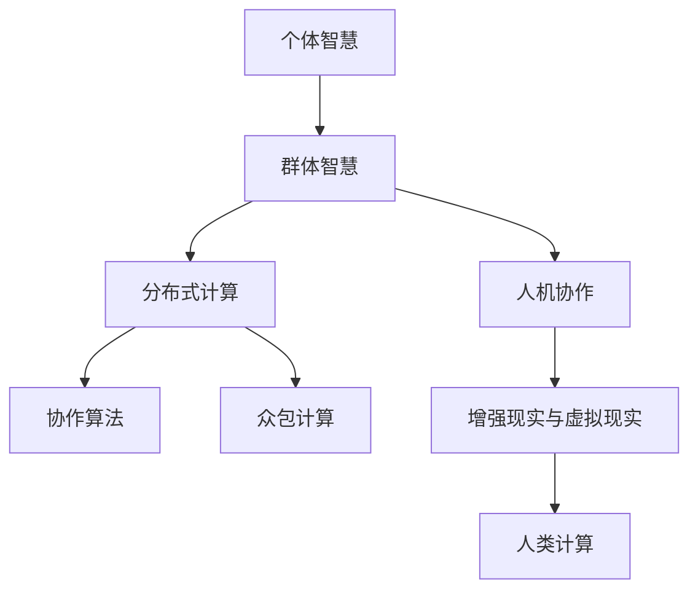

                 

# 群体智慧：人类计算的无限可能

在现代科技飞速发展的时代，我们常常被各式各样的智能设备、大数据和人工智能所环绕。但你知道吗，人类自身的智慧同样是重要的计算资源，它们与机器的智慧相结合，可以创造无限的计算可能性。这篇文章，我们将探索群体智慧的概念，以及如何将其应用于计算，引领我们走向更智能的未来。

## 1. 背景介绍

### 1.1 问题由来

早在古希腊时期，苏格拉底和柏拉图就曾讨论过群体的智慧。他们认为，虽然个体的知识有限，但集体的智慧却能超越单一个体的能力，从而解决复杂问题。现代社会中，这种群体智慧的概念逐渐演变为计算机科学的一部分，尤其是在分布式计算和人工智能领域。

随着互联网和社交媒体的发展，人们越来越意识到个体智慧的累积和放大效应。例如，维基百科就是通过全球众包编辑，不断更新其内容。同样，在人工智能领域，群体的智慧也被用来提高模型的性能和准确性。

### 1.2 问题核心关键点

要理解群体智慧如何应用于计算，首先需要明确几个核心概念：

- **个体智慧**：每个个体拥有的知识、技能和经验。
- **群体智慧**：众多个体智慧的结合，形成更广泛、更深入的知识体系。
- **群体计算**：利用群体智慧，通过分布式计算和协作算法，共同完成计算任务。
- **人类计算**：将人类智慧与计算机结合起来，实现更高效、更智能的计算。
- **人工智能**：利用机器学习等技术，模拟和增强人类的计算能力。

### 1.3 问题研究意义

探索群体智慧和人类计算，对于提升计算效率、降低成本、提高决策准确性等方面具有重要意义：

- **提高效率**：利用群体的智慧，可以快速解决复杂问题，大大缩短计算时间。
- **降低成本**：通过分布式计算和协作，可以降低单个任务所需的计算资源。
- **增强决策能力**：集合个体的智慧，可以获得更全面、更深入的洞察，提升决策质量。
- **促进创新**：在群体计算中，不同背景和经验的人可以共同解决问题，促进新思路的产生。
- **扩展应用范围**：群体智慧可以应用于更多领域，如医疗、教育、金融等，提供全新的解决方案。

## 2. 核心概念与联系

### 2.1 核心概念概述

本节将介绍几个与群体智慧和人类计算相关的核心概念，并展示它们之间的联系。

- **分布式计算**：将一个大型的计算任务分解为多个小任务，由多个计算节点并行执行。
- **协作算法**：在分布式计算中，节点之间通过通信和协作，共同完成任务。
- **众包计算**：利用互联网平台，将计算任务分配给大量分散的个体完成。
- **人机协作**：人类与计算机协同工作，共同完成任务。
- **增强现实与虚拟现实**：通过技术与环境的融合，增强人类的计算能力。

这些概念之间的关系可以通过以下Mermaid流程图来展示：



这个流程图展示了各个概念之间的逻辑关系：个体智慧通过协作、分布式计算和众包计算等手段，汇聚成群体智慧，进而通过人机协作和增强现实等技术，实现更加高效和智能的人类计算。

## 3. 核心算法原理 & 具体操作步骤

### 3.1 算法原理概述

基于群体智慧的人类计算，其核心原理在于利用分布式系统和协作算法，将个体智慧汇聚成群体智慧，从而实现高效的计算。

### 3.2 算法步骤详解

1. **任务分解**：将计算任务分解为多个小任务，每个小任务可以由单个个体或小型团队完成。
2. **任务分配**：将任务分配给不同的个体或团队，确保任务负载均衡。
3. **数据共享**：各个节点共享中间结果和计算数据，以便协同工作。
4. **结果聚合**：将所有节点的计算结果汇总，形成最终输出。
5. **反馈与调整**：根据计算结果和任务进度，不断调整任务分配和资源配置。

### 3.3 算法优缺点

基于群体智慧的人类计算具有以下优点：

- **高效性**：通过分布式计算和协作，可以显著提高计算速度。
- **灵活性**：可以灵活应对各种规模和类型的计算任务。
- **包容性**：可以利用分散在全球的计算资源，跨越地域限制。

但同时，这种计算方式也存在以下缺点：

- **复杂性**：需要设计复杂的协作算法和任务调度策略。
- **通信开销**：节点之间的数据传输和通信会增加额外的计算负担。
- **数据隐私**：分布式计算和协作可能涉及敏感数据的传输和共享，存在隐私风险。

### 3.4 算法应用领域

基于群体智慧的人类计算已经在多个领域得到广泛应用，例如：

- **科学研究**：如气候模拟、基因组学研究等。
- **工程设计**：如机械设计、电路设计等。
- **金融分析**：如风险评估、市场预测等。
- **游戏开发**：如多人在线游戏、实时对战等。
- **网络安全**：如恶意软件检测、网络入侵预防等。
- **医疗诊断**：如疾病诊断、影像分析等。

## 4. 数学模型和公式 & 详细讲解 & 举例说明

### 4.1 数学模型构建

为了更好地理解群体智慧在计算中的应用，我们可以构建一个简单的数学模型来描述分布式计算的效率。

假设有一个大规模的计算任务，需要计算$N$个数据点。如果采用集中式计算，需要$T$个单位时间完成。如果采用分布式计算，将任务分解为$K$个子任务，每个子任务由$M$个个体并行处理，计算速度为$V$。则总的计算时间为：

$$ T_{\text{分布}} = \frac{N}{K} \times M \times V $$

### 4.2 公式推导过程

通过简化计算，我们可以发现，分布式计算的总时间与集中式计算的相比，减少了一个因子$\frac{K}{M}$。这意味着，通过合理分解任务并利用多个个体并行计算，可以将计算时间显著缩短。

### 4.3 案例分析与讲解

考虑一个经典的例子：用于破解RSA算法的计算任务。RSA算法需要一个非常大的质数进行计算，这对单个计算机来说非常耗时。但通过分布式计算，可以将任务分解为多个子任务，由多个计算机并行处理，大大缩短破解时间。

## 5. 项目实践：代码实例和详细解释说明

### 5.1 开发环境搭建

要实践群体智慧在计算中的应用，首先需要搭建一个分布式计算环境。以下是在Python环境下搭建一个简单的分布式计算环境的示例：

1. 安装Python及其依赖包，如Numpy、Scipy等。
2. 安装Dask库，一个用于分布式计算的Python库。
3. 安装MPI库，用于节点之间的通信。
4. 安装PBS、SLURM等任务调度系统，以便在集群上运行分布式任务。

### 5.2 源代码详细实现

以下是一个使用Dask库进行分布式计算的示例代码：

```python
import dask.distributed as dd

# 初始化Dask集群
cluster = dd.Client('localhost:8786')

# 定义计算任务
def compute_task(data):
    # 在此处实现具体的计算逻辑
    return result

# 将数据分解为多个子任务，并提交到Dask集群执行
result = cluster.submit(compute_task, data)

# 获取计算结果
result = cluster.gather(result)
```

### 5.3 代码解读与分析

- `dd.Client('localhost:8786')`：初始化Dask集群，指定集群地址和端口。
- `cluster.submit(compute_task, data)`：将计算任务`compute_task`和输入数据`data`提交到集群，进行分布式计算。
- `cluster.gather(result)`：从集群中获取计算结果。

这个示例展示了如何使用Dask库进行分布式计算。通过将计算任务提交到集群，集群会自动分配计算资源并执行任务，最终返回结果。

### 5.4 运行结果展示

运行上述代码后，你会看到计算结果。如果计算任务足够复杂，你还可以观察到集群的工作负载情况和资源使用情况，以评估分布式计算的效率。

## 6. 实际应用场景

### 6.1 科学研究

在科学研究领域，群体智慧的应用非常广泛。例如，科学家可以利用全球的超级计算机，进行大规模的模拟计算。天文学家可以通过分布式计算，模拟星系形成和演化过程，帮助我们更好地理解宇宙。

### 6.2 工程设计

在工程设计中，分布式计算可以用于模拟复杂系统，如建筑结构、电路设计等。通过分布式计算，可以同时对多个设计方案进行评估，优化设计过程，缩短设计周期。

### 6.3 金融分析

金融领域中的风险评估和市场预测，也可以利用群体智慧和分布式计算进行。通过分布式计算，可以同时处理大量的市场数据，快速得出预测结果，为金融决策提供支持。

### 6.4 未来应用展望

未来，随着技术的进一步发展，群体智慧和人类计算的应用将更加广泛。例如：

- **自动驾驶**：通过分布式计算，实时处理大量传感器数据，优化驾驶决策。
- **智能交通**：通过分布式计算，优化交通信号灯控制，缓解交通拥堵。
- **智慧城市**：通过分布式计算，实时监测城市运行状态，提供智能管理方案。
- **医学影像分析**：通过分布式计算，快速分析大量医学影像，提高诊断准确性。

## 7. 工具和资源推荐

### 7.1 学习资源推荐

为了深入理解群体智慧和人类计算，这里推荐一些优质的学习资源：

1. 《分布式计算原理与实践》：详细介绍了分布式计算的基础原理和实现技术。
2. 《群体智能》：介绍了群体智慧和协作算法的基本概念和应用场景。
3. 《Python并行编程》：介绍了如何使用Python进行分布式计算。
4. 《Dask官方文档》：Dask库的官方文档，提供了详细的教程和示例。
5. 《MPI教程》：MPI库的官方文档，提供了MPI通信的详细教程。

这些资源将帮助读者全面掌握群体智慧和分布式计算的理论和实践技术。

### 7.2 开发工具推荐

实现群体智慧和人类计算的分布式计算任务，需要依赖一些优秀的工具。以下是几款推荐的开发工具：

1. Dask：一个Python库，用于分布式计算和数据处理。
2. MPI：一个跨语言的通信库，用于节点之间的通信。
3. PBS、SLURM：任务调度系统，用于集群管理和任务调度。
4. PyTorch、TensorFlow：深度学习框架，用于协作计算中的深度学习任务。
5. Jupyter Notebook：交互式编程环境，方便调试和测试分布式计算任务。

这些工具可以帮助开发者高效地实现分布式计算任务，提升计算效率。

### 7.3 相关论文推荐

为了进一步深入了解群体智慧和人类计算，以下推荐一些相关的学术论文：

1. "A Survey of Distributed Computing"：全面介绍了分布式计算的发展历程和应用场景。
2. "Group Intelligence"：介绍了群体智慧的基本概念和实现技术。
3. "Parallel Programming in Python"：介绍了如何使用Python进行分布式计算。
4. "Distributed Computing with Dask"：Dask库的官方论文，详细介绍了Dask的实现和应用。
5. "MPI: The Message-Passing Interface"：MPI库的官方论文，介绍了MPI通信的实现和应用。

这些论文将帮助读者深入理解群体智慧和分布式计算的理论和实践技术。

## 8. 总结：未来发展趋势与挑战

### 8.1 研究成果总结

本文系统介绍了基于群体智慧的人类计算的原理和操作步骤，并通过项目实践展示了其实际应用。我们总结了群体智慧和人类计算的研究成果，并分析了其应用前景。

### 8.2 未来发展趋势

展望未来，群体智慧和人类计算将呈现以下几个发展趋势：

1. **技术融合**：群体智慧和人工智能技术的深度融合，将进一步提升计算效率和智能化水平。
2. **跨领域应用**：群体智慧和人类计算将在更多领域得到应用，如智慧医疗、智能交通等。
3. **边缘计算**：将计算任务分散到边缘设备，提升计算效率和数据隐私保护。
4. **自适应计算**：通过自适应算法，动态调整计算资源和任务分配，提升计算效率和灵活性。
5. **隐私保护**：在群体智慧和人类计算中，如何保护数据隐私和安全，将是重要的研究方向。

### 8.3 面临的挑战

尽管群体智慧和人类计算具有广阔的发展前景，但在实际应用中也面临诸多挑战：

1. **复杂性**：分布式计算和协作算法的设计和实现复杂。
2. **通信开销**：节点之间的数据传输和通信增加额外的计算负担。
3. **数据隐私**：分布式计算和协作可能涉及敏感数据的传输和共享，存在隐私风险。
4. **可靠性**：分布式计算系统中，节点故障可能导致计算失败。
5. **资源管理**：如何动态调整计算资源，保持系统高效率运行，仍是一个难题。

### 8.4 研究展望

未来的研究需要在以下几个方面寻求新的突破：

1. **简化协作算法**：开发更简单、更高效的协作算法，降低实现难度。
2. **优化数据传输**：减少节点之间的数据传输量，提高通信效率。
3. **增强隐私保护**：开发隐私保护技术，确保数据安全和隐私。
4. **提升系统可靠性**：设计容错机制，提高系统的可靠性和稳定性。
5. **改进资源管理**：开发自适应资源管理算法，动态调整计算资源分配。

## 9. 附录：常见问题与解答

**Q1：如何保证分布式计算的效率和可靠性？**

A: 保证分布式计算的效率和可靠性需要从多个方面入手：

- **任务分解**：将计算任务分解为多个小任务，确保任务负载均衡。
- **资源管理**：动态调整计算资源，避免资源浪费和过度消耗。
- **容错机制**：设计容错机制，保证单个节点故障不会导致整个系统崩溃。
- **通信优化**：优化数据传输和通信协议，减少通信开销。
- **负载均衡**：使用负载均衡算法，将任务均衡分配到不同节点。

**Q2：如何在分布式计算中保护数据隐私？**

A: 保护数据隐私是分布式计算中一个重要问题。以下是一些常用的隐私保护技术：

- **数据加密**：使用加密技术保护数据传输和存储。
- **匿名化处理**：对数据进行匿名化处理，防止个人隐私泄露。
- **访问控制**：设置严格的访问控制机制，确保只有授权用户才能访问数据。
- **差分隐私**：在数据分析过程中，加入噪声以保护数据隐私。
- **联邦学习**：在分布式计算中，使用联邦学习技术，避免将数据集中存储和处理。

**Q3：分布式计算中如何优化通信开销？**

A: 分布式计算中的通信开销是一个重要的问题，以下是一些优化方法：

- **数据压缩**：使用数据压缩技术，减少数据传输量。
- **通信协议优化**：使用高效的通信协议，减少通信开销。
- **节点聚合**：将多个节点聚合为一个大节点，减少通信次数。
- **局部计算**：尽量在本地节点进行计算，减少通信开销。
- **异步通信**：使用异步通信方式，减少通信等待时间。

**Q4：群体智慧和人类计算有哪些实际应用？**

A: 群体智慧和人类计算已经在多个领域得到广泛应用：

- **科学研究**：如气候模拟、基因组学研究等。
- **工程设计**：如机械设计、电路设计等。
- **金融分析**：如风险评估、市场预测等。
- **游戏开发**：如多人在线游戏、实时对战等。
- **网络安全**：如恶意软件检测、网络入侵预防等。
- **医疗诊断**：如疾病诊断、影像分析等。

本文通过系统介绍基于群体智慧的人类计算，展示了其在科学研究、工程设计、金融分析等多个领域的应用前景。通过深入理解群体智慧和分布式计算的原理和操作步骤，我们可以更好地应对未来计算领域的各种挑战，实现更加智能和高效的计算。

