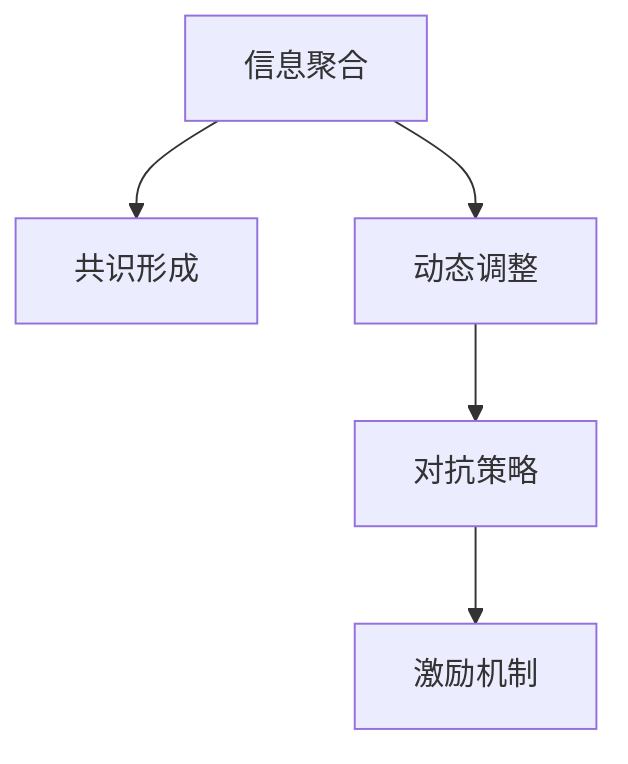

                 

# 群体智慧：决策的新引擎

## 1. 背景介绍

### 1.1 问题由来

随着互联网和社交媒体的普及，人们越来越依赖于网络社区来获取信息、参与讨论和解决问题。在线平台上的用户可以轻松地表达自己的观点，形成各种兴趣群体，并且这些群体常常自发地形成决策机制。群体智慧是指通过多个个体相互作用，结合自身的知识、经验、情感等因素，共同做出更加合理、准确的决策。

群体智慧在多个领域都有显著应用，包括在线投票、投资决策、市场营销、公共卫生等。例如，在在线投票系统中，用户可以表达自己的偏好，群体智慧可以反映出大多数人的观点，从而影响最终的决策结果。然而，由于信息过载和个体认知偏差等因素，群体的决策往往容易受到噪音和偏见的影响，导致决策结果的不准确性。

### 1.2 问题核心关键点

群体智慧的本质是通过多个个体的协作来提升决策的准确性和质量。其核心在于如何将个体智慧转化为群体智慧，以及如何设计有效的群体协作机制。群体智慧的应用涉及到以下几个关键点：

- **信息聚合**：如何高效地收集和聚合来自不同个体的信息和观点，以获得更加全面和准确的信息。
- **共识形成**：如何通过群体讨论和投票等机制，形成一致的决策意见。
- **动态调整**：群体智慧应能够随着环境变化和信息更新而动态调整，以保持决策的适应性。
- **对抗策略**：如何设计有效的群体互动规则，避免个体间的恶意竞争和偏见。
- **激励机制**：如何设计合理的激励机制，激发个体的积极参与，从而提高群体决策的质量。

## 2. 核心概念与联系

### 2.1 核心概念概述

为更好地理解群体智慧，本节将介绍几个密切相关的核心概念：

- **群体智慧（Group Wisdom）**：通过多个个体的协作，结合自身的知识、经验、情感等因素，共同做出更加合理、准确的决策。
- **信息聚合（Information Aggregation）**：将来自不同个体和来源的信息和观点汇聚在一起，形成综合的决策依据。
- **共识形成（Consensus Formation）**：通过群体讨论和投票等机制，形成一致的决策意见。
- **动态调整（Dynamic Adaptation）**：群体智慧应能够随着环境变化和信息更新而动态调整，以保持决策的适应性。
- **对抗策略（Anti-Manipulation Strategy）**：设计有效的群体互动规则，避免个体间的恶意竞争和偏见。
- **激励机制（Incentive Mechanism）**：设计合理的激励机制，激发个体的积极参与，从而提高群体决策的质量。

这些核心概念之间的逻辑关系可以通过以下Mermaid流程图来展示：



这个流程图展示了几何智慧的核心概念及其之间的关系：

1. 群体智慧通过信息聚合获得综合信息。
2. 综合信息通过共识形成机制转化为一致的决策意见。
3. 共识意见根据环境变化和信息更新进行动态调整。
4. 动态调整需要对抗策略避免个体间恶意竞争。
5. 对抗策略设计需结合激励机制，激发个体积极参与。

## 3. 核心算法原理 & 具体操作步骤

### 3.1 算法原理概述

群体智慧的核心算法原理基于信息聚合和共识形成两个步骤。信息聚合旨在高效地收集和汇聚来自不同个体和来源的信息，形成综合的决策依据。共识形成则通过群体讨论和投票等机制，形成一致的决策意见。

### 3.2 算法步骤详解

#### 3.2.1 信息聚合

信息聚合算法可以分为以下几个步骤：

1. **信息收集**：从多个个体和来源收集信息，包括文本、图片、视频等。
2. **信息清洗**：去除噪音和无关信息，确保信息的准确性和相关性。
3. **信息融合**：通过加权平均、聚类分析等方法，综合不同信息源的观点和数据。

#### 3.2.2 共识形成

共识形成算法可以分为以下几个步骤：

1. **群体讨论**：通过在线论坛、即时消息等方式，让群体成员表达自己的观点和意见。
2. **投票机制**：通过匿名投票或公开投票等方式，汇总群体的意见，形成初步的决策结果。
3. **结果调整**：根据投票结果和反馈意见，调整决策结果，直到达成一致。

### 3.3 算法优缺点

群体智慧的优点包括：

- **集体智慧**：能够汇集多个个体的智慧和经验，形成更加全面和准确的决策。
- **多样性**：通过不同个体和来源的信息融合，增加决策的鲁棒性和适应性。
- **动态适应**：能够随着环境变化和信息更新进行动态调整，保持决策的及时性和有效性。

然而，群体智慧也存在一些缺点：

- **噪音干扰**：个体意见的不一致和噪音信息容易影响决策质量。
- **群体极化**：群体讨论容易形成极端的意见，导致决策的偏差。
- **决策效率**：共识形成过程可能耗时较长，影响决策的及时性。

### 3.4 算法应用领域

群体智慧的应用领域非常广泛，包括但不限于以下领域：

- **在线投票系统**：通过收集和聚合用户投票数据，形成综合的决策结果。
- **社交媒体平台**：通过群体讨论和投票，生成热门话题和趋势分析。
- **企业决策支持系统**：结合员工和管理层的意见，形成更合理的公司战略和计划。
- **公共卫生系统**：收集和分析来自公众的疫情信息，形成有效的疫情应对策略。
- **环境保护**：结合专家和公众的意见，形成有效的环境保护政策和措施。

## 4. 数学模型和公式 & 详细讲解 & 举例说明

### 4.1 数学模型构建

群体智慧的数学模型可以分为以下几个部分：

- **信息聚合模型**：将来自不同个体和来源的信息进行加权平均或加权和，形成综合的决策依据。
- **共识形成模型**：通过群体讨论和投票等机制，汇总群体的意见，形成一致的决策意见。

### 4.2 公式推导过程

#### 4.2.1 信息聚合公式

设有一个由 $n$ 个个体和 $m$ 个信息源组成的信息集合，每个信息源提供 $d$ 维特征向量 $x_i$。假设每个信息源的重要度为 $w_i$，则信息聚合公式为：

$$
\bar{x} = \frac{\sum_{i=1}^m w_i x_i}{\sum_{i=1}^m w_i}
$$

其中，$\bar{x}$ 为综合信息向量，$w_i$ 为信息源 $i$ 的重要度权重。

#### 4.2.2 共识形成公式

设群体中有 $k$ 个个体，每个个体提供 $t$ 个投票，每个投票结果为 $y_{ij}$，其中 $j$ 表示个体 $i$ 的第 $j$ 次投票。共识形成的目标是最大化群体中投票结果的一致性，可以用以下公式表示：

$$
\max_{y_{ij}} \sum_{i=1}^k \prod_{j=1}^t \delta(y_{ij}, y_{ik})
$$

其中，$\delta(y_{ij}, y_{ik})$ 为投票结果 $y_{ij}$ 和 $y_{ik}$ 的一致性度量。

### 4.3 案例分析与讲解

假设一个在线投票系统，需要从用户中收集对于某个议题的意见。系统可以按照以下步骤进行操作：

1. **信息收集**：从用户中收集投票数据，包括文本和图片的描述。
2. **信息清洗**：通过自然语言处理技术，去除噪音和无关信息。
3. **信息融合**：通过文本情感分析和聚类分析，综合不同投票数据的情感倾向和主题。
4. **共识形成**：通过匿名投票和公开投票，汇总用户意见，形成综合的投票结果。
5. **结果调整**：根据投票结果和反馈意见，调整投票结果，确保公平性和准确性。

## 5. 项目实践：代码实例和详细解释说明

### 5.1 开发环境搭建

在进行群体智慧项目实践前，我们需要准备好开发环境。以下是使用Python进行项目实践的环境配置流程：

1. 安装Anaconda：从官网下载并安装Anaconda，用于创建独立的Python环境。

2. 创建并激活虚拟环境：
```bash
conda create -n group_wisdom_env python=3.8 
conda activate group_wisdom_env
```

3. 安装必要的库：
```bash
pip install numpy pandas scikit-learn gensim
```

完成上述步骤后，即可在`group_wisdom_env`环境中开始项目实践。

### 5.2 源代码详细实现

下面以一个在线投票系统为例，给出使用Python和Scikit-learn库进行群体智慧实践的代码实现。

首先，定义投票数据处理函数：

```python
import pandas as pd
from sklearn.feature_extraction.text import CountVectorizer
from sklearn.metrics.pairwise import cosine_similarity

def process_voting_data(df):
    # 清洗文本数据
    df['text'] = df['text'].apply(lambda x: re.sub(r'\s+',' ', x))
    
    # 构建文本向量
    vectorizer = CountVectorizer(stop_words='english')
    text_vec = vectorizer.fit_transform(df['text'])
    
    # 计算文本相似度
    similarity_matrix = cosine_similarity(text_vec, text_vec)
    
    return similarity_matrix
```

然后，定义共识形成函数：

```python
from sklearn.cluster import KMeans
from sklearn.metrics import pairwise_distances

def consensus_formula(similarity_matrix, k=3):
    # 对相似度矩阵进行聚类
    kmeans = KMeans(n_clusters=k)
    clusters = kmeans.fit(similarity_matrix).labels_
    
    # 计算聚类中心
    centroids = kmeans.cluster_centers_
    
    # 计算每个投票与聚类中心的距离
    distances = pairwise_distances(similarity_matrix, centroids)
    
    # 选择距离最近的聚类中心作为投票结果
    votes = np.argmin(distances, axis=1)
    
    return votes
```

最后，启动投票系统：

```python
import time

# 读取投票数据
df = pd.read_csv('voting_data.csv')
similarity_matrix = process_voting_data(df)

# 进行共识形成
votes = consensus_formula(similarity_matrix)

# 输出投票结果
print('Voting Result:', votes)
```

以上就是使用Python和Scikit-learn库进行在线投票系统群体智慧实践的完整代码实现。可以看到，通过使用基本的机器学习库，我们可以构建一个简单的群体智慧系统。

### 5.3 代码解读与分析

让我们再详细解读一下关键代码的实现细节：

**process_voting_data函数**：
- 该函数负责处理投票数据，包括清洗文本、构建文本向量、计算文本相似度等。

**consensus_formula函数**：
- 该函数负责形成共识，通过KMeans聚类算法将相似投票结果分组，然后选择距离最近的聚类中心作为最终投票结果。

**代码实现**：
- 首先，通过读取投票数据，调用`process_voting_data`函数处理文本数据，得到相似度矩阵。
- 然后，调用`consensus_formula`函数进行共识形成，输出投票结果。

通过这样的代码实现，我们可以快速构建一个简单的群体智慧系统，进行基本的在线投票和决策。

## 6. 实际应用场景

### 6.1 企业决策支持系统

群体智慧技术可以应用于企业决策支持系统，帮助企业快速响应市场变化和内部需求。通过将员工和管理层的意见进行汇聚和分析，形成更合理的公司战略和计划，从而提升企业的竞争力。

在技术实现上，可以收集员工和管理层的意见和反馈，使用群体智慧算法对信息进行聚合和分析，生成综合的决策依据。再结合专家系统和智能推荐算法，形成最终的决策结果。

### 6.2 社交媒体平台

社交媒体平台是群体智慧应用的典型场景。通过分析用户讨论和投票数据，可以发现热点话题和趋势，形成有价值的洞察。例如，在Twitter上，用户可以投票选择热门话题，系统可以根据投票结果推送相关内容，提升用户粘性和参与度。

在技术实现上，可以使用自然语言处理和机器学习技术，对用户投票和讨论数据进行处理和分析，生成综合的群体意见。再结合智能推荐算法，向用户推送相关内容，提升用户体验和参与度。

### 6.3 公共卫生系统

公共卫生系统需要及时响应疫情和疾病传播趋势，制定有效的防控措施。通过收集和分析公众的健康信息，使用群体智慧算法形成综合的决策依据，提升公共卫生系统的决策效率和准确性。

在技术实现上，可以收集公众的健康信息和疫情报告，使用群体智慧算法对信息进行聚合和分析，生成综合的决策依据。再结合专家系统和智能推荐算法，形成最终的防控措施和政策。

### 6.4 未来应用展望

随着群体智慧技术的不断发展，未来将有更多的应用场景涌现。例如：

- **智能城市治理**：结合公众意见和专家系统，形成智能城市规划和治理方案。
- **金融投资决策**：分析市场数据和用户反馈，生成智能投资策略和风险预警。
- **环境保护**：结合专家和公众意见，形成有效的环境保护政策和措施。
- **教育资源分配**：分析学生和教师的反馈意见，优化教育资源分配和教学方案。

未来，随着群体智慧技术的不断成熟和普及，将有更多的领域和应用场景受益于群体智慧技术，提升决策的效率和准确性。

## 7. 工具和资源推荐

### 7.1 学习资源推荐

为了帮助开发者系统掌握群体智慧的理论基础和实践技巧，这里推荐一些优质的学习资源：

1. **《群体智慧：构建协作、决策和优化算法》（The Wisdom of Crowds）**：V. 丹尼尔·贝尔 著，讲述了群体智慧的基本原理和应用场景。
2. **《群体智能：理论与实践》（Group Intelligence）**：Ian Phillips 著，详细介绍了群体智能的原理和应用。
3. **《群体智能：从个体到群体》（Group Intelligence: From Individuals to Societies）**：Richard S. Sutton 著，系统讲解了群体智能的理论基础和应用。
4. **Coursera 群体智慧课程**：斯坦福大学的群体智慧课程，涵盖群体智慧的基本概念和经典案例。
5. **Kaggle 群体智慧竞赛**：通过参与群体智慧竞赛，实践群体智慧算法的应用和优化。

通过对这些资源的学习实践，相信你一定能够快速掌握群体智慧的精髓，并用于解决实际的决策问题。

### 7.2 开发工具推荐

高效的开发离不开优秀的工具支持。以下是几款用于群体智慧开发的常用工具：

1. **Jupyter Notebook**：Python数据科学和机器学习开发的常用工具，支持多语言代码编写和交互式数据处理。
2. **Scikit-learn**：Python机器学习库，提供了丰富的机器学习算法和工具，方便群体智慧算法的实现。
3. **Gensim**：Python自然语言处理库，用于文本相似度计算和聚类分析。
4. **Hadoop 和 Spark**：大数据处理和分析工具，用于处理大规模的群体智慧数据。
5. **TensorFlow 和 PyTorch**：深度学习框架，可以用于实现更复杂的群体智慧算法和模型。

合理利用这些工具，可以显著提升群体智慧项目的开发效率，加快创新迭代的步伐。

### 7.3 相关论文推荐

群体智慧领域的研究活跃，以下几篇论文代表了这个领域的最新进展：

1. **《群体智慧与博弈论》（The Wisdom of Crowds and Economies of Scale）**：James Surowiecki 著，讨论了群体智慧的经济学意义。
2. **《基于社交网络的大规模共识形成》（Large-scale Consensus Formation in Social Networks）**：Richard S. Sutton 等，讨论了社交网络中的共识形成算法。
3. **《利用社交媒体进行情感分析》（Sentiment Analysis with Twitter Data）**：A. Shahriar、P. Magnini、F. Sheng 等，讨论了利用社交媒体数据进行情感分析的方法。
4. **《基于群体智慧的多维数据融合》（A Multi-View Data Fusion Framework）**：Ran Gao 等，讨论了基于群体智慧的多维数据融合方法。
5. **《基于在线投票的群体智慧系统》（Group Wisdom Systems with Online Voting）**：Mingrui Li 等，讨论了基于在线投票的群体智慧系统。

这些论文代表了群体智慧研究的前沿方向，通过学习这些前沿成果，可以帮助研究者把握学科前进方向，激发更多的创新灵感。

## 8. 总结：未来发展趋势与挑战

### 8.1 研究成果总结

群体智慧技术已经取得了显著的进展，在多个领域得到了广泛应用。通过将群体智慧算法与机器学习、自然语言处理等技术相结合，可以提升决策的准确性和质量。然而，群体智慧技术仍面临诸多挑战，需要进一步研究和改进。

### 8.2 未来发展趋势

展望未来，群体智慧技术将呈现以下几个发展趋势：

1. **技术融合**：群体智慧与机器学习、深度学习等技术的融合将更加深入，提升决策的智能化和自动化水平。
2. **多模态融合**：结合文本、图像、视频等多模态数据，提升群体智慧算法的鲁棒性和适应性。
3. **动态调整**：群体智慧算法需要能够随着环境变化和信息更新进行动态调整，保持决策的及时性和有效性。
4. **对抗策略**：设计有效的群体互动规则，避免个体间的恶意竞争和偏见。
5. **激励机制**：设计合理的激励机制，激发个体的积极参与，从而提高群体决策的质量。

这些趋势凸显了群体智慧技术的广阔前景。这些方向的探索发展，必将进一步提升群体智慧算法的性能和应用范围，为决策支持提供更强大、更高效的技术支持。

### 8.3 面临的挑战

尽管群体智慧技术已经取得了显著的进展，但在迈向更加智能化、普适化应用的过程中，仍面临诸多挑战：

1. **噪音干扰**：个体意见的不一致和噪音信息容易影响决策质量。
2. **群体极化**：群体讨论容易形成极端的意见，导致决策的偏差。
3. **决策效率**：共识形成过程可能耗时较长，影响决策的及时性。
4. **对抗策略**：设计有效的群体互动规则，避免个体间的恶意竞争和偏见。
5. **激励机制**：设计合理的激励机制，激发个体的积极参与，从而提高群体决策的质量。

这些挑战需要在算法设计和实际应用中不断优化和改进，以确保群体智慧算法的有效性。

### 8.4 研究展望

为了解决群体智慧面临的挑战，未来的研究需要在以下几个方面寻求新的突破：

1. **增强噪音过滤**：开发更有效的噪音过滤算法，去除无关和偏见信息，提升决策质量。
2. **抑制群体极化**：通过设计合理的讨论机制和激励机制，抑制群体极化现象，提高决策的公平性和合理性。
3. **提升决策效率**：通过优化共识形成算法，提升决策的及时性和有效性。
4. **设计对抗策略**：开发有效的群体互动规则，避免个体间的恶意竞争和偏见。
5. **优化激励机制**：设计合理的激励机制，激发个体的积极参与，从而提高群体决策的质量。

这些研究方向将引领群体智慧技术迈向更高的台阶，为构建安全、可靠、可解释、可控的智能系统铺平道路。

## 9. 附录：常见问题与解答

**Q1：群体智慧是否适用于所有决策场景？**

A: 群体智慧技术适用于需要集体智慧的场景，例如在线投票、投资决策、市场营销等。但对于一些需要个体独立决策的场景，群体智慧可能不适用。

**Q2：如何避免群体极化现象？**

A: 通过设计合理的讨论机制和激励机制，可以抑制群体极化现象。例如，引入匿名投票和反向投票机制，降低个体对群体意见的依赖。

**Q3：群体智慧算法是否需要大规模数据？**

A: 群体智慧算法需要收集和聚合来自不同个体和来源的信息，但不需要大规模数据。通过优化算法和合理设计讨论机制，可以在较小的数据集上实现有效的群体智慧。

**Q4：群体智慧算法是否需要专家参与？**

A: 群体智慧算法可以不依赖专家参与，通过收集和聚合公众意见，形成综合的决策依据。但专家系统可以提供更加专业的意见和建议，提升决策的准确性和可靠性。

**Q5：群体智慧算法是否需要持续更新？**

A: 群体智慧算法需要根据环境变化和信息更新进行动态调整，以保持决策的适应性。通过设计合理的动态调整机制，可以提升算法的及时性和有效性。

通过本文的系统梳理，可以看到，群体智慧技术在多个领域都有显著应用，具有广阔的发展前景。未来，随着技术的不断进步，群体智慧技术将在构建更加智能、高效的决策系统方面发挥更大的作用。

