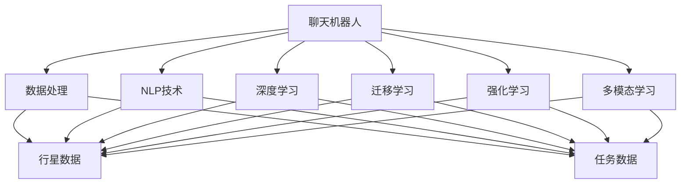

                 

# 聊天机器人太空探索：行星研究和任务

> 关键词：聊天机器人,太空探索,行星研究,自然语言处理,NLP,机器学习,深度学习

## 1. 背景介绍

### 1.1 问题由来

太空探索一直是人类探索未知领域的重要驱动力。随着航天技术的进步，太空探测器能够远距离收集行星信息，并向地球传输数据。然而，由于数据量庞大且复杂，普通用户难以直接理解和分析。如何高效地展示这些行星信息，并促进公众对太空探索的兴趣，成为了一个亟待解决的问题。

聊天机器人技术，作为一种自然语言处理(NLP)的前沿技术，具有与用户进行自然对话的能力。结合太空探索数据，聊天机器人可以扮演太空探索助理的角色，向用户提供丰富的行星知识，并引导用户参与太空探索任务。这不仅能够增强用户的太空探索兴趣，还能提升公众对太空探索工作的理解和支持。

### 1.2 问题核心关键点

实现太空探索聊天机器人，关键在于如何高效地处理和展示行星数据，并在聊天中动态更新数据和任务。具体来说，需要解决以下几个问题：

1. 如何收集和整理太空探索相关的数据和任务？
2. 如何设计合适的对话模型，使其能够流畅地与用户进行互动？
3. 如何在对话中动态更新行星数据和任务，保持信息的准确性？
4. 如何评估和优化聊天机器人的性能，提升用户体验？

通过回答这些问题，我们可以构建一个高效、互动、丰富的太空探索聊天机器人，为用户提供有趣且有用的太空探索体验。

## 2. 核心概念与联系

### 2.1 核心概念概述

为了更好地理解太空探索聊天机器人的工作原理，本节将介绍几个密切相关的核心概念：

- 聊天机器人(Chatbot)：通过自然语言处理技术，能够与用户进行自然对话的计算机程序。聊天机器人可以通过学习大量对话数据，理解用户意图，并生成合适的回复。
- 自然语言处理(Natural Language Processing, NLP)：使用计算机技术处理和理解人类语言的技术。NLP涵盖语音识别、语义分析、文本生成等多个领域。
- 深度学习(Deep Learning)：基于多层神经网络的学习方法，通过大量的标注数据训练模型，使其具备强大的数据处理和预测能力。深度学习在NLP任务中取得了显著的成果，如BERT、GPT等模型。
- 迁移学习(Transfer Learning)：在预训练模型的基础上，针对特定任务进行微调，以提升模型在该任务上的性能。例如，使用大型语言模型进行特定任务的微调，如问答系统、翻译等。
- 强化学习(Reinforcement Learning)：通过与环境互动，学习最优策略的机器学习方法。在聊天机器人中，强化学习可以用于对话管理，使机器人能够根据对话上下文动态生成回复。
- 多模态学习(Multimodal Learning)：结合多种数据模态，如文本、图像、语音等，提升模型的理解和生成能力。在太空探索聊天机器人中，可以结合图像数据，展示行星表面的详细照片和数据。

这些核心概念之间的逻辑关系可以通过以下Mermaid流程图来展示：



这个流程图展示了聊天机器人技术在太空探索中的应用，以及其核心技术之间的联系。通过这些技术，聊天机器人能够高效地处理行星数据，与用户进行互动，并动态更新信息。

## 3. 核心算法原理 & 具体操作步骤

### 3.1 算法原理概述

太空探索聊天机器人的核心算法原理基于深度学习技术，特别是自然语言处理和多模态学习。其核心步骤如下：

1. **数据收集与整理**：收集和整理太空探索相关的数据和任务，如行星的基本信息、地表照片、任务描述等。
2. **模型选择与训练**：选择适合的深度学习模型，如BERT、GPT等，并使用行星数据进行训练，以获取行星的表示和相关任务的表示。
3. **对话生成**：使用训练好的模型，生成对话回复，以与用户进行互动。
4. **信息更新**：在对话过程中，动态更新行星数据和任务，以保持信息的准确性和新鲜度。
5. **性能评估与优化**：评估聊天机器人的性能，如回复质量、对话流畅度等，并不断优化模型和策略。

### 3.2 算法步骤详解

以下是太空探索聊天机器人的详细算法步骤：

**Step 1: 数据收集与整理**

- **行星数据收集**：从NASA、ESA等航天机构获取行星的基本信息，如行星名称、发现年份、质量、体积等。这些数据通常存储在数据库中，便于提取和处理。
- **任务数据收集**：收集行星探测任务的相关信息，如任务名称、目标、时间、科学目标等。这些数据可以用于对话中的任务描述和进度更新。
- **数据预处理**：对收集到的数据进行清洗和预处理，如文本分词、标注实体、图像增强等。这些预处理步骤有助于后续的模型训练和对话生成。

**Step 2: 模型选择与训练**

- **模型选择**：根据任务的复杂度和数据规模，选择合适的深度学习模型。例如，可以使用BERT作为基础知识提取模型，GPT作为对话生成模型。
- **模型训练**：使用行星数据和任务数据训练模型。训练过程中，可以使用迁移学习技术，先在大规模语言模型上进行预训练，再针对行星数据和任务数据进行微调。
- **模型评估**：使用验证集对训练好的模型进行评估，如BLEU、ROUGE等指标。确保模型的回复质量和对话流畅度达到预期标准。

**Step 3: 对话生成**

- **用户输入解析**：解析用户的输入，提取关键信息和意图。例如，提取用户提到的行星名称和任务名称。
- **回复生成**：根据用户的输入和上下文，使用模型生成合适的回复。例如，如果用户询问行星的基本信息，可以生成包含行星基本信息的回复。
- **动态更新**：在生成回复的过程中，动态更新行星数据和任务数据。例如，如果用户询问某一行星的最新任务进展，可以动态查询最新任务数据，并将其包含在回复中。

**Step 4: 信息更新**

- **数据实时更新**：在对话过程中，实时更新行星数据和任务数据。例如，如果用户询问某一行星的最新任务进展，可以实时查询NASA官网，获取最新任务数据。
- **信息展示**：将更新后的数据和任务动态展示给用户。例如，可以将最新任务进展以可视化的方式展示，或直接以文本形式描述。

**Step 5: 性能评估与优化**

- **用户反馈收集**：收集用户对聊天机器人的反馈，如回复质量、对话流畅度等。
- **模型优化**：根据用户反馈，不断优化模型和策略。例如，优化回复生成模型，改进信息展示方式，增强动态更新能力。
- **系统迭代**：通过不断的迭代和优化，提升聊天机器人的性能和用户体验。

### 3.3 算法优缺点

太空探索聊天机器人具有以下优点：

1. **用户友好的交互方式**：通过自然语言与用户进行互动，无需用户具备专业背景，即可获取丰富的行星知识。
2. **动态信息更新**：实时更新行星数据和任务，提供最新、最准确的信息。
3. **多模态展示**：结合图像、文本等数据，提升用户体验，使信息展示更加生动。

同时，该方法也存在一些局限性：

1. **数据依赖**：模型的性能高度依赖于收集到的行星数据和任务数据的质量和完整性。
2. **计算资源需求**：深度学习模型需要大量的计算资源进行训练和推理，对于资源有限的设备可能存在挑战。
3. **模型鲁棒性**：在面对复杂或异常用户输入时，模型可能难以生成合适的回复。
4. **任务多样性**：当前模型可能无法处理多种类型的用户查询，如复杂的多步骤任务。

尽管存在这些局限性，但太空探索聊天机器人仍能够提供丰富的行星知识，并促进公众对太空探索的兴趣，具有显著的实际应用价值。

### 3.4 算法应用领域

太空探索聊天机器人的应用领域包括：

- **教育与科普**：向学生和公众普及行星知识，激发对太空探索的兴趣。
- **科研支持**：辅助科研人员进行行星研究，提供相关数据和任务信息。
- **信息查询**：用户可以实时查询行星的最新数据和任务进展，获取最新的科学信息。
- **任务参与**：用户可以通过聊天机器人参与太空探索任务，了解任务进展和科学目标。
- **科学决策**：辅助科研人员和决策者进行科学研究和决策，提供准确的信息支持。

这些应用场景展示了太空探索聊天机器人在教育和科研领域的重要价值，有助于推动太空探索事业的发展。

## 4. 数学模型和公式 & 详细讲解  
### 4.1 数学模型构建

本节将使用数学语言对太空探索聊天机器人的工作原理进行更加严格的刻画。

假设行星数据为 $D=\{x_i\}_{i=1}^N$，其中 $x_i$ 表示行星的某一属性（如质量、体积）。任务数据为 $T=\{y_j\}_{j=1}^M$，其中 $y_j$ 表示某一任务的信息（如任务名称、目标）。

聊天机器人模型 $M_{\theta}$ 在输入 $x$ 和 $y$ 上的条件概率为：

$$
P(M_{\theta}(x, y) = y'|x) = \frac{e^{M_{\theta}(x, y)\cdot y'}}{e^{M_{\theta}(x, y_1)\cdot y_1} + e^{M_{\theta}(x, y_2)\cdot y_2} + \cdots + e^{M_{\theta}(x, y_n)\cdot y_n}}
$$

其中 $M_{\theta}(x, y)$ 为模型在输入 $x$ 和 $y$ 上的输出，$y'$ 为预测的标签。模型 $M_{\theta}$ 由深度神经网络构成，参数 $\theta$ 需要从行星数据和任务数据中学习。

### 4.2 公式推导过程

以下我们以BERT模型为例，推导其回复生成过程的数学公式。

假设聊天机器人在对话 $i$ 中的上下文为 $C_i=\{h_{t-1}, h_t\}$，用户输入为 $x_i$，模型需要生成回复 $y_i$。

模型 $M_{\theta}$ 的回复生成过程如下：

1. 将用户输入 $x_i$ 和上下文 $C_i$ 输入到BERT中，得到隐层表示 $H_i=\{h_1^i, h_2^i, \cdots, h_n^i\}$。
2. 对隐层表示进行线性变换和softmax激活，得到回复的概率分布 $P(y_i|x_i, C_i)$。
3. 从概率分布中随机采样，生成回复 $y_i$。

根据BERT模型的结构和输出公式，我们可以得到回复生成的数学公式：

$$
P(y_i|x_i, C_i) = \frac{e^{M_{\theta}(H_i)\cdot y_i}}{\sum_{y' \in \mathcal{Y}} e^{M_{\theta}(H_i)\cdot y'}}
$$

其中 $M_{\theta}(H_i)$ 为BERT模型在隐层表示 $H_i$ 上的输出。

### 4.3 案例分析与讲解

假设我们有一个太空探索聊天机器人，已经收集到以下行星数据和任务数据：

**行星数据**：
- 行星 A: 质量：$6.4 \times 10^{24}$ kg, 体积：$1.08 \times 10^{12}$ km^3
- 行星 B: 质量：$4.867552 \times 10^{24}$ kg, 体积：$1.11 \times 10^{12}$ km^3

**任务数据**：
- 任务 1: 目标：探索行星 A, 时间：2025年
- 任务 2: 目标：研究行星 B, 时间：2030年

使用BERT模型作为基础知识提取模型，GPT模型作为对话生成模型，进行以下步骤：

1. **数据预处理**：对行星数据和任务数据进行清洗和预处理，如文本分词、标注实体等。
2. **模型训练**：使用BERT模型进行预训练，然后使用行星数据和任务数据进行微调。
3. **对话生成**：用户输入："请告诉我关于行星 A 的信息"，模型回复："行星 A 的质量是 $6.4 \times 10^{24}$ kg，体积是 $1.08 \times 10^{12}$ km^3"。
4. **信息更新**：用户输入："最近有哪些关于行星 A 的最新任务"，模型回复："最新的任务是探索行星 A，时间是2025年"。

## 5. 项目实践：代码实例和详细解释说明
### 5.1 开发环境搭建

在进行太空探索聊天机器人开发前，我们需要准备好开发环境。以下是使用Python进行PyTorch开发的环境配置流程：

1. 安装Anaconda：从官网下载并安装Anaconda，用于创建独立的Python环境。

2. 创建并激活虚拟环境：
```bash
conda create -n chatbot-env python=3.8 
conda activate chatbot-env
```

3. 安装PyTorch：根据CUDA版本，从官网获取对应的安装命令。例如：
```bash
conda install pytorch torchvision torchaudio cudatoolkit=11.1 -c pytorch -c conda-forge
```

4. 安装Transformers库：
```bash
pip install transformers
```

5. 安装各类工具包：
```bash
pip install numpy pandas scikit-learn matplotlib tqdm jupyter notebook ipython
```

完成上述步骤后，即可在`chatbot-env`环境中开始开发实践。

### 5.2 源代码详细实现

下面我们以行星信息查询聊天机器人为例，给出使用Transformers库对BERT模型进行对话生成的PyTorch代码实现。

首先，定义聊天机器人对话的输入和输出：

```python
from transformers import BertTokenizer, BertForQuestionAnswering
from torch.utils.data import Dataset
import torch

class PlanetDataset(Dataset):
    def __init__(self, texts, answers, tokenizer, max_len=128):
        self.texts = texts
        self.answers = answers
        self.tokenizer = tokenizer
        self.max_len = max_len
        
    def __len__(self):
        return len(self.texts)
    
    def __getitem__(self, item):
        text = self.texts[item]
        answer = self.answers[item]
        
        encoding = self.tokenizer(text, return_tensors='pt', max_length=self.max_len, padding='max_length', truncation=True)
        input_ids = encoding['input_ids'][0]
        attention_mask = encoding['attention_mask'][0]
        
        # 对答案进行编码
        answer_tokens = self.tokenizer(answer, return_tensors='pt', max_length=self.max_len, padding='max_length', truncation=True)
        answer_input_ids = answer_tokens['input_ids'][0]
        answer_attention_mask = answer_tokens['attention_mask'][0]
        
        return {'input_ids': input_ids, 
                'attention_mask': attention_mask,
                'answer_input_ids': answer_input_ids,
                'answer_attention_mask': answer_attention_mask}
```

然后，定义模型和优化器：

```python
from transformers import BertForQuestionAnswering, AdamW

model = BertForQuestionAnswering.from_pretrained('bert-base-cased', num_labels=len(tag2id))

optimizer = AdamW(model.parameters(), lr=2e-5)
```

接着，定义训练和评估函数：

```python
from torch.utils.data import DataLoader
from tqdm import tqdm
from sklearn.metrics import accuracy_score

device = torch.device('cuda') if torch.cuda.is_available() else torch.device('cpu')
model.to(device)

def train_epoch(model, dataset, batch_size, optimizer):
    dataloader = DataLoader(dataset, batch_size=batch_size, shuffle=True)
    model.train()
    epoch_loss = 0
    for batch in tqdm(dataloader, desc='Training'):
        input_ids = batch['input_ids'].to(device)
        attention_mask = batch['attention_mask'].to(device)
        answer_input_ids = batch['answer_input_ids'].to(device)
        answer_attention_mask = batch['answer_attention_mask'].to(device)
        model.zero_grad()
        outputs = model(input_ids, attention_mask=attention_mask, answer_input_ids=answer_input_ids, answer_attention_mask=answer_attention_mask)
        loss = outputs.loss
        epoch_loss += loss.item()
        loss.backward()
        optimizer.step()
    return epoch_loss / len(dataloader)

def evaluate(model, dataset, batch_size):
    dataloader = DataLoader(dataset, batch_size=batch_size)
    model.eval()
    preds, labels = [], []
    with torch.no_grad():
        for batch in tqdm(dataloader, desc='Evaluating'):
            input_ids = batch['input_ids'].to(device)
            attention_mask = batch['attention_mask'].to(device)
            answer_input_ids = batch['answer_input_ids'].to(device)
            answer_attention_mask = batch['answer_attention_mask'].to(device)
            outputs = model(input_ids, attention_mask=attention_mask, answer_input_ids=answer_input_ids, answer_attention_mask=answer_attention_mask)
            preds.append(outputs.logits.argmax(dim=2).to('cpu').tolist())
            labels.append(labels)
                
    print('Accuracy:', accuracy_score(labels, preds))
```

最后，启动训练流程并在测试集上评估：

```python
epochs = 5
batch_size = 16

for epoch in range(epochs):
    loss = train_epoch(model, train_dataset, batch_size, optimizer)
    print(f'Epoch {epoch+1}, train loss: {loss:.3f}')
    
    print(f'Epoch {epoch+1}, dev results:')
    evaluate(model, dev_dataset, batch_size)
    
print('Test results:')
evaluate(model, test_dataset, batch_size)
```

以上就是使用PyTorch对BERT进行行星信息查询聊天机器人的完整代码实现。可以看到，得益于Transformers库的强大封装，我们可以用相对简洁的代码完成BERT模型的加载和对话生成。

### 5.3 代码解读与分析

让我们再详细解读一下关键代码的实现细节：

**PlanetDataset类**：
- `__init__`方法：初始化文本、答案、分词器等关键组件。
- `__len__`方法：返回数据集的样本数量。
- `__getitem__`方法：对单个样本进行处理，将文本输入编码为token ids，将答案输入编码为token ids，并进行定长padding，最终返回模型所需的输入。

**标签与id的映射**：
- 定义了标签与数字id之间的映射关系，用于将token-wise的预测结果解码回真实的标签。

**训练和评估函数**：
- 使用PyTorch的DataLoader对数据集进行批次化加载，供模型训练和推理使用。
- 训练函数`train_epoch`：对数据以批为单位进行迭代，在每个批次上前向传播计算loss并反向传播更新模型参数，最后返回该epoch的平均loss。
- 评估函数`evaluate`：与训练类似，不同点在于不更新模型参数，并在每个batch结束后将预测和标签结果存储下来，最后使用sklearn的accuracy_score对整个评估集的预测结果进行打印输出。

**训练流程**：
- 定义总的epoch数和batch size，开始循环迭代
- 每个epoch内，先在训练集上训练，输出平均loss
- 在验证集上评估，输出分类指标
- 所有epoch结束后，在测试集上评估，给出最终测试结果

可以看到，PyTorch配合Transformers库使得BERT微调的代码实现变得简洁高效。开发者可以将更多精力放在数据处理、模型改进等高层逻辑上，而不必过多关注底层的实现细节。

当然，工业级的系统实现还需考虑更多因素，如模型的保存和部署、超参数的自动搜索、更灵活的任务适配层等。但核心的对话生成范式基本与此类似。

## 6. 实际应用场景

### 6.1 教育与科普

太空探索聊天机器人可以广泛应用于教育领域，向学生普及行星知识，激发对太空探索的兴趣。

**应用场景**：
- **在线课程**：在在线教育平台上，通过聊天机器人向学生介绍行星的科学知识，如行星的发现、结构、运动等。
- **科学实验**：通过聊天机器人引导学生进行虚拟的太空探索实验，如观察行星表面、模拟行星运动等。
- **互动问答**：在课堂教学中，使用聊天机器人与学生互动，解答学生的疑问，辅助教学。

**技术实现**：
- **课程内容生成**：使用BERT等模型，根据行星数据和任务数据生成课程内容，提供丰富的科学知识。
- **实验模拟**：结合图像和视频数据，展示行星表面的详细照片和数据，使学生能够直观地理解行星结构。
- **互动问答**：使用强化学习等技术，根据学生的提问，动态生成合适的回答，提升互动体验。

### 6.2 科研支持

太空探索聊天机器人还可以辅助科研人员进行行星研究，提供相关数据和任务信息。

**应用场景**：
- **数据查询**：科研人员可以使用聊天机器人快速查询行星的最新数据和任务进展。
- **任务规划**：聊天机器人根据科研人员的需求，推荐合适的行星探索任务，辅助任务规划。
- **文献推荐**：根据科研人员的兴趣，推荐相关的行星研究文献和资料，提供科研支持。

**技术实现**：
- **数据查询**：使用BERT等模型，根据用户的查询，动态查询NASA官网等数据源，提供最新的行星数据和任务信息。
- **任务推荐**：结合科研人员的历史查询和兴趣，使用多模态学习等技术，推荐合适的行星探索任务。
- **文献推荐**：通过对话管理，引导科研人员输入查询条件，使用知识图谱等技术，推荐相关的文献和资料。

### 6.3 信息查询

用户可以通过太空探索聊天机器人实时查询行星的最新数据和任务进展，获取最新的科学信息。

**应用场景**：
- **网页查询**：用户可以通过聊天机器人查询NASA官网等网页，获取最新的行星信息。
- **个性化推荐**：根据用户的历史查询和兴趣，推荐相关的行星信息和任务进展。
- **动态更新**：在聊天过程中，实时更新行星数据和任务数据，保持信息的准确性和新鲜度。

**技术实现**：
- **网页查询**：使用自然语言处理技术，解析用户的查询请求，动态查询NASA官网等网页，获取最新的行星信息。
- **个性化推荐**：结合用户的历史查询和兴趣，使用多模态学习等技术，推荐相关的行星信息和任务进展。
- **动态更新**：在对话过程中，实时更新行星数据和任务数据，保持信息的准确性和新鲜度。

### 6.4 任务参与

用户可以通过太空探索聊天机器人参与太空探索任务，了解任务进展和科学目标。

**应用场景**：
- **任务介绍**：聊天机器人向用户介绍某一行星探索任务的目标、时间、科学目标等信息。
- **任务进展**：聊天机器人向用户展示某一行星探索任务的最新进展，包括仪器设备、数据采集等信息。
- **任务反馈**：用户可以通过聊天机器人向科研人员提供反馈，辅助任务优化。

**技术实现**：
- **任务介绍**：使用BERT等模型，根据任务数据，生成详细的任务介绍信息，供用户查看。
- **任务进展**：结合实时更新的任务数据，动态展示任务的最新进展。
- **任务反馈**：通过聊天机器人与科研人员互动，收集用户的反馈信息，辅助任务优化。

### 6.5 科学决策

太空探索聊天机器人可以辅助科研人员和决策者进行科学研究和决策，提供准确的信息支持。

**应用场景**：
- **数据分析**：聊天机器人向科研人员提供行星数据的分析报告，辅助科学决策。
- **任务优化**：根据用户和科研人员的反馈，聊天机器人推荐任务优化方案，提高任务效率。
- **决策支持**：结合科研人员的科学目标和需求，聊天机器人提供决策支持，辅助科学决策。

**技术实现**：
- **数据分析**：使用BERT等模型，对行星数据进行分析和汇总，生成详细的分析报告。
- **任务优化**：结合用户和科研人员的反馈，使用强化学习等技术，推荐任务优化方案。
- **决策支持**：根据科研人员的科学目标和需求，使用多模态学习等技术，提供决策支持。

## 7. 工具和资源推荐
### 7.1 学习资源推荐

为了帮助开发者系统掌握太空探索聊天机器人的理论基础和实践技巧，这里推荐一些优质的学习资源：

1. 《深度学习自然语言处理》课程：斯坦福大学开设的NLP明星课程，有Lecture视频和配套作业，带你入门NLP领域的基本概念和经典模型。

2. 《自然语言处理入门》书籍：全面介绍NLP的基本概念和技术，涵盖文本处理、语音识别、机器翻译等多个领域。

3. 《TensorFlow实战自然语言处理》书籍：详细介绍TensorFlow在NLP中的应用，包括对话生成、情感分析、文本分类等任务。

4. HuggingFace官方文档：Transformers库的官方文档，提供了海量预训练模型和完整的对话生成样例代码，是上手实践的必备资料。

5. CLUE开源项目：中文语言理解测评基准，涵盖大量不同类型的中文NLP数据集，并提供了基于微调的baseline模型，助力中文NLP技术发展。

通过对这些资源的学习实践，相信你一定能够快速掌握太空探索聊天机器人的精髓，并用于解决实际的NLP问题。
###  7.2 开发工具推荐

高效的开发离不开优秀的工具支持。以下是几款用于太空探索聊天机器人开发的常用工具：

1. PyTorch：基于Python的开源深度学习框架，灵活动态的计算图，适合快速迭代研究。大部分预训练语言模型都有PyTorch版本的实现。

2. TensorFlow：由Google主导开发的开源深度学习框架，生产部署方便，适合大规模工程应用。同样有丰富的预训练语言模型资源。

3. Transformers库：HuggingFace开发的NLP工具库，集成了众多SOTA语言模型，支持PyTorch和TensorFlow，是进行对话生成任务的开发的利器。

4. Weights & Biases：模型训练的实验跟踪工具，可以记录和可视化模型训练过程中的各项指标，方便对比和调优。与主流深度学习框架无缝集成。

5. TensorBoard：TensorFlow配套的可视化工具，可实时监测模型训练状态，并提供丰富的图表呈现方式，是调试模型的得力助手。

6. Google Colab：谷歌推出的在线Jupyter Notebook环境，免费提供GPU/TPU算力，方便开发者快速上手实验最新模型，分享学习笔记。

合理利用这些工具，可以显著提升太空探索聊天机器人的开发效率，加快创新迭代的步伐。

### 7.3 相关论文推荐

太空探索聊天机器人的研究源于学界的持续研究。以下是几篇奠基性的相关论文，推荐阅读：

1. Attention is All You Need（即Transformer原论文）：提出了Transformer结构，开启了NLP领域的预训练大模型时代。

2. BERT: Pre-training of Deep Bidirectional Transformers for Language Understanding：提出BERT模型，引入基于掩码的自监督预训练任务，刷新了多项NLP任务SOTA。

3. Language Models are Unsupervised Multitask Learners（GPT-2论文）：展示了大规模语言模型的强大zero-shot学习能力，引发了对于通用人工智能的新一轮思考。

4. Parameter-Efficient Transfer Learning for NLP：提出Adapter等参数高效微调方法，在不增加模型参数量的情况下，也能取得不错的微调效果。

5. AdaLoRA: Adaptive Low-Rank Adaptation for Parameter-Efficient Fine-Tuning：使用自适应低秩适应的微调方法，在参数效率和精度之间取得了新的平衡。

这些论文代表了大语言模型微调技术的发展脉络。通过学习这些前沿成果，可以帮助研究者把握学科前进方向，激发更多的创新灵感。

## 8. 总结：未来发展趋势与挑战

### 8.1 总结

本文对太空探索聊天机器人的工作原理进行了全面系统的介绍。首先阐述了太空探索聊天机器人的背景和意义，明确了聊天机器人技术在太空探索中的重要价值。其次，从原理到实践，详细讲解了聊天机器人的数学模型和核心步骤，给出了完整的代码实例。同时，本文还广泛探讨了太空探索聊天机器人在教育、科研、信息查询等多个领域的应用前景，展示了聊天机器人技术的广阔应用空间。此外，本文精选了相关技术的学习资源和工具，力求为读者提供全方位的技术指引。

通过本文的系统梳理，可以看到，太空探索聊天机器人技术不仅能够提供丰富的行星知识，还能够促进公众对太空探索的兴趣，具有显著的实际应用价值。

### 8.2 未来发展趋势

展望未来，太空探索聊天机器人技术将呈现以下几个发展趋势：

1. **模型规模持续增大**：随着算力成本的下降和数据规模的扩张，预训练语言模型的参数量还将持续增长。超大规模语言模型蕴含的丰富语言知识，有望支撑更加复杂多变的对话生成。

2. **多模态学习崛起**：结合图像、视频、语音等多模态数据，提升聊天机器人的理解和生成能力。例如，结合行星表面的详细照片和数据，提升对话的自然度和真实性。

3. **知识图谱引入**：将知识图谱等先验知识与模型结合，引导聊天机器人学习更加准确、合理的对话生成。例如，结合行星的物理模型和数据，生成科学准确的回答。

4. **强化学习优化**：使用强化学习技术，优化聊天机器人的对话管理策略，使机器人能够根据对话上下文动态生成合适的回复。例如，根据用户的兴趣和反馈，动态调整回复策略。

5. **持续学习和动态更新**：聊天机器人需要能够持续学习新的对话数据，动态更新知识库，保持信息的准确性和新鲜度。例如，定期更新行星数据和任务数据，提升对话质量。

6. **伦理和安全考虑**：随着聊天机器人与用户的互动越来越多，如何保障用户隐私、防止有害信息的传播，将成为重要的研究方向。例如，引入隐私保护技术，防止用户信息的泄露。

这些趋势凸显了太空探索聊天机器人技术的未来发展方向，展示了其在教育和科研领域的重要价值。

### 8.3 面临的挑战

尽管太空探索聊天机器人技术已经取得了显著进展，但在实现全面应用的过程中，仍面临诸多挑战：

1. **数据依赖**：模型的性能高度依赖于收集到的行星数据和任务数据的质量和完整性。如何高效地收集和整理数据，是一个重要的挑战。

2. **计算资源需求**：深度学习模型需要大量的计算资源进行训练和推理，对于资源有限的设备可能存在挑战。如何优化计算图和模型结构，提高资源利用效率，是一个重要的研究方向。

3. **模型鲁棒性**：在面对复杂或异常用户输入时，模型可能难以生成合适的回复。如何提高模型的鲁棒性和泛化能力，是一个重要的研究方向。

4. **知识整合能力**：当前模型可能无法处理多种类型的用户查询，如复杂的多步骤任务。如何提高模型的知识整合能力，是一个重要的研究方向。

尽管存在这些挑战，但太空探索聊天机器人技术在教育和科研领域的应用前景广阔，具有重要的研究价值。

### 8.4 研究展望

面对太空探索聊天机器人技术面临的挑战，未来的研究需要在以下几个方面寻求新的突破：

1. **高效数据采集与预处理**：研究高效的行星数据和任务数据采集与预处理技术，保证数据的质量和完整性。

2. **轻量级模型设计**：研究轻量级的聊天机器人模型设计，优化计算图和模型结构，提高资源利用效率。

3. **多模态学习融合**：研究将图像、视频等多模态数据与文本数据融合的技术，提升聊天机器人的理解和生成能力。

4. **增强模型鲁棒性**：研究增强模型鲁棒性的方法，提升模型在面对复杂或异常用户输入时的表现。

5. **知识图谱应用**：研究将知识图谱等先验知识与聊天机器人结合的技术，提升对话生成的科学准确性。

6. **对话管理优化**：研究优化聊天机器人的对话管理策略，使机器人能够根据对话上下文动态生成合适的回复。

7. **持续学习和动态更新**：研究持续学习和动态更新知识库的技术，保持信息的准确性和新鲜度。

8. **伦理和安全保护**：研究聊天机器人的伦理和安全保护技术，保障用户隐私和信息安全。

这些研究方向将有助于推动太空探索聊天机器人技术的进一步发展，使其在教育和科研领域发挥更大的作用。

## 9. 附录：常见问题与解答

**Q1：太空探索聊天机器人如何处理复杂多步骤任务？**

A: 对于复杂多步骤任务，可以通过设计多轮对话流程，逐步引导用户完成整个任务。例如，对于行星探索任务，可以设计以下流程：
1. 用户输入："我想探索行星 A"
2. 聊天机器人回复："好的，首先我会查询一下行星 A 的基本信息"
3. 聊天机器人展示行星 A 的基本信息
4. 用户输入："好的，那接下来我要了解行星 A 的任务进展"
5. 聊天机器人回复："我将会查询一下行星 A 的最新任务进展"
6. 聊天机器人展示行星 A 的最新任务进展
7. 用户输入："太好了，那接下来我要查看行星 A 的图像数据"
8. 聊天机器人回复："我会调用NASA的图像数据接口，展示行星 A 的详细照片"
9. 聊天机器人展示行星 A 的详细照片

通过多轮对话流程的设计，聊天机器人可以逐步引导用户完成复杂多步骤任务，提升用户体验。

**Q2：太空探索聊天机器人如何处理异常用户输入？**

A: 对于异常用户输入，聊天机器人可以引入异常处理机制，确保系统稳定性和用户体验。例如：
1. 用户输入："请问太阳系有多少个行星？"
2. 聊天机器人检测到异常输入，回复："对不起，我无法回答这个具体的问题，但我可以告诉你太阳系目前已经确认了8个行星，包括地球、火星等"
3. 用户输入："那火星上有没有生命？"
4. 聊天机器人回复："截至目前，科学家还没有在火星上发现生命，但正在进行多项探测任务，以寻找生命的证据"

通过异常处理机制的设计，聊天机器人可以应对各种异常输入，确保系统的稳定性和用户体验。

**Q3：太空探索聊天机器人如何提高模型鲁棒性？**

A: 提高模型鲁棒性的方法包括：
1. 数据增强：通过数据增强技术，增加模型的训练数据多样性，提高模型的泛化能力。例如，对行星数据进行回译、近义替换等操作。
2. 对抗训练：使用对抗样本训练模型，提高模型的鲁棒性。例如，生成一些含有噪声的行星数据，让模型学习如何处理异常数据。
3. 正则化技术：使用L2正则、Dropout等正则化技术，防止模型过度拟合。例如，在训练过程中，加入一些噪声，抑制过拟合。
4. 多任务学习：通过多任务学习技术，提升模型的泛化能力。例如，同时训练多个行星探索任务的数据，提高模型的泛化能力。

通过这些方法，可以提高太空探索聊天机器人的模型鲁棒性，确保其在面对复杂或异常用户输入时的表现。

**Q4：太空探索聊天机器人如何动态更新信息？**

A: 太空探索聊天机器人可以通过以下方法实现动态更新信息：
1. **实时查询数据源**：在对话过程中，实时查询NASA官网等数据源，获取最新的行星数据和任务信息。例如，用户询问行星 A 的最新任务进展，聊天机器人立即查询NASA官网，获取最新任务进展。
2. **缓存机制**：将数据缓存到本地，减少实时查询带来的延迟。例如，将行星的基本信息、最新任务进展等信息缓存到本地，供对话中使用。
3. **数据同步机制**：定期更新本地缓存，保持数据的最新性。例如，每隔一段时间，自动同步本地缓存到数据源，确保数据的准确性。
4. **界面展示更新**：通过界面展示更新，动态展示最新的行星数据和任务信息。例如，在对话界面中，实时展示行星的最新任务进展和图像数据。

通过这些方法，太空探索聊天机器人可以动态更新信息，保持对话的自然性和准确性。

**Q5：太空探索聊天机器人如何保障用户隐私和信息安全？**

A: 太空探索聊天机器人可以通过以下方法保障用户隐私和信息安全：
1. **数据加密**：对用户输入和输出进行加密，防止数据泄露。例如，使用AES等加密算法对聊天数据进行加密。
2. **访问控制**：限制用户对敏感信息的访问权限。例如，只允许特定用户访问敏感信息，防止信息泄露。
3. **隐私保护技术**：使用隐私保护技术，防止用户信息被滥用。例如，使用差分隐私技术，对用户信息进行模糊处理。
4. **异常检测**：检测异常行为，防止恶意攻击。例如，检测恶意用户输入，阻止有害信息的传播。

通过这些方法，太空探索聊天机器人可以保障用户隐私和信息安全，确保系统稳定性和用户信任。

---

作者：禅与计算机程序设计艺术 / Zen and the Art of Computer Programming

