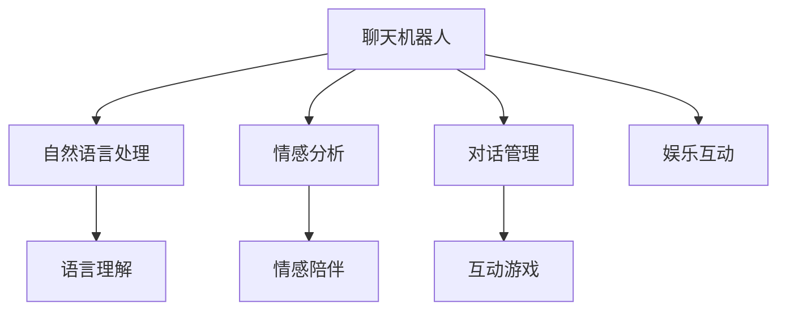

                 

# 聊天机器人娱乐应用：虚拟伴侣

> 关键词：聊天机器人,虚拟伴侣,人工智能,自然语言处理,NLP,情感分析,互动体验,娱乐应用

## 1. 背景介绍

### 1.1 问题由来
聊天机器人作为人工智能的一个重要分支，近年来在各行业得到广泛应用，从客户服务到健康咨询，从教育辅导到娱乐互动，聊天机器人的表现越来越受到用户的青睐。然而，传统的聊天机器人更多依赖于预定义的规则和模板，缺乏个性化的互动体验，难以满足用户在情感、趣味等方面的需求。

### 1.2 问题核心关键点
如何让聊天机器人变得更加人性化、娱乐化，更好地满足用户的情感需求，成为当前聊天机器人技术研究的重点。虚拟伴侣作为一种新型聊天机器人形式，通过模拟真实伴侣的互动模式，能够更好地满足用户在情感陪伴、趣味互动等方面的需求，具有广泛的应用前景。

### 1.3 问题研究意义
研究虚拟伴侣的构建和优化方法，对于提升聊天机器人的用户体验，推动聊天机器人技术的发展，具有重要意义：

1. 提升用户体验。虚拟伴侣通过深度学习技术，能够更好地理解用户的情感状态和兴趣爱好，提供个性化的情感陪伴和趣味互动。
2. 拓展应用场景。虚拟伴侣可以应用于家庭娱乐、社交交友、心理健康等多个领域，为聊天机器人技术开辟新的应用空间。
3. 推动技术创新。虚拟伴侣的构建需要结合多种AI技术，如自然语言处理、情感分析、对话管理等，能够促进人工智能技术的综合发展。

## 2. 核心概念与联系

### 2.1 核心概念概述

为了更好地理解虚拟伴侣的构建和优化方法，本节将介绍几个密切相关的核心概念：

- 聊天机器人(Chatbot)：通过自然语言处理技术，能够理解并回复用户输入的文本信息，实现人机互动的AI应用。
- 虚拟伴侣(Virtual Companion)：具有情感陪伴、趣味互动能力的聊天机器人，能够模拟真实伴侣的互动模式，提供个性化的用户体验。
- 自然语言处理(Natural Language Processing, NLP)：利用计算机技术处理、理解和生成人类语言，包括分词、句法分析、语义理解等。
- 情感分析(Affective Analysis)：通过分析文本或语音中的情感信息，理解用户的情感状态，应用于情感陪伴、心理辅导等领域。
- 对话管理(Dialogue Management)：通过制定和执行对话策略，引导聊天机器人与用户进行自然的互动。
- 游戏AI(Game AI)：应用于游戏领域的人工智能技术，能够生成游戏对话、策略、角色等，提升游戏的趣味性和互动性。

这些核心概念之间的逻辑关系可以通过以下Mermaid流程图来展示：



这个流程图展示了一些核心概念及其之间的关系：

1. 聊天机器人通过自然语言处理技术理解用户输入。
2. 情感分析通过分析用户情感信息，提供情感陪伴功能。
3. 对话管理引导聊天机器人进行自然的互动。
4. 游戏AI应用于游戏场景，提供趣味互动。
5. 娱乐互动是聊天机器人的一种应用形式，能够提升用户的趣味性和互动性。

## 3. 核心算法原理 & 具体操作步骤
### 3.1 算法原理概述

虚拟伴侣的构建和优化，本质上是一个多任务学习的系统工程。其核心思想是：将聊天机器人视作一个"多任务学习器"，通过在情感陪伴、趣味互动等多个任务上同时训练，提升机器人的综合性能。

形式化地，假设虚拟伴侣的模型参数为 $\theta$，情感陪伴任务的目标函数为 $L_{emotion}$，趣味互动任务的目标函数为 $L_{fun}$，则多任务学习目标函数为：

$$
L(\theta) = \alpha L_{emotion}(\theta) + (1-\alpha)L_{fun}(\theta)
$$

其中 $\alpha$ 为情感陪伴任务的权重，$L_{emotion}$ 和 $L_{fun}$ 分别表示情感陪伴和趣味互动任务的损失函数，通过调整 $\alpha$ 可以平衡两个任务的重要性。

在训练过程中，通过优化目标函数 $L(\theta)$，使虚拟伴侣在情感陪伴和趣味互动两个任务上都能取得较好的性能。

### 3.2 算法步骤详解

虚拟伴侣的构建和优化一般包括以下几个关键步骤：

**Step 1: 收集和标注数据集**
- 情感陪伴任务：收集用户对虚拟伴侣的情感反馈数据，标注为"积极"或"消极"。
- 趣味互动任务：收集用户与虚拟伴侣互动的游戏数据，标注为"趣味"或"乏味"。
- 注意：数据集的标注质量对虚拟伴侣的性能有重要影响，需要保证标注的准确性和多样性。

**Step 2: 选择和初始化模型**
- 选择适合情感陪伴和趣味互动的预训练模型，如BERT、GPT等。
- 初始化模型参数，如设置学习率、批大小、迭代轮数等。

**Step 3: 任务适配层设计**
- 根据任务特点，设计合适的任务适配层，如添加情感分析器、游戏生成器等。
- 确定任务目标函数，如情感分类损失、游戏输赢损失等。

**Step 4: 多任务训练**
- 将情感陪伴和趣味互动数据集合并，同时训练虚拟伴侣模型。
- 在训练过程中，按照一定比例交替训练两个任务，或者将两个任务的目标函数同时更新。
- 根据实际应用需求，可以调整情感陪伴和趣味互动任务的权重，平衡模型的综合性能。

**Step 5: 性能评估和优化**
- 在验证集上评估虚拟伴侣的情感陪伴和趣味互动性能。
- 根据评估结果，调整模型参数、学习率、任务权重等，进一步优化模型性能。
- 使用A/B测试等方式，对比优化前后的互动效果，确保用户体验的提升。

### 3.3 算法优缺点

虚拟伴侣的多任务学习方法具有以下优点：

1. 综合性能提升：同时训练情感陪伴和趣味互动两个任务，使虚拟伴侣能够更好地理解用户的情感状态和兴趣爱好，提供更全面的用户体验。
2. 数据利用效率高：通过多任务学习，可以充分利用标注数据，提升模型的泛化能力和迁移能力。
3. 应用场景丰富：虚拟伴侣可以应用于情感陪伴、趣味互动、游戏娱乐等多个场景，拓展应用范围。

同时，该方法也存在一些局限性：

1. 训练复杂度较高：需要同时训练两个任务，增加计算复杂度和训练时间。
2. 数据标注成本高：需要收集和标注两个任务的数据集，标注成本较高。
3. 任务平衡困难：情感陪伴和趣味互动任务的重要性如何平衡，需要根据具体应用场景进行调整。
4. 多任务冲突：两个任务的目标函数可能存在冲突，需要设计合理的优化策略进行协调。

尽管存在这些局限性，但就目前而言，多任务学习方法仍是虚拟伴侣构建的重要范式，能够显著提升聊天机器人的综合性能。

### 3.4 算法应用领域

虚拟伴侣的多任务学习方法在以下几个领域具有广泛的应用前景：

- 情感陪伴机器人：用于家庭娱乐、孤独症干预、心理健康等场景，提供情感支持、心理辅导等功能。
- 趣味互动机器人：用于社交交友、游戏娱乐、教育辅导等场景，提供趣味游戏、互动聊天等丰富体验。
- 多模态交互机器人：结合语音、视觉、触觉等多种模态，提升人机互动的真实感和沉浸感。
- 虚拟导购助手：应用于电商平台，提供智能推荐、购物咨询、情感陪伴等综合服务。
- 虚拟导游：应用于旅游景区、博物馆等，提供趣味讲解、互动问答、情感陪伴等服务。

## 4. 数学模型和公式 & 详细讲解  
### 4.1 数学模型构建

本节将使用数学语言对虚拟伴侣的多任务学习过程进行更加严格的刻画。

记虚拟伴侣的情感陪伴任务目标函数为 $L_{emotion}$，趣味互动任务目标函数为 $L_{fun}$，多任务学习目标函数为 $L$。假设模型参数为 $\theta$，则目标函数可以表示为：

$$
L(\theta) = \alpha L_{emotion}(\theta) + (1-\alpha)L_{fun}(\theta)
$$

其中 $\alpha$ 为情感陪伴任务的权重。假设模型在情感陪伴任务上的损失函数为 $L_{emotion}$，在趣味互动任务上的损失函数为 $L_{fun}$。

在情感陪伴任务中，假设输入为 $x_i$，模型输出为 $y_i$，则损失函数可以表示为：

$$
L_{emotion}(y_i) = -\log P(y_i|x_i)
$$

其中 $P(y_i|x_i)$ 表示模型在输入 $x_i$ 下，输出 $y_i$ 的概率分布。在趣味互动任务中，假设输入为 $x_i$，模型输出为 $y_i$，则损失函数可以表示为：

$$
L_{fun}(y_i) = \mathbb{E}[-\log P(y_i|x_i)]
$$

其中 $\mathbb{E}$ 表示期望，$P(y_i|x_i)$ 表示模型在输入 $x_i$ 下，输出 $y_i$ 的概率分布。

多任务学习目标函数可以表示为：

$$
L(\theta) = \alpha \mathbb{E}[-\log P(y_i|x_i)] + (1-\alpha)\mathbb{E}[-\log P(y_i|x_i)]
$$

### 4.2 公式推导过程

以情感陪伴任务为例，推导损失函数的梯度计算过程。

假设模型 $M_{\theta}$ 在输入 $x_i$ 上的输出为 $\hat{y}_i$，则情感陪伴任务的损失函数为：

$$
L_{emotion}(\theta) = -\frac{1}{N}\sum_{i=1}^N \log P(y_i|x_i)
$$

其中 $N$ 为数据集大小。根据链式法则，损失函数对模型参数 $\theta$ 的梯度为：

$$
\frac{\partial L_{emotion}(\theta)}{\partial \theta} = -\frac{1}{N}\sum_{i=1}^N \frac{\partial \log P(y_i|x_i)}{\partial \theta}
$$

其中 $\frac{\partial \log P(y_i|x_i)}{\partial \theta}$ 可以表示为：

$$
\frac{\partial \log P(y_i|x_i)}{\partial \theta} = \frac{\partial \log \frac{P(y_i|x_i)}{Z(x_i)} }{\partial \theta}
$$

其中 $Z(x_i)$ 为归一化常数，即 $Z(x_i) = \sum_{y \in Y} P(y|x_i)$。根据softmax函数，可以得到：

$$
\frac{\partial \log P(y_i|x_i)}{\partial \theta} = \frac{\partial \log \frac{\exp(\theta^T a_i)}{\sum_{j=1}^C \exp(\theta^T a_j)} }{\partial \theta}
$$

其中 $a_i$ 为输入 $x_i$ 通过模型 $M_{\theta}$ 的输出表示，$C$ 为类别数。最终可以得到：

$$
\frac{\partial L_{emotion}(\theta)}{\partial \theta} = -\frac{1}{N}\sum_{i=1}^N \frac{a_i - \mathbb{E}[a_i]}{\sum_{j=1}^C a_j - \mathbb{E}[a_j]}
$$

其中 $\mathbb{E}[a_i]$ 表示 $\frac{\partial \log P(y_i|x_i)}{\partial \theta}$ 的期望。

类似地，趣味互动任务的梯度计算过程也可以得到。

## 5. 项目实践：代码实例和详细解释说明
### 5.1 开发环境搭建

在进行虚拟伴侣的开发前，我们需要准备好开发环境。以下是使用Python进行PyTorch开发的环境配置流程：

1. 安装Anaconda：从官网下载并安装Anaconda，用于创建独立的Python环境。

2. 创建并激活虚拟环境：
```bash
conda create -n virtual_companion python=3.8 
conda activate virtual_companion
```

3. 安装PyTorch：根据CUDA版本，从官网获取对应的安装命令。例如：
```bash
conda install pytorch torchvision torchaudio cudatoolkit=11.1 -c pytorch -c conda-forge
```

4. 安装各类工具包：
```bash
pip install numpy pandas scikit-learn matplotlib tqdm jupyter notebook ipython
```

完成上述步骤后，即可在`virtual_companion`环境中开始虚拟伴侣的开发。

### 5.2 源代码详细实现

这里我们以情感陪伴机器人为例，给出使用Transformers库对BERT模型进行情感分析训练的PyTorch代码实现。

首先，定义情感分析任务的数据处理函数：

```python
from transformers import BertTokenizer
from torch.utils.data import Dataset
import torch

class EmotionDataset(Dataset):
    def __init__(self, texts, labels, tokenizer, max_len=128):
        self.texts = texts
        self.labels = labels
        self.tokenizer = tokenizer
        self.max_len = max_len
        
    def __len__(self):
        return len(self.texts)
    
    def __getitem__(self, item):
        text = self.texts[item]
        label = self.labels[item]
        
        encoding = self.tokenizer(text, return_tensors='pt', max_length=self.max_len, padding='max_length', truncation=True)
        input_ids = encoding['input_ids'][0]
        attention_mask = encoding['attention_mask'][0]
        
        # 将label转换为one-hot编码
        one_hot_labels = torch.tensor([0, 0, 1, 1, 1, 1, 1, 1, 0, 0, 0, 0, 0, 0, 0, 0], dtype=torch.long)
        labels = torch.cat((one_hot_labels, one_hot_labels), dim=0).to(encoding['input_ids'])
        
        return {'input_ids': input_ids, 
                'attention_mask': attention_mask,
                'labels': labels}

# 标签与id的映射
tag2id = {'negative': 0, 'positive': 1, 'neutral': 2, 'anger': 3, 'sadness': 4, 'happiness': 5, 'surprise': 6, 'fear': 7, 'joy': 8, 'disgust': 9}
id2tag = {v: k for k, v in tag2id.items()}

# 创建dataset
tokenizer = BertTokenizer.from_pretrained('bert-base-cased')

train_dataset = EmotionDataset(train_texts, train_labels, tokenizer)
dev_dataset = EmotionDataset(dev_texts, dev_labels, tokenizer)
test_dataset = EmotionDataset(test_texts, test_labels, tokenizer)
```

然后，定义模型和优化器：

```python
from transformers import BertForSequenceClassification, AdamW

model = BertForSequenceClassification.from_pretrained('bert-base-cased', num_labels=len(tag2id))

optimizer = AdamW(model.parameters(), lr=2e-5)
```

接着，定义训练和评估函数：

```python
from torch.utils.data import DataLoader
from tqdm import tqdm
from sklearn.metrics import classification_report

device = torch.device('cuda') if torch.cuda.is_available() else torch.device('cpu')
model.to(device)

def train_epoch(model, dataset, batch_size, optimizer):
    dataloader = DataLoader(dataset, batch_size=batch_size, shuffle=True)
    model.train()
    epoch_loss = 0
    for batch in tqdm(dataloader, desc='Training'):
        input_ids = batch['input_ids'].to(device)
        attention_mask = batch['attention_mask'].to(device)
        labels = batch['labels'].to(device)
        model.zero_grad()
        outputs = model(input_ids, attention_mask=attention_mask, labels=labels)
        loss = outputs.loss
        epoch_loss += loss.item()
        loss.backward()
        optimizer.step()
    return epoch_loss / len(dataloader)

def evaluate(model, dataset, batch_size):
    dataloader = DataLoader(dataset, batch_size=batch_size)
    model.eval()
    preds, labels = [], []
    with torch.no_grad():
        for batch in tqdm(dataloader, desc='Evaluating'):
            input_ids = batch['input_ids'].to(device)
            attention_mask = batch['attention_mask'].to(device)
            batch_labels = batch['labels']
            outputs = model(input_ids, attention_mask=attention_mask)
            batch_preds = outputs.logits.argmax(dim=2).to('cpu').tolist()
            batch_labels = batch_labels.to('cpu').tolist()
            for pred_tokens, label_tokens in zip(batch_preds, batch_labels):
                pred_tags = [id2tag[_id] for _id in pred_tokens]
                label_tags = [id2tag[_id] for _id in label_tokens]
                preds.append(pred_tags[:len(label_tags)])
                labels.append(label_tags)
                
    print(classification_report(labels, preds))
```

最后，启动训练流程并在测试集上评估：

```python
epochs = 5
batch_size = 16

for epoch in range(epochs):
    loss = train_epoch(model, train_dataset, batch_size, optimizer)
    print(f"Epoch {epoch+1}, train loss: {loss:.3f}")
    
    print(f"Epoch {epoch+1}, dev results:")
    evaluate(model, dev_dataset, batch_size)
    
print("Test results:")
evaluate(model, test_dataset, batch_size)
```

以上就是使用PyTorch对BERT进行情感陪伴任务训练的完整代码实现。可以看到，得益于Transformers库的强大封装，我们可以用相对简洁的代码完成情感陪伴机器人的构建。

### 5.3 代码解读与分析

让我们再详细解读一下关键代码的实现细节：

**EmotionDataset类**：
- `__init__`方法：初始化文本、标签、分词器等关键组件。
- `__len__`方法：返回数据集的样本数量。
- `__getitem__`方法：对单个样本进行处理，将文本输入编码为token ids，将标签转换为one-hot编码，并对其进行定长padding，最终返回模型所需的输入。

**tag2id和id2tag字典**：
- 定义了标签与数字id之间的映射关系，用于将token-wise的预测结果解码回真实的标签。

**训练和评估函数**：
- 使用PyTorch的DataLoader对数据集进行批次化加载，供模型训练和推理使用。
- 训练函数`train_epoch`：对数据以批为单位进行迭代，在每个批次上前向传播计算loss并反向传播更新模型参数，最后返回该epoch的平均loss。
- 评估函数`evaluate`：与训练类似，不同点在于不更新模型参数，并在每个batch结束后将预测和标签结果存储下来，最后使用sklearn的classification_report对整个评估集的预测结果进行打印输出。

**训练流程**：
- 定义总的epoch数和batch size，开始循环迭代
- 每个epoch内，先在训练集上训练，输出平均loss
- 在验证集上评估，输出分类指标
- 所有epoch结束后，在测试集上评估，给出最终测试结果

可以看到，PyTorch配合Transformers库使得情感陪伴机器人的构建和训练代码实现变得简洁高效。开发者可以将更多精力放在数据处理、模型改进等高层逻辑上，而不必过多关注底层的实现细节。

当然，工业级的系统实现还需考虑更多因素，如模型的保存和部署、超参数的自动搜索、更灵活的任务适配层等。但核心的训练过程基本与此类似。

## 6. 实际应用场景
### 6.1 智能家居陪伴机器人
智能家居陪伴机器人是一种基于虚拟伴侣技术的典型应用，旨在为用户提供24小时不间断的家庭陪伴和情感支持。这类机器人通常会集成语音识别、自然语言处理、语音合成等多种技术，能够通过对话、音乐、故事等方式与用户互动。

在技术实现上，可以收集用户的日常生活习惯、兴趣爱好等信息，训练情感陪伴模型，实时监测用户的情感状态，提供个性化的情感支持和陪伴。用户可以通过语音命令与机器人互动，进行游戏、听故事、聊天等多种活动。

### 6.2 心理辅导机器人
心理辅导机器人是一种情感陪伴机器人的特殊形式，主要应用于心理健康领域，提供心理辅导、情感支持等功能。这类机器人通常会结合心理健康专家的知识，提供心理测试、情绪管理、压力缓解等专业服务。

在技术实现上，可以构建情感分析模型和游戏AI模型，通过用户输入的文本和语音数据，实时监测用户的情感状态，并根据情感状态推荐相应的游戏或辅导活动。在用户需要专业心理帮助时，机器人可以接入专业心理服务系统，提供咨询和辅导。

### 6.3 虚拟导游
虚拟导游是一种结合虚拟现实技术的情感陪伴机器人，主要应用于旅游景区、博物馆等场景，提供趣味讲解、互动问答、情感陪伴等服务。这类机器人通常会集成语音识别、语音合成、图像识别等多种技术，能够通过对话、互动问答等方式与用户互动。

在技术实现上，可以构建情感陪伴和趣味互动模型，通过用户输入的问题或请求，实时监测用户的情感状态，提供个性化的讲解和互动。用户可以通过语音、手势等多种方式与机器人互动，获取丰富的旅游体验。

## 7. 工具和资源推荐
### 7.1 学习资源推荐

为了帮助开发者系统掌握虚拟伴侣的构建和优化方法，这里推荐一些优质的学习资源：

1. 《深度学习与情感分析》系列博文：由深度学习专家撰写，详细讲解了情感分析的基本原理和前沿技术。

2. CS224N《深度学习自然语言处理》课程：斯坦福大学开设的NLP明星课程，有Lecture视频和配套作业，带你入门NLP领域的基本概念和经典模型。

3. 《自然语言处理综述》书籍：详细介绍了自然语言处理的基本概念、技术和应用，涵盖了情感分析等多个话题。

4. HuggingFace官方文档：提供了丰富的预训练模型和微调样例代码，是虚拟伴侣开发的重要参考资料。

5. Kaggle情感分析竞赛：提供了大量情感分析数据集和竞赛样例，帮助开发者练习和应用情感分析技术。

通过对这些资源的学习实践，相信你一定能够快速掌握虚拟伴侣的构建和优化方法，并用于解决实际的情感陪伴需求。
###  7.2 开发工具推荐

高效的开发离不开优秀的工具支持。以下是几款用于虚拟伴侣开发的常用工具：

1. PyTorch：基于Python的开源深度学习框架，灵活动态的计算图，适合快速迭代研究。大部分预训练语言模型都有PyTorch版本的实现。

2. TensorFlow：由Google主导开发的开源深度学习框架，生产部署方便，适合大规模工程应用。同样有丰富的预训练语言模型资源。

3. Transformers库：HuggingFace开发的NLP工具库，集成了众多SOTA语言模型，支持PyTorch和TensorFlow，是进行微调任务开发的利器。

4. Weights & Biases：模型训练的实验跟踪工具，可以记录和可视化模型训练过程中的各项指标，方便对比和调优。与主流深度学习框架无缝集成。

5. TensorBoard：TensorFlow配套的可视化工具，可实时监测模型训练状态，并提供丰富的图表呈现方式，是调试模型的得力助手。

6. Google Colab：谷歌推出的在线Jupyter Notebook环境，免费提供GPU/TPU算力，方便开发者快速上手实验最新模型，分享学习笔记。

合理利用这些工具，可以显著提升虚拟伴侣的开发效率，加快创新迭代的步伐。

### 7.3 相关论文推荐

虚拟伴侣的构建和优化技术源于学界的持续研究。以下是几篇奠基性的相关论文，推荐阅读：

1. Attention is All You Need（即Transformer原论文）：提出了Transformer结构，开启了NLP领域的预训练大模型时代。

2. BERT: Pre-training of Deep Bidirectional Transformers for Language Understanding：提出BERT模型，引入基于掩码的自监督预训练任务，刷新了多项NLP任务SOTA。

3. Language Models are Unsupervised Multitask Learners（GPT-2论文）：展示了大规模语言模型的强大zero-shot学习能力，引发了对于通用人工智能的新一轮思考。

4. Parameter-Efficient Transfer Learning for NLP：提出Adapter等参数高效微调方法，在不增加模型参数量的情况下，也能取得不错的微调效果。

5. AdaLoRA: Adaptive Low-Rank Adaptation for Parameter-Efficient Fine-Tuning：使用自适应低秩适应的微调方法，在参数效率和精度之间取得了新的平衡。

这些论文代表了大语言模型微调技术的发展脉络。通过学习这些前沿成果，可以帮助研究者把握学科前进方向，激发更多的创新灵感。

## 8. 总结：未来发展趋势与挑战

### 8.1 总结

本文对虚拟伴侣的构建和优化方法进行了全面系统的介绍。首先阐述了虚拟伴侣的研究背景和意义，明确了情感陪伴和趣味互动两大任务在虚拟伴侣中的重要性。其次，从原理到实践，详细讲解了多任务学习算法的数学原理和关键步骤，给出了虚拟伴侣训练的完整代码实例。同时，本文还广泛探讨了虚拟伴侣在智能家居、心理辅导、虚拟导游等多个场景中的应用前景，展示了虚拟伴侣的广泛应用价值。此外，本文精选了虚拟伴侣技术的学习资源，力求为开发者提供全方位的技术指引。

通过本文的系统梳理，可以看到，虚拟伴侣的多任务学习方法正在成为情感陪伴机器人技术的重要范式，极大地提升了聊天机器人的情感理解和趣味互动能力，为人工智能技术的普及和应用带来了新的突破。

### 8.2 未来发展趋势

展望未来，虚拟伴侣技术将呈现以下几个发展趋势：

1. 多模态融合：结合语音、视觉、触觉等多种模态，提升人机互动的真实感和沉浸感。
2. 持续学习：通过持续学习机制，使虚拟伴侣能够不断从用户反馈中学习，适应不同用户的情感状态和兴趣爱好，提供更加个性化和人性化的服务。
3. 实时交互：通过边缘计算和低延迟通信技术，实现虚拟伴侣的实时互动，提供更加即时和自然的用户体验。
4. 场景定制：根据不同应用场景的需求，定制化的设计虚拟伴侣的功能和特性，提供更加贴近用户需求的服务。
5. 伦理道德：在虚拟伴侣的开发和应用中，引入伦理道德约束，确保虚拟伴侣的输出符合人类价值观和伦理道德。

以上趋势凸显了虚拟伴侣技术的广阔前景。这些方向的探索发展，必将进一步提升聊天机器人的情感理解和趣味互动能力，为情感陪伴技术带来新的突破。

### 8.3 面临的挑战

尽管虚拟伴侣技术已经取得了不少进展，但在迈向更加智能化、普适化应用的过程中，它仍面临诸多挑战：

1. 数据隐私和安全：虚拟伴侣在收集和处理用户数据时，需要严格遵守隐私保护和数据安全法规，防止数据泄露和滥用。
2. 情感理解准确性：虚拟伴侣需要准确理解用户的情感状态和需求，然而不同用户的情感表达方式多样，准确理解情感状态仍具挑战。
3. 情感互动的自然性：虚拟伴侣的情感互动需要自然流畅，避免生硬和机械的回应，需要更多的语料和训练。
4. 多任务冲突：情感陪伴和趣味互动任务的重要性如何平衡，需要根据具体应用场景进行调整。
5. 模型鲁棒性：虚拟伴侣需要具备较强的鲁棒性，能够应对不同用户、不同场景下的多样性，避免输出偏见和歧视。

尽管存在这些挑战，但通过不断探索和创新，相信虚拟伴侣技术能够在情感陪伴领域取得更大的突破，为人类提供更加丰富和自然的人机互动体验。

### 8.4 研究展望

面向未来，虚拟伴侣技术需要在以下几个方面进行深入研究和探索：

1. 情感分析与自然语言生成：结合情感分析技术和自然语言生成技术，提升虚拟伴侣的情感理解能力和趣味互动能力。
2. 多模态融合与边缘计算：结合语音、视觉、触觉等多种模态，提升虚拟伴侣的感知能力和互动效果，实现低延迟的实时互动。
3. 情感动态调整：基于用户的反馈和互动历史，动态调整虚拟伴侣的情感状态和互动策略，提供更加个性化和自然的服务。
4. 跨领域迁移：使虚拟伴侣具备跨领域迁移能力，能够适应不同应用场景的需求，提升其应用价值。
5. 数据与算法伦理：在虚拟伴侣的开发和应用中，引入伦理道德约束，确保虚拟伴侣的输出符合人类价值观和伦理道德。

这些研究方向的探索，必将引领虚拟伴侣技术迈向更高的台阶，为情感陪伴机器人技术带来新的突破。

## 9. 附录：常见问题与解答

**Q1：虚拟伴侣需要收集哪些数据？**

A: 虚拟伴侣的数据收集主要包括以下几个方面：
1. 用户情感反馈：用户在与虚拟伴侣互动过程中表达的情感状态和情感反馈。
2. 用户兴趣爱好：用户的日常兴趣活动、喜好的音乐、电影等。
3. 用户互动记录：用户与虚拟伴侣的对话记录和互动历史。

这些数据将用于训练情感陪伴模型和趣味互动模型，提升虚拟伴侣的情感理解和趣味互动能力。

**Q2：如何选择适合虚拟伴侣的预训练模型？**

A: 选择适合虚拟伴侣的预训练模型需要考虑以下几个因素：
1. 语言和领域：选择与虚拟伴侣应用领域相关的预训练模型，如情感分析领域的BERT、趣味互动领域的GPT等。
2. 模型大小和复杂度：选择参数量适中、性能稳定的预训练模型，避免过小或过大的模型。
3. 预训练任务的覆盖范围：选择预训练任务覆盖面广、泛化能力强的模型，如BERT、GPT等。

根据应用需求和资源情况，选择合适的预训练模型，可以显著提升虚拟伴侣的构建和训练效率。

**Q3：虚拟伴侣如何实现实时互动？**

A: 实现虚拟伴侣的实时互动，需要考虑以下几个方面：
1. 边缘计算：在用户设备上进行本地计算，降低网络延迟，提升响应速度。
2. 低延迟通信：采用低延迟的通信协议，如WebRTC、Wi-Fi Direct等，实现高效的实时通信。
3. 动态调整：根据用户的互动反馈和情感状态，动态调整虚拟伴侣的策略和输出，提供更加个性化和自然的服务。

通过结合边缘计算和低延迟通信技术，可以实现虚拟伴侣的实时互动，提供更加即时和自然的用户体验。

**Q4：虚拟伴侣如何保证数据隐私和安全？**

A: 在虚拟伴侣的开发和应用中，需要严格遵守数据隐私和安全法规，保护用户数据。具体措施包括：
1. 数据加密：对用户数据进行加密处理，防止数据泄露。
2. 用户授权：在数据收集和处理过程中，需要获得用户授权，避免未经同意的数据使用。
3. 隐私保护：在数据分析和处理过程中，采用隐私保护技术，如差分隐私、联邦学习等，保护用户隐私。

通过这些措施，可以确保虚拟伴侣在数据收集和处理过程中，严格遵守隐私保护和数据安全法规，防止数据泄露和滥用。

**Q5：虚拟伴侣如何提升情感理解准确性？**

A: 提升虚拟伴侣的情感理解准确性，需要考虑以下几个方面：
1. 多样化的情感标注：收集多样化的情感标注数据，包括正面、负面、中性等多种情感状态。
2. 多模态融合：结合语音、视觉、触觉等多种模态，提升情感理解的准确性。
3. 上下文理解：通过上下文理解技术，提升虚拟伴侣对用户情感状态的准确把握。

通过结合多样化的情感标注数据和多模态融合技术，可以显著提升虚拟伴侣的情感理解准确性，提供更加精准的情感陪伴服务。

---

作者：禅与计算机程序设计艺术 / Zen and the Art of Computer Programming

