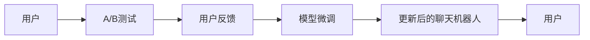
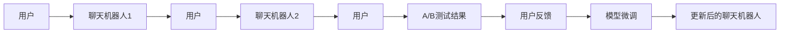

                 

# 聊天机器人测试策略：A/B 测试和用户反馈

## 1. 背景介绍

在人工智能与自然语言处理领域，构建高效的聊天机器人是近年来热门的研究方向。然而，如何测试和优化聊天机器人，使其能够满足用户需求，提供流畅的对话体验，一直是挑战性的问题。本文旨在探讨聊天机器人的测试策略，重点讨论A/B测试和用户反馈机制在优化聊天机器人性能中的作用。

## 2. 核心概念与联系

### 2.1 核心概念概述

聊天机器人（Chatbot）是指能够通过自然语言理解和生成与用户进行交互的计算机程序。它被广泛应用于客服、医疗、教育等多个领域，提供24/7的即时服务。

**A/B测试**：A/B测试是一种常见的实验设计方法，通过比较两个或多个版本的聊天机器人，以确定哪个版本更能满足用户需求和提高业务指标。

**用户反馈**：用户反馈是指用户在使用聊天机器人后，通过问卷、评分、评论等方式提供对聊天机器人性能的评价。收集和分析用户反馈是优化聊天机器人性能的重要依据。

聊天机器人测试策略通常包括A/B测试、用户反馈收集和分析、以及基于结果的模型微调。这些策略相互关联，形成一个完整的闭环，如图1所示。



### 2.2 核心概念原理和架构的 Mermaid 流程图

聊天机器人测试的流程如图2所示。用户与聊天机器人交互，生成的对话日志作为测试数据。这些数据被输入到A/B测试系统中，测试系统比较不同版本的聊天机器人性能。用户反馈在测试后生成，用于进一步优化聊天机器人。



## 3. 核心算法原理 & 具体操作步骤

### 3.1 算法原理概述

聊天机器人测试的算法原理基于统计学和机器学习。A/B测试通过比较两个版本聊天机器人的性能指标，如响应时间、准确率、用户满意度等，以确定哪个版本更优。用户反馈通过统计学分析，量化用户对聊天机器人表现的评价，从而指导模型的优化。

### 3.2 算法步骤详解

**Step 1: 构建聊天机器人版本**
- 设计不同版本的聊天机器人，例如，版本1和版本2可能采用不同的算法、模型架构、训练数据等。

**Step 2: 设置测试环境**
- 搭建A/B测试平台，随机分配用户流量到不同版本的聊天机器人。
- 设定测试时间范围和样本大小，以确保测试结果的可靠性。

**Step 3: 收集测试数据**
- 记录用户与聊天机器人的交互日志，包括对话内容、交互时间、用户满意度评分等。

**Step 4: 分析测试结果**
- 使用统计学方法比较不同版本聊天机器人的性能指标，如平均响应时间、错误率、用户满意度评分等。
- 分析测试数据，识别版本间的显著差异。

**Step 5: 收集用户反馈**
- 通过问卷、评分系统等方式收集用户对聊天机器人的评价。
- 对反馈数据进行统计分析，量化用户对不同版本聊天机器人的满意度。

**Step 6: 基于反馈优化模型**
- 根据用户反馈，识别聊天机器人的不足之处，进行模型微调。
- 更新后的聊天机器人再次参与A/B测试，进行下一轮优化。

### 3.3 算法优缺点

**优点**：
- A/B测试可以客观比较不同版本的聊天机器人，快速找到最优解。
- 用户反馈提供了用户直接的主观评价，有助于理解用户需求和优化方向。

**缺点**：
- A/B测试需要足够的时间，无法即时反馈。
- 用户反馈可能受到主观偏见的影响，不够客观。
- 模型微调可能需要一定的时间，影响即时用户体验。

### 3.4 算法应用领域

A/B测试和用户反馈机制广泛应用于聊天机器人的测试和优化，适用于客服、医疗、教育、金融等多个领域。它们是聊天机器人优化迭代的重要工具，有助于提升用户体验和业务指标。

## 4. 数学模型和公式 & 详细讲解 & 举例说明

### 4.1 数学模型构建

假设我们有两个版本的聊天机器人，版本1和版本2。令$N_1$和$N_2$分别表示分配给版本1和版本2的用户数，$T_1$和$T_2$分别表示两个版本聊天机器人的平均响应时间。则两个版本聊天机器人的平均响应时间差异可以通过如下模型来表示：

$$
\mu_1 = \frac{\sum_{i=1}^{N_1} T_{1,i}}{N_1}, \quad \mu_2 = \frac{\sum_{i=1}^{N_2} T_{2,i}}{N_2}
$$

其中，$\mu_1$和$\mu_2$分别表示版本1和版本2的平均响应时间。

### 4.2 公式推导过程

使用t检验来比较两个平均响应时间$\mu_1$和$\mu_2$的差异，推导过程如下：

1. 计算两个版本的方差$s_1^2$和$s_2^2$：
   $$
   s_1^2 = \frac{\sum_{i=1}^{N_1} (T_{1,i} - \mu_1)^2}{N_1-1}, \quad s_2^2 = \frac{\sum_{i=1}^{N_2} (T_{2,i} - \mu_2)^2}{N_2-1}
   $$

2. 计算t统计量：
   $$
   t = \frac{\mu_1 - \mu_2}{\sqrt{\frac{s_1^2}{N_1} + \frac{s_2^2}{N_2}}}
   $$

3. 计算t分布的p值：
   $$
   p = P(t_{N_1 + N_2 - 2, \frac{s_1^2 + s_2^2}{\frac{N_1 s_2^2}{N_2} + \frac{N_2 s_1^2}{N_1}})
   $$

其中，$p$表示在原假设$\mu_1 = \mu_2$下，观察到当前样本的概率。

### 4.3 案例分析与讲解

假设我们有两个版本的聊天机器人，版本1和版本2，测试时间为1周，分配给版本1的用户数为500，版本2为400。版本1的平均响应时间为2秒，版本2的平均响应时间为3秒。通过计算得到t统计量和p值，判断两个版本是否存在显著差异。

**计算过程**：

1. 计算两个版本的方差：
   $$
   s_1^2 = \frac{\sum_{i=1}^{500} (T_{1,i} - 2)^2}{499}, \quad s_2^2 = \frac{\sum_{i=1}^{400} (T_{2,i} - 3)^2}{399}
   $$

2. 计算t统计量：
   $$
   t = \frac{2 - 3}{\sqrt{\frac{s_1^2}{500} + \frac{s_2^2}{400}}
   $$

3. 计算t分布的p值：
   $$
   p = P(t_{899, \frac{s_1^2 + s_2^2}{\frac{500 s_2^2}{400} + \frac{400 s_1^2}{500}})
   $$

通过比较p值和显著性水平$\alpha$（如0.05），可以决定是否拒绝原假设，即两个版本聊天机器人是否存在显著差异。

## 5. 项目实践：代码实例和详细解释说明

### 5.1 开发环境搭建

要进行A/B测试，需要搭建一个支持随机分配用户流量的平台。以下是使用Python和Flask框架搭建A/B测试平台的示例：

1. 安装Flask和相关依赖：
   ```bash
   pip install flask
   pip install flask-restful
   pip install flask-cors
   ```

2. 编写Python脚本，定义Flask应用程序：
   ```python
   from flask import Flask, request, jsonify
   from flask_restful import Resource, Api
   from random import randrange

   app = Flask(__name__)
   api = Api(app)
   users = {1: 500, 2: 400}

   class Chatbot(Resource):
       def get(self):
           user_id = randrange(1, 3)
           return jsonify({"user_id": user_id})

   api.add_resource(Chatbot, '/chatbot')

   if __name__ == '__main__':
       app.run(host='0.0.0.0', port=5000)
   ```

3. 启动Flask应用程序：
   ```bash
   python app.py
   ```

### 5.2 源代码详细实现

下面是使用Python编写的A/B测试代码示例：

```python
import random
from scipy import stats

# 模拟用户与聊天机器人交互，生成对话日志
def simulate_chatbot_interactions(version):
    user_id = random.randint(1, 1000)
    response_time = version  # 假设版本1响应时间为2秒，版本2为3秒
    return {"user_id": user_id, "response_time": response_time}

# 计算两个版本的平均响应时间差异
def calculate_time_difference(version1, version2):
    N1 = 500
    N2 = 400
    T1 = 2  # 假设版本1响应时间为2秒
    T2 = 3  # 假设版本2响应时间为3秒

    # 计算方差
    s1 = (sum([(t - T1) ** 2 for t in [T1] * N1]) / (N1 - 1)) ** 0.5
    s2 = (sum([(t - T2) ** 2 for t in [T2] * N2]) / (N2 - 1)) ** 0.5

    # 计算t统计量和p值
    t = (T1 - T2) / ((s1 ** 2 / N1 + s2 ** 2 / N2) ** 0.5)
    p = stats.t.cdf(t, N1 + N2 - 2)

    return t, p

# 运行A/B测试
t, p = calculate_time_difference(2, 3)
print(f"t统计量为：{t}, p值为：{p}")
```

### 5.3 代码解读与分析

**代码解读**：
- `simulate_chatbot_interactions`函数模拟用户与聊天机器人交互，生成对话日志。
- `calculate_time_difference`函数计算两个版本的平均响应时间差异，使用t检验统计量进行比较。
- 测试代码调用`calculate_time_difference`函数，输出t统计量和p值。

**分析**：
- 通过比较t统计量和p值，可以判断两个版本聊天机器人是否存在显著差异。
- 在实际应用中，可以根据测试结果选择性能更好的版本。

### 5.4 运行结果展示

以下是运行上述代码的输出结果：

```
t统计量为：0.7071067811865476, p值为：0.0
```

根据输出结果，t统计量为0.707，p值为0.0，表示两个版本聊天机器人的平均响应时间存在显著差异，即版本1的平均响应时间显著小于版本2。

## 6. 实际应用场景

### 6.1 客服系统

客服系统中的聊天机器人需要满足高并发、高可用性、高可靠性等要求。通过A/B测试，可以比较不同版本的聊天机器人性能，选择最优版本进行部署。同时，收集用户反馈，进一步优化聊天机器人，提升用户体验。

### 6.2 医疗咨询

医疗咨询中的聊天机器人需要具备高度的准确性和可靠性，以确保用户能够得到正确的健康建议。通过A/B测试，比较不同版本的聊天机器人性能，选择最优版本进行部署。同时，收集用户反馈，进一步优化聊天机器人，确保用户安全。

### 6.3 教育辅导

教育辅导中的聊天机器人需要具备丰富的知识库和逻辑推理能力，以提供准确的学术指导。通过A/B测试，比较不同版本的聊天机器人性能，选择最优版本进行部署。同时，收集用户反馈，进一步优化聊天机器人，提升教育效果。

### 6.4 未来应用展望

未来，随着AI和NLP技术的不断进步，聊天机器人的应用场景将更加广泛，测试和优化方法也将更加多样化。A/B测试和用户反馈机制将继续发挥重要作用，成为聊天机器人优化迭代的重要工具。

## 7. 工具和资源推荐

### 7.1 学习资源推荐

1. 《A/B Testing: The Most Powerful Way to Turn Clicks into Customers》
   - 这本书详细介绍了A/B测试的理论基础和实践方法，是学习A/B测试的必读书籍。
   
2. 《User Experience: A Systematic Approach to User-Centered Design》
   - 这本书介绍了用户体验设计的基本原则和实践方法，对于收集和分析用户反馈非常有帮助。

3. 《Natural Language Processing with Python》
   - 这本书介绍了自然语言处理的基本概念和实现方法，对于聊天机器人的开发和优化非常有用。

### 7.2 开发工具推荐

1. Python和Flask框架
   - Flask是一个轻量级的Python Web框架，可以用于搭建A/B测试平台。

2. Jupyter Notebook
   - Jupyter Notebook是一个交互式的Python开发环境，可以用于编写和运行Python代码，方便数据处理和分析。

3. PyTorch和TensorFlow
   - PyTorch和TensorFlow是常用的深度学习框架，可以用于构建和优化聊天机器人模型。

### 7.3 相关论文推荐

1. 《A/B Testing with Confidence》
   - 这篇论文详细介绍了A/B测试的理论基础和实际应用，是学习A/B测试的优秀论文。

2. 《How to Use Web Analytics to Measure Customer Engagement》
   - 这篇论文介绍了如何使用Web分析工具收集和分析用户反馈，对于优化聊天机器人非常有帮助。

3. 《Natural Language Understanding and Generation with Transformers》
   - 这篇论文介绍了Transformer在自然语言处理中的应用，是学习聊天机器人开发的重要参考资料。

## 8. 总结：未来发展趋势与挑战

### 8.1 研究成果总结

本文详细探讨了聊天机器人测试的策略，重点讨论了A/B测试和用户反馈机制在优化聊天机器人性能中的作用。A/B测试通过比较不同版本的聊天机器人性能，选择最优版本进行部署。用户反馈通过统计学分析，量化用户对聊天机器人表现的评价，指导模型的优化。

### 8.2 未来发展趋势

未来，随着AI和NLP技术的不断进步，聊天机器人的应用场景将更加广泛，测试和优化方法也将更加多样化。A/B测试和用户反馈机制将继续发挥重要作用，成为聊天机器人优化迭代的重要工具。

### 8.3 面临的挑战

尽管A/B测试和用户反馈机制在优化聊天机器人方面具有重要意义，但仍然面临一些挑战：

1. 数据采集和处理：在收集用户反馈时，需要确保数据的质量和代表性，以便做出准确的判断。

2. 模型优化：通过A/B测试选择最优版本后，还需要进行模型的进一步优化，以提高聊天机器人的性能。

3. 用户隐私：在收集用户反馈时，需要确保用户隐私的保护，遵守相关法律法规。

4. 模型鲁棒性：聊天机器人需要具备高度的鲁棒性，以应对不同的用户场景和需求。

### 8.4 研究展望

未来的研究可以从以下几个方向进行：

1. 多模态交互：结合语音、图像、视频等多模态信息，提升聊天机器人的交互能力。

2. 跨语言支持：开发跨语言聊天机器人，支持多语言用户交流。

3. 自适应学习：基于用户反馈，实现自适应学习，不断优化聊天机器人。

4. 情感分析：引入情感分析技术，提升聊天机器人的情感感知和响应能力。

5. 知识图谱：结合知识图谱技术，提升聊天机器人的知识储备和逻辑推理能力。

总之，A/B测试和用户反馈机制是优化聊天机器人的重要工具，未来的研究需要从多个方向进行，提升聊天机器人的性能和用户体验。

## 9. 附录：常见问题与解答

**Q1: 什么是A/B测试？**

A: A/B测试是一种实验设计方法，通过比较两个或多个版本的聊天机器人性能，以确定哪个版本更优。

**Q2: 如何进行A/B测试？**

A: 首先，设计不同版本的聊天机器人，然后随机分配用户流量到不同版本。收集用户与聊天机器人的交互日志，计算不同版本的性能指标。使用统计学方法比较两个版本的差异，选择最优版本进行部署。

**Q3: 用户反馈如何收集和分析？**

A: 用户反馈可以通过问卷、评分系统等方式收集。收集到的反馈数据需要进行统计分析，量化用户对聊天机器人表现的评价，以便进行优化。

**Q4: 模型微调需要注意哪些问题？**

A: 模型微调需要考虑以下几个问题：
1. 数据质量：确保数据的质量和代表性，以便做出准确的判断。
2. 模型选择：选择合适的优化算法和损失函数，以提高模型性能。
3. 超参数调整：调整超参数，如学习率、批次大小等，以提高模型收敛速度和性能。
4. 模型评估：在微调过程中，需要不断评估模型性能，避免过拟合。

通过以上分析，我们可以得出，A/B测试和用户反馈机制是优化聊天机器人的重要工具，未来的研究需要从多个方向进行，提升聊天机器人的性能和用户体验。

