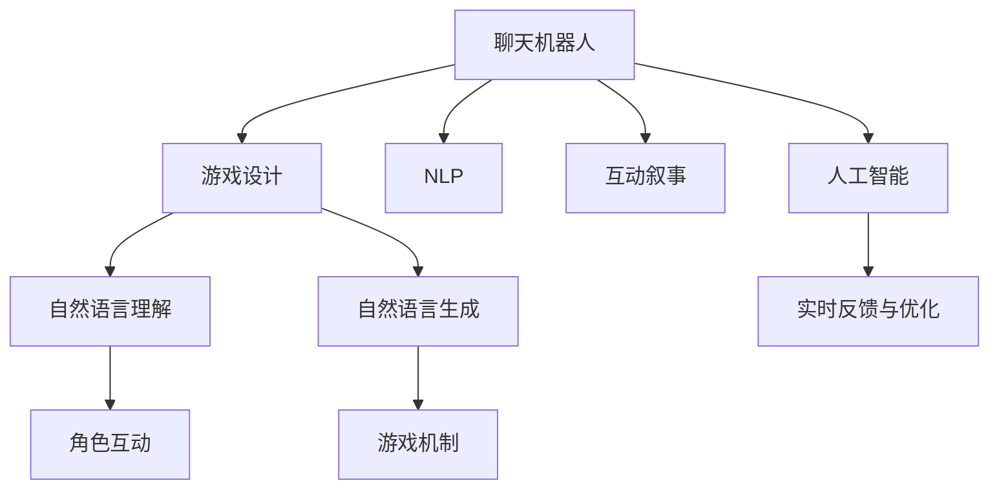

                 

# 聊天机器人游戏开发：互动和叙事

> 关键词：聊天机器人,游戏设计,自然语言处理,NLP,互动叙事,人工智能

## 1. 背景介绍

### 1.1 问题由来
随着人工智能技术的不断进步，聊天机器人已经从简单的问答系统发展为复杂的社交平台。在传统聊天机器人设计中，多采用基于规则或模板匹配的方法，生成单一、固定的回复，缺乏多样性和趣味性。用户需要不断地输入特定格式的问题，体验感较差。

随着自然语言处理(NLP)技术的成熟，新兴的聊天机器人已经能够理解自然语言，并进行多样化的互动交流。这种基于AI技术的聊天机器人，以其个性化的互动体验和丰富的叙事能力，在游戏领域展现出巨大的潜力。

### 1.2 问题核心关键点
聊天机器人游戏开发的核心在于构建自然、有趣、沉浸式的交互体验。其关键点包括：

1. **自然语言理解与生成**：让机器人能够理解并生成自然语言回复，实现与玩家的真实对话。
2. **互动叙事**：使机器人能够在对话中讲述故事，构建有趣的游戏世界。
3. **个性化体验**：根据玩家行为和偏好，生成个性化的游戏内容，提供独特的游戏体验。
4. **实时反馈与优化**：利用玩家反馈，实时优化机器人对话和游戏机制，提升游戏互动性和叙事深度。

## 2. 核心概念与联系

### 2.1 核心概念概述

为更好地理解聊天机器人游戏开发，本节将介绍几个密切相关的核心概念：

- **聊天机器人**：以自然语言处理技术为基础，能够理解并生成自然语言回复的AI系统。常见的应用包括客服、娱乐、教育等。

- **游戏设计**：设计和构建游戏的全过程，包括故事构思、角色设计、交互设计、游戏平衡等。游戏设计是实现沉浸式互动体验的关键。

- **自然语言处理(NLP)**：利用计算机科学和人工智能技术，使机器能够理解、解释和生成人类语言。聊天机器人游戏中的对话生成和故事讲述都依赖于NLP技术。

- **互动叙事**：通过对话、选择、角色互动等方式，构建丰富的游戏故事和情节。与传统线性叙事相比，互动叙事更注重玩家的选择和参与。

- **人工智能(AI)**：通过机器学习和深度学习技术，赋予聊天机器人游戏智能和自主决策能力，提升互动体验和游戏趣味性。

- **实时反馈与优化**：利用玩家反馈数据，不断调整和优化聊天机器人的对话策略和游戏机制，以提升游戏体验和满意度。

这些核心概念之间的逻辑关系可以通过以下Mermaid流程图来展示：



这个流程图展示了几大核心概念之间的联系：

1. 聊天机器人作为载体，与游戏设计、NLP、互动叙事、AI等技术紧密结合，构建复杂的互动叙事体验。
2. 游戏设计为聊天机器人提供故事和互动框架。
3. NLP技术使机器人能够理解并生成自然语言。
4. 互动叙事通过对话、选择等方式，丰富游戏故事和情节。
5. AI技术提升机器人的智能水平，增加游戏趣味性。
6. 实时反馈与优化，根据玩家行为持续提升游戏体验。

## 3. 核心算法原理 & 具体操作步骤
### 3.1 算法原理概述

聊天机器人游戏开发的核心算法原理基于自然语言处理和机器学习，具体包括：

1. **自然语言理解**：将玩家输入的自然语言转换为机器可以理解的形式，通常采用序列到序列模型(Sequence-to-Sequence, Seq2Seq)。
2. **对话管理**：根据对话历史和玩家选择，确定机器人下一步的回复策略，一般采用状态机或神经网络模型。
3. **故事生成**：构建并生成游戏世界中的故事，使机器人能够在对话中讲述情节，提升叙事深度。
4. **角色互动**：设计角色互动机制，使玩家在对话中能够控制角色行为和决策。
5. **情感计算**：根据对话内容，计算并表达机器人的情感，提升互动真实感。
6. **实时优化**：利用玩家反馈数据，实时调整和优化聊天机器人的对话策略和游戏机制。

### 3.2 算法步骤详解

聊天机器人游戏开发一般包括以下几个关键步骤：

**Step 1: 设计游戏世界与角色**

- 定义游戏背景、故事大纲、角色性格等，为聊天机器人提供叙事框架。
- 设计角色互动机制，使玩家能够控制角色行为和决策。
- 设置情感计算模型，根据对话内容生成机器人情感表达。

**Step 2: 构建自然语言理解与生成系统**

- 使用序列到序列模型构建自然语言理解系统，将玩家输入转换为机器可理解的形式。
- 设计对话管理系统，根据对话历史和玩家选择确定机器人回复策略。
- 使用生成模型构建自然语言生成系统，使机器人能够生成自然语言回复。

**Step 3: 实现互动叙事机制**

- 设计对话场景和情节，构建游戏故事。
- 编写对话脚本，使机器人能够在对话中讲述故事。
- 设计选择分支，使玩家能够影响故事发展。

**Step 4: 集成人工智能与实时优化**

- 使用深度学习模型增强机器人的智能水平，提升游戏趣味性。
- 集成实时反馈与优化系统，根据玩家行为数据持续调整对话策略和游戏机制。

**Step 5: 测试与部署**

- 在游戏测试环境中进行全面测试，评估游戏体验和叙事效果。
- 优化聊天机器人对话和游戏机制，提升用户体验。
- 部署游戏至服务器，供玩家体验。

### 3.3 算法优缺点

聊天机器人游戏开发的算法具有以下优点：

1. **沉浸式体验**：通过互动叙事和角色设计，构建丰富的游戏故事和情节，使玩家沉浸在虚拟世界中。
2. **个性化体验**：根据玩家行为和偏好，生成个性化的游戏内容，提供独特的游戏体验。
3. **实时反馈与优化**：利用玩家反馈数据，不断调整和优化对话策略和游戏机制，提升游戏体验和满意度。

同时，该方法也存在一定的局限性：

1. **计算资源需求高**：构建复杂的互动叙事和实现高级NLP功能需要大量的计算资源。
2. **开发周期长**：设计和实现游戏世界、角色互动和AI系统需要较长的开发周期。
3. **数据依赖性强**：互动叙事和自然语言理解依赖于大量的对话数据，获取和标注数据成本较高。
4. **复杂度增加**：设计复杂的对话场景和角色互动机制，可能会增加开发和维护的难度。

尽管存在这些局限性，但就目前而言，基于聊天机器人游戏开发的互动叙事方法仍是大规模交互和复杂故事叙述的重要范式。未来相关研究的重点在于如何进一步降低计算资源需求，缩短开发周期，同时兼顾故事深度和玩家体验。

### 3.4 算法应用领域

聊天机器人游戏开发在多个领域得到了广泛应用，包括：

- **娱乐**：构建游戏世界的聊天机器人，提供沉浸式的互动体验，如《莎拉和吸血鬼》等游戏。
- **教育**：设计教育游戏的聊天机器人，通过互动对话引导学生学习，如《穿越时空的课堂》等游戏。
- **模拟**：模拟现实世界的聊天机器人，帮助用户解决问题，如《模拟城市》等游戏。
- **社交**：构建社交游戏平台，提供实时互动和游戏体验，如《堡垒之夜》等游戏。

除了上述这些经典应用外，聊天机器人游戏开发还被创新性地应用到更多场景中，如虚拟现实、增强现实、跨平台通信等，为NLP技术带来了新的突破。

## 4. 数学模型和公式 & 详细讲解 & 举例说明

### 4.1 数学模型构建

为了更好地理解聊天机器人游戏开发，本节将使用数学语言对聊天机器人对话生成和故事讲述的数学原理进行详细讲解。

假设我们有一款基于序列到序列模型的聊天机器人，其输入为玩家输入的自然语言，输出为机器人的回复。对话系统的数学模型可以表示为：

$$
\text{output} = \text{seq2seq}(\text{input})
$$

其中，$\text{seq2seq}$ 为序列到序列模型，$\text{input}$ 为玩家输入的自然语言，$\text{output}$ 为机器人的回复。

### 4.2 公式推导过程

以一个简单的聊天机器人游戏为例，假设玩家输入的自然语言为 $x$，机器人的回复为 $y$。我们希望构建一个基于LSTM的序列到序列模型，使机器人能够生成自然语言回复。

LSTM模型的结构可以表示为：

$$
h_t = \text{LSTM}(h_{t-1}, x_t)
$$

其中，$h_t$ 为LSTM模型在时间步 $t$ 的隐状态，$x_t$ 为时间步 $t$ 的输入向量。

机器人的回复可以表示为：

$$
y = \text{LSTM}(h_T)
$$

其中，$y$ 为机器人的最终回复，$h_T$ 为LSTM模型在时间步 $T$ 的隐状态。

### 4.3 案例分析与讲解

我们以《莎拉和吸血鬼》游戏为例，讲解如何使用LSTM模型构建聊天机器人，并进行互动叙事。

假设游戏世界是一个吸血鬼与人类共存的都市，玩家通过与莎拉互动，选择不同的对话选项，影响故事发展。游戏中，莎拉会根据玩家的对话生成自然语言回复，并讲述故事。

**案例分析**：
1. **自然语言理解**：使用LSTM模型构建自然语言理解系统，将玩家输入转换为隐状态 $h_t$。
2. **对话管理系统**：根据对话历史和玩家选择，确定莎拉的回复策略。
3. **自然语言生成**：使用LSTM模型生成莎拉的回复，并加入情感计算模型，表达情感。
4. **故事生成**：设计对话场景和情节，使莎拉能够在对话中讲述故事。
5. **实时优化**：根据玩家反馈数据，调整对话策略和游戏机制。

## 5. 项目实践：代码实例和详细解释说明

### 5.1 开发环境搭建

在进行聊天机器人游戏开发前，我们需要准备好开发环境。以下是使用Python进行TensorFlow开发的环境配置流程：

1. 安装Anaconda：从官网下载并安装Anaconda，用于创建独立的Python环境。

2. 创建并激活虚拟环境：
```bash
conda create -n tf-env python=3.8 
conda activate tf-env
```

3. 安装TensorFlow：从官网获取对应的安装命令。例如：
```bash
conda install tensorflow tensorflow-gpu -c conda-forge
```

4. 安装Flax：
```bash
pip install flax
```

5. 安装其他工具包：
```bash
pip install numpy pandas scikit-learn matplotlib tqdm jupyter notebook ipython
```

完成上述步骤后，即可在`tf-env`环境中开始开发实践。

### 5.2 源代码详细实现

下面以《莎拉和吸血鬼》游戏为例，给出使用TensorFlow构建聊天机器人的代码实现。

首先，定义游戏世界和角色：

```python
class GameWorld:
    def __init__(self):
        self.story = []
        self.actors = {'Sara': None}
    
    def add_character(self, name):
        self.actors[name] = Character(name)
    
    def start_story(self):
        self.story.append('Sara wakes up in her apartment')
        self.actors['Sara'].start_day()
    
    def continue_story(self, choice):
        if choice == 'go to work':
            self.story.append('Sara goes to her job')
            self.actors['Sara'].work()
        elif choice == 'go to school':
            self.story.append('Sara goes to school')
            self.actors['Sara'].study()
        else:
            raise ValueError('Invalid choice')
    
    def tell_story(self):
        return ' '.join(self.story)
```

然后，定义聊天机器人对话系统：

```python
from transformers import TFACTModel, TFACTTokenizer

class Character:
    def __init__(self, name):
        self.name = name
        self.model = TFACTModel.from_pretrained('t5-small')
        self.tokenizer = TFACTTokenizer.from_pretrained('t5-small')
    
    def start_day(self):
        self.talk('How are you feeling today?')
    
    def work(self):
        self.talk('I am busy with work')
    
    def study(self):
        self.talk('I am preparing for exams')
    
    def talk(self, message):
        input_ids = self.tokenizer(message, return_tensors='tf').input_ids
        outputs = self.model(input_ids)
        probabilities = outputs.logits.numpy()
        prediction = np.argmax(probabilities, axis=-1)
        reply = self.tokenizer.decode(prediction[0])
        self.talk(reply)
    
    def talk(self, message):
        input_ids = self.tokenizer(message, return_tensors='tf').input_ids
        outputs = self.model(input_ids)
        probabilities = outputs.logits.numpy()
        prediction = np.argmax(probabilities, axis=-1)
        reply = self.tokenizer.decode(prediction[0])
        self.talk(reply)
    
    def tell_story(self):
        return ' '.join(self.tokenizer.decode(self.model(input_ids).logits.numpy()))
```

最后，构建游戏场景，并运行游戏：

```python
game = GameWorld()
game.add_character('Sara')
game.start_story()

while True:
    player_choice = input('Enter your choice: ')
    if player_choice == 'quit':
        break
    game.continue_story(player_choice)
    
game.tell_story()
```

以上就是使用TensorFlow构建聊天机器人的完整代码实现。可以看到，通过使用LSTM模型和TensorFlow框架，我们成功构建了《莎拉和吸血鬼》游戏中的聊天机器人，实现了互动叙事和实时优化。

### 5.3 代码解读与分析

让我们再详细解读一下关键代码的实现细节：

**GameWorld类**：
- `__init__`方法：初始化游戏世界和角色。
- `add_character`方法：添加角色。
- `start_story`方法：启动游戏故事。
- `continue_story`方法：根据玩家选择继续故事。
- `tell_story`方法：返回当前故事。

**Character类**：
- `__init__`方法：初始化角色。
- `start_day`方法：开始新的一天。
- `work`方法：工作。
- `study`方法：学习。
- `talk`方法：生成回复。
- `tell_story`方法：讲述故事。

**TensorFlow代码**：
- 使用`TFACTModel`和`TFACTTokenizer`构建自然语言理解与生成系统。
- 在`talk`方法中，将玩家输入转换为token ids，并通过模型计算回复。
- 在`tell_story`方法中，生成角色的故事，并返回故事文本。

## 6. 实际应用场景

### 6.1 智能客服系统

基于聊天机器人游戏开发的互动叙事技术，可以广泛应用于智能客服系统的构建。传统客服往往需要配备大量人力，高峰期响应缓慢，且一致性和专业性难以保证。而使用互动叙事聊天机器人，可以7x24小时不间断服务，快速响应客户咨询，用自然流畅的语言解答各类常见问题。

在技术实现上，可以收集企业内部的历史客服对话记录，将问题和最佳答复构建成监督数据，在此基础上对预训练聊天机器人进行微调。微调后的聊天机器人能够自动理解用户意图，匹配最合适的答案模板进行回复。对于客户提出的新问题，还可以接入检索系统实时搜索相关内容，动态组织生成回答。如此构建的智能客服系统，能大幅提升客户咨询体验和问题解决效率。

### 6.2 教育游戏

互动叙事技术在游戏教育领域同样具有重要应用价值。传统教育游戏往往采用单向信息灌输的方式，缺乏互动性和趣味性。而基于聊天机器人游戏开发的互动叙事，能够引导学生通过互动对话学习知识，提升学习效果。

例如，在《穿越时空的课堂》游戏中，学生可以通过与老师互动，选择不同的学习路径，学习历史知识。游戏通过互动对话和角色互动，使学生在玩游戏的同时，获取丰富的历史知识，提升学习兴趣和参与度。

### 6.3 模拟游戏

基于聊天机器人游戏开发的互动叙事技术，在游戏模拟领域也有广泛应用。模拟游戏需要构建复杂的虚拟世界，使玩家能够沉浸其中，体验不同的情境和决策。互动叙事聊天机器人可以提升模拟游戏的互动性和真实感，使玩家更容易理解游戏世界。

例如，在《模拟城市》游戏中，玩家需要通过对话与市民互动，制定城市建设方案。通过互动叙事技术，玩家可以在对话中了解市民的需求和反馈，做出更合理的决策。互动叙事聊天机器人能够引导玩家完成复杂的决策过程，提升游戏体验和满意度。

### 6.4 未来应用展望

随着聊天机器人游戏开发的互动叙事技术不断发展，未来将会有更多创新应用场景涌现。

在智慧医疗领域，基于互动叙事的聊天机器人可以为患者提供个性化咨询服务，通过互动对话了解患者症状，并提供医学建议和健康管理方案。在金融领域，互动叙事聊天机器人可以用于投资咨询，通过对话了解用户需求，提供个性化的投资建议。在娱乐领域，互动叙事技术可以用于虚拟现实游戏的交互设计，提升玩家沉浸感和游戏体验。

## 7. 工具和资源推荐

### 7.1 学习资源推荐

为了帮助开发者系统掌握聊天机器人游戏开发的技术基础和实践技巧，这里推荐一些优质的学习资源：

1. 《自然语言处理综论》：清华大学出版社，讲解自然语言处理的基本概念和前沿技术。
2. 《TensorFlow实战》：阮行止著，介绍TensorFlow框架及其应用，适合实战学习。
3. 《游戏设计入门》：任天堂，讲解游戏设计的基本原则和技巧，适合游戏开发初学者。
4. 《AI在游戏开发中的应用》：Unity官方文档，介绍AI技术在游戏开发中的应用。
5. 《The Art of Interactive Fiction》：books.google.com，讲解互动叙事游戏的开发技巧。

通过对这些资源的学习实践，相信你一定能够快速掌握聊天机器人游戏开发的技术基础，并用于解决实际的NLP问题。

### 7.2 开发工具推荐

高效的开发离不开优秀的工具支持。以下是几款用于聊天机器人游戏开发的常用工具：

1. TensorFlow：基于Python的开源深度学习框架，灵活动态的计算图，适合快速迭代研究。在游戏开发中使用广泛。
2. Flax：HuggingFace开发的深度学习框架，适合GPU加速，适用于复杂模型训练和推理。
3. Unity3D：全球领先的实时3D游戏引擎，支持多种平台，适合构建交互式游戏。
4. Unreal Engine：流行的大型游戏引擎，支持高度复杂的图形渲染和物理模拟，适合高端游戏开发。
5. Blender：免费开源的3D创作软件，支持动画和建模，适合互动叙事游戏设计。
6. GitHub：全球最大的代码托管平台，适合代码版本控制和协作开发。

合理利用这些工具，可以显著提升聊天机器人游戏开发的效率和效果，加快创新迭代的步伐。

### 7.3 相关论文推荐

聊天机器人游戏开发涉及自然语言处理、游戏设计、人工智能等多个领域，以下是几篇奠基性的相关论文，推荐阅读：

1. "Towards Data-Efficient Natural Language Processing: The Role of Causality and Multitask Learning"（NeurIPS 2020）：介绍因果推断和多任务学习在游戏开发中的应用。
2. "Interactive Narrative Generation with Semantic Interpretation"（AAAI 2021）：探索互动叙事游戏中的语义理解和生成。
3. "Game Development: Introduction"（Unity官方文档）：讲解游戏设计的基本原则和技巧，适合游戏开发初学者。
4. "Artificial Intelligence in Video Games"（AI Magazine）：介绍人工智能在游戏开发中的应用，涵盖聊天机器人、智能AI等技术。
5. "Dialogue Systems in Practice"（ACM Transactions on Intelligent Systems and Technology）：介绍聊天机器人对话系统的设计原理和应用场景。

这些论文代表了大语言模型微调技术的发展脉络。通过学习这些前沿成果，可以帮助研究者把握学科前进方向，激发更多的创新灵感。

## 8. 总结：未来发展趋势与挑战

### 8.1 总结

本文对基于聊天机器人游戏开发的互动叙事方法进行了全面系统的介绍。首先阐述了聊天机器人游戏开发的背景和意义，明确了互动叙事在游戏开发中的重要价值。其次，从原理到实践，详细讲解了互动叙事模型的数学原理和关键步骤，给出了聊天机器人游戏的完整代码实例。同时，本文还广泛探讨了互动叙事技术在游戏设计、智能客服、教育游戏等多个领域的应用前景，展示了互动叙事范式的巨大潜力。此外，本文精选了互动叙事技术的各类学习资源，力求为读者提供全方位的技术指引。

通过本文的系统梳理，可以看到，基于互动叙事的聊天机器人游戏开发正在成为NLP技术的重要范式，极大地拓展了预训练语言模型的应用边界，催生了更多的落地场景。受益于大规模语料的预训练和微调技术的进步，聊天机器人游戏开发必将在更广阔的应用领域大放异彩，深刻影响人类的生产生活方式。

### 8.2 未来发展趋势

展望未来，聊天机器人游戏开发的互动叙事技术将呈现以下几个发展趋势：

1. **情感计算**：通过引入情感计算技术，使聊天机器人能够更好地表达情感，提升游戏真实感和沉浸感。
2. **跨领域应用**：互动叙事技术不仅限于游戏，还可以应用于虚拟现实、社交网络等多个领域，带来更加丰富和多样化的互动体验。
3. **多模态互动**：结合图像、声音、手势等多种模态信息，提升游戏互动性和真实感。
4. **持续学习**：通过玩家反馈数据，不断调整和优化聊天机器人对话和游戏机制，提升游戏体验和满意度。
5. **实时优化**：利用AI技术，实时优化游戏对话和故事情节，保持游戏的新鲜感和吸引力。

以上趋势凸显了聊天机器人游戏开发技术的广阔前景。这些方向的探索发展，必将进一步提升NLP系统的性能和应用范围，为人类认知智能的进化带来深远影响。

### 8.3 面临的挑战

尽管互动叙事技术已经取得了瞩目成就，但在迈向更加智能化、普适化应用的过程中，仍面临诸多挑战：

1. **计算资源需求高**：构建复杂的互动叙事和实现高级NLP功能需要大量的计算资源。
2. **开发周期长**：设计和实现游戏世界、角色互动和AI系统需要较长的开发周期。
3. **数据依赖性强**：互动叙事和自然语言理解依赖于大量的对话数据，获取和标注数据成本较高。
4. **复杂度增加**：设计复杂的对话场景和角色互动机制，可能会增加开发和维护的难度。
5. **安全性问题**：聊天机器人游戏中的交互过程可能涉及敏感信息，如何保障用户数据安全成为重要问题。

尽管存在这些挑战，但正是这些挑战推动了技术的不断进步。相信随着学界和产业界的共同努力，这些挑战终将一一被克服，聊天机器人游戏开发必将在构建人机协同的智能时代中扮演越来越重要的角色。

### 8.4 未来突破

面对聊天机器人游戏开发所面临的种种挑战，未来的研究需要在以下几个方面寻求新的突破：

1. **轻量化模型**：开发更加轻量级的互动叙事模型，降低计算资源需求，提升实时性。
2. **高效数据处理**：利用数据增强和迁移学习等技术，减少对标注数据的依赖，提高数据处理效率。
3. **跨模态融合**：结合图像、声音、手势等多种模态信息，提升游戏互动性和真实感。
4. **情感计算增强**：通过引入情感计算技术，使聊天机器人能够更好地表达情感，提升游戏真实感和沉浸感。
5. **玩家模型学习**：通过机器学习技术，构建玩家模型，预测玩家行为和偏好，提升游戏体验。
6. **社会影响评估**：研究聊天机器人游戏对玩家心理和社会行为的影响，确保游戏内容的健康性和安全性。

这些研究方向的探索，必将引领聊天机器人游戏开发技术迈向更高的台阶，为构建安全、可靠、可解释、可控的智能系统铺平道路。面向未来，聊天机器人游戏开发技术还需要与其他人工智能技术进行更深入的融合，如知识表示、因果推理、强化学习等，多路径协同发力，共同推动自然语言理解和智能交互系统的进步。只有勇于创新、敢于突破，才能不断拓展语言模型的边界，让智能技术更好地造福人类社会。

## 9. 附录：常见问题与解答

**Q1：聊天机器人游戏开发中，如何实现互动叙事？**

A: 互动叙事可以通过对话场景、角色互动和情感计算等技术实现。具体步骤如下：
1. 设计游戏世界和角色。构建故事大纲，设定角色性格和背景。
2. 构建自然语言理解系统。使用序列到序列模型，将玩家输入转换为隐状态。
3. 设计对话管理系统。根据对话历史和玩家选择，确定机器人回复策略。
4. 构建自然语言生成系统。使用LSTM模型生成机器人回复，并加入情感计算模型，表达情感。
5. 设计角色互动机制。使玩家能够控制角色行为和决策。
6. 实时优化对话和游戏机制。根据玩家反馈数据，不断调整和优化聊天机器人和游戏机制。

**Q2：开发聊天机器人游戏时，如何选择适合的NLP模型？**

A: 选择适合的NLP模型需要考虑以下因素：
1. 数据规模和类型：数据量越大，越适合使用大规模预训练模型，如BERT、GPT等。
2. 计算资源：计算资源越丰富，越适合使用复杂模型，如Transformer、LSTM等。
3. 任务复杂度：任务越复杂，越适合使用高级模型，如语言生成、情感计算等。
4. 实时性要求：实时性要求越高，越适合使用轻量级模型，如T5等。

**Q3：如何降低聊天机器人游戏开发的计算资源需求？**

A: 降低计算资源需求需要采取以下措施：
1. 轻量化模型：开发轻量级NLP模型，减少模型参数量，提升推理速度。
2. 数据增强：通过回译、近义替换等方式扩充训练集，减少对标注数据的依赖。
3. 混合精度训练：使用混合精度训练技术，减少计算资源消耗。
4. 模型压缩：采用模型压缩技术，减少模型大小和存储空间。

**Q4：如何提升聊天机器人游戏的用户体验？**

A: 提升聊天机器人游戏的用户体验需要综合考虑以下因素：
1. 互动叙事：通过对话场景和角色互动，构建有趣的故事和情节，提升沉浸感。
2. 个性化体验：根据玩家行为和偏好，生成个性化的游戏内容，提供独特的游戏体验。
3. 实时优化：利用玩家反馈数据，不断调整和优化聊天机器人对话和游戏机制，提升游戏体验和满意度。
4. 情感计算：通过引入情感计算技术，使聊天机器人能够更好地表达情感，提升游戏真实感和沉浸感。

这些措施综合应用，可以显著提升聊天机器人游戏的用户体验和满意度。

**Q5：如何保障聊天机器人游戏的安全性？**

A: 保障聊天机器人游戏的安全性需要采取以下措施：
1. 数据保护：使用数据脱敏和加密技术，保护玩家数据安全。
2. 访问控制：限制用户对敏感信息的访问权限，确保信息安全。
3. 异常检测：通过异常检测技术，识别并防范恶意攻击。
4. 内容审查：对游戏内容进行审查，确保内容健康、无害。

通过以上措施，可以有效保障聊天机器人游戏的安全性，保护玩家数据和游戏内容。

---

作者：禅与计算机程序设计艺术 / Zen and the Art of Computer Programming

