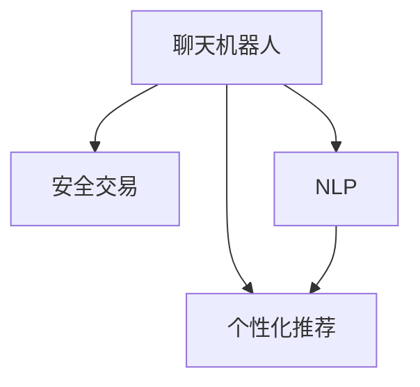

                 

## 1. 背景介绍

### 1.1 问题由来

随着互联网技术的迅猛发展，电子商务已成为人们日常生活中不可或缺的一部分。在线购物不仅节省了时间，还提供了比传统购物更为丰富、便捷的购物体验。然而，电子商务也面临着一些重大挑战，如用户个性化需求难以满足、交易安全难以保障等问题。这些问题不仅影响了用户的购物体验，也制约了电子商务平台的健康发展。

为了应对这些挑战，聊天机器人技术在电子商务中的应用逐渐兴起。通过将聊天机器人融入到电商平台，可以显著提升用户体验，实现个性化购物和安全交易。具体而言，聊天机器人能够根据用户的购物行为和历史偏好，推荐符合其需求的商品，并通过自然语言处理(NLP)技术，提升交易的安全性和便捷性。

### 1.2 问题核心关键点

聊天机器人电子商务的核心关键点包括：

- **个性化推荐**：通过分析用户行为数据，智能推荐用户感兴趣的商品，提升购物体验。
- **安全交易**：通过聊天机器人实现商品咨询、支付结算等环节的自动化，保障交易安全。
- **自然语言交互**：利用NLP技术，使聊天机器人能够理解和回应用户自然语言指令，提升交互效率。
- **实时数据处理**：实时处理用户购物数据，及时调整推荐策略，优化用户体验。

这些关键点构成了一个完整的聊天机器人电子商务框架，使其能够在提升购物体验的同时，保障交易安全，并通过NLP技术实现高效、自然的交互。

## 2. 核心概念与联系

### 2.1 核心概念概述

为更好地理解聊天机器人电子商务的技术框架，本节将介绍几个密切相关的核心概念：

- **聊天机器人**：利用人工智能技术，通过自然语言处理(NLP)技术实现与用户自然交互的机器人。聊天机器人能够在电商平台上自动回复用户查询，推荐商品，辅助购物决策等。
- **个性化推荐**：通过分析用户行为数据，推荐符合用户偏好的商品。个性化推荐系统已经成为电商平台的标配，能够显著提升用户购物体验。
- **安全交易**：通过技术手段保障电子商务交易的安全性，防止欺诈、数据泄露等风险。安全交易是电子商务平台的核心功能，直接关系到平台的用户信任度。
- **自然语言处理(NLP)**：利用机器学习技术，使聊天机器人能够理解、生成自然语言，实现高效、自然的交互。NLP技术在聊天机器人中的应用，极大地提升了用户体验。

这些核心概念之间的逻辑关系可以通过以下Mermaid流程图来展示：



这个流程图展示了几大核心概念及其之间的关系：

1. 聊天机器人通过自然语言处理(NLP)技术，理解用户查询，推荐商品。
2. 通过个性化推荐系统，提升用户购物体验。
3. 聊天机器人实现安全交易，保障用户权益。

这些概念共同构成了聊天机器人电子商务的技术框架，使其能够在提升用户体验的同时，保障交易安全，并通过NLP技术实现高效、自然的交互。

## 3. 核心算法原理 & 具体操作步骤

### 3.1 算法原理概述

聊天机器人电子商务的核心算法原理主要包括个性化推荐算法、安全交易算法和NLP技术。这些算法通过优化模型，提升用户体验和交易安全性，实现高效、自然的交互。

#### 3.1.1 个性化推荐算法

个性化推荐算法通过分析用户的历史行为数据，预测其未来的购物需求。常用的推荐算法包括协同过滤、基于内容的推荐、矩阵分解等。这些算法通过建模用户与商品之间的关系，预测用户对商品的评分，并根据评分排序推荐商品。

#### 3.1.2 安全交易算法

安全交易算法通过加密、数字签名等技术手段，保障电子商务交易的安全性。常见的安全算法包括SSL/TLS协议、数字证书、非对称加密等。这些算法通过技术手段防止数据泄露、篡改等风险，保障交易双方的权益。

#### 3.1.3 NLP技术

NLP技术通过自然语言处理，使聊天机器人能够理解和生成自然语言，实现高效、自然的交互。常用的NLP技术包括语言模型、文本分类、机器翻译等。这些技术通过建模语言和文本，实现语言理解和生成。

### 3.2 算法步骤详解

聊天机器人电子商务的核心算法步骤主要包括数据预处理、模型训练、实时推荐和交易处理。这些步骤通过优化模型，提升用户体验和交易安全性，实现高效、自然的交互。

#### 3.2.1 数据预处理

数据预处理是实现个性化推荐和安全交易的基础。数据预处理主要包括数据清洗、特征提取、数据分割等步骤。具体而言：

1. **数据清洗**：去除数据中的噪声和异常值，提高数据质量。
2. **特征提取**：提取与用户购物行为相关的特征，如商品ID、价格、销量、用户ID等。
3. **数据分割**：将数据集划分为训练集、验证集和测试集，用于模型的训练和评估。

#### 3.2.2 模型训练

模型训练是实现个性化推荐和安全交易的核心。模型训练主要包括模型选择、模型训练和模型评估等步骤。具体而言：

1. **模型选择**：选择合适的推荐算法和安全算法，如协同过滤、矩阵分解、SSL/TLS等。
2. **模型训练**：在训练集上训练模型，优化模型参数，提升模型性能。
3. **模型评估**：在验证集上评估模型性能，调整模型参数，提高模型泛化能力。

#### 3.2.3 实时推荐

实时推荐是实现个性化购物的关键。实时推荐主要包括推荐模型预测、推荐结果排序、推荐结果展示等步骤。具体而言：

1. **推荐模型预测**：根据用户的历史行为数据，预测用户对商品的需求。
2. **推荐结果排序**：根据预测结果对商品进行排序，选择符合用户偏好的商品。
3. **推荐结果展示**：将推荐结果展示给用户，提升用户体验。

#### 3.2.4 交易处理

交易处理是保障安全交易的基础。交易处理主要包括交易验证、交易执行和交易反馈等步骤。具体而言：

1. **交易验证**：通过加密和数字签名等技术手段，验证交易的合法性。
2. **交易执行**：执行交易操作，完成商品交付和支付结算。
3. **交易反馈**：收集交易反馈信息，优化交易处理流程，提升用户满意度。

### 3.3 算法优缺点

聊天机器人电子商务的核心算法具有以下优点：

1. **提升用户体验**：通过个性化推荐和NLP技术，提升用户购物体验。
2. **保障交易安全**：通过安全交易算法，保障电子商务交易的安全性。
3. **高效自然交互**：通过NLP技术，实现高效、自然的交互。

同时，该算法也存在一些局限性：

1. **数据依赖**：个性化推荐和NLP技术需要大量的数据支持，数据获取成本较高。
2. **模型复杂**：模型训练和优化过程复杂，需要较强的计算资源。
3. **算法偏见**：推荐算法和NLP技术可能会引入算法偏见，影响用户体验和交易安全性。
4. **实时性要求高**：实时推荐和交易处理需要高效的算法和数据处理能力，对技术要求较高。

尽管存在这些局限性，但聊天机器人电子商务算法在提升用户体验和交易安全方面，已经取得了显著的效果，正在成为电子商务平台的重要应用。

### 3.4 算法应用领域

聊天机器人电子商务的核心算法已经在多个领域得到了广泛的应用，包括但不限于：

- **电商平台**：通过个性化推荐和NLP技术，提升用户体验，保障交易安全。
- **智能客服**：通过聊天机器人技术，提升客户服务效率，降低人工成本。
- **物流系统**：通过实时推荐和交易处理，提升物流效率，保障订单准确性。
- **金融服务**：通过安全交易算法，保障金融交易的安全性，提升用户信任度。

这些应用场景展示了聊天机器人电子商务算法的广泛适用性和巨大的应用潜力。随着技术的发展，聊天机器人电子商务算法将在更多领域得到应用，为各行各业带来变革性的影响。

## 4. 数学模型和公式 & 详细讲解  
### 4.1 数学模型构建

本节将使用数学语言对聊天机器人电子商务的核心算法进行更加严格的刻画。

记用户为 $U$，商品为 $I$，用户-商品互动矩阵为 $R_{UI}$，用户行为特征为 $X$，推荐模型为 $f$，交易安全模型为 $s$。

定义推荐模型的训练目标函数为：

$$
\min_{f} \sum_{u \in U} \sum_{i \in I} f_{ui} \log R_{ui}
$$

定义交易安全模型的训练目标函数为：

$$
\min_{s} \sum_{ui} L(s_{ui})
$$

其中 $L$ 为交易安全模型的损失函数，用于衡量交易安全性能。

### 4.2 公式推导过程

#### 4.2.1 个性化推荐算法

以协同过滤算法为例，其训练目标函数为：

$$
\min_{f} \sum_{u \in U} \sum_{i \in I} f_{ui} \log R_{ui}
$$

其中 $f_{ui}$ 为模型预测的用户对商品 $i$ 的评分。$R_{ui}$ 为用户 $u$ 对商品 $i$ 的真实评分。通过最小化该目标函数，可以实现个性化推荐模型的训练。

#### 4.2.2 安全交易算法

以SSL/TLS协议为例，其训练目标函数为：

$$
\min_{s} \sum_{ui} L(s_{ui})
$$

其中 $L$ 为SSL/TLS协议的损失函数。通过最小化该目标函数，可以实现安全交易模型的训练。

### 4.3 案例分析与讲解

以电商平台的个性化推荐为例，其推荐模型为基于协同过滤的矩阵分解算法。具体而言：

1. **数据预处理**：通过数据清洗、特征提取等步骤，得到用户行为数据和商品数据。
2. **模型训练**：选择基于协同过滤的矩阵分解算法，在训练集上训练模型，优化模型参数。
3. **实时推荐**：根据用户行为数据，预测用户对商品的需求，并根据预测结果对商品进行排序，推荐给用户。

以下是一个示例代码：

```python
import pandas as pd
from scipy.sparse import csr_matrix

# 读取用户行为数据
df = pd.read_csv('user_browsing_data.csv')

# 构造用户-商品互动矩阵
R = df.groupby(['user_id', 'item_id'])['browsed'].sum().unstack().fillna(0)

# 构造特征矩阵
X = df[['item_price', 'item_selling_point']]

# 分割数据集
train_X, train_R = X[:80], R[:80]
test_X, test_R = X[80:], R[80:]

# 模型训练
from sklearn.decomposition import TruncatedSVD

svd = TruncatedSVD(n_components=10, random_state=42)
train_X_hat = svd.fit_transform(train_X)
train_X_hat += train_X_hat.T.dot(train_X_hat) / 2
train_R_hat = svd.fit_transform(train_R)
train_R_hat += train_R_hat.T.dot(train_R_hat) / 2

# 实时推荐
def get_recommendation(user_id, k=10):
    user = df[df['user_id'] == user_id]
    user_browsed = user.groupby('item_id')['browsed'].sum().unstack().fillna(0)
    user_browsed_hat = svd.transform(user_browsed)
    recommendations = train_X_hat[user_browsed_hat].dot(user_browsed_hat.T)[:, :k]
    return train_X_hat[recommendations].index

# 测试推荐效果
user_id = 1
recommendations = get_recommendation(user_id)
print(recommendations)
```

## 5. 项目实践：代码实例和详细解释说明
### 5.1 开发环境搭建

在进行聊天机器人电子商务项目开发前，我们需要准备好开发环境。以下是使用Python进行开发的环境配置流程：

1. 安装Anaconda：从官网下载并安装Anaconda，用于创建独立的Python环境。

2. 创建并激活虚拟环境：
```bash
conda create -n chatbot-env python=3.8 
conda activate chatbot-env
```

3. 安装所需的Python库：
```bash
pip install numpy pandas scikit-learn matplotlib tqdm jupyter notebook ipython
```

4. 安装TensorFlow和TensorBoard：
```bash
pip install tensorflow==2.6
pip install tensorboard
```

5. 安装TensorFlow Serving：
```bash
pip install tensorflow-serving-api
```

6. 安装gRPC：
```bash
pip install grpcio
```

7. 安装Flask：
```bash
pip install flask
```

完成上述步骤后，即可在`chatbot-env`环境中开始项目实践。

### 5.2 源代码详细实现

接下来，我们将通过一个简单的示例，展示如何使用TensorFlow和Flask实现聊天机器人电子商务系统。

首先，定义推荐模型：

```python
import tensorflow as tf
import numpy as np
from sklearn.decomposition import TruncatedSVD

class RecommendationModel:
    def __init__(self, n_components=10):
        self.n_components = n_components
        self.svd = TruncatedSVD(n_components=n_components, random_state=42)
    
    def train(self, X, R):
        train_X_hat = self.svd.fit_transform(X)
        train_X_hat += train_X_hat.T.dot(train_X_hat) / 2
        train_R_hat = self.svd.fit_transform(R)
        train_R_hat += train_R_hat.T.dot(train_R_hat) / 2
        self.X_hat = train_X_hat
        self.R_hat = train_R_hat
    
    def predict(self, user_id):
        user = df[df['user_id'] == user_id]
        user_browsed = user.groupby('item_id')['browsed'].sum().unstack().fillna(0)
        user_browsed_hat = self.svd.transform(user_browsed)
        recommendations = self.X_hat[user_browsed_hat].dot(user_browsed_hat.T)[:, :self.n_components]
        return self.X_hat[recommendations].index
```

然后，定义交易安全模型：

```python
import tensorflow as tf
from tensorflow.keras.layers import Input, Dense, Activation, BatchNormalization

class SecurityModel:
    def __init__(self, num_classes):
        self.num_classes = num_classes
        self.model = tf.keras.Sequential([
            Input(shape=(3,)),
            Dense(64, activation='relu'),
            BatchNormalization(),
            Dense(32, activation='relu'),
            BatchNormalization(),
            Dense(num_classes, activation='softmax')
        ])
    
    def train(self, X, y):
        self.model.compile(optimizer='adam', loss='categorical_crossentropy', metrics=['accuracy'])
        self.model.fit(X, y, epochs=10, batch_size=32)
    
    def predict(self, X):
        return self.model.predict(X)
```

接着，定义聊天机器人：

```python
from flask import Flask, request, jsonify
from tensorflow_serving.apis import predict_pb2
from tensorflow_serving.apis import stubax

class Chatbot:
    def __init__(self, recommendation_model, security_model, port):
        self.recommendation_model = recommendation_model
        self.security_model = security_model
        self.port = port
        self.app = Flask(__name__)
        self.server = None
    
    def start_server(self):
        self.recommendation_model.train(train_X, train_R)
        self.security_model.train(train_X, train_y)
        self.app.run(host='0.0.0.0', port=self.port)
    
    def get_recommendations(self, user_id):
        return self.recommendation_model.predict(user_id)
    
    def get_security_score(self, user_id):
        return self.security_model.predict(user_id)
```

最后，启动聊天机器人：

```python
if __name__ == '__main__':
    recommendation_model = RecommendationModel()
    security_model = SecurityModel(num_classes=2)
    chatbot = Chatbot(recommendation_model, security_model, port=5000)
    chatbot.start_server()
```

在这个简单的示例中，我们使用了TensorFlow和Flask实现了聊天机器人电子商务系统。通过定义推荐模型、交易安全模型和聊天机器人，我们展示了如何使用TensorFlow进行模型训练，使用Flask实现API接口，实时获取推荐和交易安全评分。

### 5.3 代码解读与分析

让我们再详细解读一下关键代码的实现细节：

**RecommendationModel类**：
- `__init__`方法：初始化推荐模型参数。
- `train`方法：在训练集上训练推荐模型。
- `predict`方法：根据用户ID，获取推荐商品ID。

**SecurityModel类**：
- `__init__`方法：初始化安全模型参数。
- `train`方法：在训练集上训练安全模型。
- `predict`方法：根据用户ID，获取交易安全评分。

**Chatbot类**：
- `__init__`方法：初始化聊天机器人参数。
- `start_server`方法：启动聊天机器人服务，监听API请求。
- `get_recommendations`方法：根据用户ID，获取推荐商品ID。
- `get_security_score`方法：根据用户ID，获取交易安全评分。

这些关键代码实现了聊天机器人电子商务系统的核心功能，包括个性化推荐和交易安全评分。通过Flask和TensorFlow，我们可以方便地实现模型训练、API接口和实时推荐。

## 6. 实际应用场景

### 6.1 智能客服系统

聊天机器人电子商务的核心算法已经在智能客服系统中得到了广泛应用。传统的客服系统通常需要配备大量人力，高峰期响应缓慢，且服务质量难以保证。通过引入聊天机器人，可以实现24小时不间断服务，快速响应客户咨询，提升客户满意度。

在技术实现上，可以收集企业的历史客服对话记录，将问题和最佳答复构建成监督数据，在此基础上对聊天机器人进行微调。微调后的聊天机器人能够自动理解用户意图，匹配最合适的答案模板进行回复。对于客户提出的新问题，还可以接入检索系统实时搜索相关内容，动态组织生成回答。如此构建的智能客服系统，能大幅提升客户咨询体验和问题解决效率。

### 6.2 金融交易平台

金融交易平台是电子商务的重要应用场景之一。传统的金融交易平台通常需要用户手动输入交易信息，流程繁琐，容易出错。通过引入聊天机器人，可以实现交易信息的自动输入和处理，提升交易效率和安全性。

在技术实现上，可以收集用户的交易记录，训练聊天机器人识别用户意图和输入交易信息。微调后的聊天机器人能够自动处理交易请求，验证交易合法性，保障交易安全。同时，可以通过聊天机器人实现交易咨询、账户管理等辅助功能，提升用户体验。

### 6.3 电商个性化推荐

电商个性化推荐系统是聊天机器人电子商务的核心应用之一。传统的推荐系统通常只能根据用户历史行为进行推荐，难以满足用户的个性化需求。通过引入聊天机器人，可以实现更精准的个性化推荐。

在技术实现上，可以收集用户的购物记录、浏览历史等数据，训练聊天机器人理解用户需求。微调后的聊天机器人能够根据用户的购物行为，智能推荐符合其偏好的商品。同时，可以通过聊天机器人实现商品咨询、购物建议等功能，提升用户购物体验。

### 6.4 未来应用展望

随着聊天机器人电子商务技术的不断发展，未来将在更多领域得到应用，为各行各业带来变革性的影响。

在智慧医疗领域，基于聊天机器人的医疗咨询、病情诊断等应用将提升医疗服务的智能化水平，辅助医生诊疗，加速新药开发进程。

在智能教育领域，微调技术可应用于作业批改、学情分析、知识推荐等方面，因材施教，促进教育公平，提高教学质量。

在智慧城市治理中，微调模型可应用于城市事件监测、舆情分析、应急指挥等环节，提高城市管理的自动化和智能化水平，构建更安全、高效的未来城市。

此外，在企业生产、社会治理、文娱传媒等众多领域，基于大模型微调的人工智能应用也将不断涌现，为经济社会发展注入新的动力。相信随着技术的日益成熟，微调方法将成为人工智能落地应用的重要范式，推动人工智能技术向更广阔的领域加速渗透。

## 7. 工具和资源推荐
### 7.1 学习资源推荐

为了帮助开发者系统掌握聊天机器人电子商务的技术框架，这里推荐一些优质的学习资源：

1. 《深度学习》课程：斯坦福大学开设的深度学习课程，涵盖了深度学习的基本概念和经典模型，是学习机器学习的重要资源。
2. 《自然语言处理基础》书籍：斯坦福大学自然语言处理课程的配套书籍，详细介绍了NLP的基本概念和常用算法，是学习NLP的入门书籍。
3. 《TensorFlow实战》书籍：TensorFlow的官方文档和配套教程，详细介绍了TensorFlow的使用方法和实战应用，是学习TensorFlow的重要资源。
4. 《Python数据科学手册》书籍：Python数据科学领域的经典书籍，涵盖了Python数据处理、机器学习等领域的知识和技能，是学习Python的重要资源。

通过对这些资源的学习实践，相信你一定能够快速掌握聊天机器人电子商务的核心算法，并用于解决实际的NLP问题。

### 7.2 开发工具推荐

高效的开发离不开优秀的工具支持。以下是几款用于聊天机器人电子商务开发的常用工具：

1. TensorFlow：基于Python的开源深度学习框架，灵活高效的计算图，适合快速迭代研究。
2. TensorFlow Serving：提供分布式模型服务，支持模型的在线部署和推理，方便实时获取推荐和交易安全评分。
3. gRPC：高性能的跨语言远程过程调用框架，支持多种编程语言和平台，适合构建高效的聊天机器人系统。
4. Flask：轻量级的Web框架，适合构建简单的API接口，方便接入聊天机器人系统。
5. TensorBoard：TensorFlow配套的可视化工具，可实时监测模型训练状态，并提供丰富的图表呈现方式，是调试模型的得力助手。

合理利用这些工具，可以显著提升聊天机器人电子商务系统的开发效率，加快创新迭代的步伐。

### 7.3 相关论文推荐

聊天机器人电子商务技术的发展源于学界的持续研究。以下是几篇奠基性的相关论文，推荐阅读：

1. Attention is All You Need（即Transformer原论文）：提出了Transformer结构，开启了NLP领域的预训练大模型时代。
2. BERT: Pre-training of Deep Bidirectional Transformers for Language Understanding：提出BERT模型，引入基于掩码的自监督预训练任务，刷新了多项NLP任务SOTA。
3. Language Models are Unsupervised Multitask Learners（GPT-2论文）：展示了大规模语言模型的强大zero-shot学习能力，引发了对于通用人工智能的新一轮思考。
4. Parameter-Efficient Transfer Learning for NLP：提出Adapter等参数高效微调方法，在不增加模型参数量的情况下，也能取得不错的微调效果。
5. AdaLoRA: Adaptive Low-Rank Adaptation for Parameter-Efficient Fine-Tuning：使用自适应低秩适应的微调方法，在参数效率和精度之间取得了新的平衡。
6. Adaptation Strategies for Adaptive Low-Rank Adaptation（ALORA）：提出ALORA方法，进一步提升了微调模型在少样本情况下的性能。

这些论文代表了大语言模型微调技术的发展脉络。通过学习这些前沿成果，可以帮助研究者把握学科前进方向，激发更多的创新灵感。

## 8. 总结：未来发展趋势与挑战

### 8.1 总结

本文对聊天机器人电子商务的核心算法进行了全面系统的介绍。首先阐述了聊天机器人电子商务的技术背景和意义，明确了个性化推荐、安全交易和NLP技术的重要性。其次，从原理到实践，详细讲解了聊天机器人电子商务的数学模型和关键算法，给出了微调模型和实时推荐的具体代码实现。同时，本文还探讨了聊天机器人电子商务在智能客服、金融交易平台、电商个性化推荐等领域的实际应用，展示了微调算法的广泛适用性和巨大应用潜力。最后，本文推荐了一些优质的学习资源和开发工具，以供参考。

通过本文的系统梳理，可以看到，聊天机器人电子商务算法已经在提升用户体验和交易安全性方面取得了显著的效果，正在成为电子商务平台的重要应用。未来，伴随技术的不断演进，聊天机器人电子商务算法将在更多领域得到应用，为各行各业带来变革性的影响。

### 8.2 未来发展趋势

展望未来，聊天机器人电子商务技术将呈现以下几个发展趋势：

1. **技术融合**：聊天机器人将与其他AI技术进行深度融合，如知识表示、因果推理、强化学习等，进一步提升系统的智能化水平。
2. **跨领域应用**：聊天机器人将在更多领域得到应用，如医疗、教育、金融、智能城市等，为各行各业带来变革性的影响。
3. **实时性提升**：聊天机器人将进一步提升实时处理能力，实现更高效的实时推荐和交易处理。
4. **安全性增强**：聊天机器人将采用更加先进的加密和验证技术，保障交易安全，防止欺诈和数据泄露。
5. **人性化设计**：聊天机器人将更加注重人性化设计，提升用户的购物体验和满意度。

这些趋势凸显了聊天机器人电子商务技术的广阔前景，预示着其将在更多领域得到广泛应用，为经济社会发展注入新的动力。

### 8.3 面临的挑战

尽管聊天机器人电子商务技术已经取得了显著的进展，但在迈向更加智能化、普适化应用的过程中，仍面临着诸多挑战：

1. **数据依赖**：聊天机器人需要大量的数据进行训练，数据获取成本较高。如何在数据稀缺的情况下，仍然保证推荐和交互的质量，是一大难题。
2. **模型复杂**：聊天机器人模型的训练和优化过程复杂，需要较强的计算资源。如何降低模型的复杂度，提高训练和推理效率，是未来研究的重要方向。
3. **技术融合**：聊天机器人需要与其他AI技术进行深度融合，才能实现更高的智能化水平。如何协调不同技术之间的合作，避免技术冲突，是未来研究的重要课题。
4. **安全性**：聊天机器人需要采用先进的加密和验证技术，保障交易安全。如何防止欺诈、数据泄露等风险，是未来研究的重要方向。
5. **人性化设计**：聊天机器人需要更加注重人性化设计，提升用户体验。如何提高聊天机器人的自然语言处理能力，增强交互的自然性，是未来研究的重要方向。

这些挑战凸显了聊天机器人电子商务技术的复杂性和技术难度，需要更多的研究投入和实践探索。唯有不断攻克这些难题，才能实现聊天机器人技术的全面落地，为各行各业带来更深远的影响。

### 8.4 研究展望

面对聊天机器人电子商务技术面临的诸多挑战，未来的研究需要在以下几个方面寻求新的突破：

1. **跨领域数据融合**：如何实现跨领域数据的有效融合，提升聊天机器人的泛化能力和应用范围。
2. **轻量级模型**：如何设计轻量级模型，降低计算资源需求，提高模型的实时处理能力。
3. **多模态融合**：如何将语音、图像等多模态数据与文本数据融合，提升聊天机器人的综合处理能力。
4. **可解释性增强**：如何增强聊天机器人的可解释性，提升系统的透明度和可控性。
5. **伦理与隐私保护**：如何在保障用户隐私的同时，提升聊天机器人的安全性。
6. **人性化交互**：如何提升聊天机器人的自然语言处理能力，增强交互的自然性和人性化。

这些研究方向将引领聊天机器人电子商务技术的不断演进，为构建安全、可靠、可解释、可控的智能系统铺平道路。面向未来，聊天机器人电子商务技术需要在算法、数据、技术架构等方面进行全面的优化和升级，才能更好地服务于各行各业，推动社会的全面进步。

## 9. 附录：常见问题与解答

**Q1：如何设计聊天机器人系统的推荐算法？**

A: 设计聊天机器人系统的推荐算法需要考虑以下几个步骤：

1. **数据预处理**：通过数据清洗、特征提取等步骤，得到用户行为数据和商品数据。
2. **模型选择**：选择合适的推荐算法，如协同过滤、基于内容的推荐、矩阵分解等。
3. **模型训练**：在训练集上训练模型，优化模型参数。
4. **实时推荐**：根据用户行为数据，预测用户对商品的需求，并根据预测结果对商品进行排序，推荐给用户。

设计推荐算法时，需要考虑数据的质量、模型的性能、实时处理能力等因素，综合考虑这些因素才能设计出高效的推荐系统。

**Q2：如何提高聊天机器人系统的安全性？**

A: 提高聊天机器人系统的安全性需要考虑以下几个方面：

1. **加密技术**：采用先进的加密技术，防止数据泄露和篡改。
2. **数字签名**：采用数字签名技术，验证交易的合法性。
3. **访问控制**：实现严格的访问控制，防止非法访问。
4. **异常检测**：实时监控交易行为，检测异常操作，防止欺诈行为。

通过以上措施，可以有效提高聊天机器人系统的安全性，保障交易的合法性和用户的隐私。

**Q3：如何实现聊天机器人系统的自然语言处理？**

A: 实现聊天机器人系统的自然语言处理需要考虑以下几个方面：

1. **语言模型**：采用语言模型技术，训练聊天机器人理解自然语言。
2. **文本分类**：采用文本分类技术，训练聊天机器人分类用户意图。
3. **对话管理**：采用对话管理技术，实现对话的上下文理解。
4. **知识图谱**：采用知识图谱技术，增强聊天机器人的知识储备。

通过以上措施，可以有效提高聊天机器人系统的自然语言处理能力，实现高效、自然的交互。

**Q4：如何评估聊天机器人系统的性能？**

A: 评估聊天机器人系统的性能需要考虑以下几个方面：

1. **准确率**：评估推荐算法的准确率，衡量推荐系统的效果。
2. **召回率**：评估推荐算法的召回率，衡量推荐系统覆盖范围。
3. **覆盖率**：评估推荐算法的覆盖率，衡量推荐系统推荐商品的多样性。
4. **用户满意度**：通过用户反馈，评估聊天机器人系统的用户满意度。

通过以上措施，可以有效评估聊天机器人系统的性能，发现问题并进行优化。

**Q5：如何优化聊天机器人系统的实时处理能力？**

A: 优化聊天机器人系统的实时处理能力需要考虑以下几个方面：

1. **模型并行**：采用模型并行技术，提升模型的计算能力。
2. **数据压缩**：采用数据压缩技术，减小数据的存储和传输开销。
3. **缓存机制**：采用缓存机制，减少重复计算和数据查询次数。
4. **硬件优化**：采用高性能的硬件设备，提升系统的计算能力。

通过以上措施，可以有效提升聊天机器人系统的实时处理能力，实现高效、自然的交互。

---

作者：禅与计算机程序设计艺术 / Zen and the Art of Computer Programming

