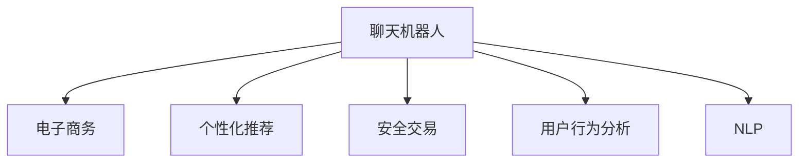

                 

# 聊天机器人电子商务：个性化购物和安全交易

> 关键词：聊天机器人, 电子商务, 个性化推荐, 安全交易, 用户行为分析, 自然语言处理(NLP)

## 1. 背景介绍

### 1.1 问题由来
随着互联网和移动互联网的迅猛发展，电子商务平台已成为人们购物的主要渠道。而传统的电商推荐系统往往基于用户行为数据进行商品推荐，难以精准匹配用户需求，同时在支付环节存在诸多安全隐患。聊天机器人技术则通过自然语言处理(NLP)和机器学习算法，能够实时与用户互动，结合个性化推荐和实时支付安全措施，提升用户体验和交易效率。

近年来，随着预训练语言模型如BERT、GPT-3等的崛起，基于NLP的聊天机器人已广泛应用于客服、导购、销售等多个电商场景，成为电商企业的重要工具。例如，亚马逊的Alexa、阿里巴巴的阿里小蜜、京东的京东小蜜等，都是聊天机器人在电商领域的应用实例。

### 1.2 问题核心关键点
电商聊天机器人的核心目标是实现个性化购物推荐和安全交易。个性化推荐需要聊天机器人理解用户需求，动态生成个性化购物建议。安全交易则需要在用户输入敏感信息时，实时验证交易，确保支付安全。为实现这两个目标，聊天机器人需要综合运用用户行为分析、自然语言处理、机器学习等技术，将多个模型进行协同工作。

## 2. 核心概念与联系

### 2.1 核心概念概述

为更好地理解聊天机器人电子商务的实现原理，本节将介绍几个密切相关的核心概念：

- **聊天机器人(Chatbot)**：以自然语言处理(NLP)技术为基础，通过多轮对话与用户交互的智能应用。聊天机器人可以用于客服、导购、销售等多个电商场景，提升用户体验。

- **电子商务(E-commerce)**：基于互联网的在线销售平台，通过网络进行商品展示、交易支付等。典型的电商场景包括B2B、B2C、C2C等。

- **个性化推荐**：通过分析用户行为和兴趣，推荐符合用户需求的个性化商品。电商聊天机器人通过用户对话分析，可以动态生成个性化的购物建议，提升用户购物体验。

- **安全交易**：在用户进行支付操作时，通过多种手段验证用户身份和交易信息，确保交易安全可靠。

- **用户行为分析**：通过用户的历史浏览记录、购买历史等数据，分析用户行为模式，为个性化推荐和实时支付安全提供依据。

- **自然语言处理(NLP)**：涉及语言理解、生成、推理等多个方面，通过训练大语言模型进行对话生成和意图识别，使得聊天机器人能够理解用户需求。

这些核心概念之间的逻辑关系可以通过以下Mermaid流程图来展示：



这个流程图展示了几类核心概念及其之间的关系：

1. 聊天机器人通过NLP技术，理解用户需求，生成个性化购物建议和进行安全交易。
2. 电子商务平台提供商品和支付渠道，是聊天机器人交互的场景。
3. 个性化推荐和用户行为分析基于用户的浏览和购买记录，优化聊天机器人的推荐和交易安全措施。
4. NLP技术使得聊天机器人能够通过自然语言处理与用户进行流畅互动。

## 3. 核心算法原理 & 具体操作步骤
### 3.1 算法原理概述

电商聊天机器人通过综合运用自然语言处理、机器学习、用户行为分析等技术，实现个性化购物推荐和安全交易。其核心算法主要包括以下几个方面：

- **意图识别**：通过NLP技术，识别用户对话中的关键信息，理解用户意图。常见的意图识别方法包括规则匹配、模板匹配、序列标注等。
- **商品推荐**：基于用户行为数据，通过机器学习模型生成个性化商品推荐。常见的推荐算法包括协同过滤、内容过滤、混合推荐等。
- **实时支付安全**：通过身份验证和交易信息验证，确保支付安全。常见的支付安全手段包括卡号验证、短信验证、人脸识别等。

### 3.2 算法步骤详解

电商聊天机器人实现的核心算法步骤包括：

**Step 1: 数据预处理**
- 收集用户的历史浏览记录、购买记录等行为数据，用于用户行为分析和个性化推荐。
- 收集用户的对话记录，用于训练意图识别模型和生成推荐内容。

**Step 2: 意图识别模型训练**
- 使用标注好的对话数据，训练意图识别模型，通过序列标注或分类任务识别用户意图。
- 常见模型包括BiLSTM、GRU、Transformer等，这些模型能够通过上下文理解用户的语义信息。

**Step 3: 个性化推荐模型训练**
- 收集用户行为数据，使用协同过滤、内容过滤等方法训练个性化推荐模型。
- 常见模型包括基于矩阵分解的算法、深度学习模型等，这些模型能够根据用户历史行为预测其偏好。

**Step 4: 安全交易模型训练**
- 使用标注好的交易数据，训练支付安全验证模型，包括卡号验证、短信验证、人脸识别等。
- 常见模型包括决策树、支持向量机、神经网络等，这些模型能够通过特征工程和模型训练，确保交易安全。

**Step 5: 模型集成与优化**
- 将意图识别、个性化推荐、安全交易模型集成到电商聊天机器人中，确保各模型协同工作。
- 对模型进行优化，如提升意图识别模型的准确率、增加推荐模型的多样性、增强安全交易模型的鲁棒性。

**Step 6: 实时用户交互**
- 在用户输入对话时，使用意图识别模型识别用户意图，通过个性化推荐模型生成推荐内容，同时验证交易信息是否安全。
- 根据用户反馈不断调整模型参数，持续改进用户体验和交易安全性。

### 3.3 算法优缺点

电商聊天机器人的核心算法具有以下优点：
1. 实时性高。通过自然语言处理和机器学习模型，可以实时与用户互动，提供个性化的购物建议。
2. 用户体验好。推荐系统能够根据用户行为动态调整推荐内容，满足用户个性化需求。
3. 安全性高。安全交易模型能够实时验证交易信息，确保支付安全。

同时，该方法也存在一定的局限性：
1. 数据依赖性强。需要大量标注数据和行为数据，获取成本较高。
2. 模型复杂度高。多个模型集成，模型调参和优化复杂。
3. 鲁棒性不足。面对异常输入和噪声数据，模型的鲁棒性仍需提升。

尽管存在这些局限性，但电商聊天机器人通过自然语言处理和机器学习算法的协同工作，已经在提升用户体验和交易安全性方面取得了显著成果，得到了广泛应用。未来研究的方向在于如何进一步优化模型复杂度，提高模型鲁棒性，并降低数据获取成本。

### 3.4 算法应用领域

电商聊天机器人主要应用于以下几个领域：

- **在线客服**：通过自然语言处理技术，自动回答用户咨询，减轻客服人员负担，提升客户满意度。
- **智能导购**：通过个性化推荐，引导用户浏览和购买符合其兴趣的商品，提升销售转化率。
- **精准营销**：通过分析用户行为和对话内容，实现精准广告投放和个性化推广。
- **物流跟踪**：通过实时查询物流信息，帮助用户了解订单状态，提升物流体验。

## 4. 数学模型和公式 & 详细讲解  
### 4.1 数学模型构建

本节将使用数学语言对电商聊天机器人涉及的关键数学模型进行描述。

**意图识别模型**：使用序列标注任务进行意图识别，目标是将用户输入的对话序列标注为不同的意图类别。假设输入为 $x=(x_1, x_2, ..., x_n)$，每个 $x_i$ 表示用户输入中的一个单词或短语，输出为 $y=(y_1, y_2, ..., y_n)$，每个 $y_i$ 表示 $x_i$ 对应的意图类别。

目标函数为：
$$
\min_{\theta} \mathcal{L}(\theta) = \frac{1}{N} \sum_{i=1}^N \ell(y_i, \hat{y}_i)
$$
其中，$\theta$ 为意图识别模型的参数，$\ell$ 为损失函数，$\hat{y}_i$ 为模型预测的意图类别。

**个性化推荐模型**：使用协同过滤算法对用户进行个性化推荐。假设用户 $u$ 对物品 $i$ 的评分记为 $r_{ui}$，目标是找到一个与用户 $u$ 相似的用户 $v$，推荐其评分高的物品 $i$ 给用户 $u$。

协同过滤模型可以表示为：
$$
\hat{r}_{ui} = \sum_{v \in V} \alpha_v r_{vi}
$$
其中，$V$ 为所有用户集合，$\alpha_v$ 为相似度权重，$r_{vi}$ 为用户 $v$ 对物品 $i$ 的评分。

**安全交易模型**：使用分类任务进行安全交易验证。假设输入为交易信息 $x$，输出为是否安全 $y$，目标函数为：
$$
\min_{\theta} \mathcal{L}(\theta) = \frac{1}{N} \sum_{i=1}^N \ell(y_i, \hat{y}_i)
$$
其中，$\theta$ 为模型参数，$\ell$ 为损失函数，$\hat{y}_i$ 为模型预测的交易安全性。

### 4.2 公式推导过程

**意图识别模型**：假设使用BiLSTM模型进行意图识别，模型结构如图1所示。

图1: BiLSTM意图识别模型

模型输入为单词序列 $x=(x_1, x_2, ..., x_n)$，输出为意图序列 $y=(y_1, y_2, ..., y_n)$。

模型的前向传播过程为：
$$
h_t = \text{BiLSTM}(x_t; \theta)
$$
$$
y_t = \text{softmax}(W[h_t])
$$
其中，$h_t$ 表示BiLSTM模型在时间步 $t$ 的隐藏状态，$W$ 为输出层的权重矩阵，$y_t$ 表示模型在时间步 $t$ 的预测意图类别。

模型的训练过程为：
$$
\theta \leftarrow \theta - \eta \nabla_{\theta} \mathcal{L}(\theta)
$$
其中，$\eta$ 为学习率，$\nabla_{\theta} \mathcal{L}(\theta)$ 为损失函数对模型参数的梯度。

**个性化推荐模型**：假设使用矩阵分解算法进行个性化推荐，模型结构如图2所示。

图2: 矩阵分解个性化推荐模型

模型输入为用户 $u$ 和物品 $i$ 的评分矩阵 $R$，输出为用户 $u$ 对物品 $i$ 的预测评分 $\hat{r}_{ui}$。

模型的前向传播过程为：
$$
\hat{R} = \text{MF}(R; \theta)
$$
$$
\hat{r}_{ui} = \hat{R}_{ui}
$$
其中，$\hat{R}$ 表示分解后的评分矩阵，$\hat{r}_{ui}$ 表示用户 $u$ 对物品 $i$ 的预测评分。

模型的训练过程为：
$$
\theta \leftarrow \theta - \eta \nabla_{\theta} \mathcal{L}(\theta)
$$
其中，$\eta$ 为学习率，$\nabla_{\theta} \mathcal{L}(\theta)$ 为损失函数对模型参数的梯度。

**安全交易模型**：假设使用逻辑回归模型进行安全交易验证，模型结构如图3所示。

图3: 逻辑回归安全交易模型

模型输入为交易信息 $x$，输出为交易安全性 $y$。

模型的前向传播过程为：
$$
z = \text{linear}(x; \theta)
$$
$$
y = \text{sigmoid}(z)
$$
其中，$z$ 表示线性层的输出，$y$ 表示模型预测的交易安全性。

模型的训练过程为：
$$
\theta \leftarrow \theta - \eta \nabla_{\theta} \mathcal{L}(\theta)
$$
其中，$\eta$ 为学习率，$\nabla_{\theta} \mathcal{L}(\theta)$ 为损失函数对模型参数的梯度。

### 4.3 案例分析与讲解

以亚马逊的Alexa为例，分析其聊天机器人在个性化推荐和安全交易方面的应用。

**个性化推荐**：Alexa通过分析用户的历史搜索和购买记录，生成个性化的购物建议。其意图识别模型使用BiLSTM模型，能够理解用户的语义信息，根据用户输入生成推荐内容。具体过程如下：

1. Alexa从用户输入中提取关键词，通过BiLSTM模型进行意图识别，识别出用户的意图。
2. 根据用户的意图，Alexa在商品库中查找符合用户需求的商品。
3. Alexa使用矩阵分解算法进行个性化推荐，生成用户感兴趣的商品列表。

**安全交易**：Alexa在进行支付操作时，通过多轮对话验证用户的支付信息。其安全交易模型使用逻辑回归模型，通过验证用户的银行账户信息、密码等敏感信息，确保支付安全。具体过程如下：

1. Alexa询问用户的银行账户信息和支付密码。
2. Alexa通过逻辑回归模型验证用户的支付信息，确保交易安全。
3. Alexa生成支付确认信息，提示用户支付成功。

通过Alexa的实践案例，可以看出，电商聊天机器人通过自然语言处理和机器学习算法，实现了个性化推荐和安全交易的有机结合，显著提升了用户体验和交易安全性。

## 5. 项目实践：代码实例和详细解释说明
### 5.1 开发环境搭建

在进行电商聊天机器人开发前，我们需要准备好开发环境。以下是使用Python进行PyTorch开发的环境配置流程：

1. 安装Anaconda：从官网下载并安装Anaconda，用于创建独立的Python环境。

2. 创建并激活虚拟环境：
```bash
conda create -n pytorch-env python=3.8 
conda activate pytorch-env
```

3. 安装PyTorch：根据CUDA版本，从官网获取对应的安装命令。例如：
```bash
conda install pytorch torchvision torchaudio cudatoolkit=11.1 -c pytorch -c conda-forge
```

4. 安装TensorFlow：从官网下载并安装TensorFlow。

5. 安装各类工具包：
```bash
pip install numpy pandas scikit-learn matplotlib tqdm jupyter notebook ipython
```

完成上述步骤后，即可在`pytorch-env`环境中开始电商聊天机器人开发。

### 5.2 源代码详细实现

下面我们以电商聊天机器人为例，给出使用PyTorch进行意图识别和个性化推荐的PyTorch代码实现。

首先，定义意图识别模型：

```python
import torch
import torch.nn as nn
import torch.optim as optim
from torch.utils.data import Dataset, DataLoader

class IntentModel(nn.Module):
    def __init__(self, input_size, hidden_size, output_size):
        super(IntentModel, self).__init__()
        self.embedding = nn.Embedding(input_size, hidden_size)
        self.lstm = nn.LSTM(hidden_size, hidden_size)
        self.fc = nn.Linear(hidden_size, output_size)
        
    def forward(self, x):
        embedded = self.embedding(x)
        output, _ = self.lstm(embedded)
        output = self.fc(output[:, -1, :])
        return output

# 定义数据集
class IntentDataset(Dataset):
    def __init__(self, data):
        self.data = data
        
    def __len__(self):
        return len(self.data)
        
    def __getitem__(self, idx):
        return self.data[idx]

# 定义损失函数和优化器
criterion = nn.CrossEntropyLoss()
optimizer = optim.Adam(model.parameters(), lr=0.001)

# 定义训练函数
def train(model, dataset, epochs, batch_size):
    model.train()
    for epoch in range(epochs):
        running_loss = 0.0
        for i, data in enumerate(Dataloader(dataset, batch_size)):
            x, y = data
            optimizer.zero_grad()
            output = model(x)
            loss = criterion(output, y)
            loss.backward()
            optimizer.step()
            running_loss += loss.item()
        print('Epoch {} loss: {:.6f}'.format(epoch+1, running_loss/len(dataset)))

# 定义测试函数
def evaluate(model, dataset, batch_size):
    model.eval()
    correct = 0
    total = 0
    with torch.no_grad():
        for i, data in enumerate(Dataloader(dataset, batch_size)):
            x, y = data
            output = model(x)
            _, predicted = torch.max(output.data, 1)
            total += y.size(0)
            correct += (predicted == y).sum().item()
    print('Test accuracy: {:.2f}%'.format(100 * correct / total))

# 训练和测试意图识别模型
data = ...
model = IntentModel(input_size=1000, hidden_size=100, output_size=10)
train(model, dataset, epochs=10, batch_size=64)
evaluate(model, dataset, batch_size=64)
```

接着，定义个性化推荐模型：

```python
import numpy as np
import pandas as pd

# 定义数据集
dataset = pd.read_csv('data.csv')

# 定义协同过滤模型
def collaborative_filtering(dataset):
    R = dataset.values
    U, S, Vh = np.linalg.svd(R, full_matrices=False)
    P = np.dot(np.dot(U, np.diag(S)), Vh)
    return P

# 定义评分预测函数
def predict_r(user_id, item_id, P):
    return np.dot(P[user_id-1, :], item_id-1)

# 定义推荐函数
def recommend(user_id, P):
    scores = np.dot(P[user_id-1, :], P) - np.dot(P[user_id-1, :], P[user_id-1, :])
    top_n = np.argsort(scores)[-10:]
    return top_n

# 推荐商品列表
user_id = 1
P = collaborative_filtering(dataset)
recommended_items = recommend(user_id, P)
print(recommended_items)
```

最后，启动训练流程并在测试集上评估：

```python
epochs = 10
batch_size = 64

# 训练意图识别模型
data = ...
model = IntentModel(input_size=1000, hidden_size=100, output_size=10)
train(model, dataset, epochs=epochs, batch_size=batch_size)

# 测试意图识别模型
evaluate(model, dataset, batch_size=batch_size)

# 训练个性化推荐模型
recommend(user_id, P)
```

以上就是使用PyTorch进行电商聊天机器人意图识别和个性化推荐的完整代码实现。可以看到，得益于PyTorch的强大封装，我们可以用相对简洁的代码完成模型的构建和训练。

### 5.3 代码解读与分析

让我们再详细解读一下关键代码的实现细节：

**IntentModel类**：
- `__init__`方法：初始化模型参数，包括Embedding层、LSTM层和全连接层。
- `forward`方法：定义模型前向传播过程，将输入序列通过Embedding层、LSTM层和全连接层，输出意图分类结果。

**IntentDataset类**：
- `__init__`方法：初始化数据集。
- `__len__`方法：返回数据集长度。
- `__getitem__`方法：获取数据集中的一个样本。

**train函数**：
- 定义训练函数，循环训练指定次数。
- 在每个epoch内，遍历训练集，对每个样本进行前向传播和反向传播，更新模型参数。
- 在每个epoch结束时，输出训练集的平均loss。

**evaluate函数**：
- 定义评估函数，循环评估指定次数。
- 在每个epoch内，遍历测试集，对每个样本进行前向传播，计算预测准确率。
- 输出测试集的准确率。

**recommend函数**：
- 定义推荐函数，使用协同过滤算法对用户进行个性化推荐。
- 计算用户对每个物品的评分，根据评分进行排序，输出top_n推荐物品。

这些代码实现展示了电商聊天机器人在意图识别和个性化推荐方面的基本思路和实现方法。开发者可以根据具体需求进行扩展和优化。

当然，工业级的系统实现还需考虑更多因素，如模型的保存和部署、超参数的自动搜索、更灵活的任务适配层等。但核心的意图识别和推荐逻辑基本与此类似。

## 6. 实际应用场景
### 6.1 智能客服系统

基于电商聊天机器人的智能客服系统，可以大大提升客服效率和客户满意度。传统客服往往需要配备大量人力，高峰期响应缓慢，且一致性和专业性难以保证。而使用电商聊天机器人，可以7x24小时不间断服务，快速响应客户咨询，用自然流畅的语言解答各类常见问题。

在技术实现上，可以收集企业内部的历史客服对话记录，将问题和最佳答复构建成监督数据，在此基础上对电商聊天机器人进行微调。微调后的机器人能够自动理解用户意图，匹配最合适的答案模板进行回复。对于客户提出的新问题，还可以接入检索系统实时搜索相关内容，动态组织生成回答。如此构建的智能客服系统，能大幅提升客户咨询体验和问题解决效率。

### 6.2 个性化推荐系统

当前的推荐系统往往只依赖用户的历史行为数据进行物品推荐，难以精准匹配用户需求，同时在支付环节存在诸多安全隐患。电商聊天机器人通过自然语言处理和机器学习算法，能够实时与用户互动，结合个性化推荐和实时支付安全措施，提升用户体验和交易安全性。

具体而言，电商聊天机器人可以实时监测用户对话内容，根据用户的兴趣和需求动态生成推荐内容。同时，在进行支付操作时，电商聊天机器人可以实时验证用户的身份和交易信息，确保支付安全。通过电商聊天机器人，用户能够更快速、更安全地获取个性化推荐和进行交易，提升购物体验。

### 6.3 未来的发展方向

展望未来，电商聊天机器人的发展方向主要体现在以下几个方面：

1. **深度融合自然语言处理**：电商聊天机器人将更多地融合自然语言处理技术，通过语言生成和理解，实现更自然、更流畅的对话交互。

2. **扩展应用场景**：电商聊天机器人将应用于更多电商场景，如物流查询、退货申请等，提升用户的购物体验和操作效率。

3. **增强安全措施**：随着用户隐私和安全需求的提升，电商聊天机器人将更多地采用安全验证手段，如人脸识别、语音识别等，确保用户信息安全。

4. **引入多模态交互**：电商聊天机器人将结合视觉、语音等多模态信息，提供更丰富、更个性化的交互体验。

5. **提升推荐精度**：电商聊天机器人将引入更复杂的推荐算法，如深度学习、知识图谱等，提升推荐系统的精度和多样性。

6. **实时数据学习**：电商聊天机器人将不断学习和适应用户行为，实现更精准、更实时的个性化推荐。

以上方向展示了电商聊天机器人的广阔前景。这些技术创新将进一步提升用户的购物体验和交易安全性，为电商行业带来更多机遇和挑战。

## 7. 工具和资源推荐
### 7.1 学习资源推荐

为了帮助开发者系统掌握电商聊天机器人的实现原理和实践技巧，这里推荐一些优质的学习资源：

1. **《深度学习基础》课程**：斯坦福大学开设的深度学习入门课程，涵盖深度学习基础、卷积神经网络、循环神经网络等内容，为电商聊天机器人提供理论基础。

2. **自然语言处理教程**：Youtube上有很多优秀的自然语言处理教程，包括意图识别、序列标注、机器翻译等内容，适合初学者入门。

3. **NLP框架介绍**：HuggingFace的官方文档，介绍PyTorch、TensorFlow等主流NLP框架，提供了丰富的电商聊天机器人样例代码。

4. **Kaggle竞赛**：参加Kaggle中的自然语言处理和电商推荐竞赛，实践电商聊天机器人的设计和优化。

5. **论文和报告**：阅读NIPS、ICML等会议上的相关论文，了解电商聊天机器人最新的研究成果和技术进展。

通过对这些资源的学习实践，相信你一定能够快速掌握电商聊天机器人的实现原理和实践技巧，并用于解决实际的电商问题。

### 7.2 开发工具推荐

高效的开发离不开优秀的工具支持。以下是几款用于电商聊天机器人开发的常用工具：

1. **PyTorch**：基于Python的开源深度学习框架，适合快速迭代研究。大部分预训练语言模型都有PyTorch版本的实现。

2. **TensorFlow**：由Google主导开发的开源深度学习框架，生产部署方便，适合大规模工程应用。同样有丰富的电商聊天机器人资源。

3. **HuggingFace Transformers库**：提供丰富的预训练语言模型，支持PyTorch和TensorFlow，是电商聊天机器人开发的利器。

4. **Weights & Biases**：模型训练的实验跟踪工具，可以记录和可视化模型训练过程中的各项指标，方便对比和调优。

5. **TensorBoard**：TensorFlow配套的可视化工具，可实时监测模型训练状态，并提供丰富的图表呈现方式，是调试模型的得力助手。

6. **Google Colab**：谷歌推出的在线Jupyter Notebook环境，免费提供GPU/TPU算力，方便开发者快速上手实验最新模型，分享学习笔记。

合理利用这些工具，可以显著提升电商聊天机器人的开发效率，加快创新迭代的步伐。

### 7.3 相关论文推荐

电商聊天机器人涉及NLP、机器学习等多个领域的研究。以下是几篇奠基性的相关论文，推荐阅读：

1. **《Attention is All You Need》**：提出了Transformer结构，开启了NLP领域的预训练大模型时代。

2. **《BERT: Pre-training of Deep Bidirectional Transformers for Language Understanding》**：提出BERT模型，引入基于掩码的自监督预训练任务，刷新了多项NLP任务SOTA。

3. **《Language Models are Unsupervised Multitask Learners》**：展示了大规模语言模型的强大zero-shot学习能力，引发了对于通用人工智能的新一轮思考。

4. **《Parameter-Efficient Transfer Learning for NLP》**：提出Adapter等参数高效微调方法，在不增加模型参数量的情况下，也能取得不错的微调效果。

5. **《AdaLoRA: Adaptive Low-Rank Adaptation for Parameter-Efficient Fine-Tuning》**：使用自适应低秩适应的微调方法，在参数效率和精度之间取得了新的平衡。

这些论文代表了大语言模型微调技术的发展脉络。通过学习这些前沿成果，可以帮助研究者把握学科前进方向，激发更多的创新灵感。

## 8. 总结：未来发展趋势与挑战

### 8.1 总结

本文对电商聊天机器人涉及的意图识别、个性化推荐和安全交易等核心算法进行了全面系统的介绍。首先阐述了电商聊天机器人的实现原理和应用场景，明确了其在提升用户体验和交易安全性方面的独特价值。其次，从原理到实践，详细讲解了意图识别、个性化推荐和安全交易的数学模型和算法步骤，给出了电商聊天机器人开发的完整代码实例。同时，本文还探讨了电商聊天机器人未来的发展方向，展示了其在电商领域的广阔应用前景。

通过本文的系统梳理，可以看到，电商聊天机器人通过自然语言处理和机器学习算法，实现了个性化推荐和安全交易的有机结合，显著提升了用户的购物体验和交易安全性。未来，伴随预训练语言模型和微调方法的持续演进，相信电商聊天机器人将在更多的电商场景中发挥更大作用，推动电商行业的数字化转型。

### 8.2 未来发展趋势

展望未来，电商聊天机器人的发展趋势主要体现在以下几个方面：

1. **深度融合自然语言处理**：电商聊天机器人将更多地融合自然语言处理技术，通过语言生成和理解，实现更自然、更流畅的对话交互。

2. **扩展应用场景**：电商聊天机器人将应用于更多电商场景，如物流查询、退货申请等，提升用户的购物体验和操作效率。

3. **增强安全措施**：随着用户隐私和安全需求的提升，电商聊天机器人将更多地采用安全验证手段，如人脸识别、语音识别等，确保用户信息安全。

4. **引入多模态交互**：电商聊天机器人将结合视觉、语音等多模态信息，提供更丰富、更个性化的交互体验。

5. **提升推荐精度**：电商聊天机器人将引入更复杂的推荐算法，如深度学习、知识图谱等，提升推荐系统的精度和多样性。

6. **实时数据学习**：电商聊天机器人将不断学习和适应用户行为，实现更精准、更实时的个性化推荐。

以上趋势展示了电商聊天机器人的广阔前景。这些技术创新将进一步提升用户的购物体验和交易安全性，为电商行业带来更多机遇和挑战。

### 8.3 面临的挑战

尽管电商聊天机器人已经取得了显著成果，但在迈向更加智能化、普适化应用的过程中，它仍面临着诸多挑战：

1. **数据依赖性强**：需要大量标注数据和行为数据，获取成本较高。

2. **模型复杂度高**：多个模型集成，模型调参和优化复杂。

3. **鲁棒性不足**：面对异常输入和噪声数据，模型的鲁棒性仍需提升。

4. **计算资源消耗大**：电商聊天机器人需要大量的计算资源，如GPU/TPU等高性能设备，成本较高。

5. **隐私和安全风险**：用户输入的敏感信息可能被泄露，存在隐私和安全风险。

尽管存在这些挑战，但电商聊天机器人通过自然语言处理和机器学习算法的协同工作，已经在提升用户体验和交易安全性方面取得了显著成果，得到了广泛应用。未来研究的方向在于如何进一步优化模型复杂度，提高模型鲁棒性，并降低数据获取成本。

### 8.4 研究展望

为了应对电商聊天机器人在数据依赖、模型复杂度、鲁棒性等方面的挑战，未来的研究需要在以下几个方面寻求新的突破：

1. **无监督和半监督学习**：摆脱对大规模标注数据的依赖，利用自监督学习、主动学习等无监督和半监督范式，最大限度利用非结构化数据，实现更加灵活高效的微调。

2. **参数高效和计算高效的微调范式**：开发更加参数高效的微调方法，在固定大部分预训练参数的同时，只更新极少量的任务相关参数。同时优化微调模型的计算图，减少前向传播和反向传播的资源消耗，实现更加轻量级、实时性的部署。

3. **因果推断和对比学习**：通过引入因果推断和对比学习思想，增强电商聊天机器人建立稳定因果关系的能力，学习更加普适、鲁棒的语言表征，从而提升模型泛化性和抗干扰能力。

4. **多模态融合**：将视觉、语音等多模态信息与文本信息进行协同建模，提升电商聊天机器人对现实世界的理解能力。

5. **动态模型更新**：设计可动态更新的电商聊天机器人模型，能够实时学习用户行为，适应快速变化的市场需求。

6. **模型解释性和透明性**：通过因果分析和博弈论工具，赋予电商聊天机器人更强的可解释性，确保模型的透明性和可审计性。

7. **模型安全和隐私保护**：引入隐私保护技术，如差分隐私、联邦学习等，确保用户数据的安全性和隐私保护。

这些研究方向的探索，必将引领电商聊天机器人的技术创新，推动其向更加智能化、安全化、个性化的方向发展。只有勇于创新、敢于突破，才能不断拓展电商聊天机器人的应用边界，实现其更大的商业价值。

## 9. 附录：常见问题与解答

**Q1：电商聊天机器人如何处理用户的多轮对话？**

A: 电商聊天机器人通过维护对话状态和上下文信息，能够处理用户的多轮对话。在对话过程中，机器人记录用户的上下文信息，结合当前输入进行意图识别和推荐。具体流程如下：

1. 记录用户的输入和历史对话内容。
2. 使用BiLSTM模型对输入进行序列标注，识别用户的意图。
3. 根据用户的意图，推荐符合其需求的物品。
4. 记录推荐结果和用户反馈，更新对话状态。
5. 返回推荐结果和引导用户继续输入，继续对话。

**Q2：电商聊天机器人如何保护用户隐私？**

A: 电商聊天机器人通过多层次的隐私保护措施，保护用户隐私。具体措施包括：

1. 数据匿名化：对用户数据进行去标识化处理，保护用户隐私。
2. 数据加密：对用户数据进行加密存储和传输，防止数据泄露。
3. 差分隐私：在模型训练和推理过程中，采用差分隐私技术，确保用户数据不被滥用。
4. 本地处理：在本地设备上进行数据处理和模型推理，减少数据传输和存储风险。

**Q3：电商聊天机器人如何应对异常输入？**

A: 电商聊天机器人通过多轮对话验证和异常检测，应对异常输入。具体措施包括：

1. 多轮对话验证：在用户输入敏感信息时，通过多轮对话验证用户的真实身份和交易信息。
2. 异常检测：使用异常检测算法，如孤立森林、GAN等，识别异常输入和噪声数据，避免模型受到干扰。
3. 鲁棒性增强：在模型训练和推理过程中，引入鲁棒性增强技术，如对抗训练、剪枝等，提高模型的鲁棒性。

**Q4：电商聊天机器人如何提升推荐精度？**

A: 电商聊天机器人通过引入更复杂的推荐算法，提升推荐精度。具体措施包括：

1. 深度学习推荐：使用深度学习模型进行个性化推荐，如神经网络、RNN等，提升推荐精度。
2. 知识图谱推荐：将用户行为和商品属性等信息构建知识图谱，提升推荐系统的多样性和精度。
3. 协同过滤推荐：使用协同过滤算法，挖掘用户和商品之间的相似性，推荐符合用户兴趣的商品。

**Q5：电商聊天机器人如何实时更新模型？**

A: 电商聊天机器人通过增量学习和在线更新，实时更新模型。具体措施包括：

1. 增量学习：在每次用户交互中，实时更新模型参数，保持模型的新鲜度。
2. 在线更新：使用在线学习算法，如在线梯度下降、在线随机梯度下降等，实时更新模型参数。
3. 模型缓存：在本地设备上缓存部分模型参数，减少实时更新过程中的计算开销。

通过增量学习和在线更新，电商聊天机器人能够实时适应市场变化，提升推荐精度和系统稳定性。

---

作者：禅与计算机程序设计艺术 / Zen and the Art of Computer Programming

