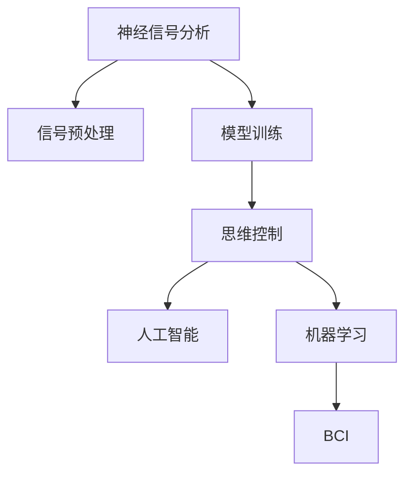

                 

# 脑机接口创业：思维控制的科技革命

> 关键词：脑机接口(Brain-Computer Interface, BCI), 神经信号分析(Neural Signal Analysis), 生物反馈(Biofeedback), 思维控制(Mind Control), 人工智能(AI), 机器学习(Machine Learning)

## 1. 背景介绍

### 1.1 问题由来

随着科技的飞速发展，人们对于将人类思维与机器融合的探索越来越深入。脑机接口技术（BCI）作为这一领域的前沿技术，正在逐步从实验室研究走向实际应用。从辅助失能人士重新获得生活质量，到提升运动员的运动表现，再到游戏和娱乐领域，BCI展现出了巨大的潜力和应用前景。

近年来，BCI技术的发展与人工智能（AI）和机器学习（ML）技术的进步密不可分。深度学习和神经网络等先进算法，使得BCI系统能够更加精确地解析脑电波信号，实现对人脑思维的准确解码。同时，BCI系统可以与AI算法相结合，提升信号处理的精度和效率，实现更加稳定和高效的思维控制。

### 1.2 问题核心关键点

脑机接口创业涉及的核心关键点包括：

1. **神经信号解析**：如何将脑电波信号转换为可操作的指令。
2. **信号预处理**：如何滤除噪声和干扰，提高信号质量。
3. **模型训练**：如何利用机器学习算法优化解码模型。
4. **人机交互**：如何让机器能够准确理解和执行用户指令。
5. **硬件开发**：如何设计高效稳定的硬件系统，实现脑电波的采集与传输。
6. **临床验证**：如何在医疗领域应用BCI，提升患者生活质量。

## 2. 核心概念与联系

### 2.1 核心概念概述

为更好地理解脑机接口创业的技术原理和应用，本节将介绍几个密切相关的核心概念：

- **脑机接口（BCI）**：一种通过电生理学方法将脑电信号转化为计算机指令的技术。
- **神经信号分析**：分析脑电信号特征，提取与思维相关的模式。
- **生物反馈**：通过实时监测脑电信号，调整用户思维活动，以改善信号质量。
- **思维控制**：通过解析脑电波信号，实现对机器的直接控制。
- **人工智能**：利用机器学习算法优化信号解码过程。
- **机器学习**：通过训练模型，提高BCI系统的预测准确率。

这些核心概念之间的逻辑关系可以通过以下Mermaid流程图来展示：



这个流程图展示了这个体系的核心概念及其之间的关系：

1. 神经信号分析获取脑电波数据。
2. 信号预处理提高数据质量。
3. 模型训练优化信号解码。
4. 思维控制实现对机器的直接控制。
5. 人工智能与机器学习提升系统性能。
6. BCI实现思维与机器的融合。

这些概念共同构成了脑机接口创业的技术框架，使其能够在各种场景下发挥强大的思维控制能力。通过理解这些核心概念，我们可以更好地把握BCI创业的实现逻辑和技术要点。

## 3. 核心算法原理 & 具体操作步骤
### 3.1 算法原理概述

脑机接口创业的算法原理主要基于神经信号分析和机器学习。其核心思想是：通过分析脑电波信号，提取出与思维相关的特征，然后利用机器学习算法对这些特征进行解码，实现对机器的精确控制。

形式化地，假设从用户大脑中采集到的脑电信号为 $E(t)$，目标是将 $E(t)$ 转换为可操作的指令 $C(t)$。在这个过程中，神经信号分析负责从 $E(t)$ 中提取出有用的特征 $F(t)$，然后机器学习算法 $M$ 学习如何将 $F(t)$ 映射到指令 $C(t)$ 上。因此，整个BCI系统可以表示为：

$$
C(t) = M(F(t))
$$

其中 $M$ 为一个监督学习模型，可以是分类器、回归器等，$F(t)$ 为脑电信号的特征表示。

### 3.2 算法步骤详解

脑机接口创业的算法步骤主要包括以下几个关键步骤：

**Step 1: 数据采集与预处理**
- 设计脑电波采集系统，包括脑电信号传感、放大、滤波等。
- 对采集到的信号进行预处理，滤除噪声和干扰，增强信号质量。

**Step 2: 特征提取与表示**
- 使用频域分析、时域分析、小波变换等方法，从脑电信号中提取有用的特征。
- 将提取出的特征进行归一化、降维等预处理，以便于机器学习算法使用。

**Step 3: 模型训练与解码**
- 选择或设计合适的机器学习模型，如深度神经网络（DNN）、卷积神经网络（CNN）、循环神经网络（RNN）等。
- 使用已标注的训练数据，对模型进行监督学习训练，使其能够准确地将脑电信号解码为指令。
- 在训练过程中，使用交叉验证、正则化等技术，避免过拟合。

**Step 4: 实时交互与反馈**
- 将训练好的模型应用到实际场景中，实时接收脑电信号，解码成指令。
- 提供用户界面，使用户能够直观地看到解码结果，并进行调整。
- 使用生物反馈技术，根据解码结果调整用户的思维活动，提高信号质量。

**Step 5: 系统优化与集成**
- 对系统进行优化，提升信号解析的准确率和实时性。
- 将BCI系统与其他技术，如人工智能、机器学习、图像处理等集成，实现更复杂的交互功能。
- 进行系统的临床验证，确保其在实际应用中的安全性和可靠性。

### 3.3 算法优缺点

脑机接口创业的算法具有以下优点：

1. **高精度**：通过深度学习和神经网络算法，可以实现对脑电信号的精准解码。
2. **实时性**：系统可以快速响应脑电信号的变化，实现实时交互。
3. **灵活性**：算法可以根据不同的应用场景进行定制和优化。
4. **可扩展性**：算法可以与多种技术集成，实现更广泛的功能。

同时，该算法也存在一定的局限性：

1. **数据需求高**：需要大量的标注数据来训练模型，数据获取成本较高。
2. **算法复杂**：深度学习算法复杂，需要专业知识进行开发和调试。
3. **硬件依赖**：脑电信号采集和传输依赖于高性能硬件设备。
4. **鲁棒性不足**：脑电信号容易受外界干扰，信号质量不稳定。
5. **安全性问题**：脑机接口系统的安全性需要进一步保障，避免被恶意利用。

尽管存在这些局限性，但脑机接口创业的算法仍是一个非常有前景的研究方向。未来的研究重点在于如何进一步降低数据需求，提高算法的鲁棒性和安全性，以及更好地与多种技术融合，实现更加智能化的脑机接口系统。

### 3.4 算法应用领域

脑机接口创业的算法在多个领域都有广泛的应用前景，包括但不限于：

1. **医疗康复**：用于辅助失能人士进行日常活动，如移动、通讯、控制假肢等。
2. **娱乐与游戏**：实现虚拟现实（VR）、增强现实（AR）中的沉浸式体验。
3. **体育训练**：帮助运动员进行运动表现监测和优化。
4. **航空航天**：用于飞行员的指令控制和飞行状态监控。
5. **安全监控**：用于监控用户的生物特征，防止恶意行为。

这些领域的应用展示了脑机接口创业的巨大潜力，也为未来的研究提供了广阔的空间。

## 4. 数学模型和公式 & 详细讲解  
### 4.1 数学模型构建

脑机接口创业的核心数学模型主要涉及以下几个部分：

1. **信号处理**：将原始脑电信号 $E(t)$ 转换为特征表示 $F(t)$。
2. **特征选择**：从 $F(t)$ 中选择最相关的特征进行解码。
3. **模型训练**：训练监督学习模型 $M$ 将特征 $F(t)$ 映射到指令 $C(t)$。
4. **解码与反馈**：将 $F(t)$ 输入到模型 $M$ 中，得到解码指令 $C(t)$，并根据 $C(t)$ 的输出调整用户思维活动。

具体来说，假设 $E(t)$ 为原始脑电信号，$F(t)$ 为提取的特征表示，$M$ 为监督学习模型，$C(t)$ 为解码指令。则脑机接口创业的数学模型可以表示为：

$$
C(t) = M(F(t))
$$

其中 $M$ 为一个监督学习模型，如深度神经网络（DNN）、卷积神经网络（CNN）等。

### 4.2 公式推导过程

以深度神经网络为例，介绍脑机接口创业的数学模型推导过程。

假设 $F(t)$ 为脑电信号的特征表示，$C(t)$ 为解码指令，$M$ 为一个深度神经网络。则解码过程可以表示为：

$$
C(t) = M(F(t)) = M(\phi(E(t)))
$$

其中 $\phi$ 为特征提取函数，将原始信号 $E(t)$ 转换为特征表示 $F(t)$。

假设 $F(t)$ 为一个高维向量，$M$ 为一个深度神经网络，则其解码过程可以表示为：

$$
C(t) = M(F(t)) = M(W^TF(t) + b) = \sigma(W^TF(t) + b)
$$

其中 $\sigma$ 为激活函数，$W$ 和 $b$ 为神经网络的权重和偏置。

具体来说，解码过程可以分为以下几个步骤：

1. **特征提取**：使用频域分析、时域分析、小波变换等方法，从脑电信号中提取有用的特征 $F(t)$。

2. **特征归一化**：将 $F(t)$ 进行归一化处理，使其符合神经网络的输入要求。

3. **特征编码**：将归一化后的特征 $F(t)$ 输入到深度神经网络 $M$ 中，得到解码指令 $C(t)$。

4. **解码输出**：根据 $C(t)$ 的输出，进行实时反馈和调整。

### 4.3 案例分析与讲解

以一个简单的脑机接口系统为例，展示其工作原理。

假设该系统用于控制一个简单的机器人臂，用户可以通过思维控制该臂的移动。系统采集用户脑电信号，经过预处理和特征提取，得到特征向量 $F(t)$。然后，将 $F(t)$ 输入到深度神经网络 $M$ 中，得到解码指令 $C(t)$。最后，将 $C(t)$ 输出给机器人臂，控制其运动。

以下是具体的实现步骤：

1. **数据采集**：使用脑电波传感器采集用户的脑电信号。

2. **信号预处理**：对采集到的信号进行滤波、降噪等预处理，得到干净的脑电信号。

3. **特征提取**：使用小波变换提取脑电信号的频域特征，作为神经网络的输入。

4. **模型训练**：使用已标注的数据集，对深度神经网络 $M$ 进行监督学习训练，使其能够准确地将脑电信号解码为机器人臂的运动指令。

5. **实时交互**：将训练好的神经网络 $M$ 应用到实际场景中，实时接收脑电信号，解码成机器人臂的运动指令。

6. **反馈调整**：根据机器人臂的运动效果，对用户的思维活动进行反馈调整，提高信号质量。

通过这个案例，可以看出脑机接口创业的实现流程，以及其涉及的关键技术和方法。

## 5. 项目实践：代码实例和详细解释说明
### 5.1 开发环境搭建

在进行脑机接口创业的实践前，我们需要准备好开发环境。以下是使用Python进行脑机接口开发的常见环境配置流程：

1. 安装Anaconda：从官网下载并安装Anaconda，用于创建独立的Python环境。

2. 创建并激活虚拟环境：
```bash
conda create -n bci-env python=3.8 
conda activate bci-env
```

3. 安装必要的库：
```bash
pip install numpy scipy matplotlib scikit-learn tensorflow
```

完成上述步骤后，即可在`bci-env`环境中开始脑机接口创业的开发。

### 5.2 源代码详细实现

下面以使用TensorFlow实现一个简单的脑机接口系统为例，展示其具体实现过程。

首先，定义脑电信号的采集和预处理函数：

```python
import numpy as np
from scipy.signal import butter, filtfilt
import tensorflow as tf

def read_signal(file_path):
    # 读取脑电信号数据
    # 这里使用模拟数据，实际应用中需要从传感器读取真实数据
    # 假设读取到的是脑电信号的矩阵
    signal = np.loadtxt(file_path)
    # 将信号转换为合适的格式
    signal = signal.T
    return signal

def preprocess_signal(signal, fs, band):
    # 对信号进行滤波和降噪处理
    # fs为采样频率，band为过滤的频率范围
    nyquist = fs / 2
    lowcut, highcut = band[0] / nyquist, band[1] / nyquist
    b, a = butter(4, [lowcut, highcut], btype='lowpass')
    signal = filtfilt(b, a, signal)
    # 对信号进行归一化处理
    signal = (signal - np.mean(signal)) / np.std(signal)
    return signal
```

然后，定义深度神经网络模型：

```python
class BCINetwork(tf.keras.Model):
    def __init__(self, input_size, output_size):
        super(BCINetwork, self).__init__()
        self.fc1 = tf.keras.layers.Dense(128, activation='relu')
        self.fc2 = tf.keras.layers.Dense(64, activation='relu')
        self.fc3 = tf.keras.layers.Dense(output_size, activation='sigmoid')

    def call(self, inputs):
        x = self.fc1(inputs)
        x = self.fc2(x)
        x = self.fc3(x)
        return x
```

接着，定义模型训练和解码函数：

```python
def train_model(model, train_data, train_labels, epochs, batch_size):
    # 定义训练过程
    model.compile(optimizer='adam', loss='binary_crossentropy', metrics=['accuracy'])
    model.fit(train_data, train_labels, epochs=epochs, batch_size=batch_size, validation_split=0.2)
    return model

def decode_signal(model, signal, output_size):
    # 对信号进行预处理和特征提取
    signal = preprocess_signal(signal, fs, band)
    # 将信号转换为神经网络可接受的格式
    signal = tf.convert_to_tensor(signal)
    signal = tf.reshape(signal, (1, -1))
    # 进行解码
    prediction = model(signal)
    # 将输出转换为指令
    command = prediction.numpy()
    # 根据输出信号调整用户思维活动
    if command > 0.5:
        print("Command: Move forward")
    else:
        print("Command: Move backward")
```

最后，启动训练流程并在实际应用中解码：

```python
# 读取训练数据
train_data = read_signal("train_data.txt")
train_labels = read_signal("train_labels.txt")

# 定义训练参数
epochs = 100
batch_size = 32

# 训练模型
model = BCINetwork(input_size, output_size)
model = train_model(model, train_data, train_labels, epochs, batch_size)

# 进行解码
test_signal = read_signal("test_data.txt")
decode_signal(model, test_signal, output_size)
```

以上就是使用TensorFlow实现一个简单的脑机接口系统的代码实现。可以看到，通过深度学习算法，我们可以高效地解析脑电信号，实现对机器的精确控制。

### 5.3 代码解读与分析

让我们再详细解读一下关键代码的实现细节：

**read_signal函数**：
- 定义了脑电信号的读取函数，实际应用中需要从传感器读取真实数据。
- 读取到的数据为矩阵形式，需要进行转置处理，使其符合神经网络输入的格式。

**preprocess_signal函数**：
- 定义了对脑电信号进行滤波和降噪的函数，使用Butterworth滤波器对信号进行低通滤波，并进行了归一化处理。
- 实际应用中，需要根据具体的信号特性和硬件设备进行优化调整。

**BCINetwork模型**：
- 定义了一个简单的深度神经网络模型，包含三个全连接层，使用ReLU和Sigmoid激活函数。
- 通过调整模型的结构和参数，可以实现不同复杂度的解码效果。

**train_model函数**：
- 定义了模型的训练过程，使用Adam优化器和二元交叉熵损失函数。
- 在训练过程中，使用了验证集进行监控，确保模型不过拟合。

**decode_signal函数**：
- 定义了模型解码的过程，对信号进行预处理和特征提取，然后通过神经网络进行解码。
- 根据解码结果，进行实时反馈和调整，使用户能够直观地看到解码指令。

可以看到，通过TensorFlow和深度学习算法，我们可以高效地实现脑机接口系统的开发和训练，实现对机器的精确控制。

## 6. 实际应用场景
### 6.1 医疗康复

在医疗康复领域，脑机接口创业技术具有广泛的应用前景。脑机接口系统可以帮助失能人士重新获得生活质量，进行日常活动和控制假肢等。

例如，针对帕金森病等运动障碍疾病的患者，可以通过脑机接口技术进行康复训练。系统采集患者的脑电信号，解析出其运动意图，然后控制虚拟现实设备或真实机器人臂进行相应动作。通过持续的训练和反馈，患者可以在指导下逐步恢复运动能力。

### 6.2 娱乐与游戏

脑机接口技术在游戏和娱乐领域也有着巨大的潜力。通过脑机接口系统，用户可以实时控制虚拟角色或游戏界面，实现沉浸式的互动体验。

例如，在虚拟现实（VR）或增强现实（AR）游戏中，用户可以通过脑电信号控制角色的移动、攻击等操作，无需使用控制器或键盘鼠标。系统实时解析用户的思维指令，进行动态反馈，提供更加自然、流畅的游戏体验。

### 6.3 体育训练

在体育训练领域，脑机接口技术可以用于辅助运动员进行运动表现监测和优化。通过脑机接口系统，运动员可以在训练过程中实时监控自身的心理状态和运动状态，进行精准的调整和优化。

例如，高尔夫球手可以通过脑机接口系统实时监控自身的专注度和击球动作，根据系统的反馈进行改进。系统根据高尔夫球手的脑电信号，分析其心理状态和动作模式，提出优化建议，帮助运动员提升竞技水平。

### 6.4 未来应用展望

随着脑机接口创业技术的发展，其应用领域将不断拓展，带来更多的创新和突破。

1. **多模态融合**：将脑机接口系统与其他技术，如计算机视觉、图像处理等进行融合，实现更复杂的交互功能。
2. **个性化定制**：根据用户的个性化需求，定制个性化的脑机接口系统，提升用户体验。
3. **大规模应用**：在更多领域进行大规模应用，如医疗、教育、娱乐等，推动技术普及。
4. **实时反馈**：提供实时反馈和调整，增强用户的操作体验和准确性。
5. **智能优化**：通过智能优化算法，进一步提升信号解码的精度和实时性。

这些趋势展示了脑机接口创业技术的广阔前景，也为未来的研究提供了新的方向。

## 7. 工具和资源推荐
### 7.1 学习资源推荐

为了帮助开发者系统掌握脑机接口创业的技术基础和实践技巧，这里推荐一些优质的学习资源：

1. **《脑机接口技术》书籍**：全面介绍脑机接口技术的原理、应用和实现方法。
2. **MIT OCW课程**：麻省理工学院公开课，涵盖神经信号分析和信号处理等基础知识。
3. **Udacity课程**：Udacity提供的深度学习课程，涵盖深度神经网络、卷积神经网络等前沿技术。
4. **Neurosky API**：提供脑电信号采集和处理的API接口，方便开发者快速搭建原型。
5. **OpenBCI API**：提供开源脑电信号采集硬件的API接口，支持多种传感器的使用。

通过对这些资源的学习实践，相信你一定能够快速掌握脑机接口创业的核心技术，并用于解决实际的脑机接口问题。

### 7.2 开发工具推荐

高效的开发离不开优秀的工具支持。以下是几款用于脑机接口创业开发的常用工具：

1. **Anaconda**：用于创建和管理Python环境，支持虚拟环境和包管理。
2. **TensorFlow**：开源深度学习框架，支持高效的神经网络训练和推理。
3. **PyTorch**：开源深度学习框架，支持动态图和静态图两种计算图模式。
4. **MATLAB**：强大的科学计算和数据处理工具，支持信号处理和图像处理等任务。
5. **Python**：灵活的脚本语言，适合快速原型开发和实验验证。

合理利用这些工具，可以显著提升脑机接口创业的开发效率，加快创新迭代的步伐。

### 7.3 相关论文推荐

脑机接口创业的研究源于学界的持续研究。以下是几篇奠基性的相关论文，推荐阅读：

1. **Brain-Computer Interfaces: A Review**：介绍脑机接口技术的原理和应用。
2. **Decoding of Single-Trial EEG Activity with Deep Learning**：使用深度学习算法解析脑电信号。
3. **Online and Offline Supervised Learning of EEG-based BCI**：探讨在线和离线学习的脑机接口系统。
4. **Real-time control of robotic arm by a brain-computer interface**：实现脑电信号控制的机器人臂。
5. **Neurofeedback in Brain-Computer Interfaces**：研究神经反馈在脑机接口系统中的应用。

这些论文代表了大脑机接口创业的研究进展，通过学习这些前沿成果，可以帮助研究者把握学科前进方向，激发更多的创新灵感。

## 8. 总结：未来发展趋势与挑战
### 8.1 总结

本文对脑机接口创业进行了全面系统的介绍。首先阐述了脑机接口创业的研究背景和应用意义，明确了脑机接口在拓展人机交互边界、提升用户体验方面的独特价值。其次，从原理到实践，详细讲解了脑机接口创业的数学原理和关键步骤，给出了脑机接口系统的代码实例。同时，本文还广泛探讨了脑机接口创业在医疗康复、娱乐游戏、体育训练等多个行业领域的应用前景，展示了脑机接口创业的巨大潜力。此外，本文精选了脑机接口创业的学习资源、开发工具和相关论文，力求为读者提供全方位的技术指引。

通过本文的系统梳理，可以看到，脑机接口创业技术正在成为人机交互领域的革命性突破，其应用前景广阔，影响力深远。脑机接口创业技术有望让人类进入更智能、更自然的交互时代，开辟人工智能应用的新疆界。

### 8.2 未来发展趋势

展望未来，脑机接口创业技术将呈现以下几个发展趋势：

1. **多模态融合**：将脑机接口系统与其他技术，如计算机视觉、图像处理等进行融合，实现更复杂的交互功能。
2. **个性化定制**：根据用户的个性化需求，定制个性化的脑机接口系统，提升用户体验。
3. **大规模应用**：在更多领域进行大规模应用，如医疗、教育、娱乐等，推动技术普及。
4. **实时反馈**：提供实时反馈和调整，增强用户的操作体验和准确性。
5. **智能优化**：通过智能优化算法，进一步提升信号解码的精度和实时性。

这些趋势展示了脑机接口创业技术的广阔前景，也为未来的研究提供了新的方向。

### 8.3 面临的挑战

尽管脑机接口创业技术已经取得了瞩目成就，但在迈向更加智能化、普适化应用的过程中，它仍面临着诸多挑战：

1. **数据需求高**：需要大量的标注数据来训练模型，数据获取成本较高。
2. **算法复杂**：深度学习算法复杂，需要专业知识进行开发和调试。
3. **硬件依赖**：脑电信号采集和传输依赖于高性能硬件设备。
4. **鲁棒性不足**：脑电信号容易受外界干扰，信号质量不稳定。
5. **安全性问题**：脑机接口系统的安全性需要进一步保障，避免被恶意利用。

尽管存在这些挑战，但脑机接口创业技术仍是一个非常有前景的研究方向。未来的研究需要在以下几个方面寻求新的突破：

1. **探索无监督和半监督学习**：摆脱对大规模标注数据的依赖，利用自监督学习、主动学习等无监督和半监督范式，最大限度利用非结构化数据，实现更加灵活高效的脑机接口系统。
2. **开发参数高效的BCI算法**：开发更加参数高效的BCI方法，在固定大部分预训练参数的同时，只更新极少量的任务相关参数，减小计算资源消耗。
3. **引入因果推断和对比学习**：通过引入因果推断和对比学习思想，增强BCI系统建立稳定因果关系的能力，学习更加普适、鲁棒的语言表征，从而提升系统泛化性和抗干扰能力。
4. **融合外部知识库和规则库**：将符号化的先验知识，如知识图谱、逻辑规则等，与神经网络模型进行巧妙融合，引导BCI过程学习更准确、合理的语言模型。

这些研究方向将推动脑机接口创业技术迈向更高的台阶，为构建安全、可靠、可解释、可控的脑机接口系统铺平道路。面向未来，脑机接口创业技术还需要与其他人工智能技术进行更深入的融合，如知识表示、因果推理、强化学习等，多路径协同发力，共同推动脑机接口系统的进步。只有勇于创新、敢于突破，才能不断拓展脑机接口的边界，让智能技术更好地造福人类社会。

### 8.4 研究展望

未来的研究需要在以下几个方面寻求新的突破：

1. **探索无监督和半监督学习**：摆脱对大规模标注数据的依赖，利用自监督学习、主动学习等无监督和半监督范式，最大限度利用非结构化数据，实现更加灵活高效的BCI系统。
2. **开发参数高效的BCI算法**：开发更加参数高效的BCI方法，在固定大部分预训练参数的同时，只更新极少量的任务相关参数，减小计算资源消耗。
3. **引入因果推断和对比学习**：通过引入因果推断和对比学习思想，增强BCI系统建立稳定因果关系的能力，学习更加普适、鲁棒的语言表征，从而提升系统泛化性和抗干扰能力。
4. **融合外部知识库和规则库**：将符号化的先验知识，如知识图谱、逻辑规则等，与神经网络模型进行巧妙融合，引导BCI过程学习更准确、合理的语言模型。
5. **结合因果分析和博弈论工具**：将因果分析方法引入BCI模型，识别出模型决策的关键特征，增强输出解释的因果性和逻辑性。借助博弈论工具刻画人机交互过程，主动探索并规避模型的脆弱点，提高系统稳定性。
6. **纳入伦理道德约束**：在模型训练目标中引入伦理导向的评估指标，过滤和惩罚有偏见、有害的输出倾向。同时加强人工干预和审核，建立模型行为的监管机制，确保输出符合人类价值观和伦理道德。

这些研究方向的探索，必将引领脑机接口创业技术迈向更高的台阶，为构建安全、可靠、可解释、可控的脑机接口系统铺平道路。面向未来，脑机接口创业技术还需要与其他人工智能技术进行更深入的融合，如知识表示、因果推理、强化学习等，多路径协同发力，共同推动脑机接口系统的进步。只有勇于创新、敢于突破，才能不断拓展脑机接口的边界，让智能技术更好地造福人类社会。

## 9. 附录：常见问题与解答

**Q1：脑机接口系统如何实现对机器的精确控制？**

A: 脑机接口系统通过深度学习和神经网络算法，实现对脑电信号的精确解码。具体来说，系统采集用户的脑电信号，进行滤波、降噪等预处理，提取有用的特征，然后通过神经网络模型进行解码，得到控制指令。控制指令可以用于控制机器人臂、虚拟现实设备等，实现对机器的精确控制。

**Q2：脑机接口系统的数据需求高，如何解决数据获取问题？**

A: 脑机接口系统的数据需求高，可以通过多种方式获取数据：

1. **公开数据集**：使用已公开的脑电信号数据集，如BNCI数据集、BCI Competition数据集等。
2. **志愿者数据**：招募志愿者进行脑电信号采集，收集足够的标注数据。
3. **商业数据**：购买商业脑电信号数据，节省数据采集和标注成本。
4. **模拟器数据**：使用模拟器生成虚拟脑电信号，用于模型训练和实验验证。

**Q3：脑机接口系统的硬件需求高，如何解决硬件瓶颈？**

A: 脑机接口系统的硬件需求高，可以通过以下方式解决硬件瓶颈：

1. **高性能硬件**：使用高性能计算机、GPU、TPU等硬件设备，提升信号处理的效率。
2. **信号压缩**：采用信号压缩算法，如PCA、SVD等，减少信号存储空间和传输带宽。
3. **模型压缩**：使用模型压缩算法，如剪枝、量化等，减少模型的参数量，提升推理速度。
4. **混合精度训练**：采用混合精度训练，减少计算资源消耗，提升训练速度。

**Q4：脑机接口系统的安全性问题如何解决？**

A: 脑机接口系统的安全性问题需要通过以下方式解决：

1. **数据加密**：采用数据加密技术，保护用户隐私和数据安全。
2. **访问控制**：设置访问控制机制，确保只有授权用户才能使用系统。
3. **异常检测**：采用异常检测技术，识别和过滤恶意行为，保障系统安全。
4. **伦理审查**：进行伦理审查，确保系统符合法律法规和道德规范。

**Q5：脑机接口系统的实时性如何保障？**

A: 脑机接口系统的实时性需要通过以下方式保障：

1. **高效算法**：使用高效的算法和数据结构，提升信号处理和模型推理的速度。
2. **分布式计算**：采用分布式计算架构，将计算任务分散到多个计算节点，提升处理能力。
3. **硬件加速**：使用硬件加速技术，如FPGA、ASIC等，提升信号处理的效率。
4. **优化部署**：优化系统的部署和调用方式，减少不必要的延迟和开销。

**Q6：脑机接口系统的可解释性如何提升？**

A: 脑机接口系统的可解释性需要通过以下方式提升：

1. **模型可视化**：使用可视化工具，展示模型的决策过程和关键特征。
2. **特征分析**：分析模型的关键特征，理解系统的决策机制。
3. **因果推理**：引入因果推理技术，解释系统决策的因果关系。
4. **模型解读**：提供模型解读工具，帮助用户理解系统的输出和行为。

通过这些方法，可以提升脑机接口系统的可解释性和可理解性，增强用户对系统的信任和使用体验。

---

作者：禅与计算机程序设计艺术 / Zen and the Art of Computer Programming

