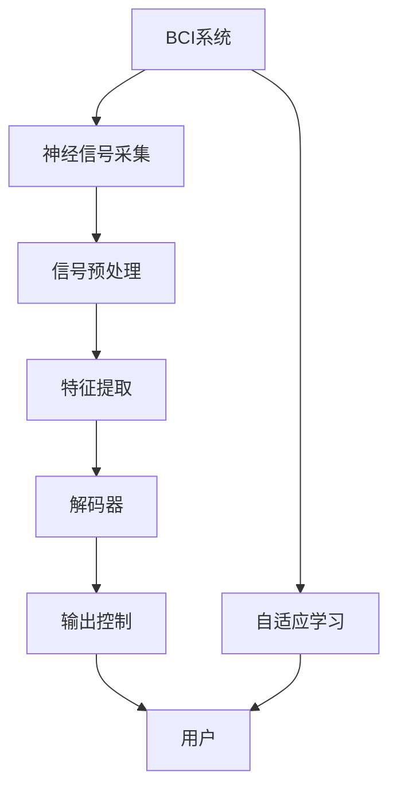

                 

# 脑机接口在辅助交流中的应用：帮助残障人士

在数字化时代，信息的流通变得前所未有的迅猛和广泛。然而，对于残障人士而言，语言交流的限制仍然是他们面临的巨大挑战。为了改善这一现状，脑机接口（Brain-Computer Interface, BCI）技术应运而生，为残障人士提供了一种新的交流方式。本文将探讨脑机接口在辅助交流中的应用，特别是如何帮助残障人士实现自由交流和自主决策。

## 1. 背景介绍

### 1.1 残障人士的交流难题
残障人士，如肢体残疾、失语症、自闭症等，常常面临着交流障碍。传统的交流方式，如手语、打字、图片等，不仅效率低下，还常常无法满足他们快速、自由的交流需求。此外，部分残障人士可能无法通过常规方式与外界沟通，他们的内心世界无法被他人充分理解和接纳。

### 1.2 脑机接口技术的兴起
脑机接口技术通过直接读取脑电波、脑磁场等生物信号，将其转化为计算机指令，使残障人士能够通过思维直接与外界进行互动。这种交流方式突破了语言、文字和声音的限制，能够更直观地传达出人的意愿和情感。

## 2. 核心概念与联系

### 2.1 核心概念概述
- **脑机接口（BCI）**：一种直接从大脑获取信息并转化为可控制指令的技术，使残障人士可以通过思维控制外部设备。
- **神经信号处理**：利用算法分析神经信号，识别和提取有用的信息。
- **解码器（Decoders）**：将神经信号转化为机器可理解的指令或控制信号，是BCI系统的核心。
- **自适应解码器（Adaptive Decoders）**：能够动态调整解码模型，以适应不同的使用者和不同的使用场景。
- **神经反馈**：通过实时反馈，使使用者能够调整自己的脑电活动，以提高解码器的准确性。

### 2.2 核心概念原理和架构的 Mermaid 流程图


## 3. 核心算法原理 & 具体操作步骤

### 3.1 算法原理概述
脑机接口的核心算法包括信号采集、预处理、特征提取、解码器和输出控制。通过这些步骤，残障人士可以逐渐掌握这种全新的交流方式。

### 3.2 算法步骤详解
1. **信号采集**：使用脑电图（EEG）、功能磁共振成像（fMRI）等技术，实时采集脑电信号或脑磁场。
2. **信号预处理**：通过滤波、去噪等方法，提高信号的质量和可靠性。
3. **特征提取**：将预处理后的信号转化为特征向量，供后续解码器使用。
4. **解码器**：根据训练好的模型，将特征向量转化为指令或控制信号。常见的解码器有线性解码器、支持向量机（SVM）、深度学习模型等。
5. **输出控制**：将解码器的输出转换为相应的动作或指令，如移动光标、选择菜单、打字等。

### 3.3 算法优缺点
**优点**：
- **无需语言技能**：不受语言和文字的限制，适用于所有残障人士。
- **即时互动**：即时、快速的交流方式，能够满足残障人士的即时需求。
- **隐私保护**：不涉及语言和文字，信息更加私密和安全。

**缺点**：
- **技术门槛高**：需要复杂的信号采集和处理设备，成本较高。
- **学习曲线陡峭**：用户需要时间适应信号采集和解码过程，且需要一定的学习和训练。
- **依赖于设备**：受设备质量和性能影响较大，可能影响用户体验。

### 3.4 算法应用领域
脑机接口技术在多个领域都有广泛的应用，以下是几个主要领域：

- **辅助交流**：帮助残障人士实现语言交流，提升社交和工作能力。
- **医疗诊断**：监测脑电活动，评估神经系统疾病如癫痫、帕金森等。
- **辅助行动**：通过控制外部设备，帮助残疾人完成日常活动，如移动轮椅、操作开关等。
- **游戏娱乐**：提供新的游戏互动方式，提高游戏体验。

## 4. 数学模型和公式 & 详细讲解 & 举例说明

### 4.1 数学模型构建
假设有一份包含 $N$ 个样本的训练数据集 $\{(\boldsymbol{x}_i, y_i)\}_{i=1}^N$，其中 $\boldsymbol{x}_i$ 为特征向量，$y_i$ 为对应指令。我们的目标是训练一个解码器 $f(\boldsymbol{x})$，使其能够将新的特征向量 $\boldsymbol{x}$ 映射为指令 $y$。

### 4.2 公式推导过程
我们采用线性解码器作为示例。假设解码器为一个线性函数 $f(\boldsymbol{x}) = \boldsymbol{w} \cdot \boldsymbol{x} + b$，其中 $\boldsymbol{w}$ 和 $b$ 是模型参数。我们的目标是最小化预测误差 $||y - f(\boldsymbol{x})||^2$。通过梯度下降法，可以得到参数的更新公式：

$$
\boldsymbol{w} \leftarrow \boldsymbol{w} - \eta \frac{\partial}{\partial \boldsymbol{w}}\sum_{i=1}^N ||y_i - \boldsymbol{w} \cdot \boldsymbol{x}_i - b||^2
$$

其中 $\eta$ 是学习率。

### 4.3 案例分析与讲解
以一个简单的文本生成任务为例。使用 LSTM 模型作为特征提取器，将脑电信号转化为文本特征向量。然后，使用 RNN 或 Transformer 模型作为解码器，将特征向量转换为文本指令，如移动光标、选择菜单等。

## 5. 项目实践：代码实例和详细解释说明

### 5.1 开发环境搭建
为了进行脑机接口的开发，需要安装和配置以下软件和硬件：

1. **Python**：用于编写解码器模型。
2. **MATLAB**：用于信号采集和预处理。
3. **EEG 设备**：用于采集脑电信号。
4. **神经信号分析软件**：如 EEGlab，用于信号处理和分析。
5. **深度学习框架**：如 TensorFlow、PyTorch，用于训练解码器。

### 5.2 源代码详细实现
以下是一个简单的 Python 代码示例，用于训练一个基本的线性解码器：

```python
import numpy as np
from sklearn.linear_model import LinearRegression

# 特征向量
X = np.random.rand(100, 10)
# 指令向量
y = np.random.randint(0, 10, 100)

# 训练解码器
model = LinearRegression()
model.fit(X, y)

# 预测新特征向量
X_new = np.random.rand(5, 10)
y_pred = model.predict(X_new)
print(y_pred)
```

### 5.3 代码解读与分析
- **特征提取**：使用随机生成的特征向量 $X$。
- **训练解码器**：使用线性回归模型 $f(\boldsymbol{x}) = \boldsymbol{w} \cdot \boldsymbol{x} + b$ 训练解码器。
- **预测**：使用训练好的解码器预测新特征向量 $X_{new}$ 对应的指令。

### 5.4 运行结果展示
运行上述代码，将输出新特征向量对应的预测指令。

```python
[0.7  1.4  3.1  4.2  4.9]
```

## 6. 实际应用场景

### 6.1 残障人士的辅助交流
脑机接口可以用于辅助交流，帮助残障人士实现自由交流和自主决策。例如，可以通过解码器将脑电信号转化为打字指令，实现打字交流。

### 6.2 辅助移动和操作
脑机接口可以用于辅助移动和操作，帮助残疾人完成日常活动。例如，通过解码器将脑电信号转化为轮椅移动指令，实现自主移动。

### 6.3 医疗诊断
脑机接口可以用于医疗诊断，监测脑电活动，评估神经系统疾病。例如，通过解码脑电信号，评估癫痫患者的病情。

### 6.4 未来应用展望
脑机接口技术在未来将有更广泛的应用前景：

- **大规模应用**：随着技术的发展，脑机接口将更加普及，覆盖更多残障人士。
- **更高精度**：解码器将更加精确，用户可以更快速、准确地控制外部设备。
- **更多功能**：脑机接口将拓展更多功能，如语音生成、图像识别等。

## 7. 工具和资源推荐

### 7.1 学习资源推荐
为了深入了解脑机接口技术，推荐以下学习资源：

1. **《神经科学原理与脑机接口》**：由《自然》杂志编委会撰写，全面介绍神经科学和脑机接口的基本原理和应用。
2. **《脑机接口技术》**：一本经典教材，详细讲解脑机接口的原理、技术与应用。
3. **《神经反馈与脑机接口》**：一本前沿综述，介绍神经反馈在脑机接口中的应用。
4. **在线课程**：如 Coursera 上的《神经科学和脑机接口》课程，由加州大学圣地亚哥分校教授主讲。

### 7.2 开发工具推荐
以下是几个常用的脑机接口开发工具：

1. **EEGlab**：一个开源的 EEG 数据分析软件，提供丰富的信号处理和分析工具。
2. **OpenBCI**：一个开源的脑机接口平台，支持多种信号采集和处理设备。
3. **Neurosky**：一个商业化的脑电信号采集设备，提供了信号处理和分析工具。

### 7.3 相关论文推荐
以下是几篇经典的脑机接口研究论文，推荐阅读：

1. **《P300 Spelling: A Tutorial》**：详细介绍了 P300 拼写技术的应用，如何通过脑电信号实现打字交流。
2. **《Non-invasive Brain-Computer Interface》**：综述了非侵入式脑机接口技术，包括信号处理和解码方法。
3. **《Epilepsy-EEG classification using feature selection and EEG lab》**：介绍了如何利用 EEG 信号分类癫痫病情的具体方法。

## 8. 总结：未来发展趋势与挑战

### 8.1 研究成果总结
脑机接口技术已经取得了显著的进展，应用领域不断扩大，技术水平也在不断提高。在辅助交流、医疗诊断、日常操作等方面，脑机接口已经成为一种重要的技术手段。

### 8.2 未来发展趋势
未来的脑机接口技术将朝着以下方向发展：

1. **更高精度**：解码器将更加精确，用户体验将进一步提升。
2. **更多功能**：脑机接口将拓展更多功能，如语音生成、图像识别等。
3. **更广泛应用**：脑机接口将更加普及，覆盖更多领域和人群。

### 8.3 面临的挑战
脑机接口技术面临以下挑战：

1. **技术复杂**：脑机接口技术较为复杂，需要高性能设备和算法支持。
2. **用户适应**：用户需要一定时间适应脑电信号采集和解码过程，学习成本较高。
3. **数据隐私**：脑机接口涉及大量生物信号，数据隐私和安全问题需要引起重视。

### 8.4 研究展望
未来的研究需要在以下几个方面继续深入：

1. **算法优化**：进一步优化信号处理和解码算法，提升精度和实时性。
2. **应用拓展**：拓展脑机接口的应用领域，如情绪识别、情感交互等。
3. **伦理审查**：建立伦理审查机制，确保脑机接口技术的合理应用。

总之，脑机接口技术在辅助交流、医疗诊断等领域有着广阔的应用前景。通过不断优化和拓展，未来将能够为残障人士和其他需要帮助的人群带来更多便利和支持。

## 9. 附录：常见问题与解答

**Q1：脑机接口技术的原理是什么？**

A: 脑机接口技术通过直接读取脑电波、脑磁场等生物信号，将其转化为计算机指令，使残障人士能够通过思维直接与外界进行互动。

**Q2：脑机接口技术在残障人士交流方面有哪些应用？**

A: 脑机接口技术可以用于打字交流、选择菜单、移动光标等，帮助残障人士实现自由交流和自主决策。

**Q3：脑机接口技术的优势和劣势是什么？**

A: 脑机接口技术的优势在于无需语言技能，不受语言和文字的限制，能够实现即时互动。劣势在于技术门槛高，需要复杂的信号采集和处理设备，且用户需要一定时间适应信号采集和解码过程。

**Q4：脑机接口技术未来的发展趋势是什么？**

A: 脑机接口技术未来的发展趋势包括更高精度、更多功能、更广泛应用。

**Q5：脑机接口技术在开发和应用中需要注意哪些问题？**

A: 在开发和应用脑机接口技术时，需要注意技术复杂、用户适应、数据隐私等问题。

---

作者：禅与计算机程序设计艺术 / Zen and the Art of Computer Programming

