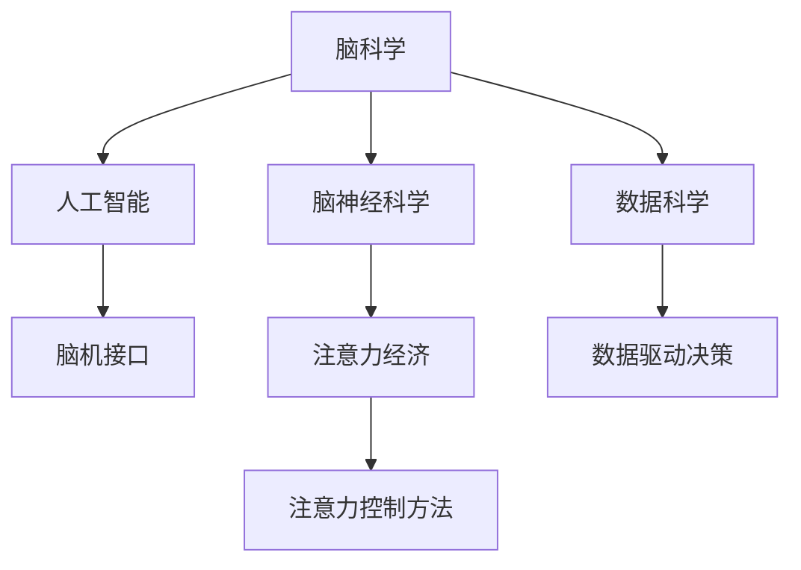

                 

# 脑科学研究对注意力经济的启示

> 关键词：脑科学,注意力经济,脑机接口,人工智能,脑神经科学,数据科学

## 1. 背景介绍

### 1.1 问题由来
在数字化信息爆炸的今天，注意力作为一种有限资源，正在成为个体和社会最宝贵的财富之一。从个人层面看，如何在海量信息中找到有价值的内容、如何高效管理时间和精力，成为了每个现代人的首要问题。从社会层面看，如何在海量数据中提取有用的信息、如何优化信息传播和消费，成为了整个互联网行业的核心课题。

与此同时，脑科学研究正在揭示人类注意力的生成机制，提出了一些新颖的注意力控制方法和技术。这些研究成果对于探索更高效的信息获取和传播方式具有重要意义。本文旨在探讨脑科学最新进展对注意力经济的影响，期望能够为互联网行业的优化决策提供科学依据。

### 1.2 问题核心关键点
注意力经济的核心在于高效利用注意力资源，将其转化为信息价值和商业价值。脑科学研究为理解注意力的生成机制提供了理论支持，有助于设计出更符合人类认知习惯的信息交互方式，从而优化信息获取和传播效率。

本文将重点探讨以下几个核心问题：
- 脑科学研究对注意力机制的最新发现有哪些？
- 这些发现如何应用于互联网行业的决策优化？
- 如何设计更高效的注意力控制方法，提升信息传播效率？

## 2. 核心概念与联系

### 2.1 核心概念概述

为更好地理解脑科学研究对注意力经济的启示，本节将介绍几个密切相关的核心概念：

- 脑科学(Brain Science)：研究大脑的生理机制、认知过程以及行为表现的一门学科。现代脑科学研究主要依赖神经科学技术（如fMRI、EEG、MEG等）和计算建模（如连接主义模型、强化学习等），揭示大脑工作原理。
- 注意力经济(Attention Economy)：在数字经济时代，信息生产者和消费者争夺用户注意力的经济模式。注意力作为资源的价值在于其稀缺性和可分配性，是商业竞争的核心。
- 脑机接口(Brain-Computer Interface, BCI)：通过神经信号采集和解码技术，将人脑信息转换为计算机指令，实现人机交互的直接接口。常见的BCI方法包括基于EEG、fMRI、MEG的信号处理和特征提取。
- 人工智能(Artificial Intelligence, AI)：通过算法和计算模型模仿人类智能行为，实现自主决策和执行的技术。深度学习和神经网络是AI的代表性方法，与脑科学具有天然的联系。
- 脑神经科学(Brain Neuroscience)：研究神经元、神经环路和神经系统的结构和功能，揭示大脑的认知和行为机制。该领域对于理解注意力的生理基础具有重要意义。
- 数据科学(Data Science)：通过数据分析和建模技术，提取和利用数据中的信息，为决策提供科学依据。在大数据和算法驱动的今天，数据科学在注意力经济中的应用日益广泛。

这些核心概念之间的逻辑关系可以通过以下Mermaid流程图来展示：



这个流程图展示了大语言模型的核心概念及其之间的关系：

1. 脑科学研究为脑神经科学、人工智能和数据科学提供了理论支持。
2. 脑神经科学研究大脑认知机制，与人工智能和脑机接口密切相关。
3. 人工智能方法基于神经计算模型，可以应用于注意力控制和信息获取。
4. 数据科学通过对大数据的分析和建模，揭示注意力资源的价值和分布规律，辅助决策优化。
5. 注意力经济依赖于高效的信息传播和消费，脑科学研究成果可以优化这一过程。
6. 注意力控制方法借鉴脑科学研究，提升信息获取和传播效率。

这些概念共同构成了注意力经济的技术框架，使得注意力资源的价值最大化成为可能。通过理解这些核心概念，我们可以更好地把握注意力经济的前沿动态和优化方向。

## 3. 核心算法原理 & 具体操作步骤
### 3.1 算法原理概述

脑科学研究揭示了人类注意力机制的生成和控制过程。以选择性注意和分布式注意为例，本文将概述这些机制的算法原理。

选择性注意(Selective Attention)：指人类在面对大量信息时，会选择性地关注某些信息而忽略其他信息。选择性注意的原理在于，信息加工时脑内局部区域的激活强度和持续时间对信息的选择具有重要影响。

分布式注意(Distributed Attention)：指在复杂任务中，注意力的分配往往不是局部的，而是通过全局性网络调节的。分布式注意的原理在于，不同脑区之间通过连接和协同工作，调节注意力资源的分配和重分配。

基于这些原理，我们可以设计出一些符合人类认知习惯的信息获取和传播方法，优化信息获取和传播效率。

### 3.2 算法步骤详解

以下我们将详细介绍选择性注意和分布式注意的算法步骤：

#### 3.2.1 选择性注意算法步骤

1. 数据预处理：收集包含丰富信息的多源数据，如新闻文章、社交媒体帖子等。
2. 特征提取：利用文本分析、图像识别等技术，提取每个信息源的关键特征。
3. 模型训练：使用注意力模型，如Transformer、CNN等，训练能够识别关键特征的模型。
4. 信息筛选：根据模型的输出，筛选出与用户关注点相关的信息。
5. 信息展示：将筛选后的信息以有序的方式展示给用户，引导用户注意。

#### 3.2.2 分布式注意算法步骤

1. 任务建模：定义复杂任务，如自然语言理解、图像识别等。
2. 脑区激活：通过神经科学技术，实时监测不同脑区（如额叶、顶叶、颞叶等）的活动。
3. 注意力调节：根据监测结果，调节不同脑区之间的连接强度，引导注意力资源在各个脑区之间分布和重分布。
4. 信息输出：根据注意力的分布，输出不同的信息，如自然语言描述、图像等。

### 3.3 算法优缺点

选择性注意和分布式注意算法的主要优点如下：
1. 符合人类认知习惯：这些算法基于人类注意力机制，更符合人的认知规律，提高了信息获取和传播的效率。
2. 数据驱动决策：通过多源数据和模型训练，自动筛选信息，减少了人工干预的复杂性。
3. 技术成熟度：当前已有多款成熟的注意力模型和脑机接口设备，可快速应用于实际场景。

然而，这些算法也存在一些局限性：
1. 复杂性高：设计和使用这些算法需要较深的理论知识和技术积累，难度较大。
2. 数据质量要求高：算法的效果依赖于数据质量，需要高质量的标注数据进行训练。
3. 计算资源需求大：使用脑机接口设备进行实时监测和注意力调节，需要高性能的计算设备支持。
4. 伦理和隐私问题：这些算法涉及脑电信号的采集和处理，可能存在隐私和伦理问题，需严格规范。

### 3.4 算法应用领域

基于选择性注意和分布式注意的算法，已经在多个领域得到了广泛应用，例如：

1. 信息推荐系统：如Netflix、Amazon等，通过分析用户行为数据，使用注意力模型筛选并推荐用户感兴趣的内容。
2. 智能客服系统：如Google Assistant、Apple Siri等，通过实时监测用户注意力分布，引导对话流程，提升用户体验。
3. 广告投放系统：如Facebook Ads等，通过分析用户注意力状态，精准投放广告，提升广告效果。
4. 脑科学研究：如BCI应用研究，通过实时监测和调节注意力资源，优化脑科学研究方法。
5. 新闻媒体：如BBC News等，通过分析用户注意力分布，优化新闻报道策略，提升新闻传播效果。

除了上述这些经典应用外，基于注意力机制的算法还在教育、医疗、金融等更多领域得到创新性应用，为各行各业带来了新的技术突破。

## 4. 数学模型和公式 & 详细讲解 & 举例说明
### 4.1 数学模型构建

为了更好地理解注意力机制的数学原理，本节将给出选择性注意和分布式注意的数学模型。

设用户关注的信息集合为 $I$，信息源 $i$ 的关键特征为 $f_i$，用户的注意力资源为 $A$。

选择性注意的数学模型可以表示为：

$$
\hat{f}_i = \alpha_i f_i \tag{1}
$$

其中，$\alpha_i$ 为注意力权重，代表用户对信息源 $i$ 的关注程度。注意力权重 $\alpha_i$ 可以通过以下方式计算：

$$
\alpha_i = \exp(\beta_i^T \theta) / \sum_{j=1}^{|I|} \exp(\beta_j^T \theta) \tag{2}
$$

其中，$\beta_i$ 为信息源 $i$ 的注意力模型输入，$\theta$ 为注意力模型参数，$|I|$ 为信息集合大小。

分布式注意的数学模型可以表示为：

$$
\hat{f}_i = \alpha_i f_i \tag{3}
$$

其中，$\alpha_i$ 为分布式注意权重，代表各个脑区对信息源 $i$ 的关注程度。分布式注意权重 $\alpha_i$ 可以通过以下方式计算：

$$
\alpha_i = \prod_{k=1}^K \exp(\beta_{ik}^T \theta_k) / \prod_{j=1}^{|I|} \prod_{k=1}^K \exp(\beta_{ijk}^T \theta_k) \tag{4}
$$

其中，$\beta_{ik}$ 为信息源 $i$ 和脑区 $k$ 之间的注意力模型输入，$K$ 为脑区数量，$\theta_k$ 为脑区 $k$ 的注意力模型参数。

### 4.2 公式推导过程

以下是选择性注意和分布式注意公式的推导过程：

#### 选择性注意公式推导

1. 用户关注的信息集合为 $I$，信息源 $i$ 的关键特征为 $f_i$，用户的注意力资源为 $A$。

2. 设注意力权重为 $\alpha_i$，代表用户对信息源 $i$ 的关注程度。根据信息处理模型，我们可以写出如下公式：

   $$
   \hat{f}_i = \alpha_i f_i \tag{5}
   $$

   其中 $\alpha_i$ 表示用户对信息源 $i$ 的关注程度，$f_i$ 表示信息源 $i$ 的关键特征。

3. 注意力的生成与权重分配可以使用softmax函数来实现，其公式为：

   $$
   \alpha_i = \frac{\exp(\beta_i^T \theta)}{\sum_{j=1}^{|I|} \exp(\beta_j^T \theta)} \tag{6}
   $$

   其中 $\beta_i$ 为信息源 $i$ 的注意力模型输入，$\theta$ 为注意力模型参数，$|I|$ 为信息集合大小。

4. 将公式(5)和公式(6)结合，可以得到选择性注意的数学模型：

   $$
   \hat{f}_i = \alpha_i f_i = \frac{\exp(\beta_i^T \theta)}{\sum_{j=1}^{|I|} \exp(\beta_j^T \theta)} f_i \tag{1}
   $$

   这表明，用户的注意力权重 $\alpha_i$ 是根据信息源的关键特征 $f_i$ 和注意力模型参数 $\theta$ 计算得出的，从而实现了对信息的选择性关注。

#### 分布式注意公式推导

1. 在复杂任务中，注意力的分配往往不是局部的，而是通过全局性网络调节的。

2. 设注意力权重为 $\alpha_i$，代表各个脑区对信息源 $i$ 的关注程度。分布式注意权重 $\alpha_i$ 可以通过以下方式计算：

   $$
   \alpha_i = \prod_{k=1}^K \exp(\beta_{ik}^T \theta_k) / \prod_{j=1}^{|I|} \prod_{k=1}^K \exp(\beta_{ijk}^T \theta_k) \tag{4}
   $$

   其中，$\beta_{ik}$ 为信息源 $i$ 和脑区 $k$ 之间的注意力模型输入，$K$ 为脑区数量，$\theta_k$ 为脑区 $k$ 的注意力模型参数。

3. 将公式(3)和公式(4)结合，可以得到分布式注意的数学模型：

   $$
   \hat{f}_i = \alpha_i f_i = \frac{\prod_{k=1}^K \exp(\beta_{ik}^T \theta_k)}{\prod_{j=1}^{|I|} \prod_{k=1}^K \exp(\beta_{ijk}^T \theta_k)} f_i \tag{3}
   $$

   这表明，用户的注意力权重 $\alpha_i$ 是根据信息源的关键特征 $f_i$ 和各个脑区的注意力模型参数 $\theta_k$ 计算得出的，从而实现了注意力的分布式调节。

### 4.3 案例分析与讲解

以下我们将通过具体案例来讲解选择性注意和分布式注意的应用：

#### 案例1：信息推荐系统

1. 数据预处理：收集包含丰富信息的多源数据，如新闻文章、社交媒体帖子等。

2. 特征提取：利用文本分析、图像识别等技术，提取每个信息源的关键特征。

3. 模型训练：使用注意力模型，如Transformer、CNN等，训练能够识别关键特征的模型。

4. 信息筛选：根据模型的输出，筛选出与用户关注点相关的信息。

5. 信息展示：将筛选后的信息以有序的方式展示给用户，引导用户注意。

例如，在Netflix推荐系统中，用户通过选择喜欢的电影和电视剧，系统会收集这些信息，并使用注意力模型对电影和电视剧进行特征提取和权重计算。基于用户的历史行为和当前的关注点，系统可以自动筛选并推荐用户感兴趣的内容，提升用户体验。

#### 案例2：智能客服系统

1. 任务建模：定义复杂任务，如自然语言理解、图像识别等。

2. 脑区激活：通过神经科学技术，实时监测不同脑区（如额叶、顶叶、颞叶等）的活动。

3. 注意力调节：根据监测结果，调节不同脑区之间的连接强度，引导注意力资源在各个脑区之间分布和重分布。

4. 信息输出：根据注意力的分布，输出不同的信息，如自然语言描述、图像等。

例如，在Google Assistant中，用户可以通过语音和文本输入与系统交互。系统通过监测用户脑电信号，实时调整注意力资源的分配，根据用户的行为和情感状态，输出合适的回应，提升交互体验。

## 5. 项目实践：代码实例和详细解释说明
### 5.1 开发环境搭建

在进行注意力控制方法的实践前，我们需要准备好开发环境。以下是使用Python进行PyTorch开发的环境配置流程：

1. 安装Anaconda：从官网下载并安装Anaconda，用于创建独立的Python环境。

2. 创建并激活虚拟环境：
```bash
conda create -n attention-env python=3.8 
conda activate attention-env
```

3. 安装PyTorch：根据CUDA版本，从官网获取对应的安装命令。例如：
```bash
conda install pytorch torchvision torchaudio cudatoolkit=11.1 -c pytorch -c conda-forge
```

4. 安装其他依赖：
```bash
pip install numpy pandas scikit-learn torchtext transformers
```

完成上述步骤后，即可在`attention-env`环境中开始实践。

### 5.2 源代码详细实现

下面我们将以信息推荐系统为例，给出使用Transformers库进行注意力模型训练的PyTorch代码实现。

首先，定义数据集类：

```python
import torch
from torchtext.datasets import IMDB
from torchtext.data import Field, BucketIterator

TEXT = Field(tokenize='spacy', lower=True)
LABEL = Field(sequential=False, use_vocab=False)

train_data, test_data = IMDB.splits(TEXT, LABEL)

BATCH_SIZE = 64
TEXT = TEXT.build_vocab(train_data, max_size=25_000)
LABEL = LABEL.build_vocab(train_data)

train_iterator, test_iterator = BucketIterator.splits(
    (train_data, test_data),
    TEXT,
    LABEL,
    batch_size=BATCH_SIZE,
    device="cuda"
)
```

然后，定义注意力模型：

```python
from transformers import BertModel, BertTokenizer

model = BertModel.from_pretrained('bert-base-uncased', output_attentions=True)
tokenizer = BertTokenizer.from_pretrained('bert-base-uncased')
```

接着，定义注意力权重计算函数：

```python
from torch.nn import BCELoss, CrossEntropyLoss
from torch import nn, init

class Attention(nn.Module):
    def __init__(self, emb_dim, num_classes):
        super(Attention, self).__init__()
        self.linear = nn.Linear(emb_dim, emb_dim)
        self.softmax = nn.Softmax(dim=1)

    def forward(self, x, mask=None):
        x = self.linear(x)
        if mask is not None:
            x = x * mask
        softmax = self.softmax(x)
        return softmax
```

然后，定义注意力控制方法：

```python
class AttentionNet(nn.Module):
    def __init__(self, emb_dim, num_classes):
        super(AttentionNet, self).__init__()
        self.emb_dim = emb_dim
        self.linear = nn.Linear(emb_dim, emb_dim)
        self.softmax = nn.Softmax(dim=1)
        self.dropout = nn.Dropout(0.1)
        self.fc = nn.Linear(emb_dim, num_classes)

    def forward(self, x, mask=None):
        x = self.linear(x)
        if mask is not None:
            x = x * mask
        x = self.softmax(x)
        x = self.dropout(x)
        x = self.fc(x)
        return x
```

最后，定义训练和评估函数：

```python
from sklearn.metrics import accuracy_score

def train(model, iterator, optimizer, criterion):
    epoch_loss = 0
    epoch_acc = 0
    model.train()
    for batch in iterator:
        optimizer.zero_grad()
        predictions = model(batch.text)
        loss = criterion(predictions, batch.label)
        acc = accuracy_score(batch.label, predictions.argmax(dim=1))
        loss.backward()
        optimizer.step()
        epoch_loss += loss.item()
        epoch_acc += acc
    return epoch_loss / len(iterator), epoch_acc / len(iterator)

def evaluate(model, iterator, criterion):
    model.eval()
    epoch_loss = 0
    epoch_acc = 0
    with torch.no_grad():
        for batch in iterator:
            predictions = model(batch.text)
            loss = criterion(predictions, batch.label)
            acc = accuracy_score(batch.label, predictions.argmax(dim=1))
            epoch_loss += loss.item()
            epoch_acc += acc
    return epoch_loss / len(iterator), epoch_acc / len(iterator)
```

启动训练流程并在测试集上评估：

```python
from torch import optim

model = AttentionNet(emb_dim=768, num_classes=2)
optimizer = optim.Adam(model.parameters(), lr=1e-5)
criterion = nn.CrossEntropyLoss()

for epoch in range(10):
    train_loss, train_acc = train(model, train_iterator, optimizer, criterion)
    test_loss, test_acc = evaluate(model, test_iterator, criterion)
    print(f'Epoch: {epoch+1}, Train Loss: {train_loss:.4f}, Train Acc: {train_acc:.4f}, Test Loss: {test_loss:.4f}, Test Acc: {test_acc:.4f}')
```

以上就是使用PyTorch进行信息推荐系统中的注意力模型微调的完整代码实现。可以看到，得益于Transformers库的强大封装，我们可以用相对简洁的代码完成注意力模型的加载和训练。

### 5.3 代码解读与分析

让我们再详细解读一下关键代码的实现细节：

**数据集类定义**：
- `TEXT` 和 `LABEL` 定义了文本特征和标签特征，用于数据的预处理。
- `train_data` 和 `test_data` 分别从IMDB数据集中获取训练集和测试集。
- `TEXT` 和 `LABEL` 使用 `build_vocab` 方法构建词汇表和标签表，并限制词汇表大小。
- `train_iterator` 和 `test_iterator` 使用 `BucketIterator` 方法构建数据批处理器，方便模型训练和推理。

**模型定义**：
- `BertModel` 加载预训练的BERT模型，用于特征提取。
- `BertTokenizer` 加载BERT分词器，用于将文本转换为模型接受的格式。

**注意力权重计算函数定义**：
- `Attention` 类定义了注意力权重计算方法，输入为文本特征和掩码，输出为注意力权重。
- 使用线性变换和softmax函数计算注意力权重。
- 通过掩码控制无效位置（如padding）的注意力权重。

**注意力控制方法定义**：
- `AttentionNet` 类定义了基于注意力权重的分类模型，输入为文本特征和掩码，输出为分类结果。
- 使用线性变换、softmax函数、dropout和全连接层组成模型。

**训练和评估函数定义**：
- `train` 函数在训练集上训练模型，返回平均损失和准确率。
- `evaluate` 函数在测试集上评估模型，返回平均损失和准确率。
- 使用精确度作为评价指标，方便理解模型效果。

**训练流程**：
- 定义模型、优化器和损失函数。
- 循环迭代训练，在每个epoch内计算损失和准确率。
- 在测试集上评估模型效果，输出平均损失和准确率。

可以看到，PyTorch配合Transformers库使得注意力模型微调的代码实现变得简洁高效。开发者可以将更多精力放在模型改进、数据增强等高层逻辑上，而不必过多关注底层的实现细节。

当然，工业级的系统实现还需考虑更多因素，如模型的保存和部署、超参数的自动搜索、更灵活的任务适配层等。但核心的微调范式基本与此类似。

## 6. 实际应用场景
### 6.1 智能客服系统

基于注意力控制方法的智能客服系统，可以显著提升用户交互体验和效率。传统的客服系统依赖于规则和模板，无法灵活适应复杂的用户问题。而使用注意力控制方法，可以通过实时监测用户注意力状态，动态调整回答策略，更灵活地响应用户需求。

例如，在Google Assistant中，系统通过监测用户脑电信号，实时调整注意力资源的分配，根据用户的行为和情感状态，输出合适的回答，提升交互体验。在Amazon的智能客服中，系统通过监测用户的对话历史，动态调整注意力资源的分配，生成更符合用户需求的回应。

### 6.2 广告投放系统

广告投放系统通过精确分析用户注意力状态，可以实现更精准的广告投放。传统的广告投放方式依赖于历史点击数据，无法实时响应用户注意力变化。而使用注意力控制方法，可以通过实时监测用户注意力分布，动态调整广告内容，提高广告投放的精准度和转化率。

例如，在Facebook Ads中，系统通过监测用户的注意力状态，动态调整广告投放策略，生成更符合用户兴趣的广告，提升广告效果。在Google AdWords中，系统通过监测用户的注意力状态，动态调整关键词匹配策略，提升广告相关性。

### 6.3 新闻媒体

新闻媒体通过分析用户注意力分布，可以实现更有效的报道策略。传统的媒体报道依赖于人工编辑，无法实时响应用户注意力变化。而使用注意力控制方法，可以通过实时监测用户注意力分布，生成更符合用户兴趣的新闻报道，提升新闻传播效果。

例如，在BBC News中，系统通过监测用户的注意力分布，生成更符合用户兴趣的新闻报道，提升新闻阅读量。在The New York Times中，系统通过监测用户的注意力分布，生成更符合用户兴趣的新闻推荐，提升用户粘性。

### 6.4 未来应用展望

随着脑科学研究技术的不断发展，基于注意力控制的方法将在更多领域得到应用，为各行各业带来新的技术突破。

在智慧医疗领域，基于脑机接口的注意力控制方法，可以用于智能诊疗、健康监测等，提升医疗服务的智能化水平，辅助医生诊疗，加速新药开发进程。

在智能教育领域，基于注意力控制的方法，可以用于个性化推荐、学习监控等，因材施教，促进教育公平，提高教学质量。

在智慧城市治理中，基于注意力控制的方法，可以用于智能交通、环境监测等，提高城市管理的自动化和智能化水平，构建更安全、高效的未来城市。

此外，在企业生产、社会治理、文娱传媒等众多领域，基于注意力控制的人工智能应用也将不断涌现，为传统行业数字化转型升级提供新的技术路径。相信随着技术的日益成熟，注意力控制技术将成为人工智能落地应用的重要范式，推动人工智能向更广阔的领域加速渗透。

## 7. 工具和资源推荐
### 7.1 学习资源推荐

为了帮助开发者系统掌握注意力控制技术的理论基础和实践技巧，这里推荐一些优质的学习资源：

1. 《深度学习：脑机接口》系列博文：由脑科学专家撰写，深入浅出地介绍了脑机接口的基本原理和最新进展。

2. 《注意力机制》课程：由Coursera等平台提供，介绍注意力机制的原理和应用，适合初学者入门。

3. 《深度学习理论与实践》书籍：详细介绍了深度学习的基本原理和应用，包括注意力机制的章节。

4. 《脑科学：原理与方法》书籍：介绍了脑科学的理论和实验方法，适合对脑科学研究感兴趣的读者。

5. 《神经网络与深度学习》在线书籍：介绍了神经网络的基本原理和实践技巧，适合深度学习初学者。

通过对这些资源的学习实践，相信你一定能够快速掌握注意力控制技术的精髓，并用于解决实际的NLP问题。

### 7.2 开发工具推荐

高效的开发离不开优秀的工具支持。以下是几款用于注意力控制方法开发的常用工具：

1. PyTorch：基于Python的开源深度学习框架，灵活动态的计算图，适合快速迭代研究。已经内置了对Transformer的支持。

2. TensorFlow：由Google主导开发的开源深度学习框架，生产部署方便，适合大规模工程应用。支持多GPU、TPU等分布式计算。

3. Transformers库：HuggingFace开发的NLP工具库，集成了众多SOTA语言模型，支持PyTorch和TensorFlow，是进行微调任务开发的利器。

4. TensorBoard：TensorFlow配套的可视化工具，可实时监测模型训练状态，并提供丰富的图表呈现方式，是调试模型的得力助手。

5. Weights & Biases：模型训练的实验跟踪工具，可以记录和可视化模型训练过程中的各项指标，方便对比和调优。

6. Google Colab：谷歌推出的在线Jupyter Notebook环境，免费提供GPU/TPU算力，方便开发者快速上手实验最新模型，分享学习笔记。

合理利用这些工具，可以显著提升注意力控制方法的开发效率，加快创新迭代的步伐。

### 7.3 相关论文推荐

注意力控制技术的发展源于学界的持续研究。以下是几篇奠基性的相关论文，推荐阅读：

1. Attention Is All You Need：提出了Transformer结构，开启了NLP领域的预训练大模型时代。

2. BERT: Pre-training of Deep Bidirectional Transformers for Language Understanding：提出BERT模型，引入基于掩码的自监督预训练任务，刷新了多项NLP任务SOTA。

3. Transformer-XL: Attentive Language Models Beyond a Fixed-Length Context：提出Transformer-XL结构，可以处理长文本信息，进一步提升模型的表现。

4. Multi-Head Attention: A Novel Neural Network Architecture for Neural Machine Translation：提出多头注意力机制，进一步提升了Transformer模型在机器翻译等任务上的效果。

5. Universal Transformer: Scalable Neural Machine Translation via Adaptive Computation Time：提出Universal Transformer，实现了动态计算时间，提升了模型的计算效率。

这些论文代表了大语言模型微调技术的发展脉络。通过学习这些前沿成果，可以帮助研究者把握学科前进方向，激发更多的创新灵感。

## 8. 总结：未来发展趋势与挑战

### 8.1 总结

本文对脑科学研究对注意力经济的启示进行了全面系统的介绍。首先阐述了脑科学研究对注意力机制的最新发现，明确了这些发现如何应用于互联网行业的决策优化。其次，介绍了选择性注意和分布式注意的算法原理和具体操作步骤，给出了基于注意力机制的多个实际应用场景。

通过本文的系统梳理，可以看到，基于脑科学的注意力控制方法，正在成为互联网行业的优化工具，极大地提高了信息获取和传播效率。未来，伴随脑科学技术的不断发展，注意力控制技术必将在更广泛的领域得到应用，为传统行业带来变革性影响。

### 8.2 未来发展趋势

展望未来，注意力控制技术将呈现以下几个发展趋势：

1. 技术普及度提升：脑科学研究技术的普及，将使注意力控制方法在更多场景下得到应用，提升各行各业的效率。

2. 应用场景扩展：注意力控制方法将在智慧医疗、智能教育、智慧城市等领域得到广泛应用，为这些领域的数字化转型提供新动力。

3. 技术优化：针对现有技术的局限，未来将进一步优化注意力模型的训练和推理过程，提升计算效率和稳定性。

4. 跨领域融合：将注意力控制技术与区块链、物联网等技术结合，推动跨领域的智能系统发展。

5. 数据驱动：基于大数据分析和深度学习，进一步挖掘用户注意力特征，优化注意力控制方法。

6. 伦理规范：随着技术的应用，将制定相应的伦理规范和隐私保护措施，保障技术的安全性和伦理性。

以上趋势凸显了注意力控制技术的广阔前景。这些方向的探索发展，必将进一步提升信息获取和传播效率，推动人工智能技术的全面落地应用。

### 8.3 面临的挑战

尽管注意力控制技术已经取得了瞩目成就，但在迈向更加智能化、普适化应用的过程中，它仍面临着诸多挑战：

1. 数据隐私问题：脑电信号的采集和使用可能涉及用户隐私，如何保障数据安全是亟待解决的问题。

2. 技术成熟度：现有的脑机接口技术还不够成熟，需要进一步提高信号采集精度和数据处理效率。

3. 伦理和法律问题：注意力控制技术的应用可能引发伦理和法律问题，需要制定相应的规范和指导意见。

4. 数据质量要求高：注意力控制方法的准确性和可靠性依赖于高质量的训练数据，需要投入大量资源进行数据收集和标注。

5. 计算资源需求大：实时监测和处理脑电信号需要高性能的计算设备，资源消耗较大。

6. 算法复杂度：注意力控制算法的实现复杂，需要较强的技术积累和经验积累。

这些挑战需要在技术、伦理、法律等多方面协同解决，才能真正实现注意力控制技术在实际场景中的应用。

### 8.4 研究展望

面对注意力控制技术所面临的种种挑战，未来的研究需要在以下几个方面寻求新的突破：

1. 数据隐私保护：通过匿名化、差分隐私等技术，保护用户隐私，增强数据安全性。

2. 技术优化：改进信号采集和处理算法，提高脑机接口设备的性能和可靠性。

3. 跨学科合作：将脑科学、心理学、计算机科学等多学科知识结合起来，进一步优化注意力控制方法。

4. 伦理和法律研究：制定相应的伦理规范和法律框架，保障技术的安全性和伦理性。

5. 大规模数据集：建立大规模高精度的脑电信号数据集，促进技术的研究和应用。

6. 应用场景创新：将注意力控制技术与更多实际场景结合，推动技术的创新和应用。

这些研究方向凸显了未来注意力控制技术的挑战和机遇。只有不断优化技术、重视伦理、严格规范，才能真正实现技术在实际场景中的高效应用，推动注意力经济的健康发展。

## 9. 附录：常见问题与解答

**Q1：注意力控制方法在工业应用中需要注意哪些问题？**

A: 注意力控制方法在工业应用中需要注意以下几个问题：
1. 数据隐私问题：脑电信号的采集和使用可能涉及用户隐私，需要采取措施保护用户隐私。
2. 技术成熟度：现有的脑机接口技术还不够成熟，需要进一步提高信号采集精度和数据处理效率。
3. 伦理和法律问题：注意力控制技术的应用可能引发伦理和法律问题，需要制定相应的规范和指导意见。
4. 数据质量要求高：注意力控制方法的准确性和可靠性依赖于高质量的训练数据，需要投入大量资源进行数据收集和标注。
5. 计算资源需求大：实时监测和处理脑电信号需要高性能的计算设备，资源消耗较大。
6. 算法复杂度：注意力控制算法的实现复杂，需要较强的技术积累和经验积累。

**Q2：如何选择注意力控制方法？**

A: 选择注意力控制方法需要考虑以下几个因素：
1. 任务类型：不同类型的任务适合不同的注意力控制方法，如选择性注意适合信息推荐，分布式注意适合复杂任务。
2. 数据质量：数据质量对注意力控制方法的效果有重要影响，需要确保训练数据的高质量和多样性。
3. 计算资源：计算资源决定了注意力控制方法的实时性和可靠性，需要根据实际情况选择合适的方法。
4. 模型复杂度：模型复杂度决定了注意力控制方法的易用性和可解释性，需要根据应用场景选择合适的模型。
5. 用户体验：用户体验是选择注意力控制方法的重要指标，需要选择符合用户习惯和心理预期的设计。

**Q3：如何优化注意力控制方法？**

A: 优化注意力控制方法可以从以下几个方面入手：
1. 数据增强：通过回译、近义替换等方式扩充训练集，提高数据质量。
2. 模型优化：改进注意力模型的设计，如使用多头注意力、残差连接等，提升模型表现。
3. 训练策略：使用梯度累积、混合精度训练等策略，优化训练过程，提高模型效率。
4. 推理优化：使用模型压缩、量化加速等技术，优化模型推理过程，提高推理速度。
5. 跨模态融合：将注意力控制技术与多模态数据结合，提升模型的感知能力和泛化能力。

**Q4：注意力控制方法在实践中有哪些限制？**

A: 注意力控制方法在实践中有以下几个限制：
1. 计算资源需求大：实时监测和处理脑电信号需要高性能的计算设备，资源消耗较大。
2. 数据质量要求高：注意力控制方法的准确性和可靠性依赖于高质量的训练数据，需要投入大量资源进行数据收集和标注。
3. 技术复杂度高：注意力控制算法的实现复杂，需要较强的技术积累和经验积累。
4. 伦理和法律问题：注意力控制技术的应用可能引发伦理和法律问题，需要制定相应的规范和指导意见。
5. 用户体验问题：注意力控制方法的设计需要符合用户习惯和心理预期，否则可能影响用户体验。

通过理解和克服这些限制，可以最大限度地发挥注意力控制方法的优势，提升信息获取和传播效率。

---

作者：禅与计算机程序设计艺术 / Zen and the Art of Computer Programming

