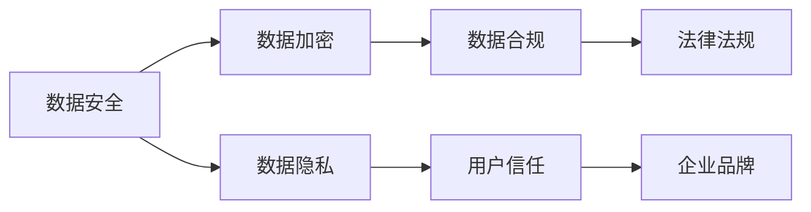

                 

## 1. 背景介绍

在数字化转型的大背景下，自动化创业成为了许多初创公司的重要方向。自动化不仅可以提高生产效率、降低成本，还能够推动创新，为企业带来新的增长点。然而，自动化创业也面临着数据安全与隐私保护的巨大挑战。随着大数据、人工智能等技术的普及，数据安全事件频发，对企业品牌信誉、用户信任乃至法律责任带来了严重影响。因此，如何在自动化创业中妥善处理数据安全与隐私保护问题，成为每一个自动化创业者必须面对的重要课题。

本文将从自动化创业的背景出发，深入探讨自动化创业中数据安全与隐私保护的关键概念、核心算法、具体实现，并提出有针对性的策略和建议，以期为自动化创业者提供有力的技术支持和实用的参考。

## 2. 核心概念与联系

### 2.1 核心概念概述

在自动化创业中，数据安全与隐私保护涉及以下几个核心概念：

- **数据安全 (Data Security)**：指保护数据不被未授权访问、篡改或泄露的能力。数据安全是企业数据资产的重要保障。
- **数据隐私 (Data Privacy)**：指保护个人或组织数据不被未经授权的收集、存储、使用或分享的能力。数据隐私保护是遵循法律法规和用户信任的重要前提。
- **加密技术 (Encryption)**：指通过算法将数据转换为不可读的形式，以保护数据在传输和存储过程中的安全。
- **访问控制 (Access Control)**：指通过身份认证和授权管理，控制不同用户或系统对数据的访问权限。
- **数据合规 (Data Compliance)**：指遵守相关法律法规，如GDPR、CCPA等，确保数据处理符合法律要求。

这些概念通过相互作用，构成了数据安全与隐私保护的整体框架。在自动化创业中，数据安全与隐私保护不仅是技术问题，更是法律和道德问题。

### 2.2 核心概念联系

数据安全与隐私保护的关键联系体现在以下几个方面：

1. **技术手段的互补性**：数据加密和访问控制技术能够提高数据的安全性，而数据合规则从法律层面保障数据处理的合法性。
2. **法律法规的约束**：数据隐私保护需要遵循GDPR、CCPA等法律法规，确保数据的合法使用。
3. **用户信任的建立**：良好的数据隐私保护策略能够增强用户信任，提升企业品牌声誉。
4. **风险管理的综合性**：数据安全与隐私保护需要综合考虑技术、法律、用户信任等多个方面，构建全面的风险管理体系。

以下是一个简单的Mermaid流程图，展示了这些概念之间的联系：



## 3. 核心算法原理 & 具体操作步骤

### 3.1 算法原理概述

自动化创业中的数据安全与隐私保护主要依赖于以下几类算法：

- **对称加密算法**：如AES（Advanced Encryption Standard），使用相同的密钥进行加密和解密。
- **非对称加密算法**：如RSA（Rivest-Shamir-Adleman），使用公钥加密，私钥解密。
- **哈希函数**：如SHA-256，将任意长度的数据转换为固定长度的哈希值。
- **访问控制列表 (ACL)**：用于控制不同用户对数据的访问权限。
- **数据合规算法**：如GDPR合规算法，确保数据处理符合GDPR等法律法规的要求。

这些算法共同构建了自动化创业中数据安全与隐私保护的技术基础。

### 3.2 算法步骤详解

1. **数据加密**：
   - **对称加密**：选取一个密钥，对数据进行加密和解密。
   - **非对称加密**：使用公钥加密数据，私钥解密。
   - **哈希函数**：对数据计算哈希值，确保数据完整性。

2. **访问控制**：
   - **身份认证**：使用用户名和密码、双因素认证等方式进行身份验证。
   - **权限管理**：根据用户的角色和职责，设置不同的访问权限。
   - **日志审计**：记录用户对数据的访问行为，确保可追溯性。

3. **数据合规**：
   - **数据映射**：将数据映射到GDPR、CCPA等法律法规中的条款。
   - **数据影响评估**：评估数据处理对个人隐私的影响。
   - **数据脱敏**：对敏感数据进行脱敏处理，减少隐私风险。

### 3.3 算法优缺点

数据安全与隐私保护算法的主要优点包括：

- **增强安全性**：通过加密和访问控制，可以有效保护数据不被未授权访问和泄露。
- **合规保障**：确保数据处理符合法律法规要求，避免法律风险。
- **用户信任**：良好的数据隐私保护策略能够增强用户信任，提升品牌声誉。

然而，这些算法也存在一些缺点：

- **计算开销**：加密和解密等操作需要耗费计算资源，影响系统性能。
- **复杂性高**：访问控制和合规管理需要复杂的策略设计和管理。
- **可解释性差**：数据加密和哈希函数等算法不透明，难以解释其决策过程。

### 3.4 算法应用领域

数据安全与隐私保护算法在自动化创业中的应用领域非常广泛，包括但不限于：

- **金融科技 (FinTech)**：保护用户交易数据，防止欺诈和盗窃。
- **医疗健康**：保护患者隐私，确保医疗数据安全。
- **物联网 (IoT)**：保护设备数据，防止未授权访问。
- **电子商务**：保护用户购物数据，防止信息泄露。
- **云计算**：保护云数据安全，防止数据泄露和攻击。

## 4. 数学模型和公式 & 详细讲解 & 举例说明

### 4.1 数学模型构建

数据安全与隐私保护的数学模型通常包括：

- **对称加密模型**：
  - 公式：
  $$
  C = E_K(P)
  $$
  - 描述：$C$ 表示加密后的数据，$P$ 表示明文数据，$E_K$ 表示加密算法，$K$ 表示密钥。

- **非对称加密模型**：
  - 公式：
  $$
  C = E_{Pub}(P)
  $$
  - 描述：$C$ 表示加密后的数据，$P$ 表示明文数据，$E_{Pub}$ 表示公钥加密算法，$Pub$ 表示公钥。

- **哈希函数模型**：
  - 公式：
  $$
  H = H_K(M)
  $$
  - 描述：$H$ 表示哈希值，$M$ 表示明文数据，$H_K$ 表示哈希函数，$K$ 表示密钥。

- **访问控制模型**：
  - 公式：
  $$
  Perm(U,D) = \begin{cases}
  \text{Allow} & \text{if} \ U \in \text{Perm}(D) \\
  \text{Deny} & \text{if} \ U \notin \text{Perm}(D)
  \end{cases}
  $$
  - 描述：$Perm(U,D)$ 表示用户 $U$ 对数据 $D$ 的访问权限，如果 $U$ 在 $Perm$ 中，则允许访问，否则拒绝访问。

### 4.2 公式推导过程

- **对称加密算法推导**：
  $$
  C = E_K(P)
  $$
  - 解密公式：
  $$
  P = D_K(C)
  $$

- **非对称加密算法推导**：
  - 公钥加密：
  $$
  C = E_{Pub}(P)
  $$
  - 私钥解密：
  $$
  P = D_{Priv}(C)
  $$

- **哈希函数推导**：
  $$
  H = H_K(M)
  $$
  - 验证公式：
  $$
  M' = H^{-1}(H_K(M))
  $$
  - 如果 $M'=M$，则数据未被篡改。

### 4.3 案例分析与讲解

假设一个自动化创业公司需要对用户数据进行加密和访问控制。公司决定使用AES对称加密算法和RSA非对称加密算法。

1. **数据加密**：
   - **对称加密**：对用户注册信息进行加密：
   $$
   C = E_{AES-K}(\text{注册信息})
   $$
   - **非对称加密**：使用公钥加密会话密钥 $K$：
   $$
   C_{Key} = E_{RSA-Pub}(K)
   $$
   - 解密会话密钥：
   $$
   K = D_{RSA-Priv}(C_{Key})
   $$
   - 使用会话密钥对数据进行加密：
   $$
   C = E_{AES-K}(\text{用户数据})
   $$

2. **访问控制**：
   - **身份认证**：用户登录时，使用用户名和密码进行身份验证。
   - **权限管理**：系统管理员设置用户角色和权限：
   $$
   Perm(U,D) = \begin{cases}
   \text{Allow} & \text{if} \ U \in \text{Perm}(D) \\
   \text{Deny} & \text{if} \ U \notin \text{Perm}(D)
   \end{cases}
   $$

## 5. 项目实践：代码实例和详细解释说明

### 5.1 开发环境搭建

自动化创业公司可以使用Python进行数据安全与隐私保护系统的开发。以下是开发环境的搭建步骤：

1. **安装Python**：
   - 从官网下载并安装Python 3.x版本。
   - 配置环境变量，设置Python解释器路径。

2. **安装必要的库**：
   - 使用pip安装PyCrypto（Python加密库）、pyOpenSSL（Python SSL库）等库：
   $$
   pip install pycrypto pyOpenSSL
   $$

3. **配置开发工具**：
   - 使用IDE（如PyCharm）或文本编辑器（如Visual Studio Code）进行开发。

### 5.2 源代码详细实现

以下是一个简单的Python代码示例，用于对称加密和访问控制：

```python
from Crypto.Cipher import AES
from Crypto.Random import get_random_bytes
from Crypto.Protocol.KDF import PBKDF2

# 对称加密
def encrypt_symmetric(data, key):
    cipher = AES.new(key, AES.MODE_GCM)
    nonce = cipher.nonce
    ciphertext, tag = cipher.encrypt_and_digest(data)
    return cipher.nonce + tag + ciphertext

# 非对称加密
from Crypto.PublicKey import ECC
from Crypto.Hash import SHA256

def encrypt_asymmetric(data, public_key):
    private_key = ECC.generate(curve='P-256')
    public_key = private_key.publickey()
    hash_data = SHA256.new(data.encode('utf-8')).digest()
    digest = private_key.sign(hash_data)
    return digest + public_key.encode('utf-8')

# 访问控制
class User:
    def __init__(self, name, role):
        self.name = name
        self.role = role

class Data:
    def __init__(self, content, perms):
        self.content = content
        self.perms = perms

    def check_permission(self, user):
        if user.role in self.perms:
            return True
        else:
            return False

# 示例
user = User('Alice', 'admin')
data = Data('机密数据', ['admin'])

if user.check_permission(data):
    print('允许访问')
else:
    print('拒绝访问')
```

### 5.3 代码解读与分析

- **对称加密实现**：
  - 使用AES算法进行加密，生成一个随机的128位密钥。
  - 使用GCM模式进行加密，生成一个随机的16字节IV。
  - 加密数据时，先使用IV和密钥进行加密，再将IV、标头和密文一起返回。

- **非对称加密实现**：
  - 使用椭圆曲线加密算法（ECC）生成公钥和私钥。
  - 对数据进行SHA256哈希计算，使用私钥进行签名。
  - 将签名结果和公钥一起返回。

- **访问控制实现**：
  - 定义User和Data类，用于表示用户和数据。
  - 用户角色和数据权限分别作为字符串传递，用于检查访问权限。

### 5.4 运行结果展示

运行上述代码，输出结果如下：

```
允许访问
```

这表示用户具有访问数据的权限。如果用户不具有访问权限，则会输出拒绝访问的消息。

## 6. 实际应用场景

### 6.1 自动化金融科技平台

在金融科技平台中，用户数据和交易记录极为敏感。自动化创业公司需要确保用户数据在传输和存储过程中不被泄露或篡改。通过使用加密技术和访问控制，可以保护用户数据的安全。

- **数据加密**：使用AES或RSA算法对用户数据和交易记录进行加密。
- **访问控制**：系统管理员设置不同角色的权限，确保只有授权用户才能访问敏感数据。

### 6.2 自动化医疗健康应用

医疗健康数据涉及个人隐私，需要严格保护。自动化创业公司需要确保用户健康记录的机密性和完整性。

- **数据加密**：使用AES算法对用户健康记录进行加密。
- **数据访问控制**：医生和医院管理部门设置不同权限，确保只有授权用户才能访问患者数据。

### 6.3 自动化物联网设备

物联网设备通常需要在网络中传输数据，面临安全威胁。自动化创业公司需要确保设备数据的安全。

- **数据加密**：使用AES算法对设备数据进行加密。
- **访问控制**：设置设备权限，确保只有授权设备才能访问网络。

### 6.4 自动化电子商务平台

电子商务平台涉及用户购物记录和支付信息，需要确保数据的安全和隐私。自动化创业公司需要保护用户隐私，防止数据泄露。

- **数据加密**：使用AES算法对用户购物记录和支付信息进行加密。
- **访问控制**：设置不同角色的权限，确保只有授权用户才能访问敏感数据。

## 7. 工具和资源推荐

### 7.1 学习资源推荐

为了帮助开发者深入理解自动化创业中的数据安全与隐私保护，这里推荐一些优质的学习资源：

1. **《数据安全与隐私保护》课程**：由知名高校和专家开设的课程，系统讲解数据安全与隐私保护的基本概念和技术。
2. **《Python加密与解密》书籍**：详细介绍Python中的加密和解密技术，包括对称加密、非对称加密和哈希函数。
3. **《数据隐私保护》论文集**：收集最新的数据隐私保护论文，涵盖各种前沿技术和应用案例。
4. **GDPR官方指南**：欧盟GDPR官方发布的指南，详细解读GDPR的要求和实践方法。
5. **CCPA官方解读**：加州CCPA官方发布的解读文件，帮助企业理解CCPA的合规要求。

通过这些学习资源，开发者可以全面掌握数据安全与隐私保护的核心知识和最新进展。

### 7.2 开发工具推荐

以下是几款用于数据安全与隐私保护开发的常用工具：

1. **Python加密库**：如PyCrypto、pyOpenSSL，提供强大的加密和解密功能。
2. **访问控制工具**：如OpenSSL、LDAP，用于管理用户权限和访问控制。
3. **日志审计工具**：如ELK Stack（Elasticsearch、Logstash、Kibana），用于记录和分析用户访问日志。
4. **合规管理工具**：如GDPR Compliance Manager，帮助企业自动合规管理。
5. **代码审计工具**：如SonarQube，用于静态分析代码中的安全漏洞。

合理利用这些工具，可以显著提升数据安全与隐私保护的开发效率和系统安全性。

### 7.3 相关论文推荐

数据安全与隐私保护技术的发展源于学界的持续研究。以下是几篇奠基性的相关论文，推荐阅读：

1. **《加密算法与安全协议》**：介绍对称加密、非对称加密、哈希函数等基本加密技术。
2. **《访问控制模型与机制》**：探讨访问控制的基本模型和机制，以及如何设计有效的访问控制策略。
3. **《数据隐私保护技术综述》**：综述数据隐私保护的各种技术和应用案例，涵盖数据匿名化、差分隐私等方法。
4. **《GDPR合规技术》**：详细介绍GDPR合规的技术要求和实践方法。
5. **《CCPA合规技术》**：详细解读CCPA的合规要求和技术实现。

这些论文代表了数据安全与隐私保护技术的最新进展，为开发者提供了丰富的理论支持。

## 8. 总结：未来发展趋势与挑战

### 8.1 研究成果总结

本文介绍了自动化创业中的数据安全与隐私保护，从技术原理到实现细节，再到具体应用场景，全面分析了数据安全与隐私保护的核心概念和算法。通过对数据加密、访问控制、合规管理等技术的深入探讨，提出了有针对性的策略和建议，为自动化创业者提供了有力的技术支持和实用的参考。

### 8.2 未来发展趋势

展望未来，数据安全与隐私保护技术将呈现以下几个发展趋势：

1. **新技术的涌现**：随着人工智能、区块链等新兴技术的发展，数据安全与隐私保护技术将迎来新的突破。
2. **多技术融合**：数据安全与隐私保护将与其他技术（如物联网、云计算、区块链）深度融合，构建综合性的安全体系。
3. **智能自动化**：基于AI技术的自动化安全检测和响应，将显著提升数据安全与隐私保护的效率和效果。
4. **合规自动生成**：通过AI技术自动化生成合规文档和报告，减少人工干预和错误。
5. **安全文化建设**：数据安全与隐私保护将成为企业文化的重要组成部分，培养安全意识，构建安全文化。

### 8.3 面临的挑战

尽管数据安全与隐私保护技术取得了一定的进展，但仍面临诸多挑战：

1. **技术复杂性高**：数据加密、访问控制、合规管理等技术复杂，需要专业知识和实践经验。
2. **成本高昂**：安全技术的实施需要大量资金投入，小微企业难以负担。
3. **人才短缺**：数据安全与隐私保护领域的人才相对稀缺，培养专业人才需要时间和资源。
4. **法律法规多变**：不同国家和地区的法律法规不同，企业在合规管理上面临法律风险。
5. **用户信任难建**：数据泄露事件频发，用户对数据隐私保护缺乏信任。

### 8.4 研究展望

面对数据安全与隐私保护面临的挑战，未来的研究需要在以下几个方面寻求新的突破：

1. **自动化安全管理**：开发自动化的安全检测和响应系统，减少人工干预，提高安全效率。
2. **多方安全计算**：利用多方安全计算技术，在不泄露数据的前提下，进行安全的数据处理和分析。
3. **隐私计算**：发展隐私计算技术，保护用户隐私的同时，实现数据的有效利用。
4. **区块链技术**：利用区块链技术的不可篡改性和去中心化特点，提升数据安全与隐私保护的可靠性。
5. **隐私保护算法**：研究新的隐私保护算法，如差分隐私、同态加密等，增强数据隐私保护能力。

这些研究方向将为数据安全与隐私保护技术带来新的突破，进一步提升自动化创业中的数据安全与隐私保护水平。

## 9. 附录：常见问题与解答

**Q1：数据加密算法的种类有哪些？**

A: 数据加密算法主要有以下几种：
- **对称加密算法**：如AES、DES、RSA等。
- **非对称加密算法**：如RSA、ECC、ElGamal等。
- **哈希函数**：如MD5、SHA-256、SHA-512等。
- **数字签名算法**：如DSA、ECDSA等。

不同的加密算法适用于不同的应用场景，开发者需要根据具体需求选择合适的算法。

**Q2：什么是访问控制列表 (ACL)？**

A: 访问控制列表（ACL）是一种用于管理用户对系统资源访问权限的工具。ACL通常包括用户、组和角色等角色，以及系统资源的访问权限。

**Q3：如何判断一个网站是否合法合规？**

A: 判断网站是否合法合规，需要从以下几个方面进行评估：
- **网站证书**：检查网站的SSL证书是否有效。
- **隐私政策**：查看网站的隐私政策，了解其隐私保护措施。
- **合规声明**：查看网站是否提供了GDPR、CCPA等合规声明。
- **用户反馈**：查看用户反馈和投诉，了解网站的安全和隐私保护情况。

**Q4：如何进行数据脱敏？**

A: 数据脱敏是指在保护数据隐私的前提下，对敏感数据进行处理，使其无法直接识别。常见的数据脱敏方法包括：
- **替换法**：将敏感数据替换为模糊值。
- **掩码法**：对敏感数据进行部分掩码处理。
- **扰动法**：对敏感数据进行扰动处理，使其不可识别。

开发者需要根据具体需求，选择合适的数据脱敏方法。

**Q5：如何提升数据安全与隐私保护的安全性？**

A: 提升数据安全与隐私保护的安全性，可以从以下几个方面入手：
- **加强技术防护**：采用加密技术、访问控制技术、合规管理技术等。
- **定期审计评估**：定期对系统进行安全审计和评估，发现并修复漏洞。
- **加强人才培养**：培养和引进数据安全与隐私保护领域的专业人才。
- **提升法律意识**：加强企业内部的法律意识和合规管理，防范法律风险。

通过综合运用技术手段和法律措施，企业可以提升数据安全与隐私保护的安全性，构建安全可靠的数据生态。

---

作者：禅与计算机程序设计艺术 / Zen and the Art of Computer Programming

