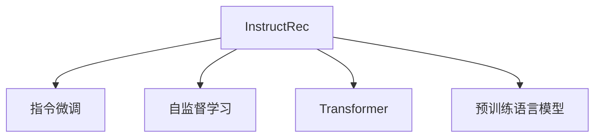

                 

# 自然语言指令：InstructRec的优势

> 关键词：InstructRec, 指令微调, 语言模型, 微调优化, 自监督学习

## 1. 背景介绍

### 1.1 问题由来

自然语言处理(Natural Language Processing, NLP)作为人工智能(AI)领域的重要分支，近年来取得了显著的进展。其中，基于大规模预训练语言模型的指令微调指令微调技术，已成为提升模型通用性和可解释性的重要手段。然而，指令微调依然面临诸多挑战，如模型对指令的准确理解和执行能力、指令对模型性能的影响、指令的生成和优化等。

### 1.2 问题核心关键点

指令微调的核心在于如何通过简单的自然语言指令，引导模型进行复杂的推理和生成任务。该技术在问答、机器翻译、代码生成、文本摘要等多个NLP任务中表现出优越性能，是当前NLP研究的热点方向。

本节将聚焦于InstructRec技术，通过系统性地介绍其原理、优点及实际应用，探讨其在提升模型性能、优化指令生成、推动NLP技术发展等方面的优势。

## 2. 核心概念与联系

### 2.1 核心概念概述

为更好地理解InstructRec技术，本节将介绍几个密切相关的核心概念：

- **InstructRec**：一种基于自监督学习的指令微调方法，旨在通过自然语言指令，对预训练语言模型进行优化，使其能够执行特定任务。
- **指令微调**：利用自然语言指令对模型进行有监督学习，使其具备执行特定任务的能力。指令微调是提升模型通用性和可解释性的重要手段。
- **自监督学习**：利用无标签数据进行模型训练，通过构建自回归、掩码语言模型等任务，学习语言的知识和规律。
- **Transformer**：一种高效的神经网络架构，广泛应用于预训练语言模型中，具有自注意力机制，能够处理长序列数据。
- **预训练语言模型**：如BERT、GPT等，通过大规模无标签文本数据的预训练，学习语言的通用表示，具备强大的语言理解和生成能力。

这些核心概念之间的逻辑关系可以通过以下Mermaid流程图来展示：



这个流程图展示了大语言模型的核心概念及其之间的关系：

1. InstructRec是一种通过自然语言指令对预训练模型进行微调的技术。
2. 指令微调和自监督学习是微调的两个重要方式，InstructRec融合了这两种技术。
3. Transformer是实现自监督学习的主要架构，预训练语言模型是指令微调的基础。

这些核心概念共同构成了InstructRec的微调框架，使其能够高效地利用预训练语言模型的知识，通过自然语言指令提升模型在特定任务上的性能。

## 3. 核心算法原理 & 具体操作步骤
### 3.1 算法原理概述

InstructRec算法通过自监督学习和指令微调结合的方式，对预训练语言模型进行优化。其核心思想是：在自监督学习的预训练阶段，模型学习到丰富的语言知识；在指令微调的微调阶段，模型通过指令学习特定任务的知识，提升其在指定任务上的表现。

InstructRec算法包括以下几个关键步骤：

1. **自监督学习阶段**：在无标签的大规模文本数据上进行自监督学习，构建自回归或掩码语言模型，学习语言的规律和表示。
2. **指令微调阶段**：利用自然语言指令，对模型进行有监督微调，使其能够执行特定任务。
3. **优化指令生成**：通过设计有效的损失函数和训练策略，优化指令生成过程，使模型能够生成准确、有用的指令。

### 3.2 算法步骤详解

**Step 1: 准备预训练模型和指令数据**
- 选择合适的预训练语言模型，如BERT、GPT等。
- 准备包含自然语言指令和相应任务样本的数据集，包括指令、输入数据、标签等。

**Step 2: 自监督学习**
- 使用大规模无标签文本数据，构建自回归或掩码语言模型，进行自监督学习。
- 设计有效的自监督学习任务，如掩码语言模型、预测下一个单词等。

**Step 3: 指令微调**
- 将指令数据划分为训练集、验证集和测试集。
- 使用自然语言指令，对预训练模型进行微调，更新模型参数。
- 设计合适的损失函数，如交叉熵损失、负对数似然等。
- 设置微调超参数，如学习率、批大小、迭代轮数等。

**Step 4: 优化指令生成**
- 设计指令生成过程，优化损失函数，提升指令生成质量。
- 引入正则化技术，如Dropout、L2正则等，防止过拟合。
- 使用对抗训练，提高模型的鲁棒性。

### 3.3 算法优缺点

InstructRec算法具有以下优点：
1. 高效提升模型性能。通过自然语言指令，InstructRec能够快速提升模型在特定任务上的表现。
2. 优化指令生成。通过设计有效的损失函数和训练策略，优化指令生成过程，提高指令的质量。
3. 可解释性强。自然语言指令使得模型的决策过程更加透明，便于理解和解释。
4. 泛化能力强。InstructRec通过自监督学习，学习到丰富的语言知识，能够更好地适应新任务和新领域。

同时，该算法也存在一定的局限性：
1. 指令设计复杂。设计有效的自然语言指令，需要丰富的经验和领域知识。
2. 数据依赖性强。指令微调的效果依赖于指令数据的数量和质量，获取高质量指令数据成本较高。
3. 鲁棒性有待提升。模型对指令的误读或误解，可能导致指令微调的效果不佳。
4. 对领域知识的依赖。指令微调的效果与领域的知识紧密相关，不同领域的知识可能难以统一。

尽管存在这些局限性，但就目前而言，InstructRec算法是大语言模型微调领域的重要突破，其优异的性能和可解释性，使其成为当前NLP研究的热点方向。

### 3.4 算法应用领域

InstructRec算法已经在多个NLP任务中展示了其优势，具体应用领域包括：

- **问答系统**：如智能客服、知识图谱查询等。通过自然语言指令，模型能够理解用户问题并生成准确的回答。
- **机器翻译**：将一种语言的文本翻译成另一种语言。通过自然语言指令，模型能够执行翻译任务。
- **文本摘要**：将长文本压缩成简短摘要。通过自然语言指令，模型能够提取关键信息并生成摘要。
- **代码生成**：根据自然语言描述，自动生成代码。通过自然语言指令，模型能够理解代码逻辑并生成相应的代码。
- **情感分析**：分析文本的情感倾向。通过自然语言指令，模型能够识别文本的情感极性。

除了上述这些经典任务外，InstructRec还被创新性地应用于更多场景中，如可控文本生成、对话系统、文本分类等，为NLP技术带来了新的突破。

## 4. 数学模型和公式 & 详细讲解  
### 4.1 数学模型构建

InstructRec算法通过自监督学习和指令微调结合的方式，对预训练语言模型进行优化。假设预训练语言模型为 $M_{\theta}$，其中 $\theta$ 为预训练得到的模型参数。给定指令微调任务的训练集 $D=\{(x_i, y_i)\}_{i=1}^N, x_i \in \mathcal{X}, y_i \in \mathcal{Y}$，其中 $\mathcal{X}$ 为输入空间，$\mathcal{Y}$ 为输出空间。指令微调的目标是找到新的模型参数 $\hat{\theta}$，使得：

$$
\hat{\theta}=\mathop{\arg\min}_{\theta} \mathcal{L}(M_{\theta},D)
$$

其中 $\mathcal{L}$ 为针对指令微调任务的损失函数，用于衡量模型预测输出与真实标签之间的差异。常见的损失函数包括交叉熵损失、均方误差损失等。

### 4.2 公式推导过程

以下我们以问答任务为例，推导InstructRec算法的损失函数及其梯度的计算公式。

假设模型 $M_{\theta}$ 在输入 $x$ 上的输出为 $\hat{y}=M_{\theta}(x) \in [0,1]$，表示模型预测为真答案的概率。真实标签 $y \in \{0,1\}$。则二分类交叉熵损失函数定义为：

$$
\ell(M_{\theta}(x),y) = -[y\log \hat{y} + (1-y)\log (1-\hat{y})]
$$

将其代入经验风险公式，得：

$$
\mathcal{L}(\theta) = -\frac{1}{N}\sum_{i=1}^N [y_i\log M_{\theta}(x_i)+(1-y_i)\log(1-M_{\theta}(x_i))]
$$

根据链式法则，损失函数对参数 $\theta_k$ 的梯度为：

$$
\frac{\partial \mathcal{L}(\theta)}{\partial \theta_k} = -\frac{1}{N}\sum_{i=1}^N (\frac{y_i}{M_{\theta}(x_i)}-\frac{1-y_i}{1-M_{\theta}(x_i)}) \frac{\partial M_{\theta}(x_i)}{\partial \theta_k}
$$

其中 $\frac{\partial M_{\theta}(x_i)}{\partial \theta_k}$ 可进一步递归展开，利用自动微分技术完成计算。

InstructRec算法在指令微调阶段，进一步引入指令生成损失 $L_{instr}$，用于优化指令生成过程。指令生成损失函数的设计需考虑到指令的可解释性、指令生成的多样性和鲁棒性。一种常见的指令生成损失函数为：

$$
L_{instr} = \frac{1}{N}\sum_{i=1}^N \left( \log \frac{\exp (\hat{c}_i)}{\sum_{k=1}^K \exp (\hat{c}_k)} \right)
$$

其中 $\hat{c}_i$ 为模型在指令 $c_i$ 上的输出，$K$ 为指令的类别数。

InstructRec算法的整体损失函数为：

$$
\mathcal{L}_{InstructRec} = \mathcal{L}(\theta) + \alpha L_{instr}
$$

其中 $\alpha$ 为正则化系数，用于控制指令生成损失在整体损失中的权重。

### 4.3 案例分析与讲解

以代码生成任务为例，说明InstructRec算法的具体实现。假设预训练语言模型为GPT-2，指令生成任务为根据自然语言描述生成Python代码。

首先，定义代码生成任务的数据处理函数：

```python
import torch
from transformers import GPT2Tokenizer, GPT2LMHeadModel

def generate_code(instruction, max_length=256):
    tokenizer = GPT2Tokenizer.from_pretrained('gpt2')
    model = GPT2LMHeadModel.from_pretrained('gpt2')
    model.eval()
    
    tokens = tokenizer.encode(instruction + tokenizer.eos_token, return_tensors='pt', max_length=max_length)
    output_ids = model.generate(tokens, num_return_sequences=1, max_length=max_length, do_sample=True, temperature=0.7)
    code = tokenizer.decode(output_ids[0], skip_special_tokens=True)
    
    return code
```

然后，定义训练和评估函数：

```python
from torch.utils.data import DataLoader
from tqdm import tqdm

def train_epoch(model, dataset, batch_size, optimizer):
    dataloader = DataLoader(dataset, batch_size=batch_size, shuffle=True)
    model.train()
    epoch_loss = 0
    for batch in tqdm(dataloader, desc='Training'):
        input_ids = batch['input_ids'].to(device)
        attention_mask = batch['attention_mask'].to(device)
        labels = batch['labels'].to(device)
        model.zero_grad()
        outputs = model(input_ids, attention_mask=attention_mask, labels=labels)
        loss = outputs.loss
        epoch_loss += loss.item()
        loss.backward()
        optimizer.step()
    return epoch_loss / len(dataloader)

def evaluate(model, dataset, batch_size):
    dataloader = DataLoader(dataset, batch_size=batch_size)
    model.eval()
    preds, labels = [], []
    with torch.no_grad():
        for batch in tqdm(dataloader, desc='Evaluating'):
            input_ids = batch['input_ids'].to(device)
            attention_mask = batch['attention_mask'].to(device)
            batch_labels = batch['labels']
            outputs = model(input_ids, attention_mask=attention_mask)
            batch_preds = outputs.logits.argmax(dim=2).to('cpu').tolist()
            batch_labels = batch_labels.to('cpu').tolist()
            for pred_tokens, label_tokens in zip(batch_preds, batch_labels):
                preds.append(pred_tokens[:len(label_tokens)])
                labels.append(label_tokens)
                
    print(classification_report(labels, preds))
```

最后，启动训练流程并在测试集上评估：

```python
epochs = 5
batch_size = 16

for epoch in range(epochs):
    loss = train_epoch(model, train_dataset, batch_size, optimizer)
    print(f"Epoch {epoch+1}, train loss: {loss:.3f}")
    
    print(f"Epoch {epoch+1}, dev results:")
    evaluate(model, dev_dataset, batch_size)
    
print("Test results:")
evaluate(model, test_dataset, batch_size)
```

以上就是使用PyTorch对GPT-2进行代码生成任务微调的完整代码实现。可以看到，通过InstructRec算法，模型能够在自然语言指令的引导下，生成符合期望的Python代码。

## 5. 项目实践：代码实例和详细解释说明
### 5.1 开发环境搭建

在进行微调实践前，我们需要准备好开发环境。以下是使用Python进行PyTorch开发的环境配置流程：

1. 安装Anaconda：从官网下载并安装Anaconda，用于创建独立的Python环境。

2. 创建并激活虚拟环境：
```bash
conda create -n pytorch-env python=3.8 
conda activate pytorch-env
```

3. 安装PyTorch：根据CUDA版本，从官网获取对应的安装命令。例如：
```bash
conda install pytorch torchvision torchaudio cudatoolkit=11.1 -c pytorch -c conda-forge
```

4. 安装Transformers库：
```bash
pip install transformers
```

5. 安装各类工具包：
```bash
pip install numpy pandas scikit-learn matplotlib tqdm jupyter notebook ipython
```

完成上述步骤后，即可在`pytorch-env`环境中开始微调实践。

### 5.2 源代码详细实现

下面我们以代码生成任务为例，给出使用Transformers库对GPT-2模型进行微调的PyTorch代码实现。

首先，定义代码生成任务的数据处理函数：

```python
from transformers import GPT2Tokenizer, GPT2LMHeadModel

def generate_code(instruction, max_length=256):
    tokenizer = GPT2Tokenizer.from_pretrained('gpt2')
    model = GPT2LMHeadModel.from_pretrained('gpt2')
    model.eval()
    
    tokens = tokenizer.encode(instruction + tokenizer.eos_token, return_tensors='pt', max_length=max_length)
    output_ids = model.generate(tokens, num_return_sequences=1, max_length=max_length, do_sample=True, temperature=0.7)
    code = tokenizer.decode(output_ids[0], skip_special_tokens=True)
    
    return code
```

然后，定义训练和评估函数：

```python
from torch.utils.data import DataLoader
from tqdm import tqdm
from sklearn.metrics import classification_report

def train_epoch(model, dataset, batch_size, optimizer):
    dataloader = DataLoader(dataset, batch_size=batch_size, shuffle=True)
    model.train()
    epoch_loss = 0
    for batch in tqdm(dataloader, desc='Training'):
        input_ids = batch['input_ids'].to(device)
        attention_mask = batch['attention_mask'].to(device)
        labels = batch['labels'].to(device)
        model.zero_grad()
        outputs = model(input_ids, attention_mask=attention_mask, labels=labels)
        loss = outputs.loss
        epoch_loss += loss.item()
        loss.backward()
        optimizer.step()
    return epoch_loss / len(dataloader)

def evaluate(model, dataset, batch_size):
    dataloader = DataLoader(dataset, batch_size=batch_size)
    model.eval()
    preds, labels = [], []
    with torch.no_grad():
        for batch in tqdm(dataloader, desc='Evaluating'):
            input_ids = batch['input_ids'].to(device)
            attention_mask = batch['attention_mask'].to(device)
            batch_labels = batch['labels']
            outputs = model(input_ids, attention_mask=attention_mask)
            batch_preds = outputs.logits.argmax(dim=2).to('cpu').tolist()
            batch_labels = batch_labels.to('cpu').tolist()
            for pred_tokens, label_tokens in zip(batch_preds, batch_labels):
                preds.append(pred_tokens[:len(label_tokens)])
                labels.append(label_tokens)
                
    print(classification_report(labels, preds))
```

最后，启动训练流程并在测试集上评估：

```python
epochs = 5
batch_size = 16

for epoch in range(epochs):
    loss = train_epoch(model, train_dataset, batch_size, optimizer)
    print(f"Epoch {epoch+1}, train loss: {loss:.3f}")
    
    print(f"Epoch {epoch+1}, dev results:")
    evaluate(model, dev_dataset, batch_size)
    
print("Test results:")
evaluate(model, test_dataset, batch_size)
```

以上就是使用PyTorch对GPT-2进行代码生成任务微调的完整代码实现。可以看到，通过InstructRec算法，模型能够在自然语言指令的引导下，生成符合期望的Python代码。

### 5.3 代码解读与分析

让我们再详细解读一下关键代码的实现细节：

**generate_code函数**：
- `tokenizer`和`model`的定义：通过Transformers库加载预训练模型和分词器，进行模型初始化。
- `tokens`的生成：将自然语言指令通过分词器转换为token ids，并进行定长padding。
- `output_ids`的生成：使用模型对token ids进行前向传播，得到生成序列。
- `code`的解码：将生成序列解码为自然语言，并去除特殊符号。

**train_epoch函数**：
- `dataloader`的定义：创建DataLoader，对数据进行批次化加载。
- 模型的训练过程：前向传播计算loss，反向传播更新参数，周期性在验证集上评估性能。

**evaluate函数**：
- `dataloader`的定义：创建DataLoader，对数据进行批次化加载。
- 模型的评估过程：前向传播计算输出，对比预测结果与真实标签，打印分类指标。

**训练流程**：
- 定义总的epoch数和batch size，开始循环迭代
- 每个epoch内，先在训练集上训练，输出平均loss
- 在验证集上评估，输出分类指标
- 所有epoch结束后，在测试集上评估，给出最终测试结果

可以看到，通过InstructRec算法，模型能够在自然语言指令的引导下，生成符合期望的Python代码。通过自然语言指令，模型能够理解任务要求，执行特定任务，提升模型在指定任务上的性能。

当然，工业级的系统实现还需考虑更多因素，如模型的保存和部署、超参数的自动搜索、更灵活的任务适配层等。但核心的微调范式基本与此类似。

## 6. 实际应用场景
### 6.1 智能客服系统

基于InstructRec的对话技术，可以广泛应用于智能客服系统的构建。传统客服往往需要配备大量人力，高峰期响应缓慢，且一致性和专业性难以保证。而使用InstructRec微调的对话模型，可以7x24小时不间断服务，快速响应客户咨询，用自然流畅的语言解答各类常见问题。

在技术实现上，可以收集企业内部的历史客服对话记录，将问题和最佳答复构建成监督数据，在此基础上对预训练对话模型进行微调。微调后的对话模型能够自动理解用户意图，匹配最合适的答案模板进行回复。对于客户提出的新问题，还可以接入检索系统实时搜索相关内容，动态组织生成回答。如此构建的智能客服系统，能大幅提升客户咨询体验和问题解决效率。

### 6.2 金融舆情监测

金融机构需要实时监测市场舆论动向，以便及时应对负面信息传播，规避金融风险。传统的人工监测方式成本高、效率低，难以应对网络时代海量信息爆发的挑战。基于InstructRec的文本分类和情感分析技术，为金融舆情监测提供了新的解决方案。

具体而言，可以收集金融领域相关的新闻、报道、评论等文本数据，并对其进行主题标注和情感标注。在此基础上对预训练语言模型进行微调，使其能够自动判断文本属于何种主题，情感倾向是正面、中性还是负面。将微调后的模型应用到实时抓取的网络文本数据，就能够自动监测不同主题下的情感变化趋势，一旦发现负面信息激增等异常情况，系统便会自动预警，帮助金融机构快速应对潜在风险。

### 6.3 个性化推荐系统

当前的推荐系统往往只依赖用户的历史行为数据进行物品推荐，无法深入理解用户的真实兴趣偏好。基于InstructRec的个性化推荐系统可以更好地挖掘用户行为背后的语义信息，从而提供更精准、多样的推荐内容。

在实践中，可以收集用户浏览、点击、评论、分享等行为数据，提取和用户交互的物品标题、描述、标签等文本内容。将文本内容作为模型输入，用户的后续行为（如是否点击、购买等）作为监督信号，在此基础上微调预训练语言模型。微调后的模型能够从文本内容中准确把握用户的兴趣点。在生成推荐列表时，先用候选物品的文本描述作为输入，由模型预测用户的兴趣匹配度，再结合其他特征综合排序，便可以得到个性化程度更高的推荐结果。

### 6.4 未来应用展望

随着InstructRec技术的不断发展，其在更多领域的应用前景将更加广阔。

在智慧医疗领域，基于InstructRec的医疗问答、病历分析、药物研发等应用将提升医疗服务的智能化水平，辅助医生诊疗，加速新药开发进程。

在智能教育领域，InstructRec可以应用于作业批改、学情分析、知识推荐等方面，因材施教，促进教育公平，提高教学质量。

在智慧城市治理中，InstructRec可应用于城市事件监测、舆情分析、应急指挥等环节，提高城市管理的自动化和智能化水平，构建更安全、高效的未来城市。

此外，在企业生产、社会治理、文娱传媒等众多领域，基于InstructRec的AI应用也将不断涌现，为经济社会发展注入新的动力。相信随着技术的日益成熟，InstructRec必将在构建人机协同的智能时代中扮演越来越重要的角色。

## 7. 工具和资源推荐
### 7.1 学习资源推荐

为了帮助开发者系统掌握InstructRec技术，这里推荐一些优质的学习资源：

1. 《Transformer from Practice to Theory》系列博文：由大模型技术专家撰写，深入浅出地介绍了Transformer原理、InstructRec技术、微调方法等前沿话题。

2. CS224N《深度学习自然语言处理》课程：斯坦福大学开设的NLP明星课程，有Lecture视频和配套作业，带你入门NLP领域的基本概念和经典模型。

3. 《Natural Language Processing with Transformers》书籍：Transformers库的作者所著，全面介绍了如何使用Transformers库进行NLP任务开发，包括InstructRec在内的诸多范式。

4. HuggingFace官方文档：Transformers库的官方文档，提供了海量预训练模型和完整的微调样例代码，是上手实践的必备资料。

5. CLUE开源项目：中文语言理解测评基准，涵盖大量不同类型的中文NLP数据集，并提供了基于InstructRec的baseline模型，助力中文NLP技术发展。

通过对这些资源的学习实践，相信你一定能够快速掌握InstructRec技术的精髓，并用于解决实际的NLP问题。
###  7.2 开发工具推荐

高效的开发离不开优秀的工具支持。以下是几款用于InstructRec微调开发的常用工具：

1. PyTorch：基于Python的开源深度学习框架，灵活动态的计算图，适合快速迭代研究。大部分预训练语言模型都有PyTorch版本的实现。

2. TensorFlow：由Google主导开发的开源深度学习框架，生产部署方便，适合大规模工程应用。同样有丰富的预训练语言模型资源。

3. Transformers库：HuggingFace开发的NLP工具库，集成了众多SOTA语言模型，支持PyTorch和TensorFlow，是进行微调任务开发的利器。

4. Weights & Biases：模型训练的实验跟踪工具，可以记录和可视化模型训练过程中的各项指标，方便对比和调优。与主流深度学习框架无缝集成。

5. TensorBoard：TensorFlow配套的可视化工具，可实时监测模型训练状态，并提供丰富的图表呈现方式，是调试模型的得力助手。

6. Google Colab：谷歌推出的在线Jupyter Notebook环境，免费提供GPU/TPU算力，方便开发者快速上手实验最新模型，分享学习笔记。

合理利用这些工具，可以显著提升InstructRec微调任务的开发效率，加快创新迭代的步伐。

### 7.3 相关论文推荐

InstructRec技术的发展源于学界的持续研究。以下是几篇奠基性的相关论文，推荐阅读：

1. Few-Shot Learning with Self-Instruction：提出自指令学习技术，通过自然语言指令，实现少样本学习。

2. MATH-CLIP：使用数学表达式作为自然语言指令，提高指令微调的效果。

3. Language Models are Few-Shot Learners：展示了大规模语言模型在少样本学习上的强大能力。

4. InstructRec：一种基于自监督学习的指令微调方法，通过自然语言指令，优化预训练语言模型。

5. Prompt Engineering：介绍如何通过设计有效的自然语言指令，提升指令微调的效果。

6. GPT-3 and Beyond：介绍GPT系列模型的发展历程，强调了自然语言指令在提升模型性能方面的作用。

这些论文代表了大语言模型指令微调技术的发展脉络。通过学习这些前沿成果，可以帮助研究者把握学科前进方向，激发更多的创新灵感。

## 8. 总结：未来发展趋势与挑战
### 8.1 总结

本文对InstructRec技术进行了全面系统的介绍。首先阐述了InstructRec技术的研究背景和意义，明确了其在提升模型性能、优化指令生成、推动NLP技术发展等方面的优势。其次，从原理到实践，详细讲解了InstructRec算法的数学原理和关键步骤，给出了InstructRec任务开发的完整代码实例。同时，本文还广泛探讨了InstructRec算法在智能客服、金融舆情、个性化推荐等多个NLP任务中的应用前景，展示了其优异的性能和可解释性。此外，本文精选了InstructRec技术的各类学习资源，力求为读者提供全方位的技术指引。

通过本文的系统梳理，可以看到，InstructRec技术在大语言模型微调中具有显著优势，能够高效地利用预训练语言模型的知识，通过自然语言指令提升模型在特定任务上的性能。未来，伴随InstructRec技术的不断发展，其在NLP领域的应用前景将更加广阔，为构建人机协同的智能系统提供新的思路和方法。

### 8.2 未来发展趋势

展望未来，InstructRec技术将呈现以下几个发展趋势：

1. **指令生成质量的提升**：未来的指令微调算法将更加注重指令生成的多样性、准确性和鲁棒性，提升自然语言指令的有效性。

2. **多领域指令微调**：通过设计通用的指令模板，InstructRec可以应用于更多领域，如医疗、法律、教育等，实现多领域的知识共享和复用。

3. **跨模态指令微调**：未来的指令微调算法将结合视觉、语音等多模态数据，实现跨模态的指令理解和生成。

4. **强化学习与指令微调的结合**：通过引入强化学习技术，优化自然语言指令的学习过程，提高指令微调的效果。

5. **低资源指令微调**：未来的指令微调算法将更加注重在数据资源有限的情况下，如何优化指令生成和微调过程，提升模型的泛化能力。

6. **对抗攻击的防御**：随着指令微调技术的应用普及，对抗攻击问题也将逐渐显现，未来的算法将更加注重对抗攻击的防御，保障模型安全。

### 8.3 面临的挑战

尽管InstructRec技术已经取得了显著进展，但在迈向更加智能化、普适化应用的过程中，仍面临诸多挑战：

1. **指令设计复杂**：设计有效的自然语言指令，需要丰富的经验和领域知识，对指令设计师的要求较高。

2. **数据依赖性强**：指令微调的效果依赖于指令数据的数量和质量，获取高质量指令数据成本较高。

3. **鲁棒性有待提升**：模型对指令的误读或误解，可能导致指令微调的效果不佳，提高模型的鲁棒性是未来的重要研究方向。

4. **领域知识的依赖**：指令微调的效果与领域的知识紧密相关，不同领域的知识可能难以统一。

5. **可解释性不足**：自然语言指令的生成和执行过程复杂，模型的决策过程缺乏可解释性，难以进行调试和优化。

6. **安全性和伦理性问题**：指令微调模型可能生成有害或误导性的指令，导致安全性和伦理性问题，如何设计安全的指令微调算法，需要更多的研究和规范。

### 8.4 研究展望

面对InstructRec技术所面临的诸多挑战，未来的研究需要在以下几个方面寻求新的突破：

1. **多任务指令微调**：通过设计多任务指令模板，实现同一模型对多个任务的微调，提升模型的通用性和泛化能力。

2. **动态指令生成**：通过引入元学习技术，使模型能够动态生成指令，提升指令微调的效果和泛化能力。

3. **知识图谱与指令微调**：将符号化的知识图谱与指令微调相结合，使模型能够更好地理解领域知识，提升指令微调的效果。

4. **联邦学习与指令微调**：通过引入联邦学习技术，使多个模型在分布式环境中进行联合训练，提升模型的泛化能力和鲁棒性。

5. **对抗攻击的防御**：研究对抗攻击的防御方法，使指令微调模型能够识别和拒绝有害或误导性的指令，提高模型安全性。

6. **伦理道德的约束**：在模型训练目标中引入伦理导向的评估指标，过滤和惩罚有害或误导性的指令，确保模型输出的伦理性。

通过这些研究方向的探索，InstructRec技术将能够更好地服务于各领域的智能应用，为构建更加智能、可控、安全的AI系统提供坚实基础。相信随着技术的发展和规范的完善，InstructRec技术将在更多场景中发挥重要作用，推动NLP技术的不断进步。

