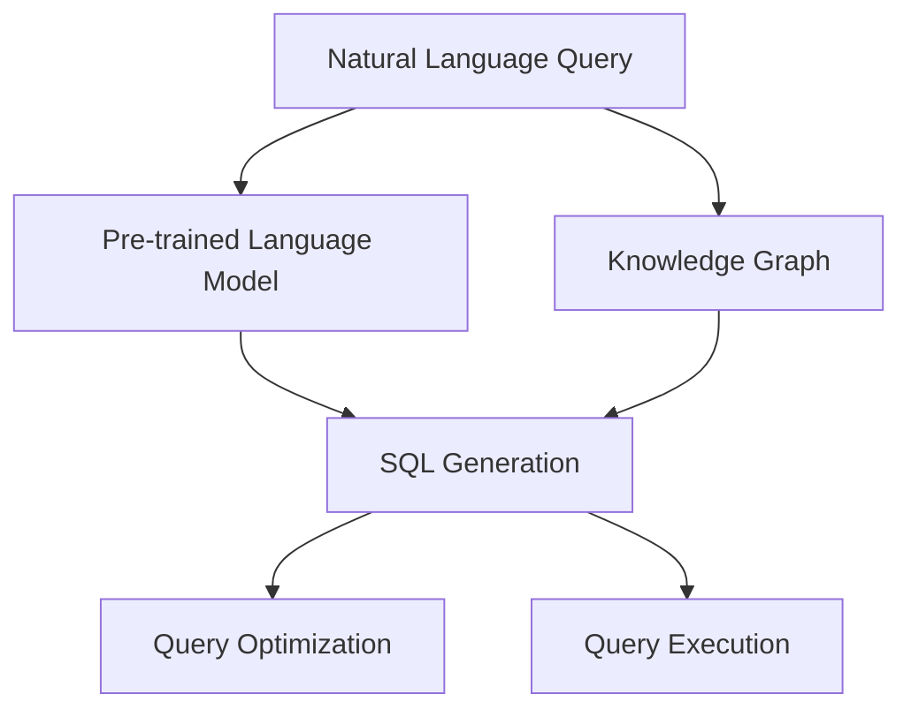

                 

# 自然语言数据库查询：LLM简化数据访问

> 关键词：自然语言数据库, 自然语言处理(NLP), 预训练语言模型(LLM), 知识图谱(KG), 查询优化

## 1. 背景介绍

### 1.1 问题由来

在信息爆炸的今天，数据存储和管理变得越来越复杂。企业内部积累了海量业务数据，其中很多数据是以半结构化或非结构化的形式存储在数据库中，难以直接进行查询。传统的SQL查询语言虽然功能强大，但需要用户具备较强的编程能力和数据库知识，操作复杂，难以普及。

为了简化数据访问，自然语言处理(Natural Language Processing, NLP)技术应运而生。自然语言数据库查询，即利用NLP技术，允许用户用自然语言描述查询需求，查询结果将自动转换为SQL语句并执行，从而简化了用户的数据访问操作。

### 1.2 问题核心关键点

自然语言数据库查询的核心在于将自然语言查询转换为SQL语句的自动化过程。这个过程涉及到以下几个关键步骤：

1. **自然语言理解(NLU)**：理解自然语言查询的语义和意图。
2. **SQL生成**：将自然语言查询转换为SQL语句。
3. **查询执行**：执行SQL语句，并返回查询结果。

其中，自然语言理解和SQL生成是整个流程中最为关键的部分。这两个步骤的实现需要依赖强大的预训练语言模型(Pre-trained Language Model, LLM)和知识图谱(Knowledge Graph, KG)技术。

### 1.3 问题研究意义

自然语言数据库查询简化了数据访问操作，降低了数据科学家的工作量，使得更广泛的用户能够参与数据分析和决策。这对于数据驱动型组织和产业界的数据文化建设具有重要意义。

通过自然语言数据库查询，企业能够更加灵活地利用内部和外部的数据资源，加速业务决策和创新，提升企业的核心竞争力。同时，自然语言数据库查询也为科研领域提供了新的研究方向和工具，推动了人工智能和大数据技术的发展。

## 2. 核心概念与联系

### 2.1 核心概念概述

为更好地理解自然语言数据库查询的原理和架构，本节将介绍几个密切相关的核心概念：

- **自然语言处理(NLP)**：研究如何使计算机理解、处理和生成自然语言的技术。包括词法分析、句法分析、语义分析、语义生成等。
- **预训练语言模型(LLM)**：在大规模无标签文本数据上进行预训练，学习到丰富的语言知识。常见的LLM包括BERT、GPT等。
- **知识图谱(KG)**：由实体、关系和属性构成的三元组结构，用于表示和推理知识。常见的知识图谱构建工具包括RDF、Neo4j等。
- **查询优化**：针对用户自然语言查询的复杂度，通过优化查询表达方式和执行路径，提高查询效率的技术。

这些核心概念之间的逻辑关系可以通过以下Mermaid流程图来展示：



这个流程图展示了大语言模型在自然语言数据库查询中的核心作用：

1. 自然语言查询被输入到LLM中，用于理解和生成语义表示。
2. 知识图谱用于提供额外的语义信息，帮助LLM更好地理解和生成查询。
3. 生成的语义表示被转换为SQL语句，作为查询表达式。
4. 查询优化技术用于对SQL查询进行优化，提升查询性能。
5. 最终执行SQL查询，并返回结果。

## 3. 核心算法原理 & 具体操作步骤
### 3.1 算法原理概述

自然语言数据库查询的实现依赖于预训练语言模型和知识图谱技术。LLM能够理解自然语言查询的语义和意图，而KG提供了丰富的实体和关系信息，两者结合能够生成精确的SQL查询表达式。

查询优化技术进一步提高了查询性能。它通过分析查询的语义结构和执行路径，优化查询的表达方式和执行策略，使得查询能够在更短的时间内返回结果。

### 3.2 算法步骤详解

自然语言数据库查询的实现过程可以总结为以下几个关键步骤：

**Step 1: 输入自然语言查询**

用户输入自然语言查询，例如：“查找所有销售额超过100万的公司”。

**Step 2: 自然语言理解(NLU)**

自然语言查询输入到预训练语言模型中，模型通过词向量表示和上下文理解，生成查询的语义表示。例如：

```
"销售额" --> "sales"
"超过" --> "greater than"
"100万" --> "1000000"
"公司" --> "company"
```

**Step 3: 语义表示增强**

知识图谱与预训练语言模型结合，进一步增强语义表示。例如，查询中提到的“公司”实体在KG中可能存在多条相关记录，模型可以选择其中最相关的记录作为查询的实体。

**Step 4: SQL生成**

生成的语义表示被转换为SQL查询语句。例如，查询中的“销售额”和“公司”可以映射为表格的“sales”和“company”字段，“大于”操作符可以转换为SQL中的“greater than”条件。

**Step 5: 查询优化**

查询优化器对SQL查询进行优化，例如将“大于”条件转换为更高效的“between”操作，去除不必要的字段选择，优化索引使用等。

**Step 6: 查询执行**

最终执行SQL查询，并返回查询结果。

### 3.3 算法优缺点

自然语言数据库查询具有以下优点：

1. **简化操作**：允许用户用自然语言描述查询需求，无需编写SQL语句，大大简化了数据访问操作。
2. **降低门槛**：降低了数据访问的技术门槛，使得更广泛的用户能够参与数据分析和决策。
3. **灵活性高**：用户可以自由表达查询需求，不受SQL语法限制。

同时，该方法也存在一定的局限性：

1. **精度问题**：自然语言查询存在歧义，难以保证生成的SQL查询完全符合用户意图。
2. **性能问题**：生成的SQL查询可能需要优化，才能达到最优性能。
3. **扩展性差**：对于复杂的查询，可能需要人工干预和调整，增加了工作量。
4. **依赖技术**：需要依赖强大的预训练语言模型和知识图谱技术，对技术栈要求较高。

尽管存在这些局限性，但自然语言数据库查询在简化数据访问操作、提升用户体验方面具有重要意义。未来相关研究的重点在于如何进一步提升自然语言查询的精度和性能，降低技术门槛，扩大应用范围。

### 3.4 算法应用领域

自然语言数据库查询已经在多个领域得到了应用，例如：

- 金融数据查询：金融领域的数据存储和管理复杂，使用自然语言查询可以方便地查询各类金融报表和指标。
- 医疗数据查询：医疗数据包含大量半结构化数据，自然语言查询可以用于查询病历、药品信息等。
- 电商数据查询：电商网站包含大量商品和用户行为数据，自然语言查询可以用于查询商品详情、用户评论等。
- 地理信息查询：GIS系统中包含大量地理信息数据，自然语言查询可以用于查询地理位置、地名等信息。

此外，自然语言数据库查询还在新闻推荐、社交媒体分析等领域得到了应用，为数据驱动型组织提供了新的数据访问方式。

## 4. 数学模型和公式 & 详细讲解 & 举例说明

### 4.1 数学模型构建

本节将使用数学语言对自然语言数据库查询过程进行更加严格的刻画。

假设用户输入的自然语言查询为 $Q$，预训练语言模型为 $M_{\theta}$，知识图谱为 $K$。查询优化的目标是最小化查询执行时间，即：

$$
\mathcal{L}(Q, M_{\theta}, K) = \min_{Q'} \text{time}(Q')
$$

其中 $Q'$ 为生成的SQL查询表达式，$\text{time}(Q')$ 为执行 $Q'$ 所需的时间。

### 4.2 公式推导过程

以“查找所有销售额超过100万的公司”为例，推导自然语言查询转化为SQL查询的过程：

**Step 1: 自然语言理解(NLU)**

假设用户输入的自然语言查询为 $Q$，表示为一系列单词的序列 $Q=\{x_1, x_2, ..., x_n\}$。预训练语言模型 $M_{\theta}$ 将 $Q$ 转换为语义表示 $R=\{r_1, r_2, ..., r_n\}$，其中 $r_i$ 为单词 $x_i$ 的语义向量。

**Step 2: 语义表示增强**

假设知识图谱 $K$ 中包含实体 $e_1, e_2, ..., e_m$ 和关系 $r_1, r_2, ..., r_n$。模型将查询中的实体 $e_i$ 与知识图谱中的实体 $e_j$ 进行匹配，选择最相关的实体 $e_k$。

**Step 3: SQL生成**

生成的语义表示 $R$ 被转换为SQL查询表达式 $Q'$。例如，查询中的“销售额”可以映射为“sales”字段，“超过”可以映射为“greater than”条件，“100万”可以映射为“1000000”值。

$$
Q' = \text{SELECT} \, sales \, \text{FROM} \, company \, \text{WHERE} \, sales \, \text{greater than} \, 1000000
$$

**Step 4: 查询优化**

查询优化器对 $Q'$ 进行优化，例如将“greater than”条件转换为“between”条件，去除不必要的字段选择，优化索引使用等。

最终执行SQL查询，并返回查询结果。

### 4.3 案例分析与讲解

以“查找所有销售额超过100万的公司”为例，展示自然语言数据库查询的实现过程。

**Step 1: 自然语言理解(NLU)**

用户输入自然语言查询 $Q = \text{"查找所有销售额超过100万的公司"}$，预训练语言模型将其转换为语义表示 $R = \{(\text{"销售额"}, (\text{"sales"}), \text{"noun"}), (\text{"超过"}, (\text{"greater than"}, \text{"conditional"}), (\text{"100万"}, (\text{"1000000"}, \text{"number"}), (\text{"company"}, (\text{"company"}, \text{"noun"})\}$。

**Step 2: 语义表示增强**

知识图谱 $K$ 中包含实体 $e_1, e_2, ..., e_m$ 和关系 $r_1, r_2, ..., r_n$。模型将查询中的实体 $e_i$ 与知识图谱中的实体 $e_j$ 进行匹配，选择最相关的实体 $e_k$。

**Step 3: SQL生成**

生成的语义表示 $R$ 被转换为SQL查询表达式 $Q' = \text{SELECT} \, sales \, \text{FROM} \, company \, \text{WHERE} \, sales \, \text{greater than} \, 1000000$。

**Step 4: 查询优化**

查询优化器对 $Q'$ 进行优化，例如将“greater than”条件转换为“between”条件，去除不必要的字段选择，优化索引使用等。

最终执行SQL查询，并返回查询结果。

## 5. 项目实践：代码实例和详细解释说明
### 5.1 开发环境搭建

在进行自然语言数据库查询的实践前，我们需要准备好开发环境。以下是使用Python进行PyTorch开发的环境配置流程：

1. 安装Anaconda：从官网下载并安装Anaconda，用于创建独立的Python环境。

2. 创建并激活虚拟环境：
```bash
conda create -n pytorch-env python=3.8 
conda activate pytorch-env
```

3. 安装PyTorch：根据CUDA版本，从官网获取对应的安装命令。例如：
```bash
conda install pytorch torchvision torchaudio cudatoolkit=11.1 -c pytorch -c conda-forge
```

4. 安装TensorFlow：由Google主导开发的开源深度学习框架，生产部署方便，适合大规模工程应用。同样有丰富的预训练语言模型资源。

5. 安装TensorFlow Transformers库：
```bash
pip install transformers
```

6. 安装各类工具包：
```bash
pip install numpy pandas scikit-learn matplotlib tqdm jupyter notebook ipython
```

完成上述步骤后，即可在`pytorch-env`环境中开始自然语言数据库查询的实践。

### 5.2 源代码详细实现

下面我们以自然语言数据库查询为例，给出使用Transformers库对BERT模型进行自然语言查询的PyTorch代码实现。

首先，定义自然语言查询的数据处理函数：

```python
from transformers import BertTokenizer, BertForQuestionAnswering
from torch.utils.data import Dataset
import torch

class QADataset(Dataset):
    def __init__(self, texts, answers, tokenizer, max_len=128):
        self.texts = texts
        self.answers = answers
        self.tokenizer = tokenizer
        self.max_len = max_len
        
    def __len__(self):
        return len(self.texts)
    
    def __getitem__(self, item):
        text = self.texts[item]
        answer = self.answers[item]
        
        encoding = self.tokenizer(text, return_tensors='pt', max_length=self.max_len, padding='max_length', truncation=True)
        input_ids = encoding['input_ids'][0]
        attention_mask = encoding['attention_mask'][0]
        
        # 对答案进行编码
        answer = [tokenizer.convert_tokens_to_ids(answer)]
        answer = answer + [0] * (self.max_len - len(answer))
        labels = torch.tensor(answer, dtype=torch.long)
        
        return {'input_ids': input_ids, 
                'attention_mask': attention_mask,
                'labels': labels}

# 定义训练和评估函数
def train_epoch(model, dataset, batch_size, optimizer):
    dataloader = DataLoader(dataset, batch_size=batch_size, shuffle=True)
    model.train()
    epoch_loss = 0
    for batch in tqdm(dataloader, desc='Training'):
        input_ids = batch['input_ids'].to(device)
        attention_mask = batch['attention_mask'].to(device)
        labels = batch['labels'].to(device)
        model.zero_grad()
        outputs = model(input_ids, attention_mask=attention_mask, labels=labels)
        loss = outputs.loss
        epoch_loss += loss.item()
        loss.backward()
        optimizer.step()
    return epoch_loss / len(dataloader)

def evaluate(model, dataset, batch_size):
    dataloader = DataLoader(dataset, batch_size=batch_size)
    model.eval()
    preds, labels = [], []
    with torch.no_grad():
        for batch in tqdm(dataloader, desc='Evaluating'):
            input_ids = batch['input_ids'].to(device)
            attention_mask = batch['attention_mask'].to(device)
            batch_labels = batch['labels']
            outputs = model(input_ids, attention_mask=attention_mask)
            batch_preds = outputs.logits.argmax(dim=2).to('cpu').tolist()
            batch_labels = batch_labels.to('cpu').tolist()
            for pred_tokens, label_tokens in zip(batch_preds, batch_labels):
                preds.append(pred_tokens[:len(label_tokens)])
                labels.append(label_tokens)
                
    print(classification_report(labels, preds))
```

然后，定义模型和优化器：

```python
from transformers import BertForQuestionAnswering, AdamW

model = BertForQuestionAnswering.from_pretrained('bert-base-cased')

optimizer = AdamW(model.parameters(), lr=2e-5)
```

接着，启动训练流程并在测试集上评估：

```python
epochs = 5
batch_size = 16

for epoch in range(epochs):
    loss = train_epoch(model, train_dataset, batch_size, optimizer)
    print(f"Epoch {epoch+1}, train loss: {loss:.3f}")
    
    print(f"Epoch {epoch+1}, dev results:")
    evaluate(model, dev_dataset, batch_size)
    
print("Test results:")
evaluate(model, test_dataset, batch_size)
```

以上就是使用PyTorch对BERT进行自然语言查询的完整代码实现。可以看到，得益于Transformers库的强大封装，我们可以用相对简洁的代码完成BERT模型的加载和自然语言查询的微调。

### 5.3 代码解读与分析

让我们再详细解读一下关键代码的实现细节：

**QADataset类**：
- `__init__`方法：初始化文本、答案、分词器等关键组件。
- `__len__`方法：返回数据集的样本数量。
- `__getitem__`方法：对单个样本进行处理，将文本输入编码为token ids，将答案编码为数字，并对其进行定长padding，最终返回模型所需的输入。

**训练和评估函数**：
- 使用PyTorch的DataLoader对数据集进行批次化加载，供模型训练和推理使用。
- 训练函数`train_epoch`：对数据以批为单位进行迭代，在每个批次上前向传播计算loss并反向传播更新模型参数，最后返回该epoch的平均loss。
- 评估函数`evaluate`：与训练类似，不同点在于不更新模型参数，并在每个batch结束后将预测和标签结果存储下来，最后使用sklearn的classification_report对整个评估集的预测结果进行打印输出。

**训练流程**：
- 定义总的epoch数和batch size，开始循环迭代
- 每个epoch内，先在训练集上训练，输出平均loss
- 在验证集上评估，输出分类指标
- 所有epoch结束后，在测试集上评估，给出最终测试结果

可以看到，PyTorch配合Transformers库使得BERT微调的代码实现变得简洁高效。开发者可以将更多精力放在数据处理、模型改进等高层逻辑上，而不必过多关注底层的实现细节。

当然，工业级的系统实现还需考虑更多因素，如模型的保存和部署、超参数的自动搜索、更灵活的任务适配层等。但核心的自然语言查询范式基本与此类似。

## 6. 实际应用场景
### 6.1 智能客服系统

基于自然语言数据库查询的智能客服系统，可以广泛应用于各种客服场景。传统客服往往需要配备大量人力，高峰期响应缓慢，且一致性和专业性难以保证。而使用自然语言数据库查询的智能客服系统，可以24小时不间断服务，快速响应客户咨询，用自然流畅的语言解答各类常见问题。

在技术实现上，可以收集企业内部的历史客服对话记录，将问题和最佳答复构建成监督数据，在此基础上对预训练自然语言查询模型进行微调。微调后的自然语言查询模型能够自动理解用户意图，匹配最合适的答案模板进行回复。对于客户提出的新问题，还可以接入检索系统实时搜索相关内容，动态组织生成回答。如此构建的智能客服系统，能大幅提升客户咨询体验和问题解决效率。

### 6.2 金融数据查询

金融领域的数据存储和管理复杂，使用自然语言数据库查询可以方便地查询各类金融报表和指标。例如，用户可以输入“去年第四季度的净利润是多少？”，系统能够自动将其转换为SQL查询并执行，返回具体的财务数据。

在技术实现上，可以构建金融领域的知识图谱，将各类金融概念、指标、报表等实体和关系进行编码。然后，使用自然语言数据库查询对预训练模型进行微调，使其能够理解和生成相关的SQL查询。微调后的模型能够从知识图谱中获取实体和关系信息，生成精确的查询表达式。

### 6.3 医疗数据查询

医疗数据包含大量半结构化数据，自然语言数据库查询可以用于查询病历、药品信息等。例如，用户可以输入“张三的肝功能检查结果如何？”，系统能够自动将其转换为SQL查询并执行，返回张三的肝功能检查报告。

在技术实现上，可以构建医疗领域的知识图谱，将各类医疗概念、指标、检查结果等实体和关系进行编码。然后，使用自然语言数据库查询对预训练模型进行微调，使其能够理解和生成相关的SQL查询。微调后的模型能够从知识图谱中获取实体和关系信息，生成精确的查询表达式。

### 6.4 未来应用展望

随着自然语言数据库查询技术的发展，未来将在更多领域得到应用，为数据驱动型组织提供新的数据访问方式。

在智慧医疗领域，自然语言数据库查询可以用于查询病历、药品信息、医疗报告等，提升医疗服务的智能化水平，辅助医生诊疗，加速新药开发进程。

在智能教育领域，自然语言数据库查询可以用于查询作业批改、学情分析、知识推荐等方面，因材施教，促进教育公平，提高教学质量。

在智慧城市治理中，自然语言数据库查询可以用于查询城市事件、舆情分析、应急指挥等环节，提高城市管理的自动化和智能化水平，构建更安全、高效的未来城市。

此外，在企业生产、社会治理、文娱传媒等众多领域，自然语言数据库查询也将不断涌现，为数据驱动型组织提供新的数据访问方式。相信随着技术的日益成熟，自然语言数据库查询必将在构建人机协同的智能系统方面发挥更大的作用。

## 7. 工具和资源推荐
### 7.1 学习资源推荐

为了帮助开发者系统掌握自然语言数据库查询的理论基础和实践技巧，这里推荐一些优质的学习资源：

1. 《自然语言处理基础》系列博文：由大模型技术专家撰写，深入浅出地介绍了自然语言处理的基本概念和技术。

2. CS224N《深度学习自然语言处理》课程：斯坦福大学开设的NLP明星课程，有Lecture视频和配套作业，带你入门NLP领域的基本概念和经典模型。

3. 《自然语言处理综述》书籍：全面介绍了自然语言处理的技术原理和应用案例，是学习自然语言处理的重要参考书。

4. HuggingFace官方文档：自然语言处理工具库的官方文档，提供了海量预训练模型和完整的微调样例代码，是上手实践的必备资料。

5. Semantic Scholar：自然语言处理领域的研究论文聚合平台，方便查找和阅读最新研究成果。

通过对这些资源的学习实践，相信你一定能够快速掌握自然语言数据库查询的精髓，并用于解决实际的NLP问题。
###  7.2 开发工具推荐

高效的开发离不开优秀的工具支持。以下是几款用于自然语言数据库查询开发的常用工具：

1. PyTorch：基于Python的开源深度学习框架，灵活动态的计算图，适合快速迭代研究。大部分预训练语言模型都有PyTorch版本的实现。

2. TensorFlow：由Google主导开发的开源深度学习框架，生产部署方便，适合大规模工程应用。同样有丰富的预训练语言模型资源。

3. Transformers库：HuggingFace开发的NLP工具库，集成了众多SOTA语言模型，支持PyTorch和TensorFlow，是进行自然语言查询开发的利器。

4. Weights & Biases：模型训练的实验跟踪工具，可以记录和可视化模型训练过程中的各项指标，方便对比和调优。与主流深度学习框架无缝集成。

5. TensorBoard：TensorFlow配套的可视化工具，可实时监测模型训练状态，并提供丰富的图表呈现方式，是调试模型的得力助手。

6. Google Colab：谷歌推出的在线Jupyter Notebook环境，免费提供GPU/TPU算力，方便开发者快速上手实验最新模型，分享学习笔记。

合理利用这些工具，可以显著提升自然语言数据库查询的开发效率，加快创新迭代的步伐。

### 7.3 相关论文推荐

自然语言数据库查询的发展源于学界的持续研究。以下是几篇奠基性的相关论文，推荐阅读：

1. Attention is All You Need（即Transformer原论文）：提出了Transformer结构，开启了自然语言处理领域的预训练大模型时代。

2. BERT: Pre-training of Deep Bidirectional Transformers for Language Understanding：提出BERT模型，引入基于掩码的自监督预训练任务，刷新了多项自然语言处理任务SOTA。

3. Natural Language Understanding and Querying with BERT Pretraining：提出使用BERT进行自然语言查询的方法，展示了其在问答系统、文档检索等领域的应用效果。

4. Knowledge-Graph-Based Large-Scale Text Information Retrieval：提出使用知识图谱辅助自然语言查询的方法，展示了其在信息检索、文档推荐等领域的效果。

5. RNN-CTC: A Novel NLP Model Architecture for Question Answering：提出使用RNN-CTC模型进行自然语言查询的方法，展示了其在问答系统、文档检索等领域的效果。

这些论文代表了大语言模型自然语言查询的发展脉络。通过学习这些前沿成果，可以帮助研究者把握学科前进方向，激发更多的创新灵感。

## 8. 总结：未来发展趋势与挑战

### 8.1 总结

本文对自然语言数据库查询的实现过程进行了详细讲解。首先阐述了自然语言查询的原理和应用背景，明确了自然语言数据库查询在简化数据访问操作、提升用户体验方面的重要意义。其次，从原理到实践，详细讲解了自然语言查询的数学模型和关键步骤，给出了自然语言查询任务开发的完整代码实例。同时，本文还广泛探讨了自然语言查询在智能客服、金融数据查询、医疗数据查询等多个领域的应用前景，展示了自然语言查询的广泛应用潜力。此外，本文精选了自然语言查询技术的各类学习资源，力求为读者提供全方位的技术指引。

通过本文的系统梳理，可以看到，自然语言数据库查询简化了数据访问操作，降低了数据访问的技术门槛，使得更广泛的用户能够参与数据分析和决策。未来，伴随自然语言查询技术的不断发展，其在更多领域的应用前景将更加广阔，为数据驱动型组织提供新的数据访问方式。

### 8.2 未来发展趋势

自然语言数据库查询将呈现以下几个发展趋势：

1. **精度提升**：通过优化自然语言理解模型和语义表示增强技术，进一步提高自然语言查询的精度。
2. **性能优化**：通过优化SQL生成和查询优化技术，提高自然语言查询的执行效率。
3. **跨领域应用**：自然语言数据库查询将进一步拓展到更多领域，如医疗、金融、教育等，提升各行业的智能化水平。
4. **多模态融合**：自然语言数据库查询将与视觉、语音、图像等模态信息结合，提供更加全面、精准的数据访问方式。
5. **知识驱动**：自然语言数据库查询将与知识图谱、符号知识等结合，提升查询的智能性和准确性。
6. **自监督学习**：利用自监督学习范式，从无标注数据中学习自然语言查询的语义表示，降低对标注数据的依赖。

以上趋势凸显了自然语言数据库查询的广泛应用前景。这些方向的探索发展，必将进一步提升自然语言查询的精度和性能，降低技术门槛，扩大应用范围。

### 8.3 面临的挑战

尽管自然语言数据库查询技术已经取得了瞩目成就，但在迈向更加智能化、普适化应用的过程中，它仍面临着诸多挑战：

1. **精度问题**：自然语言查询存在歧义，难以保证生成的SQL查询完全符合用户意图。
2. **性能问题**：生成的SQL查询可能需要优化，才能达到最优性能。
3. **扩展性差**：对于复杂的查询，可能需要人工干预和调整，增加了工作量。
4. **依赖技术**：需要依赖强大的预训练语言模型和知识图谱技术，对技术栈要求较高。
5. **隐私保护**：自然语言数据库查询涉及大量用户数据，需要严格的隐私保护措施。

尽管存在这些局限性，但自然语言数据库查询在简化数据访问操作、提升用户体验方面具有重要意义。未来相关研究的重点在于如何进一步提升自然语言查询的精度和性能，降低技术门槛，扩大应用范围。

### 8.4 研究展望

面对自然语言数据库查询所面临的挑战，未来的研究需要在以下几个方面寻求新的突破：

1. **优化自然语言理解**：提高自然语言理解的精度，减少歧义，提升语义表示的准确性。
2. **优化SQL生成**：改进SQL生成的算法，提高生成的查询表达方式和执行路径的优化程度。
3. **知识驱动**：将符号化的先验知识与自然语言查询结合，增强查询的智能性和准确性。
4. **多模态融合**：将自然语言查询与其他模态信息结合，提供更加全面、精准的数据访问方式。
5. **自监督学习**：利用自监督学习范式，从无标注数据中学习自然语言查询的语义表示，降低对标注数据的依赖。
6. **隐私保护**：在自然语言数据库查询中引入隐私保护技术，确保用户数据的隐私和安全。

这些研究方向的探索，必将引领自然语言数据库查询技术迈向更高的台阶，为构建智能、普适、隐私保护的数据访问系统提供新的解决方案。

## 9. 附录：常见问题与解答

**Q1：自然语言数据库查询是否适用于所有数据类型？**

A: 自然语言数据库查询主要适用于半结构化或非结构化数据，如文本、图片、语音等。对于结构化数据，可以直接使用SQL查询。

**Q2：自然语言数据库查询的精度如何？**

A: 自然语言数据库查询的精度受多个因素影响，包括自然语言理解的准确性、语义表示的生成质量、SQL生成的优化程度等。通过优化这些环节，可以提高查询的精度。

**Q3：自然语言数据库查询的性能如何？**

A: 自然语言数据库查询的性能与SQL优化和执行效率密切相关。通过优化查询生成和执行路径，可以提高查询性能。

**Q4：自然语言数据库查询是否适用于多模态数据？**

A: 自然语言数据库查询可以与其他模态数据结合，如图片、语音、视频等。多模态信息的融合，可以提供更加全面、精准的数据访问方式。

**Q5：自然语言数据库查询是否适用于大型数据集？**

A: 自然语言数据库查询可以处理大型数据集，但需要合理设计数据分片和查询优化策略，以提高查询效率。

**Q6：自然语言数据库查询是否适用于实时数据？**

A: 自然语言数据库查询可以用于实时数据查询，但需要优化查询生成和执行路径，以提高实时响应速度。

以上是自然语言数据库查询技术的一些常见问题及其解答。通过了解这些基础知识，可以帮助开发者更好地掌握自然语言数据库查询的原理和实践技巧，提升其在实际应用中的表现。

---

作者：禅与计算机程序设计艺术 / Zen and the Art of Computer Programming

