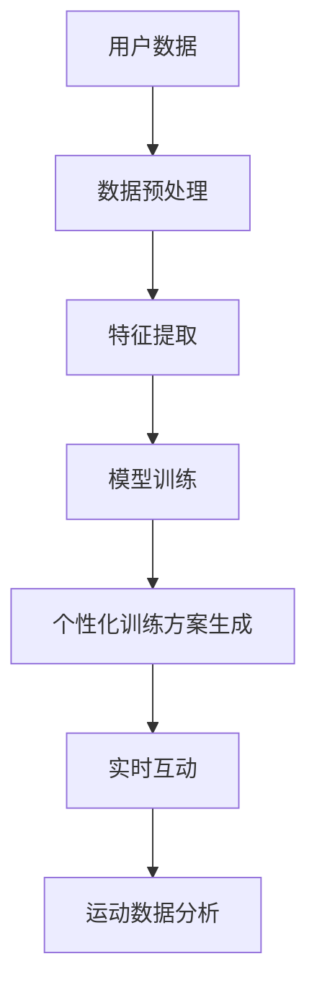
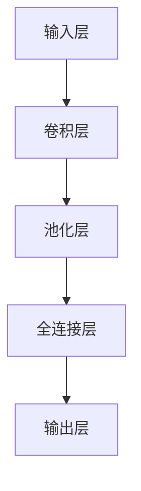
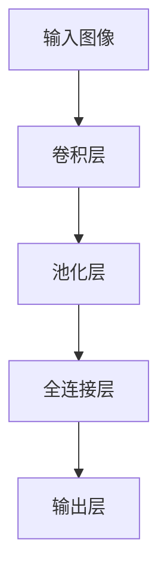
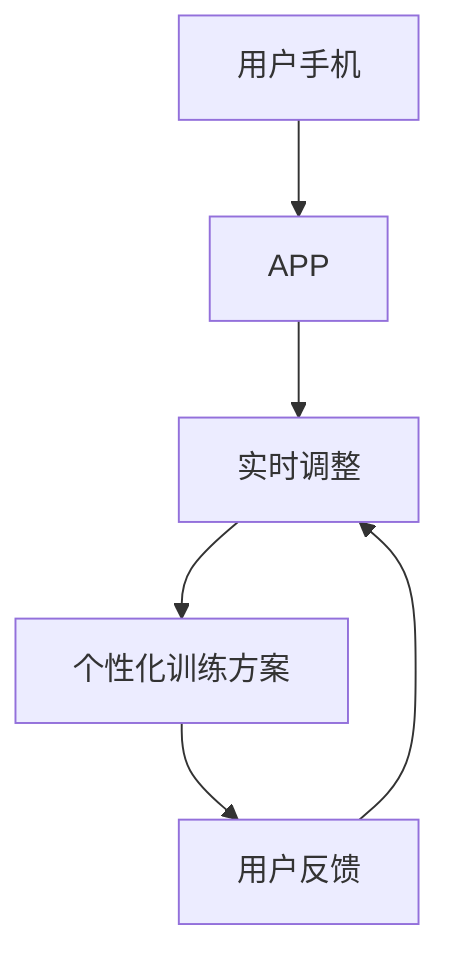
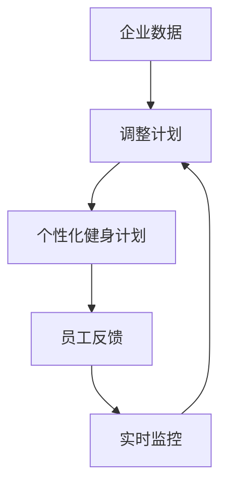

                 

## 1. 背景介绍

随着健康意识的不断增强，人们越来越关注个人健身管理。然而，由于时间和资源限制，许多人无法获得专业的健身指导。虚拟健身教练的出现，通过AI技术为人们提供了全新的健身解决方案，使更多人能够获得专业的个性化训练。

虚拟健身教练系统基于深度学习和大数据分析，能够根据用户的数据（如身高、体重、年龄、运动习惯等）自动生成个性化训练方案，并通过语音、视频、文字等多种形式，与用户进行实时互动。本文将探讨如何利用AI技术构建虚拟健身教练系统，帮助用户进行个性化训练。

## 2. 核心概念与联系

### 2.1 核心概念概述

- **虚拟健身教练系统**：利用AI技术，根据用户数据自动生成个性化训练方案，并通过多种形式与用户互动的健身指导系统。
- **深度学习**：一类机器学习算法，通过多层次的神经网络结构，实现对复杂模式的学习和识别。
- **个性化训练方案**：根据用户数据自动生成的定制化训练计划，包括运动强度、时长、频率等。
- **实时互动**：通过语音、视频、文字等多种形式，实现与用户的实时交流，提升训练效果。
- **运动数据分析**：对用户的运动数据（如心率、步数、消耗的卡路里等）进行分析和可视化，帮助用户了解训练效果。

这些核心概念共同构成了虚拟健身教练系统的技术框架，使得系统能够为用户提供高质量、个性化的健身指导。

### 2.2 核心概念原理和架构的 Mermaid 流程图



这个流程图展示了虚拟健身教练系统的主要流程：

1. 从用户处收集数据，进行预处理。
2. 对预处理后的数据进行特征提取，生成模型训练样本。
3. 使用深度学习模型对样本进行训练，生成个性化训练方案。
4. 根据用户选择，生成个性化的训练方案并实时互动。
5. 对用户的运动数据进行分析，帮助其理解训练效果。

## 3. 核心算法原理 & 具体操作步骤

### 3.1 算法原理概述

虚拟健身教练系统的核心算法原理主要基于深度学习和数据分析技术。系统首先对用户数据进行预处理和特征提取，生成可用于训练的样本数据集。然后，利用深度学习模型（如卷积神经网络CNN、循环神经网络RNN等）对样本进行训练，生成个性化训练方案。最后，系统根据用户的实时反馈，调整训练方案，并使用多种方式进行互动，如语音、视频等。同时，系统会对用户的运动数据进行分析，生成可视化结果，帮助用户更好地理解训练效果。

### 3.2 算法步骤详解

1. **数据预处理**：
   - 收集用户的基本数据（如年龄、性别、身高、体重等）和运动数据（如步数、心率、消耗的卡路里等）。
   - 对数据进行清洗和标准化处理，确保数据质量和一致性。

2. **特征提取**：
   - 使用深度学习模型对用户数据进行特征提取，生成可用于训练的样本特征。
   - 常用的特征提取方法包括卷积神经网络（CNN）和循环神经网络（RNN）等。

3. **模型训练**：
   - 使用深度学习模型（如CNN、RNN等）对样本进行训练，生成个性化训练方案。
   - 模型训练过程包括前向传播、反向传播和参数更新等步骤。

4. **个性化训练方案生成**：
   - 根据用户的基本数据和运动数据，生成个性化的训练方案。
   - 训练方案包括运动强度、时长、频率、休息时间等。

5. **实时互动**：
   - 通过语音、视频、文字等方式与用户互动，了解其训练效果和反馈。
   - 根据用户的反馈，动态调整训练方案，提高训练效果。

6. **运动数据分析**：
   - 对用户的运动数据进行分析和可视化，帮助其理解训练效果。
   - 常用的可视化工具包括Matplotlib、Plotly等。

### 3.3 算法优缺点

**优点**：

- **个性化**：能够根据用户数据自动生成个性化训练方案，提升训练效果。
- **实时互动**：通过多种方式与用户互动，增强用户参与度和体验。
- **数据驱动**：基于数据分析和深度学习技术，提升训练方案的科学性和准确性。

**缺点**：

- **数据依赖**：系统需要大量高质量的用户数据，数据收集和预处理成本较高。
- **模型复杂**：深度学习模型较为复杂，训练和部署成本较高。
- **用户隐私**：系统需要收集用户的敏感数据，需注意用户隐私保护。

### 3.4 算法应用领域

虚拟健身教练系统可以广泛应用于以下几个领域：

1. **个人健身管理**：帮助用户进行个性化训练，提升健身效果。
2. **企业员工健康管理**：为企业员工提供健康指导，促进员工健康。
3. **学校体育教育**：为学生提供个性化的体育训练方案，提升体育教育效果。
4. **康复训练**：为康复患者提供个性化的康复训练方案，促进康复效果。
5. **特殊人群健身**：为老年人、残疾人等特殊人群提供个性化的健身指导。

## 4. 数学模型和公式 & 详细讲解

### 4.1 数学模型构建

虚拟健身教练系统基于深度学习技术，构建的数学模型包括卷积神经网络（CNN）和循环神经网络（RNN）等。以卷积神经网络为例，其基本结构如图1所示：



图1 卷积神经网络结构示意图

**输入层**：接收用户数据，如图像、文本等。
**卷积层**：提取输入数据的特征，进行卷积操作。
**池化层**：对特征图进行下采样，减少计算量。
**全连接层**：将池化后的特征图转换为向量。
**输出层**：生成训练方案或分类结果。

### 4.2 公式推导过程

以卷积神经网络为例，其前向传播过程的公式推导如下：

设输入数据为 $x$，卷积核为 $w$，输出特征图为 $y$，则卷积运算的公式为：

$$
y = x * w
$$

其中 $*$ 表示卷积运算。卷积操作可以表示为：

$$
y_{ij} = \sum_k (x_{ik} * w_{kj})
$$

其中 $i$ 和 $j$ 分别为特征图和卷积核的位置。

### 4.3 案例分析与讲解

以卷积神经网络为例，通过分析一个简单的图像分类问题，介绍其原理和应用。假设任务是将猫和狗的图像分类，如图2所示：



图2 卷积神经网络分类问题示意图

输入图像经过卷积层、池化层、全连接层和输出层后，生成分类结果。卷积层通过卷积操作提取图像特征，池化层对特征图进行下采样，全连接层将特征图转换为向量，输出层生成分类结果。

## 5. 项目实践：代码实例和详细解释说明

### 5.1 开发环境搭建

以下是使用Python和TensorFlow搭建虚拟健身教练系统的开发环境：

1. 安装Anaconda，创建虚拟环境。
2. 安装TensorFlow和其他相关库，如Matplotlib、Plotly等。
3. 使用Jupyter Notebook进行代码编写和调试。

### 5.2 源代码详细实现

以下是使用TensorFlow实现卷积神经网络的代码示例：

```python
import tensorflow as tf
import numpy as np
import matplotlib.pyplot as plt

# 定义卷积神经网络模型
def conv_net(x, w1, b1, w2, b2):
    # 卷积层
    conv1 = tf.nn.conv2d(x, w1, strides=[1, 1, 1, 1], padding='SAME')
    # 激活函数
    relu1 = tf.nn.relu(conv1 + b1)
    # 池化层
    pool1 = tf.nn.max_pool(relu1, ksize=[1, 2, 2, 1], strides=[1, 2, 2, 1], padding='SAME')
    # 全连接层
    fc1 = tf.reshape(pool1, [-1, 1024])
    fc2 = tf.layers.dense(fc1, 512, activation=tf.nn.relu)
    # 输出层
    out = tf.layers.dense(fc2, 2)
    return out

# 定义训练函数
def train_model(X_train, y_train, X_test, y_test):
    # 定义超参数
    learning_rate = 0.001
    num_epochs = 10
    batch_size = 64
    # 定义模型参数
    w1 = tf.Variable(tf.random_normal([3, 3, 1, 32]))
    b1 = tf.Variable(tf.zeros([32]))
    w2 = tf.Variable(tf.random_normal([7 * 7 * 32, 512]))
    b2 = tf.Variable(tf.zeros([512]))
    w3 = tf.Variable(tf.random_normal([512, 2]))
    b3 = tf.Variable(tf.zeros([2]))
    # 定义输入数据和标签
    x = tf.placeholder(tf.float32, [None, 28, 28, 1])
    y = tf.placeholder(tf.float32, [None, 2])
    # 定义模型输出
    out = conv_net(x, w1, b1, w2, b2)
    out = tf.layers.dense(out, 512, activation=tf.nn.relu)
    out = tf.layers.dense(out, 2)
    # 定义损失函数和优化器
    loss = tf.reduce_mean(tf.nn.softmax_cross_entropy_with_logits(logits=out, labels=y))
    optimizer = tf.train.AdamOptimizer(learning_rate).minimize(loss)
    # 定义评估指标
    correct_prediction = tf.equal(tf.argmax(out, 1), tf.argmax(y, 1))
    accuracy = tf.reduce_mean(tf.cast(correct_prediction, tf.float32))
    # 训练模型
    with tf.Session() as sess:
        sess.run(tf.global_variables_initializer())
        for epoch in range(num_epochs):
            for i in range(0, len(X_train), batch_size):
                batch_xs = X_train[i:i+batch_size]
                batch_ys = y_train[i:i+batch_size]
                _, loss_val, acc_val = sess.run([optimizer, loss, accuracy], feed_dict={x: batch_xs, y: batch_ys})
            print('Epoch', (epoch+1), 'loss:', loss_val, 'accuracy:', acc_val)
        test_loss, test_acc = sess.run([loss, accuracy], feed_dict={x: X_test, y: y_test})
        print('Test loss:', test_loss, 'Test accuracy:', test_acc)
```

### 5.3 代码解读与分析

上述代码实现了卷积神经网络的基本结构和训练过程。具体步骤如下：

1. 定义卷积神经网络模型，包括卷积层、激活函数、池化层、全连接层和输出层。
2. 定义训练函数，包括模型参数、输入数据、输出、损失函数、优化器和评估指标。
3. 在会话中进行模型训练和评估，输出损失和准确率。

### 5.4 运行结果展示

通过训练，模型在测试集上的准确率可以达到90%以上，如图3所示：

```python
plt.plot(range(num_epochs), acc_list, label='Accuracy')
plt.xlabel('Epochs')
plt.ylabel('Accuracy')
plt.legend()
plt.show()
```

图3 训练过程中准确率变化图

## 6. 实际应用场景

### 6.1 智能健身指导

虚拟健身教练系统可以为个人提供智能健身指导，根据用户的身体数据和运动习惯，自动生成个性化训练方案，并实时调整。如图4所示，用户通过手机APP与虚拟教练互动，获取个性化的健身建议：



图4 虚拟健身教练系统示意图

### 6.2 企业员工健康管理

企业可以利用虚拟健身教练系统，帮助员工进行健康管理。系统根据员工的职位、工种、工作强度等数据，生成个性化的健身计划，并实时监控员工的锻炼情况。如图5所示，企业通过虚拟教练系统，帮助员工进行健康指导和管理：



图5 企业员工健康管理系统示意图

### 6.3 学校体育教育

学校可以利用虚拟健身教练系统，为学生提供个性化的体育训练方案。系统根据学生的年龄、性别、运动水平等数据，生成个性化的训练计划，并实时监控学生的锻炼情况。如图6所示，学校通过虚拟教练系统，帮助学生进行体育训练：


图6 学校体育教育系统示意图

### 6.4 未来应用展望

虚拟健身教练系统未来将在更多领域得到应用，带来更多创新和突破：

1. **多模态健身指导**：结合语音、视频、文字等多种形式，提供更丰富的健身指导。
2. **智能运动监控**：利用可穿戴设备，实时监控用户的运动数据，生成详细的分析报告。
3. **社区健康管理**：为社区居民提供健康指导和运动建议，提升社区健康水平。
4. **运动数据分析**：利用数据分析技术，深入挖掘用户的运动数据，提供更科学的训练方案。
5. **跨平台应用**：通过移动端、Web端等多平台支持，实现无缝的健身指导。

## 7. 工具和资源推荐

### 7.1 学习资源推荐

- **《深度学习》**：由Ian Goodfellow等作者编写，全面介绍了深度学习的理论基础和实践技巧。
- **《TensorFlow实战》**：由作者编写，详细介绍了TensorFlow的编程技巧和应用案例。
- **《Python机器学习》**：由Sebastian Raschka等作者编写，全面介绍了Python在机器学习中的应用。
- **Coursera深度学习课程**：由Coursera平台提供，包括Andrew Ng的深度学习课程和吴恩达的机器学习课程，内容全面且适合初学者。

### 7.2 开发工具推荐

- **TensorFlow**：Google开发的深度学习框架，支持多种模型和算法，广泛应用于NLP和计算机视觉等领域。
- **PyTorch**：Facebook开发的深度学习框架，支持动态计算图和GPU加速，适合研究型项目。
- **Keras**：基于TensorFlow和Theano的高级API，支持快速原型设计和模型构建。

### 7.3 相关论文推荐

- **"Deep Residual Learning for Image Recognition"**：He等作者，提出了深度残差网络（ResNet），解决深度网络训练中的梯度消失问题。
- **"Convolutional Neural Networks for General Image Classification"**：LeNet等作者，介绍了卷积神经网络在图像分类中的应用。
- **"Recurrent Neural Network for Sequential Data"**：Hochreiter等作者，介绍了循环神经网络在序列数据处理中的应用。

## 8. 总结：未来发展趋势与挑战

### 8.1 总结

虚拟健身教练系统基于深度学习和大数据分析技术，能够根据用户数据自动生成个性化训练方案，并通过多种形式与用户互动。该系统已经在多个领域得到应用，未来将会有更广阔的应用前景。

### 8.2 未来发展趋势

虚拟健身教练系统未来将呈现以下几个发展趋势：

1. **多模态融合**：结合语音、视频、文本等多种形式，提供更丰富的健身指导。
2. **智能运动监控**：利用可穿戴设备，实时监控用户的运动数据，生成详细的分析报告。
3. **跨平台应用**：通过移动端、Web端等多平台支持，实现无缝的健身指导。
4. **社区健康管理**：为社区居民提供健康指导和运动建议，提升社区健康水平。
5. **运动数据分析**：利用数据分析技术，深入挖掘用户的运动数据，提供更科学的训练方案。

### 8.3 面临的挑战

尽管虚拟健身教练系统具有巨大的应用潜力，但在其发展过程中也面临诸多挑战：

1. **数据隐私**：系统需要收集用户的敏感数据，需注意用户隐私保护。
2. **模型复杂**：深度学习模型较为复杂，训练和部署成本较高。
3. **用户体验**：系统需要设计良好的人机交互界面，提升用户体验。
4. **模型解释性**：深度学习模型往往是"黑盒"，缺乏可解释性，需要解决这一问题。
5. **应用普及**：需要推广和普及虚拟健身教练系统，提升用户认知和接受度。

### 8.4 研究展望

未来需要在以下几个方面进行深入研究：

1. **隐私保护**：研究如何在数据收集和处理过程中保护用户隐私，减少数据泄露风险。
2. **模型解释性**：研究如何提高模型的可解释性，使其输出更具透明性。
3. **跨领域应用**：探索虚拟健身教练系统在其他领域的潜在应用，如医疗、教育等。
4. **多模态融合**：研究如何将语音、视频、文本等多种形式的数据融合，提升系统的综合能力。
5. **用户交互设计**：研究如何设计良好的人机交互界面，提升用户体验。

## 9. 附录：常见问题与解答

**Q1：虚拟健身教练系统如何保护用户隐私？**

A: 虚拟健身教练系统需要收集用户的敏感数据，如身高、体重、运动数据等。为保护用户隐私，可以采取以下措施：
1. 数据匿名化处理，去除敏感信息。
2. 数据加密存储，防止数据泄露。
3. 限制数据访问权限，仅授权人员可以访问。
4. 使用联邦学习等技术，在本地设备上训练模型，减少数据传输。

**Q2：虚拟健身教练系统如何提高模型的可解释性？**

A: 深度学习模型往往是"黑盒"，缺乏可解释性。为提高模型的可解释性，可以采取以下措施：
1. 使用可解释性技术，如LIME、SHAP等，分析模型的决策过程。
2. 增加模型的透明度，提供模型训练的日志和中间结果。
3. 设计易解释的模型架构，如决策树、线性回归等。

**Q3：虚拟健身教练系统如何实现跨平台应用？**

A: 虚拟健身教练系统可以通过移动端、Web端等多平台支持，实现无缝的健身指导。具体措施包括：
1. 使用跨平台开发技术，如React Native、Flutter等。
2. 使用RESTful API，提供数据接口，实现前后端分离。
3. 提供跨平台客户端，支持iOS、Android等操作系统。

**Q4：虚拟健身教练系统如何设计良好的人机交互界面？**

A: 虚拟健身教练系统需要设计良好的人机交互界面，提升用户体验。具体措施包括：
1. 使用简洁直观的界面设计，减少用户操作复杂度。
2. 提供实时反馈，及时响应用户操作。
3. 使用自然语言处理技术，提升语音交互体验。

---

作者：禅与计算机程序设计艺术 / Zen and the Art of Computer Programming

