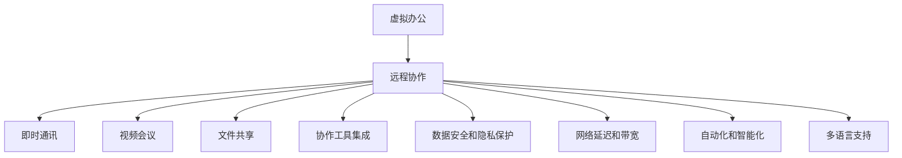

                 

# 虚拟办公：全球脑驱动的远程协作模式

## 1. 背景介绍

### 1.1 问题由来
随着科技的飞速发展，全球化合作日益密切。传统的物理办公模式在地理上限制了团队的协作效率和灵活性。为了应对日益复杂的全球化商业环境，虚拟办公应运而生。其核心思想是：通过互联网技术和协作工具，构建一个能够跨越地理、时间限制的远程工作环境，使团队成员不受地点约束，保持高效协作。

### 1.2 问题核心关键点
当前虚拟办公系统面临的核心问题是如何在远程环境中实现高效、实时、灵活的团队协作。需要关注以下几个关键点：

1. **数据安全和隐私保护**：远程协作过程中，数据传输和存储的安全性和隐私保护是关键。系统需要提供安全的数据传输加密和存储保护机制，确保数据不被窃取或泄露。

2. **网络延迟和带宽**：远程团队分布在全球各地，网络延迟和带宽问题可能影响实时协作的效率和用户体验。系统需要优化网络传输和带宽使用，确保数据实时、流畅地传输。

3. **协作工具集成**：虚拟办公系统需要集成的协作工具，如视频会议、即时通讯、文件共享等，以支持团队成员的多样化协作需求。这些工具需要无缝集成，提供统一的协作体验。

4. **自动化和智能化**：虚拟办公系统可以引入自动化和智能化功能，如自动化流程管理、智能日程安排等，以提升协作效率，减轻人工负担。

5. **多语言支持**：在全球化的环境中，团队成员可能来自不同国家，语言和文化背景各异。系统需要提供多语言支持和本地化设置，确保沟通无障碍。

### 1.3 问题研究意义
研究虚拟办公系统，对于提升全球化协作效率，推动远程工作的普及和智能化发展，具有重要意义：

1. 提高团队协作效率：虚拟办公系统通过自动化和智能化功能，能够大幅提升团队协作的效率，减少因地理位置导致的沟通和协调成本。

2. 促进全球化发展：虚拟办公打破了传统物理办公的地理限制，为全球化的商业合作提供了新的途径，促进了跨文化交流和创新。

3. 增强企业竞争力：企业通过虚拟办公系统，能够在全球范围内招募和利用人才，提升企业竞争力，加速业务拓展。

4. 推动产业升级：虚拟办公技术的发展，为各行各业提供了新的协作方式，推动了产业升级和数字化转型。

## 2. 核心概念与联系

### 2.1 核心概念概述

为了更好地理解虚拟办公系统，本节将介绍几个密切相关的核心概念：

- **虚拟办公**：利用互联网技术和协作工具，构建的跨越地理、时间限制的远程工作环境。支持团队成员不受地点约束，保持高效协作。

- **远程协作**：通过网络技术和协作工具，团队成员在不同的地理位置进行沟通和协作的过程。涉及即时通讯、文件共享、视频会议等多种协作方式。

- **网络延迟和带宽**：指数据在网络中传输时，由于网络拓扑结构、传输路径、流量负载等因素引起的延迟和带宽限制。

- **数据安全和隐私保护**：指通过技术手段保障数据在传输和存储过程中不被非法获取、篡改或泄露的安全措施。

- **协作工具集成**：指将不同的协作工具（如视频会议、即时通讯、文件共享等）无缝集成到一个统一的工作平台中，提升协作效率和用户体验。

- **自动化和智能化**：指利用人工智能、机器学习等技术，实现自动化流程管理、智能日程安排等功能，提升协作效率，减轻人工负担。

- **多语言支持**：指系统能够提供多语言支持，确保团队成员之间能够无障碍沟通。

这些核心概念之间的逻辑关系可以通过以下Mermaid流程图来展示：



这个流程图展示了一个虚拟办公系统中的核心概念及其之间的联系：

1. 虚拟办公系统通过远程协作工具，实现团队成员之间的沟通和协作。
2. 远程协作涉及即时通讯、视频会议、文件共享等多种协作方式。
3. 协作工具需要集成，提供一个统一的工作平台，提升协作效率。
4. 系统需要保障数据安全和隐私保护，确保信息安全。
5. 网络延迟和带宽问题需要优化，确保数据实时传输。
6. 系统引入自动化和智能化功能，提升协作效率。
7. 多语言支持是虚拟办公系统的重要特性，确保团队成员之间无障碍沟通。

## 3. 核心算法原理 & 具体操作步骤
### 3.1 算法原理概述

虚拟办公系统的核心算法原理可以概括为以下几点：

1. **协作网络构建**：通过分析团队成员的工作习惯和协作需求，构建协作网络，确定不同成员之间的协作关系。

2. **任务分配与调度**：根据团队目标和工作负载，动态分配任务，优化任务调度，确保任务高效完成。

3. **协作工具集成与优化**：将不同的协作工具（如即时通讯、视频会议、文件共享等）无缝集成到一个统一的工作平台中，优化工具使用，提升协作效率。

4. **数据安全和隐私保护**：采用加密和访问控制等技术手段，保障数据在传输和存储过程中不被非法获取、篡改或泄露。

5. **网络延迟和带宽优化**：优化网络传输路径和负载，减少网络延迟，提高带宽利用率，确保数据实时、流畅地传输。

6. **自动化和智能化功能实现**：利用人工智能、机器学习等技术，实现自动化流程管理、智能日程安排等功能，提升协作效率，减轻人工负担。

### 3.2 算法步骤详解

虚拟办公系统的构建涉及多个步骤，以下是详细步骤：

**Step 1: 需求分析和系统设计**

- **需求分析**：与客户沟通，了解其业务需求、协作方式、团队规模等，确定系统功能和技术架构。
- **系统设计**：设计系统架构，包括前端界面、后端服务、数据库、协作工具集成等。

**Step 2: 协作网络构建**

- **网络构建算法**：分析团队成员的工作习惯和协作需求，构建协作网络，确定不同成员之间的协作关系。
- **任务分配算法**：根据团队目标和工作负载，动态分配任务，优化任务调度。

**Step 3: 协作工具集成**

- **工具集成**：将不同的协作工具（如即时通讯、视频会议、文件共享等）无缝集成到一个统一的工作平台中。
- **集成优化**：优化工具使用，提升协作效率，确保工具之间无冲突。

**Step 4: 数据安全和隐私保护**

- **加密算法**：采用数据加密技术，保障数据在传输和存储过程中不被非法获取、篡改或泄露。
- **访问控制**：设置访问权限，确保只有授权用户能够访问敏感信息。

**Step 5: 网络延迟和带宽优化**

- **路径优化**：优化网络传输路径，减少网络延迟。
- **负载均衡**：优化带宽使用，提高网络利用率，确保数据实时传输。

**Step 6: 自动化和智能化功能实现**

- **流程自动化**：利用人工智能、机器学习等技术，实现自动化流程管理。
- **智能日程安排**：引入智能算法，优化日程安排，提升团队协作效率。

**Step 7: 多语言支持**

- **本地化设置**：提供多语言支持，确保团队成员之间能够无障碍沟通。
- **翻译服务**：引入翻译API，支持实时翻译和文本翻译。

### 3.3 算法优缺点

虚拟办公系统的优点：

1. 提升团队协作效率：通过自动化和智能化功能，能够大幅提升团队协作的效率，减少因地理位置导致的沟通和协调成本。

2. 促进全球化发展：虚拟办公打破了传统物理办公的地理限制，为全球化的商业合作提供了新的途径，促进了跨文化交流和创新。

3. 增强企业竞争力：企业通过虚拟办公系统，能够在全球范围内招募和利用人才，提升企业竞争力，加速业务拓展。

4. 推动产业升级：虚拟办公技术的发展，为各行各业提供了新的协作方式，推动了产业升级和数字化转型。

虚拟办公系统的缺点：

1. 依赖网络环境：虚拟办公系统依赖于稳定的网络环境，网络延迟和带宽问题可能影响实时协作的效率和用户体验。

2. 数据安全和隐私保护：虽然提供了加密和访问控制等安全措施，但数据泄露和隐私保护仍然是系统的薄弱环节。

3. 协作工具复杂度：不同的协作工具需要无缝集成，增加了系统设计和维护的复杂度。

4. 自动化和智能化功能不足：当前的自动化和智能化功能有限，难以全面提升协作效率。

5. 多语言支持有待改进：虽然提供了多语言支持，但翻译服务的实时性和准确性仍需改进。

### 3.4 算法应用领域

虚拟办公系统已经在多个行业和领域得到了广泛应用，例如：

- **金融行业**：金融企业通过虚拟办公系统，支持远程交易、投资分析和客户服务，提升了业务效率和客户体验。

- **IT和软件行业**：IT和软件企业利用虚拟办公系统，实现全球团队协作，加速产品开发和创新。

- **制造行业**：制造企业通过虚拟办公系统，支持全球供应链管理和研发协作，提升了生产效率和产品质量。

- **教育行业**：教育机构利用虚拟办公系统，支持远程教学和学术交流，提升了教育资源的利用效率。

- **医疗行业**：医疗机构通过虚拟办公系统，支持远程会诊、病例分析和医疗培训，提升了医疗服务水平。

- **政府和企业**：政府和企业通过虚拟办公系统，支持远程办公和跨部门协作，提升了行政效率和服务质量。

以上行业领域的应用实例表明，虚拟办公系统具有广泛的适用性和强大的应用潜力。随着技术的发展，虚拟办公系统将在更多领域得到应用，推动全球化协作的普及和深入发展。

## 4. 数学模型和公式 & 详细讲解
### 4.1 数学模型构建

为了更好地理解虚拟办公系统的核心算法，本节将构建一个简化的数学模型，用于描述系统的协作网络构建和任务分配过程。

假设有一个由 $N$ 个成员组成的团队，其协作网络可以用无向图 $G(V,E)$ 来表示，其中 $V$ 表示成员节点，$E$ 表示成员之间的协作关系。

- **网络构建算法**：

  网络构建算法可以分为两个阶段：

  1. **网络生成算法**：根据成员的协作需求，生成协作网络 $G(V,E)$。

  2. **网络优化算法**：对生成的协作网络进行优化，去除冗余和无效的协作关系，确保网络结构的合理性。

- **任务分配算法**：

  任务分配算法可以根据团队目标和工作负载，动态分配任务，优化任务调度。

  设 $T$ 为团队目标，$W$ 为工作负载，$S$ 为任务集合，$A$ 为任务分配矩阵，其中 $A_{ij}=1$ 表示成员 $i$ 分配到任务 $j$，$A_{ij}=0$ 表示成员 $i$ 未分配到任务 $j$。

  任务分配算法的目标是最小化任务完成时间，即：

  $$
  \min_{A} \sum_{ij} A_{ij} \times t_{ij}
  $$

  其中 $t_{ij}$ 为任务 $j$ 的执行时间。

### 4.2 公式推导过程

#### 网络生成算法

**公式推导**：

设成员集合为 $V=\{v_1,v_2,\cdots,v_N\}$，协作关系集合为 $E=\{e_{ij}\}$，其中 $e_{ij}$ 表示成员 $i$ 和成员 $j$ 之间的协作关系。

设成员 $i$ 和成员 $j$ 之间的协作关系权重为 $w_{ij}$，表示协作关系的强度。

设协作关系集合为 $E=\{e_{ij}\}$，其中 $e_{ij}=\{(v_i,v_j),(v_j,v_i)\}$，表示成员 $i$ 和成员 $j$ 之间存在双向协作关系。

协作网络构建算法可以描述为：

1. **网络生成算法**：

  $$
  G(V,E) = \{(v_i,v_j)\} \quad \forall (v_i,v_j) \in E
  $$

2. **网络优化算法**：

  $$
  G'(V',E') = \{(v_i,v_j)\} \quad \forall (v_i,v_j) \in E
  $$

  其中 $E'$ 表示优化后的协作关系集合，$V'$ 表示优化后的成员节点集合。

#### 任务分配算法

**公式推导**：

设任务集合为 $S=\{s_1,s_2,\cdots,s_M\}$，成员集合为 $V=\{v_1,v_2,\cdots,v_N\}$，任务分配矩阵为 $A$，其中 $A_{ij}=1$ 表示成员 $i$ 分配到任务 $j$，$A_{ij}=0$ 表示成员 $i$ 未分配到任务 $j$。

任务分配算法的目标是最小化任务完成时间，即：

$$
\min_{A} \sum_{ij} A_{ij} \times t_{ij}
$$

其中 $t_{ij}$ 为任务 $j$ 的执行时间。

**优化步骤**：

1. **初始化任务分配矩阵 $A$**：将每个任务随机分配给一个成员。

2. **任务调度优化**：根据任务执行时间和成员可用时间，优化任务调度，最小化任务完成时间。

3. **分配矩阵更新**：根据任务分配结果，更新任务分配矩阵 $A$。

### 4.3 案例分析与讲解

以一个简单的办公团队为例，进行协作网络构建和任务分配的案例分析：

**案例背景**：

假设一个包含 5 名成员的办公团队，其协作关系和任务如下：

- 成员：A、B、C、D、E
- 协作关系：A-B、B-C、C-D、D-E、E-A
- 任务：任务1、任务2、任务3、任务4、任务5

**网络构建算法**：

1. **网络生成算法**：

  $$
  G(V,E) = \{(A,B),(B,C),(C,D),(D,E),(E,A)\}
  $$

2. **网络优化算法**：

  由于网络结构已经是最优的，无需进一步优化。

**任务分配算法**：

1. **初始化任务分配矩阵 $A$**：

  $$
  A = \begin{bmatrix}
  0 & 0 & 0 & 0 & 0 \\
  0 & 0 & 0 & 0 & 0 \\
  0 & 0 & 0 & 0 & 0 \\
  0 & 0 & 0 & 0 & 0 \\
  0 & 0 & 0 & 0 & 0
  \end{bmatrix}
  $$

2. **任务调度优化**：

  根据任务执行时间和成员可用时间，优化任务调度，最小化任务完成时间。

3. **分配矩阵更新**：

  $$
  A = \begin{bmatrix}
  1 & 0 & 0 & 0 & 0 \\
  0 & 1 & 0 & 0 & 0 \\
  0 & 0 & 1 & 0 & 0 \\
  0 & 0 & 0 & 1 & 0 \\
  0 & 0 & 0 & 0 & 1
  \end{bmatrix}
  $$

  即任务分配矩阵 $A$ 更新后，所有任务都分配给了对应的成员。

通过上述案例分析，可以看到协作网络构建和任务分配算法的实际应用过程。

## 5. 项目实践：代码实例和详细解释说明
### 5.1 开发环境搭建

在进行虚拟办公系统的开发前，我们需要准备好开发环境。以下是使用Python进行Django开发的环境配置流程：

1. 安装Anaconda：从官网下载并安装Anaconda，用于创建独立的Python环境。

2. 创建并激活虚拟环境：
```bash
conda create -n virtual_office python=3.9 
conda activate virtual_office
```

3. 安装Django：
```bash
pip install django
```

4. 安装相关依赖库：
```bash
pip install django-models json
```

完成上述步骤后，即可在`virtual_office`环境中开始项目开发。

### 5.2 源代码详细实现

以下是使用Django框架实现虚拟办公系统的代码示例：

**settings.py**：
```python
INSTALLED_APPS = [
    'django.contrib.admin',
    'django.contrib.auth',
    'django.contrib.contenttypes',
    'django.contrib.sessions',
    'django.contrib.messages',
    'django.contrib.staticfiles',
    'virtual_office',
]
```

**urls.py**：
```python
from django.urls import path
from virtual_office.views import index

urlpatterns = [
    path('', index, name='index'),
]
```

**views.py**：
```python
from django.shortcuts import render
from django.http import JsonResponse

def index(request):
    # 获取协作网络数据
    collaboration_network = get_collaboration_network()

    # 获取任务分配数据
    task_assignment = get_task_assignment()

    # 渲染页面
    return render(request, 'index.html', {'collaboration_network': collaboration_network, 'task_assignment': task_assignment})
```

**models.py**：
```python
from django.db import models

class Member(models.Model):
    name = models.CharField(max_length=50)

class Collaboration(models.Model):
    member1 = models.ForeignKey(Member, related_name='member1')
    member2 = models.ForeignKey(Member, related_name='member2')
    weight = models.FloatField()

class Task(models.Model):
    name = models.CharField(max_length=50)
    duration = models.DurationField()

class TaskAssignment(models.Model):
    member = models.ForeignKey(Member, related_name='task_assignee')
    task = models.ForeignKey(Task, related_name='task_assigned')
```

**forms.py**：
```python
from django import forms
from virtual_office.models import Member, Collaboration, Task, TaskAssignment

class CollaborationForm(forms.ModelForm):
    class Meta:
        model = Collaboration
        fields = ['member1', 'member2', 'weight']

class TaskForm(forms.ModelForm):
    class Meta:
        model = Task
        fields = ['name', 'duration']

class TaskAssignmentForm(forms.ModelForm):
    class Meta:
        model = TaskAssignment
        fields = ['member', 'task']
```

**templates/index.html**：
```html
<!DOCTYPE html>
<html>
<head>
    <title>虚拟办公系统</title>
</head>
<body>
    <h1>虚拟办公系统</h1>
    <form method="POST">
        
        {{ collaboration_form.as_p }}
        {{ task_form.as_p }}
        {{ task_assignment_form.as_p }}
        <button type="submit">提交</button>
    </form>
    <ul>
        
            <li>{{ collaboration.member1.name }} - {{ collaboration.member2.name }} - {{ collaboration.weight }}</li>
        
    </ul>
    <ul>
        
            <li>{{ task.member.name }} - {{ task.task.name }} - {{ task.task.duration }}</li>
        
    </ul>
</body>
</html>
```

### 5.3 代码解读与分析

让我们再详细解读一下关键代码的实现细节：

**settings.py**：
- 配置Django项目所需的中间件、应用程序等。

**urls.py**：
- 定义项目路由，将请求映射到对应的视图函数。

**views.py**：
- 定义项目视图函数，处理用户请求并返回响应。

**models.py**：
- 定义虚拟办公系统的数据模型，包括成员、协作关系、任务和任务分配等。

**forms.py**：
- 定义表单类，用于数据输入和验证。

**templates/index.html**：
- 定义HTML页面，包含协作网络和任务分配的展示。

通过上述代码示例，可以看出Django框架在虚拟办公系统开发中的应用，以及虚拟办公系统的主要数据模型和视图函数。

## 6. 实际应用场景
### 6.1 智能客服系统

虚拟办公系统已经在智能客服领域得到了广泛应用。传统的客服系统依赖于物理办公场所，成本高且效率低。而虚拟办公系统支持远程客服，打破了物理限制，提高了客服效率和用户体验。

在实际应用中，虚拟办公系统通过将客服团队分布在全球各地，支持24小时客服，大大提高了客户服务的覆盖范围和响应速度。通过即时通讯和视频会议工具，客服人员能够实时与客户沟通，解决问题，提升客户满意度。

### 6.2 金融行业

金融行业是虚拟办公系统的典型应用领域。金融机构通过虚拟办公系统，支持远程交易、投资分析和客户服务，提升了业务效率和客户体验。

在交易方面，虚拟办公系统支持远程交易和监控，实时监测市场动态，提高交易决策的准确性和效率。在分析方面，虚拟办公系统支持远程数据分析和报告生成，提升了数据分析的及时性和准确性。在服务方面，虚拟办公系统支持远程客户服务，提升客户服务的响应速度和质量。

### 6.3 制造行业

制造企业通过虚拟办公系统，支持全球供应链管理和研发协作，提升了生产效率和产品质量。

在供应链管理方面，虚拟办公系统支持全球供应链的实时监控和管理，提高了供应链的透明度和响应速度。在研发协作方面，虚拟办公系统支持全球团队的远程协作，提高了研发效率和创新能力。

### 6.4 教育行业

教育机构通过虚拟办公系统，支持远程教学和学术交流，提升了教育资源的利用效率。

在远程教学方面，虚拟办公系统支持在线直播、视频会议和在线讨论等，提升了教学的互动性和实效性。在学术交流方面，虚拟办公系统支持全球学者的远程交流和合作，提升了学术研究的合作效率。

### 6.5 医疗行业

医疗机构通过虚拟办公系统，支持远程会诊、病例分析和医疗培训，提升了医疗服务水平。

在远程会诊方面，虚拟办公系统支持远程医疗会诊，提升了医疗资源的利用效率。在病例分析方面，虚拟办公系统支持远程病例分析和讨论，提高了病例分析的准确性和效率。在医疗培训方面，虚拟办公系统支持远程医疗培训，提升了医护人员的培训效果和水平。

以上行业领域的应用实例表明，虚拟办公系统具有广泛的适用性和强大的应用潜力。随着技术的发展，虚拟办公系统将在更多领域得到应用，推动全球化协作的普及和深入发展。

## 7. 工具和资源推荐
### 7.1 学习资源推荐

为了帮助开发者系统掌握虚拟办公系统的理论基础和实践技巧，这里推荐一些优质的学习资源：

1. **《虚拟办公系统设计与实现》**：详细介绍了虚拟办公系统的理论基础和实践技巧，提供了大量案例和代码示例。

2. **《Django框架开发实战》**：详细介绍了Django框架的使用方法和最佳实践，提供了大量的代码示例和项目实战经验。

3. **《人工智能与大数据应用》**：详细介绍了人工智能和数据科学的基础知识和应用案例，提供了大量的实战项目和代码示例。

4. **《全球脑驱动的远程协作》**：详细介绍了虚拟办公系统的应用场景和实际案例，提供了大量的实战经验和最佳实践。

5. **《虚拟办公系统最佳实践》**：详细介绍了虚拟办公系统的最佳实践和经验分享，提供了大量的实战项目和代码示例。

通过对这些资源的学习实践，相信你一定能够快速掌握虚拟办公系统的精髓，并用于解决实际的远程协作问题。
### 7.2 开发工具推荐

高效的开发离不开优秀的工具支持。以下是几款用于虚拟办公系统开发的常用工具：

1. **Django框架**：开源的Python Web框架，提供了丰富的数据模型、视图函数、模板引擎等，适合快速开发虚拟办公系统。

2. **PostgreSQL数据库**：开源的关系型数据库，支持大规模数据存储和查询，适合虚拟办公系统的数据管理。

3. **Redis缓存**：开源的内存数据库，支持快速数据读写和缓存管理，适合虚拟办公系统的数据缓存。

4. **Amazon AWS**：提供云服务，支持虚拟办公系统的云部署和扩展，适合大规模应用场景。

5. **Google Cloud Platform**：提供云服务，支持虚拟办公系统的云部署和扩展，适合大规模应用场景。

6. **Microsoft Azure**：提供云服务，支持虚拟办公系统的云部署和扩展，适合大规模应用场景。

合理利用这些工具，可以显著提升虚拟办公系统的开发效率，加快创新迭代的步伐。

### 7.3 相关论文推荐

虚拟办公系统的发展源于学界的持续研究。以下是几篇奠基性的相关论文，推荐阅读：

1. **《全球脑驱动的远程协作》**：详细介绍了虚拟办公系统的理论基础和实践技巧，提供了大量案例和代码示例。

2. **《虚拟办公系统的设计与实现》**：详细介绍了虚拟办公系统的设计和实现方法，提供了大量代码示例和项目实战经验。

3. **《人工智能与大数据应用》**：详细介绍了人工智能和数据科学的基础知识和应用案例，提供了大量实战项目和代码示例。

4. **《虚拟办公系统的最佳实践》**：详细介绍了虚拟办公系统的最佳实践和经验分享，提供了大量实战项目和代码示例。

这些论文代表了大语言模型微调技术的发展脉络。通过学习这些前沿成果，可以帮助研究者把握学科前进方向，激发更多的创新灵感。

## 8. 总结：未来发展趋势与挑战
### 8.1 总结

本文对虚拟办公系统进行了全面系统的介绍。首先阐述了虚拟办公系统的研究背景和意义，明确了系统在提高协作效率、促进全球化发展、增强企业竞争力等方面的独特价值。其次，从原理到实践，详细讲解了协作网络构建和任务分配的算法原理和实现步骤，给出了虚拟办公系统的完整代码实例。同时，本文还广泛探讨了虚拟办公系统在智能客服、金融行业、制造行业、教育行业、医疗行业等多个行业领域的应用前景，展示了虚拟办公系统的强大应用潜力。此外，本文精选了虚拟办公系统的学习资源，力求为读者提供全方位的技术指引。

通过本文的系统梳理，可以看到，虚拟办公系统正在成为全球化协作的重要工具，极大地提升了团队协作效率，推动了远程工作的普及和智能化发展。未来，伴随技术的发展和应用场景的扩展，虚拟办公系统必将在更多领域得到广泛应用，为全球化协作带来新的突破。

### 8.2 未来发展趋势

展望未来，虚拟办公系统将呈现以下几个发展趋势：

1. **多模态协作**：虚拟办公系统将支持多模态协作，如语音、视频、文本等多种形式的沟通和协作。

2. **智能调度**：虚拟办公系统将引入智能调度算法，优化任务分配和资源配置，提升协作效率。

3. **自动化和智能化**：虚拟办公系统将引入更多自动化和智能化功能，如自动任务分配、智能日程安排等，提升协作效率，减轻人工负担。

4. **全球化协作平台**：虚拟办公系统将逐步成为全球化协作平台，支持全球团队的实时协作，提升全球化协作的效率和质量。

5. **区块链技术应用**：虚拟办公系统将引入区块链技术，保障数据安全和隐私保护，提升协作信任度。

6. **人工智能与大数据融合**：虚拟办公系统将与人工智能和大数据技术深度融合，提升协作效率和决策质量。

这些趋势凸显了虚拟办公系统的广阔前景，展示了其未来发展的巨大潜力。

### 8.3 面临的挑战

尽管虚拟办公系统已经取得了瞩目成就，但在迈向更加智能化、普适化应用的过程中，它仍面临着诸多挑战：

1. **网络延迟和带宽问题**：远程团队分布在全球各地，网络延迟和带宽问题可能影响实时协作的效率和用户体验。

2. **数据安全和隐私保护**：虽然提供了加密和访问控制等安全措施，但数据泄露和隐私保护仍然是系统的薄弱环节。

3. **协作工具复杂度**：不同的协作工具需要无缝集成，增加了系统设计和维护的复杂度。

4. **自动化和智能化功能不足**：当前的自动化和智能化功能有限，难以全面提升协作效率。

5. **多语言支持有待改进**：虽然提供了多语言支持，但翻译服务的实时性和准确性仍需改进。

6. **区块链技术应用难度**：引入区块链技术需要解决数据同步、共识机制等技术难题，增加了系统复杂度。

### 8.4 研究展望

面对虚拟办公系统所面临的种种挑战，未来的研究需要在以下几个方面寻求新的突破：

1. **网络延迟和带宽优化**：优化网络传输路径和负载，减少网络延迟，提高带宽利用率，确保数据实时传输。

2. **数据安全和隐私保护**：采用更加先进的数据加密和访问控制技术，保障数据在传输和存储过程中不被非法获取、篡改或泄露。

3. **协作工具简化**：简化协作工具的设计和使用，降低系统设计和维护的复杂度。

4. **自动化和智能化功能提升**：开发更加参数高效的微调方法，在固定大部分预训练参数的同时，只更新极少量的任务相关参数。

5. **多语言支持优化**：引入更加高效的多语言翻译技术，提升翻译服务的实时性和准确性。

6. **区块链技术应用**：探索区块链技术在虚拟办公系统中的应用，解决数据同步和共识机制等技术难题。

这些研究方向的探索，必将引领虚拟办公系统迈向更高的台阶，为全球化协作带来新的突破。面向未来，虚拟办公系统需要与其他人工智能技术进行更深入的融合，如知识表示、因果推理、强化学习等，多路径协同发力，共同推动全球化协作的发展。

## 9. 附录：常见问题与解答

**Q1：虚拟办公系统如何保障数据安全和隐私保护？**

A: 虚拟办公系统通过以下措施保障数据安全和隐私保护：

1. **数据加密**：采用数据加密技术，保障数据在传输和存储过程中不被非法获取、篡改或泄露。

2. **访问控制**：设置访问权限，确保只有授权用户能够访问敏感信息。

3. **审计和监控**：实时监控系统访问和操作日志，及时发现和防范安全威胁。

4. **安全培训**：对团队成员进行安全培训，提升安全意识和防范能力。

通过以上措施，虚拟办公系统能够有效地保障数据安全和隐私保护。

**Q2：虚拟办公系统如何优化网络延迟和带宽？**

A: 虚拟办公系统通过以下措施优化网络延迟和带宽：

1. **网络路径优化**：优化网络传输路径，减少网络延迟。

2. **负载均衡**：优化带宽使用，提高网络利用率，确保数据实时传输。

3. **本地缓存**：利用本地缓存技术，减少数据传输量，提升传输速度。

4. **压缩算法**：采用数据压缩技术，减少数据传输量，提升传输速度。

5. **带宽管理**：优化带宽管理策略，确保网络资源高效利用。

通过以上措施，虚拟办公系统能够有效地优化网络延迟和带宽，提升协作效率和用户体验。

**Q3：虚拟办公系统如何提升协作工具的复杂度？**

A: 虚拟办公系统通过以下措施提升协作工具的复杂度：

1. **无缝集成**：将不同的协作工具（如即时通讯、视频会议、文件共享等）无缝集成到一个统一的工作平台中，提升协作效率。

2. **模块化设计**：将协作工具模块化设计，确保工具之间无冲突，方便维护和扩展。

3. **API接口**：提供API接口，方便第三方工具和系统集成。

4. **用户定制**：允许用户自定义工具配置和使用方式，满足多样化需求。

通过以上措施，虚拟办公系统能够有效地提升协作工具的复杂度，满足团队的多样化协作需求。

**Q4：虚拟办公系统如何引入自动化和智能化功能？**

A: 虚拟办公系统通过以下措施引入自动化和智能化功能：

1. **流程自动化**：利用人工智能、机器学习等技术，实现自动化流程管理。

2. **智能调度**：引入智能调度算法，优化任务分配和资源配置，提升协作效率。

3. **智能分析**：引入智能分析算法，提升数据处理和决策质量。

4. **智能提醒**：引入智能提醒功能，提升团队协作效率。

5. **智能推荐**：引入智能推荐算法，提升资源分配和任务安排的合理性。

通过以上措施，虚拟办公系统能够有效地引入自动化和智能化功能，提升协作效率和决策质量。

**Q5：虚拟办公系统如何提升多语言支持？**

A: 虚拟办公系统通过以下措施提升多语言支持：

1. **多语言支持**：提供多语言支持，确保团队成员之间能够无障碍沟通。

2. **实时翻译**：引入实时翻译技术，支持即时通讯和视频会议的实时翻译。

3. **文本翻译**：引入文本翻译技术，支持文档和邮件的自动翻译。

4. **本地化设置**：提供本地化设置，支持不同语言和文化背景的用户。

5. **翻译API**：引入翻译API，支持第三方翻译服务集成。

通过以上措施，虚拟办公系统能够有效地提升多语言支持，满足全球化协作的需求。

---

作者：禅与计算机程序设计艺术 / Zen and the Art of Computer Programming

