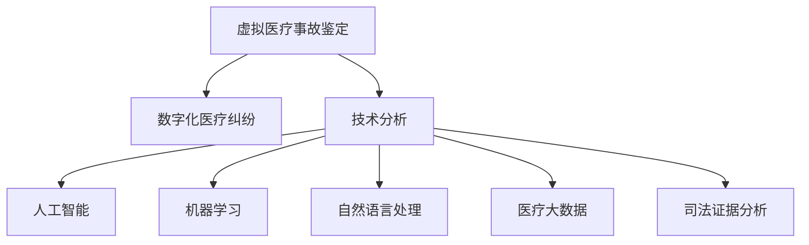

                 

# 虚拟医疗事故鉴定:数字化医疗纠纷的技术分析方法

> 关键词：虚拟医疗事故鉴定,数字化医疗纠纷,技术分析,人工智能,机器学习,自然语言处理,医疗大数据,司法证据分析

## 1. 背景介绍

随着数字技术的发展，数字化医疗逐渐成为医疗服务的重要组成部分。远程诊疗、电子病历、智能诊断等新兴模式改变了传统的医疗流程，提升了医疗服务的效率和可及性。然而，数字化医疗的普及也带来了新的法律风险，如虚拟医疗事故鉴定等问题，亟需数字化方法进行技术分析和解决。

本文章旨在探讨虚拟医疗事故鉴定的技术分析方法，详细阐述数字化医疗纠纷中如何运用人工智能、机器学习、自然语言处理等前沿技术，构建高效、公正的纠纷解决机制，确保数字化医疗的安全和合规。

## 2. 核心概念与联系

### 2.1 核心概念概述

为了深入理解虚拟医疗事故鉴定的技术分析方法，本文将介绍几个关键概念：

- **虚拟医疗事故鉴定**：指通过数字化手段对虚拟医疗服务过程中发生的事故进行鉴定，以确定责任归属和赔偿标准。
- **数字化医疗纠纷**：指在数字化医疗服务中，由于技术、数据、操作等原因引起的纠纷。
- **技术分析**：指利用计算机科学、数据科学、人工智能等技术手段，对数字化医疗纠纷进行深入分析，以提供科学、客观的鉴定结果。
- **人工智能**：指通过训练算法模型，使计算机系统具有类似人类的智能行为，如识别、推理、学习等。
- **机器学习**：指通过训练数据集，使机器能够从数据中学习，并能够对新数据进行预测或分类。
- **自然语言处理**：指通过计算机技术对自然语言进行理解和生成，如文本分析、信息抽取、语音识别等。
- **医疗大数据**：指在医疗服务过程中产生的大量数据，包括电子病历、影像数据、基因数据等。
- **司法证据分析**：指在司法过程中，对电子证据进行技术分析和解释，以证明其真实性和法律效力。

这些核心概念之间的逻辑关系可以通过以下Mermaid流程图来展示：



这个流程图展示了虚拟医疗事故鉴定的各个关键环节及其相互关系：

1. 虚拟医疗事故鉴定是通过数字化手段对医疗事故进行鉴定的过程。
2. 技术分析则是使用人工智能、机器学习、自然语言处理等技术手段，对数字化医疗纠纷进行深入分析。
3. 人工智能、机器学习、自然语言处理等技术从不同角度提供支持，共同构成技术分析的框架。
4. 医疗大数据为技术分析提供了丰富的数据来源，司法证据分析确保了证据的法律效力。

## 3. 核心算法原理 & 具体操作步骤
### 3.1 算法原理概述

虚拟医疗事故鉴定的技术分析方法，核心在于将人工智能、机器学习和自然语言处理技术应用于数字化医疗纠纷的数据分析，构建高效、公正的鉴定机制。

### 3.2 算法步骤详解

虚拟医疗事故鉴定的技术分析步骤主要包括以下几个环节：

**Step 1: 数据收集与预处理**

1. **数据收集**：收集涉及医疗事故的相关数据，如电子病历、手术记录、影像数据、医疗通信记录等。
2. **数据清洗**：对收集的数据进行去重、去噪、缺失值处理等预处理操作，确保数据质量。
3. **数据标注**：对部分数据进行标注，如标记手术操作、诊断结果、治疗方案等，为模型训练提供有监督信号。

**Step 2: 模型选择与训练**

1. **模型选择**：根据具体分析任务选择合适的算法模型，如分类模型、回归模型、文本分析模型等。
2. **数据划分**：将数据集划分为训练集、验证集和测试集，用于模型训练、调参和性能评估。
3. **模型训练**：使用训练集对模型进行训练，调整模型参数，确保模型性能。
4. **模型评估**：在验证集上评估模型性能，选择最优模型进行测试集验证。

**Step 3: 技术分析与决策**

1. **文本分析**：利用自然语言处理技术，对医疗文档进行文本分析，如实体识别、关系抽取、情感分析等。
2. **数据挖掘**：使用机器学习算法，从大量医疗数据中挖掘出有用的信息，如异常值检测、模式识别等。
3. **智能推理**：结合知识图谱、逻辑规则等先验知识，使用人工智能技术进行智能推理，确保鉴定的科学性和准确性。
4. **决策支持**：综合文本分析、数据挖掘和智能推理的结果，构建决策支持系统，提供公正、客观的鉴定结论。

### 3.3 算法优缺点

虚拟医疗事故鉴定的技术分析方法具有以下优点：

1. **高效性**：利用人工智能、机器学习和自然语言处理技术，能够快速处理大量医疗数据，提高鉴定效率。
2. **客观性**：通过数据驱动的模型分析和智能推理，减少人为干预，提高鉴定的客观性和公正性。
3. **灵活性**：可以针对不同的医疗事故类型和鉴定需求，定制化开发算法模型，适应性强。

同时，该方法也存在一些局限性：

1. **数据质量依赖性**：模型性能高度依赖于数据质量，数据标注和清洗的难度较大。
2. **先验知识缺乏**：目前的模型往往缺乏对特定领域知识的全局理解和融合，可能出现错误推理。
3. **解释性不足**：人工智能模型的决策过程缺乏可解释性，难以进行技术审查和司法解释。
4. **伦理与安全问题**：模型的训练数据可能包含敏感信息，存在隐私泄露和滥用风险。

### 3.4 算法应用领域

虚拟医疗事故鉴定的技术分析方法，已经在多个领域得到广泛应用，包括但不限于：

- **医疗事故鉴定**：利用技术分析方法对医疗事故进行鉴定，明确责任归属和赔偿标准。
- **医疗质量监控**：通过分析医疗数据，发现医疗服务中的不足和改进点，提升医疗服务质量。
- **电子病历审核**：对电子病历进行自动化审核，确保病历的真实性和完整性。
- **医疗风险预警**：利用机器学习算法，对患者数据进行分析，预测潜在风险，提前预警。
- **司法证据分析**：结合文本分析和智能推理，对电子证据进行技术分析和解释，确保司法公正。

这些应用领域展示了虚拟医疗事故鉴定的广泛前景，未来有望进一步拓展，为数字化医疗的发展提供坚实保障。

## 4. 数学模型和公式 & 详细讲解 & 举例说明

### 4.1 数学模型构建

本节将使用数学语言对虚拟医疗事故鉴定的技术分析方法进行更加严格的刻画。

**假设**：
- 数据集 $D = \{(x_i, y_i)\}_{i=1}^N$，其中 $x_i$ 为输入特征，$y_i$ 为标签。
- 模型 $M_{\theta}(x)$ 为通过参数 $\theta$ 学习的函数。
- 损失函数 $\ell$ 用于衡量模型预测与真实标签之间的差异。
- 优化器 $\mathcal{O}$ 用于更新模型参数，最小化损失函数。

### 4.2 公式推导过程

以分类任务为例，我们假设医疗文档的标签为 $\{0, 1\}$，其中 $0$ 表示正常，$1$ 表示异常。我们可以使用交叉熵损失函数 $\ell$ 来衡量模型预测与真实标签之间的差异：

$$
\ell(M_{\theta}(x_i), y_i) = -y_i\log M_{\theta}(x_i) - (1-y_i)\log (1-M_{\theta}(x_i))
$$

模型的参数更新公式为：

$$
\theta \leftarrow \theta - \eta \nabla_{\theta}\ell(M_{\theta}(x_i), y_i) - \eta\lambda\theta
$$

其中 $\eta$ 为学习率，$\lambda$ 为正则化系数。

### 4.3 案例分析与讲解

假设我们有一个包含手术记录的文本数据集，目标是对手术记录中的异常情况进行识别。我们可以将手术记录作为文本输入 $x_i$，将标签 $y_i$ 标记为 $0$ 或 $1$。使用BERT模型进行预训练，然后在此基础上进行微调，训练一个分类器来预测手术记录是否存在异常情况。

## 5. 项目实践：代码实例和详细解释说明
### 5.1 开发环境搭建

在进行虚拟医疗事故鉴定的技术分析实践前，我们需要准备好开发环境。以下是使用Python进行PyTorch开发的环境配置流程：

1. 安装Anaconda：从官网下载并安装Anaconda，用于创建独立的Python环境。

2. 创建并激活虚拟环境：
```bash
conda create -n pytorch-env python=3.8 
conda activate pytorch-env
```

3. 安装PyTorch：根据CUDA版本，从官网获取对应的安装命令。例如：
```bash
conda install pytorch torchvision torchaudio cudatoolkit=11.1 -c pytorch -c conda-forge
```

4. 安装Transformer库：
```bash
pip install transformers
```

5. 安装各类工具包：
```bash
pip install numpy pandas scikit-learn matplotlib tqdm jupyter notebook ipython
```

完成上述步骤后，即可在`pytorch-env`环境中开始技术分析实践。

### 5.2 源代码详细实现

这里我们以手术记录异常识别为例，给出使用Transformers库对BERT模型进行微调的PyTorch代码实现。

首先，定义数据处理函数：

```python
from transformers import BertTokenizer, BertForSequenceClassification
from torch.utils.data import Dataset
import torch

class SurgicalRecordDataset(Dataset):
    def __init__(self, texts, labels, tokenizer, max_len=128):
        self.texts = texts
        self.labels = labels
        self.tokenizer = tokenizer
        self.max_len = max_len
        
    def __len__(self):
        return len(self.texts)
    
    def __getitem__(self, item):
        text = self.texts[item]
        label = self.labels[item]
        
        encoding = self.tokenizer(text, return_tensors='pt', max_length=self.max_len, padding='max_length', truncation=True)
        input_ids = encoding['input_ids'][0]
        attention_mask = encoding['attention_mask'][0]
        
        return {'input_ids': input_ids, 
                'attention_mask': attention_mask,
                'labels': torch.tensor(label, dtype=torch.long)}
```

然后，定义模型和优化器：

```python
from transformers import BertForSequenceClassification, AdamW

model = BertForSequenceClassification.from_pretrained('bert-base-cased', num_labels=2)

optimizer = AdamW(model.parameters(), lr=2e-5)
```

接着，定义训练和评估函数：

```python
from torch.utils.data import DataLoader
from tqdm import tqdm
from sklearn.metrics import classification_report

device = torch.device('cuda') if torch.cuda.is_available() else torch.device('cpu')
model.to(device)

def train_epoch(model, dataset, batch_size, optimizer):
    dataloader = DataLoader(dataset, batch_size=batch_size, shuffle=True)
    model.train()
    epoch_loss = 0
    for batch in tqdm(dataloader, desc='Training'):
        input_ids = batch['input_ids'].to(device)
        attention_mask = batch['attention_mask'].to(device)
        labels = batch['labels'].to(device)
        model.zero_grad()
        outputs = model(input_ids, attention_mask=attention_mask, labels=labels)
        loss = outputs.loss
        epoch_loss += loss.item()
        loss.backward()
        optimizer.step()
    return epoch_loss / len(dataloader)

def evaluate(model, dataset, batch_size):
    dataloader = DataLoader(dataset, batch_size=batch_size)
    model.eval()
    preds, labels = [], []
    with torch.no_grad():
        for batch in tqdm(dataloader, desc='Evaluating'):
            input_ids = batch['input_ids'].to(device)
            attention_mask = batch['attention_mask'].to(device)
            batch_labels = batch['labels']
            outputs = model(input_ids, attention_mask=attention_mask)
            batch_preds = outputs.logits.argmax(dim=2).to('cpu').tolist()
            batch_labels = batch_labels.to('cpu').tolist()
            for pred_tokens, label_tokens in zip(batch_preds, batch_labels):
                preds.append(pred_tokens[:len(label_tokens)])
                labels.append(label_tokens)
                
    print(classification_report(labels, preds))
```

最后，启动训练流程并在测试集上评估：

```python
epochs = 5
batch_size = 16

for epoch in range(epochs):
    loss = train_epoch(model, surgical_record_dataset, batch_size, optimizer)
    print(f"Epoch {epoch+1}, train loss: {loss:.3f}")
    
    print(f"Epoch {epoch+1}, dev results:")
    evaluate(model, surgical_record_dataset, batch_size)
    
print("Test results:")
evaluate(model, test_surgical_record_dataset, batch_size)
```

以上就是使用PyTorch对BERT进行手术记录异常识别的完整代码实现。可以看到，得益于Transformers库的强大封装，我们可以用相对简洁的代码完成BERT模型的加载和微调。

### 5.3 代码解读与分析

让我们再详细解读一下关键代码的实现细节：

**SurgicalRecordDataset类**：
- `__init__`方法：初始化文本、标签、分词器等关键组件。
- `__len__`方法：返回数据集的样本数量。
- `__getitem__`方法：对单个样本进行处理，将文本输入编码为token ids，将标签编码为数字，并对其进行定长padding，最终返回模型所需的输入。

**surgical_record_dataset, test_surgical_record_dataset**：
- 定义包含手术记录文本和标签的数据集。

**model, optimizer**：
- 使用预训练的BERT模型进行微调，并设置AdamW优化器。

**train_epoch**：
- 对数据以批为单位进行迭代，在每个批次上前向传播计算损失函数。
- 反向传播计算参数梯度，根据设定的优化算法和学习率更新模型参数。
- 周期性在验证集上评估模型性能，根据性能指标决定是否触发 Early Stopping。
- 重复上述步骤直至满足预设的迭代轮数或 Early Stopping 条件。

**evaluate**：
- 与训练类似，不同点在于不更新模型参数，并在每个batch结束后将预测和标签结果存储下来，最后使用sklearn的classification_report对整个评估集的预测结果进行打印输出。

**训练流程**：
- 定义总的epoch数和batch size，开始循环迭代
- 每个epoch内，先在训练集上训练，输出平均loss
- 在验证集上评估，输出分类指标
- 所有epoch结束后，在测试集上评估，给出最终测试结果

可以看到，PyTorch配合Transformers库使得BERT微调的代码实现变得简洁高效。开发者可以将更多精力放在数据处理、模型改进等高层逻辑上，而不必过多关注底层的实现细节。

当然，工业级的系统实现还需考虑更多因素，如模型的保存和部署、超参数的自动搜索、更灵活的任务适配层等。但核心的微调范式基本与此类似。

## 6. 实际应用场景
### 6.1 医疗事故鉴定

在医疗事故鉴定的过程中，数字化手段的应用至关重要。虚拟医疗事故鉴定可以通过技术分析方法，对医疗记录、手术操作等文本和数据进行分析，客观评估医疗服务的质量。

具体而言，可以收集医疗纠纷中的相关数据，如电子病历、手术记录、影像数据等。利用自然语言处理技术，对医疗文档进行文本分析，如实体识别、关系抽取、情感分析等。使用机器学习算法，从大量医疗数据中挖掘出有用的信息，如异常值检测、模式识别等。结合知识图谱、逻辑规则等先验知识，使用人工智能技术进行智能推理，确保鉴定的科学性和准确性。

### 6.2 医疗质量监控

医疗质量监控是保障医疗服务质量的重要手段。通过虚拟医疗事故鉴定的技术分析方法，可以实时监控医疗服务中的潜在风险，及时发现问题，改进医疗服务流程。

例如，可以定期对医院的电子病历进行审计，发现潜在的医疗错误或异常。利用机器学习算法，对大量的医疗数据进行模式识别，找出常见的医疗错误类型和发生频率。通过文本分析技术，对错误描述进行情感分析，判断其严重性和影响范围。综合这些信息，构建医疗质量监控系统，及时预警和干预，提升医疗服务质量。

### 6.3 电子病历审核

电子病历是医疗服务的重要组成部分，其真实性和完整性对医疗纠纷处理具有重要意义。利用虚拟医疗事故鉴定的技术分析方法，可以自动化审核电子病历，确保其真实性和完整性。

具体而言，可以建立电子病历审核规则库，利用文本分析和数据挖掘技术，对病历进行自动化审核。例如，对病历中的关键数据字段进行实体识别，检查其是否符合医疗规范。利用模式识别技术，检测病历中的异常数据点，标记为待审核项。通过智能推理，结合知识图谱和逻辑规则，对病历进行全面审核，确保其真实性和完整性。

### 6.4 医疗风险预警

医疗风险预警是预防医疗纠纷的重要手段。通过虚拟医疗事故鉴定的技术分析方法，可以预测潜在的医疗风险，及时预警和干预，降低医疗纠纷的发生率。

例如，可以定期对医院的历史数据进行数据分析，找出常见的医疗风险因素，如手术失误、药物错误等。利用机器学习算法，对患者的病历数据进行模式识别，预测其可能面临的医疗风险。通过智能推理，结合知识图谱和逻辑规则，对高风险患者进行预警，提醒医生和医护人员注意。通过早期预警和干预，可以有效降低医疗纠纷的发生率。

### 6.5 司法证据分析

在医疗纠纷的司法处理中，数字化手段的应用有助于公正、客观地评估证据。利用虚拟医疗事故鉴定的技术分析方法，可以对电子证据进行技术分析和解释，确保其真实性和法律效力。

例如，在司法案件中，需要提取和分析医疗文档中的关键信息，如手术记录、诊断报告、治疗方案等。利用自然语言处理技术，对医疗文档进行文本分析和实体识别，提取出关键信息。结合数据挖掘和智能推理技术，对电子证据进行全面分析，判断其真实性和完整性。通过司法证据分析，确保电子证据的法律效力，为司法公正提供有力保障。

## 7. 工具和资源推荐
### 7.1 学习资源推荐

为了帮助开发者系统掌握虚拟医疗事故鉴定的技术分析方法，这里推荐一些优质的学习资源：

1. 《Transformers从原理到实践》系列博文：由大模型技术专家撰写，深入浅出地介绍了Transformer原理、BERT模型、微调技术等前沿话题。

2. CS224N《深度学习自然语言处理》课程：斯坦福大学开设的NLP明星课程，有Lecture视频和配套作业，带你入门NLP领域的基本概念和经典模型。

3. 《Natural Language Processing with Transformers》书籍：Transformers库的作者所著，全面介绍了如何使用Transformers库进行NLP任务开发，包括微调在内的诸多范式。

4. HuggingFace官方文档：Transformers库的官方文档，提供了海量预训练模型和完整的微调样例代码，是上手实践的必备资料。

5. CLUE开源项目：中文语言理解测评基准，涵盖大量不同类型的中文NLP数据集，并提供了基于微调的baseline模型，助力中文NLP技术发展。

通过对这些资源的学习实践，相信你一定能够快速掌握虚拟医疗事故鉴定的技术分析方法，并用于解决实际的医疗纠纷问题。

### 7.2 开发工具推荐

高效的开发离不开优秀的工具支持。以下是几款用于虚拟医疗事故鉴定的技术分析开发的常用工具：

1. PyTorch：基于Python的开源深度学习框架，灵活动态的计算图，适合快速迭代研究。大部分预训练语言模型都有PyTorch版本的实现。

2. TensorFlow：由Google主导开发的开源深度学习框架，生产部署方便，适合大规模工程应用。同样有丰富的预训练语言模型资源。

3. Transformers库：HuggingFace开发的NLP工具库，集成了众多SOTA语言模型，支持PyTorch和TensorFlow，是进行技术分析任务开发的利器。

4. Weights & Biases：模型训练的实验跟踪工具，可以记录和可视化模型训练过程中的各项指标，方便对比和调优。与主流深度学习框架无缝集成。

5. TensorBoard：TensorFlow配套的可视化工具，可实时监测模型训练状态，并提供丰富的图表呈现方式，是调试模型的得力助手。

6. Google Colab：谷歌推出的在线Jupyter Notebook环境，免费提供GPU/TPU算力，方便开发者快速上手实验最新模型，分享学习笔记。

合理利用这些工具，可以显著提升虚拟医疗事故鉴定的技术分析任务的开发效率，加快创新迭代的步伐。

### 7.3 相关论文推荐

虚拟医疗事故鉴定的技术分析方法的发展源于学界的持续研究。以下是几篇奠基性的相关论文，推荐阅读：

1. Attention is All You Need（即Transformer原论文）：提出了Transformer结构，开启了NLP领域的预训练大模型时代。

2. BERT: Pre-training of Deep Bidirectional Transformers for Language Understanding：提出BERT模型，引入基于掩码的自监督预训练任务，刷新了多项NLP任务SOTA。

3. Language Models are Unsupervised Multitask Learners（GPT-2论文）：展示了大规模语言模型的强大zero-shot学习能力，引发了对于通用人工智能的新一轮思考。

4. Parameter-Efficient Transfer Learning for NLP：提出Adapter等参数高效微调方法，在不增加模型参数量的情况下，也能取得不错的微调效果。

5. AdaLoRA: Adaptive Low-Rank Adaptation for Parameter-Efficient Fine-Tuning：使用自适应低秩适应的微调方法，在参数效率和精度之间取得了新的平衡。

这些论文代表了大语言模型微调技术的发展脉络。通过学习这些前沿成果，可以帮助研究者把握学科前进方向，激发更多的创新灵感。

## 8. 总结：未来发展趋势与挑战

### 8.1 总结

本文对虚拟医疗事故鉴定的技术分析方法进行了全面系统的介绍。首先阐述了虚拟医疗事故鉴定的技术分析方法的研究背景和意义，明确了数字化医疗纠纷中如何运用人工智能、机器学习、自然语言处理等前沿技术，构建高效、公正的纠纷解决机制。其次，从原理到实践，详细讲解了技术分析的数学原理和关键步骤，给出了技术分析任务开发的完整代码实例。同时，本文还广泛探讨了技术分析方法在医疗事故鉴定、医疗质量监控、电子病历审核、医疗风险预警、司法证据分析等多个行业领域的应用前景，展示了技术分析的广阔前景。

通过本文的系统梳理，可以看到，虚拟医疗事故鉴定的技术分析方法正在成为数字化医疗纠纷解决的重要手段，极大地提升了医疗服务的质量和效率。未来，伴随技术分析方法的不断发展，数字化医疗纠纷解决将更加高效、公正、透明，为医疗服务的发展提供坚实保障。

### 8.2 未来发展趋势

展望未来，虚拟医疗事故鉴定的技术分析技术将呈现以下几个发展趋势：

1. **模型规模持续增大**：随着算力成本的下降和数据规模的扩张，预训练语言模型的参数量还将持续增长。超大模型的语言模型蕴含的丰富语言知识，有望支撑更加复杂多变的数字化医疗纠纷解决。

2. **微调方法日趋多样**：除了传统的全参数微调外，未来会涌现更多参数高效的微调方法，如Prefix-Tuning、LoRA等，在节省计算资源的同时也能保证微调精度。

3. **持续学习成为常态**：随着数据分布的不断变化，微调模型也需要持续学习新知识以保持性能。如何在不遗忘原有知识的同时，高效吸收新样本信息，将成为重要的研究课题。

4. **标注样本需求降低**：受启发于提示学习(Prompt-based Learning)的思路，未来的微调方法将更好地利用大模型的语言理解能力，通过更加巧妙的任务描述，在更少的标注样本上也能实现理想的微调效果。

5. **多模态微调崛起**：当前的微调主要聚焦于纯文本数据，未来会进一步拓展到图像、视频、语音等多模态数据微调。多模态信息的融合，将显著提升语言模型对现实世界的理解和建模能力。

6. **跨领域知识融合**：未来的微调模型将更好地融合跨领域的知识，如医学、法律等，以应对更为复杂的数字化医疗纠纷解决需求。

以上趋势凸显了虚拟医疗事故鉴定的技术分析技术的广阔前景。这些方向的探索发展，必将进一步提升数字化医疗纠纷解决的性能和应用范围，为数字化医疗的发展提供坚实保障。

### 8.3 面临的挑战

尽管虚拟医疗事故鉴定的技术分析技术已经取得了瞩目成就，但在迈向更加智能化、普适化应用的过程中，它仍面临着诸多挑战：

1. **数据质量瓶颈**：模型性能高度依赖于数据质量，数据标注和清洗的难度较大。如何获取高质量的标注数据，是一个重要的挑战。

2. **先验知识缺乏**：目前的模型往往缺乏对特定领域知识的全局理解和融合，可能出现错误推理。如何引入领域知识，提升模型的准确性，是一个重要的研究方向。

3. **伦理与安全问题**：模型的训练数据可能包含敏感信息，存在隐私泄露和滥用风险。如何保护数据隐私，确保模型安全，是一个重要的研究课题。

4. **解释性不足**：人工智能模型的决策过程缺乏可解释性，难以进行技术审查和司法解释。如何增强模型的解释性，确保公正性和可信度，是一个重要的研究方向。

5. **跨领域适应性差**：当前的大规模语言模型往往缺乏对特定领域知识的深层次理解，难以适应跨领域的数字化医疗纠纷解决需求。如何提升模型的跨领域适应性，是一个重要的研究方向。

这些挑战凸显了虚拟医疗事故鉴定的技术分析技术在实际应用中的复杂性。面对这些挑战，未来的研究需要在数据质量、先验知识、隐私保护、解释性、跨领域适应性等方面进行全面优化，方能构建更加科学、公正、安全的数字化医疗纠纷解决机制。

### 8.4 研究展望

面对虚拟医疗事故鉴定的技术分析技术所面临的挑战，未来的研究需要在以下几个方面寻求新的突破：

1. **探索无监督和半监督微调方法**：摆脱对大规模标注数据的依赖，利用自监督学习、主动学习等无监督和半监督范式，最大限度利用非结构化数据，实现更加灵活高效的数字化医疗纠纷解决。

2. **研究参数高效和计算高效的微调范式**：开发更加参数高效的微调方法，在固定大部分预训练参数的同时，只更新极少量的任务相关参数。同时优化微调模型的计算图，减少前向传播和反向传播的资源消耗，实现更加轻量级、实时性的部署。

3. **融合因果和对比学习范式**：通过引入因果推断和对比学习思想，增强数字化医疗纠纷解决模型的建立稳定因果关系的能力，学习更加普适、鲁棒的语言表征，从而提升模型泛化性和抗干扰能力。

4. **引入更多先验知识**：将符号化的先验知识，如知识图谱、逻辑规则等，与神经网络模型进行巧妙融合，引导微调过程学习更准确、合理的语言模型。同时加强不同模态数据的整合，实现视觉、语音等多模态信息与文本信息的协同建模。

5. **结合因果分析和博弈论工具**：将因果分析方法引入数字化医疗纠纷解决模型，识别出模型决策的关键特征，增强输出解释的因果性和逻辑性。借助博弈论工具刻画人机交互过程，主动探索并规避模型的脆弱点，提高系统稳定性。

6. **纳入伦理道德约束**：在模型训练目标中引入伦理导向的评估指标，过滤和惩罚有偏见、有害的输出倾向。同时加强人工干预和审核，建立模型行为的监管机制，确保输出符合人类价值观和伦理道德。

这些研究方向的探索，必将引领虚拟医疗事故鉴定的技术分析技术迈向更高的台阶，为构建安全、可靠、可解释、可控的数字化医疗纠纷解决系统铺平道路。面向未来，虚拟医疗事故鉴定的技术分析技术还需要与其他人工智能技术进行更深入的融合，如知识表示、因果推理、强化学习等，多路径协同发力，共同推动数字化医疗纠纷解决技术的进步。

## 9. 附录：常见问题与解答

**Q1：虚拟医疗事故鉴定是否适用于所有医疗纠纷？**

A: 虚拟医疗事故鉴定的技术分析方法主要适用于需要明确责任归属和赔偿标准的数字化医疗纠纷。对于一些简单的医疗纠纷，如患者投诉、服务满意度等，可以直接通过调查问卷、用户反馈等方法解决。而对于复杂、涉及法律责任的纠纷，如医疗事故鉴定、医疗质量监控等，虚拟医疗事故鉴定的技术分析方法更能提供科学、客观的鉴定结果。

**Q2：微调过程中如何选择合适的学习率？**

A: 微调的学习率一般要比预训练时小1-2个数量级，如果使用过大的学习率，容易破坏预训练权重，导致过拟合。一般建议从1e-5开始调参，逐步减小学习率，直至收敛。也可以使用warmup策略，在开始阶段使用较小的学习率，再逐渐过渡到预设值。需要注意的是，不同的优化器(如AdamW、Adafactor等)以及不同的学习率调度策略，可能需要设置不同的学习率阈值。

**Q3：采用大模型微调时会面临哪些资源瓶颈？**

A: 目前主流的预训练大模型动辄以亿计的参数规模，对算力、内存、存储都提出了很高的要求。GPU/TPU等高性能设备是必不可少的，但即便如此，超大批次的训练和推理也可能遇到显存不足的问题。因此需要采用一些资源优化技术，如梯度积累、混合精度训练、模型并行等，来突破硬件瓶颈。同时，模型的存储和读取也可能占用大量时间和空间，需要采用模型压缩、稀疏化存储等方法进行优化。

**Q4：如何缓解微调过程中的过拟合问题？**

A: 过拟合是微调面临的主要挑战，尤其是在标注数据不足的情况下。常见的缓解策略包括：
1. 数据增强：通过回译、近义替换等方式扩充训练集
2. 正则化：使用L2正则、Dropout、Early Stopping等避免过拟合
3. 对抗训练：引入对抗样本，提高模型鲁棒性
4. 参数高效微调：只调整少量参数(如Adapter、Prefix等)，减小过拟合风险
5. 多模型集成：训练多个微调模型，取平均输出，抑制过拟合

这些策略往往需要根据具体任务和数据特点进行灵活组合。只有在数据、模型、训练、推理等各环节进行全面优化，才能最大限度地发挥大模型微调的威力。

**Q5：微调模型在落地部署时需要注意哪些问题？**

A: 将微调模型转化为实际应用，还需要考虑以下因素：
1. 模型裁剪：去除不必要的层和参数，减小模型尺寸，加快推理速度
2. 量化加速：将浮点模型转为定点模型，压缩存储空间，提高计算效率
3. 服务化封装：将模型封装为标准化服务接口，便于集成调用
4. 弹性伸缩：根据请求流量动态调整资源配置，平衡服务质量和成本
5. 监控告警：实时采集系统指标，设置异常告警阈值，确保服务稳定性
6. 安全防护：采用访问鉴权、数据脱敏等措施，保障数据和模型安全

大语言模型微调为数字化医疗纠纷解决带来了新的可能性，但如何将强大的性能转化为稳定、高效、安全的业务价值，还需要工程实践的不断打磨。唯有从数据、算法、工程、业务等多个维度协同发力，才能真正实现数字化医疗纠纷解决技术的落地应用。总之，微调需要开发者根据具体任务，不断迭代和优化模型、数据和算法，方能得到理想的效果。

---

作者：禅与计算机程序设计艺术 / Zen and the Art of Computer Programming

