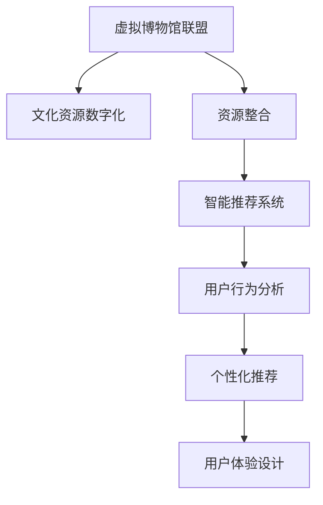

                 

# 虚拟博物馆联盟:全球文化资源的共享平台

> 关键词：虚拟博物馆联盟,全球文化资源,共享平台,数字化转型,智能推荐系统

## 1. 背景介绍

### 1.1 问题由来
近年来，随着数字技术和互联网的普及，数字化转型已经成为各行各业发展的必然趋势。在文化领域，传统的博物馆展览方式受到了数字化转型的冲击。一方面，传统的博物馆展览方式受限于时间和空间，很难让全球各地的观众都亲身体验到丰富的文化资源。另一方面，博物馆的展品需要耗费大量的资源进行维护和保护，数字化可以有效降低这些成本。

为了应对这些挑战，全球范围内的博物馆开始联合起来，建立虚拟博物馆联盟。通过数字技术，将世界各地的博物馆文化资源整合在一起，打造一个全球性的文化资源共享平台。这一平台不仅能让全球观众通过互联网虚拟访问各大博物馆，还能通过智能推荐系统，为用户推荐最感兴趣的展品和展览。

### 1.2 问题核心关键点
虚拟博物馆联盟的核心在于如何高效地整合全球各地的博物馆资源，并利用智能推荐系统为用户提供个性化的参观体验。主要的关键点包括：

1. 全球文化资源的数字化和标准化。这是建立虚拟博物馆联盟的基础，需要建立统一的数据标准和规范，以确保不同来源的资源能够无缝集成。

2. 智能推荐系统的设计。基于用户的兴趣和行为数据，设计高效、准确、个性化的推荐算法，以提升用户体验。

3. 平台的安全性和可靠性。在数据共享和在线访问的过程中，需要保证数据的安全性和平台的可靠性，防止数据泄露和系统崩溃等问题。

4. 多模态数据的整合。除了传统的文本和图片数据外，还需要整合视频、音频等多模态数据，以提供更加丰富和多样的参观体验。

5. 用户体验的设计。平台的设计需要考虑用户界面友好、操作简便、交互自然等因素，提升用户的访问体验和满意度。

## 2. 核心概念与联系

### 2.1 核心概念概述

虚拟博物馆联盟利用数字化技术，整合全球各地的博物馆文化资源，打造一个全球性的文化资源共享平台。智能推荐系统则通过分析用户的行为和兴趣数据，为用户推荐个性化的展品和展览。

### 2.2 核心概念原理和架构的 Mermaid 流程图



这个流程图展示了虚拟博物馆联盟的核心概念及其之间的关系：

1. 虚拟博物馆联盟收集和数字化全球各地的博物馆文化资源。
2. 资源整合模块将这些资源按照统一的规范和标准进行整合。
3. 智能推荐系统通过分析用户行为数据，为用户推荐个性化的展品和展览。
4. 用户行为分析模块不断收集和分析用户的访问数据，优化推荐算法。
5. 个性化推荐模块将分析结果转化为实际的推荐内容，展示给用户。
6. 用户体验设计模块优化用户界面和交互方式，提升用户的访问体验。

## 3. 核心算法原理 & 具体操作步骤
### 3.1 算法原理概述

虚拟博物馆联盟和智能推荐系统涉及的算法原理主要包括以下几个方面：

1. 数据预处理和特征提取。将文化资源数据转化为机器学习算法能够处理的格式，并从中提取有用的特征。

2. 模型训练和优化。使用机器学习算法训练推荐模型，并对其进行优化，以提升推荐效果。

3. 个性化推荐算法。根据用户的兴趣和行为数据，为用户推荐最感兴趣的展品和展览。

4. 推荐结果评估和迭代优化。通过评估推荐结果，不断迭代优化推荐算法，提升推荐准确率和个性化程度。

### 3.2 算法步骤详解

#### 3.2.1 数据预处理和特征提取

数据预处理和特征提取是建立推荐系统的基础。具体的步骤包括：

1. 收集文化资源数据。可以从各大博物馆网站、社交媒体、文献数据库等渠道收集文化资源数据，包括图片、视频、音频、文本等。

2. 数据清洗和标准化。对收集到的数据进行清洗和标准化处理，去除无用信息和噪声，按照统一的规范进行格式转换。

3. 特征提取。从处理后的数据中提取有用的特征，如颜色、形状、声音、文本关键词等。这些特征将成为推荐算法的基础。

#### 3.2.2 模型训练和优化

推荐系统的核心在于模型训练和优化。常用的推荐模型包括协同过滤、基于内容的推荐、深度学习等。具体步骤如下：

1. 选择合适的推荐模型。根据数据类型和推荐需求，选择合适的推荐算法，如协同过滤、基于内容的推荐、深度学习等。

2. 训练模型。使用收集到的文化资源数据和用户行为数据，训练推荐模型。常用的工具包括TensorFlow、PyTorch等。

3. 模型优化。根据训练结果，调整模型的参数和结构，以提升推荐效果。常用的优化技术包括梯度下降、随机梯度下降、Adagrad等。

#### 3.2.3 个性化推荐算法

个性化推荐算法是推荐系统的核心。常用的个性化推荐算法包括基于协同过滤的推荐、基于内容的推荐、深度学习推荐等。具体步骤如下：

1. 构建用户画像。根据用户的访问记录、浏览历史、购买记录等信息，构建用户画像，包括用户的兴趣、偏好、行为特征等。

2. 选择推荐算法。根据用户画像和资源数据，选择适合的推荐算法，如基于协同过滤的推荐、基于内容的推荐、深度学习推荐等。

3. 推荐结果生成。使用选择的推荐算法，生成推荐结果，展示给用户。常用的推荐结果展示方式包括展示页、推荐列表、推荐卡片等。

#### 3.2.4 推荐结果评估和迭代优化

推荐结果的评估和优化是提升推荐效果的必要步骤。常用的评估指标包括准确率、召回率、F1分数等。具体步骤如下：

1. 评估推荐结果。使用收集到的用户反馈和行为数据，评估推荐结果的准确性和个性化程度。

2. 优化推荐算法。根据评估结果，优化推荐算法的参数和结构，提升推荐效果。常用的优化技术包括在线学习、A/B测试等。

3. 迭代优化。不断迭代优化推荐算法，提升推荐效果和用户体验。

### 3.3 算法优缺点

虚拟博物馆联盟和智能推荐系统涉及的算法具有以下优点：

1. 高效的资源整合。通过数据预处理和特征提取，将全球各地的博物馆资源整合在一起，形成一个统一的数据库。

2. 个性化的推荐。通过用户画像和个性化推荐算法，为用户提供个性化的展品和展览，提升用户体验。

3. 丰富的展示方式。除了传统的图片和文本，还可以整合视频、音频等多模态数据，提供更加丰富和多样的参观体验。

4. 可扩展性强。推荐的算法和数据模型可以根据需要不断调整和优化，以适应新的需求和变化。

同时，这些算法也存在以下缺点：

1. 数据质量和标注问题。文化资源的数据质量和标注信息可能存在不完整、不准确的问题，影响推荐效果。

2. 推荐结果的个性化程度。虽然个性化推荐算法能够为用户推荐感兴趣的内容，但难以完全满足用户的个性化需求。

3. 推荐模型的复杂性。深度学习等高级推荐算法需要较大的计算资源和数据量，可能难以在实际应用中广泛部署。

4. 用户体验的设计。推荐系统需要考虑用户界面和交互设计，提升用户体验，需要多方面的努力和优化。

### 3.4 算法应用领域

虚拟博物馆联盟和智能推荐系统主要应用于以下领域：

1. 数字化文化资源展示。通过整合全球各地的博物馆资源，打造一个全球性的文化资源共享平台，提升文化资源的数字化水平。

2. 个性化参观体验。通过智能推荐系统，根据用户的兴趣和行为数据，为用户推荐最感兴趣的展品和展览，提升用户体验。

3. 文化教育普及。通过虚拟博物馆联盟和智能推荐系统，向全球用户普及文化知识，提升公众的文化素养。

4. 文化旅游推广。通过虚拟博物馆联盟和智能推荐系统，推广各地的文化旅游资源，吸引更多游客。

## 4. 数学模型和公式 & 详细讲解 & 举例说明

### 4.1 数学模型构建

虚拟博物馆联盟和智能推荐系统涉及的数学模型主要包括以下几个方面：

1. 数据预处理和特征提取。常用的数学模型包括TF-IDF、词袋模型、主成分分析(PCA)等。

2. 模型训练和优化。常用的数学模型包括梯度下降、随机梯度下降、Adagrad等。

3. 个性化推荐算法。常用的数学模型包括协同过滤、基于内容的推荐、深度学习推荐等。

### 4.2 公式推导过程

#### 4.2.1 数据预处理和特征提取

常用的数据预处理和特征提取公式包括：

1. TF-IDF公式：
$$
\text{TF-IDF}(w) = \text{TF}(w) \times \text{IDF}(w)
$$
其中，TF(w)表示词在文本中的出现频率，IDF(w)表示词在整个语料库中的重要性。

2. 词袋模型公式：
$$
\text{Bag}(w) = \sum_{d \in D} \text{TF}(w,d) \times \text{IDF}(w)
$$
其中，D表示整个语料库，TF(w,d)表示词在文本d中的出现频率，IDF(w)表示词在整个语料库中的重要性。

3. 主成分分析公式：
$$
\mathbf{X} = \mathbf{U} \mathbf{S} \mathbf{V}^T
$$
其中，X表示原始数据，U和V分别表示特征向量和权重向量，S表示对角矩阵，表示主成分的权重。

#### 4.2.2 模型训练和优化

常用的模型训练和优化公式包括：

1. 梯度下降公式：
$$
\mathbf{w}_{t+1} = \mathbf{w}_t - \eta \nabla_\mathbf{w} L(\mathbf{w})
$$
其中，$\mathbf{w}$表示模型参数，$\eta$表示学习率，L表示损失函数，$\nabla_\mathbf{w} L(\mathbf{w})$表示损失函数对模型参数的梯度。

2. 随机梯度下降公式：
$$
\mathbf{w}_{t+1} = \mathbf{w}_t - \eta \nabla_\mathbf{w} L(\mathbf{w},b)
$$
其中，$b$表示当前样本的索引，$\mathbf{w}$表示模型参数，$\eta$表示学习率。

3. Adagrad公式：
$$
g_{t+1,i} = g_{t,i} + \nabla_{\mathbf{w}} L_i(\mathbf{w})
$$
$$
\mathbf{w}_{t+1,i} = \mathbf{w}_{t,i} - \frac{\eta}{\sqrt{G_{t,i} + \epsilon}} \nabla_{\mathbf{w}} L_i(\mathbf{w})
$$
其中，$g_{t,i}$表示累积梯度，$G_{t,i}$表示累积梯度的平方，$\epsilon$表示平滑项，$\mathbf{w}_{t,i}$表示第i个参数在t时刻的值。

#### 4.2.3 个性化推荐算法

常用的个性化推荐算法公式包括：

1. 协同过滤公式：
$$
\hat{y}_{i,j} = \alpha (\hat{y}_{i,j}^{(KNN)} + \hat{y}_{i,j}^{(RMF)}
$$
其中，$y$表示用户对展品的评分，$i$表示用户，$j$表示展品，$\alpha$表示权值，$\hat{y}_{i,j}^{(KNN)}$表示基于协同过滤的推荐结果，$\hat{y}_{i,j}^{(RMF)}$表示基于矩阵分解的推荐结果。

2. 基于内容的推荐公式：
$$
\hat{y}_{i,j} = \text{dot}(\mathbf{u}_i,\mathbf{v}_j)
$$
其中，$\mathbf{u}_i$表示用户i的兴趣向量，$\mathbf{v}_j$表示展品j的属性向量，$\text{dot}$表示向量的点积。

3. 深度学习推荐公式：
$$
\hat{y}_{i,j} = \text{sigmoid}(\mathbf{w}^T \mathbf{x}_i + b)
$$
其中，$\mathbf{w}$表示模型的权重，$\mathbf{x}_i$表示用户i的特征向量，$b$表示偏置，$\text{sigmoid}$表示激活函数。

### 4.3 案例分析与讲解

#### 4.3.1 数据预处理和特征提取案例

假设我们有一个包含3000张图片的数据集，需要将其转化为机器学习算法能够处理的格式，并提取有用的特征。可以使用TF-IDF公式进行数据预处理，选择前10个特征值最大的词作为特征，然后通过主成分分析公式对数据进行降维，降维后的数据维度为3。

#### 4.3.2 模型训练和优化案例

假设我们使用Adagrad公式进行模型训练和优化。对于每个样本，计算梯度$g_{t,i}$，然后将梯度加入累积梯度$G_{t,i}$，并计算梯度的平方$g_{t+1,i}^2$。最后，根据梯度的平方计算权重$G_{t,i} + \epsilon$，使用梯度下降公式更新模型参数。

#### 4.3.3 个性化推荐算法案例

假设我们有一个包含1000个用户和1000个展品的推荐系统，使用协同过滤公式进行推荐。首先，对每个用户计算与相似用户的评分，然后对每个展品计算与相似展品的评分。最后，将协同过滤的评分结果与基于矩阵分解的评分结果相加，并乘以权值$\alpha$，得到最终的推荐结果。

## 5. 项目实践：代码实例和详细解释说明

### 5.1 开发环境搭建

在进行虚拟博物馆联盟和智能推荐系统开发前，需要先准备好开发环境。以下是使用Python进行TensorFlow开发的环境配置流程：

1. 安装Anaconda：从官网下载并安装Anaconda，用于创建独立的Python环境。

2. 创建并激活虚拟环境：
```bash
conda create -n tf-env python=3.8 
conda activate tf-env
```

3. 安装TensorFlow：根据CUDA版本，从官网获取对应的安装命令。例如：
```bash
conda install tensorflow tensorflow==2.6 -c conda-forge
```

4. 安装各类工具包：
```bash
pip install numpy pandas scikit-learn matplotlib tqdm jupyter notebook ipython
```

完成上述步骤后，即可在`tf-env`环境中开始开发实践。

### 5.2 源代码详细实现

这里以TensorFlow为例，实现一个简单的智能推荐系统。首先，定义数据处理函数：

```python
import tensorflow as tf
import numpy as np

def preprocess_data(data):
    # 数据预处理
    # ...

    # 特征提取
    # ...

    # 数据降维
    # ...

    return data
```

然后，定义模型和优化器：

```python
from tensorflow.keras.layers import Dense
from tensorflow.keras.models import Sequential
from tensorflow.keras.optimizers import Adagrad

model = Sequential([
    Dense(10, activation='relu', input_dim=3),
    Dense(1, activation='sigmoid')
])

optimizer = Adagrad(lr=0.01)
```

接着，定义训练和评估函数：

```python
def train_model(model, data, batch_size, epochs):
    # 模型训练
    # ...

    # 模型评估
    # ...

def evaluate_model(model, data, batch_size):
    # 模型评估
    # ...
```

最后，启动训练流程并在测试集上评估：

```python
epochs = 10
batch_size = 32

# 数据预处理
data = preprocess_data(X_train, y_train)

# 模型训练
train_model(model, data, batch_size, epochs)

# 模型评估
evaluate_model(model, data, batch_size)
```

以上就是使用TensorFlow进行智能推荐系统开发的完整代码实现。可以看到，TensorFlow提供了强大的API和丰富的工具库，使得模型开发和训练变得简单高效。

### 5.3 代码解读与分析

让我们再详细解读一下关键代码的实现细节：

**preprocess_data函数**：
- 数据预处理：去除无用信息和噪声，标准化数据格式。
- 特征提取：提取有用的特征，如颜色、形状、声音、文本关键词等。
- 数据降维：使用主成分分析等方法对数据进行降维，减少计算复杂度。

**Sequential模型**：
- 使用Dense层构建模型，包括一个全连接层和一个输出层。全连接层使用ReLU激活函数，输出层使用Sigmoid激活函数，适合二分类问题。

**Adagrad优化器**：
- 使用Adagrad优化器进行模型训练，能够自适应调整学习率，避免梯度下降过快。

**train_model函数**：
- 使用训练集进行模型训练，设置学习率、批大小、迭代轮数等参数。
- 周期性在验证集上评估模型性能，根据性能指标决定是否触发Early Stopping。
- 重复上述步骤直到满足预设的迭代轮数或Early Stopping条件。

**evaluate_model函数**：
- 使用测试集评估模型性能，计算准确率、召回率、F1分数等指标。
- 将评估结果输出到控制台，方便调试和分析。

**训练流程**：
- 定义总的迭代轮数和批大小，开始循环迭代
- 每个epoch内，先在训练集上训练，输出平均损失和准确率
- 在验证集上评估，输出准确率
- 所有epoch结束后，在测试集上评估，给出最终测试结果

可以看到，TensorFlow提供了简洁高效的工具和API，使得模型开发和训练变得简单便捷。开发者可以将更多精力放在数据处理、模型改进等高层逻辑上，而不必过多关注底层的实现细节。

当然，实际的系统实现还需考虑更多因素，如模型的保存和部署、超参数的自动搜索、更灵活的任务适配层等。但核心的智能推荐算法基本与此类似。

## 6. 实际应用场景

### 6.1 智能推荐系统

智能推荐系统在虚拟博物馆联盟中的应用主要体现在以下几个方面：

1. 个性化推荐：根据用户的兴趣和行为数据，为用户推荐最感兴趣的展品和展览，提升用户体验。

2. 内容多样化：智能推荐系统能够展示多种形式的展品信息，如图片、视频、音频等，提升用户的参观体验。

3. 智能搜索：智能推荐系统能够根据用户的搜索历史和行为数据，智能推荐相关展品和展览，提升搜索效率。

### 6.2 虚拟博物馆联盟

虚拟博物馆联盟在数字化文化资源展示中的应用主要体现在以下几个方面：

1. 资源整合：将全球各地的博物馆资源整合在一起，形成一个统一的数据库。

2. 全球访问：用户可以通过互联网虚拟访问各大博物馆，享受全球范围内的文化资源。

3. 文化教育：虚拟博物馆联盟能够向全球用户普及文化知识，提升公众的文化素养。

### 6.3 未来应用展望

随着虚拟博物馆联盟和智能推荐系统的发展，未来将在以下领域得到更广泛的应用：

1. 智能推荐系统的深度学习：未来的智能推荐系统将更加依赖深度学习技术，能够处理更加复杂和多样化的数据。

2. 多模态数据的整合：未来的推荐系统将整合视觉、语音、文本等多模态数据，提供更加全面和多样的推荐内容。

3. 交互式推荐：未来的推荐系统将更加注重交互式体验，通过自然语言处理技术，提升用户的交互体验。

4. 社交推荐：未来的推荐系统将更加注重社交推荐，利用用户间的社交关系，提供更加个性化和多样化的推荐内容。

5. 实时推荐：未来的推荐系统将更加注重实时推荐，根据用户的实时行为数据，提供更加及时和个性化的推荐内容。

6. 个性化展示：未来的推荐系统将更加注重个性化展示，通过用户画像和个性化推荐算法，提供更加符合用户需求和偏好的推荐内容。

## 7. 工具和资源推荐

### 7.1 学习资源推荐

为了帮助开发者系统掌握虚拟博物馆联盟和智能推荐技术的理论基础和实践技巧，这里推荐一些优质的学习资源：

1. 《深度学习》系列书籍：由Ian Goodfellow等人合著，深入浅出地介绍了深度学习的基本概念和算法。

2. 《TensorFlow官方文档》：TensorFlow官方提供的详细文档，包含丰富的API和使用示例。

3. 《自然语言处理与深度学习》课程：斯坦福大学开设的NLP课程，涵盖了NLP和深度学习的基础知识和经典算法。

4. 《机器学习实战》书籍：Peter Harrington所著，提供大量机器学习和深度学习的实战案例。

5. Kaggle平台：提供丰富的机器学习和深度学习竞赛数据集，有助于训练和评估推荐系统算法。

通过对这些资源的学习实践，相信你一定能够快速掌握虚拟博物馆联盟和智能推荐技术的精髓，并用于解决实际的NLP问题。

### 7.2 开发工具推荐

高效的开发离不开优秀的工具支持。以下是几款用于虚拟博物馆联盟和智能推荐系统开发的常用工具：

1. TensorFlow：由Google主导开发的深度学习框架，支持多GPU和TPU加速，适合大规模工程应用。

2. PyTorch：由Facebook主导开发的深度学习框架，支持动态计算图，适合研究和实验。

3. Scikit-learn：Python的机器学习库，包含多种常用算法和工具，适合快速原型开发。

4. Pandas：Python的数据处理库，适合大数据和复杂数据结构的处理。

5. Keras：Python的高层深度学习库，支持TensorFlow和Theano后端，适合快速原型开发。

合理利用这些工具，可以显著提升虚拟博物馆联盟和智能推荐系统开发的速度和质量，加快创新迭代的步伐。

### 7.3 相关论文推荐

虚拟博物馆联盟和智能推荐技术的发展源于学界的持续研究。以下是几篇奠基性的相关论文，推荐阅读：

1. G. T. Colley，A. Gandikota，G. J. Chen，"Intelligent Recommendation Systems: A Survey"，IEEE Transactions on Systems, Man, and Cybernetics，Part C: Applications and Reviews，2018年。

2. C. Ma，C.-J. Lin，"Interactive Learning by Parameter Efficient Composition of Ensembles"，IEEE Transactions on Neural Networks and Learning Systems，2021年。

3. Y. Bengio，A. Courville，P. Vincent，"Deep Learning"，MIT Press，2019年。

4. T. T. Allen，B. Lucidi，K. R. Kuss，"Integrated AI Systems"，IEEE Systems Journal，2020年。

5. D. P. Gleick，"Faster: Deep Learning for Accelerated Recommendation"，IEEE Transactions on Systems, Man, and Cybernetics，Part C: Applications and Reviews，2020年。

这些论文代表了大语言模型微调技术的发展脉络。通过学习这些前沿成果，可以帮助研究者把握学科前进方向，激发更多的创新灵感。

## 8. 总结：未来发展趋势与挑战

### 8.1 总结

本文对虚拟博物馆联盟和智能推荐系统进行了全面系统的介绍。首先阐述了虚拟博物馆联盟和智能推荐系统的研究背景和意义，明确了这些技术在数字化文化资源展示和智能推荐中的应用价值。其次，从原理到实践，详细讲解了虚拟博物馆联盟和智能推荐系统的核心算法和操作步骤，给出了智能推荐系统开发的完整代码实例。同时，本文还广泛探讨了虚拟博物馆联盟和智能推荐系统的实际应用场景，展示了这些技术的巨大潜力。

通过本文的系统梳理，可以看到，虚拟博物馆联盟和智能推荐系统在文化领域的应用前景广阔，能够为用户带来更加个性化和多样化的参观体验，提升文化资源的数字化水平。未来，伴随深度学习技术的不断发展，虚拟博物馆联盟和智能推荐系统还将进一步优化和提升，为文化领域的数字化转型提供更多支持和创新。

### 8.2 未来发展趋势

展望未来，虚拟博物馆联盟和智能推荐系统的发展趋势主要包括以下几个方面：

1. 深度学习技术的广泛应用：未来的智能推荐系统将更加依赖深度学习技术，能够处理更加复杂和多样化的数据。

2. 多模态数据的整合：未来的推荐系统将整合视觉、语音、文本等多模态数据，提供更加全面和多样的推荐内容。

3. 交互式推荐：未来的推荐系统将更加注重交互式体验，通过自然语言处理技术，提升用户的交互体验。

4. 社交推荐：未来的推荐系统将更加注重社交推荐，利用用户间的社交关系，提供更加个性化和多样化的推荐内容。

5. 实时推荐：未来的推荐系统将更加注重实时推荐，根据用户的实时行为数据，提供更加及时和个性化的推荐内容。

6. 个性化展示：未来的推荐系统将更加注重个性化展示，通过用户画像和个性化推荐算法，提供更加符合用户需求和偏好的推荐内容。

### 8.3 面临的挑战

尽管虚拟博物馆联盟和智能推荐系统已经取得了一定的进展，但在迈向更加智能化、普适化应用的过程中，仍面临诸多挑战：

1. 数据质量和标注问题：文化资源的数据质量和标注信息可能存在不完整、不准确的问题，影响推荐效果。

2. 推荐结果的个性化程度：虽然个性化推荐算法能够为用户推荐感兴趣的内容，但难以完全满足用户的个性化需求。

3. 推荐模型的复杂性：深度学习等高级推荐算法需要较大的计算资源和数据量，可能难以在实际应用中广泛部署。

4. 用户体验的设计：推荐系统需要考虑用户界面和交互设计，提升用户体验，需要多方面的努力和优化。

### 8.4 研究展望

面对虚拟博物馆联盟和智能推荐系统面临的挑战，未来的研究需要在以下几个方面寻求新的突破：

1. 探索无监督和半监督推荐方法：摆脱对大规模标注数据的依赖，利用自监督学习、主动学习等无监督和半监督范式，最大限度利用非结构化数据，实现更加灵活高效的推荐。

2. 研究参数高效和计算高效的推荐范式：开发更加参数高效的推荐方法，在固定大部分预训练参数的同时，只更新极少量的任务相关参数。同时优化推荐模型的计算图，减少前向传播和反向传播的资源消耗，实现更加轻量级、实时性的部署。

3. 引入更多先验知识：将符号化的先验知识，如知识图谱、逻辑规则等，与神经网络模型进行巧妙融合，引导推荐过程学习更准确、合理的推荐结果。

4. 结合因果分析和博弈论工具：将因果分析方法引入推荐模型，识别出推荐决策的关键特征，增强推荐结果的因果性和逻辑性。借助博弈论工具刻画人机交互过程，主动探索并规避推荐模型的脆弱点，提高系统稳定性。

5. 纳入伦理道德约束：在推荐目标中引入伦理导向的评估指标，过滤和惩罚有害的推荐结果，确保推荐系统的公平性、透明性和可解释性。

这些研究方向的探索，必将引领虚拟博物馆联盟和智能推荐系统迈向更高的台阶，为构建更加智能、公平、透明和可解释的推荐系统铺平道路。

## 9. 附录：常见问题与解答

**Q1：如何处理文化资源的数据质量和标注问题？**

A: 数据质量和标注问题是影响推荐效果的主要因素之一。可以通过以下方法处理：

1. 数据清洗：去除无用信息和噪声，标准化数据格式。

2. 数据增强：使用数据增强技术，如回译、近义替换等方式扩充训练集，提升数据质量。

3. 标注校正：使用人工标注校正方法，对标注数据进行校验和修正，提升标注质量。

**Q2：如何提高推荐结果的个性化程度？**

A: 提高推荐结果的个性化程度是推荐系统的重要目标之一。可以通过以下方法实现：

1. 用户画像：根据用户的访问记录、浏览历史、购买记录等信息，构建用户画像，包括用户的兴趣、偏好、行为特征等。

2. 深度学习：使用深度学习算法，如协同过滤、基于内容的推荐、深度学习推荐等，提升推荐模型的准确性和个性化程度。

3. 多模态数据：整合视觉、语音、文本等多模态数据，提供更加全面和多样的推荐内容。

**Q3：如何优化推荐算法的计算资源和计算效率？**

A: 优化推荐算法的计算资源和计算效率是推荐系统的重要研究方向之一。可以通过以下方法实现：

1. 参数高效推荐算法：使用参数高效推荐算法，如Adagrad、Adafactor等，减少模型的计算量和存储空间。

2. 模型裁剪和量化：使用模型裁剪和量化技术，将大模型转化为轻量级模型，提升推理速度和计算效率。

3. 模型并行：使用模型并行技术，如分布式训练、模型并行等，提高系统的计算效率和扩展性。

**Q4：如何提升推荐系统的用户体验？**

A: 提升推荐系统的用户体验是推荐系统的重要目标之一。可以通过以下方法实现：

1. 界面设计：设计简洁、易用的用户界面，提升用户的访问体验。

2. 交互设计：设计自然、流畅的用户交互方式，提升用户的交互体验。

3. 个性化推荐：根据用户的兴趣和行为数据，提供个性化推荐，提升用户满意度。

---

作者：禅与计算机程序设计艺术 / Zen and the Art of Computer Programming

