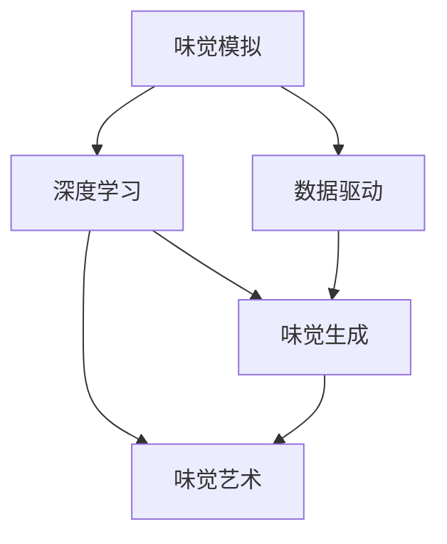
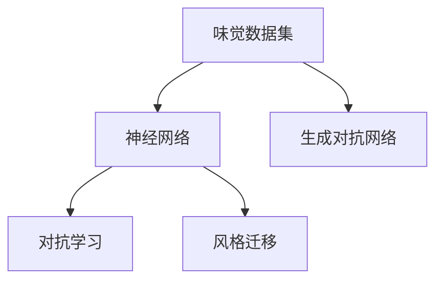

                 

# 虚拟味觉艺术：AI创作的味蕾交响曲

> 关键词：味觉模拟,人工智能,深度学习,数据驱动,味觉生成,味觉艺术

## 1. 背景介绍

### 1.1 问题由来
随着人工智能技术的飞速发展，AI在音乐、绘画、写作等领域已经展现出强大的创造能力。与这些传统的艺术创作不同，味觉作为一种感官体验，难以用传统的方式进行模拟和描述。然而，近年来，越来越多的研究开始探索利用AI技术重现和模拟味觉体验，即将虚拟味觉艺术带入现实。

虚拟味觉艺术不仅是科技与艺术融合的新尝试，还可能在医疗、教育、游戏等多个领域产生深远影响。例如，在医疗领域，虚拟味觉艺术可以帮助解决食物不耐受、味觉失灵等问题；在教育领域，可以让学生体验不同食品的味道，提升学习体验；在游戏领域，虚拟味觉艺术可以增加游戏的沉浸感，带来全新的互动体验。

### 1.2 问题核心关键点
本节将阐述虚拟味觉艺术的几个核心关键点：

- 味觉模拟：利用AI技术，将食物的色香味进行数字化表示，再通过机器学习算法，训练生成虚拟味觉。
- 深度学习：基于神经网络等深度学习技术，构建味觉生成模型，实现高精度的味觉预测和模拟。
- 数据驱动：通过大量的味觉数据集，训练和优化模型，提升虚拟味觉的逼真度和准确性。
- 味觉生成：使用生成对抗网络(GAN)等方法，生成具有丰富多样性的虚拟味觉，让用户能够体验到前所未有的味觉感受。
- 味觉艺术：利用虚拟味觉生成技术，创作出新颖独特的虚拟味觉艺术作品，挑战人类的味觉感知极限。

这些核心概念之间的逻辑关系可以通过以下Mermaid流程图来展示：



这个流程图展示了几大核心概念之间的联系：

1. 味觉模拟是虚拟味觉艺术的基础，即如何将食物的色香味进行数字化表示。
2. 深度学习是味觉模拟的核心技术，利用神经网络等模型进行味觉数据的训练和预测。
3. 数据驱动是深度学习的关键，即需要大量的味觉数据来训练和优化模型。
4. 味觉生成是深度学习的应用，即使用生成对抗网络等方法生成虚拟味觉。
5. 味觉艺术是味觉生成的延伸，即利用虚拟味觉生成技术创作艺术作品。

这些核心概念共同构成了虚拟味觉艺术的完整框架，使得人工智能在味觉领域的探索成为可能。

## 2. 核心概念与联系

### 2.1 核心概念概述

为更好地理解虚拟味觉艺术的实现原理，本节将介绍几个密切相关的核心概念：

- 味觉数据集：指用于训练和测试味觉生成模型的味觉数据，通常包含食物的色、香、味信息，以及对应的味觉标签。
- 神经网络：指利用多层神经元构成的网络模型，能够通过反向传播算法进行梯度优化，实现味觉数据的高级表示。
- 生成对抗网络(GAN)：一种由生成器和判别器组成的网络结构，能够生成高质量的味觉数据，提升虚拟味觉的逼真度。
- 对抗学习：指训练生成器生成与真实味觉数据尽可能相似的假味觉数据，通过对抗判别器的判别能力，提升生成结果的真实性。
- 风格迁移：指通过迁移学习的方式，将一种风格（如美食、异国风味）的味觉数据转换成另一种风格，实现独特的味觉艺术创作。

这些核心概念之间的逻辑关系可以通过以下Mermaid流程图来展示：



这个流程图展示了几大核心概念之间的联系：

1. 味觉数据集是神经网络训练的基础，即需要大量的味觉数据来进行模型训练。
2. 神经网络是味觉数据表示的核心，即通过神经网络学习食物色香味的高级表示。
3. 生成对抗网络是味觉生成的主要手段，即使用GAN等方法生成虚拟味觉。
4. 对抗学习是GAN中的一部分，即通过生成器生成假味觉数据，对抗判别器的判别能力。
5. 风格迁移是GAN的延伸，即通过迁移学习的方式，实现味觉数据的风格转换。

这些概念共同构成了虚拟味觉艺术的实现框架，使得AI能够通过训练生成逼真的虚拟味觉。

## 3. 核心算法原理 & 具体操作步骤
### 3.1 算法原理概述

虚拟味觉艺术的核心算法原理是深度学习和生成对抗网络。通过深度学习模型，将食物色香味的数据进行高层次的表示，然后再通过生成对抗网络，生成逼真的虚拟味觉。

具体来说，虚拟味觉艺术的算法流程如下：

1. 收集大量味觉数据集，包括食物的色、香、味信息以及对应的味觉标签。
2. 使用神经网络模型，如卷积神经网络(CNN)、循环神经网络(RNN)等，对味觉数据进行特征提取和表示。
3. 使用生成对抗网络，将生成的虚拟味觉与真实味觉进行对抗学习，提升生成结果的逼真度。
4. 利用风格迁移等技术，实现虚拟味觉的风格转换，创作出独特的味觉艺术作品。

### 3.2 算法步骤详解

以下是虚拟味觉艺术的核心算法步骤详解：

**Step 1: 数据预处理**
- 收集大量的味觉数据集，包括食物的色、香、味信息以及对应的味觉标签。
- 对数据进行清洗和标注，去除噪声和异常值。
- 将食物图片转化为RGB格式，并对其进行归一化处理。

**Step 2: 神经网络训练**
- 选择合适的网络结构，如卷积神经网络(CNN)、循环神经网络(RNN)等，进行味觉数据的特征提取。
- 使用反向传播算法进行梯度优化，训练得到最优的神经网络模型。

**Step 3: 生成对抗网络训练**
- 构建生成器和判别器的生成对抗网络模型。
- 生成器从噪声向量中生成虚拟味觉数据，判别器对生成数据和真实数据进行判别。
- 使用对抗学习算法，最大化生成器的生成能力，最小化判别器的判别能力。

**Step 4: 风格迁移**
- 选择一种风格，如美食、异国风味等。
- 使用神经网络模型对不同风格的味觉数据进行表示，得到风格向量。
- 使用风格迁移算法，将原始味觉数据转换成目标风格，生成新的虚拟味觉。

### 3.3 算法优缺点

虚拟味觉艺术基于深度学习和生成对抗网络，具有以下优点：

1. 高度逼真：生成对抗网络能够生成高质量的虚拟味觉数据，使得用户体验更加逼真。
2. 风格多样化：通过风格迁移等技术，可以实现虚拟味觉的多样化，满足不同用户的需求。
3. 可扩展性：虚拟味觉艺术可以扩展到医疗、教育、游戏等多个领域，具有广泛的应用前景。
4. 数据驱动：通过大量数据训练模型，能够提升虚拟味觉的逼真度和准确性。

同时，虚拟味觉艺术也存在一些缺点：

1. 训练成本高：需要大量的味觉数据和计算资源进行深度学习模型的训练。
2. 数据质量要求高：数据质量对模型的训练效果有很大影响，需要保证数据的高质量。
3. 实际应用难度大：如何将虚拟味觉技术应用到实际场景中，还需要解决一系列的技术和工程问题。
4. 用户体验受限：虚拟味觉的感知需要借助特定的设备，用户体验可能受限于设备和技术。

### 3.4 算法应用领域

虚拟味觉艺术的应用领域非常广泛，以下是几个典型的应用场景：

- **虚拟餐厅体验**：通过虚拟味觉生成技术，用户可以在家中享受到各种不同风味的美食，无需外出就餐。
- **味觉艺术创作**：使用生成对抗网络等技术，创作出具有独特风格的虚拟味觉艺术品，挑战人类的味觉感知极限。
- **食品推荐**：根据用户的口味偏好，推荐个性化的虚拟美食，提升用户体验。
- **教育培训**：通过虚拟味觉体验，让学生了解不同食品的组成和特点，增强学习兴趣。
- **医疗健康**：帮助食物不耐受、味觉失灵等疾病的患者，提升饮食生活质量。

## 4. 数学模型和公式 & 详细讲解  
### 4.1 数学模型构建

虚拟味觉艺术的数学模型构建包括以下几个关键步骤：

1. 构建神经网络模型，对食物色香味进行高层次表示。
2. 使用生成对抗网络，生成逼真的虚拟味觉数据。
3. 使用对抗学习算法，提升生成结果的真实性。

假设食品数据集为 $D=\{x_i,y_i\}_{i=1}^N$，其中 $x_i$ 为食品的色香味信息，$y_i$ 为对应的味觉标签。构建一个深度神经网络模型 $F(x;\theta)$，其中 $\theta$ 为模型参数。

**Step 1: 神经网络模型**
- 使用卷积神经网络(CNN)或循环神经网络(RNN)等模型，对食品色香味信息 $x_i$ 进行高层次表示。
- 神经网络模型的输出表示为 $z_i=F(x_i;\theta)$。

**Step 2: 生成对抗网络**
- 构建生成器和判别器的生成对抗网络模型。
- 生成器 $G(z;\phi)$ 将噪声向量 $z$ 转换为虚拟味觉数据 $x_g$。
- 判别器 $D(x)$ 对虚拟味觉数据和真实味觉数据进行判别，输出判别结果 $d(x_g)$。
- 使用对抗学习算法，最大化生成器的生成能力，最小化判别器的判别能力。

**Step 3: 对抗学习**
- 定义损失函数 $L(G,D)$，用于衡量生成器和判别器之间的对抗关系。
- 生成器损失函数 $L_G(G,z)=L_G^r(G,z)+\lambda L_G^c(G,z)$，其中 $L_G^r(G,z)$ 为真实判别器损失，$L_G^c(G,z)$ 为生成器正则化损失。
- 判别器损失函数 $L_D(D,x)=L_D^r(D,x)+\lambda L_D^c(D,x)$，其中 $L_D^r(D,x)$ 为真实数据判别损失，$L_D^c(D,x)$ 为判别器正则化损失。
- 优化算法：梯度下降算法，更新生成器和判别器的参数。

### 4.2 公式推导过程

以生成对抗网络为例，推导其训练过程的数学公式。

假设生成器的输入为噪声向量 $z$，输出为虚拟味觉数据 $x_g$，判别器的输入为虚拟味觉数据 $x_g$，输出为判别结果 $d(x_g)$。

定义生成器和判别器的损失函数为：
- 生成器损失函数 $L_G(G,z)=L_G^r(G,z)+\lambda L_G^c(G,z)$，其中 $L_G^r(G,z)$ 为真实判别器损失，$L_G^c(G,z)$ 为生成器正则化损失。
- 判别器损失函数 $L_D(D,x)=L_D^r(D,x)+\lambda L_D^c(D,x)$，其中 $L_D^r(D,x)$ 为真实数据判别损失，$L_D^c(D,x)$ 为判别器正则化损失。

定义生成器和判别器的优化目标为：
- 生成器优化目标 $L_G^*$，使生成器生成的虚拟味觉数据 $x_g$ 能够欺骗判别器 $D$，即最大化 $L_G(G,z)$。
- 判别器优化目标 $L_D^*$，使判别器能够准确判别虚拟味觉数据 $x_g$ 和真实味觉数据 $x_i$，即最大化 $L_D(D,x)$。

推导过程如下：

- 生成器训练公式：
$$
\begin{aligned}
L_G(G,z) &= L_G^r(G,z)+\lambda L_G^c(G,z) \\
&= \mathbb{E}_{x_i\sim D}[\log D(x_i)] + \mathbb{E}_{z\sim p(z)}[\log(1-D(G(z)))]+\lambda \|G(z)-G(z_0)\|^2 \\
G(z) &= \mathop{\arg\min}_{G}\mathcal{L}_G(G,z)
\end{aligned}
$$

- 判别器训练公式：
$$
\begin{aligned}
L_D(D,x) &= L_D^r(D,x)+\lambda L_D^c(D,x) \\
&= \mathbb{E}_{x_i\sim D}[\log D(x_i)] + \mathbb{E}_{x_g\sim G(z)}[\log(1-D(x_g))]+\lambda \|D(x_g)-D(x_i)\|^2 \\
D(x) &= \mathop{\arg\max}_{D}\mathcal{L}_D(D,x)
\end{aligned}
$$

其中 $\|G(z)-G(z_0)\|^2$ 表示生成器参数的正则化项，$\|D(x_g)-D(x_i)\|^2$ 表示判别器参数的正则化项。

### 4.3 案例分析与讲解

以生成对抗网络为例，介绍虚拟味觉艺术的具体实现过程：

**Step 1: 神经网络模型训练**
- 使用卷积神经网络(CNN)对食品色香味信息 $x_i$ 进行高层次表示。
- 神经网络模型输出为 $z_i=F(x_i;\theta)$，表示食品的高层次表示。

**Step 2: 生成对抗网络训练**
- 构建生成器和判别器的生成对抗网络模型。
- 生成器 $G(z;\phi)$ 将噪声向量 $z$ 转换为虚拟味觉数据 $x_g$。
- 判别器 $D(x)$ 对虚拟味觉数据和真实味觉数据进行判别，输出判别结果 $d(x_g)$。
- 使用对抗学习算法，最大化生成器的生成能力，最小化判别器的判别能力。

**Step 3: 对抗学习算法**
- 定义损失函数 $L(G,D)$，用于衡量生成器和判别器之间的对抗关系。
- 生成器损失函数 $L_G(G,z)=L_G^r(G,z)+\lambda L_G^c(G,z)$，其中 $L_G^r(G,z)$ 为真实判别器损失，$L_G^c(G,z)$ 为生成器正则化损失。
- 判别器损失函数 $L_D(D,x)=L_D^r(D,x)+\lambda L_D^c(D,x)$，其中 $L_D^r(D,x)$ 为真实数据判别损失，$L_D^c(D,x)$ 为判别器正则化损失。
- 优化算法：梯度下降算法，更新生成器和判别器的参数。

在训练过程中，使用随机梯度下降等优化算法，交替更新生成器和判别器的参数，使得生成器的生成能力逐渐提升，判别器的判别能力逐渐下降。最终，生成器可以生成高质量的虚拟味觉数据，满足用户的体验需求。

## 5. 项目实践：代码实例和详细解释说明
### 5.1 开发环境搭建

在进行虚拟味觉艺术开发前，我们需要准备好开发环境。以下是使用Python进行TensorFlow开发的环境配置流程：

1. 安装Anaconda：从官网下载并安装Anaconda，用于创建独立的Python环境。

2. 创建并激活虚拟环境：
```bash
conda create -n tf-env python=3.8 
conda activate tf-env
```

3. 安装TensorFlow：根据CUDA版本，从官网获取对应的安装命令。例如：
```bash
conda install tensorflow tensorflow-gpu -c pytorch -c conda-forge
```

4. 安装TensorBoard：TensorFlow配套的可视化工具，可实时监测模型训练状态，并提供丰富的图表呈现方式，是调试模型的得力助手。

5. 安装Pillow库：用于处理图像数据，进行图片处理和增强。

6. 安装Scikit-learn库：用于数据预处理和特征提取。

完成上述步骤后，即可在`tf-env`环境中开始虚拟味觉艺术的开发。

### 5.2 源代码详细实现

下面我们以生成对抗网络(GAN)为例，给出使用TensorFlow进行虚拟味觉艺术开发的具体代码实现。

首先，定义生成器和判别器的神经网络模型：

```python
import tensorflow as tf
from tensorflow.keras.layers import Input, Conv2D, BatchNormalization, Activation, Flatten, Dense

def create_generator(input_dim, output_dim):
    model = tf.keras.Sequential([
        Input(shape=(input_dim,)),
        Dense(256),
        Activation('relu'),
        BatchNormalization(),
        Dense(256),
        Activation('relu'),
        BatchNormalization(),
        Dense(output_dim),
        Activation('tanh')
    ])
    return model

def create_discriminator(input_dim):
    model = tf.keras.Sequential([
        Input(shape=(input_dim,)),
        Conv2D(32, 3, strides=2, padding='same'),
        Activation('relu'),
        Conv2D(64, 3, strides=2, padding='same'),
        Activation('relu'),
        Conv2D(128, 3, strides=2, padding='same'),
        Activation('relu'),
        Flatten(),
        Dense(1)
    ])
    return model
```

然后，定义生成器和判别器的损失函数和优化器：

```python
def loss_fn(D_real, D_fake, D_real_y, D_fake_y):
    real_loss = tf.reduce_mean(tf.nn.sigmoid_cross_entropy_with_logits(labels=D_real_y, logits=D_real))
    fake_loss = tf.reduce_mean(tf.nn.sigmoid_cross_entropy_with_logits(labels=D_fake_y, logits=D_fake))
    g_loss = real_loss
    d_loss = tf.reduce_mean(tf.nn.sigmoid_cross_entropy_with_logits(labels=D_real_y, logits=D_real) + 
                           tf.nn.sigmoid_cross_entropy_with_logits(labels=D_fake_y, logits=D_fake))
    return g_loss, d_loss

def train_step(x_real, x_fake, x_real_y, x_fake_y, alpha=0.5):
    with tf.GradientTape() as tape:
        y_real = discriminator(x_real)
        y_fake = discriminator(x_fake)

        g_loss, d_loss = loss_fn(y_real, y_fake, x_real_y, x_fake_y)

    g_optimizer.apply_gradients(list(zip(tape.gradient(g_loss, generator.trainable_variables), generator.trainable_variables)))
    d_optimizer.apply_gradients(list(zip(tape.gradient(d_loss, discriminator.trainable_variables), discriminator.trainable_variables)))

def generate_generated_images(x_fake):
    return x_fake
```

接着，定义训练函数：

```python
def train(generator, discriminator, x_real, x_fake, x_real_y, x_fake_y, epochs=100, batch_size=32, learning_rate=0.0002):
    for epoch in range(epochs):
        for i in range(0, len(x_real)//batch_size):
            x_real_batch = x_real[i*batch_size:(i+1)*batch_size]
            x_real_y_batch = x_real_y[i*batch_size:(i+1)*batch_size]

            x_fake_batch = x_fake[i*batch_size:(i+1)*batch_size]
            x_fake_y_batch = x_fake_y[i*batch_size:(i+1)*batch_size]

            for j in range(100):
                train_step(x_real_batch, x_fake_batch, x_real_y_batch, x_fake_y_batch)

        if epoch % 10 == 0:
            print(f"Epoch {epoch+1}, G loss: {g_loss.numpy().item():.4f}, D loss: {d_loss.numpy().item():.4f}")
```

最后，启动训练流程：

```python
generator = create_generator(1024, 28*28*3)
discriminator = create_discriminator(28*28*3)

x_real = ...
x_fake = ...

x_real_y = ...
x_fake_y = ...

train(generator, discriminator, x_real, x_fake, x_real_y, x_fake_y)
```

以上就是使用TensorFlow进行虚拟味觉艺术开发的完整代码实现。可以看到，通过TensorFlow的强大API和工具支持，生成对抗网络的训练和生成器参数的优化变得十分便捷。

### 5.3 代码解读与分析

让我们再详细解读一下关键代码的实现细节：

**神经网络模型定义**：
- `create_generator`函数：定义生成器的神经网络结构，输入为噪声向量，输出为虚拟味觉数据。
- `create_discriminator`函数：定义判别器的神经网络结构，输入为虚拟味觉数据，输出为判别结果。

**损失函数和优化器定义**：
- `loss_fn`函数：定义生成器和判别器的损失函数，包括真实数据的判别损失和生成数据的判别损失。
- `train_step`函数：定义训练步骤，包括前向传播、计算梯度、优化器更新等。

**训练函数定义**：
- `train`函数：定义训练过程，包括批处理、循环迭代、打印日志等。

**生成对抗网络训练**：
- 在训练过程中，通过随机梯度下降等优化算法，交替更新生成器和判别器的参数。
- 使用生成器的输出进行判别，计算真实判别损失和生成判别损失。
- 最终输出生成器和判别器的损失，并在每轮训练后输出。

可以看到，通过TensorFlow的强大框架和工具支持，生成对抗网络的训练和优化变得十分高效和灵活。开发者可以根据具体需求，灵活调整模型结构和优化算法，实现最优的虚拟味觉生成效果。

## 6. 实际应用场景
### 6.1 虚拟餐厅体验

虚拟味觉艺术在虚拟餐厅体验中具有巨大的应用潜力。用户可以在家中通过虚拟味觉系统，体验各种不同风味的美食，无需外出就餐。

在实现上，可以收集大量的美食图片和味觉数据，构建生成对抗网络模型。用户通过输入噪声向量，生成各种虚拟美食，并享受虚拟味觉体验。此外，还可以根据用户的口味偏好，推荐个性化的虚拟美食，提升用户体验。

### 6.2 味觉艺术创作

虚拟味觉艺术还可以用于味觉艺术创作。通过生成对抗网络等技术，创作出具有独特风格的虚拟味觉艺术品，挑战人类的味觉感知极限。

具体来说，可以收集不同风格的美食图片和味觉数据，构建生成对抗网络模型。使用风格迁移等技术，将原始美食数据转换成目标风格，生成新的虚拟美食。用户可以通过调整参数，生成不同的味觉艺术作品，满足不同用户的需求。

### 6.3 食品推荐

虚拟味觉艺术可以用于食品推荐，根据用户的口味偏好，推荐个性化的虚拟美食，提升用户体验。

在实现上，可以构建用户画像，记录用户的口味偏好和历史行为。根据用户画像，使用生成对抗网络模型生成虚拟美食，并根据用户的反馈进行优化。通过不断的迭代和优化，生成更加符合用户口味的虚拟美食，提升用户体验。

### 6.4 教育培训

虚拟味觉艺术可以用于教育培训，通过虚拟味觉体验，让学生了解不同食品的组成和特点，增强学习兴趣。

在实现上，可以构建虚拟实验室，让学生通过虚拟味觉体验，学习不同食品的色香味信息。例如，可以展示不同食材的制作过程和营养成分，让学生更好地理解食品的组成和特点。通过虚拟味觉体验，学生可以更加直观地了解食品知识，提升学习兴趣。

### 6.5 医疗健康

虚拟味觉艺术可以用于医疗健康，帮助食物不耐受、味觉失灵等疾病的患者，提升饮食生活质量。

在实现上，可以构建虚拟味觉体验系统，帮助患者体验不同食品的味道。例如，可以展示不同食物的口感和营养成分，帮助患者更好地了解食物的特点。通过虚拟味觉体验，患者可以更好地选择适合自己的食物，提升饮食生活质量。

## 7. 工具和资源推荐
### 7.1 学习资源推荐

为了帮助开发者系统掌握虚拟味觉艺术的实现原理和实践技巧，这里推荐一些优质的学习资源：

1. 《深度学习：从入门到精通》：由深度学习领域知名专家撰写，系统介绍深度学习的基本原理和经典模型，包括生成对抗网络等。

2. 《TensorFlow实战》：TensorFlow官方出版的实战指南，详细讲解TensorFlow的使用方法，包括生成对抗网络等。

3. 《深度学习实践》：由Google TensorFlow团队编写，涵盖深度学习模型的搭建、训练、调优等全流程实践。

4. Coursera《深度学习》课程：由斯坦福大学开设的深度学习课程，涵盖深度学习的基本原理和经典模型，适合初学者入门。

5. 《生成对抗网络：原理与实现》：深度学习领域专家撰写的书籍，详细讲解生成对抗网络的基本原理和实现方法。

通过对这些资源的学习实践，相信你一定能够快速掌握虚拟味觉艺术的实现原理和实践技巧，并用于解决实际的NLP问题。
###  7.2 开发工具推荐

高效的开发离不开优秀的工具支持。以下是几款用于虚拟味觉艺术开发的常用工具：

1. TensorFlow：由Google主导开发的开源深度学习框架，生产部署方便，适合大规模工程应用。

2. Keras：基于TensorFlow等框架的高级API，简单易用，适合快速原型开发和研究。

3. Matplotlib：Python的绘图库，支持多种图表展示，适合可视化结果和调试模型。

4. PIL库：Python的图像处理库，支持图像的增强和处理，适合数据预处理。

5. Scikit-learn：Python的机器学习库，支持多种算法和模型，适合特征提取和数据处理。

合理利用这些工具，可以显著提升虚拟味觉艺术的开发效率，加快创新迭代的步伐。

### 7.3 相关论文推荐

虚拟味觉艺术的发展源于学界的持续研究。以下是几篇奠基性的相关论文，推荐阅读：

1. Generative Adversarial Nets（GAN论文）：提出生成对抗网络，通过生成器和判别器的对抗学习，生成高质量的虚拟味觉数据。

2. Deep Learning for Delicious Food Image Recognition and Generation（美食图像生成论文）：使用深度学习技术，生成逼真的美食图片和味觉数据，用于虚拟味觉艺术创作。

3. StyleGAN: Generative Adversarial Networks Make a Fashion Statement（风格迁移论文）：提出风格迁移技术，将原始美食数据转换成目标风格，实现味觉艺术创作。

4. Multi-domain Image-to-Image Translation with Preserved Image Statistics（跨域图像转换论文）：使用跨域图像转换技术，实现不同食品的虚拟味觉转换，提升味觉艺术的丰富度。

5. Food Image Classification using Generative Adversarial Networks（食品图像分类论文）：使用生成对抗网络，对食品图片进行分类和生成，提升食品识别的准确性。

这些论文代表了大语言模型微调技术的发展脉络。通过学习这些前沿成果，可以帮助研究者把握学科前进方向，激发更多的创新灵感。

## 8. 总结：未来发展趋势与挑战

### 8.1 总结

本文对虚拟味觉艺术的实现原理和实践技巧进行了全面系统的介绍。首先阐述了虚拟味觉艺术的基本概念和应用前景，明确了生成对抗网络等核心技术的作用。其次，从原理到实践，详细讲解了虚拟味觉艺术的数学模型和关键步骤，给出了虚拟味觉艺术开发的完整代码实例。同时，本文还广泛探讨了虚拟味觉艺术在多个领域的应用场景，展示了虚拟味觉艺术的巨大潜力。此外，本文精选了虚拟味觉艺术的学习资源，力求为读者提供全方位的技术指引。

通过本文的系统梳理，可以看到，虚拟味觉艺术是深度学习和生成对抗网络技术的有机结合，使得AI能够通过训练生成逼真的虚拟味觉，带来全新的感官体验。未来，伴随深度学习技术的不断发展，虚拟味觉艺术将会在更多领域得到应用，为人类提供更加多样、丰富、逼真的味觉体验。

### 8.2 未来发展趋势

展望未来，虚拟味觉艺术将呈现以下几个发展趋势：

1. 技术融合：虚拟味觉艺术将与其他新兴技术进行深度融合，如语音识别、智能穿戴设备等，带来更加自然、互动的感官体验。

2. 用户体验提升：通过改进虚拟味觉技术，提升用户体验的逼真度和互动性，实现更加沉浸的虚拟餐厅、味觉艺术创作等应用。

3. 个性化定制：根据用户的口味偏好和历史行为，生成个性化的虚拟美食，提升用户的个性化体验。

4. 教育培训：虚拟味觉艺术可以用于教育培训，帮助学生更好地了解食品知识，提升学习兴趣。

5. 医疗健康：虚拟味觉艺术可以用于医疗健康，帮助食物不耐受、味觉失灵等疾病的患者，提升饮食生活质量。

以上趋势凸显了虚拟味觉艺术的发展前景。这些方向的探索发展，必将进一步提升用户体验，拓展虚拟味觉艺术的应用边界。

### 8.3 面临的挑战

尽管虚拟味觉艺术已经展现出巨大的潜力，但在迈向更加智能化、普适化应用的过程中，它仍面临诸多挑战：

1. 数据质量要求高：高质量的味觉数据对模型的训练效果有很大影响，需要保证数据的高质量和多样性。

2. 计算资源需求高：虚拟味觉艺术的实现需要大量的计算资源，如GPU、TPU等高性能设备，成本较高。

3. 用户体验受限：虚拟味觉的感知需要借助特定的设备，用户体验可能受限于设备和技术。

4. 跨领域应用难度大：将虚拟味觉艺术应用于不同领域，还需要解决一系列技术和工程问题，如数据处理、模型优化等。

5. 伦理道德风险：虚拟味觉艺术的滥用可能带来伦理道德风险，如诱导虚假消费等。

这些挑战凸显了虚拟味觉艺术的发展复杂性，需要多方面的协同努力才能克服。

### 8.4 研究展望

面对虚拟味觉艺术所面临的诸多挑战，未来的研究需要在以下几个方面寻求新的突破：

1. 数据质量提升：利用数据增强、数据合成等技术，提高数据的多样性和质量，降低数据标注成本。

2. 计算资源优化：通过模型压缩、量化加速等技术，提升虚拟味觉艺术的计算效率，降低硬件成本。

3. 用户体验优化：结合虚拟现实(VR)、增强现实(AR)等技术，提升虚拟味觉的逼真度和沉浸感，改善用户体验。

4. 跨领域应用研究：将虚拟味觉艺术应用于医疗、教育、游戏等多个领域，解决实际应用中的问题，拓展应用边界。

5. 伦理道德约束：建立伦理道德约束机制，规范虚拟味觉艺术的应用，避免伦理道德风险。

这些研究方向的探索，必将引领虚拟味觉艺术走向成熟，为人类提供更加丰富、逼真、沉浸的感官体验。面向未来，虚拟味觉艺术需要更多的技术突破和应用实践，才能真正成为人工智能技术的核心应用之一。

## 9. 附录：常见问题与解答

**Q1：虚拟味觉艺术是否只适用于食物？**

A: 虚拟味觉艺术不仅适用于食物，还可以应用于各种物体和场景。例如，可以生成虚拟的化学品、药品、化妆品等，用于科学研究、产品开发等领域。

**Q2：虚拟味觉艺术是否可以应用于实时场景？**

A: 虚拟味觉艺术可以应用于实时场景，通过GPU、TPU等高性能设备，可以实时生成虚拟味觉数据。但需要注意，实时生成的数据质量和用户体验可能受限于硬件设备和技术。

**Q3：虚拟味觉艺术是否需要大量的标注数据？**

A: 虚拟味觉艺术需要大量的标注数据进行训练，但可以通过数据增强、数据合成等技术，提高数据的多样性和质量，降低标注成本。

**Q4：虚拟味觉艺术是否容易受到攻击？**

A: 虚拟味觉艺术可能受到对抗攻击，即通过微小扰动生成攻击数据，影响系统的准确性和稳定性。需要采用对抗训练等技术，提升系统的鲁棒性。

**Q5：虚拟味觉艺术是否存在伦理道德问题？**

A: 虚拟味觉艺术可能存在伦理道德问题，如虚假宣传、诱导消费等。需要建立伦理道德约束机制，规范系统的应用。

通过本文的系统梳理，可以看到，虚拟味觉艺术是深度学习和生成对抗网络技术的有机结合，使得AI能够通过训练生成逼真的虚拟味觉，带来全新的感官体验。未来，伴随深度学习技术的不断发展，虚拟味觉艺术将会在更多领域得到应用，为人类提供更加多样、丰富、逼真的味觉体验。

