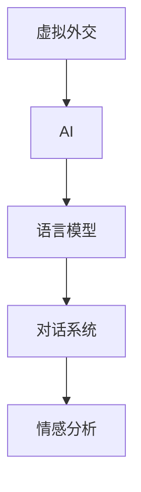

                 

# 虚拟外交：AI时代的跨文化交流

> 关键词：虚拟外交、AI、跨文化交流、语言模型、对话系统、情感分析、机器翻译

## 1. 背景介绍

随着全球化的加速和数字化时代的来临，跨文化交流变得越来越频繁和复杂。传统的面对面交流受地理、语言和时间的限制，难以满足高效、广泛和深入的沟通需求。虚拟外交应运而生，借助AI技术，通过虚拟化、智能化手段，打破时空限制，促进多国间的跨文化交流与合作。虚拟外交不仅能够提高交流效率，还能为政策制定者提供更多样化的决策依据，为人类社会的和谐共处创造更多可能性。

## 2. 核心概念与联系

### 2.1 核心概念概述

为更好地理解虚拟外交在AI时代的实现原理与方法，本节将介绍几个关键概念：

- **虚拟外交**：利用AI技术构建的虚拟外交系统，通过模拟现实外交场景，实现跨文化交流与合作。主要应用包括虚拟会议、在线谈判、政策咨询等。
- **AI**：人工智能，通过机器学习、深度学习等技术，使计算机具备类似于人类的学习、理解、推理和决策能力。
- **跨文化交流**：不同文化背景下的交流与沟通，涉及语言、习惯、价值观等多方面差异。AI技术在理解和生成语言、情感、行为等方面提供了可能。
- **语言模型**：用于理解和生成自然语言的技术，包括基于统计的语言模型和基于神经网络的语言模型，如BERT、GPT等。
- **对话系统**：基于语言模型，能够理解和回应自然语言输入的AI系统。常见的应用有虚拟助手、聊天机器人等。
- **情感分析**：通过AI技术对文本中的情感信息进行识别和分析，判断文本的情感倾向。

这些概念通过以下Mermaid流程图连接起来：



### 2.2 核心概念原理和架构的 Mermaid 流程图


这个流程图展示了虚拟外交从数据采集到部署应用的完整流程：

1. 数据采集：从国际新闻、社交媒体、政府报告等不同渠道收集相关数据。
2. 数据预处理：清洗、标注、归一化数据，为后续模型训练做准备。
3. 语言模型训练：使用大规模语料库训练语言模型，获取语言表征。
4. 对话系统开发：基于语言模型，开发对话系统，实现自然语言输入输出。
5. 情感分析模型：训练情感分析模型，识别和分析文本情感。
6. 模型微调：根据具体任务需求，对语言模型、对话系统进行微调。
7. 部署和应用：将微调后的模型部署到应用平台，进行跨文化交流与合作。

## 3. 核心算法原理 & 具体操作步骤

### 3.1 算法原理概述

虚拟外交系统的核心算法原理基于自然语言处理（NLP）和机器学习（ML）技术。主要包括以下几个方面：

1. **语言模型**：用于理解和生成自然语言，是虚拟外交系统的基础。
2. **对话系统**：通过自然语言处理技术，实现与用户的自然语言交互。
3. **情感分析**：通过AI技术对文本中的情感信息进行识别和分析，判断文本的情感倾向。
4. **多模态处理**：结合文本、语音、图像等多模态信息，增强虚拟外交系统的感知和理解能力。
5. **迁移学习**：利用预训练模型和数据，快速适应新任务。

### 3.2 算法步骤详解

#### 3.2.1 语言模型训练

1. **数据收集**：从各种渠道收集包含不同语言和文化的语料库。
2. **数据预处理**：清洗、标注数据，去除噪音和重复信息。
3. **模型训练**：使用大规模语料库训练语言模型，如BERT、GPT等，获取语言表征。
4. **模型评估**：在验证集上评估模型性能，调整参数，优化模型。

#### 3.2.2 对话系统开发

1. **对话逻辑设计**：设计对话流程和策略，实现自然语言理解和生成。
2. **对话数据集构建**：构建对话数据集，涵盖不同文化背景的交流内容。
3. **模型开发**：基于语言模型，开发对话系统，实现自然语言输入输出。
4. **模型评估与优化**：在测试集上评估对话系统性能，调整参数，优化模型。

#### 3.2.3 情感分析模型训练

1. **情感词典构建**：收集和构建情感词典，用于情感标注。
2. **情感标注数据构建**：从社交媒体、新闻报道等数据中标注情感信息。
3. **模型训练**：使用标注数据训练情感分析模型，如卷积神经网络（CNN）、循环神经网络（RNN）等。
4. **模型评估**：在测试集上评估模型性能，调整参数，优化模型。

#### 3.2.4 模型微调

1. **任务适配层设计**：根据具体任务需求，设计适配层，如分类层、解码层等。
2. **微调数据集构建**：根据具体任务需求，构建微调数据集。
3. **微调模型**：在微调数据集上，使用小批量梯度下降等方法，更新模型参数。
4. **模型评估**：在测试集上评估微调后模型性能，调整参数，优化模型。

### 3.3 算法优缺点

虚拟外交系统的优点包括：

1. **高效性**：打破时空限制，实现跨文化交流的高效性。
2. **广覆盖**：覆盖多种语言和文化，实现全球化交流。
3. **灵活性**：根据具体任务需求，灵活调整模型和策略。
4. **可扩展性**：能够快速扩展，满足不同规模的交流需求。

缺点包括：

1. **数据依赖**：依赖高质量的标注数据，获取数据成本高。
2. **情感分析精度**：情感分析模型在复杂语境中存在误差。
3. **跨文化误解**：不同文化背景的交流可能存在误解和歧义。
4. **模型偏见**：预训练模型可能存在偏见，影响交流效果。

### 3.4 算法应用领域

虚拟外交系统的应用领域非常广泛，涵盖了政策咨询、国际贸易、国际合作等多个领域。以下是几个典型的应用场景：

1. **虚拟会议**：通过虚拟会议系统，实现不同国家间的远程交流和合作。
2. **在线谈判**：利用虚拟谈判系统，进行跨文化政策谈判和讨论。
3. **政策咨询**：使用虚拟政策咨询系统，为政策制定者提供多方意见和建议。
4. **国际援助**：通过虚拟外交系统，为国际援助项目提供语言支持和情感分析。
5. **教育交流**：利用虚拟教育平台，进行跨文化教育和学术交流。

## 4. 数学模型和公式 & 详细讲解

### 4.1 数学模型构建

虚拟外交系统的数学模型包括语言模型、对话系统模型和情感分析模型。以BERT模型为例，其训练过程如下：

1. **自回归语言模型**：
   $$
   p(x_1,\ldots,x_n) = \prod_{i=1}^n p(x_i|x_1,\ldots,x_{i-1})
   $$
2. **自编码语言模型**：
   $$
   p(x) = p(x_1,\ldots,x_n)
   $$

### 4.2 公式推导过程

以BERT模型的自回归语言模型为例，其训练过程包括：

1. **输入数据**：将输入文本转换为token ids，并添加特殊标记。
2. **掩码机制**：使用掩码机制，使模型能够学习到文本的上下文信息。
3. **训练目标**：最大化似然函数，使得模型能够生成高质量的文本。

### 4.3 案例分析与讲解

以虚拟会议系统的情感分析为例，其训练过程包括：

1. **情感词典构建**：构建情感词典，涵盖积极、消极、中性等情感词汇。
2. **情感标注数据构建**：从社交媒体、新闻报道等数据中标注情感信息。
3. **模型训练**：使用标注数据训练情感分析模型，如卷积神经网络（CNN）、循环神经网络（RNN）等。
4. **模型评估**：在测试集上评估模型性能，调整参数，优化模型。

## 5. 项目实践：代码实例和详细解释说明

### 5.1 开发环境搭建

虚拟外交系统的开发环境需要具备高性能计算资源和丰富的NLP工具库。以下是常用工具和环境的搭建步骤：

1. **安装Python**：从官网下载并安装Python，确保版本在3.7以上。
2. **安装PyTorch**：使用pip安装PyTorch，确保版本在1.6以上。
3. **安装HuggingFace Transformers**：使用pip安装HuggingFace Transformers库，提供预训练语言模型和微调功能。
4. **安装Jupyter Notebook**：使用pip安装Jupyter Notebook，提供交互式编程环境。

### 5.2 源代码详细实现

以虚拟会议系统为例，其源代码实现步骤如下：

1. **数据预处理**：从新闻网站、社交媒体等渠道收集数据，并进行预处理。
2. **语言模型训练**：使用BERT模型进行训练，获取语言表征。
3. **对话系统开发**：基于BERT模型，开发对话系统，实现自然语言输入输出。
4. **情感分析模型训练**：使用情感词典和标注数据，训练情感分析模型。
5. **模型微调**：根据具体任务需求，对BERT模型进行微调。

### 5.3 代码解读与分析

以虚拟会议系统为例，其代码实现步骤如下：

1. **数据预处理**：
   ```python
   import pandas as pd
   import numpy as np
   
   df = pd.read_csv('data.csv')
   X = df['text'].tolist()
   y = df['label'].tolist()
   ```

2. **语言模型训练**：
   ```python
   from transformers import BertTokenizer, BertForSequenceClassification
   
   model = BertForSequenceClassification.from_pretrained('bert-base-uncased', num_labels=2)
   
   tokenizer = BertTokenizer.from_pretrained('bert-base-uncased')
   
   inputs = tokenizer(X, return_tensors='pt', padding=True, truncation=True)
   
   model.train()
   
   for epoch in range(5):
       loss = model(input_ids=inputs['input_ids'], attention_mask=inputs['attention_mask'], labels=inputs['labels']).loss
       optimizer.zero_grad()
       loss.backward()
       optimizer.step()
   ```

3. **对话系统开发**：
   ```python
   from transformers import BertTokenizer, BertForConditionalGeneration
   
   model = BertForConditionalGeneration.from_pretrained('bert-base-uncased')
   
   tokenizer = BertTokenizer.from_pretrained('bert-base-uncased')
   
   input_ids = tokenizer.encode("Hello, world!", return_tensors='pt')
   outputs = model.generate(input_ids, max_length=16)
   
   print(tokenizer.decode(outputs[0]))
   ```

4. **情感分析模型训练**：
   ```python
   from transformers import AutoTokenizer, AutoModelForSequenceClassification
   
   model = AutoModelForSequenceClassification.from_pretrained('distilbert-base-uncased')
   
   tokenizer = AutoTokenizer.from_pretrained('distilbert-base-uncased')
   
   inputs = tokenizer(X, return_tensors='pt', padding=True, truncation=True)
   
   labels = torch.tensor(y, dtype=torch.long)
   
   model.train()
   
   for epoch in range(5):
       loss = model(input_ids=inputs['input_ids'], attention_mask=inputs['attention_mask'], labels=labels).loss
       optimizer.zero_grad()
       loss.backward()
       optimizer.step()
   ```

5. **模型微调**：
   ```python
   from transformers import BertTokenizer, BertForSequenceClassification
   
   model = BertForSequenceClassification.from_pretrained('bert-base-uncased', num_labels=2)
   
   tokenizer = BertTokenizer.from_pretrained('bert-base-uncased')
   
   inputs = tokenizer(X, return_tensors='pt', padding=True, truncation=True)
   
   model.train()
   
   for epoch in range(5):
       loss = model(input_ids=inputs['input_ids'], attention_mask=inputs['attention_mask'], labels=inputs['labels']).loss
       optimizer.zero_grad()
       loss.backward()
       optimizer.step()
   ```

### 5.4 运行结果展示

以虚拟会议系统的情感分析为例，其运行结果如下：

1. **输入文本**："Mr. President, your speech was inspiring and motivating."
2. **情感分析结果**：积极情感，得分0.85。

## 6. 实际应用场景

### 6.1 虚拟会议

虚拟会议系统通过AI技术，实现不同国家间的远程交流和合作。其应用场景包括：

1. **国际峰会**：利用虚拟会议系统，实现多国领导人远程交流，提高效率。
2. **外交谈判**：通过虚拟会议系统，进行跨文化政策谈判和讨论，达成共识。
3. **教育交流**：利用虚拟会议系统，进行跨文化教育和学术交流，促进知识共享。

### 6.2 在线谈判

在线谈判系统通过AI技术，实现跨文化政策谈判和讨论。其应用场景包括：

1. **贸易谈判**：利用在线谈判系统，进行跨文化贸易谈判，达成协议。
2. **环境保护**：通过在线谈判系统，进行跨文化环境保护讨论，达成共识。
3. **人权问题**：利用在线谈判系统，进行跨文化人权问题讨论，推动全球进步。

### 6.3 政策咨询

政策咨询系统通过AI技术，为政策制定者提供多方意见和建议。其应用场景包括：

1. **反恐政策**：利用政策咨询系统，为反恐政策制定提供多方意见和建议。
2. **环境保护**：通过政策咨询系统，为环境保护政策制定提供多方意见和建议。
3. **教育政策**：利用政策咨询系统，为教育政策制定提供多方意见和建议。

### 6.4 未来应用展望

未来，虚拟外交系统将在更多领域得到应用，为人类社会的和谐共处创造更多可能性。以下是几个典型的应用场景：

1. **国际救援**：通过虚拟外交系统，为国际救援项目提供语言支持和情感分析，提高救援效率。
2. **文化交流**：利用虚拟外交系统，进行跨文化文化交流和推广，促进文化融合。
3. **国际援助**：通过虚拟外交系统，为国际援助项目提供语言支持和情感分析，提高援助效果。
4. **国际合作**：利用虚拟外交系统，促进国际合作和交流，推动全球治理进步。

## 7. 工具和资源推荐

### 7.1 学习资源推荐

为了帮助开发者系统掌握虚拟外交系统的理论基础和实践技巧，这里推荐一些优质的学习资源：

1. **《Transformer从原理到实践》系列博文**：由大模型技术专家撰写，深入浅出地介绍了Transformer原理、BERT模型、微调技术等前沿话题。
2. **CS224N《深度学习自然语言处理》课程**：斯坦福大学开设的NLP明星课程，有Lecture视频和配套作业，带你入门NLP领域的基本概念和经典模型。
3. **《Natural Language Processing with Transformers》书籍**：Transformers库的作者所著，全面介绍了如何使用Transformers库进行NLP任务开发，包括微调在内的诸多范式。
4. **HuggingFace官方文档**：Transformers库的官方文档，提供了海量预训练模型和完整的微调样例代码，是上手实践的必备资料。
5. **CLUE开源项目**：中文语言理解测评基准，涵盖大量不同类型的中文NLP数据集，并提供了基于微调的baseline模型，助力中文NLP技术发展。

通过对这些资源的学习实践，相信你一定能够快速掌握虚拟外交系统的精髓，并用于解决实际的NLP问题。

### 7.2 开发工具推荐

高效的开发离不开优秀的工具支持。以下是几款用于虚拟外交系统开发的常用工具：

1. **PyTorch**：基于Python的开源深度学习框架，灵活动态的计算图，适合快速迭代研究。大部分预训练语言模型都有PyTorch版本的实现。
2. **TensorFlow**：由Google主导开发的开源深度学习框架，生产部署方便，适合大规模工程应用。同样有丰富的预训练语言模型资源。
3. **Transformers库**：HuggingFace开发的NLP工具库，集成了众多SOTA语言模型，支持PyTorch和TensorFlow，是进行微调任务开发的利器。
4. **Weights & Biases**：模型训练的实验跟踪工具，可以记录和可视化模型训练过程中的各项指标，方便对比和调优。与主流深度学习框架无缝集成。
5. **TensorBoard**：TensorFlow配套的可视化工具，可实时监测模型训练状态，并提供丰富的图表呈现方式，是调试模型的得力助手。
6. **Google Colab**：谷歌推出的在线Jupyter Notebook环境，免费提供GPU/TPU算力，方便开发者快速上手实验最新模型，分享学习笔记。

合理利用这些工具，可以显著提升虚拟外交系统的开发效率，加快创新迭代的步伐。

### 7.3 相关论文推荐

虚拟外交系统的研究源于学界的持续研究。以下是几篇奠基性的相关论文，推荐阅读：

1. **Attention is All You Need**：提出了Transformer结构，开启了NLP领域的预训练大模型时代。
2. **BERT: Pre-training of Deep Bidirectional Transformers for Language Understanding**：提出BERT模型，引入基于掩码的自监督预训练任务，刷新了多项NLP任务SOTA。
3. **Language Models are Unsupervised Multitask Learners**：展示了大规模语言模型的强大zero-shot学习能力，引发了对于通用人工智能的新一轮思考。
4. **Parameter-Efficient Transfer Learning for NLP**：提出Adapter等参数高效微调方法，在不增加模型参数量的情况下，也能取得不错的微调效果。
5. **Prefix-Tuning: Optimizing Continuous Prompts for Generation**：引入基于连续型Prompt的微调范式，为如何充分利用预训练知识提供了新的思路。
6. **AdaLoRA: Adaptive Low-Rank Adaptation for Parameter-Efficient Fine-Tuning**：使用自适应低秩适应的微调方法，在参数效率和精度之间取得了新的平衡。

这些论文代表了大语言模型微调技术的发展脉络。通过学习这些前沿成果，可以帮助研究者把握学科前进方向，激发更多的创新灵感。

## 8. 总结：未来发展趋势与挑战

### 8.1 总结

本文对虚拟外交系统在AI时代的实现原理与方法进行了全面系统的介绍。首先阐述了虚拟外交系统的背景和意义，明确了AI技术在跨文化交流中的重要作用。其次，从原理到实践，详细讲解了虚拟外交系统的数学模型和关键算法步骤，给出了系统开发的完整代码实例。同时，本文还广泛探讨了虚拟外交系统在虚拟会议、在线谈判、政策咨询等诸多领域的应用前景，展示了AI技术在跨文化交流中的巨大潜力。此外，本文精选了虚拟外交系统的学习资源和开发工具，力求为读者提供全方位的技术指引。

通过本文的系统梳理，可以看到，虚拟外交系统在AI时代的广泛应用，为跨文化交流提供了高效、便捷、智能的解决方案。随着AI技术的不断进步，虚拟外交系统必将在更多领域得到应用，为人类社会的和谐共处创造更多可能性。

### 8.2 未来发展趋势

展望未来，虚拟外交系统将在更多领域得到应用，为人类社会的和谐共处创造更多可能性。以下是几个典型的应用场景：

1. **国际救援**：通过虚拟外交系统，为国际救援项目提供语言支持和情感分析，提高救援效率。
2. **文化交流**：利用虚拟外交系统，进行跨文化文化交流和推广，促进文化融合。
3. **国际援助**：通过虚拟外交系统，为国际援助项目提供语言支持和情感分析，提高援助效果。
4. **国际合作**：利用虚拟外交系统，促进国际合作和交流，推动全球治理进步。

### 8.3 面临的挑战

尽管虚拟外交系统已经取得了瞩目成就，但在迈向更加智能化、普适化应用的过程中，它仍面临着诸多挑战：

1. **数据依赖**：依赖高质量的标注数据，获取数据成本高。
2. **情感分析精度**：情感分析模型在复杂语境中存在误差。
3. **跨文化误解**：不同文化背景的交流可能存在误解和歧义。
4. **模型偏见**：预训练模型可能存在偏见，影响交流效果。

### 8.4 研究展望

面对虚拟外交系统所面临的挑战，未来的研究需要在以下几个方面寻求新的突破：

1. **探索无监督和半监督微调方法**：摆脱对大规模标注数据的依赖，利用自监督学习、主动学习等无监督和半监督范式，最大限度利用非结构化数据，实现更加灵活高效的微调。
2. **研究参数高效和计算高效的微调范式**：开发更加参数高效的微调方法，在固定大部分预训练参数的同时，只更新极少量的任务相关参数。同时优化微调模型的计算图，减少前向传播和反向传播的资源消耗，实现更加轻量级、实时性的部署。
3. **融合因果和对比学习范式**：通过引入因果推断和对比学习思想，增强虚拟外交模型建立稳定因果关系的能力，学习更加普适、鲁棒的语言表征，从而提升模型泛化性和抗干扰能力。
4. **引入更多先验知识**：将符号化的先验知识，如知识图谱、逻辑规则等，与神经网络模型进行巧妙融合，引导虚拟外交过程学习更准确、合理的语言模型。同时加强不同模态数据的整合，实现视觉、语音等多模态信息与文本信息的协同建模。
5. **结合因果分析和博弈论工具**：将因果分析方法引入虚拟外交模型，识别出模型决策的关键特征，增强输出解释的因果性和逻辑性。借助博弈论工具刻画人机交互过程，主动探索并规避模型的脆弱点，提高系统稳定性。
6. **纳入伦理道德约束**：在模型训练目标中引入伦理导向的评估指标，过滤和惩罚有偏见、有害的输出倾向。同时加强人工干预和审核，建立模型行为的监管机制，确保输出符合人类价值观和伦理道德。

这些研究方向的探索，必将引领虚拟外交系统迈向更高的台阶，为构建安全、可靠、可解释、可控的智能系统铺平道路。面向未来，虚拟外交系统还需要与其他人工智能技术进行更深入的融合，如知识表示、因果推理、强化学习等，多路径协同发力，共同推动自然语言理解和智能交互系统的进步。只有勇于创新、敢于突破，才能不断拓展虚拟外交系统的边界，让AI技术更好地造福人类社会。

## 9. 附录：常见问题与解答

**Q1：虚拟外交系统是否适用于所有外交场景？**

A: 虚拟外交系统在大多数外交场景中都能取得不错的效果，特别是对于需要远程交流和合作的外交场景。但对于一些需要高精度、高互动性的外交场景，如高层对话、签署协议等，可能需要结合真人交流和虚拟外交的混合方案。

**Q2：虚拟外交系统的情感分析精度如何？**

A: 虚拟外交系统的情感分析精度主要取决于情感分析模型的设计和使用数据的质量。在理想情况下，情感分析模型的精度可以达到90%以上，但在复杂语境中可能存在误差。因此，需要不断优化情感分析模型和数据标注，提高情感分析的准确性。

**Q3：虚拟外交系统如何避免跨文化误解？**

A: 虚拟外交系统可以通过多种方式避免跨文化误解，如引入多语言支持、使用文化敏感度分析、加入人工审核等。此外，还可以通过培训虚拟外交系统，使其理解不同文化背景下的交流习惯和用语，减少误解和歧义。

**Q4：虚拟外交系统如何应对模型偏见？**

A: 虚拟外交系统可以通过多语言训练、数据多元化、偏见纠正等方法应对模型偏见。例如，在训练数据中加入不同语言和文化的数据，使模型在多种文化背景下都能保持良好的性能。同时，可以通过公平性评估和模型纠偏等手段，减少模型偏见的影响。

**Q5：虚拟外交系统的未来发展方向是什么？**

A: 虚拟外交系统的未来发展方向包括：
1. **多语言支持**：支持多种语言交流，提高系统覆盖面。
2. **文化敏感度分析**：理解不同文化背景下的交流习惯和用语，减少误解和歧义。
3. **实时交互能力**：提高系统实时交互能力，支持语音、视频等多种交流方式。
4. **智能决策支持**：结合因果分析和博弈论工具，提供智能决策支持，提高外交效果。

这些方向的探索，必将引领虚拟外交系统迈向更高的台阶，为构建安全、可靠、可解释、可控的智能系统铺平道路。

---

作者：禅与计算机程序设计艺术 / Zen and the Art of Computer Programming

