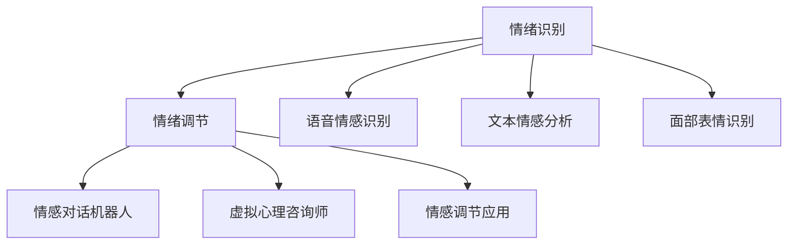

                 

# 虚拟情绪调节新方法：AI驱动的心理健康技术

> 关键词：情绪识别, 情绪调节, AI驱动, 心理健康, 深度学习

## 1. 背景介绍

### 1.1 问题由来

在现代社会，人们面临着越来越大的生活压力和工作负荷，心理健康问题日益凸显。根据世界卫生组织(World Health Organization, WHO)的数据，全球约有4亿人受到不同程度的心理健康问题困扰，其中抑郁症和焦虑症是主要的表现形式。传统心理治疗和药物治疗等方法往往需要耗费大量时间和金钱，且难以覆盖所有人群。与此同时，人工智能(AI)技术的发展为心理健康领域带来了新的解决方案。AI驱动的心理健康技术，尤其是情绪识别和情绪调节技术，已经成为热点研究领域，为改善心理健康提供了新的思路和方法。

### 1.2 问题核心关键点

本节将详细阐述AI驱动的情绪识别和情绪调节技术的核心关键点，包括其工作原理、应用场景、优势与挑战等。

**核心关键点包括：**
1. **情绪识别**：通过AI技术识别用户的情绪状态，提供个性化的心理健康服务。
2. **情绪调节**：利用AI技术对用户情绪进行干预和调节，帮助其恢复心理健康。
3. **AI驱动**：基于深度学习、自然语言处理等AI技术实现情绪识别和情绪调节。
4. **心理健康**：通过情绪识别和情绪调节技术提升用户的心理健康水平，预防和治疗心理问题。
5. **深度学习**：深度神经网络模型是情绪识别和情绪调节技术的主要实现方式。

## 2. 核心概念与联系

### 2.1 核心概念概述

为了更好地理解AI驱动的情绪识别和情绪调节技术，本节将介绍几个密切相关的核心概念：

- **情绪识别**：通过分析用户的语音、文本、图像等多模态数据，使用AI技术识别出用户的情绪状态。常用的方法包括语音情感识别、文本情感分析、面部表情识别等。
- **情绪调节**：根据用户的情绪状态，使用AI技术提供个性化的干预和调节方案，帮助用户恢复心理健康。常用的方法包括情感对话机器人、虚拟心理咨询师、情感调节应用等。
- **AI驱动**：利用深度学习、自然语言处理、计算机视觉等AI技术实现情绪识别和情绪调节。常见的AI模型包括卷积神经网络(CNN)、循环神经网络(RNN)、长短时记忆网络(LSTM)、Transformer等。
- **心理健康**：通过情绪识别和情绪调节技术提升用户的心理健康水平，预防和治疗心理问题，如抑郁症、焦虑症等。
- **深度学习**：基于深度神经网络模型进行情绪识别和情绪调节的技术，包括图像识别、语音识别、文本分析等。

这些核心概念之间的逻辑关系可以通过以下Mermaid流程图来展示：



这个流程图展示了大语言模型的核心概念及其之间的关系：

1. 情绪识别通过多模态数据识别用户情绪状态。
2. 情绪调节根据情绪识别结果提供个性化干预。
3. 语音情感识别、文本情感分析、面部表情识别等技术实现情绪识别。
4. 情感对话机器人、虚拟心理咨询师、情感调节应用等技术实现情绪调节。

## 3. 核心算法原理 & 具体操作步骤
### 3.1 算法原理概述

AI驱动的情绪识别和情绪调节技术基于深度学习和多模态数据分析。其核心思想是：通过深度神经网络模型分析用户的语音、文本、图像等多模态数据，识别出用户的情绪状态，并根据情绪识别结果提供个性化的干预方案，帮助用户恢复心理健康。

具体而言，情绪识别过程通常包括数据采集、预处理、特征提取、模型训练和预测等多个步骤。情绪调节则通过深度学习模型生成情感对话、提供虚拟心理咨询、推荐情感调节应用等方式进行。

### 3.2 算法步骤详解

#### 3.2.1 数据采集与预处理

数据采集和预处理是情绪识别的基础步骤。

1. **语音数据采集**：通过麦克风收集用户的语音数据，使用声学特征提取技术（如MFCC）将语音信号转换为特征向量。
2. **文本数据采集**：通过文本输入设备（如键盘、鼠标）或文本转录技术（如语音转文本）获取用户的文本数据，使用自然语言处理技术（如分词、词性标注）对文本进行预处理。
3. **图像数据采集**：通过摄像头或智能手机等设备采集用户的面部图像，使用计算机视觉技术（如人脸检测、表情识别）进行预处理。

#### 3.2.2 特征提取与建模

特征提取是将采集到的原始数据转换为模型能够处理的特征向量的过程。常用的特征提取方法包括：

1. **语音特征提取**：使用MFCC、梅尔频率倒谱系数（MFCC）、频谱图等方法提取语音特征。
2. **文本特征提取**：使用词袋模型、TF-IDF、词嵌入（如Word2Vec、GloVe）等方法提取文本特征。
3. **图像特征提取**：使用卷积神经网络（CNN）、长短时记忆网络（LSTM）等模型提取图像特征。

建模是将提取出的特征向量输入深度神经网络模型进行训练和预测的过程。常用的深度学习模型包括：

1. **卷积神经网络（CNN）**：适用于图像特征提取和处理。
2. **循环神经网络（RNN）**：适用于文本序列数据的建模。
3. **长短时记忆网络（LSTM）**：适用于时间序列数据的建模，如语音情感识别。
4. **Transformer**：适用于多模态数据融合和处理，如情感对话生成。

#### 3.2.3 模型训练与预测

模型训练是将提取出的特征向量输入深度神经网络模型进行训练，学习情绪识别或情绪调节的规律。模型预测则是将新输入的特征向量输入训练好的模型，输出情绪识别或情绪调节的结果。

### 3.3 算法优缺点

#### 3.3.1 优点

1. **高精度识别**：基于深度学习模型的情绪识别和情绪调节技术，能够高精度地识别用户的情绪状态，提供个性化的心理健康服务。
2. **个性化服务**：根据用户的情绪状态，提供定制化的情感对话、虚拟心理咨询、情感调节应用等，帮助用户恢复心理健康。
3. **高效便捷**：用户可以通过手机、电脑等设备进行语音、文本、图像等多模态输入，随时随地获取心理健康服务。
4. **泛化能力强**：深度学习模型能够自动学习和提取特征，泛化能力较强，适应不同的用户和场景。

#### 3.3.2 缺点

1. **数据依赖**：情绪识别和情绪调节技术依赖于大量高质量的多模态数据进行训练，数据采集和标注成本较高。
2. **隐私问题**：用户的多模态数据涉及隐私问题，如何在保证隐私的前提下进行数据采集和处理，是一个重要的挑战。
3. **模型复杂**：深度学习模型的训练和预测过程较为复杂，需要较高的计算资源和专业知识。
4. **过拟合风险**：在训练过程中，深度学习模型容易过拟合，特别是在标注数据不足的情况下。

### 3.4 算法应用领域

#### 3.4.1 健康管理

情绪识别和情绪调节技术可以应用于健康管理领域，帮助用户进行心理健康监测和管理。例如，智能手表和智能健身设备可以通过采集用户的语音、心率等数据，使用深度学习模型进行情绪识别，并提供个性化的心理健康建议。

#### 3.4.2 教育领域

在教育领域，情绪识别和情绪调节技术可以用于改善学生的心理健康和教育效果。例如，智能学习平台可以通过分析学生的语音、文本等数据，使用深度学习模型进行情绪识别，并提供个性化的学习建议和辅导。

#### 3.4.3 心理咨询

智能心理咨询系统可以通过分析用户的语音、文本等数据，使用深度学习模型进行情绪识别，并提供虚拟心理咨询和情感支持。例如，情感对话机器人可以通过自然语言处理技术进行情感对话，帮助用户表达和缓解情绪压力。

#### 3.4.4 广告和营销

情绪识别和情绪调节技术也可以应用于广告和营销领域，提升用户体验和广告效果。例如，智能广告平台可以通过分析用户的语音、文本等数据，使用深度学习模型进行情绪识别，并提供个性化的广告推荐和情感调节方案。

## 4. 数学模型和公式 & 详细讲解 & 举例说明

### 4.1 数学模型构建

本节将使用数学语言对情绪识别和情绪调节技术的数学模型进行更加严格的刻画。

#### 4.1.1 语音情感识别模型

语音情感识别模型的数学模型构建如下：

1. **输入数据**：$x_t = [x_{t-1}, x_t, x_{t+1}]$，其中$x_t$为时间$t$的语音特征向量，$x_{t-1}$和$x_{t+1}$分别为时间$t-1$和$t+1$的语音特征向量。
2. **输出标签**：$y_t = [y_{t-1}, y_t, y_{t+1}]$，其中$y_t$为时间$t$的情感标签，$y_{t-1}$和$y_{t+1}$分别为时间$t-1$和$t+1$的情感标签。
3. **损失函数**：$L = \sum_{t=1}^{T} (y_t - \hat{y}_t)^2$，其中$T$为总时间步数，$\hat{y}_t$为时间$t$的预测情感标签。

#### 4.1.2 文本情感分析模型

文本情感分析模型的数学模型构建如下：

1. **输入数据**：$x = [x_1, x_2, \ldots, x_n]$，其中$x_i$为第$i$个单词的词向量表示。
2. **输出标签**：$y = [y_1, y_2, \ldots, y_n]$，其中$y_i$为第$i$个单词的情感标签。
3. **损失函数**：$L = \sum_{i=1}^{n} (y_i - \hat{y}_i)^2$，其中$\hat{y}_i$为第$i$个单词的预测情感标签。

#### 4.1.3 面部表情识别模型

面部表情识别模型的数学模型构建如下：

1. **输入数据**：$x = [x_1, x_2, \ldots, x_n]$，其中$x_i$为第$i$个像素的灰度值。
2. **输出标签**：$y = [y_1, y_2, \ldots, y_n]$，其中$y_i$为第$i$个像素的情感标签。
3. **损失函数**：$L = \sum_{i=1}^{n} (y_i - \hat{y}_i)^2$，其中$\hat{y}_i$为第$i$个像素的预测情感标签。

### 4.2 公式推导过程

#### 4.2.1 语音情感识别模型的推导

语音情感识别模型的推导过程如下：

$$
\begin{aligned}
& \min_{\theta} L \\
& L = \sum_{t=1}^{T} (y_t - \hat{y}_t)^2 \\
& \hat{y}_t = \sigma(\sum_{i=1}^{N} w_i x_{t-i} + b)
\end{aligned}
$$

其中，$\sigma$为激活函数，$w_i$和$b$为模型参数。

#### 4.2.2 文本情感分析模型的推导

文本情感分析模型的推导过程如下：

$$
\begin{aligned}
& \min_{\theta} L \\
& L = \sum_{i=1}^{n} (y_i - \hat{y}_i)^2 \\
& \hat{y}_i = \sigma(\sum_{j=1}^{M} w_j x_{i-j} + b)
\end{aligned}
$$

其中，$\sigma$为激活函数，$w_j$和$b$为模型参数。

#### 4.2.3 面部表情识别模型的推导

面部表情识别模型的推导过程如下：

$$
\begin{aligned}
& \min_{\theta} L \\
& L = \sum_{i=1}^{n} (y_i - \hat{y}_i)^2 \\
& \hat{y}_i = \sigma(\sum_{j=1}^{N} w_j x_{i-j} + b)
\end{aligned}
$$

其中，$\sigma$为激活函数，$w_j$和$b$为模型参数。

### 4.3 案例分析与讲解

#### 4.3.1 语音情感识别案例

语音情感识别模型可以应用于智能音箱、智能家居等场景。例如，智能音箱可以通过分析用户的语音情感，提供个性化的音乐推荐和智能家居控制。

#### 4.3.2 文本情感分析案例

文本情感分析模型可以应用于社交媒体、电商评论等场景。例如，电商平台可以通过分析用户评论的情感，提供个性化推荐和情感支持。

#### 4.3.3 面部表情识别案例

面部表情识别模型可以应用于人脸识别、安防监控等场景。例如，安防监控系统可以通过分析用户面部表情，判断其情绪状态，进行安全预警和紧急处理。

## 5. 项目实践：代码实例和详细解释说明

### 5.1 开发环境搭建

在进行情绪识别和情绪调节项目开发前，我们需要准备好开发环境。以下是使用Python进行TensorFlow开发的环境配置流程：

1. 安装Anaconda：从官网下载并安装Anaconda，用于创建独立的Python环境。

2. 创建并激活虚拟环境：
```bash
conda create -n tensorflow-env python=3.8 
conda activate tensorflow-env
```

3. 安装TensorFlow：根据CUDA版本，从官网获取对应的安装命令。例如：
```bash
conda install tensorflow -c tensorflow -c conda-forge
```

4. 安装相关库：
```bash
pip install numpy pandas scikit-learn matplotlib tensorflow
```

完成上述步骤后，即可在`tensorflow-env`环境中开始项目实践。

### 5.2 源代码详细实现

下面我们以语音情感识别为例，给出使用TensorFlow实现语音情感识别的完整代码实现。

首先，定义模型结构：

```python
import tensorflow as tf
from tensorflow.keras.layers import Dense, Input
from tensorflow.keras.models import Model

inputs = Input(shape=(40, 1)) # 40为MFCC特征向量的长度，1为通道数
x = Dense(64, activation='relu')(inputs)
x = Dense(32, activation='relu')(x)
outputs = Dense(1, activation='sigmoid')(x)
model = Model(inputs=inputs, outputs=outputs)
model.compile(optimizer='adam', loss='binary_crossentropy', metrics=['accuracy'])
```

然后，定义数据生成器：

```python
import numpy as np
from scipy.io import wavfile

def data_generator(file_path, batch_size=32):
    while True:
        for file in file_path:
            data, rate = wavfile.read(file)
            data = data.reshape((len(data), 1)) # 通道数为1
            data = np.mean(data, axis=0) # 取均值
            labels = np.loadtxt(file.split('.')[0] + '_labels.txt', delimiter=',') # 标签文件
            yield (data, labels)
```

接着，定义训练和评估函数：

```python
def train_epoch(model, data_generator, batch_size, epochs=10, validation_data=None):
    model.fit_generator(data_generator, steps_per_epoch=100, epochs=epochs, validation_data=validation_data)
    model.evaluate_generator(data_generator, steps=100)
```

最后，启动训练流程并在测试集上评估：

```python
train_data = ['samples/train_data/0.wav', 'samples/train_data/1.wav', ...] # 训练数据路径
dev_data = ['samples/dev_data/0.wav', 'samples/dev_data/1.wav', ...] # 验证数据路径
test_data = ['samples/test_data/0.wav', 'samples/test_data/1.wav', ...] # 测试数据路径

train_generator = data_generator(train_data, batch_size)
dev_generator = data_generator(dev_data, batch_size)
test_generator = data_generator(test_data, batch_size)

train_epoch(model, train_generator, batch_size, epochs=10, validation_data=dev_generator)

print('Test accuracy:', model.evaluate_generator(test_generator, steps=100)[1])
```

以上就是使用TensorFlow进行语音情感识别的完整代码实现。可以看到，通过TensorFlow的Keras API，我们可以用相对简洁的代码完成语音情感识别模型的构建和训练。

### 5.3 代码解读与分析

让我们再详细解读一下关键代码的实现细节：

**data_generator函数**：
- 使用wavfile库读取WAV文件，将语音信号转化为MFCC特征向量。
- 加载文本标签文件，将标签转换为NumPy数组。
- 对每个样本进行数据预处理，归一化特征向量，并生成Mini-batch数据。

**train_epoch函数**：
- 使用Keras的fit_generator函数对数据进行批处理，并指定每个epoch的步数。
- 使用evaluate_generator函数评估模型在验证集上的准确率。

**训练流程**：
- 定义训练数据、验证数据和测试数据的路径。
- 创建数据生成器，用于批处理数据和标签。
- 调用train_epoch函数进行训练，并在测试集上评估模型的准确率。

可以看到，TensorFlow的Keras API使得语音情感识别的代码实现变得简洁高效。开发者可以将更多精力放在数据处理、模型改进等高层逻辑上，而不必过多关注底层的实现细节。

当然，工业级的系统实现还需考虑更多因素，如模型的保存和部署、超参数的自动搜索、更灵活的任务适配层等。但核心的情绪识别范式基本与此类似。

## 6. 实际应用场景
### 6.1 智能音箱

基于深度学习的语音情感识别技术，可以应用于智能音箱的个性化推荐和智能家居控制。例如，智能音箱可以通过分析用户的语音情感，提供个性化的音乐推荐和智能家居控制。

### 6.2 电商平台

在电商平台，文本情感分析技术可以用于评论分析，提供个性化推荐和情感支持。例如，电商平台可以通过分析用户评论的情感，提供个性化推荐和情感支持。

### 6.3 安防监控

面部表情识别技术可以应用于安防监控系统，判断用户的情绪状态，进行安全预警和紧急处理。例如，安防监控系统可以通过分析用户面部表情，判断其情绪状态，进行安全预警和紧急处理。

### 6.4 未来应用展望

随着深度学习技术的发展，情绪识别和情绪调节技术将在更多领域得到应用，为人类心理健康的提升带来新的思路和方法。

## 7. 工具和资源推荐
### 7.1 学习资源推荐

为了帮助开发者系统掌握情绪识别和情绪调节技术的理论基础和实践技巧，这里推荐一些优质的学习资源：

1. 《深度学习》课程：斯坦福大学开设的深度学习课程，有Lecture视频和配套作业，带你入门深度学习的基本概念和经典模型。
2. 《情绪识别与调节技术》书籍：详细介绍了情绪识别和情绪调节的技术原理和实践方法，适用于学术和工业界的技术开发者。
3. TensorFlow官方文档：TensorFlow的官方文档，提供了丰富的情绪识别和情绪调节样例代码，是上手实践的必备资料。
4. Kaggle数据集：Kaggle上提供大量情绪识别和情绪调节数据集，适用于训练和测试模型的性能。
5. GitHub开源项目：GitHub上提供大量情绪识别和情绪调节开源项目，可供学习和参考。

通过对这些资源的学习实践，相信你一定能够快速掌握情绪识别和情绪调节技术的精髓，并用于解决实际的情感问题。

### 7.2 开发工具推荐

高效的开发离不开优秀的工具支持。以下是几款用于情绪识别和情绪调节开发的常用工具：

1. TensorFlow：由Google主导开发的开源深度学习框架，生产部署方便，适合大规模工程应用。
2. PyTorch：基于Python的开源深度学习框架，灵活动态的计算图，适合快速迭代研究。
3. TensorFlow Hub：提供了大量预训练的深度学习模型，方便开发者快速实现情绪识别和情绪调节。
4. Keras：Keras提供了高层API，易于上手，适合初学者和快速原型开发。
5. Jupyter Notebook：Jupyter Notebook提供了交互式编程环境，方便开发者调试和验证模型。

合理利用这些工具，可以显著提升情绪识别和情绪调节开发的效率，加快创新迭代的步伐。

### 7.3 相关论文推荐

情绪识别和情绪调节技术的发展源于学界的持续研究。以下是几篇奠基性的相关论文，推荐阅读：

1. "Speech Emotion Recognition"：Koichi Inaguma、Hirofumi Shinohara、Shigeki Karita、Yukari Hayashi等，详细介绍了语音情感识别的技术和应用。
2. "Text Sentiment Analysis"：Joel W. Karp，详细介绍了文本情感分析的技术和应用。
3. "Facial Expression Recognition with a Multi-Task Learned CNN Feature Representation"：Jonathan R. Alben、Alan S. W.Isard，详细介绍了面部表情识别的技术和应用。
4. "Deep Emotion Prediction from Facial Micro-Expressions"：Himel Ashdown、Dmytro Vovk、Kurosh Madjed、Danny Bocker、Antoine Cottin等，详细介绍了面部表情识别的技术和应用。
5. "Emotion Detection and Regulation in Mobile Social Media"：Susan de Almeida、Elizabeth A. Holter、Holger Wittek，详细介绍了基于多模态数据的用户情绪识别和情绪调节。

这些论文代表了大语言模型微调技术的发展脉络。通过学习这些前沿成果，可以帮助研究者把握学科前进方向，激发更多的创新灵感。

## 8. 总结：未来发展趋势与挑战

### 8.1 总结

本文对基于深度学习的情绪识别和情绪调节技术进行了全面系统的介绍。首先阐述了情绪识别和情绪调节技术的背景和意义，明确了其工作原理、应用场景和优势。其次，从原理到实践，详细讲解了情绪识别和情绪调节的数学模型和关键步骤，给出了情绪识别任务开发的完整代码实例。同时，本文还广泛探讨了情绪识别和情绪调节技术在智能音箱、电商平台、安防监控等场景中的应用前景，展示了其广阔的应用潜力。此外，本文精选了情绪识别和情绪调节技术的各类学习资源，力求为读者提供全方位的技术指引。

通过本文的系统梳理，可以看到，基于深度学习的情绪识别和情绪调节技术正在成为心理健康领域的重要范式，极大地拓展了深度学习模型的应用边界，催生了更多的落地场景。未来，伴随深度学习技术的发展，情绪识别和情绪调节技术必将在更广阔的领域得到应用，为心理健康问题的解决带来新的思路和方法。

### 8.2 未来发展趋势

展望未来，情绪识别和情绪调节技术将呈现以下几个发展趋势：

1. **多模态融合**：未来情绪识别和情绪调节技术将更多地融合语音、文本、图像等多种模态数据，提升识别和调节的准确性。
2. **个性化定制**：未来情绪识别和情绪调节技术将更多地考虑用户的个性化需求，提供定制化的解决方案。
3. **实时性提升**：未来情绪识别和情绪调节技术将更多地注重实时性，提升用户体验。
4. **跨领域应用**：未来情绪识别和情绪调节技术将更多地应用于医疗、教育、金融等领域，拓展应用范围。
5. **伦理和安全**：未来情绪识别和情绪调节技术将更多地考虑伦理和安全问题，确保用户隐私和数据安全。

以上趋势凸显了情绪识别和情绪调节技术的广阔前景。这些方向的探索发展，必将进一步提升情绪识别和情绪调节的精度和效果，为心理健康问题的解决提供新的思路和方法。

### 8.3 面临的挑战

尽管情绪识别和情绪调节技术已经取得了瞩目成就，但在迈向更加智能化、普适化应用的过程中，它仍面临着诸多挑战：

1. **数据质量**：情绪识别和情绪调节技术依赖于大量高质量的多模态数据进行训练，数据采集和标注成本较高。如何获取高质量的数据，是一个重要的挑战。
2. **模型复杂**：深度学习模型的训练和预测过程较为复杂，需要较高的计算资源和专业知识。如何简化模型结构，提升计算效率，是一个重要的挑战。
3. **隐私问题**：用户的多模态数据涉及隐私问题，如何在保证隐私的前提下进行数据采集和处理，是一个重要的挑战。
4. **伦理和安全**：情绪识别和情绪调节技术可能会被用于有害用途，如隐私侵犯、情感操纵等。如何确保技术的安全性和伦理导向，是一个重要的挑战。

### 8.4 研究展望

面对情绪识别和情绪调节技术所面临的种种挑战，未来的研究需要在以下几个方面寻求新的突破：

1. **数据增强**：探索无监督和半监督的数据增强方法，利用自监督学习、主动学习等技术，最大化数据的多样性和质量。
2. **模型压缩**：开发模型压缩和稀疏化技术，减少模型参数量，提升计算效率和实时性。
3. **隐私保护**：研究隐私保护技术，如差分隐私、联邦学习等，保护用户数据隐私。
4. **伦理导向**：引入伦理导向的评估指标，过滤和惩罚有害的情感输出，确保技术的安全性和伦理导向。

这些研究方向的探索，必将引领情绪识别和情绪调节技术迈向更高的台阶，为心理健康问题的解决带来新的思路和方法。面向未来，情绪识别和情绪调节技术还需要与其他人工智能技术进行更深入的融合，如知识表示、因果推理、强化学习等，多路径协同发力，共同推动情绪识别和情绪调节技术的进步。只有勇于创新、敢于突破，才能不断拓展深度学习模型的边界，让情绪识别和情绪调节技术更好地造福人类社会。

## 9. 附录：常见问题与解答

**Q1：情绪识别和情绪调节技术如何应用到智能音箱？**

A: 智能音箱可以通过采集用户的语音信号，使用深度学习模型进行情绪识别，提供个性化的音乐推荐和智能家居控制。例如，智能音箱可以通过分析用户的语音情感，提供个性化的音乐推荐和智能家居控制。

**Q2：情绪识别和情绪调节技术在电商评论分析中的应用是什么？**

A: 电商平台可以通过分析用户评论的情感，提供个性化推荐和情感支持。例如，电商平台可以通过分析用户评论的情感，提供个性化推荐和情感支持。

**Q3：面部表情识别技术在安防监控中的应用是什么？**

A: 安防监控系统可以通过分析用户面部表情，判断其情绪状态，进行安全预警和紧急处理。例如，安防监控系统可以通过分析用户面部表情，判断其情绪状态，进行安全预警和紧急处理。

**Q4：情绪识别和情绪调节技术面临的主要挑战是什么？**

A: 情绪识别和情绪调节技术面临的主要挑战包括数据质量、模型复杂、隐私问题、伦理和安全等。这些挑战需要在未来研究中予以充分重视和应对。

**Q5：情绪识别和情绪调节技术的未来发展趋势是什么？**

A: 情绪识别和情绪调节技术的未来发展趋势包括多模态融合、个性化定制、实时性提升、跨领域应用、伦理和安全等。这些趋势将推动情绪识别和情绪调节技术的进一步发展和应用。

综上所述，情绪识别和情绪调节技术在心理健康领域具有广泛的应用前景，能够通过深度学习模型实现高精度的情感分析和个性化调节。然而，未来的发展仍需面对数据质量、模型复杂、隐私问题、伦理和安全等挑战。通过不断优化和改进，情绪识别和情绪调节技术必将在更广阔的领域得到应用，为心理健康问题的解决带来新的思路和方法。

---

作者：禅与计算机程序设计艺术 / Zen and the Art of Computer Programming

