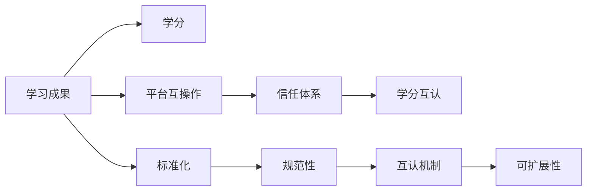

                 

## 1. 背景介绍

### 1.1 问题由来

随着全球化和技术的发展，教育的分散性和多样化特征越来越明显。虚拟教育学分互认（Virtual Education Credit Recognition, VECR）已经成为全球教育信息化发展的关键需求之一。如何通过互联网技术实现不同教育机构之间的学分互认，进而构建一个互联互通、相互认可、具有全球通用性的教育体系，是教育信息化的最终目标。

### 1.2 问题核心关键点

虚拟教育学分互认的核心问题在于如何设计一个标准化的学分认证体系，使得不同教育机构、不同国家和地区之间的教育成果能够被有效识别和互认。该体系必须考虑以下几个关键点：

1. **标准化与规范性**：确保不同教育机构提供的学习成果可以相互理解和接受。
2. **互操作性与互认机制**：建立一套互操作的技术标准，使得学习成果能够在不同的平台和系统中交换。
3. **可扩展性与灵活性**：能够灵活应对不同教育机构、不同学科和课程的需求。
4. **信任与安全**：确保学习成果的真实性和完整性，防止学术不端行为。

### 1.3 问题研究意义

虚拟教育学分互认的研究与实践，对于推动全球教育信息化、提升教育质量、促进教育公平具有重要意义。它能够：

1. **促进国际教育交流与合作**：帮助国际学生在不同国家之间进行学术迁移，增强教育资源全球共享。
2. **提升教育质量与效率**：通过学分互认，不同教育机构的课程设置和质量评估标准能够相互参考，提升整体教育质量。
3. **推动教育个性化与智能化**：通过学分互认体系，教育内容可以根据学生的需求和学习进度进行个性化推荐，提升学习效率。
4. **支持终身学习**：学分互认体系可以支持人们在不同阶段、不同平台进行学习，实现终身学习的理念。

## 2. 核心概念与联系

### 2.1 核心概念概述

虚拟教育学分互认体系涉及多个核心概念，包括但不限于：

- **学习成果（Learning Outcome）**：指学生在完成某一课程或活动后所达到的知识、技能和能力的水平。
- **学分（Credit）**：根据学习成果的质量和难度，赋予相应的学分值，表示学生的学习量和学习深度。
- **学分互认（Credit Recognition）**：在互认体系中，某一机构的学习成果可以被另一机构认可，其学分可以被转移或折算。
- **平台互操作（Platform Interoperability）**：不同平台之间通过标准化接口和数据交换机制，实现学习成果的无缝交换。
- **信任体系（Trust System）**：建立信任机制，确保学习成果的真实性和有效性。

### 2.2 核心概念联系（Mermaid 流程图）



该流程图展示了虚拟教育学分互认体系中各个概念之间的联系。通过标准化、规范性、平台互操作、信任体系和互认机制，不同教育机构的学习成果可以被有效转换和认可，从而实现学分互认。

## 3. 核心算法原理 & 具体操作步骤

### 3.1 算法原理概述

虚拟教育学分互认的核心算法原理主要基于标准化、规范化的学习成果描述框架（Learning Outcome Description Framework, LODF），通过数字证书（Digital Certificate）和区块链（Blockchain）等技术实现学分的验证和互认。

### 3.2 算法步骤详解

1. **学习成果描述与标准化**：
   - 使用LODF对学习成果进行标准化描述，包括学习目标、评估标准、技能要求等。
   - 通过LODF将学习成果转化为可机器识别的格式，便于计算机处理和交换。

2. **学分赋予与验证**：
   - 根据LODF描述的学习成果，各教育机构赋予相应的学分，并生成数字证书。
   - 数字证书包括学习成果描述、学分值、评估结果、颁发机构等信息，以公钥加密方式存储在区块链上。

3. **平台互操作与数据交换**：
   - 不同平台之间通过API接口和数据交换协议，实现学习成果和数字证书的交换和验证。
   - 采用标准化的数据交换格式（如JSON-LD），确保数据一致性和互操作性。

4. **学分互认与转移**：
   - 学生将数字证书提供给目标机构，目标机构通过区块链验证证书的真实性。
   - 目标机构根据LODF和评估标准，对学习成果进行评估，并决定是否接受学分转移。
   - 接受后，目标机构更新学习记录，并给予相应的学分。

5. **信任体系与安全性**：
   - 通过区块链技术，确保数字证书的不可篡改性和透明性。
   - 采用多机构联合验证机制，确保学习成果的真实性和完整性。
   - 建立基于加密和身份认证的信任体系，防止学术不端行为。

### 3.3 算法优缺点

**优点**：

- **标准化与规范性**：通过LODF和标准化数据交换格式，保证学习成果的描述和验证的一致性。
- **互操作性与互认机制**：区块链和API接口实现平台之间的无缝数据交换和验证。
- **信任与安全**：区块链和联合验证机制确保学习成果的真实性和完整性。

**缺点**：

- **技术复杂度**：涉及区块链、API接口、加密技术等多种技术，实现和维护复杂。
- **标准化挑战**：不同教育机构和国家的标准化工作需要协调和统一，难度较大。
- **数据隐私**：在数据交换过程中，如何保护学生的隐私和数据安全需要额外考虑。

### 3.4 算法应用领域

虚拟教育学分互认技术在以下领域有着广泛的应用前景：

- **国际教育交流**：帮助国际学生在不同国家之间进行学术迁移，促进教育资源的全球共享。
- **终身学习**：支持人们在不同阶段、不同平台进行学习，实现终身学习的理念。
- **在线教育平台**：支持不同在线教育平台之间的学习成果交换和学分互认。
- **职业教育和培训**：通过学分互认，促进职业教育和培训机构的课程互通和学分转换。
- **高等教育**：支持不同高校之间的学分互认，促进学生跨校学习和学术交流。

## 4. 数学模型和公式 & 详细讲解 & 举例说明

### 4.1 数学模型构建

虚拟教育学分互认的数学模型主要涉及学习成果的描述和验证，以及学分互认的过程。

**学习成果描述**：
- 使用LODF对学习成果进行描述，形式化表示为$\mathcal{L} = \{L_1, L_2, \ldots, L_n\}$，其中$L_i$为学习成果的子目标。
- 每个子目标可以进一步分解为技能和知识的要求，形式化表示为$L_i = (S_i, K_i)$，其中$S_i$为技能要求，$K_i$为知识要求。

**学分赋予与验证**：
- 各教育机构根据LODF描述的学习成果，赋予相应的学分$C_i$，生成数字证书$Cert_i$。
- 数字证书包含学习成果描述、学分值、评估结果、颁发机构等信息，以公钥加密方式存储在区块链上。

**学分互认与转移**：
- 学生将数字证书提供给目标机构，目标机构通过区块链验证证书的真实性$V(Cert_i)$。
- 目标机构根据LODF和评估标准，对学习成果进行评估$E(L_i)$，并决定是否接受学分转移$A_i$。

### 4.2 公式推导过程

以一个简单的学习成果描述为例，假设有三个子目标$L_1=(K_1, S_1), L_2=(K_2, S_2), L_3=(K_3, S_3)$，其中$K_i$和$S_i$分别为知识要求和技能要求。

- 假设$K_1$的评估标准为$K_1:\mathbb{R}^+$，$S_1$的评估标准为$S_1:\mathbb{R}^+$，$C_1: [0, 1]$为$L_1$的学分值。
- 同样，设$K_2,K_3,S_2,S_3,C_2,C_3$的评估标准和学分值分别为$\{K_i:\mathbb{R}^+\},\{S_i:\mathbb{R}^+\},\{C_i: [0, 1]\}$。

则学习成果的学分值$C_i$可以通过评估标准计算得到：

$$
C_i = \max\limits_{j=1}^n (a_{ij}K_j + b_{ij}S_j)
$$

其中$a_{ij}, b_{ij}$为评估标准的权重系数。

### 4.3 案例分析与讲解

以一个在线教育平台为例，该平台支持不同课程之间的学分互认。假设平台上有两个课程$A$和$B$，课程$A$的学习成果描述为$L_A=(K_A, S_A)$，课程$B$的学习成果描述为$L_B=(K_B, S_B)$。

- 平台对$L_A$和$L_B$分别赋予$C_A$和$C_B$学分。
- 假设学生修读了课程$A$，获得了$C_A=0.5$的学分。
- 学生将数字证书提供给另一课程$B$的学习平台，该平台通过区块链验证证书的真实性。
- 学习平台根据LODF和评估标准，对学习成果$L_A$进行评估，评估结果为$E(L_A)=0.8$。
- 平台决定接受$C_A$的学分转移，给予学生$C_B=0.8 \times C_A=0.4$的学分。

## 5. 项目实践：代码实例和详细解释说明

### 5.1 开发环境搭建

为了实现虚拟教育学分互认系统，需要搭建一个跨平台的学习管理系统（LMS）。开发环境搭建包括以下步骤：

1. **服务器部署**：选择高性能的服务器，如AWS、Google Cloud等，安装Nginx等Web服务器。
2. **数据库搭建**：使用MySQL或PostgreSQL，建立学分记录、学习成果描述等数据表。
3. **区块链部署**：部署区块链节点，如Ethereum、Hyperledger等。
4. **API接口搭建**：使用Flask、Django等Web框架搭建API接口，支持学习成果和数字证书的交换和验证。

### 5.2 源代码详细实现

以下是一个简化版的虚拟教育学分互认系统的代码实现，主要包含三个模块：学习成果描述、学分赋予与验证、学分互认与转移。

**学习成果描述模块**：

```python
class LearningOutcome:
    def __init__(self, id, name, description, skills, knowledge):
        self.id = id
        self.name = name
        self.description = description
        self.skills = skills
        self.knowledge = knowledge
        
    def __repr__(self):
        return f"LearningOutcome({self.id}, {self.name}, {self.description}, {self.skills}, {self.knowledge})"
```

**学分赋予与验证模块**：

```python
class CreditAssigner:
    def __init__(self, learning_outcome, credit_value):
        self.learning_outcome = learning_outcome
        self.credit_value = credit_value

    def assign_credit(self):
        # 生成数字证书
        certificate = generate_certificate(self.learning_outcome, self.credit_value)
        # 上传区块链
        upload_to_blockchain(certificate)
        return certificate

    def validate_certificate(self, certificate):
        # 验证数字证书
        is_valid = verify_certificate(certificate)
        return is_valid
```

**学分互认与转移模块**：

```python
class CreditTransfer:
    def __init__(self, certificate, credit_value):
        self.certificate = certificate
        self.credit_value = credit_value

    def transfer_credit(self):
        # 接收数字证书
        receiving_certificate = receive_certificate(self.certificate)
        # 评估学习成果
        evaluation_result = evaluate_learning_outcome(receiving_certificate)
        # 接受学分转移
        accept_credit_transfer = accept_credit(evaluation_result, self.credit_value)
        return accept_credit_transfer
```

### 5.3 代码解读与分析

以上代码实现了一个简化版的虚拟教育学分互认系统，包含学习成果描述、学分赋予与验证、学分互认与转移三个核心模块。

- **学习成果描述模块**：定义了学习成果的类，包括ID、名称、描述、技能、知识等属性。
- **学分赋予与验证模块**：实现了学习成果的学分赋予和数字证书的生成、上传区块链等功能。
- **学分互认与转移模块**：实现了学习成果的评估、学分接受等功能。

## 6. 实际应用场景

### 6.1 国际教育交流

虚拟教育学分互认体系可以应用于国际教育交流中，帮助学生在不同国家之间进行学术迁移。例如，一位中国学生修读了某大学提供的在线课程，获得了相应的学分。这些学分可以通过区块链验证并转移至另一国家的高校，用于后续的学术进修。

### 6.2 终身学习

虚拟教育学分互认体系支持人们在不同平台和阶段进行学习。例如，一位职场人士可以通过学习平台修读新的课程，获得学分。这些学分可以用于职业资格认证，支持其职业发展和终身学习。

### 6.3 在线教育平台

不同在线教育平台之间的学分互认，可以实现课程内容的互通和学分转换。例如，一个在线编程平台上的编程课程学分可以转移到另一个在线数学平台，用于数学课程的学分替代。

### 6.4 未来应用展望

未来，虚拟教育学分互认体系将在以下几个方面得到进一步的发展：

1. **多机构联合验证**：建立多机构联合验证机制，确保学习成果的真实性和完整性。
2. **跨平台互操作**：通过标准化API接口和数据交换格式，实现不同平台之间的无缝数据交换和互操作。
3. **区块链技术集成**：进一步集成区块链技术，提升数据的安全性和透明性。
4. **智能化推荐系统**：结合机器学习和AI技术，实现学习成果和课程的智能推荐，提升学习效率。
5. **跨文化适应性**：考虑不同文化背景和学习习惯的差异，设计适应性的学习成果描述和学分评估标准。

## 7. 工具和资源推荐

### 7.1 学习资源推荐

1. **LODF标准文档**：访问学习成果描述框架（LODF）的官方文档，了解LODF的详细描述和应用指南。
2. **区块链技术教程**：学习区块链技术的原理和应用，推荐区块链技术权威教程《Blockchain Basics》。
3. **API接口开发指南**：学习API接口开发技术，推荐《RESTful API Design》一书。
4. **在线学习平台案例**：参考Coursera、edX等在线教育平台的学习成果描述和学分互认案例，借鉴其实现思路。
5. **跨平台互操作标准**：学习跨平台互操作的技术标准和协议，推荐《Web Interoperability》一书。

### 7.2 开发工具推荐

1. **服务器和云服务**：使用AWS、Google Cloud、Azure等云服务，搭建高性能的虚拟教育学分互认系统。
2. **Web框架**：使用Flask、Django等Web框架，快速搭建API接口和数据库系统。
3. **区块链平台**：使用Ethereum、Hyperledger等区块链平台，实现数字证书的生成和验证。
4. **数据处理工具**：使用Apache Spark、Pandas等数据处理工具，处理学习成果和学分数据。
5. **AI和机器学习工具**：使用TensorFlow、PyTorch等AI和机器学习工具，实现学习成果的智能推荐和评估。

### 7.3 相关论文推荐

1. **虚拟教育学分互认的研究**：《Virtual Education Credit Recognition: A Survey and Outlook》，探讨虚拟教育学分互认的研究现状和未来方向。
2. **区块链在教育中的应用**：《Blockchain in Education: A Survey and Future Directions》，介绍区块链技术在教育领域的最新应用。
3. **跨平台学习成果互认**：《Cross-Platform Learning Outcome Recognition: Challenges and Opportunities》，分析跨平台学习成果互认面临的挑战和解决方案。
4. **学习成果描述框架**：《Learning Outcome Description Framework: A Review and Comparison》，对比不同学习成果描述框架的优势和不足。

## 8. 总结：未来发展趋势与挑战

### 8.1 研究成果总结

虚拟教育学分互认的研究已取得一定进展，但仍面临一些挑战。通过标准化、规范化的学习成果描述和数字证书技术，实现学分互认体系的初步构建。未来，需要在多机构联合验证、跨平台互操作、区块链技术集成等方面进行深入研究。

### 8.2 未来发展趋势

1. **多机构联合验证**：建立多机构联合验证机制，确保学习成果的真实性和完整性。
2. **跨平台互操作**：通过标准化API接口和数据交换格式，实现不同平台之间的无缝数据交换和互操作。
3. **区块链技术集成**：进一步集成区块链技术，提升数据的安全性和透明性。
4. **智能化推荐系统**：结合机器学习和AI技术，实现学习成果和课程的智能推荐，提升学习效率。
5. **跨文化适应性**：考虑不同文化背景和学习习惯的差异，设计适应性的学习成果描述和学分评估标准。

### 8.3 面临的挑战

1. **标准化挑战**：不同教育机构和国家的标准化工作需要协调和统一，难度较大。
2. **数据隐私**：在数据交换过程中，如何保护学生的隐私和数据安全需要额外考虑。
3. **技术复杂度**：涉及区块链、API接口、加密技术等多种技术，实现和维护复杂。
4. **信任体系建设**：建立基于区块链和联合验证的信任体系，确保学习成果的真实性和完整性。

### 8.4 研究展望

1. **跨文化学习成果描述**：开发适应不同文化背景的学习成果描述和评分标准，提升学习成果的可接受性和互认性。
2. **多维度学分评估**：引入多维度评估方法，如情感分析、行为评估等，全面评估学习成果的质量和深度。
3. **实时学分更新**：实现学习成果的实时更新和跟踪，支持持续学习和职业发展。
4. **跨文化适应性学习**：开发跨文化适应性的学习平台，支持不同语言和文化背景的学生进行学习。

## 9. 附录：常见问题与解答

**Q1：虚拟教育学分互认如何实现跨文化适应性？**

A: 虚拟教育学分互认的跨文化适应性可以通过以下方式实现：
1. 采用多语言学习成果描述框架，支持多种语言的学习成果描述和学分互认。
2. 引入文化敏感的评估标准和评分体系，确保不同文化背景下的学习成果可以被公平评估。
3. 设计跨文化适应性的学习路径和课程，帮助学生适应新的文化环境和学习模式。

**Q2：如何确保虚拟教育学分互认体系的安全性？**

A: 虚拟教育学分互认体系的安全性可以通过以下方式确保：
1. 采用区块链技术，确保数字证书的不可篡改性和透明性。
2. 建立多机构联合验证机制，确保学习成果的真实性和完整性。
3. 使用加密技术保护数据隐私，防止数据泄露和滥用。
4. 定期进行安全审计和风险评估，及时发现和修补系统漏洞。

**Q3：虚拟教育学分互认体系如何支持职业发展？**

A: 虚拟教育学分互认体系可以通过以下方式支持职业发展：
1. 通过学分互认，不同职业教育和培训机构的课程可以互通和转换，提升职业资格认证的灵活性和可接受性。
2. 结合机器学习和AI技术，实现学习成果的智能推荐和职业路径规划，提升职业发展的精准性和效率。
3. 提供跨平台的学习成果记录和展示，帮助求职者展示其职业学习经历和能力，提升就业竞争力。

**Q4：虚拟教育学分互认体系如何实现智能推荐？**

A: 虚拟教育学分互认体系可以通过以下方式实现智能推荐：
1. 收集学生的学习历史、兴趣偏好和行为数据，构建用户画像。
2. 使用机器学习算法，如协同过滤、内容推荐等，推荐符合学生需求和兴趣的课程和资源。
3. 结合AI技术，如深度学习、自然语言处理等，提升推荐算法的准确性和智能化程度。

**Q5：虚拟教育学分互认体系如何应对数据隐私保护？**

A: 虚拟教育学分互认体系可以通过以下方式应对数据隐私保护：
1. 采用加密技术，对学生数据进行加密存储和传输，防止数据泄露和篡改。
2. 采用匿名化技术，对学生数据进行匿名处理，保护学生隐私。
3. 建立数据访问和使用的审计机制，记录和监控数据使用情况，防止数据滥用。

---

作者：禅与计算机程序设计艺术 / Zen and the Art of Computer Programming

