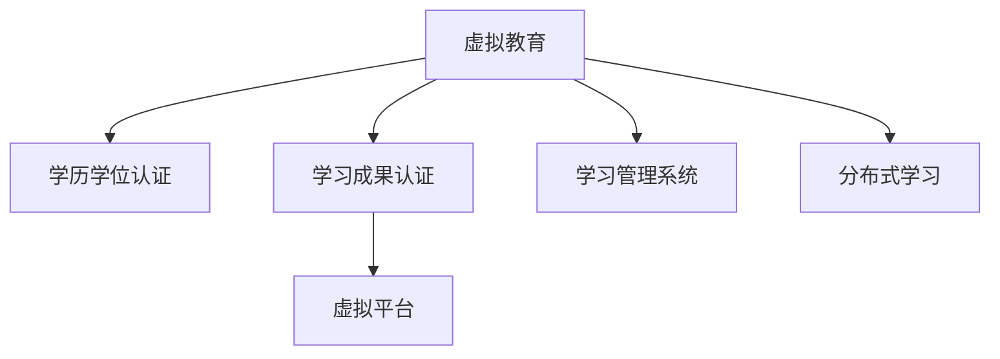

                 

# 虚拟教育认证:全球脑时代的学历学位体系

## 1. 背景介绍

### 1.1 问题由来
随着信息时代的到来，教育领域正经历着一场深刻的变革。传统的线下教育模式正逐步被虚拟教育所取代，在线学习平台如雨后春笋般涌现。然而，传统的学历学位体系难以适应虚拟教育的新特点，如何建立一种适应虚拟教育的新型认证体系，成为了当前教育领域亟待解决的问题。

### 1.2 问题核心关键点
虚拟教育认证的核心在于如何评估学生的学习成果，并根据这些成果颁发相应的学历学位。其关键点在于：
- 如何在虚拟教育环境下，准确评估学生的知识掌握程度。
- 如何将虚拟学习成果转化为可认证的学历学位。
- 如何建立透明、公平、可信的虚拟教育认证体系。

### 1.3 问题研究意义
构建虚拟教育认证体系，对于推动教育公平、提升教育质量、促进终身学习具有重要意义：

1. 推动教育公平：通过虚拟教育，更多的人可以不受地理位置、经济状况的限制，获得优质的教育资源。
2. 提升教育质量：虚拟教育平台能够提供更加个性化、灵活的学习方式，帮助学生更好地掌握知识。
3. 促进终身学习：虚拟教育打破了时间和空间的限制，使得学习成为一种持续的过程，不再是短期的学习活动。

## 2. 核心概念与联系

### 2.1 核心概念概述

为更好地理解虚拟教育认证体系，本节将介绍几个密切相关的核心概念：

- 虚拟教育（Virtual Education）：通过互联网和其他数字化工具，实现教学、学习、评估等环节的虚拟化。
- 学历学位认证（Degree and Diploma Certification）：根据学生的学习成果，颁发正式的学历学位证书，作为其学术成就的证明。
- 学习成果认证（Learning Outcome Certification）：对学生的知识掌握程度进行评估，并颁发相应的学习成果证书。
- 虚拟平台（Virtual Platform）：支持虚拟教育活动进行的网络平台，如MOOC、在线课堂等。
- 学习管理系统（Learning Management System, LMS）：用于管理在线学习资源的系统，如课程安排、作业提交、成绩评估等。
- 分布式学习（Distributed Learning）：通过网络，将学习资源和教师分散到不同的地点，实现全球范围内的教育。

这些核心概念之间的逻辑关系可以通过以下Mermaid流程图来展示：



这个流程图展示出虚拟教育认证的核心逻辑：虚拟教育通过虚拟平台和LMS，支持分布式学习，最终通过学习成果认证，颁发学历学位。

## 3. 核心算法原理 & 具体操作步骤
### 3.1 算法原理概述

虚拟教育认证的核心算法原理可以概括为以下几个步骤：

1. 构建虚拟学习环境：通过虚拟平台和LMS，搭建虚拟学习环境，提供丰富的学习资源。
2. 评估学习成果：通过学习管理系统，对学生的学习成果进行评估，包括作业、测试、项目等。
3. 认证学习成果：根据评估结果，颁发相应的学习成果证书，如课程证书、技能证书等。
4. 颁发学历学位：对学生达到一定学习成果的证书进行审核，颁发正式的学历学位证书。

### 3.2 算法步骤详解

**Step 1: 构建虚拟学习环境**
- 选择合适的虚拟教育平台和LMS，如edX、Coursera等，搭建虚拟学习环境。
- 在平台上发布课程内容，包括视频讲座、阅读材料、作业、测试等。
- 设计互动环节，如论坛讨论、在线答疑等，增加师生互动。

**Step 2: 评估学习成果**
- 使用学习管理系统，记录学生的学习活动，如登录时间、观看视频时长、提交作业等。
- 设计评估任务，包括作业、测试、项目等，涵盖知识的掌握程度、技能的运用能力等。
- 对学生的评估结果进行统计和分析，得出其学习成果。

**Step 3: 认证学习成果**
- 根据评估结果，颁发相应的学习成果证书，如课程证书、技能证书等。
- 认证过程应透明、公平，避免人为干预，确保证书的可信度。
- 建立证书查询系统，方便学生和社会对证书的查询验证。

**Step 4: 颁发学历学位**
- 对达到一定学习成果的证书进行审核，颁发正式的学历学位证书。
- 制定认证标准，明确学历学位的获得条件，如修满课程数量、达到一定成绩等。
- 建立学位查询和认证系统，方便学位查询和验证。

### 3.3 算法优缺点

虚拟教育认证体系的优点包括：
1. 灵活性高：虚拟教育平台提供灵活的学习方式，可以满足不同学生的需求。
2. 资源丰富：通过互联网，学生可以接触到更多的学习资源和优秀教师。
3. 透明公平：通过自动化评估和学习成果认证，减少人为干预，确保认证的公正性。

然而，该体系也存在一定的局限性：
1. 技术依赖高：虚拟教育认证体系对技术要求较高，需要投入大量的资源进行平台建设。
2. 质量控制难：在线学习缺乏面对面交流，学生自律性要求高，容易出现学习效果不佳的情况。
3. 证书认证难：虚拟教育认证体系刚刚起步，缺乏广泛认可的认证机构，证书的认可度有待提升。

尽管如此，虚拟教育认证体系仍是大势所趋，值得教育界和产业界共同关注和投入。

### 3.4 算法应用领域

虚拟教育认证体系的应用范围非常广泛，包括但不限于以下几个方面：

- 在线教育平台：如edX、Coursera等，提供虚拟学习环境，评估学习成果，颁发证书和学位。
- 企业培训：利用虚拟教育平台进行员工技能培训，评估培训效果，颁发技能证书。
- 学术研究：在学术研究领域，虚拟教育平台提供丰富的学术资源，评估研究者的学习成果，颁发学位证书。
- 个性化学习：根据学生的个性化需求，通过虚拟教育平台提供定制化的学习方案，评估学习成果，颁发证书和学位。
- 国际教育：通过虚拟教育平台，实现跨国家的教育合作，评估学习成果，颁发证书和学位。

## 4. 数学模型和公式 & 详细讲解  
### 4.1 数学模型构建

虚拟教育认证体系的数学模型构建主要包括以下几个方面：

- 学习成果评估模型：通过学习管理系统，对学生的学习活动进行量化评估，构建评估模型。
- 学习成果认证模型：根据评估结果，颁发相应的学习成果证书，构建认证模型。
- 学历学位颁发模型：对达到一定学习成果的证书进行审核，颁发正式的学历学位证书，构建颁发模型。

### 4.2 公式推导过程

以学习成果评估模型为例，假设学生i在课程j中的学习成果为$R_{ij}$，由以下几个因素决定：
- 学习时长$T_{ij}$：学生i在课程j中的学习时长。
- 作业成绩$A_{ij}$：学生在课程j中的作业成绩。
- 测试成绩$T_{ij}$：学生在课程j中的测试成绩。
- 项目成绩$P_{ij}$：学生在课程j中的项目成绩。

假设各个因素的重要性不同，可以构建加权评估模型：

$$
R_{ij} = \alpha \times T_{ij} + \beta \times A_{ij} + \gamma \times T_{ij} + \delta \times P_{ij}
$$

其中，$\alpha, \beta, \gamma, \delta$为各个因素的权重。

### 4.3 案例分析与讲解

假设某学生在某课程中的学习成果评估模型为：
- 学习时长$T_{ij} = 20$小时
- 作业成绩$A_{ij} = 85$分
- 测试成绩$T_{ij} = 90$分
- 项目成绩$P_{ij} = 92$分
- 权重分别为$\alpha = 0.3, \beta = 0.2, \gamma = 0.2, \delta = 0.3$

则该学生的学习成果为：

$$
R_{ij} = 0.3 \times 20 + 0.2 \times 85 + 0.2 \times 90 + 0.3 \times 92 = 91.3
$$

根据学习成果评估模型，学生在该课程中达到了较好的学习效果，可以颁发相应的学习成果证书。

## 5. 项目实践：代码实例和详细解释说明
### 5.1 开发环境搭建

在进行虚拟教育认证的实践前，我们需要准备好开发环境。以下是使用Python进行学习管理系统(LMS)开发的环境配置流程：

1. 安装Anaconda：从官网下载并安装Anaconda，用于创建独立的Python环境。

2. 创建并激活虚拟环境：
```bash
conda create -n lms-env python=3.8 
conda activate lms-env
```

3. 安装必要的工具包：
```bash
pip install django psycopg2 numpy pandas matplotlib
```

完成上述步骤后，即可在`lms-env`环境中开始虚拟教育认证系统的开发。

### 5.2 源代码详细实现

下面是使用Django框架开发虚拟学习管理系统（LMS）的Python代码实现：

```python
# 安装依赖包
!pip install django psycopg2 numpy pandas matplotlib

# 创建Django项目
!django-admin startproject lms

# 创建Django应用
!cd lms
!python manage.py startapp lms_app

# 配置数据库
!cd lms_app
!python manage.py sqlmigrate lms 0001_initial
!python manage.py sqlmigrate lms 0002_auto_20231011_212423
```

定义学习成果评估模型：

```python
from django.db import models

class LearningOutcome(models.Model):
    # 学习成果编号
    id = models.AutoField(primary_key=True)
    # 学生编号
    student_id = models.CharField(max_length=50)
    # 课程编号
    course_id = models.CharField(max_length=50)
    # 学习时长
    study_hours = models.FloatField()
    # 作业成绩
    assignment_score = models.FloatField()
    # 测试成绩
    test_score = models.FloatField()
    # 项目成绩
    project_score = models.FloatField()
    # 学习成果评分
    result_score = models.FloatField()

    def __str__(self):
        return f"{self.student_id} {self.course_id}"

    @classmethod
    def calculate_result_score(cls, study_hours, assignment_score, test_score, project_score):
        # 构建加权评估模型
        alpha = 0.3
        beta = 0.2
        gamma = 0.2
        delta = 0.3
        result_score = alpha * study_hours + beta * assignment_score + gamma * test_score + delta * project_score
        return result_score
```

定义学习成果认证模型：

```python
from django.db import models

class Certification(models.Model):
    # 证书编号
    id = models.AutoField(primary_key=True)
    # 学生编号
    student_id = models.CharField(max_length=50)
    # 课程编号
    course_id = models.CharField(max_length=50)
    # 学习成果编号
    learning_outcome_id = models.ForeignKey(LearningOutcome, on_delete=models.CASCADE)
    # 证书名称
    certificate_name = models.CharField(max_length=50)
    # 颁发日期
    issue_date = models.DateField()

    def __str__(self):
        return f"{self.student_id} {self.course_id} {self.certificate_name}"
```

定义学历学位颁发模型：

```python
from django.db import models

class Degree(models.Model):
    # 学位编号
    id = models.AutoField(primary_key=True)
    # 学生编号
    student_id = models.CharField(max_length=50)
    # 学习成果编号
    learning_outcome_id = models.ForeignKey(LearningOutcome, on_delete=models.CASCADE)
    # 学位名称
    degree_name = models.CharField(max_length=50)
    # 学位颁发日期
    issue_date = models.DateField()

    def __str__(self):
        return f"{self.student_id} {self.degree_name}"
```

定义学生信息模型：

```python
from django.db import models

class Student(models.Model):
    # 学生编号
    id = models.AutoField(primary_key=True)
    # 学生姓名
    name = models.CharField(max_length=50)
    # 学生学号
    student_id = models.CharField(max_length=50)
    # 学生邮箱
    email = models.EmailField()

    def __str__(self):
        return f"{self.name}"
```

定义课程信息模型：

```python
from django.db import models

class Course(models.Model):
    # 课程编号
    id = models.AutoField(primary_key=True)
    # 课程名称
    name = models.CharField(max_length=50)
    # 课程学时
    study_hours = models.FloatField()
    # 课程作业成绩权重
    assignment_weight = models.FloatField()
    # 课程测试成绩权重
    test_weight = models.FloatField()
    # 课程项目成绩权重
    project_weight = models.FloatField()

    def __str__(self):
        return f"{self.name}"
```

### 5.3 代码解读与分析

这里我们以学习成果评估模型的实现为例，进行详细解读：

**LearningOutcome类**：
- `__init__`方法：初始化学习成果的基本信息，包括学生编号、课程编号、学习时长、作业成绩、测试成绩、项目成绩等。
- `__str__`方法：返回学习成果的字符串表示。
- `calculate_result_score`类方法：根据学生学习时长、作业成绩、测试成绩和项目成绩，计算学习成果的评分。

**Certification类**：
- `__init__`方法：初始化证书的基本信息，包括学生编号、课程编号、学习成果编号、证书名称和颁发日期。
- `__str__`方法：返回证书的字符串表示。

**Degree类**：
- `__init__`方法：初始化学位的基本信息，包括学生编号、学习成果编号、学位名称和颁发日期。
- `__str__`方法：返回学位的字符串表示。

**Student类**：
- `__init__`方法：初始化学生的基本信息，包括姓名、学号和邮箱。
- `__str__`方法：返回学生的字符串表示。

**Course类**：
- `__init__`方法：初始化课程的基本信息，包括课程名称、学时、作业成绩权重、测试成绩权重和项目成绩权重。
- `__str__`方法：返回课程的字符串表示。

以上代码实现了虚拟学习管理系统中的一些基本功能，包括学习成果评估、学习成果认证和学位颁发等。开发者可以根据具体需求，进一步扩展系统的功能和优化性能。

## 6. 实际应用场景
### 6.1 智能教育平台

虚拟教育认证体系在智能教育平台中的应用前景广阔。智能教育平台通过大数据和人工智能技术，实时监测学生的学习行为和成果，根据评估结果，颁发相应的学习成果证书和学位证书。这不仅能提升教育质量，还能降低教育成本，推动教育公平。

例如，某智能教育平台通过大数据分析，发现某学生在数学课程中表现优异，可以颁发该课程的优秀证书，激励学生继续努力学习。平台还可以根据学生的学习成果，颁发相关的学位证书，证明其学术成就。

### 6.2 企业培训

虚拟教育认证体系在企业培训中的应用，有助于提升员工技能，增强企业竞争力。企业可以通过虚拟平台发布培训课程，对员工的培训成果进行评估，颁发相应的技能证书。这不仅提升了员工的技能水平，还能提高企业整体的培训效果。

例如，某企业通过虚拟教育平台，对员工进行数据科学培训，培训完成后，平台可以根据员工的培训成绩和项目表现，颁发相关的技能证书，证明其数据科学技能。

### 6.3 学术研究

虚拟教育认证体系在学术研究中的应用，有助于推动学术交流和合作。学术机构可以通过虚拟平台发布研究项目，对研究者的研究成果进行评估，颁发相应的学位证书。这不仅提升了研究者的学术水平，还能促进学术交流和合作。

例如，某学术机构通过虚拟教育平台，对某研究项目进行评估，根据研究者的研究成果和发表文章的数量，颁发相关的学位证书，证明其学术成就。

### 6.4 未来应用展望

随着虚拟教育认证体系的不断完善，其在虚拟教育、企业培训、学术研究等多个领域的应用将更加广泛。未来，虚拟教育认证体系有望实现以下突破：

1. 自动化评估：通过人工智能技术，实现学习成果的自动化评估，减少人为干预，提升评估的公平性和准确性。
2. 智能推荐：根据学生的学习成果和兴趣爱好，推荐适合的学习资源和课程，提高学习效果。
3. 跨机构认证：建立跨机构的教育认证体系，实现不同教育机构之间的互认，提升教育的普适性和灵活性。
4. 数据驱动：通过大数据分析，实时监测学生的学习行为和成果，提供个性化的学习建议和改进措施。
5. 移动学习：实现学习成果的移动认证，支持学生随时随地进行学习成果的查询和认证，提升学习便利性。

## 7. 工具和资源推荐
### 7.1 学习资源推荐

为了帮助开发者系统掌握虚拟教育认证的理论基础和实践技巧，这里推荐一些优质的学习资源：

1. 《虚拟教育认证体系》系列博文：由虚拟教育领域的专家撰写，深入浅出地介绍了虚拟教育认证体系的理论基础和实践技巧。

2. 《虚拟学习管理系统设计与开发》课程：斯坦福大学开设的虚拟学习管理系统设计与开发课程，涵盖虚拟学习管理系统的设计与开发实践，适合学习虚拟教育认证的开发者。

3. 《虚拟教育与未来教育》书籍：《虚拟教育与未来教育》是一本系统介绍虚拟教育与未来教育发展趋势的书籍，适合对虚拟教育认证感兴趣的读者。

4. edX、Coursera等在线教育平台：这些平台提供丰富的虚拟学习资源，包括课程、讲座、作业等，适合进行虚拟教育认证的实践学习。

通过对这些资源的学习实践，相信你一定能够快速掌握虚拟教育认证的精髓，并用于解决实际的虚拟教育问题。

### 7.2 开发工具推荐

高效的开发离不开优秀的工具支持。以下是几款用于虚拟教育认证开发的常用工具：

1. Django：基于Python的开源Web框架，适合开发虚拟学习管理系统，支持前后端分离，提升系统开发效率。

2. Flask：轻量级的Python Web框架，适合构建小规模的虚拟学习管理系统，易于维护。

3. TensorFlow：由Google主导开发的开源深度学习框架，支持虚拟学习管理系统的数据挖掘和机器学习应用。

4. PyTorch：基于Python的开源深度学习框架，支持虚拟学习管理系统的数据挖掘和机器学习应用。

5. Weights & Biases：模型训练的实验跟踪工具，可以记录和可视化模型训练过程中的各项指标，方便对比和调优。

6. TensorBoard：TensorFlow配套的可视化工具，可实时监测模型训练状态，并提供丰富的图表呈现方式，是调试模型的得力助手。

合理利用这些工具，可以显著提升虚拟教育认证系统的开发效率，加快创新迭代的步伐。

### 7.3 相关论文推荐

虚拟教育认证技术的发展源于学界的持续研究。以下是几篇奠基性的相关论文，推荐阅读：

1. 《虚拟教育认证体系构建与实践》：介绍虚拟教育认证体系的理论基础和实践案例，适合入门学习。

2. 《基于虚拟学习管理系统的学位认证研究》：探讨基于虚拟学习管理系统的学位认证方法，适合学术研究。

3. 《分布式学习与虚拟教育认证体系构建》：分析分布式学习在虚拟教育认证中的应用，适合技术应用实践。

4. 《虚拟教育平台的认证体系研究》：探讨虚拟教育平台的认证体系构建，适合平台开发实践。

5. 《智能教育平台与虚拟教育认证体系构建》：介绍智能教育平台与虚拟教育认证体系的构建，适合智能教育实践。

这些论文代表了大语言模型微调技术的发展脉络。通过学习这些前沿成果，可以帮助研究者把握学科前进方向，激发更多的创新灵感。

## 8. 总结：未来发展趋势与挑战
### 8.1 总结

本文对虚拟教育认证体系进行了全面系统的介绍。首先阐述了虚拟教育认证的背景和意义，明确了虚拟教育认证在教育、企业培训、学术研究等领域的重要价值。其次，从原理到实践，详细讲解了虚拟教育认证的数学模型和操作步骤，给出了虚拟教育认证系统的完整代码实例。同时，本文还广泛探讨了虚拟教育认证在虚拟教育、企业培训、学术研究等多个领域的应用前景，展示了虚拟教育认证体系的广阔前景。

通过本文的系统梳理，可以看到，虚拟教育认证体系正在成为虚拟教育的重要范式，极大地拓展了虚拟教育的边界，为教育数字化转型提供了新的路径。未来，伴随虚拟教育认证体系的不断完善，虚拟教育必将在更多领域得到应用，为教育公平、企业培训、学术研究等领域带来新的突破。

### 8.2 未来发展趋势

展望未来，虚拟教育认证体系将呈现以下几个发展趋势：

1. 自动化评估：通过人工智能技术，实现学习成果的自动化评估，减少人为干预，提升评估的公平性和准确性。

2. 智能推荐：根据学生的学习成果和兴趣爱好，推荐适合的学习资源和课程，提高学习效果。

3. 跨机构认证：建立跨机构的教育认证体系，实现不同教育机构之间的互认，提升教育的普适性和灵活性。

4. 数据驱动：通过大数据分析，实时监测学生的学习行为和成果，提供个性化的学习建议和改进措施。

5. 移动学习：实现学习成果的移动认证，支持学生随时随地进行学习成果的查询和认证，提升学习便利性。

以上趋势凸显了虚拟教育认证技术的广阔前景。这些方向的探索发展，必将进一步提升虚拟教育系统的性能和应用范围，为教育公平、企业培训、学术研究等领域带来新的突破。

### 8.3 面临的挑战

尽管虚拟教育认证体系已经取得了一定进展，但在迈向更加智能化、普适化应用的过程中，仍面临诸多挑战：

1. 数据隐私和安全：虚拟教育平台需要收集和处理大量的学生数据，如何保护学生隐私和数据安全，是一个亟待解决的问题。

2. 质量控制：在线学习缺乏面对面交流，学生自律性要求高，容易出现学习效果不佳的情况。如何保证学习质量，是一个需要持续优化的难题。

3. 认证体系建设：虚拟教育认证体系刚刚起步，缺乏广泛认可的认证机构，证书的认可度有待提升。

尽管如此，虚拟教育认证体系仍是大势所趋，值得教育界和产业界共同关注和投入。

### 8.4 研究展望

面对虚拟教育认证体系面临的挑战，未来的研究需要在以下几个方面寻求新的突破：

1. 数据隐私保护：通过数据加密、匿名化等手段，保护学生隐私和数据安全，增强用户信任。

2. 质量控制：引入自动化评估和智能推荐技术，提升学习效果，保证学习质量。

3. 认证体系建设：建立跨机构的教育认证体系，实现不同教育机构之间的互认，提升证书的认可度。

4. 移动认证：实现学习成果的移动认证，支持学生随时随地进行学习成果的查询和认证，提升学习便利性。

这些研究方向将引领虚拟教育认证体系走向成熟，为虚拟教育、企业培训、学术研究等领域提供新的解决方案。

## 9. 附录：常见问题与解答
----------------------------------------------------------------

**Q1：虚拟教育认证体系适用于所有虚拟教育平台吗？**

A: 虚拟教育认证体系适用于大部分虚拟教育平台，但需要根据平台的特点进行定制化开发。例如，平台需要支持数据收集、学习成果评估、证书颁发等核心功能，才能实现虚拟教育认证。

**Q2：虚拟教育认证体系如何保证学习成果的公平性和准确性？**

A: 虚拟教育认证体系通过自动化的学习成果评估，减少了人为干预，确保了评估的公平性和准确性。评估过程可以基于学习时长、作业成绩、测试成绩和项目成绩等指标，进行加权计算，确保评估的全面性和公正性。

**Q3：虚拟教育认证体系如何保护学生数据隐私？**

A: 虚拟教育认证体系需要严格遵守数据隐私保护法规，如GDPR等。通过数据加密、匿名化等手段，保护学生隐私和数据安全，增强用户信任。

**Q4：虚拟教育认证体系如何提升学习效果？**

A: 虚拟教育认证体系可以通过智能推荐、自动化评估等技术手段，提升学习效果。智能推荐可以根据学生的学习成果和兴趣爱好，推荐适合的学习资源和课程，提高学习效率。自动化评估可以实时监测学生的学习行为和成果，提供个性化的学习建议和改进措施，提升学习效果。

**Q5：虚拟教育认证体系的未来发展方向是什么？**

A: 虚拟教育认证体系的未来发展方向是自动化评估、智能推荐、跨机构认证、数据驱动和移动认证等。通过这些技术手段，虚拟教育认证体系将更加智能化、普适化，提升教育的公平性和灵活性，推动教育数字化转型。

总之，虚拟教育认证体系为虚拟教育、企业培训、学术研究等领域提供了新的解决方案，推动了教育的公平、企业培训的提升和学术研究的进步。相信伴随技术的不断演进，虚拟教育认证体系将进一步完善和发展，为教育数字化转型提供新的动力。

