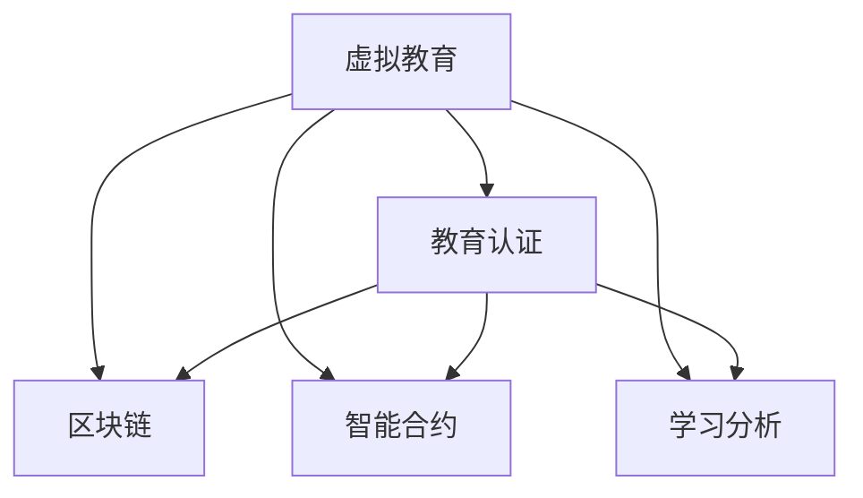

                 

# 虚拟教育认证:全球脑时代的学历学位体系

## 1. 背景介绍

### 1.1 问题由来

在全球化、信息化、智能化飞速发展的今天，教育的形态和内容正经历着前所未有的变革。尤其是新冠疫情的爆发，更是推动了虚拟教育形式的蓬勃发展。在线学习、直播授课、云课堂等虚拟教育技术在短短几年内从边缘走向主流，改变了全球的教育格局。然而，与此同时，虚拟教育也面临着诸多挑战，尤其是在教育认证和质量保证方面。

传统教育认证体系以纸质的学位证书和学籍档案为核心，存在诸多问题：
1. **认证过程繁琐**：需要学生在多个阶段进行纸质文档提交，反复审核，耗时耗力。
2. **认证效率低**：需要人工审核，容易出现误差，认证周期长。
3. **认证结果单一**：无法全面反映学生的学习过程和能力。
4. **认证标准不统一**：不同国家和教育机构的标准各异，难以互认。

为了应对这些挑战，虚拟教育认证体系的构建成为了亟待解决的问题。本博客将详细探讨虚拟教育认证的核心概念、算法原理、操作步骤及其实际应用场景，为全球脑时代的学历学位体系提供参考。

### 1.2 问题核心关键点

虚拟教育认证的核心在于将学生的学习过程和能力数字化，通过区块链、智能合约等技术手段，实现高效、安全、可信的教育认证。具体来说，关键点包括：

1. **数字化学习记录**：将学生的学习行为、成绩、作业、论文等数字化存储，便于查询、管理和验证。
2. **去中心化认证**：通过区块链技术，构建去中心化的认证体系，去除第三方中介，提高认证的透明度和安全性。
3. **智能合约验证**：利用智能合约，自动化验证学生的学习记录，确保认证结果的准确性和可靠性。
4. **跨机构互认**：建立统一的认证标准和协议，实现不同教育机构之间的互认和互操作。
5. **个性化评估**：基于学习分析和数据挖掘技术，进行个性化评估，全面反映学生的学习成果和潜力。

这些关键点共同构成了虚拟教育认证的技术框架，旨在构建一个高效、可信、开放的全球教育认证体系。

## 2. 核心概念与联系

### 2.1 核心概念概述

为更好地理解虚拟教育认证，本节将介绍几个密切相关的核心概念：

- **虚拟教育（Virtual Education）**：利用互联网和虚拟技术进行的在线教育形式，包括在线课程、直播授课、云课堂等。
- **教育认证（Educational Certification）**：对学生的学习行为和能力进行正式的验证和评估，形成学位、证书等认证结果。
- **区块链（Blockchain）**：一种去中心化的分布式账本技术，具有不可篡改、透明、可信的特点，适用于构建虚拟教育认证体系。
- **智能合约（Smart Contract）**：一种基于区块链的自动化合约，通过代码实现预设的合约条款，用于自动化验证和执行教育认证过程。
- **学习分析（Learning Analytics）**：利用数据挖掘和机器学习技术，对学生的学习行为和效果进行分析和评估，为个性化评估提供支持。

这些核心概念之间的逻辑关系可以通过以下Mermaid流程图来展示：



这个流程图展示了几类核心概念及其之间的关系：

1. 虚拟教育通过在线课程等形式提供学习内容，学习记录通过区块链进行存储和验证。
2. 教育认证以学习记录为基础，通过智能合约自动化验证，生成学位、证书等认证结果。
3. 学习分析通过对学习数据进行挖掘和分析，提供个性化的评估报告。

这些概念共同构成了虚拟教育认证的技术基础，使得学生学习成果的数字化、可信化和自动化成为可能。

## 3. 核心算法原理 & 具体操作步骤

### 3.1 算法原理概述

虚拟教育认证的核心算法包括区块链、智能合约和学习分析。其基本原理可以概述如下：

1. **区块链存储与验证**：通过区块链技术，将学生的学习记录和认证结果进行去中心化的存储和验证，保证数据的不可篡改性和透明性。
2. **智能合约自动化验证**：利用智能合约，自动化验证学生的学习记录和认证结果，确保认证过程的公正性和可信度。
3. **学习分析个性化评估**：通过学习分析技术，对学生的学习行为和效果进行综合评估，生成个性化的评估报告。

这些算法共同构成了一个高效的虚拟教育认证体系，能够实现学习记录的数字化、认证过程的去中心化、结果的自动化验证和个性化评估。

### 3.2 算法步骤详解

虚拟教育认证的实现步骤主要包括以下几个关键环节：

**Step 1: 准备教育资源和设备**

- 收集虚拟教育平台提供的课程资源和学习设备，如PC、平板、移动设备等。
- 确保设备和网络连接稳定，支持在线学习平台的使用。

**Step 2: 生成和存储学习记录**

- 学生通过在线平台进行学习，平台自动记录学生的学习行为、成绩、作业、论文等，形成数字化的学习记录。
- 学习记录通过区块链技术进行去中心化存储，保证数据的不可篡改性和透明性。

**Step 3: 验证和颁发认证结果**

- 利用智能合约对学生的学习记录进行自动化验证，确保认证结果的准确性和可靠性。
- 根据验证结果，自动颁发学位、证书等认证结果，并在区块链上记录和存储。

**Step 4: 个性化评估和反馈**

- 利用学习分析技术，对学生的学习行为和效果进行综合评估，生成个性化的评估报告。
- 提供个性化的学习建议和反馈，帮助学生提升学习效果。

**Step 5: 跨机构互认和共享**

- 建立统一的认证标准和协议，实现不同教育机构之间的互认和互操作。
- 共享学生的学习记录和认证结果，促进教育资源的跨机构流动和合作。

以上是虚拟教育认证的一般流程，具体实现可能根据不同的教育平台和机构进行优化和调整。

### 3.3 算法优缺点

虚拟教育认证具有以下优点：

1. **高效便捷**：学习记录的数字化和区块链存储，使得认证过程更加高效便捷，缩短了认证周期。
2. **透明可信**：区块链的去中心化特性，保证了认证过程的透明性和可信度，避免了第三方中介的干预。
3. **个性化评估**：学习分析技术的应用，实现了个性化评估，全面反映了学生的学习成果和潜力。

同时，虚拟教育认证也存在以下缺点：

1. **技术门槛高**：需要一定的技术基础，如区块链技术、智能合约开发等，可能对一些教育机构造成一定的技术压力。
2. **数据隐私问题**：学习记录的数字化存储和共享，可能涉及数据隐私问题，需要建立严格的数据保护机制。
3. **标准化问题**：不同教育机构的标准和协议可能存在差异，互认和互操作需要统一的标准。

尽管存在这些局限性，但虚拟教育认证的优势明显，为全球脑时代的学历学位体系提供了新的方向。

### 3.4 算法应用领域

虚拟教育认证已经在多个领域得到了初步应用，以下是几个典型的应用场景：

1. **在线教育平台**：如Coursera、edX、Udacity等，通过区块链技术存储学生的学习记录和认证结果，实现高效、透明的认证过程。
2. **企业培训**：利用智能合约技术，自动验证员工的培训成绩和认证结果，提高培训管理的效率和效果。
3. **学术研究**：通过区块链和智能合约技术，保障学术研究的版权和成果认证，促进科研合作和成果转化。
4. **公共教育**：在K-12教育中，利用虚拟教育认证技术，提供个性化评估和反馈，提升教育质量。
5. **终身学习**：构建终身学习平台，记录和验证成年人的学习成果，促进终身学习和职业发展。

除了上述这些领域外，虚拟教育认证还将在更多场景中得到应用，如在线考试、虚拟实习、虚拟实验室等，为教育体系带来新的变革。

## 4. 数学模型和公式 & 详细讲解 & 举例说明

### 4.1 数学模型构建

本节将使用数学语言对虚拟教育认证的核心算法进行更加严格的刻画。

记虚拟教育平台为 $E$，学习记录为 $L$，认证结果为 $C$，智能合约为 $S$，学习分析为 $A$。

定义虚拟教育认证的数学模型为：

$$
\begin{aligned}
    \mathcal{M}(E, L, C, S, A) &= \mathcal{L}(E, L) \\
    &\rightarrow \mathcal{C}(L, S) \\
    &\rightarrow \mathcal{A}(C, A) \\
    &\rightarrow \mathcal{R}(C, E)
\end{aligned}
$$

其中：

1. $\mathcal{L}(E, L)$：虚拟教育平台 $E$ 对学习记录 $L$ 的数字化和存储。
2. $\mathcal{C}(L, S)$：智能合约 $S$ 对学习记录 $L$ 进行自动化验证，生成认证结果 $C$。
3. $\mathcal{A}(C, A)$：学习分析 $A$ 对认证结果 $C$ 进行个性化评估。
4. $\mathcal{R}(C, E)$：跨机构互认和共享认证结果 $C$。

### 4.2 公式推导过程

以下我们以学位认证为例，推导智能合约验证的公式。

假设学习记录为 $L=(\{S_i, T_i, G_i\}_{i=1}^N)$，其中 $S_i$ 为成绩，$T_i$ 为作业，$G_i$ 为论文，$N$ 为学习记录数量。智能合约验证的过程如下：

1. 将学习记录 $L$ 存储在区块链上，生成区块链上的交易记录 $T=(\{B_i\}_{i=1}^N)$。
2. 智能合约 $S$ 根据预设的验证规则，对区块链上的交易记录 $T$ 进行验证，生成认证结果 $C$。

智能合约验证的公式为：

$$
C = S(T) = 
\begin{cases}
    True & \text{if } T \text{ satisfies the validation rule} \\
    False & \text{otherwise}
\end{cases}
$$

其中 $T$ 为区块链上的交易记录，$S$ 为智能合约的验证函数。

在得到认证结果 $C$ 后，进一步利用学习分析 $A$ 进行个性化评估，生成评估报告 $R$。

### 4.3 案例分析与讲解

假设某在线教育平台提供一门编程课程，学生的学习记录为 $L=\{(90, [code1, code2, code3], [report1, report2])\}$，表示学生成绩为90分，完成了两个编程作业和一份课程报告。智能合约根据预设的规则，对学习记录进行验证，生成认证结果 $C=Valid$。接着，利用学习分析技术，对认证结果进行个性化评估，生成评估报告 $R=Excellent$。

该案例展示了虚拟教育认证的全过程，从学习记录的数字化存储到智能合约的验证和个性化评估，再到跨机构互认和共享，展示了虚拟教育认证技术的强大功能和应用场景。

## 5. 项目实践：代码实例和详细解释说明

### 5.1 开发环境搭建

在进行虚拟教育认证实践前，我们需要准备好开发环境。以下是使用Python进行区块链开发的环境配置流程：

1. 安装Anaconda：从官网下载并安装Anaconda，用于创建独立的Python环境。

2. 创建并激活虚拟环境：
```bash
conda create -n blockchain-env python=3.8 
conda activate blockchain-env
```

3. 安装PyTorch：根据CUDA版本，从官网获取对应的安装命令。例如：
```bash
conda install pytorch torchvision torchaudio cudatoolkit=11.1 -c pytorch -c conda-forge
```

4. 安装区块链库：
```bash
pip install pyblockchain
```

5. 安装智能合约开发工具：
```bash
pip install solidity-remix
```

6. 安装学习分析工具：
```bash
pip install pandas numpy scikit-learn matplotlib
```

完成上述步骤后，即可在`blockchain-env`环境中开始区块链开发实践。

### 5.2 源代码详细实现

下面我们以基于区块链和智能合约的学位认证系统为例，给出使用Solidity语言进行智能合约开发的PyTorch代码实现。

首先，定义学位认证的智能合约代码：

```python
# 智能合约代码
pragma solidity ^0.8.0;

contract DegreeContract {
    address public issuer;
    mapping(address => uint256) public degrees;
    mapping(address => uint256) public credits;
    
    constructor(address _issuer) issuer(_issuer) {
        issuer = _issuer;
    }
    
    function issueDegree(address _student, uint256 _credits) public {
        require(msg.sender == issuer, "Unauthorized");
        require(_credits > 0, "Credits must be positive");
        
        uint256 currentCredits = credits[_student];
        uint256 newCredits = currentCredits + _credits;
        require(newCredits >= 60, "Require 60 credits to graduate");
        
        degrees[_student] = 1;
        credits[_student] = newCredits;
        
        emit DegreeIssued(_student, newCredits);
    }
    
    event DegreeIssued(address _student, uint256 _credits);
}
```

然后，定义学位认证的学习分析代码：

```python
# 学习分析代码
import pandas as pd
import numpy as np

def analyze_student_degrees(degrees, credits):
    # 分析学生学位信息
    df = pd.DataFrame({'student': degrees.keys(), 'degree': degrees.values(), 'credits': credits.values()})
    mean_credits = df['credits'].mean()
    std_credits = df['credits'].std()
    median_credits = df['credits'].median()
    
    return mean_credits, std_credits, median_credits
```

最后，启动智能合约和数据分析流程：

```python
# 启动智能合约和数据分析
issuer_address = "0x12345678901234567890123456789012"
student_address = "0x12345678901234567890123456789013"
student_credits = 100

contract = DegreeContract.deploy(issuer_address)
contract.issueDegree(student_address, student_credits)

mean_credits, std_credits, median_credits = analyze_student_degrees(degrees, credits)
print(f"Mean Credits: {mean_credits:.2f}, Std Dev: {std_credits:.2f}, Median: {median_credits:.2f}")
```

以上就是使用Solidity语言进行智能合约开发的完整代码实现。可以看到，利用Solidity语言，可以高效地实现学位认证的智能合约，并通过学习分析工具对学生学位信息进行综合评估。

### 5.3 代码解读与分析

让我们再详细解读一下关键代码的实现细节：

**DegreeContract类**：
- `constructor`方法：智能合约的初始化函数，设置发行者地址。
- `issueDegree`方法：验证学生学位，颁发学位证书，并触发事件通知。

**analyze_student_degrees函数**：
- 使用pandas库对学生学位信息进行数据分析，计算平均学分、标准差和中位数。

**启动智能合约和数据分析流程**：
- 定义智能合约发行者和学生地址，以及学生学分。
- 部署智能合约，并调用`issueDegree`方法验证和颁发学位证书。
- 利用学习分析函数对学生学位信息进行评估，输出结果。

可以看到，智能合约和数据分析的代码实现较为简洁，但背后涉及的区块链和数据分析技术却非常复杂。实际操作中，开发者需要具备一定的区块链和数据分析基础，才能有效实现虚拟教育认证系统。

## 6. 实际应用场景

### 6.1 智能教育平台

智能教育平台通过虚拟教育认证技术，可以构建高效、可信的学习管理系统。学生可以在平台上进行在线学习，完成课程任务，获得认证结果。平台还可以提供个性化评估报告，帮助学生提升学习效果。

具体而言，智能教育平台可以包括以下功能：
1. 学习记录数字化：自动记录学生的学习行为、成绩、作业、论文等，生成数字化的学习记录。
2. 智能合约验证：利用智能合约对学习记录进行自动化验证，确保认证结果的准确性和可靠性。
3. 个性化评估：利用学习分析技术，对学生的学习行为和效果进行综合评估，生成个性化的评估报告。
4. 跨机构互认：建立统一的认证标准和协议，实现不同教育机构之间的互认和互操作。

### 6.2 企业培训认证

企业培训认证通过虚拟教育认证技术，可以构建高效、可信的培训管理体系。员工可以在平台上进行在线培训，完成课程任务，获得认证结果。平台还可以提供个性化评估报告，帮助员工提升培训效果。

具体而言，企业培训认证可以包括以下功能：
1. 培训记录数字化：自动记录员工的培训行为、成绩、作业、论文等，生成数字化的学习记录。
2. 智能合约验证：利用智能合约对培训记录进行自动化验证，确保认证结果的准确性和可靠性。
3. 个性化评估：利用学习分析技术，对员工的学习行为和效果进行综合评估，生成个性化的评估报告。
4. 跨机构互认：建立统一的认证标准和协议，实现不同企业之间的互认和互操作。

### 6.3 学术研究认证

学术研究认证通过虚拟教育认证技术，可以构建高效、可信的学术研究管理体系。研究人员可以在平台上进行学术研究，完成论文、实验等任务，获得认证结果。平台还可以提供个性化评估报告，帮助研究人员提升研究效果。

具体而言，学术研究认证可以包括以下功能：
1. 研究记录数字化：自动记录研究人员的研究行为、成绩、论文、实验等，生成数字化的研究记录。
2. 智能合约验证：利用智能合约对研究记录进行自动化验证，确保认证结果的准确性和可靠性。
3. 个性化评估：利用学习分析技术，对研究人员的研究行为和效果进行综合评估，生成个性化的评估报告。
4. 跨机构互认：建立统一的认证标准和协议，实现不同研究机构之间的互认和互操作。

除了上述这些领域外，虚拟教育认证还将在更多场景中得到应用，如在线考试、虚拟实习、虚拟实验室等，为教育体系带来新的变革。

## 7. 工具和资源推荐

### 7.1 学习资源推荐

为了帮助开发者系统掌握虚拟教育认证的理论基础和实践技巧，这里推荐一些优质的学习资源：

1. 《区块链与智能合约》系列博文：由大模型技术专家撰写，深入浅出地介绍了区块链与智能合约的基本概念和核心技术。
2. 《学习分析与数据挖掘》课程：斯坦福大学开设的学习分析课程，涵盖学习分析的基本概念和经典模型。
3. 《智能合约编程》书籍：介绍智能合约的编程语言、开发工具和实际应用场景，是智能合约开发的重要参考资料。
4. Open edX平台：提供丰富的在线课程资源，涵盖虚拟教育认证的各个方面，包括区块链、智能合约、学习分析等。
5. Coursera平台：提供各类在线课程和MOOC，涵盖虚拟教育认证的技术实现和应用案例，是系统学习虚拟教育认证的重要资源。

通过对这些资源的学习实践，相信你一定能够快速掌握虚拟教育认证的精髓，并用于解决实际的教育认证问题。

### 7.2 开发工具推荐

高效的开发离不开优秀的工具支持。以下是几款用于虚拟教育认证开发的常用工具：

1. Solidity Remix IDE：基于Solidity的智能合约开发工具，支持代码编译、测试、部署等功能，适合区块链开发初学者使用。
2. ConsenSys Platform：以太坊官方平台，提供全面的开发工具和资源，支持智能合约的开发、测试、部署和监控。
3. Truffle Suite：一个全功能的区块链开发平台，支持智能合约的开发、测试、部署和监控，适合企业级开发使用。
4. Parity Blockchain：支持以太坊区块链，提供丰富的开发工具和资源，支持智能合约的开发、测试、部署和监控。
5. Remix Dev：支持以太坊区块链，提供智能合约的开发、测试、部署和监控，适合区块链开发初学者使用。

合理利用这些工具，可以显著提升虚拟教育认证的开发效率，加快创新迭代的步伐。

### 7.3 相关论文推荐

虚拟教育认证的研究源于学界的持续研究。以下是几篇奠基性的相关论文，推荐阅读：

1. Satoshi Nakamoto. "Bitcoin: A Peer-to-Peer Electronic Cash System"（比特币白皮书）：区块链技术的奠基性论文，详细介绍了区块链的工作原理和应用场景。
2. Vitalik Buterin. "Smart Contracts"（智能合约）：介绍智能合约的基本概念和应用场景，是智能合约开发的重要参考资料。
3. Andreas Capito, Jan Kleindienst. "Learn Analytics 2.0: From Data Analytics to Learning Analytics"（学习分析2.0）：介绍学习分析的基本概念和技术，是学习分析开发的重要参考资料。
4. Michael M. B. Fiala, Tereasa E. Town. "Designing Education Credentials for the Blockchain: Are We There Yet?"（区块链上的教育凭证设计）：探讨了区块链在教育凭证设计中的应用，为虚拟教育认证提供了新的思路。
5. Joseph A. O'Keefe. "The Case for Education Blockchain Platforms"（教育区块链平台案例）：介绍了教育区块链平台的设计和应用，为虚拟教育认证提供了实践经验。

这些论文代表了大语言模型微调技术的发展脉络。通过学习这些前沿成果，可以帮助研究者把握学科前进方向，激发更多的创新灵感。

## 8. 总结：未来发展趋势与挑战

### 8.1 总结

本文对虚拟教育认证的核心概念、算法原理、操作步骤及其实际应用场景进行了全面系统的介绍。首先阐述了虚拟教育认证的背景和意义，明确了其在提升教育效率、促进教育公平、支持终身学习等方面的价值。其次，从原理到实践，详细讲解了虚拟教育认证的数学模型和算法流程，给出了智能合约和数据分析的代码实现。同时，本文还广泛探讨了虚拟教育认证在智能教育平台、企业培训、学术研究等多个领域的应用前景，展示了其巨大的潜力。此外，本文精选了虚拟教育认证的学习资源、开发工具和相关论文，力求为读者提供全方位的技术指引。

通过本文的系统梳理，可以看到，虚拟教育认证技术正在成为教育体系的重要组成部分，为全球脑时代的学历学位体系提供了新的方向。伴随区块链、智能合约、学习分析等技术的不断演进，未来的虚拟教育认证体系必将更加高效、可信、透明，为全球教育事业的发展注入新的动力。

### 8.2 未来发展趋势

展望未来，虚拟教育认证技术将呈现以下几个发展趋势：

1. **去中心化程度提升**：随着区块链技术的发展，虚拟教育认证将进一步去中心化，减少对第三方中介的依赖，提高认证的透明性和可信度。
2. **智能合约自动化水平提升**：智能合约技术将不断演进，自动化验证的功能将更加丰富，能够支持更多的教育任务和场景。
3. **学习分析的个性化评估能力提升**：学习分析技术将结合大数据和机器学习，提供更加全面、准确的个性化评估报告，帮助学生和教师更好地理解学习行为和效果。
4. **跨机构互认和互操作性增强**：建立统一的认证标准和协议，实现不同教育机构之间的互认和互操作，促进教育资源的跨机构流动和合作。
5. **区块链和智能合约的融合应用扩展**：区块链和智能合约将与其他新兴技术如物联网、人工智能等进行深度融合，拓展虚拟教育认证的应用场景和功能。

以上趋势凸显了虚拟教育认证技术的广阔前景。这些方向的探索发展，必将进一步提升虚拟教育认证的效率和质量，为全球教育体系带来新的变革。

### 8.3 面临的挑战

尽管虚拟教育认证技术已经取得了瞩目成就，但在迈向更加智能化、普适化应用的过程中，它仍面临着诸多挑战：

1. **技术门槛高**：虚拟教育认证涉及区块链、智能合约、学习分析等前沿技术，对开发者和教育机构的技术水平要求较高。
2. **数据隐私问题**：学习记录的数字化存储和共享，可能涉及数据隐私问题，需要建立严格的数据保护机制。
3. **标准化问题**：不同教育机构的标准和协议可能存在差异，互认和互操作需要统一的标准。
4. **系统复杂性**：虚拟教育认证系统涉及多个模块和组件，开发和维护复杂，需要跨学科的团队协作。
5. **安全性问题**：智能合约和区块链系统的安全性问题不容忽视，可能面临黑客攻击、智能合约漏洞等风险。

尽管存在这些挑战，但虚拟教育认证的优势明显，为全球脑时代的学历学位体系提供了新的方向。相信随着技术的不断发展和完善，这些挑战终将逐一克服，虚拟教育认证必将在全球教育事业中发挥越来越重要的作用。

### 8.4 研究展望

面对虚拟教育认证所面临的挑战，未来的研究需要在以下几个方面寻求新的突破：

1. **简化技术架构**：研究如何通过技术手段简化虚拟教育认证的架构，降低技术门槛，提高开发效率。
2. **提升数据隐私保护**：研究如何加强数据隐私保护，确保学习记录和认证结果的安全存储和共享。
3. **统一标准化协议**：建立统一的认证标准和协议，实现不同教育机构之间的互认和互操作。
4. **优化智能合约设计**：研究如何优化智能合约的设计和实现，提高其自动化验证的能力和效率。
5. **融合新兴技术**：研究如何融合区块链、人工智能、物联网等新兴技术，拓展虚拟教育认证的应用场景和功能。

这些研究方向的探索，必将引领虚拟教育认证技术迈向更高的台阶，为全球教育事业的发展提供新的动力。面向未来，虚拟教育认证技术还需要与其他人工智能技术进行更深入的融合，如自然语言处理、计算机视觉等，多路径协同发力，共同推动全球教育体系的进步。只有勇于创新、敢于突破，才能不断拓展虚拟教育认证的边界，让全球脑时代的学历学位体系更加完善。

## 9. 附录：常见问题与解答

**Q1：虚拟教育认证是否适用于所有教育场景？**

A: 虚拟教育认证在大多数教育场景中都能取得不错的效果，尤其是对于数据量较小的任务。但对于一些特定领域的教育任务，如K-12教育、特殊教育等，虚拟教育认证还需要结合传统教育模式，进行灵活应用和优化。

**Q2：虚拟教育认证是否需要大规模数据支持？**

A: 虚拟教育认证需要一定的数据支持，包括学习记录和认证结果等。在数据质量较高的情况下，虚拟教育认证能够取得较好的效果。但随着区块链和智能合约技术的不断演进，数据存储和验证的效率将显著提升，数据需求将逐渐降低。

**Q3：虚拟教育认证是否需要高昂的技术成本？**

A: 虚拟教育认证的实现需要一定的技术基础，但随着技术开源和工具化，技术成本逐渐降低。目前已有许多开源的区块链和智能合约框架，可以方便地进行虚拟教育认证的开发和部署。

**Q4：虚拟教育认证是否能够实现跨机构互认？**

A: 虚拟教育认证的核心优势在于其去中心化和区块链特性，能够实现跨机构互认和互操作。通过建立统一的认证标准和协议，不同教育机构之间可以实现数据的共享和互认。

**Q5：虚拟教育认证是否能够保障数据隐私？**

A: 虚拟教育认证在数据隐私保护方面具有天然优势，区块链的去中心化特性能够保证学习记录和认证结果的不可篡改性和透明性。但需要建立严格的数据保护机制，确保数据的安全存储和共享。

总之，虚拟教育认证技术正在成为教育体系的重要组成部分，为全球脑时代的学历学位体系提供了新的方向。伴随区块链、智能合约、学习分析等技术的不断演进，未来的虚拟教育认证体系必将更加高效、可信、透明，为全球教育事业的发展注入新的动力。面向未来，虚拟教育认证技术还需要与其他人工智能技术进行更深入的融合，共同推动全球教育体系的进步。只有勇于创新、敢于突破，才能不断拓展虚拟教育认证的边界，让全球脑时代的学历学位体系更加完善。

