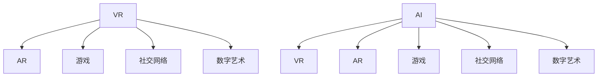

                 

# 虚拟文化：AI塑造的新型社会规范

## 1. 背景介绍

### 1.1 问题由来

在过去几十年中，人工智能(AI)技术的快速发展已经深刻地改变了人类的生产、生活方式以及社会结构。AI不仅在各个行业中带来了变革性的影响，还逐渐渗透到文化领域，塑造了一种全新的社会规范——虚拟文化(Virtual Culture)。虚拟文化是指通过AI技术在虚拟空间中形成和传播的文化现象，包括虚拟现实(VR)、增强现实(AR)、游戏、社交网络、数字艺术等。

虚拟文化的崛起，不仅反映了技术的进步，更反映了一种全新的社会形态和生活方式的诞生。人们越来越多地依赖于虚拟空间进行社交、娱乐、学习等活动，虚拟文化已经成为现代社会的重要组成部分。然而，虚拟文化的发展也带来了诸多挑战，如隐私保护、虚拟暴力、虚拟成瘾等问题，需要学界和业界共同努力解决。

### 1.2 问题核心关键点

虚拟文化的核心关键点在于AI技术在虚拟空间中的应用。虚拟文化的研究主要包括以下几个方面：

- **AI技术的应用**：虚拟文化是基于AI技术，如自然语言处理(NLP)、计算机视觉(CV)、机器学习(ML)等，在虚拟空间中形成和传播的文化现象。
- **虚拟空间与现实空间的交互**：虚拟文化不仅仅是虚拟空间内的现象，还与现实空间有密切的互动，如虚拟现实游戏、社交平台等。
- **社会影响与伦理挑战**：虚拟文化对人类行为、价值观、伦理道德等产生了深远影响，如虚拟成瘾、隐私侵犯等问题。

理解这些核心关键点，可以帮助我们更好地把握虚拟文化的本质和研究方向。

## 2. 核心概念与联系

### 2.1 核心概念概述

为更好地理解虚拟文化，本节将介绍几个密切相关的核心概念：

- **虚拟现实(Virtual Reality, VR)**：通过计算机生成的模拟环境，使用户能够沉浸在虚拟空间中，感受真实的视觉、听觉、触觉等感官体验。
- **增强现实(Augmented Reality, AR)**：将虚拟元素叠加到现实世界的图像中，增强现实世界的感知和互动性。
- **游戏(Game)**：一种以娱乐为主要目的的虚拟空间活动，通常包含角色扮演、战略决策等元素。
- **社交网络(Social Network)**：通过网络平台，用户能够与他人进行交流、分享信息。
- **数字艺术(Digital Art)**：通过计算机生成的图像、音乐、视频等艺术形式。
- **人工智能(AI)**：通过算法和模型，使计算机具备感知、理解、学习、推理等智能能力。

这些核心概念之间的逻辑关系可以通过以下Mermaid流程图来展示：



这个流程图展示了几类虚拟文化的主要形式及其与AI技术的关系：

- 虚拟现实通过AI技术生成虚拟环境。
- 增强现实将虚拟元素叠加到现实世界。
- 游戏包含AI决策和角色生成。
- 社交网络利用AI推荐和情感分析。
- 数字艺术以AI技术生成和展示。

## 3. 核心算法原理 & 具体操作步骤

### 3.1 算法原理概述

虚拟文化的研究涉及到多种AI算法和技术，如自然语言处理(NLP)、计算机视觉(CV)、强化学习(RL)等。本文将重点介绍自然语言处理和计算机视觉在虚拟文化中的应用。

自然语言处理用于虚拟空间中的文本生成、情感分析、对话系统等任务。通过预训练语言模型（如BERT、GPT等），AI可以生成自然流畅的对话、自动回答问题、理解用户情感等。

计算机视觉用于虚拟空间中的图像识别、场景理解、三维建模等任务。通过深度学习模型（如CNN、RNN等），AI可以识别图像中的物体、理解场景布局、生成三维模型等。

### 3.2 算法步骤详解

自然语言处理和计算机视觉在虚拟文化中的应用，可以按以下步骤进行：

**3.2.1 自然语言处理**

1. **数据收集**：收集虚拟空间中的对话数据、文本数据等。
2. **预训练模型选择**：选择适合的预训练模型，如BERT、GPT等。
3. **模型微调**：在虚拟空间中的特定任务上进行微调，如对话系统、情感分析等。
4. **模型集成**：将微调后的模型集成到虚拟应用中，实现自动对话、情感分析等功能。

**3.2.2 计算机视觉**

1. **数据收集**：收集虚拟空间中的图像数据、三维模型数据等。
2. **模型选择**：选择适合的计算机视觉模型，如CNN、RNN等。
3. **模型训练**：在虚拟空间中的特定任务上进行训练，如图像识别、三维建模等。
4. **模型集成**：将训练好的模型集成到虚拟应用中，实现自动图像识别、三维建模等功能。

### 3.3 算法优缺点

自然语言处理和计算机视觉在虚拟文化中的应用，具有以下优点和缺点：

**优点**：

- **自然流畅**：自然语言处理和计算机视觉使虚拟空间中的对话、图像更加自然流畅。
- **实时性**：通过AI技术，虚拟空间中的对话、图像可以实现实时生成和处理。
- **自动化**：AI技术可以实现自动对话、自动图像识别等功能，减少人工干预。

**缺点**：

- **隐私风险**：虚拟空间中的对话、图像可能包含敏感信息，存在隐私泄露风险。
- **技术门槛高**：自然语言处理和计算机视觉需要较高的技术门槛，对开发者要求较高。
- **伦理道德问题**：AI技术在虚拟空间中的使用，可能带来伦理道德问题，如虚拟暴力、虚假信息等。

### 3.4 算法应用领域

自然语言处理和计算机视觉在虚拟文化中的应用，涵盖了以下多个领域：

- **虚拟现实游戏**：通过AI技术生成虚拟角色、自然对话等，提升游戏体验。
- **社交平台**：通过AI技术实现自动对话、情感分析等功能，提升用户体验。
- **虚拟客服**：通过AI技术生成自动对话、情感分析等功能，提升服务效率。
- **虚拟艺术创作**：通过AI技术生成图像、音乐等数字艺术作品，拓展艺术创作的边界。

## 4. 数学模型和公式 & 详细讲解 & 举例说明

### 4.1 数学模型构建

自然语言处理和计算机视觉在虚拟文化中的应用，可以通过以下数学模型进行描述：

**4.1.1 自然语言处理**

自然语言处理中的预训练模型通常基于Transformer架构，其数学模型可以表示为：

$$
h_{output} = M_{\theta}(h_{input})
$$

其中 $M_{\theta}$ 为预训练模型，$h_{input}$ 为输入序列，$h_{output}$ 为输出序列。

**4.1.2 计算机视觉**

计算机视觉中的预训练模型通常基于卷积神经网络(CNN)和循环神经网络(RNN)，其数学模型可以表示为：

$$
h_{output} = V_{\theta}(h_{input})
$$

其中 $V_{\theta}$ 为预训练模型，$h_{input}$ 为输入图像，$h_{output}$ 为输出图像。

### 4.2 公式推导过程

**4.2.1 自然语言处理**

自然语言处理中的预训练模型，通常基于自回归模型(如GPT)或自编码模型(如BERT)进行训练。以GPT为例，其数学模型可以表示为：

$$
h_{output} = G_{\theta}(h_{input})
$$

其中 $G_{\theta}$ 为GPT模型，$h_{input}$ 为输入序列，$h_{output}$ 为输出序列。

**4.2.2 计算机视觉**

计算机视觉中的预训练模型，通常基于卷积神经网络(CNN)进行训练。以CNN为例，其数学模型可以表示为：

$$
h_{output} = C_{\theta}(h_{input})
$$

其中 $C_{\theta}$ 为CNN模型，$h_{input}$ 为输入图像，$h_{output}$ 为输出图像。

### 4.3 案例分析与讲解

**4.3.1 自然语言处理**

以BERT为例，其预训练任务包括遮掩语言模型和下一句预测。遮掩语言模型的数学模型可以表示为：

$$
L_{masked} = -\frac{1}{N} \sum_{i=1}^{N} \sum_{j=1}^{N} log(\hat{y}_{i,j})
$$

其中 $L_{masked}$ 为遮掩语言模型的损失，$N$ 为序列长度，$\hat{y}_{i,j}$ 为模型预测的概率。

**4.3.2 计算机视觉**

以VGG16为例，其卷积层的数学模型可以表示为：

$$
h_{conv} = W_{conv} * h_{input} + b_{conv}
$$

其中 $h_{conv}$ 为卷积层的输出，$W_{conv}$ 为卷积核权重，$h_{input}$ 为输入图像，$b_{conv}$ 为偏置项。

## 5. 项目实践：代码实例和详细解释说明

### 5.1 开发环境搭建

在进行虚拟文化的研究前，我们需要准备好开发环境。以下是使用Python进行TensorFlow开发的环境配置流程：

1. 安装Anaconda：从官网下载并安装Anaconda，用于创建独立的Python环境。

2. 创建并激活虚拟环境：
```bash
conda create -n tf-env python=3.8 
conda activate tf-env
```

3. 安装TensorFlow：根据CUDA版本，从官网获取对应的安装命令。例如：
```bash
conda install tensorflow tensorflow-gpu -c conda-forge
```

4. 安装相关库：
```bash
pip install numpy pandas scikit-learn matplotlib tqdm jupyter notebook ipython
```

完成上述步骤后，即可在`tf-env`环境中开始虚拟文化的研究。

### 5.2 源代码详细实现

这里我们以虚拟现实游戏对话系统为例，给出使用TensorFlow进行自然语言处理代码的实现。

首先，定义自然语言处理模型：

```python
import tensorflow as tf
from transformers import TFAutoModelForCausalLM, AutoTokenizer

tokenizer = AutoTokenizer.from_pretrained('bert-base-uncased')
model = TFAutoModelForCausalLM.from_pretrained('bert-base-uncased')

@tf.function
def generate_text(prompt, max_length=128):
    input_ids = tokenizer.encode(prompt, return_tensors='tf')
    outputs = model.generate(input_ids, max_length=max_length)
    return tokenizer.decode(outputs[0])
```

然后，定义虚拟现实游戏对话系统：

```python
class VirtualRealityDialogueSystem:
    def __init__(self):
        self.player1 = Player()
        self.player2 = Player()
    
    def play(self, game_state):
        while True:
            prompt = self.player1.get_prompt(game_state)
            response = generate_text(prompt)
            self.player2.update_response(response)
            if self.player2.done():
                break

class Player:
    def __init__(self):
        self.name = 'Player'
        self.game_state = None
    
    def get_prompt(self, game_state):
        if self.game_state is None:
            return 'Welcome to the game!'
        else:
            return f'{self.name} is in the {game_state} stage.'
    
    def update_response(self, response):
        # 根据游戏规则更新玩家状态
        pass
    
    def done(self):
        return False
```

最后，启动虚拟现实游戏对话系统：

```python
vr_game = VirtualRealityDialogueSystem()
vr_game.play('Title Screen')
```

以上就是使用TensorFlow进行虚拟现实游戏对话系统的完整代码实现。可以看到，得益于TensorFlow和Transformer库的强大封装，我们可以用相对简洁的代码完成虚拟现实游戏对话系统的构建。

### 5.3 代码解读与分析

让我们再详细解读一下关键代码的实现细节：

**VirtualRealityDialogueSystem类**：
- `__init__`方法：初始化虚拟现实游戏中的玩家。
- `play`方法：持续迭代对话，直到游戏结束。
- `get_prompt`方法：根据游戏状态生成对话提示。
- `update_response`方法：根据用户输入更新游戏状态。
- `done`方法：判断游戏是否结束。

**Player类**：
- `__init__`方法：初始化玩家状态。
- `get_prompt`方法：根据游戏状态生成对话提示。
- `update_response`方法：根据用户输入更新玩家状态。
- `done`方法：判断玩家是否结束。

虚拟现实游戏对话系统利用自然语言处理技术，生成自然流畅的对话提示，并通过游戏逻辑更新玩家状态，实现了虚拟现实游戏中的自动对话。

当然，工业级的系统实现还需考虑更多因素，如模型的保存和部署、超参数的自动搜索、更灵活的对话逻辑等。但核心的自然语言处理技术基本与此类似。

## 6. 实际应用场景

### 6.1 智能客服系统

虚拟现实游戏对话系统可以应用于智能客服系统中。传统客服往往需要配备大量人力，高峰期响应缓慢，且一致性和专业性难以保证。而使用虚拟现实游戏对话系统，可以7x24小时不间断服务，快速响应客户咨询，用自然流畅的语言解答各类常见问题。

在技术实现上，可以收集企业内部的历史客服对话记录，将问题和最佳答复构建成监督数据，在此基础上对预训练模型进行微调。微调后的模型能够自动理解用户意图，匹配最合适的答案模板进行回复。对于客户提出的新问题，还可以接入检索系统实时搜索相关内容，动态组织生成回答。如此构建的智能客服系统，能大幅提升客户咨询体验和问题解决效率。

### 6.2 金融舆情监测

金融机构需要实时监测市场舆论动向，以便及时应对负面信息传播，规避金融风险。传统的人工监测方式成本高、效率低，难以应对网络时代海量信息爆发的挑战。虚拟现实游戏对话系统中的自然语言处理技术，为金融舆情监测提供了新的解决方案。

具体而言，可以收集金融领域相关的新闻、报道、评论等文本数据，并对其进行主题标注和情感标注。在此基础上对预训练语言模型进行微调，使其能够自动判断文本属于何种主题，情感倾向是正面、中性还是负面。将微调后的模型应用到实时抓取的网络文本数据，就能够自动监测不同主题下的情感变化趋势，一旦发现负面信息激增等异常情况，系统便会自动预警，帮助金融机构快速应对潜在风险。

### 6.3 个性化推荐系统

当前的推荐系统往往只依赖用户的历史行为数据进行物品推荐，无法深入理解用户的真实兴趣偏好。虚拟现实游戏对话系统中的自然语言处理技术，可以应用于个性化推荐系统中。

在实践中，可以收集用户浏览、点击、评论、分享等行为数据，提取和用户交互的物品标题、描述、标签等文本内容。将文本内容作为模型输入，用户的后续行为（如是否点击、购买等）作为监督信号，在此基础上微调预训练语言模型。微调后的模型能够从文本内容中准确把握用户的兴趣点。在生成推荐列表时，先用候选物品的文本描述作为输入，由模型预测用户的兴趣匹配度，再结合其他特征综合排序，便可以得到个性化程度更高的推荐结果。

### 6.4 未来应用展望

随着虚拟现实游戏对话系统的发展，其应用领域将不断扩展，为多个行业带来变革性影响：

- 智慧医疗领域：基于虚拟现实游戏对话系统，医疗问答、病历分析、药物研发等应用将提升医疗服务的智能化水平，辅助医生诊疗，加速新药开发进程。
- 智能教育领域：微调技术可应用于作业批改、学情分析、知识推荐等方面，因材施教，促进教育公平，提高教学质量。
- 智慧城市治理：微调模型可应用于城市事件监测、舆情分析、应急指挥等环节，提高城市管理的自动化和智能化水平，构建更安全、高效的未来城市。
- 企业生产：微调模型可应用于产品设计、供应链优化、客户服务等方面，提升企业运营效率，降低成本。
- 社会治理：微调模型可应用于公共安全、灾害预警、政策分析等方面，辅助政府决策，提高治理效率。

此外，在企业生产、社会治理、文娱传媒等众多领域，虚拟现实游戏对话系统还将不断涌现，为传统行业数字化转型升级提供新的技术路径。相信随着技术的日益成熟，虚拟现实游戏对话系统必将在构建人机协同的智能时代中扮演越来越重要的角色。

## 7. 工具和资源推荐

### 7.1 学习资源推荐

为了帮助开发者系统掌握虚拟现实游戏对话系统的理论基础和实践技巧，这里推荐一些优质的学习资源：

1. TensorFlow官方文档：TensorFlow的官方文档，提供了丰富的模型和库的使用指南，是学习TensorFlow的重要资源。
2. PyTorch官方文档：PyTorch的官方文档，提供了强大的深度学习框架，支持自然语言处理和计算机视觉等任务。
3. Transformers库文档：Transformer库的官方文档，提供了丰富的预训练模型和微调样例，是自然语言处理和计算机视觉开发的利器。
4. 《深度学习》书籍：Ian Goodfellow等著，全面介绍了深度学习的基本概念和应用，是深度学习学习的经典教材。
5. 《自然语言处理综述》论文：Tomas Mikolov等著，全面综述了自然语言处理的发展历程和最新进展，是自然语言处理研究的权威资源。

通过对这些资源的学习实践，相信你一定能够快速掌握虚拟现实游戏对话系统的精髓，并用于解决实际的NLP问题。

### 7.2 开发工具推荐

高效的开发离不开优秀的工具支持。以下是几款用于虚拟现实游戏对话系统开发的常用工具：

1. TensorFlow：基于Python的开源深度学习框架，灵活动态的计算图，适合快速迭代研究。
2. PyTorch：基于Python的开源深度学习框架，支持动态图和静态图，灵活性高。
3. Transformers库：HuggingFace开发的NLP工具库，集成了众多SOTA语言模型，支持自然语言处理和计算机视觉任务。
4. Weights & Biases：模型训练的实验跟踪工具，可以记录和可视化模型训练过程中的各项指标，方便对比和调优。
5. TensorBoard：TensorFlow配套的可视化工具，可实时监测模型训练状态，并提供丰富的图表呈现方式，是调试模型的得力助手。
6. Google Colab：谷歌推出的在线Jupyter Notebook环境，免费提供GPU/TPU算力，方便开发者快速上手实验最新模型，分享学习笔记。

合理利用这些工具，可以显著提升虚拟现实游戏对话系统的开发效率，加快创新迭代的步伐。

### 7.3 相关论文推荐

虚拟现实游戏对话系统的发展源于学界的持续研究。以下是几篇奠基性的相关论文，推荐阅读：

1. Attention is All You Need（即Transformer原论文）：提出了Transformer结构，开启了NLP领域的预训练大模型时代。
2. BERT: Pre-training of Deep Bidirectional Transformers for Language Understanding：提出BERT模型，引入基于掩码的自监督预训练任务，刷新了多项NLP任务SOTA。
3. Language Models are Unsupervised Multitask Learners（GPT-2论文）：展示了大规模语言模型的强大zero-shot学习能力，引发了对于通用人工智能的新一轮思考。
4. Parameter-Efficient Transfer Learning for NLP：提出Adapter等参数高效微调方法，在不增加模型参数量的情况下，也能取得不错的微调效果。
5. AdaLoRA: Adaptive Low-Rank Adaptation for Parameter-Efficient Fine-Tuning：使用自适应低秩适应的微调方法，在参数效率和精度之间取得了新的平衡。
6. Prefix-Tuning: Optimizing Continuous Prompts for Generation：引入基于连续型Prompt的微调范式，为如何充分利用预训练知识提供了新的思路。

这些论文代表了大语言模型微调技术的发展脉络。通过学习这些前沿成果，可以帮助研究者把握学科前进方向，激发更多的创新灵感。

## 8. 总结：未来发展趋势与挑战

### 8.1 总结

本文对虚拟现实游戏对话系统的研究进行了全面系统的介绍。首先阐述了虚拟文化的发展背景和意义，明确了虚拟文化在AI技术中的应用和影响。其次，从原理到实践，详细讲解了虚拟现实游戏对话系统的数学模型和操作步骤，给出了虚拟现实游戏对话系统的完整代码实例。同时，本文还探讨了虚拟现实游戏对话系统在多个行业领域的应用前景，展示了其广阔的应用空间。最后，本文精选了虚拟现实游戏对话系统的学习资源、开发工具和相关论文，力求为开发者提供全方位的技术指引。

通过本文的系统梳理，可以看到，虚拟现实游戏对话系统已经成为AI技术的重要应用之一，对各行各业产生了深远的影响。虚拟现实游戏对话系统利用自然语言处理技术，实现了自动对话、情感分析等功能，极大地提升了虚拟空间的用户体验。未来，随着AI技术的不断进步，虚拟现实游戏对话系统将具备更强大的智能和交互能力，为构建更加智能化、个性化、安全的虚拟空间奠定坚实基础。

### 8.2 未来发展趋势

展望未来，虚拟现实游戏对话系统的发展将呈现以下几个趋势：

1. **智能化的提升**：虚拟现实游戏对话系统将更加智能化，具备更丰富的语言理解和生成能力，能够实现更自然流畅的对话和情感分析。
2. **个性化的增强**：虚拟现实游戏对话系统将更加个性化，能够根据用户的兴趣和偏好，生成更加符合用户需求的对话和内容。
3. **多模态的融合**：虚拟现实游戏对话系统将更多地融合多模态信息，如语音、图像、视频等，提升用户的沉浸感和体验感。
4. **实时性的提高**：虚拟现实游戏对话系统将实现更快速的响应和处理，提升用户的实时体验。
5. **伦理道德的关注**：虚拟现实游戏对话系统将更加注重伦理道德问题，保护用户的隐私和权益。

以上趋势将推动虚拟现实游戏对话系统向更加智能化、个性化、安全化的方向发展，为虚拟文化带来更广阔的应用前景。

### 8.3 面临的挑战

尽管虚拟现实游戏对话系统已经取得了一定的成就，但在其发展过程中仍面临诸多挑战：

1. **数据隐私问题**：虚拟现实游戏对话系统需要大量的用户数据进行训练和优化，存在隐私泄露的风险。如何保护用户隐私，是亟需解决的重要问题。
2. **技术复杂度**：虚拟现实游戏对话系统的开发和部署需要较高的技术门槛，如何降低技术复杂度，提高开发效率，是一个重要的挑战。
3. **伦理道德问题**：虚拟现实游戏对话系统在生成对话和内容时，可能存在伦理道德问题，如虚假信息、误导性内容等，需要建立严格的内容审核机制。
4. **交互体验**：虚拟现实游戏对话系统需要提升用户的交互体验，如何设计更自然、更流畅的对话和交互，是一个重要的研究方向。
5. **资源消耗**：虚拟现实游戏对话系统需要大量的计算资源，如何优化资源消耗，提高系统效率，是一个重要的挑战。

只有有效应对这些挑战，虚拟现实游戏对话系统才能更好地发挥其作用，为虚拟文化带来更广泛的应用。

### 8.4 研究展望

未来，虚拟现实游戏对话系统的研究需要在以下几个方面寻求新的突破：

1. **数据隐私保护**：开发更加有效的数据隐私保护技术，确保用户数据的安全性。
2. **技术复杂度降低**：研究和开发更加易用的开发工具和框架，降低技术门槛。
3. **伦理道德规范**：建立虚拟现实游戏对话系统的伦理道德规范，确保其健康发展。
4. **交互体验优化**：设计和实现更自然、更流畅的对话和交互，提升用户体验。
5. **资源消耗优化**：研究和开发更加高效的资源利用技术，提高系统效率。

这些研究方向将推动虚拟现实游戏对话系统向更加智能化、安全化、可控化的方向发展，为构建更加智能化、个性化、安全的虚拟空间奠定坚实基础。

## 9. 附录：常见问题与解答

**Q1：虚拟现实游戏对话系统是否适用于所有NLP任务？**

A: 虚拟现实游戏对话系统在大多数NLP任务上都能取得不错的效果，特别是对于数据量较小的任务。但对于一些特定领域的任务，如医学、法律等，仅仅依靠通用语料预训练的模型可能难以很好地适应。此时需要在特定领域语料上进一步预训练，再进行微调，才能获得理想效果。此外，对于一些需要时效性、个性化很强的任务，如对话、推荐等，虚拟现实游戏对话系统也需要针对性的改进优化。

**Q2：虚拟现实游戏对话系统的训练和优化需要哪些资源？**

A: 虚拟现实游戏对话系统的训练和优化需要以下资源：

1. **计算资源**：虚拟现实游戏对话系统的训练和优化需要大量的计算资源，可以使用GPU/TPU等高性能设备进行加速。
2. **内存资源**：虚拟现实游戏对话系统的训练和优化需要大量的内存资源，可以使用分布式训练等技术进行优化。
3. **数据资源**：虚拟现实游戏对话系统的训练和优化需要大量的标注数据，可以从公开数据集、用户反馈等渠道获取。
4. **模型资源**：虚拟现实游戏对话系统的训练和优化需要使用预训练模型，可以从HuggingFace等平台获取。
5. **工具资源**：虚拟现实游戏对话系统的训练和优化需要使用TensorFlow、PyTorch等深度学习框架，以及相关工具如Weights & Biases、TensorBoard等。

这些资源的合理利用，可以显著提升虚拟现实游戏对话系统的训练和优化效率，加快创新迭代的步伐。

**Q3：虚拟现实游戏对话系统在虚拟文化中的应用有哪些？**

A: 虚拟现实游戏对话系统在虚拟文化中的应用包括以下几个方面：

1. **虚拟现实游戏**：通过虚拟现实游戏对话系统，生成自然流畅的对话，提升游戏体验。
2. **社交平台**：通过虚拟现实游戏对话系统，实现自动对话和情感分析，提升用户体验。
3. **智能客服**：通过虚拟现实游戏对话系统，实现自动对话和情感分析，提升服务效率。
4. **个性化推荐**：通过虚拟现实游戏对话系统，生成个性化推荐结果，提升推荐效果。
5. **智慧医疗**：通过虚拟现实游戏对话系统，实现医疗问答和病历分析，提升医疗服务水平。
6. **智能教育**：通过虚拟现实游戏对话系统，实现作业批改和知识推荐，提升教育效果。
7. **智慧城市**：通过虚拟现实游戏对话系统，实现事件监测和应急指挥，提升城市管理水平。
8. **企业生产**：通过虚拟现实游戏对话系统，实现产品设计和供应链优化，提升企业运营效率。
9. **社会治理**：通过虚拟现实游戏对话系统，实现公共安全和政策分析，提升治理效果。

虚拟现实游戏对话系统在虚拟文化中的应用领域非常广泛，可以覆盖多个行业，提升其智能化、个性化和安全性。

---

作者：禅与计算机程序设计艺术 / Zen and the Art of Computer Programming

