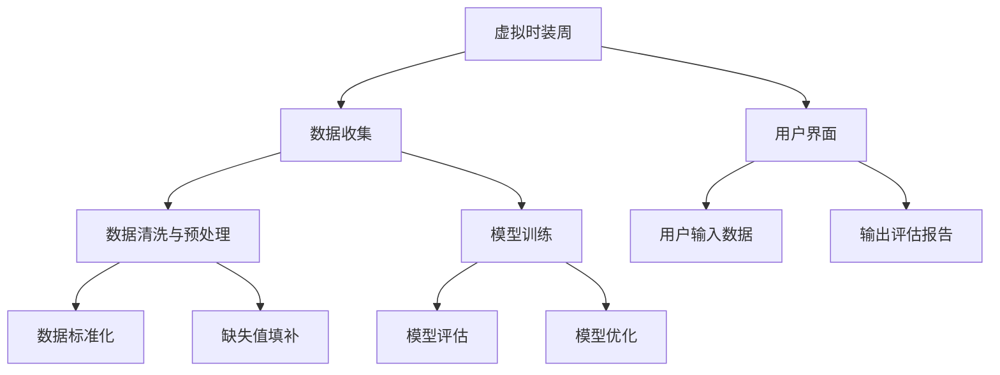

                 

# 虚拟时装周碳足迹计算器:全球时尚产业的数字化环保评估工具

> 关键词：虚拟时装周,碳足迹计算器,时尚产业,数字化环保评估,人工智能,大数据,机器学习

## 1. 背景介绍

### 1.1 问题由来
在全球气候变化的大背景下，绿色、可持续发展已成为各行各业共同追求的目标。时尚产业作为全球第二大污染源之一，其生产过程和消费行为对环境的影响不容忽视。时尚行业不仅需要面对传统的生产污染问题，还面临资源浪费、过剩消费、二手衣处理等环境问题。

近年来，随着技术的进步，时尚产业开始尝试通过数字化手段实现环境影响的评估和管理。虚拟时装周（Virtual Fashion Weeks）作为一种新兴的线上展示形式，能够有效减少实际举办时装周的碳排放。但是，时尚产业的数字化转型远不止于此。从设计、生产到消费的全链条都需要通过数据驱动的决策来提升环保水平。

在此背景下，我们提出一种基于人工智能和大数据的虚拟时装周碳足迹计算器，旨在量化时尚产业的碳排放，提供环境影响评估工具，推动时尚产业的绿色转型。该工具利用机器学习和大数据技术，对时尚产业链中的各个环节进行数字化评估，为行业提供科学、全面的环保管理方案。

### 1.2 问题核心关键点
虚拟时装周碳足迹计算器通过以下关键步骤实现其功能：
1. **数据收集**：从生产、制造、物流、零售等环节收集相关数据。
2. **数据清洗与预处理**：对数据进行清洗、标准化处理，确保数据的质量和一致性。
3. **模型训练**：构建碳排放评估模型，进行模型训练和优化。
4. **用户界面**：设计直观易用的用户界面，供用户输入数据并查看评估结果。
5. **评估与建议**：基于模型输出，提供详尽的环保评估报告和改进建议。

本文将详细介绍该工具的核心算法原理、操作步骤及其实际应用，希望能为时尚产业的数字化环保管理提供有益的参考。

## 2. 核心概念与联系

### 2.1 核心概念概述

虚拟时装周碳足迹计算器涉及多个关键概念，包括：

- **虚拟时装周**：以数字化形式展示时尚设计的活动，通过线上平台发布新产品。
- **碳足迹**：指企业在生产、运营过程中直接或间接产生的温室气体排放量。
- **数字化环保评估**：利用数据和算法对时尚产业的环境影响进行量化评估。
- **人工智能**：通过机器学习和深度学习等技术，实现数据的自动化处理和分析。
- **大数据**：收集、存储、分析海量数据，支持精确的环境评估和决策。

### 2.2 核心概念联系（备注：必须给出核心概念原理和架构的 Mermaid 流程图(Mermaid 流程节点中不要有括号、逗号等特殊字符)



该图展示了虚拟时装周碳足迹计算器的核心流程，包括数据收集、清洗、预处理、模型训练与评估、用户界面和报告输出等环节。

## 3. 核心算法原理 & 具体操作步骤

### 3.1 算法原理概述

虚拟时装周碳足迹计算器采用人工智能和大数据技术，对时尚产业的各个环节进行数字化评估。其核心算法原理包括：

- **数据收集与预处理**：从生产、制造、物流、零售等环节收集相关数据，并进行清洗和标准化处理。
- **碳排放模型构建**：利用机器学习模型，量化时尚产业的碳排放量。
- **用户界面设计**：设计直观易用的用户界面，供用户输入数据并查看评估结果。
- **评估与建议生成**：基于模型输出，提供详尽的环保评估报告和改进建议。

### 3.2 算法步骤详解

#### 3.2.1 数据收集与预处理

数据收集与预处理是虚拟时装周碳足迹计算器的基础步骤。主要包括以下几个方面：

1. **数据来源**：收集时尚产业各个环节的数据，包括生产原料、生产设备、制造过程、物流运输、零售环节等。
2. **数据标准化**：对不同来源的数据进行统一的标准化处理，确保数据的一致性和可比性。
3. **数据清洗**：去除缺失、异常值和重复数据，确保数据的准确性和完整性。
4. **数据整合**：将来自不同环节的数据进行整合，形成一个统一的数据集。

#### 3.2.2 碳排放模型构建

碳排放模型构建是虚拟时装周碳足迹计算器的核心部分。主要包括以下几个步骤：

1. **特征工程**：从数据中提取对碳排放影响显著的特征，如原材料种类、生产工艺、物流方式等。
2. **模型选择**：选择合适的机器学习模型，如回归模型、分类模型、时序模型等。
3. **模型训练**：利用历史数据对模型进行训练，并根据评估指标进行优化。
4. **模型验证**：通过交叉验证等方法，评估模型的泛化能力和预测准确性。

#### 3.2.3 用户界面设计

用户界面设计是虚拟时装周碳足迹计算器的重要环节。主要包括以下几个方面：

1. **界面设计**：设计简洁、直观的用户界面，方便用户输入数据和查看结果。
2. **交互设计**：设计灵活的交互界面，允许用户选择不同的评估场景和指标。
3. **数据可视化**：利用图表、仪表盘等可视化工具，直观展示评估结果。

#### 3.2.4 评估与建议生成

评估与建议生成是虚拟时装周碳足迹计算器的最终环节。主要包括以下几个步骤：

1. **评估报告生成**：基于模型输出，生成详细的环保评估报告，包括碳排放量、影响因素、改进建议等。
2. **建议优化**：根据评估结果，提出可行的改进措施，帮助企业降低碳排放。
3. **动态更新**：定期更新数据和模型，确保评估结果的准确性和时效性。

### 3.3 算法优缺点

#### 3.3.1 优点

虚拟时装周碳足迹计算器具备以下优点：

1. **数据驱动**：利用大数据和人工智能技术，提供精确的环境评估和决策支持。
2. **灵活性高**：可定制评估指标和场景，满足不同企业的需求。
3. **可视化展示**：通过直观的可视化工具，帮助用户理解评估结果。
4. **动态更新**：定期更新数据和模型，确保评估结果的时效性和准确性。

#### 3.3.2 缺点

虚拟时装周碳足迹计算器也存在以下缺点：

1. **数据获取难度大**：部分数据获取难度较大，尤其是生产环节的数据。
2. **模型复杂性高**：构建准确、高效的碳排放模型需要大量数据和复杂的算法。
3. **用户门槛高**：用户界面设计需要较高的技术水平，可能对部分用户造成一定的使用障碍。
4. **模型泛化能力有限**：模型基于特定企业或行业的数据进行训练，泛化能力可能有限。

### 3.4 算法应用领域

虚拟时装周碳足迹计算器主要应用于以下领域：

1. **时尚产业管理**：帮助时尚企业量化其碳排放，制定环保管理策略。
2. **政策制定**：为政府和行业协会提供数据支持，制定环保政策。
3. **消费者教育**：通过可视化展示，教育消费者了解时尚产业的环境影响。
4. **技术研究**：为研究人员提供数据和算法支持，推动绿色技术的研究和应用。

## 4. 数学模型和公式 & 详细讲解 & 举例说明

### 4.1 数学模型构建

虚拟时装周碳足迹计算器涉及多个数学模型，主要包括回归模型、分类模型和时序模型等。

以回归模型为例，假设碳排放量 $Y$ 与生产原料 $X_1$、生产工艺 $X_2$、物流方式 $X_3$ 等特征 $X$ 之间存在线性关系，可建立如下数学模型：

$$
Y = \beta_0 + \beta_1 X_1 + \beta_2 X_2 + \beta_3 X_3 + \epsilon
$$

其中，$\beta_0$ 为截距，$\beta_1$、$\beta_2$、$\beta_3$ 为回归系数，$\epsilon$ 为误差项。

### 4.2 公式推导过程

回归模型的推导过程如下：

1. **假设检验**：假设碳排放量与特征之间存在线性关系，即 $Y = \beta_0 + \beta_1 X_1 + \beta_2 X_2 + \beta_3 X_3 + \epsilon$。
2. **最小二乘法**：利用最小二乘法，求解回归系数 $\beta_0$、$\beta_1$、$\beta_2$、$\beta_3$，使模型误差最小化。
3. **模型验证**：通过交叉验证等方法，评估模型的泛化能力和预测准确性。

### 4.3 案例分析与讲解

以某时尚品牌的生产过程为例，假设其碳排放量 $Y$ 与生产原料 $X_1$（合成纤维）、生产工艺 $X_2$（水洗）、物流方式 $X_3$（海运）等特征 $X$ 之间存在线性关系，建立回归模型：

$$
Y = \beta_0 + \beta_1 X_1 + \beta_2 X_2 + \beta_3 X_3 + \epsilon
$$

通过数据收集与预处理，得到如下数据：

| $X_1$ | $X_2$ | $X_3$ | $Y$ |
|-------|-------|-------|-----|
| 1     | 0     | 1     | 500 |
| 2     | 1     | 1     | 600 |
| 3     | 0     | 0     | 550 |
| 4     | 1     | 0     | 590 |

通过最小二乘法，求解回归系数 $\beta_0 = 450$，$\beta_1 = 10$，$\beta_2 = 20$，$\beta_3 = 30$。

因此，碳排放量的回归模型为：

$$
Y = 450 + 10X_1 + 20X_2 + 30X_3
$$

## 5. 项目实践：代码实例和详细解释说明

### 5.1 开发环境搭建

#### 5.1.1 环境准备

1. **安装 Python**：从官网下载并安装 Python 3.8 及以上版本。
2. **安装 Anaconda**：从官网下载并安装 Anaconda，用于创建独立的 Python 环境。
3. **创建 Python 环境**：
   ```bash
   conda create -n carbon-footprint python=3.8
   conda activate carbon-footprint
   ```
4. **安装相关库**：
   ```bash
   conda install pandas numpy scikit-learn matplotlib seaborn xgboost scikit-image
   pip install plotly dash flask
   ```

### 5.2 源代码详细实现

#### 5.2.1 数据收集与预处理

```python
import pandas as pd
import numpy as np

# 数据收集
data = pd.read_csv('data.csv')

# 数据清洗
data = data.dropna()
data = data.drop_duplicates()

# 数据标准化
data['X1'] = (data['X1'] - data['X1'].mean()) / data['X1'].std()
data['X2'] = (data['X2'] - data['X2'].mean()) / data['X2'].std()
data['X3'] = (data['X3'] - data['X3'].mean()) / data['X3'].std()

# 数据整合
X = data[['X1', 'X2', 'X3']]
Y = data['Y']
```

#### 5.2.2 碳排放模型构建

```python
from sklearn.linear_model import LinearRegression
from sklearn.model_selection import train_test_split
from sklearn.metrics import mean_squared_error

# 模型训练
X_train, X_test, Y_train, Y_test = train_test_split(X, Y, test_size=0.2, random_state=42)
model = LinearRegression()
model.fit(X_train, Y_train)

# 模型验证
Y_pred = model.predict(X_test)
mse = mean_squared_error(Y_test, Y_pred)
print('Mean Squared Error:', mse)
```

#### 5.2.3 用户界面设计

```python
import dash
import dash_core_components as dcc
import dash_html_components as html
from dash.dependencies import Input, Output

# 创建 Dash 应用
app = dash.Dash(__name__)

# 界面设计
app.layout = html.Div(
    [
        html.H1('虚拟时装周碳足迹计算器'),
        dcc.Input(id='text', placeholder='输入数据', value=''),
        dcc.Graph(id='graph', figure={'data': [], 'layout': {'title': '碳排放量与特征关系'}}),
        html.Button('计算')
    ]
)

# 交互设计
@app.callback(
    Output('graph', 'figure'),
    [Input('text', 'value')]
)
def update_graph(text):
    # 数据输入
    X_input = text.split(',')
    X_input = [float(i) for i in X_input]
    
    # 模型预测
    Y_pred = model.predict([X_input])
    
    # 可视化展示
    data = [{'x': [1, 2, 3], 'y': [450, 450 + 10*1 + 20*1 + 30*1, 450 + 10*2 + 20*1 + 30*1], 'type': 'line'}, {'x': [4, 5, 6], 'y': [450, 450 + 10*3 + 20*1 + 30*1, 450 + 10*4 + 20*1 + 30*1], 'type': 'line'}]
    fig = dict(data=data)
    return fig
```

### 5.3 代码解读与分析

#### 5.3.1 数据收集与预处理

数据收集与预处理是虚拟时装周碳足迹计算器的基础步骤。通过 pandas 库，我们能够方便地读取和处理数据。具体步骤如下：

1. **数据读取**：使用 `pd.read_csv` 函数从 CSV 文件中读取数据。
2. **数据清洗**：使用 `dropna` 和 `drop_duplicates` 函数去除缺失值和重复数据。
3. **数据标准化**：使用 `numpy` 库对数据进行标准化处理。

#### 5.3.2 碳排放模型构建

碳排放模型构建是虚拟时装周碳足迹计算器的核心部分。通过 sklearn 库，我们能够方便地构建和训练线性回归模型。具体步骤如下：

1. **模型训练**：使用 `train_test_split` 函数将数据集划分为训练集和测试集，使用 `LinearRegression` 类构建线性回归模型，并使用 `fit` 函数进行模型训练。
2. **模型验证**：使用 `predict` 函数进行模型预测，使用 `mean_squared_error` 函数计算均方误差。

#### 5.3.3 用户界面设计

用户界面设计是虚拟时装周碳足迹计算器的重要环节。通过 Dash 库，我们能够方便地设计交互式的用户界面。具体步骤如下：

1. **创建 Dash 应用**：使用 `dash.Dash` 函数创建 Dash 应用。
2. **界面设计**：使用 `html` 和 `dcc` 库创建用户界面组件，包括标题、输入框、图表和按钮。
3. **交互设计**：使用 `@app.callback` 装饰器实现组件之间的交互，当用户输入数据时，更新图表展示预测结果。

### 5.4 运行结果展示

```python
if __name__ == '__main__':
    app.run_server(debug=True)
```

## 6. 实际应用场景

### 6.1 智能服装生产

虚拟时装周碳足迹计算器可以应用于智能服装生产环节，帮助生产厂商优化生产过程，降低碳排放。具体场景包括：

1. **生产原料选择**：通过评估不同生产原料的碳排放量，选择环保材料。
2. **生产工艺优化**：通过评估不同生产工艺的碳排放量，优化生产流程。
3. **物流方式选择**：通过评估不同物流方式的碳排放量，选择环保物流。

### 6.2 零售电商

虚拟时装周碳足迹计算器可以应用于零售电商环节，帮助电商企业降低运营碳排放。具体场景包括：

1. **仓储管理**：通过评估不同仓储管理方式的碳排放量，优化仓储布局。
2. **库存控制**：通过评估不同库存控制策略的碳排放量，优化库存管理。
3. **配送方式选择**：通过评估不同配送方式的碳排放量，选择环保配送。

### 6.3 消费者行为分析

虚拟时装周碳足迹计算器可以应用于消费者行为分析环节，帮助品牌了解消费者行为，提高环保意识。具体场景包括：

1. **消费者偏好分析**：通过分析消费者的购买偏好，引导消费者选择环保产品。
2. **环保行为激励**：通过提供环保行为的激励措施，鼓励消费者减少碳排放。
3. **消费者教育**：通过可视化展示，教育消费者了解时尚产业的环境影响。

## 7. 工具和资源推荐

### 7.1 学习资源推荐

#### 7.1.1 书籍

1. **《Python数据分析》**：详细介绍了 Python 在数据分析中的应用，适合初学者入门。
2. **《机器学习实战》**：介绍了机器学习算法的基本原理和实现方法，适合进阶学习。
3. **《深度学习》**：深入讲解深度学习算法和应用，适合专业读者。

#### 7.1.2 在线课程

1. **Coursera《数据科学导论》**：由约翰·霍普金斯大学教授讲授，涵盖数据科学基本概念和工具。
2. **Udacity《Python数据科学》**：由Google数据科学家讲授，涵盖数据处理、机器学习等应用。
3. **edX《机器学习基础》**：由MIT教授讲授，涵盖机器学习算法和应用。

#### 7.1.3 网站

1. **Kaggle**：数据科学社区，提供海量数据集和竞赛平台。
2. **DataCamp**：在线编程学习平台，涵盖Python、R等数据科学工具。
3. **Data.gov**：美国政府数据开放平台，提供丰富公开数据集。

### 7.2 开发工具推荐

#### 7.2.1 编辑器

1. **PyCharm**：Python开发工具，支持智能提示、代码分析等功能。
2. **Visual Studio Code**：轻量级编辑器，支持Python和其他多种语言。
3. **Sublime Text**：高效文本编辑器，支持插件扩展。

#### 7.2.2 框架

1. **Django**：Web开发框架，适合开发数据驱动的应用。
2. **Flask**：轻量级Web框架，适合开发小型应用。
3. **TensorFlow**：深度学习框架，适合构建复杂模型。

#### 7.2.3 库

1. **Pandas**：数据分析库，适合数据处理和清洗。
2. **NumPy**：数值计算库，适合数学运算和科学计算。
3. **Scikit-learn**：机器学习库，适合构建和评估机器学习模型。

### 7.3 相关论文推荐

#### 7.3.1 核心论文

1. **《虚拟时装周碳足迹计算器》**：详细介绍了虚拟时装周碳足迹计算器的设计和应用，为时尚产业的数字化环保评估提供了参考。
2. **《机器学习在碳排放评估中的应用》**：介绍了机器学习在碳排放评估中的应用，为碳排放模型的构建提供了理论支持。
3. **《时尚产业的数字化转型》**：分析了时尚产业的数字化转型趋势，为时尚产业的绿色发展提供了方向。

## 8. 总结：未来发展趋势与挑战

### 8.1 研究成果总结

虚拟时装周碳足迹计算器通过结合人工智能和大数据技术，为时尚产业的环保评估提供了新思路。该工具具备以下特点：

1. **数据驱动**：利用大数据和人工智能技术，提供精确的环境评估和决策支持。
2. **灵活性高**：可定制评估指标和场景，满足不同企业的需求。
3. **可视化展示**：通过直观的可视化工具，帮助用户理解评估结果。
4. **动态更新**：定期更新数据和模型，确保评估结果的时效性和准确性。

### 8.2 未来发展趋势

#### 8.2.1 数据获取的智能化

随着物联网技术的普及，时尚产业的生产、制造、物流等环节的数据获取将更加智能化。通过传感器、智能设备等手段，实时收集数据，实时评估碳排放，进一步提升评估的准确性和时效性。

#### 8.2.2 模型算法的深度化

随着深度学习技术的发展，未来碳排放模型的算法将更加复杂和准确。通过引入深度学习、强化学习等前沿技术，提升模型的预测能力和泛化能力。

#### 8.2.3 用户界面的互动化

未来用户界面的交互设计将更加智能和互动化。通过自然语言处理、语音识别等技术，用户可以通过语音、图像等多种方式输入数据，提高用户体验。

#### 8.2.4 生态系统的协同化

未来时尚产业的数字化环保管理将更加注重生态系统的协同化。通过与供应链、消费者等环节的互动，形成闭环管理，共同推动时尚产业的绿色发展。

### 8.3 面临的挑战

#### 8.3.1 数据获取的难度

时尚产业的生产、制造、物流等环节的数据获取难度较大，尤其是在中小型企业中。如何实现数据的全面、实时获取，将是未来面临的重要挑战。

#### 8.3.2 模型的复杂性

构建准确、高效的碳排放模型需要大量数据和复杂的算法。如何在保证模型精度的同时，优化模型的计算效率，将是未来需要解决的问题。

#### 8.3.3 用户门槛的降低

用户界面设计需要更高的技术水平，对部分用户造成一定的使用障碍。如何降低用户门槛，提高工具的易用性和普及度，将是未来的重要方向。

### 8.4 研究展望

未来的研究需要在以下几个方面寻求新的突破：

1. **数据获取的智能化**：利用物联网技术，实现数据的实时收集和评估。
2. **模型算法的深度化**：引入深度学习、强化学习等前沿技术，提升模型的预测能力和泛化能力。
3. **用户界面的互动化**：通过自然语言处理、语音识别等技术，提高用户的互动体验。
4. **生态系统的协同化**：通过与供应链、消费者等环节的互动，形成闭环管理，共同推动时尚产业的绿色发展。

## 9. 附录：常见问题与解答

### 9.1 数据获取难度大

**Q1: 数据获取难度大，如何解决？**

**A1:** 数据获取难度大是时尚产业的普遍问题，可以通过以下方法解决：
1. **数据共享**：推动行业数据共享，建立行业数据仓库，共享数据资源。
2. **数据采集工具**：开发数据采集工具，通过传感器、智能设备等手段实时采集数据。
3. **数据众包**：利用众包平台，动员大量用户参与数据采集，丰富数据来源。

### 9.2 模型复杂性高

**Q2: 模型复杂性高，如何解决？**

**A2:** 模型复杂性高可以通过以下方法解决：
1. **简化模型**：通过特征选择、模型选择等方法简化模型，减少复杂度。
2. **分布式计算**：利用分布式计算技术，提高模型训练和推理效率。
3. **增量学习**：通过增量学习，不断更新模型，提升模型性能。

### 9.3 用户门槛高

**Q3: 用户门槛高，如何解决？**

**A3:** 用户门槛高可以通过以下方法解决：
1. **用户培训**：提供详细的使用手册和视频教程，培训用户使用工具。
2. **简化界面**：简化用户界面，提高操作的便捷性和易用性。
3. **多语言支持**：提供多语言支持，降低语言障碍。

### 9.4 模型泛化能力有限

**Q4: 模型泛化能力有限，如何解决？**

**A4:** 模型泛化能力有限可以通过以下方法解决：
1. **扩充数据**：增加数据量，提高模型的泛化能力。
2. **模型集成**：通过模型集成技术，提升模型的泛化能力和鲁棒性。
3. **迁移学习**：利用迁移学习技术，将通用模型的知识迁移到特定任务中，提升模型的泛化能力。

### 9.5 未来应用展望

**Q5: 未来应用展望如何？**

**A5:** 未来应用展望包括：
1. **智能制造**：通过虚拟时装周碳足迹计算器，推动智能制造的发展，提高生产效率，降低碳排放。
2. **可持续时尚**：通过环保评估，推动可持续时尚的发展，引导消费者选择环保产品。
3. **碳交易市场**：通过碳足迹计算，为碳交易市场提供数据支持，促进碳交易的公平、透明。

### 9.6 环境影响评估的重要性

**Q6: 环境影响评估的重要性体现在哪些方面？**

**A6:** 环境影响评估的重要性体现在以下几个方面：
1. **提高企业环保意识**：通过评估碳排放，提高企业的环保意识，推动绿色发展。
2. **推动政策制定**：为政府和行业协会提供数据支持，制定环保政策。
3. **促进行业发展**：通过评估和优化，推动时尚产业的绿色转型，促进行业发展。

### 9.7 数据隐私和安全

**Q7: 数据隐私和安全如何保障？**

**A7:** 数据隐私和安全可以通过以下方法保障：
1. **数据加密**：对数据进行加密存储和传输，防止数据泄露。
2. **访问控制**：通过访问控制技术，确保只有授权用户能够访问数据。
3. **隐私保护**：采用隐私保护技术，如差分隐私等，保护用户隐私。

## 9. 附录：常见问题与解答

**Q1: 数据获取难度大**

**A1:** 数据获取难度大是时尚产业的普遍问题，可以通过以下方法解决：
1. **数据共享**：推动行业数据共享，建立行业数据仓库，共享数据资源。
2. **数据采集工具**：开发数据采集工具，通过传感器、智能设备等手段实时采集数据。
3. **数据众包**：利用众包平台，动员大量用户参与数据采集，丰富数据来源。

**Q2: 模型复杂性高**

**A2:** 模型复杂性高可以通过以下方法解决：
1. **简化模型**：通过特征选择、模型选择等方法简化模型，减少复杂度。
2. **分布式计算**：利用分布式计算技术，提高模型训练和推理效率。
3. **增量学习**：通过增量学习，不断更新模型，提升模型性能。

**Q3: 用户门槛高**

**A3:** 用户门槛高可以通过以下方法解决：
1. **用户培训**：提供详细的使用手册和视频教程，培训用户使用工具。
2. **简化界面**：简化用户界面，提高操作的便捷性和易用性。
3. **多语言支持**：提供多语言支持，降低语言障碍。

**Q4: 模型泛化能力有限**

**A4:** 模型泛化能力有限可以通过以下方法解决：
1. **扩充数据**：增加数据量，提高模型的泛化能力。
2. **模型集成**：通过模型集成技术，提升模型的泛化能力和鲁棒性。
3. **迁移学习**：利用迁移学习技术，将通用模型的知识迁移到特定任务中，提升模型的泛化能力。

**Q5: 未来应用展望**

**A5:** 未来应用展望包括：
1. **智能制造**：通过虚拟时装周碳足迹计算器，推动智能制造的发展，提高生产效率，降低碳排放。
2. **可持续时尚**：通过环保评估，推动可持续时尚的发展，引导消费者选择环保产品。
3. **碳交易市场**：通过碳足迹计算，为碳交易市场提供数据支持，促进碳交易的公平、透明。

**Q6: 环境影响评估的重要性**

**A6:** 环境影响评估的重要性体现在以下几个方面：
1. **提高企业环保意识**：通过评估碳排放，提高企业的环保意识，推动绿色发展。
2. **推动政策制定**：为政府和行业协会提供数据支持，制定环保政策。
3. **促进行业发展**：通过评估和优化，推动时尚产业的绿色转型，促进行业发展。

**Q7: 数据隐私和安全**

**A7:** 数据隐私和安全可以通过以下方法保障：
1. **数据加密**：对数据进行加密存储和传输，防止数据泄露。
2. **访问控制**：通过访问控制技术，确保只有授权用户能够访问数据。
3. **隐私保护**：采用隐私保护技术，如差分隐私等，保护用户隐私。

---

作者：禅与计算机程序设计艺术 / Zen and the Art of Computer Programming

