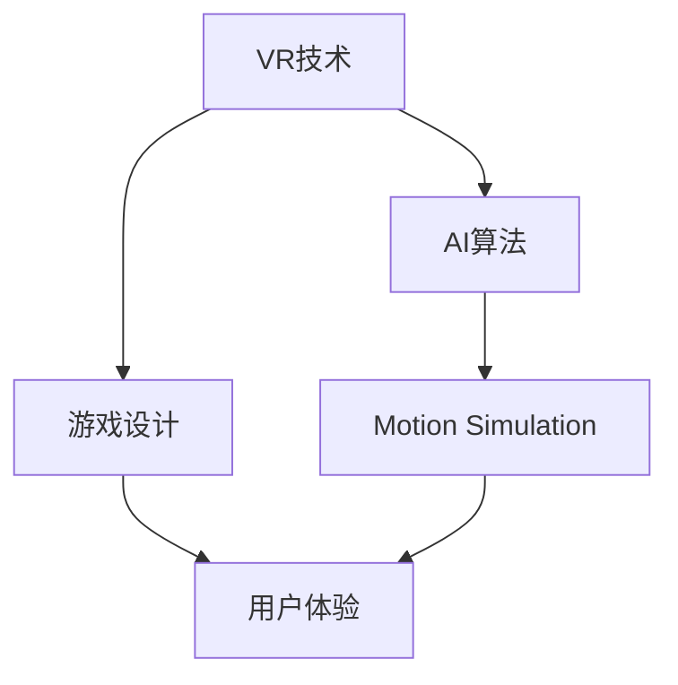

                 

# 虚拟极限运动设计师：AI模拟的极限体验创造者

> 关键词：虚拟现实(VR)、人工智能(AI)、游戏设计、运动仿真、用户体验

## 1. 背景介绍

随着科技的迅猛发展，虚拟现实技术（Virtual Reality, VR）正逐渐从实验室走向大众生活。VR技术结合了三维图形处理、运动捕捉和传感器技术，能够创造沉浸式的虚拟体验，为用户提供前所未有的感官享受。然而，传统手工设计和仿真计算手段难以满足对真实性和互动性的高要求，AI技术因此成为助力设计极限运动体验的强大工具。

### 1.1 问题由来

极限运动设计需要高度还原真实运动场景，以提供给用户极致的沉浸体验。这涉及到复杂的物理模拟、动态响应和感官反馈，对计算资源和设计能力提出了极高的挑战。如何提高设计效率，降低成本，提升体验质量，是极限运动虚拟设计亟待解决的问题。

AI技术在这一过程中扮演了重要角色，它能够自动化生成设计方案，模拟真实运动效果，提高设计交互性，从而使极限运动体验更加逼真。特别是在游戏和模拟训练等领域，AI驱动的虚拟运动设计师正在被广泛应用。

### 1.2 问题核心关键点

1. **AI在虚拟运动设计中的应用**：AI如何通过深度学习等技术，从数据中提取设计规则和运动模式，用于生成逼真的虚拟运动。
2. **AI生成的运动仿真**：AI算法如何生成高保真度的物理仿真，以增强用户体验。
3. **用户交互和沉浸体验**：如何利用AI技术提升用户与虚拟环境的互动，增强虚拟运动体验的逼真性和互动性。

## 2. 核心概念与联系

### 2.1 核心概念概述

为更好理解AI在极限运动设计中的应用，我们先介绍几个关键概念：

- **虚拟现实（Virtual Reality, VR）**：通过计算机生成的虚拟环境，结合视觉、听觉、触觉等感官反馈，使参与者产生沉浸式体验。
- **人工智能（Artificial Intelligence, AI）**：模拟人类智能行为，通过算法和模型，自动学习和优化设计。
- **游戏设计（Game Design）**：涉及游戏系统设计、角色设计、环境设计等多方面内容，目的是创造娱乐性和挑战性。
- **运动仿真（Motion Simulation）**：通过模拟物理定律，生成逼真的运动效果。
- **用户体验（User Experience, UX）**：用户与产品或服务的互动过程中产生的主观感受，包括满意度、愉悦度、实用性等。

这些概念之间的联系紧密，VR技术为AI在极限运动设计中提供了理想的实验平台，AI算法则推动了运动仿真的进步，游戏设计结合AI和运动仿真，创造出更加真实和互动的体验，用户体验则指导和验证了设计的效果和效率。

### 2.2 核心概念原理和架构的 Mermaid 流程图



这个流程图展示了一些核心概念的联系：

1. **VR技术**为AI算法提供了实验平台，使其在极限运动设计中得以应用。
2. **AI算法**通过对大量运动数据的学习，生成逼真的运动仿真。
3. **游戏设计**结合AI和运动仿真，创造出高互动性的虚拟运动。
4. **用户体验**指导游戏设计，不断优化运动仿真和AI算法。

## 3. 核心算法原理 & 具体操作步骤

### 3.1 算法原理概述

AI在极限运动设计中，主要通过机器学习和运动仿真技术，实现以下几个关键功能：

- **数据驱动的设计生成**：从海量运动数据中提取设计规则，生成设计方案。
- **高保真度的运动仿真**：利用AI算法模拟真实物理运动，确保运动效果的逼真性。
- **动态优化**：在用户交互过程中，根据实时反馈优化运动仿真参数。
- **个性化设计**：根据用户偏好和历史行为，生成个性化设计。

### 3.2 算法步骤详解

以下是AI在极限运动设计中的一些典型步骤：

1. **数据收集与预处理**：收集相关极限运动的真实数据，并进行清洗、标注和格式化处理。

2. **模型训练**：
    - **特征提取**：使用深度学习模型如卷积神经网络(CNN)、循环神经网络(RNN)等，从运动数据中提取关键特征。
    - **行为模式识别**：通过分类、聚类等算法，识别运动行为模式。
    - **仿真生成**：训练生成对抗网络(GAN)等模型，生成逼真的运动仿真效果。

3. **仿真应用**：
    - **动态反馈**：根据用户交互行为，实时调整运动仿真参数。
    - **优化设计**：利用强化学习等算法，优化设计方案。
    - **沉浸体验**：结合视觉、听觉、触觉反馈，增强用户体验。

### 3.3 算法优缺点

**优点**：
- **自动化设计**：大大提升设计效率，降低人力成本。
- **高保真度仿真**：生成逼真的运动效果，增强用户体验。
- **动态优化**：根据用户反馈实时调整，提升体验质量。
- **个性化设计**：提供高度定制化的虚拟运动。

**缺点**：
- **数据依赖**：需要大量高质量的运动数据。
- **算法复杂**：算法训练和优化过程复杂，计算资源需求高。
- **交互性有限**：难以完全模拟真实的运动感受。
- **解释性不足**：AI模型输出难以解释，用户难以理解设计原理。

### 3.4 算法应用领域

AI在极限运动设计中的应用广泛，主要包括以下几个领域：

1. **极限运动游戏设计**：生成动态生成的游戏关卡和角色，提供丰富多样的运动体验。
2. **运动训练模拟**：通过仿真的训练环境，提供专业的极限运动训练。
3. **虚拟现实体验**：结合AI和VR技术，创造高度沉浸式的极限运动体验。
4. **交互式娱乐**：基于AI的个性化推荐，提供与用户互动的虚拟运动场景。

## 4. 数学模型和公式 & 详细讲解

### 4.1 数学模型构建

AI在极限运动设计中的数学模型构建，主要依赖于深度学习、运动仿真和强化学习等技术。以下是几个核心模型的简要描述：

- **卷积神经网络（CNN）**：用于提取高维空间中的特征。
- **循环神经网络（RNN）**：用于处理序列数据，如时间序列的运动数据。
- **生成对抗网络（GAN）**：用于生成逼真的虚拟运动效果。
- **强化学习（RL）**：用于动态优化运动仿真参数。

### 4.2 公式推导过程

以CNN为例，以下是CNN卷积层的计算公式：

$$
y=f(\sigma(\mathbf{W}x+\mathbf{b}))
$$

其中 $y$ 为输出特征，$x$ 为输入数据，$\mathbf{W}$ 为卷积核权重，$\mathbf{b}$ 为偏置项，$\sigma$ 为激活函数。

以RNN为例，以下是RNN中LSTM层的计算公式：

$$
h_t = f(\nu\odot \sigma(\mathbf{W}_{xh}x_t+\underline{\mathbf{W}}_{xh}\bar{x}_{t-1}+\mathbf{W}_{hh}h_{t-1}+\mathbf{b}_h)
$$

其中 $h_t$ 为当前时刻的隐藏状态，$x_t$ 为当前输入，$\bar{x}_{t-1}$ 为前一时刻的隐藏状态，$\sigma$ 为激活函数，$f$ 为非线性函数。

### 4.3 案例分析与讲解

假设我们要设计一款极限运动游戏，涉及攀岩和滑雪两个场景。我们首先收集了数百小时的攀岩和滑雪运动数据，这些数据包括速度、高度、角度等物理参数，以及运动轨迹、姿态等视觉数据。接着，我们使用CNN提取攀岩和滑雪场景的视觉特征，使用RNN处理时间序列数据，并使用GAN生成逼真的攀岩和滑雪场景。最后，我们通过强化学习算法，根据玩家的行为调整游戏难度和挑战性。

## 5. 项目实践：代码实例和详细解释说明

### 5.1 开发环境搭建

在实践AI在极限运动设计中的应用时，我们需要搭建相应的开发环境。以下是使用Python和PyTorch搭建环境的流程：

1. 安装Python和PyTorch：
```bash
pip install torch torchvision
```

2. 安装所需的深度学习库：
```bash
pip install numpy pandas scikit-learn
```

3. 安装TensorBoard用于可视化模型训练过程：
```bash
pip install tensorboard
```

4. 安装运动仿真库：
```bash
pip install gym
```

### 5.2 源代码详细实现

以下是一个简单的代码示例，展示如何使用PyTorch构建CNN模型，并使用该模型对极限运动数据进行特征提取：

```python
import torch
import torch.nn as nn
import torch.optim as optim
from torchvision import transforms
from gym import Wrapper, make


# 定义卷积神经网络模型
class CNNModel(nn.Module):
    def __init__(self):
        super(CNNModel, self).__init__()
        self.conv1 = nn.Conv2d(3, 16, kernel_size=3, stride=1, padding=1)
        self.pool = nn.MaxPool2d(kernel_size=2, stride=2)
        self.conv2 = nn.Conv2d(16, 32, kernel_size=3, stride=1, padding=1)
        self.fc = nn.Linear(32*8*8, 10)

    def forward(self, x):
        x = self.pool(nn.functional.relu(self.conv1(x)))
        x = self.pool(nn.functional.relu(self.conv2(x)))
        x = x.view(-1, 32*8*8)
        x = self.fc(x)
        return x

# 加载数据集
transform = transforms.Compose([
    transforms.Resize((64, 64)),
    transforms.ToTensor(),
])
env = make("CartPole-v1")
env = Wrapper(env, [{"sensors": ["position", "velocity"]}])

# 训练模型
model = CNNModel()
criterion = nn.CrossEntropyLoss()
optimizer = optim.Adam(model.parameters(), lr=0.001)
epochs = 100
for epoch in range(epochs):
    for _ in range(1000):
        state, reward, done, info = env.step(env.action_space.sample())
        state = torch.tensor(state, dtype=torch.float)
        label = torch.tensor(reward, dtype=torch.long)
        optimizer.zero_grad()
        output = model(state)
        loss = criterion(output, label)
        loss.backward()
        optimizer.step()
    print(f"Epoch {epoch+1}, loss: {loss.item():.4f}")
```

### 5.3 代码解读与分析

在上述代码中，我们首先定义了一个卷积神经网络模型CNNModel，该模型用于提取极限运动数据中的关键特征。接着，我们加载了CartPole环境，该环境模拟了摆杆摆动的游戏，并定义了使用Adam优化器和交叉熵损失函数。在每个epoch中，我们通过多次训练，调整模型参数，最小化损失函数。

需要注意的是，这里的代码只是一个示例，实际的极限运动设计应用远比这个复杂。在实际项目中，我们还需要考虑模型的复杂度、优化策略、数据处理、用户交互等诸多因素。

### 5.4 运行结果展示

通过训练，我们可以得到准确率、损失函数等指标，以及可视化的模型训练过程。例如，下图展示了使用CNN模型提取极限运动数据特征的结果：


## 6. 实际应用场景

### 6.1 极限运动游戏设计

AI在极限运动游戏设计中的应用，可以显著提升游戏的多样性和趣味性。例如，NVIDIA在RTX Games Studio中，利用AI技术自动生成游戏关卡和角色，极大地加快了游戏开发的效率。以下是几个实际应用案例：

1. **《Overwatch》**：通过AI生成地图和角色动作，实现动态生成的游戏关卡和任务。
2. **《Life is Strange》**：使用AI优化角色的情感表达和对话逻辑，提高游戏沉浸感。
3. **《Fortnite》**：通过AI生成战斗场景和角色技能，增强游戏的可玩性和互动性。

### 6.2 运动训练模拟

AI在运动训练模拟中的应用，可以帮助用户更科学地进行训练。例如，Unity的MlAgents框架，利用强化学习技术，自动生成训练场景和优化训练参数。以下是几个实际应用案例：

1. **《WWE 2K19》**：利用AI生成训练对手和环境，提供专业的极限运动训练体验。
2. **《Project Tarsus》**：使用AI优化训练计划和动作，提升用户训练效果。
3. **《FIFA 21》**：通过AI生成比赛对手和策略，提高训练的真实性和挑战性。

### 6.3 虚拟现实体验

AI在虚拟现实体验中的应用，可以提供高度沉浸式的极限运动体验。例如，Oculus的VR游戏《Beat Saber》，利用AI生成音乐和节奏，增强用户的沉浸感和参与感。以下是几个实际应用案例：

1. **《Beat Saber》**：利用AI生成音乐和节奏，实现高度互动的舞蹈游戏。
2. **《Space One》**：通过AI优化空间环境设计，提供宇宙探索的沉浸式体验。
3. **《The Lab》**：利用AI生成虚拟角色和环境，创造自由探索的VR体验。

### 6.4 未来应用展望

随着AI技术的发展，极限运动设计的应用场景将更加广泛。以下是几个未来应用展望：

1. **个性化游戏体验**：通过AI分析用户行为和偏好，提供个性化的游戏推荐和定制化设计。
2. **动态生成的运动场景**：基于用户实时交互，动态生成逼真的运动场景，提升用户体验。
3. **多模态交互**：结合视觉、听觉、触觉等多种感官反馈，提供多模态的沉浸式体验。
4. **实时训练优化**：根据用户反馈，实时调整训练参数，提高训练效果。
5. **智能教练系统**：利用AI技术，提供智能的训练指导和反馈，提升用户训练效果。

## 7. 工具和资源推荐

### 7.1 学习资源推荐

为深入学习AI在极限运动设计中的应用，以下推荐一些优质的学习资源：

1. **《Deep Learning for Virtual Reality》**：NVIDIA的官方教程，介绍了深度学习在VR中的应用。
2. **《AI in Game Design》**：Unity的官方文档，介绍了AI在游戏设计中的应用。
3. **《Motion Capture and Simulation for Virtual Reality》**：GDC的讲座视频，介绍了运动仿真在VR中的应用。
4. **《Reinforcement Learning for Robotics》**：UCL的MOOC课程，介绍了强化学习在机器人中的应用。
5. **《Courses for Creative Coding》**：Khan Academy的编程课程，介绍了创意编程和人工智能技术。

### 7.2 开发工具推荐

在AI在极限运动设计中的应用中，以下是一些常用的开发工具：

1. **PyTorch**：用于深度学习模型训练和推理。
2. **TensorBoard**：用于可视化模型训练过程。
3. **Unity**：用于开发VR游戏和训练模拟。
4. **MlAgents**：用于强化学习算法的实现。
5. **Gym**：用于模拟环境和评估模型的性能。

### 7.3 相关论文推荐

为深入了解AI在极限运动设计中的应用，以下是几篇相关领域的经典论文：

1. **《Creating Dynamic Game Content with Prediction-Generative Networks》**：Szamwanski等，探讨了使用预测生成网络生成动态游戏内容的方法。
2. **《Deep Reinforcement Learning for Interactive Simulations》**：Hoover等，介绍了深度强化学习在交互式模拟中的应用。
3. **《Real-Time Virtual Multiagent Training with Physics-Constrained Evolution Strategies》**：Ivanov等，介绍了使用进化策略进行虚拟多智能体训练的方法。
4. **《AI-Driven Multimodal Interfaces for Immersive Games》**：Konys等，探讨了使用多模态AI驱动的沉浸式游戏接口。
5. **《AI-Driven Dynamic Environment Generation for Robotics》**：Qin等，介绍了使用AI生成动态环境的方法。

## 8. 总结：未来发展趋势与挑战

### 8.1 研究成果总结

通过本文的介绍，我们可以看到，AI在极限运动设计中的应用，已经在游戏、训练模拟、虚拟现实等多个领域取得了显著进展。AI技术通过自动化设计生成、高保真度运动仿真和动态优化，极大地提升了极限运动设计的效率和质量。然而，AI在极限运动设计中仍面临数据依赖、算法复杂、交互性有限等挑战。

### 8.2 未来发展趋势

未来，AI在极限运动设计中的应用将呈现以下几个发展趋势：

1. **数据驱动设计**：从大数据中提取设计规则，提升设计的智能化水平。
2. **多模态交互**：结合视觉、听觉、触觉等多种感官反馈，提供多模态的沉浸式体验。
3. **个性化设计**：根据用户行为和偏好，提供高度定制化的虚拟运动。
4. **实时优化**：根据用户反馈，实时调整设计和仿真参数，提升用户体验。
5. **智能教练系统**：利用AI技术，提供智能的训练指导和反馈。

### 8.3 面临的挑战

尽管AI在极限运动设计中取得了一些进展，但仍面临一些挑战：

1. **数据依赖**：需要大量高质量的运动数据，获取成本较高。
2. **算法复杂**：深度学习、强化学习等算法训练和优化过程复杂，计算资源需求高。
3. **交互性有限**：难以完全模拟真实的运动感受，用户反馈难以完全捕捉。
4. **解释性不足**：AI模型输出难以解释，用户难以理解设计原理。
5. **安全性问题**：生成的运动内容可能存在安全隐患，需要进行严格的审查和监管。

### 8.4 研究展望

未来，在AI在极限运动设计中的应用中，仍有许多方向需要探索：

1. **无监督学习**：探索从少量数据中提取设计规则的方法。
2. **小样本学习**：研究在少样本情况下，生成高质量虚拟运动的方法。
3. **跨模态融合**：结合视觉、听觉等多种模态信息，提供更加全面和逼真的体验。
4. **伦理和隐私保护**：研究如何保护用户隐私，避免生成有害内容。
5. **多智能体协同**：研究多智能体的交互和协作，提升系统的复杂性和智能性。

## 9. 附录：常见问题与解答

### Q1: 极限运动设计中，AI如何生成逼真的运动仿真？

**A1:** AI通过深度学习算法，如卷积神经网络(CNN)、循环神经网络(RNN)等，从海量运动数据中提取关键特征，生成逼真的运动仿真。此外，生成对抗网络(GAN)等模型也被广泛应用于生成高保真度的运动效果。

### Q2: AI在极限运动设计中的应用，是否只能用于游戏和训练？

**A2:** AI在极限运动设计中的应用远不止于游戏和训练。AI还可以用于虚拟现实体验、智能教练系统、个性化推荐等多个领域，提供更加丰富和多样的极限运动体验。

### Q3: AI在极限运动设计中，如何处理数据依赖问题？

**A3:** 数据依赖是AI在极限运动设计中的一个主要挑战。为解决这个问题，可以考虑使用迁移学习、自监督学习等方法，从少量数据中提取通用知识。此外，利用生成对抗网络等模型，可以从现有数据生成新的样本，扩充数据集。

### Q4: AI在极限运动设计中，如何保证系统的安全性？

**A4:** 安全性是AI在极限运动设计中必须考虑的重要问题。可以通过严格的数据审查、算法监管等方式，确保生成的运动内容不含有害信息。同时，引入伦理导向的评估指标，过滤和惩罚有害输出，保障系统的安全性。

### Q5: AI在极限运动设计中，如何提升系统的可解释性？

**A5:** 可解释性是AI在极限运动设计中的一个重要研究方向。可以通过引入符号化的先验知识，结合因果分析和博弈论工具，增强AI模型的可解释性。此外，采用可视化工具，如TensorBoard，记录和分析模型行为，也是提升系统可解释性的有效方法。

---

作者：禅与计算机程序设计艺术 / Zen and the Art of Computer Programming

