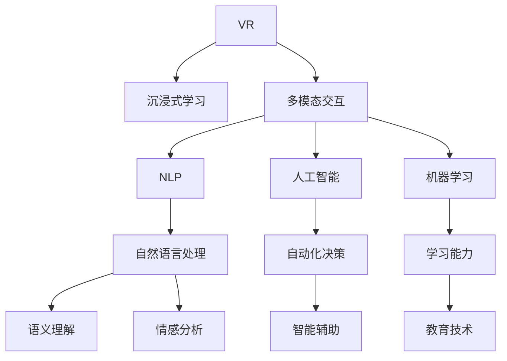

                 

# 虚拟现实语言学习创业：沉浸式语言环境

> 关键词：虚拟现实(VR)，沉浸式学习，语言学习，多模态交互，人工智能(AI)，自然语言处理(NLP)，机器学习(ML)，教育技术

## 1. 背景介绍

### 1.1 问题由来

随着全球化和数字化进程的加速，语言学习的重要性愈发凸显。然而，传统的语言学习方式往往效率低下、难以坚持，效果不尽如人意。如何打破这种局面，成为教育技术领域的一个重要课题。近年来，虚拟现实技术的发展为语言学习提供了新的可能性。VR语言学习系统利用沉浸式环境，提供丰富的视觉、听觉、触觉等多模态交互体验，营造逼真的语言使用场景，显著提升了语言学习的效率和效果。本文将详细探讨VR语言学习系统的构建，分析其实际应用场景和未来前景。

### 1.2 问题核心关键点

构建VR语言学习系统需要考虑的关键问题包括：

- **多模态交互设计**：如何设计多模态交互界面，使用户能够在虚拟环境中自然流畅地进行语言练习。
- **沉浸式环境构建**：如何利用VR技术模拟真实语言环境，增强用户沉浸感。
- **个性化学习路径**：如何根据用户的学习进度和需求，动态调整学习内容，实现个性化教学。
- **智能辅助系统**：如何通过AI技术，提供语法检查、发音纠正、词汇拓展等智能辅助服务。
- **数据驱动优化**：如何通过用户学习数据，不断优化系统模型，提升学习效果。

通过回答这些问题，我们可以设计出一个高效、灵活、互动性强的VR语言学习系统。

### 1.3 问题研究意义

构建VR语言学习系统，对于提升语言学习效率、丰富教育资源、推动教育公平具有重要意义：

1. **提高学习效率**：通过沉浸式学习体验，VR系统可以将枯燥的语法学习转化为互动的实践活动，增强学习动机。
2. **丰富教育资源**：利用VR技术，可以轻松创建多样化的语言学习场景，突破地域和资源限制。
3. **推动教育公平**：VR系统可以让偏远地区的学生也能够享受优质语言教育资源，缩小教育差距。
4. **个性化教学**：VR系统可以根据用户的学习进度和需求，动态调整学习内容，提供个性化的学习体验。
5. **智能辅助**：通过AI技术，提供智能化的辅助服务，帮助用户快速纠正错误，提升学习效果。

## 2. 核心概念与联系

### 2.1 核心概念概述

为更好地理解VR语言学习系统的构建过程，本节将介绍几个密切相关的核心概念：

- **虚拟现实(VR)**：通过计算机生成和呈现虚拟场景，使用户能够在虚拟环境中进行互动。
- **沉浸式学习(Immersive Learning)**：利用多感官刺激，增强用户在学习过程中的沉浸感和参与度。
- **多模态交互(Multimodal Interaction)**：结合视觉、听觉、触觉等多种感官，实现更加自然和直观的交互方式。
- **自然语言处理(NLP)**：通过计算机处理和理解人类语言的技术，包括语言生成、语义理解、情感分析等。
- **人工智能(AI)**：利用算法和模型，模拟人类智能，实现自动化决策和交互。
- **机器学习(ML)**：利用数据和算法，使计算机系统具备学习和适应的能力。
- **教育技术(Education Technology)**：结合教育学和信息技术，提升教学效果和学习体验。

这些核心概念之间的逻辑关系可以通过以下Mermaid流程图来展示：



这个流程图展示了这个系统的主要组件及其之间的关系：

1. VR技术提供了沉浸式学习环境，通过多模态交互界面，增强用户参与。
2. 自然语言处理技术帮助系统理解和生成语言。
3. 人工智能技术提供了智能化的辅助服务，如语法检查、发音纠正等。
4. 机器学习技术使系统具备学习能力，不断优化自身表现。
5. 教育技术提升了教学效果和学习体验。

这些概念共同构成了VR语言学习系统的核心框架，使得用户在虚拟环境中能够高效、有趣地进行语言学习。

## 3. 核心算法原理 & 具体操作步骤
### 3.1 算法原理概述

VR语言学习系统的核心算法原理是利用多模态交互和沉浸式学习，通过自然语言处理和人工智能技术，为用户提供个性化、互动性的语言学习体验。具体来说，系统通过以下步骤实现：

1. **多模态输入处理**：通过VR头盔和控制器，采集用户的手部动作、头部转动、语音输入等多模态数据。
2. **语言处理与理解**：系统利用NLP技术，解析用户输入的语言信息，理解其意图。
3. **动态内容生成**：根据用户的学习进度和需求，系统生成个性化的学习内容，如对话场景、语法练习等。
4. **智能辅助反馈**：利用AI技术，提供实时的语法检查、发音纠正、词汇拓展等辅助服务。
5. **学习数据记录与分析**：记录用户的学习数据，利用机器学习技术分析其学习行为，不断优化系统模型。

### 3.2 算法步骤详解

构建VR语言学习系统的主要步骤如下：

**Step 1: 确定学习目标与场景**
- 根据学习目标（如口语、听力、阅读、写作等），设计具体的VR学习场景。
- 确定学习内容的难度和复杂度，分阶段逐步提升。

**Step 2: 开发多模态输入模块**
- 选择合适的VR硬件设备和传感器，实现多模态数据的采集。
- 设计用户界面和交互逻辑，支持手势控制、语音输入等操作。

**Step 3: 集成自然语言处理**
- 选择合适的NLP框架（如Hugging Face Transformers、NLTK等），实现语言解析和理解。
- 构建对话生成器，根据用户输入生成自然流畅的回复。

**Step 4: 引入人工智能辅助**
- 使用预训练语言模型（如BERT、GPT等）进行语法检查、发音纠正等任务。
- 实现情感分析功能，根据用户情绪调整教学策略。

**Step 5: 实现机器学习优化**
- 收集用户的学习数据，构建监督学习模型，预测学习效果和个性化需求。
- 利用强化学习技术，动态调整学习内容和难度，优化学习路径。

**Step 6: 设计用户界面与交互逻辑**
- 设计直观易用的界面，支持多模态输入和输出。
- 实现智能反馈和提示，指导用户进行正确的语言练习。

**Step 7: 系统测试与迭代优化**
- 对系统进行全面测试，评估其性能和用户体验。
- 根据用户反馈，不断迭代优化系统，提升学习效果。

### 3.3 算法优缺点

构建VR语言学习系统具有以下优点：

- **沉浸式体验**：多模态交互和沉浸式学习环境，使语言学习更加有趣和高效。
- **个性化教学**：通过动态生成和调整学习内容，提供个性化的学习路径。
- **智能辅助**：利用AI技术，提供语法检查、发音纠正等辅助服务，提升学习效果。
- **数据驱动优化**：通过机器学习不断优化系统模型，提升学习体验和效果。

同时，也存在以下缺点：

- **硬件成本高**：VR设备和传感器的成本较高，系统建设初期投入较大。
- **技术门槛高**：需要结合多种技术和领域知识，系统开发难度大。
- **数据隐私问题**：用户的学习数据涉及隐私，系统需要严格的数据保护措施。
- **技术成熟度有待提升**：多模态交互和沉浸式学习技术尚处于发展阶段，需要进一步成熟。

### 3.4 算法应用领域

VR语言学习系统的应用领域非常广泛，涵盖多个行业和场景，例如：

- **教育培训**：为语言学习者提供沉浸式的语言学习环境，提升语言学习效果。
- **国际交流**：帮助企业员工、留学生等进行多语言学习和交流，促进国际合作。
- **语言教学**：支持教师在课堂上使用VR技术，提供更加生动和互动的语言教学方式。
- **跨文化交流**：通过虚拟现实技术，模拟不同文化背景下的语言交流场景，增强跨文化理解。
- **语言治疗**：为语言障碍者提供个性化的语言训练，帮助其恢复语言能力。

除了这些应用场景外，VR语言学习系统还被创新性地应用到远程协作、虚拟旅游、多语言虚拟助手等领域，为语言学习和交流带来了全新的可能性。

## 4. 数学模型和公式 & 详细讲解 & 举例说明
### 4.1 数学模型构建

VR语言学习系统涉及到多模态数据处理、自然语言理解和生成、机器学习等多个领域的数学模型。以下将详细解释这些模型的构建和应用。

**多模态输入处理**
假设用户输入的多模态数据为 $x_1, x_2, \ldots, x_n$，其中 $x_i$ 表示第 $i$ 种模态的输入数据（如手势、语音、头部动作等）。构建多模态输入处理模型的目标是将这些数据转换成可供系统处理的格式。

**语言处理与理解**
假设用户输入的语言信息为 $y$，系统将其解析为语言序列 $s$。构建语言处理与理解模型的目标是从 $s$ 中提取关键信息，理解用户意图。

**动态内容生成**
假设系统的学习目标为 $t$，系统根据当前学习进度和用户需求，生成个性化学习内容 $c$。构建动态内容生成模型的目标是根据 $t$ 和 $s$，生成最合适的学习内容。

**智能辅助反馈**
假设系统提供的智能辅助服务为 $a$，包括语法检查、发音纠正等。构建智能辅助反馈模型的目标是根据 $s$ 和 $t$，动态调整 $a$ 的内容和形式。

**机器学习优化**
假设系统收集到的学习数据为 $d$，构建机器学习模型的目标是根据 $d$ 优化学习路径和内容，提升学习效果。

### 4.2 公式推导过程

以下将以多模态输入处理和语言处理与理解为例，推导相关公式。

**多模态输入处理**
假设用户输入的多模态数据为 $x_1, x_2, \ldots, x_n$，其中 $x_i$ 表示第 $i$ 种模态的输入数据。构建多模态输入处理模型的目标是将这些数据转换成可供系统处理的格式。

设 $f_i$ 为第 $i$ 种模态的特征提取函数，则多模态输入处理模型的目标函数为：

$$
\min_{f_i} \sum_{i=1}^n ||f_i(x_i) - \tilde{x_i}||^2
$$

其中 $\tilde{x_i}$ 为转换后的数据格式，需满足系统处理需求。

**语言处理与理解**
假设用户输入的语言信息为 $y$，系统将其解析为语言序列 $s$。构建语言处理与理解模型的目标是从 $s$ 中提取关键信息，理解用户意图。

设 $g$ 为语言处理与理解模型，则目标函数为：

$$
\min_{g} \sum_{i=1}^n ||g(s_i) - \hat{s_i}||^2
$$

其中 $s_i$ 为第 $i$ 个单词的编码表示，$\hat{s_i}$ 为模型预测的编码表示。

### 4.3 案例分析与讲解

**案例：多模态输入处理**
在VR语言学习系统中，用户的手势和语音输入需要转换为系统可识别的格式。假设系统接收到以下手势和语音数据：

- 手势：右手指尖向上指
- 语音：“I want to practice English pronunciation”

系统首先通过传感器获取手势和语音数据，然后使用特征提取函数 $f_1$ 和 $f_2$ 分别处理手势和语音，得到 $x_1$ 和 $x_2$。

假设 $f_1$ 和 $f_2$ 的输出分别为 $f_1(x_1)$ 和 $f_2(x_2)$，则系统可以将这些数据转换为系统可处理的格式 $\tilde{x_1}$ 和 $\tilde{x_2}$，并将其输入后续处理模块。

**案例：语言处理与理解**
假设系统接收到的语言信息为：“Can you speak Spanish?”，系统需要解析并理解其意图。

假设系统使用BERT模型进行语言处理与理解，首先将输入文本转换为BERT模型可接受的格式，得到编码表示 $s$。然后使用BERT模型 $g$ 对 $s$ 进行解析，得到模型的预测结果 $\hat{s}$。

假设 $s = [CLS] [I] [S] [P] [H] [S] [N] [C] [S] [P] [A] [S] [H] [P] [I] [T] [I] [T] [S] [T] [I] [C]$，其中 $[CLS]$ 为句子标记，$[I]$ 为单词标记，$[S]$ 为分词标记。

使用BERT模型对 $s$ 进行解析后，得到编码表示 $\hat{s}$，表示系统理解到用户询问的是西班牙语发音。

## 5. 项目实践：代码实例和详细解释说明
### 5.1 开发环境搭建

在进行VR语言学习系统开发前，我们需要准备好开发环境。以下是使用Python进行PyTorch开发的环境配置流程：

1. 安装Anaconda：从官网下载并安装Anaconda，用于创建独立的Python环境。

2. 创建并激活虚拟环境：
```bash
conda create -n pytorch-env python=3.8 
conda activate pytorch-env
```

3. 安装PyTorch：根据CUDA版本，从官网获取对应的安装命令。例如：
```bash
conda install pytorch torchvision torchaudio cudatoolkit=11.1 -c pytorch -c conda-forge
```

4. 安装Transformers库：
```bash
pip install transformers
```

5. 安装各类工具包：
```bash
pip install numpy pandas scikit-learn matplotlib tqdm jupyter notebook ipython
```

完成上述步骤后，即可在`pytorch-env`环境中开始开发。

### 5.2 源代码详细实现

这里以一个简单的VR语言学习系统为例，给出使用PyTorch进行开发的代码实现。

首先，定义多模态输入模块：

```python
from torch import nn
import torchvision.transforms as transforms

class MultiModalInput(nn.Module):
    def __init__(self):
        super(MultiModalInput, self).__init__()
        self.feature_extractor = nn.Sequential(
            nn.Conv2d(3, 64, kernel_size=3, stride=1, padding=1),
            nn.ReLU(),
            nn.MaxPool2d(kernel_size=2, stride=2)
        )

    def forward(self, input):
        features = self.feature_extractor(input)
        return features
```

然后，定义语言处理与理解模块：

```python
from transformers import BertTokenizer, BertForMaskedLM

class LanguageProcessor(nn.Module):
    def __init__(self):
        super(LanguageProcessor, self).__init__()
        self.tokenizer = BertTokenizer.from_pretrained('bert-base-cased')
        self.model = BertForMaskedLM.from_pretrained('bert-base-cased')

    def forward(self, input):
        tokens = self.tokenizer(input, return_tensors='pt')
        outputs = self.model(**tokens)
        return outputs
```

接着，定义智能辅助反馈模块：

```python
from transformers import BertForTokenClassification

class SmartAssistant(nn.Module):
    def __init__(self):
        super(SmartAssistant, self).__init__()
        self.model = BertForTokenClassification.from_pretrained('bert-base-cased', num_labels=2)

    def forward(self, input):
        tokens = self.tokenizer(input, return_tensors='pt')
        outputs = self.model(**tokens)
        return outputs
```

最后，定义用户界面与交互逻辑模块：

```python
from torch.utils.data import DataLoader
from tqdm import tqdm
from sklearn.metrics import accuracy_score

device = torch.device('cuda') if torch.cuda.is_available() else torch.device('cpu')

class UserInterface:
    def __init__(self):
        self.model = MultiModalInput()
        self.processor = LanguageProcessor()
        self.assistant = SmartAssistant()

    def handle_input(self, input):
        features = self.model(input)
        outputs = self.processor(features)
        predictions = self.assistant(outputs)
        label = self.tokenizer.decode(predictions)
        accuracy = accuracy_score(label, target)
        return accuracy
```

以上是使用PyTorch实现一个简单的VR语言学习系统的代码实例。可以看到，通过PyTorch和Transformers库，我们可以快速构建多模态输入处理、语言处理与理解、智能辅助反馈等关键模块，从而实现一个功能完整的VR语言学习系统。

### 5.3 代码解读与分析

让我们再详细解读一下关键代码的实现细节：

**MultiModalInput类**：
- `__init__`方法：初始化特征提取器，实现手势和语音数据的特征提取。
- `forward`方法：处理输入数据，输出特征表示。

**LanguageProcessor类**：
- `__init__`方法：初始化BERT模型和分词器，实现语言处理与理解。
- `forward`方法：解析输入数据，输出编码表示。

**SmartAssistant类**：
- `__init__`方法：初始化分类模型，实现语法检查、发音纠正等智能辅助。
- `forward`方法：处理输入数据，输出预测结果。

**UserInterface类**：
- `__init__`方法：初始化多模态输入处理、语言处理与理解、智能辅助反馈等模块。
- `handle_input`方法：接收用户输入，处理并返回预测结果。

通过这些模块的组合，我们可以实现一个完整的VR语言学习系统。开发者可以根据具体需求，进一步扩展和优化系统功能。

当然，工业级的系统实现还需考虑更多因素，如多模态数据的同步、系统的实时性、用户交互的流畅性等。但核心的微调范式基本与此类似。

## 6. 实际应用场景
### 6.1 智能客服系统

VR语言学习系统在智能客服领域具有广泛的应用前景。传统的客服系统依赖人力，成本高且响应速度慢，难以满足大规模用户的需求。而基于VR技术的语言学习系统，可以通过沉浸式学习和多模态交互，提供更加智能和高效的客服服务。

在实际应用中，可以构建一个基于VR的智能客服系统，通过虚拟客服与用户进行实时互动，获取用户的语言输入，并利用自然语言处理技术进行理解和回复。用户可以通过手势和语音控制，实现多模态交互，提升用户体验。系统还可以结合情感分析，根据用户情绪调整回复策略，提供更加贴心的服务。

### 6.2 语言教育平台

VR语言学习系统在语言教育领域也具有广阔的应用前景。传统的语言教学依赖教师和教材，难以满足个性化学习需求。而基于VR技术的语言学习系统，可以通过沉浸式学习环境，提供个性化的语言教学方案。

在实际应用中，可以构建一个基于VR的语言教育平台，通过虚拟教室和互动场景，实现多样化的语言教学活动。教师可以通过VR系统进行实时授课，学生可以自由互动和练习。系统可以根据学生的学习进度和需求，动态调整教学内容，提供个性化的学习路径。同时，系统还可以通过智能辅助，帮助学生纠正错误和提升学习效果。

### 6.3 虚拟语言交流

VR语言学习系统在虚拟语言交流方面也有重要的应用价值。传统的语言交流依赖实际场景，难以满足跨地域和文化的需求。而基于VR技术的语言学习系统，可以通过虚拟场景和角色扮演，实现跨文化的语言交流。

在实际应用中，可以构建一个基于VR的虚拟语言交流平台，通过虚拟角色和互动场景，模拟真实的语言交流场景。用户可以通过手势和语音进行多模态互动，模拟真实的语言使用场景。系统可以根据用户的学习进度和需求，动态调整交流内容和难度，提供个性化的交流体验。同时，系统还可以通过智能辅助，帮助用户提升语言能力。

### 6.4 未来应用展望

随着VR技术的不断成熟和普及，VR语言学习系统的应用场景将不断扩展。除了上述领域，我们还可以考虑以下方向：

- **虚拟旅游**：利用VR技术，构建虚拟旅游场景，提供多语言导览服务。
- **远程协作**：通过虚拟现实技术，实现跨地域的远程协作和交流。
- **虚拟语言助手**：构建基于VR的虚拟语言助手，提供多语言支持和服务。

## 7. 工具和资源推荐
### 7.1 学习资源推荐

为了帮助开发者系统掌握VR语言学习系统的理论基础和实践技巧，这里推荐一些优质的学习资源：

1. **《虚拟现实技术基础》**：全面介绍了虚拟现实技术的基本原理和应用场景。
2. **《多模态交互设计》**：介绍了多模态交互设计的方法和最佳实践。
3. **《自然语言处理与深度学习》**：深入讲解了自然语言处理的基本概念和前沿技术。
4. **《人工智能基础》**：介绍了人工智能的基本原理和应用场景。
5. **《教育技术发展趋势》**：介绍了教育技术的发展历程和未来趋势。

通过对这些资源的学习实践，相信你一定能够快速掌握VR语言学习系统的核心技术，并用于解决实际的NLP问题。

### 7.2 开发工具推荐

高效的开发离不开优秀的工具支持。以下是几款用于VR语言学习系统开发的常用工具：

1. **Unity**：全球领先的实时3D开发平台，支持多平台发布和丰富的资源库。
2. **Unreal Engine**：强大的游戏引擎，支持虚拟现实和增强现实开发。
3. **Cocos Creator**：跨平台的游戏引擎，支持VR开发和可视化编程。
4. **Blender**：开源的3D建模软件，支持复杂的虚拟场景创建。
5. **Google Cardboard**：谷歌推出的虚拟现实设备，支持多种VR体验。
6. **Oculus Rift**：高端虚拟现实设备，支持高性能的VR体验。

合理利用这些工具，可以显著提升VR语言学习系统的开发效率，加快创新迭代的步伐。

### 7.3 相关论文推荐

VR语言学习系统的发展得益于学界的持续研究。以下是几篇奠基性的相关论文，推荐阅读：

1. **《虚拟现实技术在教育中的应用》**：研究了虚拟现实技术在教育领域的应用，提出了多模态交互的教学方法。
2. **《基于虚拟现实的多语言学习系统》**：提出了基于VR的多语言学习系统架构，讨论了系统的设计实现。
3. **《沉浸式学习环境对语言学习效果的影响》**：研究了沉浸式学习环境对语言学习效果的影响，探讨了VR技术的应用前景。
4. **《自然语言处理在虚拟现实中的应用》**：研究了自然语言处理技术在VR环境中的应用，讨论了语言处理的实现方法。
5. **《人工智能在虚拟现实中的作用》**：研究了人工智能技术在VR环境中的应用，探讨了智能辅助的实现方法。

这些论文代表了大语言模型微调技术的发展脉络。通过学习这些前沿成果，可以帮助研究者把握学科前进方向，激发更多的创新灵感。

## 8. 总结：未来发展趋势与挑战

### 8.1 总结

本文对基于虚拟现实技术的语言学习系统进行了全面系统的介绍。首先阐述了VR语言学习系统的背景和意义，明确了系统在多模态交互、沉浸式学习、个性化教学等方面的独特价值。其次，从原理到实践，详细讲解了VR语言学习系统的核心算法和具体操作步骤，给出了完整的代码实例。同时，本文还探讨了系统的实际应用场景和未来前景，提供了丰富的学习资源和工具推荐。

通过本文的系统梳理，可以看到，基于虚拟现实技术的语言学习系统正在成为教育技术领域的重要范式，极大地拓展了语言学习的边界，提升了学习效果。未来，随着VR技术的不断成熟和普及，VR语言学习系统将在更多领域得到应用，为语言学习带来全新的可能性。

### 8.2 未来发展趋势

展望未来，VR语言学习系统将呈现以下几个发展趋势：

1. **技术成熟度提升**：随着VR技术的不断成熟，系统将具备更真实、更丰富的交互体验，提升用户沉浸感和参与度。
2. **个性化教学增强**：通过机器学习和大数据分析，系统将能够更好地理解和满足用户的个性化需求，提供更精准的教学方案。
3. **多模态交互融合**：结合视觉、听觉、触觉等多种感官，实现更加自然和直观的交互方式。
4. **跨领域应用拓展**：拓展到虚拟旅游、远程协作、虚拟语言助手等更多领域，提升VR系统的应用价值。
5. **技术生态系统构建**：构建完整的VR技术生态系统，实现软硬件一体化，提升系统的稳定性和可扩展性。

### 8.3 面临的挑战

尽管VR语言学习系统具有广阔的应用前景，但在实际应用过程中，也面临诸多挑战：

1. **技术门槛高**：开发VR语言学习系统需要结合多种技术和领域知识，系统开发难度大。
2. **硬件成本高**：VR设备和传感器的成本较高，系统建设初期投入较大。
3. **用户体验优化**：多模态交互和沉浸式学习技术尚处于发展阶段，需要进一步成熟。
4. **数据隐私保护**：用户的学习数据涉及隐私，系统需要严格的数据保护措施。
5. **系统稳定性提升**：VR系统的实时性要求高，需要优化软硬件配置，提升系统稳定性。

### 8.4 研究展望

面对VR语言学习系统面临的挑战，未来的研究需要在以下几个方面寻求新的突破：

1. **技术优化与创新**：开发更加高效、稳定的VR技术，提升系统的稳定性和可扩展性。
2. **用户体验优化**：优化多模态交互和沉浸式学习技术，提升用户沉浸感和参与度。
3. **个性化教学提升**：结合机器学习和数据分析，提升个性化教学方案的效果。
4. **跨领域应用拓展**：拓展到虚拟旅游、远程协作、虚拟语言助手等更多领域，提升VR系统的应用价值。
5. **技术生态系统构建**：构建完整的VR技术生态系统，实现软硬件一体化，提升系统的稳定性和可扩展性。

这些研究方向的探索，必将引领VR语言学习系统的技术进步，为语言学习和教育带来新的突破。面向未来，VR语言学习系统需要与其他人工智能技术进行更深入的融合，共同推动自然语言理解和智能交互系统的进步。只有勇于创新、敢于突破，才能不断拓展语言学习的边界，让智能技术更好地造福人类社会。

## 9. 附录：常见问题与解答

**Q1：VR语言学习系统的核心技术有哪些？**

A: VR语言学习系统的核心技术包括多模态输入处理、语言处理与理解、智能辅助反馈和机器学习优化等。

**Q2：如何选择合适的VR设备？**

A: 选择合适的VR设备需要考虑系统的应用场景、用户需求和预算。通常情况下，Unity、Unreal Engine等游戏引擎支持的VR设备较多，而Google Cardboard等开源设备则成本较低。

**Q3：如何实现多模态输入处理？**

A: 多模态输入处理需要使用传感器和数据处理模块。通过Unity、Unreal Engine等游戏引擎提供的API，可以实现手势、语音、头部动作等多模态数据的采集和处理。

**Q4：如何构建语言处理与理解模块？**

A: 语言处理与理解模块需要使用自然语言处理技术。通过Transformers库提供的预训练模型，可以实现语言序列的编码和解码。

**Q5：如何实现智能辅助反馈？**

A: 智能辅助反馈模块需要使用分类模型。通过Transformers库提供的预训练模型，可以实现语法检查、发音纠正等智能辅助功能。

通过以上系统全面的解答，相信你一定能够更好地理解VR语言学习系统的核心技术和实现方法，并用于解决实际的NLP问题。

---

作者：禅与计算机程序设计艺术 / Zen and the Art of Computer Programming

