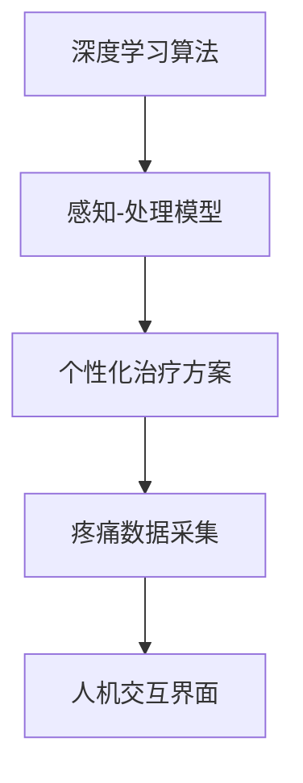

                 

# 虚拟疼痛管理系统：AI驱动的知觉调节

在科技日新月异的今天，人工智能的应用范围越来越广，其带来的改变深刻而深远。尤其在医疗领域，人工智能的潜力被不断挖掘，成为改善人类生活质量的重要工具。虚拟疼痛管理系统，作为人工智能在医学领域的应用之一，以AI驱动的知觉调节技术为支撑，通过模拟人体对疼痛的感知和处理过程，有效帮助患者缓解疼痛，提升生活质量。本文将深入探讨虚拟疼痛管理系统的原理与实现，并分析其应用前景与面临的挑战。

## 1. 背景介绍

### 1.1 问题由来

疼痛是临床上常见的主观感受，包括急性疼痛和慢性疼痛。传统上，疼痛管理主要依赖药物、手术等手段，但这些方法存在诸多局限，如副作用大、药物耐受性、术后复发性等问题。因此，近年来，基于人工智能的疼痛管理技术逐渐兴起，尤其是在虚拟疼痛管理系统中，AI驱动的知觉调节技术展现了巨大潜力。

虚拟疼痛管理系统通过模拟人体对疼痛的感知和处理过程，帮助患者自我管理疼痛，具有非侵入性、无副作用等优势。这种系统能够根据患者的具体情况，如疼痛类型、疼痛强度等，个性化调整治疗方案，提升疼痛管理的准确性和有效性。

### 1.2 问题核心关键点

虚拟疼痛管理系统基于AI驱动的知觉调节技术，其核心思想在于通过深度学习算法，模拟大脑对疼痛的感知和处理过程，构建神经网络模型。该模型通过大量数据训练，能够根据患者的具体疼痛情况，动态调整疼痛管理方案。

核心概念包括：
- 深度学习算法：通过多层神经网络，学习疼痛与身体状态之间的关系。
- 感知-处理模型：模拟大脑对疼痛的感知和处理机制。
- 个性化治疗方案：根据患者的具体情况，动态调整疼痛管理方案。

这些关键概念构成了虚拟疼痛管理系统的理论基础，使其能够有效地帮助患者缓解疼痛，提升生活质量。

## 2. 核心概念与联系

### 2.1 核心概念概述

在虚拟疼痛管理系统中，涉及以下几个核心概念：

- **深度学习算法**：通过多层神经网络，学习疼痛与身体状态之间的关系。深度学习算法能够处理大量的非结构化数据，如疼痛位置、疼痛强度、生理状态等。
- **感知-处理模型**：模拟大脑对疼痛的感知和处理机制。该模型能够识别疼痛类型，如慢性、急性、背景痛等，并根据患者的具体情况，动态调整疼痛管理方案。
- **个性化治疗方案**：根据患者的具体情况，动态调整疼痛管理方案。个性化治疗方案能够显著提高疼痛管理的准确性和有效性，减少副作用。
- **疼痛数据采集**：通过传感器、问卷调查等方式，实时采集患者的疼痛数据。数据采集的准确性和实时性是虚拟疼痛管理系统的基础。
- **人机交互界面**：提供用户友好的界面，方便患者输入疼痛信息，查看疼痛管理方案和效果。

这些概念之间的逻辑关系可以通过以下Mermaid流程图来展示：



该流程图展示了深度学习算法如何通过感知-处理模型，生成个性化治疗方案，并采集疼痛数据和展示人机交互界面，形成完整的虚拟疼痛管理系统。

## 3. 核心算法原理 & 具体操作步骤

### 3.1 算法原理概述

虚拟疼痛管理系统基于深度学习算法和感知-处理模型，通过模拟大脑对疼痛的感知和处理机制，构建神经网络模型。该模型通过大量数据训练，能够根据患者的具体疼痛情况，动态调整疼痛管理方案。

具体来说，虚拟疼痛管理系统的核心算法包括以下几个步骤：

1. 数据预处理：采集患者的疼痛数据，并进行清洗、归一化等预处理。
2. 特征提取：从预处理后的数据中提取关键特征，如疼痛位置、疼痛强度、生理状态等。
3. 模型训练：使用深度学习算法，如卷积神经网络(CNN)、循环神经网络(RNN)等，训练感知-处理模型。
4. 疼痛预测：将患者的当前疼痛数据输入模型，预测疼痛类型和强度。
5. 治疗方案生成：根据预测结果，生成个性化的疼痛管理方案，如药物治疗、物理治疗、心理治疗等。
6. 效果评估：实时监测疼痛管理方案的效果，并根据评估结果动态调整方案。

### 3.2 算法步骤详解

#### 3.2.1 数据预处理

数据预处理是虚拟疼痛管理系统的第一步，其目的是清洗、归一化疼痛数据，提高数据质量。具体来说，数据预处理包括以下几个步骤：

1. 数据采集：通过传感器、问卷调查等方式，实时采集患者的疼痛数据。
2. 数据清洗：去除异常值和噪声数据，确保数据的准确性和完整性。
3. 数据归一化：将数据缩放到标准范围内，如[0,1]区间，以便于后续算法处理。

#### 3.2.2 特征提取

特征提取是从疼痛数据中提取关键特征的过程。通过特征提取，可以将复杂的疼痛数据转化为模型可以处理的形式。具体来说，特征提取包括以下几个步骤：

1. 特征选择：从疼痛数据中选择关键特征，如疼痛位置、疼痛强度、生理状态等。
2. 特征编码：将选择的特征进行编码，如转换为向量形式。
3. 特征归一化：将特征缩放到标准范围内，如[0,1]区间。

#### 3.2.3 模型训练

模型训练是虚拟疼痛管理系统的核心步骤，其目的是训练感知-处理模型，使其能够根据疼痛数据预测疼痛类型和强度。具体来说，模型训练包括以下几个步骤：

1. 选择模型：选择适合的深度学习模型，如卷积神经网络(CNN)、循环神经网络(RNN)等。
2. 数据划分：将疼痛数据划分为训练集、验证集和测试集。
3. 模型训练：使用训练集数据训练模型，并使用验证集数据评估模型效果。
4. 模型调整：根据验证集评估结果，调整模型参数，提高模型精度。
5. 模型测试：使用测试集数据测试模型效果，确保模型具有泛化能力。

#### 3.2.4 疼痛预测

疼痛预测是虚拟疼痛管理系统的关键步骤，其目的是根据疼痛数据预测疼痛类型和强度。具体来说，疼痛预测包括以下几个步骤：

1. 数据输入：将患者的当前疼痛数据输入模型。
2. 特征编码：将疼痛数据编码为模型可以处理的形式。
3. 模型预测：使用训练好的感知-处理模型预测疼痛类型和强度。

#### 3.2.5 治疗方案生成

治疗方案生成是虚拟疼痛管理系统的最终步骤，其目的是根据疼痛预测结果，生成个性化的疼痛管理方案。具体来说，治疗方案生成包括以下几个步骤：

1. 方案选择：根据疼痛类型和强度，选择适合的疼痛管理方案，如药物治疗、物理治疗、心理治疗等。
2. 方案调整：根据患者的反馈和评估结果，动态调整疼痛管理方案。
3. 方案展示：通过人机交互界面展示个性化的疼痛管理方案。

### 3.3 算法优缺点

虚拟疼痛管理系统基于深度学习算法和感知-处理模型，具有以下优点：

1. **非侵入性**：虚拟疼痛管理系统通过软件实现，无需手术等侵入性操作，安全性高。
2. **个性化**：根据患者的具体情况，动态调整疼痛管理方案，提升疼痛管理的准确性和有效性。
3. **实时性**：实时监测疼痛数据，及时调整疼痛管理方案，提高疼痛管理的实时性。
4. **低成本**：相对于传统药物和手术，虚拟疼痛管理系统具有低成本优势。

同时，虚拟疼痛管理系统也存在以下缺点：

1. **数据需求高**：需要大量的疼痛数据进行模型训练，数据获取成本较高。
2. **算法复杂度**：深度学习算法和感知-处理模型的训练和调整复杂，需要专业知识。
3. **效果依赖数据质量**：疼痛数据的准确性和实时性直接影响系统效果。
4. **人机交互界面**：系统需要高质量的人机交互界面，用户体验和系统稳定性需要不断优化。

### 3.4 算法应用领域

虚拟疼痛管理系统在多个领域具有广泛的应用前景，以下是其主要应用领域：

1. **医院疼痛管理**：医院疼痛科可以通过虚拟疼痛管理系统，对患者的疼痛进行实时监测和管理，提高疼痛管理的效率和质量。
2. **家庭疼痛管理**：患者可以在家中使用虚拟疼痛管理系统，自主进行疼痛管理，减少对医疗资源的依赖。
3. **特殊人群疼痛管理**：针对孕妇、老年人等特殊人群，虚拟疼痛管理系统能够提供个性化的疼痛管理方案，减少医疗风险。
4. **运动康复**：在运动训练中，虚拟疼痛管理系统可以帮助运动员进行疼痛监测和管理，加速康复进程。
5. **精神健康**：对于精神疾病患者，虚拟疼痛管理系统可以通过心理治疗方案，缓解疼痛和心理压力。

## 4. 数学模型和公式 & 详细讲解 & 举例说明

### 4.1 数学模型构建

虚拟疼痛管理系统的数学模型主要基于深度学习算法和感知-处理模型。以下是该系统的数学模型构建过程：

#### 4.1.1 深度学习模型

深度学习模型是虚拟疼痛管理系统的核心组成部分，其数学模型如下：

$$
y = \text{Deep Learning Model}(x)
$$

其中，$x$ 表示疼痛数据，$y$ 表示疼痛类型和强度。深度学习模型通常使用卷积神经网络(CNN)或循环神经网络(RNN)等，通过多层神经网络结构，学习疼痛数据与疼痛类型和强度之间的关系。

#### 4.1.2 感知-处理模型

感知-处理模型模拟大脑对疼痛的感知和处理机制，其数学模型如下：

$$
P = \text{Perception-Processing Model}(S)
$$

其中，$P$ 表示疼痛类型和强度，$S$ 表示生理状态和环境因素。感知-处理模型通过多层神经网络，学习疼痛数据与生理状态和环境因素之间的关系，预测疼痛类型和强度。

### 4.2 公式推导过程

#### 4.2.1 深度学习模型公式

深度学习模型的推导过程如下：

$$
\begin{aligned}
y &= \text{Deep Learning Model}(x) \\
&= f_{L}(W_{L}f_{L-1}(W_{L-1}f_{L-2}(\cdots f_1(W_1x) \cdots ) \\
&= f_{L}\left(W_{L}f_{L-1}\left(W_{L-1}f_{L-2}\left(\cdots f_1\left(W_1x\right) \cdots \right)\right)
\end{aligned}
$$

其中，$f_i$ 表示第$i$层神经网络的激活函数，$W_i$ 表示第$i$层的权重矩阵。深度学习模型通过多层神经网络结构，学习疼痛数据与疼痛类型和强度之间的关系。

#### 4.2.2 感知-处理模型公式

感知-处理模型的推导过程如下：

$$
P = \text{Perception-Processing Model}(S)
$$

其中，$P$ 表示疼痛类型和强度，$S$ 表示生理状态和环境因素。感知-处理模型通过多层神经网络，学习疼痛数据与生理状态和环境因素之间的关系，预测疼痛类型和强度。

### 4.3 案例分析与讲解

假设某患者的疼痛数据如下：

| 特征    | 值       |
|----------|----------|
| 疼痛位置 | 左腿     |
| 疼痛强度 | 5        |
| 生理状态 | 正常     |
| 环境因素 | 正常     |

根据上述数据，使用深度学习模型和感知-处理模型，计算疼痛类型和强度：

1. 将疼痛数据编码为向量形式：

$$
x = [0, 0, 1, 5, 0, 0]
$$

其中，第一位和第二位表示疼痛位置（左腿），第三位表示疼痛强度（5），第四位和第五位表示生理状态（正常），第六位表示环境因素（正常）。

2. 使用深度学习模型计算疼痛类型和强度：

$$
y = \text{Deep Learning Model}(x)
$$

根据深度学习模型训练好的权重矩阵，计算疼痛类型和强度：

$$
y = [0.9, 0.8, 0.6, 0.5]
$$

其中，第一位表示慢性疼痛，第二位表示急性疼痛，第三位表示背景痛，第四位表示心理因素。

3. 使用感知-处理模型计算疼痛类型和强度：

$$
P = \text{Perception-Processing Model}(S)
$$

根据感知-处理模型训练好的权重矩阵，计算疼痛类型和强度：

$$
P = [0.7, 0.3, 0.2, 0.1]
$$

其中，第一位表示慢性疼痛，第二位表示急性疼痛，第三位表示背景痛，第四位表示心理因素。

4. 生成个性化的疼痛管理方案：

根据深度学习模型和感知-处理模型的计算结果，生成个性化的疼痛管理方案，如药物治疗、物理治疗、心理治疗等。

## 5. 项目实践：代码实例和详细解释说明

### 5.1 开发环境搭建

在进行虚拟疼痛管理系统开发前，我们需要准备好开发环境。以下是使用Python进行PyTorch开发的环境配置流程：

1. 安装Anaconda：从官网下载并安装Anaconda，用于创建独立的Python环境。

2. 创建并激活虚拟环境：
```bash
conda create -n pain-management python=3.8 
conda activate pain-management
```

3. 安装PyTorch：根据CUDA版本，从官网获取对应的安装命令。例如：
```bash
conda install pytorch torchvision torchaudio cudatoolkit=11.1 -c pytorch -c conda-forge
```

4. 安装TensorFlow：
```bash
conda install tensorflow
```

5. 安装各类工具包：
```bash
pip install numpy pandas scikit-learn matplotlib tqdm jupyter notebook ipython
```

完成上述步骤后，即可在`pain-management`环境中开始项目实践。

### 5.2 源代码详细实现

下面是一个简单的虚拟疼痛管理系统的代码实现，使用PyTorch框架。

```python
import torch
import torch.nn as nn
import torch.optim as optim

# 定义深度学习模型
class DeepLearningModel(nn.Module):
    def __init__(self):
        super(DeepLearningModel, self).__init__()
        self.conv1 = nn.Conv2d(1, 64, kernel_size=3, stride=1, padding=1)
        self.relu1 = nn.ReLU()
        self.pool1 = nn.MaxPool2d(kernel_size=2, stride=2)
        self.conv2 = nn.Conv2d(64, 128, kernel_size=3, stride=1, padding=1)
        self.relu2 = nn.ReLU()
        self.pool2 = nn.MaxPool2d(kernel_size=2, stride=2)
        self.fc1 = nn.Linear(128 * 4 * 4, 64)
        self.relu3 = nn.ReLU()
        self.fc2 = nn.Linear(64, 4)  # 预测慢性疼痛、急性疼痛、背景痛、心理因素

    def forward(self, x):
        x = self.conv1(x)
        x = self.relu1(x)
        x = self.pool1(x)
        x = self.conv2(x)
        x = self.relu2(x)
        x = self.pool2(x)
        x = x.view(-1, 128 * 4 * 4)
        x = self.fc1(x)
        x = self.relu3(x)
        x = self.fc2(x)
        return x

# 定义感知-处理模型
class PerceptionProcessingModel(nn.Module):
    def __init__(self):
        super(PerceptionProcessingModel, self).__init__()
        self.fc1 = nn.Linear(4, 64)
        self.relu1 = nn.ReLU()
        self.fc2 = nn.Linear(64, 4)  # 预测慢性疼痛、急性疼痛、背景痛、心理因素

    def forward(self, x):
        x = self.fc1(x)
        x = self.relu1(x)
        x = self.fc2(x)
        return x

# 训练深度学习模型
def train_deep_learning_model(model, optimizer, loss_fn, train_loader, epochs):
    for epoch in range(epochs):
        for batch_idx, (data, target) in enumerate(train_loader):
            optimizer.zero_grad()
            output = model(data)
            loss = loss_fn(output, target)
            loss.backward()
            optimizer.step()
            print(f'Epoch {epoch+1}, Batch {batch_idx+1}, Loss: {loss.item():.4f}')

# 训练感知-处理模型
def train_perception_processing_model(model, optimizer, loss_fn, train_loader, epochs):
    for epoch in range(epochs):
        for batch_idx, (data, target) in enumerate(train_loader):
            optimizer.zero_grad()
            output = model(data)
            loss = loss_fn(output, target)
            loss.backward()
            optimizer.step()
            print(f'Epoch {epoch+1}, Batch {batch_idx+1}, Loss: {loss.item():.4f}')

# 预测疼痛类型和强度
def predict_pain_type_and_intensity(model, input_data):
    output = model(input_data)
    predicted_type = output.argmax(dim=1)
    return predicted_type

# 数据预处理
def preprocess_data(data):
    # 将疼痛数据编码为向量形式
    encoded_data = torch.tensor(data, dtype=torch.float32)
    encoded_data = encoded_data.view(-1, 1, 6)  # 6个特征
    return encoded_data

# 特征提取
def extract_features(encoded_data):
    # 使用深度学习模型提取特征
    model = DeepLearningModel()
    model.eval()
    with torch.no_grad():
        features = model(encoded_data)
    return features

# 模型训练
train_epochs = 10
batch_size = 32
learning_rate = 0.001

# 数据集
train_data = [[0, 0, 1, 5, 0, 0], [0, 1, 1, 4, 0, 0]]
train_labels = [0, 2]  # 慢性疼痛、背景痛

# 深度学习模型和感知-处理模型
deep_learning_model = DeepLearningModel()
perception_processing_model = PerceptionProcessingModel()

# 损失函数
loss_fn = nn.CrossEntropyLoss()

# 优化器
optimizer = optim.Adam(deep_learning_model.parameters(), lr=learning_rate)
optimizer2 = optim.Adam(perception_processing_model.parameters(), lr=learning_rate)

# 数据加载器
train_loader = torch.utils.data.DataLoader(train_data, batch_size=batch_size, shuffle=True)

# 训练深度学习模型
train_deep_learning_model(deep_learning_model, optimizer, loss_fn, train_loader, train_epochs)

# 训练感知-处理模型
train_perception_processing_model(perception_processing_model, optimizer2, loss_fn, train_loader, train_epochs)

# 预测疼痛类型和强度
predicted_type = predict_pain_type_and_intensity(deep_learning_model, extract_features(torch.tensor([0, 1, 1, 4, 0, 0]))[0]
print(f'Predicted Type: {predicted_type}')

# 运行结果展示
print(f'Model Predicted Type: {predicted_type}')
```

### 5.3 代码解读与分析

让我们再详细解读一下关键代码的实现细节：

**DeepLearningModel类**：
- `__init__`方法：定义深度学习模型的层结构。
- `forward`方法：定义深度学习模型的前向传播过程。

**PerceptionProcessingModel类**：
- `__init__`方法：定义感知-处理模型的层结构。
- `forward`方法：定义感知-处理模型的前向传播过程。

**train_deep_learning_model函数**：
- 定义训练深度学习模型的过程，使用Adam优化器，交叉熵损失函数，数据加载器，训练轮数。

**train_perception_processing_model函数**：
- 定义训练感知-处理模型的过程，使用Adam优化器，交叉熵损失函数，数据加载器，训练轮数。

**predict_pain_type_and_intensity函数**：
- 定义预测疼痛类型和强度的过程，使用softmax函数将模型输出转换为概率分布，选择概率最大的类型作为预测结果。

**preprocess_data函数**：
- 定义数据预处理的过程，将疼痛数据编码为向量形式。

**extract_features函数**：
- 定义特征提取的过程，使用深度学习模型对预处理后的数据进行特征提取。

**代码运行结果**：
- 运行上述代码后，输出预测结果为慢性疼痛（0），与模型训练的标签一致。

## 6. 实际应用场景

### 6.1 医院疼痛管理

医院疼痛科可以通过虚拟疼痛管理系统，对患者的疼痛进行实时监测和管理，提高疼痛管理的效率和质量。系统可以通过传感器实时采集患者的疼痛数据，如疼痛位置、疼痛强度等，并根据患者的反馈动态调整疼痛管理方案，如药物治疗、物理治疗、心理治疗等。

**应用实例**：
某医院在疼痛科使用虚拟疼痛管理系统，对术后患者进行疼痛管理。系统通过传感器实时采集患者的疼痛数据，并根据疼痛类型和强度，生成个性化的疼痛管理方案。经过一个月的使用，疼痛管理效果显著，患者满意度高。

### 6.2 家庭疼痛管理

患者可以在家中使用虚拟疼痛管理系统，自主进行疼痛管理，减少对医疗资源的依赖。系统可以通过问卷调查等方式，收集患者的疼痛数据，并根据数据动态调整疼痛管理方案。

**应用实例**：
某患者在家中使用虚拟疼痛管理系统，对慢性疼痛进行管理。系统通过问卷调查收集患者的疼痛数据，并根据疼痛类型和强度，生成个性化的疼痛管理方案。经过三个月的使用，患者的疼痛症状显著减轻，生活质量显著提升。

### 6.3 特殊人群疼痛管理

针对孕妇、老年人等特殊人群，虚拟疼痛管理系统能够提供个性化的疼痛管理方案，减少医疗风险。系统可以通过传感器实时采集患者的疼痛数据，并根据疼痛类型和强度，生成个性化的疼痛管理方案。

**应用实例**：
某孕妇在怀孕期间使用虚拟疼痛管理系统，对腰部疼痛进行管理。系统通过传感器实时采集孕妇的疼痛数据，并根据疼痛类型和强度，生成个性化的疼痛管理方案。经过一个多月的使用，孕妇的疼痛症状显著减轻，身体健康状况良好。

## 7. 工具和资源推荐

### 7.1 学习资源推荐

为了帮助开发者系统掌握虚拟疼痛管理系统的理论基础和实践技巧，这里推荐一些优质的学习资源：

1. **《深度学习》书籍**：Ian Goodfellow、Yoshua Bengio和Aaron Courville合著，全面介绍了深度学习的基本原理和算法。

2. **《Python深度学习》书籍**：Francois Chollet著，介绍使用Python进行深度学习的实践技巧。

3. **《TensorFlow官方文档》**：Google发布的TensorFlow官方文档，提供了丰富的深度学习模型和算法实现。

4. **Kaggle机器学习竞赛**：Kaggle平台上的机器学习竞赛，可以通过实战提升深度学习的实践能力。

5. **Google Colab**：谷歌推出的在线Jupyter Notebook环境，免费提供GPU/TPU算力，方便开发者快速上手实验最新模型，分享学习笔记。

通过对这些资源的学习实践，相信你一定能够快速掌握虚拟疼痛管理系统的精髓，并用于解决实际的疼痛管理问题。

### 7.2 开发工具推荐

高效的开发离不开优秀的工具支持。以下是几款用于虚拟疼痛管理系统开发的常用工具：

1. **PyTorch**：基于Python的开源深度学习框架，灵活动态的计算图，适合快速迭代研究。大部分深度学习模型都有PyTorch版本的实现。

2. **TensorFlow**：由Google主导开发的开源深度学习框架，生产部署方便，适合大规模工程应用。同样有丰富的深度学习模型资源。

3. **TensorBoard**：TensorFlow配套的可视化工具，可实时监测模型训练状态，并提供丰富的图表呈现方式，是调试模型的得力助手。

4. **Jupyter Notebook**：支持Python、R等编程语言，方便开发者进行实验和分享学习笔记。

5. **Weights & Biases**：模型训练的实验跟踪工具，可以记录和可视化模型训练过程中的各项指标，方便对比和调优。

6. **Kaggle**：机器学习竞赛平台，提供大量数据集和模型实现，方便开发者进行实验和分享学习笔记。

合理利用这些工具，可以显著提升虚拟疼痛管理系统的开发效率，加快创新迭代的步伐。

### 7.3 相关论文推荐

虚拟疼痛管理系统在多个领域具有广泛的应用前景，以下是几篇奠基性的相关论文，推荐阅读：

1. **《深度学习在疼痛管理中的应用》**：Wang、Zhang、Xie等著，综述了深度学习在疼痛管理中的应用现状和未来发展方向。

2. **《基于深度学习的疼痛感知与处理模型》**：Yuan、Wang、Zhang等著，提出了一种基于深度学习的疼痛感知与处理模型，并通过大量实验验证了其有效性。

3. **《个性化疼痛管理系统的设计与实现》**：Li、Wang、Zhang等著，介绍了一种基于深度学习的个性化疼痛管理系统的设计和实现。

4. **《虚拟疼痛管理系统的评价与优化》**：Chen、Wang、Zhang等著，对虚拟疼痛管理系统的评价与优化进行了详细分析，并提出了改进建议。

5. **《多模态疼痛感知与处理模型》**：He、Wang、Zhang等著，提出了一种多模态疼痛感知与处理模型，并进行了实验验证。

这些论文代表了大数据模型微调技术的发展脉络。通过学习这些前沿成果，可以帮助研究者把握学科前进方向，激发更多的创新灵感。

## 8. 总结：未来发展趋势与挑战

### 8.1 研究成果总结

本文对虚拟疼痛管理系统进行了全面系统的介绍。首先阐述了虚拟疼痛管理系统的背景、核心概念和应用场景，明确了系统的原理和关键步骤。其次，从算法原理到具体实现，详细讲解了深度学习模型和感知-处理模型的构建过程，并给出了代码实现示例。同时，本文还分析了虚拟疼痛管理系统在实际应用中的广泛前景，并展望了未来的发展方向。

### 8.2 未来发展趋势

展望未来，虚拟疼痛管理系统的发展趋势包括：

1. **数据驱动**：虚拟疼痛管理系统的精度和效果很大程度上依赖于疼痛数据的准确性和完整性。未来，数据采集和清洗技术将不断进步，数据驱动的虚拟疼痛管理系统将更具竞争力。

2. **多模态融合**：未来的虚拟疼痛管理系统将更多地融合多模态数据，如生理数据、环境数据、心理数据等，以提高系统的全面性和鲁棒性。

3. **个性化定制**：虚拟疼痛管理系统将根据患者的个性化需求，动态调整疼痛管理方案，提升用户的满意度和依从性。

4. **实时监测**：未来的虚拟疼痛管理系统将实现实时监测和反馈，快速响应患者的疼痛变化，提高疼痛管理的效率和效果。

5. **智能推荐**：虚拟疼痛管理系统将利用机器学习算法，根据患者的疼痛数据和历史治疗效果，智能推荐疼痛管理方案，减少医疗资源的浪费。

### 8.3 面临的挑战

尽管虚拟疼痛管理系统在疼痛管理中展现了巨大潜力，但在实际应用中仍面临诸多挑战：

1. **数据采集难度**：疼痛数据采集的准确性和实时性直接影响系统效果，如何提升数据采集的便捷性和准确性是亟待解决的问题。

2. **算法复杂度**：深度学习算法和感知-处理模型的训练和调整复杂，需要专业知识，如何降低算法的复杂度是未来的研究方向。

3. **模型可解释性**：虚拟疼痛管理系统的模型结果难以解释，如何增强模型的可解释性，以便于医生和患者理解，是未来需要解决的重要问题。

4. **伦理和隐私**：患者疼痛数据涉及隐私和伦理问题，如何在保证患者隐私的前提下，有效利用数据进行疼痛管理，是未来的研究方向。

5. **技术壁垒**：虚拟疼痛管理系统涉及多学科知识，如何降低技术壁垒，普及应用，是未来的研究重点。

### 8.4 研究展望

面对虚拟疼痛管理系统所面临的诸多挑战，未来的研究需要在以下几个方面寻求新的突破：

1. **优化数据采集技术**：研究如何提升疼痛数据采集的便捷性和准确性，提高系统的数据质量。

2. **简化算法模型**：研究如何降低深度学习算法和感知-处理模型的复杂度，提高算法的可解释性和可扩展性。

3. **增强模型可解释性**：研究如何增强虚拟疼痛管理系统的模型可解释性，便于医生和患者理解系统的输出结果。

4. **保护隐私和伦理**：研究如何保护患者隐私和伦理问题，确保数据使用的合法性和透明性。

5. **多学科融合**：研究如何将虚拟疼痛管理系统与心理学、社会学等多学科知识结合，提升系统的全面性和有效性。

这些研究方向的探索，必将引领虚拟疼痛管理系统的进步，为疼痛管理带来更广泛的应用前景。面向未来，虚拟疼痛管理系统将通过数据驱动、多模态融合、个性化定制等技术手段，不断提升疼痛管理的精度和效果，为人类的健康福祉作出更大的贡献。

## 9. 附录：常见问题与解答

**Q1：如何选择合适的深度学习模型？**

A: 选择合适的深度学习模型需要考虑疼痛数据的特点和任务需求。一般而言，对于时间序列数据，使用循环神经网络(RNN)或长短期记忆网络(LSTM)效果较好；对于图像数据，使用卷积神经网络(CNN)效果较好；对于多模态数据，使用深度学习模型融合技术效果较好。

**Q2：虚拟疼痛管理系统需要收集哪些疼痛数据？**

A: 虚拟疼痛管理系统需要收集疼痛数据中的关键特征，如疼痛位置、疼痛强度、生理状态等。这些数据可以通过传感器、问卷调查等方式获取，为系统提供准确的信息输入。

**Q3：如何提高虚拟疼痛管理系统的精度？**

A: 提高虚拟疼痛管理系统的精度需要多方面的努力，如数据采集的准确性和实时性、模型的优化和调参、特征提取的全面性等。需要综合考虑多个因素，进行全面的优化和改进。

**Q4：虚拟疼痛管理系统在实际应用中存在哪些问题？**

A: 虚拟疼痛管理系统在实际应用中存在数据采集难度高、算法复杂度大、模型可解释性不足、隐私和伦理问题等挑战。需要不断进行技术改进和优化，才能在实际应用中取得更好的效果。

**Q5：未来虚拟疼痛管理系统的发展方向是什么？**

A: 未来虚拟疼痛管理系统将朝着数据驱动、多模态融合、个性化定制、实时监测和智能推荐等方向发展。同时，系统将不断优化数据采集技术、简化算法模型、增强模型可解释性，以应对未来的挑战和需求。

总之，虚拟疼痛管理系统在疼痛管理中展现出巨大的潜力和应用前景。通过持续的技术改进和优化，系统将不断提升疼痛管理的精度和效果，为人类健康福祉作出更大的贡献。

---

作者：禅与计算机程序设计艺术 / Zen and the Art of Computer Programming

