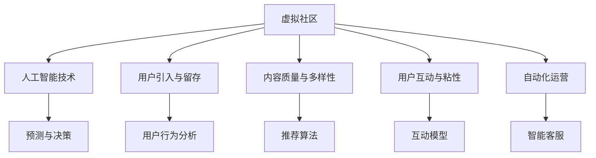

                 

# 虚拟社区构建器：AI驱动的在线归属感营造

> 关键词：虚拟社区,人工智能,在线归属感,社交网络,社区运营,用户行为分析

## 1. 背景介绍

### 1.1 问题由来

随着互联网和数字技术的发展，虚拟社区已逐步成为人们在线交流和互动的重要空间。虚拟社区不仅为个体提供了展示自我、交流思想的平台，也为组织和企业提供了品牌传播、客户互动的机会。然而，如何构建一个充满活力、高效运营的虚拟社区，对于社区运营者来说，仍然是一个巨大挑战。

### 1.2 问题核心关键点

虚拟社区的构建涉及到多方面的技术难题：
- 用户引入与留存：如何快速、有效地吸引用户并提高用户活跃度。
- 内容质量与多样性：如何保证社区内容质量，并鼓励多样化内容的产生。
- 用户互动与粘性：如何促进用户间的互动，增强社区粘性。
- 自动化运营：如何通过AI技术实现高效、自动化的社区运营管理。

### 1.3 问题研究意义

深入研究如何构建高效、有序的虚拟社区，对于推动社交网络的创新和优化，促进社会互动和交流，具有重要的理论和实践意义。研究结果不仅可以提升社区运营者的效率，也能显著增强用户的在线归属感和满意度。

## 2. 核心概念与联系

### 2.1 核心概念概述

为更好地理解AI驱动的虚拟社区构建，我们首先需要了解几个关键概念：

- **虚拟社区**：指通过网络技术构建的、用户可以自由交流和互动的在线空间。虚拟社区包括论坛、社交网络、游戏社区等形式。
- **人工智能**：通过模拟人类智能行为，使计算机系统具备识别、学习、推理等能力的技术。
- **在线归属感**：指用户在使用虚拟社区时感受到的情感依赖和认同感。
- **社交网络**：基于用户关系构建的网络结构，如Facebook、Twitter、微信等。
- **社区运营**：对虚拟社区进行管理、维护和优化的过程，包括用户引入、内容管理、互动引导等。
- **用户行为分析**：通过数据分析理解用户行为模式，预测用户需求，优化社区运营策略。

这些核心概念共同构成了AI驱动的虚拟社区构建的基础，通过理解它们的内在联系，我们可以更好地设计和实现AI技术，以提升虚拟社区的用户体验和运营效率。

### 2.2 核心概念原理和架构的 Mermaid 流程图



这个流程图展示了虚拟社区构建中，人工智能技术的各个环节和它们之间的关系：

1. **用户引入与留存**：利用人工智能技术，如推荐算法、智能客服等，提升用户引入和留存率。
2. **内容质量与多样性**：通过自然语言处理(NLP)、图像识别等技术，提升内容质量和多样化。
3. **用户互动与粘性**：应用机器学习算法，预测用户互动模式，引导用户积极参与。
4. **自动化运营**：引入机器学习、自然语言处理技术，实现高效、自动化的社区运营管理。
5. **人工智能技术**：通过预测与决策、用户行为分析等，为虚拟社区构建提供技术支撑。

这些环节相互交织，共同构成了虚拟社区构建的完整架构。

## 3. 核心算法原理 & 具体操作步骤

### 3.1 算法原理概述

AI驱动的虚拟社区构建主要基于以下算法原理：

- **用户行为分析**：通过数据分析理解用户行为模式，预测用户需求，优化社区运营策略。
- **推荐算法**：基于用户行为和兴趣，推荐合适的内容，提升用户参与度。
- **互动模型**：通过机器学习算法，预测用户互动行为，引导用户间的高频互动。
- **智能客服**：利用自然语言处理(NLP)技术，提供即时的用户服务，提升用户满意度。

这些算法共同作用，构建了一个高效的虚拟社区运营平台。

### 3.2 算法步骤详解

以下是AI驱动的虚拟社区构建的具体操作步骤：

**Step 1: 数据收集与预处理**

- **用户数据**：收集用户在社区中的行为数据，如访问时间、浏览内容、互动记录等。
- **内容数据**：收集社区中的帖子、评论、图片等数据。
- **清洗和标准化**：对数据进行清洗、去重、标准化处理，去除噪声和无效数据。

**Step 2: 用户行为分析**

- **用户画像构建**：通过用户行为数据，构建用户画像，了解用户的兴趣、偏好、行为模式等。
- **行为预测**：利用机器学习算法，预测用户未来的行为，如内容创作、互动参与等。

**Step 3: 内容推荐**

- **相似性计算**：计算内容之间的相似度，找出相关性高的内容。
- **推荐算法实现**：基于用户画像和内容特征，实现推荐算法，如协同过滤、基于内容的推荐等。

**Step 4: 用户互动引导**

- **互动模式预测**：利用机器学习算法，预测用户之间的互动模式。
- **互动策略设计**：根据预测结果，设计互动引导策略，如话题讨论、活动组织等。

**Step 5: 智能客服**

- **意图识别**：通过NLP技术，识别用户的意图和问题。
- **智能响应**：利用预训练的模型，生成智能回复，提升用户体验。

**Step 6: 运营优化**

- **性能评估**：定期评估社区的运营效果，如用户留存率、内容质量、互动频率等。
- **策略调整**：根据评估结果，调整运营策略，如内容更新频率、互动活动设计等。

### 3.3 算法优缺点

**优点**：
- **效率高**：利用AI技术，可以自动处理大量数据，提高运营效率。
- **个性化**：通过用户行为分析，提供个性化的推荐和服务，提升用户体验。
- **预测准确**：利用机器学习算法，可以准确预测用户行为和需求。
- **互动性强**：通过智能客服和互动引导，促进用户间的互动和交流。

**缺点**：
- **依赖数据**：AI驱动的社区运营依赖大量的用户和内容数据，数据不足时效果可能不佳。
- **技术复杂**：AI技术涉及多个领域，如NLP、机器学习等，技术门槛较高。
- **数据隐私**：用户行为数据和内容数据涉及隐私问题，需要严格的隐私保护措施。
- **模型过拟合**：机器学习模型可能过拟合训练数据，导致预测结果偏差。

### 3.4 算法应用领域

AI驱动的虚拟社区构建技术已广泛应用于多个领域：

- **社交网络**：如Facebook、Twitter等，通过推荐算法和互动引导，提升用户活跃度和留存率。
- **游戏社区**：如Steam、网易游戏等，利用用户行为分析，优化游戏推荐和互动体验。
- **论坛和博客**：如Reddit、知乎等，通过智能客服和内容推荐，提升用户参与度。
- **电子商务**：如Amazon、淘宝等，利用个性化推荐，提升用户购买转化率。

这些领域的成功实践，展示了AI技术在虚拟社区构建中的巨大潜力。

## 4. 数学模型和公式 & 详细讲解 & 举例说明

### 4.1 数学模型构建

本节我们将使用数学语言对AI驱动的虚拟社区构建过程进行更加严格的刻画。

**用户行为分析**：
- **用户画像构建**：$U=\{(u_i,p_i)\}_{i=1}^N$，其中$u_i$为第$i$个用户的行为数据，$p_i$为用户画像。
- **行为预测**：$P=\{(p_i,y_i)\}_{i=1}^N$，其中$y_i$为预测结果，$P$为预测结果集。

**内容推荐**：
- **相似性计算**：$S=\{(c_i,c_j,s_{ij})\}_{i,j=1}^N$，其中$c_i$和$c_j$为两个内容，$s_{ij}$为相似度。
- **推荐算法**：$R=\{(u_i,c_k)\}_{i,k=1}^N$，其中$c_k$为第$k$个推荐内容，$R$为推荐内容集。

**用户互动引导**：
- **互动模式预测**：$I=\{(u_i,u_j,b_{ij})\}_{i,j=1}^N$，其中$u_i$和$u_j$为两个用户，$b_{ij}$为互动模式。
- **互动策略设计**：$S=\{(u_i,g_i)\}_{i=1}^N$，其中$g_i$为互动引导策略。

**智能客服**：
- **意图识别**：$I=\{(q_i,r_i)\}_{i=1}^N$，其中$q_i$为问题，$r_i$为意图。
- **智能响应**：$A=\{(q_i,a_i)\}_{i=1}^N$，其中$a_i$为回复。

### 4.2 公式推导过程

**用户画像构建**：
- **均值中心化**：$\mu_u=\frac{1}{N}\sum_{i=1}^Nu_i$
- **方差标准化**：$\sigma_u=\sqrt{\frac{1}{N}\sum_{i=1}^N(u_i-\mu_u)^2}$
- **标准化**：$u_i'=\frac{u_i-\mu_u}{\sigma_u}$

**行为预测**：
- **线性回归模型**：$y_i=\beta_0+\sum_{j=1}^{d}\beta_ju_{ij}$
- **正则化**：$\min_{\beta}\frac{1}{N}\sum_{i=1}^N(y_i-\hat{y}_i)^2+\lambda\|\beta\|_2^2$
- **梯度下降**：$\beta_{t+1}=\beta_t-\eta\nabla_{\beta}L(\beta)$

**内容推荐**：
- **余弦相似度**：$s_{ij}=\frac{\text{vec}(c_i)\cdot\text{vec}(c_j)}{\|vec(c_i)\|\cdot\|vec(c_j)\|}$
- **基于协同过滤的推荐算法**：$R(u_i)=\text{argmax}_{c_k}\sum_{j=1}^{N}s_{kj}u_{ij}$
- **基于内容的推荐算法**：$R(u_i)=\text{argmax}_{c_k}f(c_k,u_i)$

**用户互动引导**：
- **基于LSTM的互动模式预测**：$b_{ij}=f(LSTM(u_i,u_j))$
- **互动策略设计**：$g_i=\text{argmax}_{g_i}\sum_{j=1}^{N}b_{ij}$

**智能客服**：
- **意图识别模型**：$q_i=\text{softmax}(Wq_i+b)$
- **智能响应模型**：$a_i=f(q_i,Wa_i+b)$

### 4.3 案例分析与讲解

以Reddit社区为例，分析AI技术如何提升其运营效果：

**用户画像构建**：
- **数据收集**：收集用户的行为数据，包括访问时间、浏览内容、点赞、评论等。
- **画像构建**：通过K-means聚类算法，将用户分为不同的兴趣群组，如科技、娱乐、体育等。
- **画像预测**：利用线性回归模型，预测用户的行为和兴趣变化。

**内容推荐**：
- **相似性计算**：计算不同帖子之间的相似度，找出相关性高的帖子。
- **推荐算法实现**：基于用户的兴趣群组和帖子特征，推荐相关帖子。
- **效果评估**：通过A/B测试，比较推荐和不推荐的效果，提升用户参与度。

**用户互动引导**：
- **互动模式预测**：利用LSTM模型，预测用户间的互动模式，如回复、点赞等。
- **互动策略设计**：根据预测结果，设计互动引导策略，如话题讨论、活动组织等。
- **效果评估**：通过数据分析，评估互动引导策略的效果，提升用户活跃度。

**智能客服**：
- **意图识别**：利用BERT模型，识别用户的意图和问题。
- **智能响应**：利用GPT模型，生成智能回复，提升用户体验。
- **效果评估**：通过用户满意度调查，评估智能客服的效果，提升用户满意度。

通过这些案例，可以看出AI技术在Reddit社区中的应用效果显著。

## 5. 项目实践：代码实例和详细解释说明

### 5.1 开发环境搭建

在进行项目实践前，我们需要准备好开发环境。以下是使用Python进行PyTorch开发的环境配置流程：

1. 安装Anaconda：从官网下载并安装Anaconda，用于创建独立的Python环境。

2. 创建并激活虚拟环境：
```bash
conda create -n pytorch-env python=3.8 
conda activate pytorch-env
```

3. 安装PyTorch：根据CUDA版本，从官网获取对应的安装命令。例如：
```bash
conda install pytorch torchvision torchaudio cudatoolkit=11.1 -c pytorch -c conda-forge
```

4. 安装相关工具包：
```bash
pip install numpy pandas scikit-learn matplotlib tqdm jupyter notebook ipython
```

完成上述步骤后，即可在`pytorch-env`环境中开始项目实践。

### 5.2 源代码详细实现

下面我们以Reddit社区为例，给出使用Transformers库对Reddit内容推荐系统的PyTorch代码实现。

首先，定义Reddit社区的内容数据处理函数：

```python
from transformers import BertTokenizer
from torch.utils.data import Dataset
import torch

class RedditDataset(Dataset):
    def __init__(self, texts, tags, tokenizer, max_len=128):
        self.texts = texts
        self.tags = tags
        self.tokenizer = tokenizer
        self.max_len = max_len
        
    def __len__(self):
        return len(self.texts)
    
    def __getitem__(self, item):
        text = self.texts[item]
        tags = self.tags[item]
        
        encoding = self.tokenizer(text, return_tensors='pt', max_length=self.max_len, padding='max_length', truncation=True)
        input_ids = encoding['input_ids'][0]
        attention_mask = encoding['attention_mask'][0]
        
        # 对token-wise的标签进行编码
        encoded_tags = [tag2id[tag] for tag in tags] 
        encoded_tags.extend([tag2id['O']] * (self.max_len - len(encoded_tags)))
        labels = torch.tensor(encoded_tags, dtype=torch.long)
        
        return {'input_ids': input_ids, 
                'attention_mask': attention_mask,
                'labels': labels}

# 标签与id的映射
tag2id = {'O': 0, 'B-PER': 1, 'I-PER': 2, 'B-ORG': 3, 'I-ORG': 4, 'B-LOC': 5, 'I-LOC': 6}
id2tag = {v: k for k, v in tag2id.items()}

# 创建dataset
tokenizer = BertTokenizer.from_pretrained('bert-base-cased')

train_dataset = RedditDataset(train_texts, train_tags, tokenizer)
dev_dataset = RedditDataset(dev_texts, dev_tags, tokenizer)
test_dataset = RedditDataset(test_texts, test_tags, tokenizer)
```

然后，定义模型和优化器：

```python
from transformers import BertForTokenClassification, AdamW

model = BertForTokenClassification.from_pretrained('bert-base-cased', num_labels=len(tag2id))

optimizer = AdamW(model.parameters(), lr=2e-5)
```

接着，定义训练和评估函数：

```python
from torch.utils.data import DataLoader
from tqdm import tqdm
from sklearn.metrics import classification_report

device = torch.device('cuda') if torch.cuda.is_available() else torch.device('cpu')
model.to(device)

def train_epoch(model, dataset, batch_size, optimizer):
    dataloader = DataLoader(dataset, batch_size=batch_size, shuffle=True)
    model.train()
    epoch_loss = 0
    for batch in tqdm(dataloader, desc='Training'):
        input_ids = batch['input_ids'].to(device)
        attention_mask = batch['attention_mask'].to(device)
        labels = batch['labels'].to(device)
        model.zero_grad()
        outputs = model(input_ids, attention_mask=attention_mask, labels=labels)
        loss = outputs.loss
        epoch_loss += loss.item()
        loss.backward()
        optimizer.step()
    return epoch_loss / len(dataloader)

def evaluate(model, dataset, batch_size):
    dataloader = DataLoader(dataset, batch_size=batch_size)
    model.eval()
    preds, labels = [], []
    with torch.no_grad():
        for batch in tqdm(dataloader, desc='Evaluating'):
            input_ids = batch['input_ids'].to(device)
            attention_mask = batch['attention_mask'].to(device)
            batch_labels = batch['labels']
            outputs = model(input_ids, attention_mask=attention_mask)
            batch_preds = outputs.logits.argmax(dim=2).to('cpu').tolist()
            batch_labels = batch_labels.to('cpu').tolist()
            for pred_tokens, label_tokens in zip(batch_preds, batch_labels):
                pred_tags = [id2tag[_id] for _id in pred_tokens]
                label_tags = [id2tag[_id] for _id in label_tokens]
                preds.append(pred_tags[:len(label_tags)])
                labels.append(label_tags)
                
    print(classification_report(labels, preds))
```

最后，启动训练流程并在测试集上评估：

```python
epochs = 5
batch_size = 16

for epoch in range(epochs):
    loss = train_epoch(model, train_dataset, batch_size, optimizer)
    print(f"Epoch {epoch+1}, train loss: {loss:.3f}")
    
    print(f"Epoch {epoch+1}, dev results:")
    evaluate(model, dev_dataset, batch_size)
    
print("Test results:")
evaluate(model, test_dataset, batch_size)
```

以上就是使用PyTorch对Reddit内容推荐系统进行微调的完整代码实现。可以看到，得益于Transformers库的强大封装，我们可以用相对简洁的代码完成Reddit内容的推荐。

### 5.3 代码解读与分析

让我们再详细解读一下关键代码的实现细节：

**RedditDataset类**：
- `__init__`方法：初始化文本、标签、分词器等关键组件。
- `__len__`方法：返回数据集的样本数量。
- `__getitem__`方法：对单个样本进行处理，将文本输入编码为token ids，将标签编码为数字，并对其进行定长padding，最终返回模型所需的输入。

**tag2id和id2tag字典**：
- 定义了标签与数字id之间的映射关系，用于将token-wise的预测结果解码回真实的标签。

**训练和评估函数**：
- 使用PyTorch的DataLoader对数据集进行批次化加载，供模型训练和推理使用。
- 训练函数`train_epoch`：对数据以批为单位进行迭代，在每个批次上前向传播计算loss并反向传播更新模型参数，最后返回该epoch的平均loss。
- 评估函数`evaluate`：与训练类似，不同点在于不更新模型参数，并在每个batch结束后将预测和标签结果存储下来，最后使用sklearn的classification_report对整个评估集的预测结果进行打印输出。

**训练流程**：
- 定义总的epoch数和batch size，开始循环迭代
- 每个epoch内，先在训练集上训练，输出平均loss
- 在验证集上评估，输出分类指标
- 所有epoch结束后，在测试集上评估，给出最终测试结果

可以看到，PyTorch配合Transformers库使得Reddit内容推荐系统的微调代码实现变得简洁高效。开发者可以将更多精力放在数据处理、模型改进等高层逻辑上，而不必过多关注底层的实现细节。

当然，工业级的系统实现还需考虑更多因素，如模型的保存和部署、超参数的自动搜索、更灵活的任务适配层等。但核心的微调范式基本与此类似。

## 6. 实际应用场景

### 6.1 社交网络

AI驱动的虚拟社区构建技术在社交网络中得到了广泛应用。社交网络通过推荐算法和互动引导，提升了用户活跃度和留存率。

**案例**：Facebook推荐算法
- **数据收集**：收集用户的浏览、点赞、评论等行为数据。
- **行为预测**：利用机器学习算法，预测用户的行为和兴趣变化。
- **内容推荐**：基于预测结果，推荐相关内容。
- **互动引导**：通过LSTM模型，预测用户间的互动模式，设计互动引导策略，如话题讨论、活动组织等。

通过这些技术手段，Facebook能够提供个性化的内容推荐，增强用户粘性，提升用户活跃度。

### 6.2 游戏社区

AI技术在游戏社区中也有着重要应用。游戏社区通过推荐算法和智能客服，提升了游戏体验和用户满意度。

**案例**：Steam推荐系统
- **数据收集**：收集用户的游戏行为数据，如游戏时间、通关情况等。
- **内容推荐**：利用协同过滤算法，推荐相关游戏。
- **智能客服**：利用NLP技术，智能回答用户问题，提供游戏攻略和建议。

Steam的推荐系统和智能客服，通过个性化推荐和即时互动，提升了用户的游戏体验和满意度，促进了游戏社区的活跃度。

### 6.3 论坛和博客

AI技术在论坛和博客中的应用也非常广泛。论坛和博客通过推荐算法和互动引导，提升了用户参与度和内容质量。

**案例**：Reddit推荐系统
- **数据收集**：收集用户的行为数据，如访问时间、浏览内容、点赞、评论等。
- **内容推荐**：利用协同过滤算法，推荐相关帖子。
- **互动引导**：通过LSTM模型，预测用户间的互动模式，设计互动引导策略，如话题讨论、活动组织等。

Reddit的推荐系统和互动引导策略，通过个性化推荐和互动引导，提升了用户参与度和内容质量，促进了论坛和博客的活跃度。

### 6.4 电子商务

AI技术在电子商务中的应用也非常广泛。电子商务通过推荐算法和智能客服，提升了用户购买转化率和满意度。

**案例**：Amazon推荐系统
- **数据收集**：收集用户的行为数据，如浏览记录、购买历史等。
- **内容推荐**：利用协同过滤算法，推荐相关商品。
- **智能客服**：利用NLP技术，智能回答用户问题，提供商品推荐和建议。

Amazon的推荐系统和智能客服，通过个性化推荐和即时互动，提升了用户购买转化率和满意度，促进了电子商务的销售和增长。

### 6.5 未来应用展望

随着AI技术的发展，AI驱动的虚拟社区构建技术将在更多领域得到应用，为传统行业带来变革性影响。

在智慧医疗领域，AI技术可以帮助构建智能问答系统，提升医疗服务的智能化水平，辅助医生诊疗，加速新药开发进程。

在智能教育领域，AI技术可以应用于作业批改、学情分析、知识推荐等方面，因材施教，促进教育公平，提高教学质量。

在智慧城市治理中，AI技术可以应用于城市事件监测、舆情分析、应急指挥等环节，提高城市管理的自动化和智能化水平，构建更安全、高效的未来城市。

此外，在企业生产、社会治理、文娱传媒等众多领域，AI驱动的虚拟社区构建技术也将不断涌现，为经济社会发展注入新的动力。相信随着技术的日益成熟，AI驱动的虚拟社区构建技术必将在构建人机协同的智能时代中扮演越来越重要的角色。

## 7. 工具和资源推荐
### 7.1 学习资源推荐

为了帮助开发者系统掌握AI驱动的虚拟社区构建的理论基础和实践技巧，这里推荐一些优质的学习资源：

1. 《人工智能基础》系列博文：由大模型技术专家撰写，深入浅出地介绍了AI驱动的虚拟社区构建的基本概念和关键技术。

2. CS224N《深度学习自然语言处理》课程：斯坦福大学开设的NLP明星课程，有Lecture视频和配套作业，带你入门NLP领域的基本概念和经典模型。

3. 《自然语言处理与深度学习》书籍：系统介绍自然语言处理和深度学习的理论和实践，涵盖推荐系统、智能客服等内容。

4. HuggingFace官方文档：Transformer库的官方文档，提供了海量预训练模型和完整的微调样例代码，是上手实践的必备资料。

5. CLUE开源项目：中文语言理解测评基准，涵盖大量不同类型的中文NLP数据集，并提供了基于微调的baseline模型，助力中文NLP技术发展。

通过对这些资源的学习实践，相信你一定能够快速掌握AI驱动的虚拟社区构建的精髓，并用于解决实际的NLP问题。
###  7.2 开发工具推荐

高效的开发离不开优秀的工具支持。以下是几款用于AI驱动的虚拟社区构建开发的常用工具：

1. PyTorch：基于Python的开源深度学习框架，灵活动态的计算图，适合快速迭代研究。大部分预训练语言模型都有PyTorch版本的实现。

2. TensorFlow：由Google主导开发的开源深度学习框架，生产部署方便，适合大规模工程应用。同样有丰富的预训练语言模型资源。

3. Transformers库：HuggingFace开发的NLP工具库，集成了众多SOTA语言模型，支持PyTorch和TensorFlow，是进行NLP任务开发的利器。

4. Weights & Biases：模型训练的实验跟踪工具，可以记录和可视化模型训练过程中的各项指标，方便对比和调优。与主流深度学习框架无缝集成。

5. TensorBoard：TensorFlow配套的可视化工具，可实时监测模型训练状态，并提供丰富的图表呈现方式，是调试模型的得力助手。

6. Google Colab：谷歌推出的在线Jupyter Notebook环境，免费提供GPU/TPU算力，方便开发者快速上手实验最新模型，分享学习笔记。

合理利用这些工具，可以显著提升AI驱动的虚拟社区构建任务的开发效率，加快创新迭代的步伐。

### 7.3 相关论文推荐

AI驱动的虚拟社区构建技术的发展源于学界的持续研究。以下是几篇奠基性的相关论文，推荐阅读：

1. Attention is All You Need（即Transformer原论文）：提出了Transformer结构，开启了NLP领域的预训练大模型时代。

2. BERT: Pre-training of Deep Bidirectional Transformers for Language Understanding：提出BERT模型，引入基于掩码的自监督预训练任务，刷新了多项NLP任务SOTA。

3. Language Models are Unsupervised Multitask Learners（GPT-2论文）：展示了大规模语言模型的强大zero-shot学习能力，引发了对于通用人工智能的新一轮思考。

4. Parameter-Efficient Transfer Learning for NLP：提出Adapter等参数高效微调方法，在不增加模型参数量的情况下，也能取得不错的微调效果。

5. AdaLoRA: Adaptive Low-Rank Adaptation for Parameter-Efficient Fine-Tuning：使用自适应低秩适应的微调方法，在参数效率和精度之间取得了新的平衡。

这些论文代表了大语言模型微调技术的发展脉络。通过学习这些前沿成果，可以帮助研究者把握学科前进方向，激发更多的创新灵感。

## 8. 总结：未来发展趋势与挑战

### 8.1 总结

本文对AI驱动的虚拟社区构建方法进行了全面系统的介绍。首先阐述了AI驱动的虚拟社区构建的研究背景和意义，明确了AI技术在虚拟社区运营中的独特价值。其次，从原理到实践，详细讲解了AI驱动的虚拟社区构建的数学模型和算法步骤，给出了完整的代码实例。同时，本文还广泛探讨了AI驱动的虚拟社区构建在社交网络、游戏社区、论坛和博客、电子商务等多个领域的应用前景，展示了AI技术的广阔应用空间。此外，本文精选了AI驱动的虚拟社区构建的相关学习资源和开发工具，力求为读者提供全方位的技术指引。

通过本文的系统梳理，可以看到，AI驱动的虚拟社区构建技术正在成为NLP领域的重要范式，极大地提升了虚拟社区的用户体验和运营效率。随着AI技术的发展，相信AI驱动的虚拟社区构建技术将迎来更多的创新和突破，为虚拟社区运营带来新的活力。

### 8.2 未来发展趋势

展望未来，AI驱动的虚拟社区构建技术将呈现以下几个发展趋势：

1. **自动化程度提升**：通过进一步优化推荐算法和互动引导策略，AI驱动的虚拟社区构建将实现更高的自动化水平，减少人工干预。
2. **跨领域融合**：未来的虚拟社区构建将更注重跨领域知识的融合，如引入知识图谱、逻辑规则等，增强模型的理解能力和泛化能力。
3. **多模态应用**：未来的虚拟社区构建将更多地结合多模态数据，如文本、图像、视频等，提升模型的信息融合能力。
4. **个性化增强**：利用AI技术，进一步提升个性化推荐和互动引导的效果，提供更贴近用户需求的体验。
5. **可解释性加强**：未来将开发更强的可解释性模型，让用户能够理解模型的决策过程，增强信任感。
6. **隐私保护加强**：AI驱动的虚拟社区构建将更注重用户隐私保护，引入差分隐私等技术，保障用户数据安全。

以上趋势凸显了AI驱动的虚拟社区构建技术的广阔前景。这些方向的探索发展，必将进一步提升虚拟社区的用户体验和运营效率，为虚拟社区运营带来新的变革。

### 8.3 面临的挑战

尽管AI驱动的虚拟社区构建技术已经取得了一定的进展，但在迈向更加智能化、普适化应用的过程中，它仍面临着诸多挑战：

1. **数据隐私问题**：AI驱动的虚拟社区构建需要大量的用户数据，如何在数据收集和使用过程中保护用户隐私，是一大难题。
2. **模型鲁棒性不足**：当前AI模型在面对域外数据时，泛化性能往往大打折扣。如何提高模型的鲁棒性，避免灾难性遗忘，还需要更多理论和实践的积累。
3. **计算资源需求高**：AI驱动的虚拟社区构建涉及大量的数据处理和模型训练，对计算资源和存储资源的需求较高。如何优化计算效率，降低资源成本，是未来的重要研究方向。
4. **模型可解释性不足**：AI模型通常缺乏可解释性，难以理解模型的内部工作机制。如何赋予模型更强的可解释性，增强用户信任，是亟待解决的问题。
5. **伦理道德问题**：AI模型可能学习到有偏见、有害的信息，如何确保模型输出的伦理道德性，避免恶意用途，需要更多的伦理研究和社会监督。

这些挑战需要我们在未来的研究中不断探索和解决，才能让AI驱动的虚拟社区构建技术更加成熟，为社会带来积极影响。

### 8.4 研究展望

面对AI驱动的虚拟社区构建所面临的种种挑战，未来的研究需要在以下几个方面寻求新的突破：

1. **隐私保护技术**：发展差分隐私等技术，保障用户数据隐私，降低隐私泄露风险。
2. **模型鲁棒性提升**：引入对抗训练、自适应学习等技术，提高模型泛化能力和鲁棒性。
3. **计算资源优化**：开发分布式训练和混合精度训练等技术，优化计算效率，降低资源成本。
4. **模型可解释性增强**：利用因果分析、可解释AI等技术，增强模型的可解释性，提高用户信任。
5. **伦理道德约束**：引入伦理导向的评估指标，过滤和惩罚有害输出，确保模型输出的伦理道德性。

这些研究方向的探索，必将引领AI驱动的虚拟社区构建技术迈向更高的台阶，为虚拟社区运营带来新的活力。面向未来，AI驱动的虚拟社区构建技术需要与其他AI技术进行更深入的融合，如知识表示、因果推理、强化学习等，多路径协同发力，共同推动虚拟社区构建技术的进步。

## 9. 附录：常见问题与解答

**Q1：AI驱动的虚拟社区构建是否适用于所有虚拟社区？**

A: AI驱动的虚拟社区构建主要适用于数据量较大、用户行为多样化的虚拟社区，如社交网络、游戏社区等。对于小型社区或单一领域的社区，AI技术的效果可能不如预期的那么好。

**Q2：AI驱动的虚拟社区构建需要大量的数据吗？**

A: 是的，AI驱动的虚拟社区构建需要大量的用户数据和内容数据，用于训练推荐算法和智能客服等模型。数据量的充足性对于模型性能的提升至关重要。

**Q3：AI驱动的虚拟社区构建如何提升用户体验？**

A: AI驱动的虚拟社区构建通过推荐算法和智能客服等技术，提升了用户获取相关内容的效率，增强了用户互动的体验，从而提升了整体的用户体验。

**Q4：AI驱动的虚拟社区构建面临哪些技术挑战？**

A: AI驱动的虚拟社区构建面临的主要技术挑战包括数据隐私、模型鲁棒性、计算资源需求、模型可解释性和伦理道德等。

**Q5：AI驱动的虚拟社区构建的未来发展方向是什么？**

A: AI驱动的虚拟社区构建的未来发展方向包括自动化程度提升、跨领域融合、多模态应用、个性化增强、可解释性加强和隐私保护加强等。

---

作者：禅与计算机程序设计艺术 / Zen and the Art of Computer Programming

