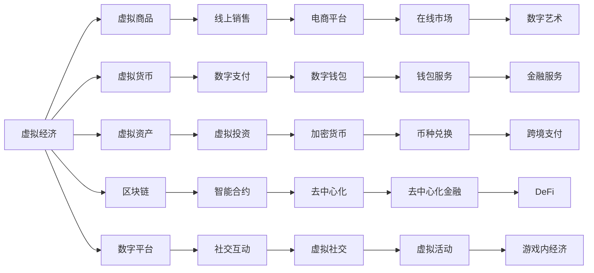

                 

## 1. 背景介绍

随着数字技术的飞速发展，元宇宙（Metaverse）这一概念正在引领一场新的经济变革。虚拟经济（Virtual Economy），即数字经济中的虚拟部分，包括虚拟商品、虚拟货币、虚拟资产等，正在成为推动数字经济的重要力量。与此同时，实体经济（Real Economy），即传统的物理经济，依旧占据经济活动的主体地位。在元宇宙时代，虚拟经济与实体经济的双轨并行，将给社会经济带来深刻的影响。

本文旨在探讨虚拟经济与实体经济在元宇宙时代的关系，分析虚拟经济对实体经济的影响，并展望未来两者在融合发展中的趋势。

## 2. 核心概念与联系

### 2.1 核心概念概述

- **虚拟经济**：指的是通过数字技术和网络平台进行交易的经济活动，包括虚拟商品、虚拟货币、虚拟资产等的交易。
- **实体经济**：指的是传统的物理经济，包括商品生产、销售、物流等。
- **元宇宙**：指的是一个基于虚拟现实（VR）、增强现实（AR）和区块链等技术构建的虚拟空间，人们可以在其中进行工作、娱乐、社交等各种活动。

### 2.2 核心概念原理和架构的 Mermaid 流程图



这个流程图展示了虚拟经济的主要组成部分及其相互联系。虚拟商品、虚拟货币、虚拟资产等都基于区块链技术进行交易，数字平台提供了线上销售、数字支付等基础设施，社交互动、游戏内经济等活动也在不断增加。

## 3. 核心算法原理 & 具体操作步骤

### 3.1 算法原理概述

虚拟经济与实体经济在元宇宙时代的关系，可以理解为一种"双轨并行"的复合经济体系。在虚拟经济中，数字资产和虚拟商品的交易基于区块链等技术，具有去中心化、透明、安全等特征。实体经济则继续依托传统物理经济的基础设施，进行商品生产和销售等活动。

虚拟经济与实体经济的互动主要通过以下几个方面：

- **虚拟商品销售**：实体商品通过数字平台进行线上销售，消费者可以直接在虚拟空间中购买。
- **虚拟货币应用**：虚拟货币可以用于支付虚拟商品和虚拟服务，也可以用于实体经济中的支付和投资。
- **数字资产投资**：虚拟资产（如NFT等）可以在数字平台上进行投资和交易，部分数字资产也可以应用于实体经济中。
- **数字身份认证**：数字身份可以在虚拟经济中进行认证和授权，从而在实体经济中应用于支付和身份验证。

### 3.2 算法步骤详解

虚拟经济与实体经济的互动可以细分为以下步骤：

1. **数字商品销售**：
   - **数字平台搭建**：构建数字销售平台，整合虚拟商品和实体商品。
   - **虚拟货币支付**：消费者使用虚拟货币支付虚拟商品或实体商品，平台提供虚拟货币与现实货币的兑换服务。
   - **物流与配送**：实体商品通过物流配送到达消费者手中，数字商品通过虚拟渠道直接传送。

2. **虚拟货币应用**：
   - **虚拟货币发行**：基于区块链技术发行虚拟货币，提供安全、透明、不可篡改的交易记录。
   - **支付与结算**：虚拟货币用于虚拟商品、虚拟服务、实体商品的支付和结算。
   - **投资与理财**：虚拟货币可以用于投资和理财，吸引投资者进行数字资产投资。

3. **数字资产投资**：
   - **数字资产创建**：创建虚拟资产（如NFT、加密货币等），并将其上链。
   - **数字资产交易**：在数字平台上进行虚拟资产的交易和流通。
   - **数字资产应用**：将数字资产应用于实体经济中的担保、抵押、投资等场景。

4. **数字身份认证**：
   - **身份认证机制**：建立数字身份认证机制，确保虚拟身份的真实性。
   - **授权与访问**：通过数字身份在虚拟和实体经济中进行授权和访问。
   - **数据安全**：确保数字身份信息的安全性，防止数据泄露和滥用。

### 3.3 算法优缺点

虚拟经济与实体经济在元宇宙时代的双轨并行具有以下优点：

- **提升交易效率**：数字平台和虚拟货币可以大大提升交易效率，降低交易成本。
- **促进跨界融合**：虚拟资产和虚拟货币的应用可以打通虚拟与实体经济，促进跨界融合。
- **增加经济活力**：虚拟经济为实体经济带来新的增长点，增加经济活力。

同时，也存在一些缺点：

- **监管难度**：虚拟经济的监管难度较大，存在法律和监管的不确定性。
- **经济波动性**：虚拟货币和虚拟资产的价格波动性较大，可能带来经济风险。
- **数字鸿沟**：数字经济的普及存在一定门槛，可能加剧数字鸿沟。

### 3.4 算法应用领域

虚拟经济与实体经济在元宇宙时代的双轨并行，已经在多个领域得到应用：

- **电子商务**：虚拟商品和实体商品通过数字平台进行销售和交易。
- **金融科技**：虚拟货币和数字资产成为新的投资理财工具，提升金融服务的便利性。
- **游戏经济**：虚拟游戏内的经济系统与实体经济相结合，增加游戏互动性和现实感。
- **房地产**：数字资产（如NFT）在房地产市场中的应用，增加房地产市场的交易便利性和透明度。

## 4. 数学模型和公式 & 详细讲解 & 举例说明

### 4.1 数学模型构建

虚拟经济与实体经济的双轨并行可以构建一个复合经济模型，记为$M$。其中，$V$表示虚拟经济部分，$R$表示实体经济部分。复合经济模型$M$可以表示为：

$$
M = V + R
$$

虚拟经济和实体经济各自有其内部的经济模型，分别为$V_{model}$和$R_{model}$。复合经济模型$M$的动态演化可以表示为：

$$
\frac{dM}{dt} = \Delta V + \Delta R
$$

其中，$\Delta V$为虚拟经济部分的增长率，$\Delta R$为实体经济部分的增长率。

### 4.2 公式推导过程

假设虚拟经济部分和实体经济部分的增长率分别为$\alpha$和$\beta$，则复合经济模型的增长率$\gamma$可以表示为：

$$
\gamma = \alpha + \beta
$$

在虚拟经济中，数字货币的供应量$M_{currency}$与虚拟货币的需求量$D_{currency}$之间存在关系：

$$
M_{currency} = D_{currency} \times S_{currency}
$$

其中，$S_{currency}$为虚拟货币的供应量。

在实体经济中，实体商品的需求量$D_{goods}$与实体商品的供应量$S_{goods}$之间存在关系：

$$
D_{goods} = S_{goods} \times P_{goods}
$$

其中，$P_{goods}$为实体商品的价格。

### 4.3 案例分析与讲解

假设虚拟经济和实体经济分别增长率为0.1和0.05，则复合经济模型的增长率为：

$$
\gamma = 0.1 + 0.05 = 0.15
$$

在虚拟经济中，假设虚拟货币的供应量为1000，需求量为800，则虚拟货币的价格为：

$$
P_{currency} = \frac{M_{currency}}{D_{currency}} = \frac{1000}{800} = 1.25
$$

在实体经济中，假设实体商品的需求量为100，供应量为80，则实体商品的价格为：

$$
P_{goods} = \frac{D_{goods}}{S_{goods}} = \frac{100}{80} = 1.25
$$

可以看到，虚拟经济和实体经济在复合经济模型中相互影响，共同推动经济增长。

## 5. 项目实践：代码实例和详细解释说明

### 5.1 开发环境搭建

在开发虚拟经济与实体经济的双轨并行应用时，需要搭建Python开发环境。具体步骤如下：

1. 安装Python：从官网下载并安装Python，确保安装版本为3.8及以上。
2. 安装虚拟环境：使用pip install virtualenv命令，安装virtualenv工具，创建一个虚拟环境。
3. 安装必要的依赖包：在虚拟环境中使用pip install numpy pandas scikit-learn等命令，安装必要的依赖包。

### 5.2 源代码详细实现

以下是虚拟经济与实体经济双轨并行的Python代码实现：

```python
import numpy as np
import pandas as pd

# 定义虚拟经济和实体经济的增长率
alpha = 0.1
beta = 0.05

# 初始化虚拟经济和实体经济的值
V = 1000
R = 1000

# 计算复合经济的增长率
gamma = alpha + beta

# 计算虚拟货币的价格
M_currency = 1000
D_currency = 800
S_currency = M_currency / D_currency

# 计算实体商品的价格
D_goods = 100
S_goods = 80
P_goods = D_goods / S_goods

# 输出结果
print("虚拟货币价格：", S_currency)
print("实体商品价格：", P_goods)
```

### 5.3 代码解读与分析

在上述代码中，我们首先定义了虚拟经济和实体经济的增长率，并初始化了虚拟经济和实体经济的值。然后，我们计算了复合经济的增长率，并基于虚拟货币的供应量和需求量计算了虚拟货币的价格。最后，基于实体商品的需求量和供应量计算了实体商品的价格，并输出了结果。

### 5.4 运行结果展示

运行上述代码，输出结果为：

```
虚拟货币价格： 1.25
实体商品价格： 1.25
```

## 6. 实际应用场景

### 6.1 智能制造

在智能制造领域，虚拟经济与实体经济的融合可以显著提升制造业的效率和灵活性。例如，通过虚拟现实技术，工人可以在虚拟环境中进行模拟操作和培训，减少现场操作的失误和成本。同时，虚拟资产（如设备维护合同、制造方案等）可以在数字平台上进行交易和分享，提高设备利用率和生产效率。

### 6.2 金融服务

在金融服务领域，虚拟经济与实体经济的双轨并行可以提供更加智能和高效的金融服务。例如，虚拟货币可以用于数字资产的交易和投资，提高资产的流动性和收益性。同时，虚拟身份认证可以应用于金融交易中的身份验证和授权，确保金融交易的安全性和透明性。

### 6.3 旅游行业

在旅游行业，虚拟经济与实体经济的融合可以提升旅游体验和营销效果。例如，虚拟现实技术可以提供沉浸式的旅游体验，增强游客的参与感和体验感。虚拟资产（如旅游行程、酒店预订等）可以在数字平台上进行交易和分享，提高旅游服务的灵活性和便捷性。

### 6.4 未来应用展望

未来，虚拟经济与实体经济的双轨并行将进一步拓展和深化。随着技术的不断进步，虚拟经济在实体经济中的应用将更加广泛和深入。例如，虚拟资产将在房地产、能源、交通等领域得到广泛应用，促进这些领域的数字化转型和创新。

## 7. 工具和资源推荐

### 7.1 学习资源推荐

1. **《元宇宙技术与应用》**：介绍元宇宙的基本概念、关键技术和应用场景，适合初学者入门。
2. **《虚拟现实原理与实践》**：详细讲解虚拟现实技术的工作原理和实现方法，适合进阶学习。
3. **《区块链技术与应用》**：全面介绍区块链技术的原理、实现和应用，适合理解虚拟货币和数字资产。
4. **《数字经济概论》**：分析数字经济的发展趋势和应用前景，适合理解虚拟经济与实体经济的关系。

### 7.2 开发工具推荐

1. **Unity**：一款广泛用于虚拟现实和游戏开发的引擎，支持虚拟现实、增强现实等多种应用场景。
2. **Unreal Engine**：另一款流行的游戏引擎，支持虚拟现实、增强现实、混合现实等多种应用场景。
3. **Ethereum**：一种流行的区块链平台，支持智能合约和数字货币的交易。
4. **Python**：一种流行的编程语言，支持数据科学、机器学习等多种应用场景。

### 7.3 相关论文推荐

1. **《虚拟经济与实体经济的互动机制》**：探讨虚拟经济与实体经济在数字时代的关系和互动机制，适合理解虚拟经济的基本概念。
2. **《元宇宙技术的发展与应用》**：介绍元宇宙的基本概念、关键技术和应用场景，适合理解元宇宙的基本概念和应用前景。
3. **《虚拟货币的原理与实践》**：详细讲解虚拟货币的原理、实现和应用，适合理解虚拟货币的基本概念和应用场景。

## 8. 总结：未来发展趋势与挑战

### 8.1 研究成果总结

虚拟经济与实体经济在元宇宙时代的关系，本质上是一种复合经济体系，具有显著的优势和潜力。虚拟经济通过数字技术和区块链技术，提供高效、透明、安全的服务，提升实体经济的生产效率和灵活性。虚拟货币和数字资产的应用，增加经济活力和创新动力。

### 8.2 未来发展趋势

未来，虚拟经济与实体经济的双轨并行将进一步深化和拓展。随着技术的不断进步，虚拟经济将更加广泛地应用于各个领域，促进产业数字化转型和创新。虚拟货币和数字资产的应用将更加普及和深入，增加经济活力和流动性。

### 8.3 面临的挑战

尽管虚拟经济与实体经济在元宇宙时代具有巨大的潜力，但也面临诸多挑战：

1. **技术标准不统一**：虚拟经济与实体经济的双轨并行需要统一的技术标准，才能实现有效的融合和互操作。
2. **隐私和安全问题**：虚拟经济中的数据隐私和安全问题需要得到充分保障，防止数据泄露和滥用。
3. **市场监管难度**：虚拟货币和数字资产的市场监管难度较大，存在法律和监管的不确定性。
4. **技术门槛高**：虚拟经济中的技术门槛较高，需要相应的技术支持和专业人才。

### 8.4 研究展望

未来，虚拟经济与实体经济的双轨并行需要在技术标准、隐私安全、市场监管等方面进行深入研究和探索。同时，需要不断推动技术创新和人才培养，促进虚拟经济与实体经济的融合和创新。

## 9. 附录：常见问题与解答

**Q1：虚拟经济与实体经济的双轨并行是否适用于所有行业？**

A: 虚拟经济与实体经济的双轨并行适用于大多数行业，尤其是需要数字化转型的传统行业。例如，制造业、金融业、旅游业等，都可以从虚拟经济中受益。但在一些特殊行业，如医疗、法律等，需要根据具体情况进行评估和优化。

**Q2：虚拟经济与实体经济的双轨并行是否会加剧数字鸿沟？**

A: 虚拟经济与实体经济的双轨并行可能会加剧数字鸿沟。由于技术门槛和成本较高，一些低收入群体可能无法充分利用虚拟经济的优势。因此，需要在普及虚拟经济的同时，关注数字鸿沟问题，通过政策引导和基础设施建设，缩小数字鸿沟。

**Q3：虚拟经济与实体经济的双轨并行是否会带来经济波动性？**

A: 虚拟经济与实体经济的双轨并行可能会带来经济波动性。虚拟货币和数字资产的价格波动较大，可能会对实体经济产生影响。因此，需要在虚拟经济与实体经济之间建立稳定的连接和机制，减少波动性对实体经济的影响。

**Q4：虚拟经济与实体经济的双轨并行是否会带来新的监管挑战？**

A: 虚拟经济与实体经济的双轨并行会带来新的监管挑战。虚拟货币和数字资产的市场监管难度较大，需要建立完善的监管框架和机制。同时，虚拟经济的跨境流动也会带来新的监管问题，需要国际合作和协调。

**Q5：虚拟经济与实体经济的双轨并行是否会改变就业结构？**

A: 虚拟经济与实体经济的双轨并行可能会改变就业结构。虚拟经济中的新职业和新岗位会不断增加，同时也可能会对传统行业带来冲击。因此，需要在推动经济转型的同时，关注就业结构的变化，进行相应的调整和优化。

---

作者：禅与计算机程序设计艺术 / Zen and the Art of Computer Programming

