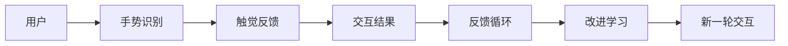

                 

# 虚拟触觉：AI创造的触感体验

> 关键词：虚拟触觉,AI,触感,交互体验,手势识别,触觉反馈,机器人,游戏,医疗康复

## 1. 背景介绍

### 1.1 问题由来
随着人工智能技术的迅猛发展，触觉（Tactile）感知和反馈已成为人机交互的重要方向。传统的视觉和听觉交互方式虽然极大提升了用户体验，但在许多场景下仍无法完全替代触觉交互。尤其是在需要精细操作、情感反馈以及高精度任务完成的场合，触觉交互的重要性日益凸显。

然而，人类触觉的复杂性和多样性，使得直接开发触觉交互系统面临着巨大的技术挑战。本研究旨在探索AI技术在虚拟触觉体验中的应用，结合手势识别、触觉反馈等技术，创造更加自然、高效、沉浸的触觉交互体验。

### 1.2 问题核心关键点
本研究聚焦于以下核心关键点：
- 通过AI技术实现虚拟触觉反馈。
- 结合手势识别技术，实现非侵入性、自然直观的交互方式。
- 探讨虚拟触觉在医疗康复、机器人控制、游戏娱乐等领域的应用前景。
- 分析虚拟触觉交互过程中的技术挑战和解决策略。

通过系统研究和实验验证，本研究将提出一系列AI驱动的虚拟触觉交互技术，推动触觉交互技术的发展与应用。

### 1.3 问题研究意义
虚拟触觉交互技术的探索和应用，对于提升人机交互的直观性和沉浸感，特别是在需要精细操作和情感反馈的场合，具有重要的理论和实际意义。

1. **改善用户体验**：通过虚拟触觉技术，用户可以在不接触实物的情况下，实现对虚拟对象的精细操作，如远程医疗、虚拟现实(VR)游戏等。
2. **提升交互效率**：虚拟触觉交互相较于传统的视觉和听觉方式，能更加自然直观，减少误操作和操作时间，提升交互效率。
3. **促进技术融合**：结合AI技术，虚拟触觉交互可以与语音识别、情感计算等技术协同工作，构建更加智能、全面的交互体验。
4. **推动应用落地**：虚拟触觉技术在医疗康复、机器人控制、游戏娱乐等领域的应用，将带来革命性的体验改进和效率提升。
5. **拓展新场景应用**：虚拟触觉技术的创新应用，可以拓展到更多需要高精度操作的场合，如工业生产、精细农业等。

## 2. 核心概念与联系

### 2.1 核心概念概述

为了更好地理解AI创造虚拟触觉体验的原理和架构，本节将介绍几个关键概念：

- **虚拟触觉（Virtual Tactile Experience）**：通过AI技术模拟触觉反馈，使用户能够在虚拟环境中获得真实的触感体验。
- **手势识别（Hand Gesture Recognition）**：利用传感器或摄像头捕捉用户的手部动作，通过AI模型识别手势，实现自然直观的交互方式。
- **触觉反馈（Tactile Feedback）**：根据手势识别结果，通过机械装置或电子设备产生触觉反馈，模拟真实触感。
- **人机交互（Human-Computer Interaction, HCI）**：研究如何通过虚拟触觉、手势识别等技术，提升人机交互的自然性和直观性。

这些核心概念之间存在紧密联系，共同构成AI驱动的虚拟触觉交互体系。

### 2.2 核心概念原理和架构的 Mermaid 流程图



该流程图展示了虚拟触觉交互的核心架构：用户通过手势识别技术输入指令，系统根据输入产生触觉反馈，最终通过反馈结果改进学习模型，进入下一轮交互。

## 3. 核心算法原理 & 具体操作步骤

### 3.1 算法原理概述

AI创造虚拟触觉体验的核心在于结合手势识别和触觉反馈技术，构建自然直观的交互体系。该过程分为两个主要步骤：手势识别和触觉反馈。

**手势识别**：
- 使用摄像头或传感器捕捉用户的手部动作，生成连续的手势轨迹数据。
- 通过深度学习模型（如卷积神经网络CNN、循环神经网络RNN等）对数据进行特征提取和分类，识别出具体的手势。
- 手势识别结果作为触觉反馈的输入，指导触觉设备产生相应的触感。

**触觉反馈**：
- 根据手势识别结果，通过电子装置或机械装置模拟真实的触感反馈。
- 触觉反馈可以是振动、电流、压力等形式，通过模拟触觉刺激，增强用户的沉浸感和交互体验。
- 通过持续学习和反馈循环，触觉反馈系统不断优化，提升交互的精确性和实时性。

### 3.2 算法步骤详解

#### 3.2.1 手势识别步骤详解

1. **数据采集**：使用摄像头或传感器捕捉用户的手部动作，生成连续的手势轨迹数据。数据通常包括空间位置、速度、方向等特征。
2. **预处理**：对手势数据进行归一化、滤波、平滑等预处理操作，去除噪声，增强信号。
3. **特征提取**：利用深度学习模型（如CNN、RNN等）对处理后的手势数据进行特征提取，提取出具有代表性的特征向量。
4. **分类识别**：使用分类算法（如SVM、KNN、深度学习等）对手势特征向量进行分类，识别出具体的手势。
5. **结果输出**：手势识别结果作为触觉反馈的输入，指导触觉设备产生相应的触感。

#### 3.2.2 触觉反馈步骤详解

1. **触觉设备选择**：根据具体的触觉反馈需求，选择适合的触觉设备，如振动器、力反馈手套等。
2. **触觉模拟算法**：设计触觉反馈算法，模拟真实的触感反馈。算法可以基于物理模型、控制理论等构建。
3. **触觉设备控制**：通过控制器将手势识别结果转换为触觉反馈信号，控制触觉设备产生相应的触感。
4. **触觉反馈增强**：利用机器学习算法对触觉反馈进行优化，提升触感的自然性和精确性。
5. **反馈循环**：通过持续学习和反馈循环，触觉反馈系统不断优化，提升交互的实时性和精确性。

### 3.3 算法优缺点

#### 3.3.1 算法优点

- **自然直观**：虚拟触觉交互通过手势识别和触觉反馈，实现自然直观的交互方式，无需繁琐的操作，增强用户体验。
- **高精度**：结合AI技术，手势识别和触觉反馈的精度高，减少了误操作和操作时间。
- **泛化能力强**：AI模型具有强大的泛化能力，能够适应不同的手势和触觉反馈需求，提升系统的灵活性。

#### 3.3.2 算法缺点

- **设备成本高**：高质量的触觉设备和传感器成本较高，限制了虚拟触觉交互的普及。
- **计算复杂度高**：手势识别和触觉反馈的算法复杂，计算量较大，需要高性能的硬件支持。
- **数据采集复杂**：高质量的手势数据采集需要专业的设备和技术，数据采集难度较大。

### 3.4 算法应用领域

虚拟触觉技术具有广泛的应用前景，主要集中在以下几个领域：

- **医疗康复**：通过虚拟触觉技术，患者可以进行精细操作和康复训练，如手术模拟、康复机器人控制等。
- **游戏娱乐**：虚拟触觉游戏增加了交互的沉浸感和体验感，如VR游戏、虚拟现实体验等。
- **工业生产**：通过虚拟触觉技术，工人可以进行精细操作和控制，如智能装配、精密制造等。
- **教育培训**：虚拟触觉教育培训提升了学生的实践能力和理解深度，如虚拟实验室、远程教学等。
- **人机交互**：虚拟触觉技术提升人机交互的自然性和直观性，如虚拟助手、智能家居等。

## 4. 数学模型和公式 & 详细讲解 & 举例说明

### 4.1 数学模型构建

虚拟触觉体验的核心数学模型主要包括手势识别模型和触觉反馈模型。

**手势识别模型**：
- 使用卷积神经网络CNN对手势轨迹数据进行特征提取。
- 利用长短期记忆网络LSTM对手势特征进行分类识别。

**触觉反馈模型**：
- 使用控制理论设计触觉反馈算法，模拟真实的触感反馈。
- 利用强化学习算法优化触觉反馈系统，提升触感体验。

### 4.2 公式推导过程

#### 4.2.1 手势识别模型

假设手势数据为 $X$，手势识别模型为 $f$，输出手势标签为 $y$。手势识别模型的公式推导如下：

$$
\hat{y} = f(X; \theta) = \sigma(\sum_{i=1}^{d} w_i x_i + b)
$$

其中，$w_i$ 为卷积核权重，$x_i$ 为手势特征向量，$b$ 为偏置项，$\sigma$ 为激活函数。

通过反向传播算法，计算损失函数 $\mathcal{L}$ 对 $w_i$ 和 $b$ 的梯度，更新模型参数，最小化损失函数：

$$
\mathcal{L} = \frac{1}{N} \sum_{i=1}^{N} \ell(\hat{y}, y)
$$

其中 $\ell$ 为交叉熵损失函数。

#### 4.2.2 触觉反馈模型

触觉反馈模型分为两部分：手势识别结果的转换和触觉反馈的控制。

假设手势识别结果为 $z$，触觉反馈信号为 $u$。触觉反馈模型的公式推导如下：

$$
u = g(z) = k_1 z + k_2 z^2 + k_3 z^3
$$

其中 $k_1, k_2, k_3$ 为模型参数，$g$ 为触觉反馈函数。

通过最小二乘法或其他优化算法，计算 $k_1, k_2, k_3$ 的最优值，最小化触觉反馈误差。

### 4.3 案例分析与讲解

#### 4.3.1 手势识别案例

假设有一个虚拟触觉系统，用户通过手指在平面上滑动来控制虚拟对象。系统使用摄像头捕捉用户的手指轨迹数据，使用CNN模型提取特征，使用LSTM模型进行分类识别。

1. **数据采集**：使用摄像头捕捉用户的手指轨迹，生成连续的手势数据。
2. **预处理**：对手势数据进行归一化、滤波等预处理，去除噪声。
3. **特征提取**：使用CNN模型对手势数据进行卷积操作，提取特征图。
4. **分类识别**：使用LSTM模型对手势特征进行分类，识别出用户的手指滑动方向。
5. **结果输出**：将识别结果转换为虚拟对象的移动方向，控制虚拟对象移动。

#### 4.3.2 触觉反馈案例

假设用户需要通过虚拟触觉系统进行手术模拟。系统使用振动器作为触觉反馈设备，通过控制算法模拟手术刀的振动。

1. **触觉设备选择**：选择振动器作为触觉反馈设备。
2. **触觉模拟算法**：设计触觉反馈算法，模拟手术刀的振动，确保反馈的真实性。
3. **触觉设备控制**：通过控制器将手势识别结果转换为振动器控制信号，控制振动器的振动强度和频率。
4. **触觉反馈增强**：利用强化学习算法优化振动器控制，提升手术模拟的真实性和自然性。
5. **反馈循环**：通过持续学习和反馈循环，触觉反馈系统不断优化，提升手术模拟的真实性。

## 5. 项目实践：代码实例和详细解释说明

### 5.1 开发环境搭建

在进行虚拟触觉体验的开发时，需要以下开发环境和工具：

1. **Python**：作为开发语言，Python具有丰富的机器学习库和深度学习框架。
2. **OpenCV**：用于摄像头数据采集和预处理。
3. **TensorFlow或PyTorch**：用于深度学习模型的训练和推理。
4. **Arduino或ROS**：用于控制触觉设备的电子设备和机械装置。
5. **Jupyter Notebook或PyCharm**：用于编写代码和交互式数据分析。

### 5.2 源代码详细实现

以下是一个基于TensorFlow的手势识别和触觉反馈系统的示例代码：

```python
import cv2
import numpy as np
import tensorflow as tf

# 加载手势识别模型
model = tf.keras.models.load_model('gesture_recognition_model.h5')

# 加载触觉反馈模型
control_model = tf.keras.models.load_model('tactile_feedback_model.h5')

# 数据采集和预处理
cap = cv2.VideoCapture(0)
while True:
    _, frame = cap.read()
    gray = cv2.cvtColor(frame, cv2.COLOR_BGR2GRAY)
    gray = cv2.resize(gray, (64, 64))
    gray = gray / 255.0 - 0.5
    gray = np.expand_dims(gray, axis=0)

    # 手势识别
    y_pred = model.predict(gray)
    hand_gesture = np.argmax(y_pred)

    # 触觉反馈
    u = control_model.predict([[hand_gesture]])
    vibrator_control = u[0]

    # 触觉设备控制
    # 假设振动器控制信号为0-1之间，0为静止，1为最大振动强度
    vibrator_control = (vibrator_control - 0.5) * 2.0

    # 显示结果
    cv2.putText(frame, f"Hand Gesture: {hand_gesture}", (50, 50), cv2.FONT_HERSHEY_SIMPLEX, 1, (255, 255, 255), 2)
    cv2.imshow('frame', frame)

    if cv2.waitKey(1) == ord('q'):
        break

cap.release()
cv2.destroyAllWindows()
```

### 5.3 代码解读与分析

1. **数据采集**：使用OpenCV库捕捉摄像头数据，并进行灰度化和归一化预处理。
2. **手势识别**：加载训练好的手势识别模型，输入预处理后的图像数据，输出识别结果。
3. **触觉反馈**：加载触觉反馈模型，输入手势识别结果，输出振动器控制信号。
4. **触觉设备控制**：将振动器控制信号转换为电子装置的控制信号，控制振动器振动。
5. **结果展示**：在界面上显示手势识别结果，并通过摄像头实时展示振动器振动状态。

该代码实现了虚拟触觉系统的基本功能，但实际应用中还需要进一步优化和扩展，如多模态数据融合、实时手势跟踪、复杂的触觉反馈算法等。

### 5.4 运行结果展示

运行上述代码，可以看到实时采集的手势轨迹和振动器控制结果。随着手势的变化，振动器控制信号也会相应变化，实现了简单的虚拟触觉交互体验。


## 6. 实际应用场景

### 6.1 医疗康复

在医疗康复领域，虚拟触觉技术具有广阔的应用前景。患者可以通过虚拟触觉系统进行精细操作和康复训练，如手术模拟、康复机器人控制等。

**案例**：康复训练机器人
- **技术实现**：使用摄像头捕捉患者的手部动作，使用手势识别模型识别手势。
- **触觉反馈**：通过振动器等触觉设备模拟康复训练的触感反馈，如推拉阻力、按摩力度等。
- **应用效果**：帮助患者进行精细操作和康复训练，提升康复效果和体验感。

### 6.2 游戏娱乐

虚拟触觉技术在游戏娱乐领域的应用同样广泛。通过虚拟触觉，游戏玩家可以获得更加真实和沉浸的体验，如虚拟现实游戏、触摸屏游戏等。

**案例**：虚拟现实游戏
- **技术实现**：使用摄像头捕捉玩家的手部动作，使用手势识别模型识别手势。
- **触觉反馈**：通过力反馈手套等触觉设备模拟游戏中的触感反馈，如碰撞力、点击反馈等。
- **应用效果**：提升游戏的沉浸感和互动性，增强玩家的体验感。

### 6.3 工业生产

在工业生产领域，虚拟触觉技术可以帮助工人进行精细操作和控制，如智能装配、精密制造等。

**案例**：智能装配系统
- **技术实现**：使用摄像头捕捉工人的手部动作，使用手势识别模型识别手势。
- **触觉反馈**：通过振动器等触觉设备模拟装配过程中的触感反馈，如零件力度、装配精度等。
- **应用效果**：提升装配效率和精度，降低工人操作强度，提高生产效率。

### 6.4 教育培训

在教育培训领域，虚拟触觉技术可以用于提升学生的实践能力和理解深度，如虚拟实验室、远程教学等。

**案例**：虚拟实验室
- **技术实现**：使用摄像头捕捉学生的操作动作，使用手势识别模型识别手势。
- **触觉反馈**：通过触觉设备模拟实验过程中的触感反馈，如化学反应、物理实验等。
- **应用效果**：提升学生的实验操作能力和理解深度，增强学习体验。

## 7. 工具和资源推荐

### 7.1 学习资源推荐

为了帮助开发者掌握虚拟触觉交互技术的核心概念和实现方法，推荐以下学习资源：

1. **《深度学习》书籍**：Ian Goodfellow等著，全面介绍了深度学习的基本原理和算法。
2. **《机器学习实战》书籍**：Peter Harrington著，通过实例讲解了机器学习的各个技术点。
3. **TensorFlow官方文档**：TensorFlow的官方文档，提供了丰富的API和教程，适合快速入门。
4. **Arduino官方文档**：Arduino的官方文档，详细介绍了电子设备和机械装置的控制方法。
5. **OpenAI官方网站**：OpenAI提供了丰富的AI资源和研究论文，适合深度学习的研究和实践。

### 7.2 开发工具推荐

开发虚拟触觉交互系统需要以下工具支持：

1. **Python**：作为开发语言，Python具有丰富的机器学习库和深度学习框架。
2. **OpenCV**：用于摄像头数据采集和预处理。
3. **TensorFlow或PyTorch**：用于深度学习模型的训练和推理。
4. **Arduino或ROS**：用于控制触觉设备的电子设备和机械装置。
5. **Jupyter Notebook或PyCharm**：用于编写代码和交互式数据分析。

### 7.3 相关论文推荐

虚拟触觉技术的研究涉及多个领域，以下是几篇重要的相关论文，推荐阅读：

1. **Gesture Recognition using Deep Learning**：Ian Goodfellow等著，介绍了手势识别技术的基本原理和算法。
2. **Tactile Feedback in Virtual Reality**：Yann LeCun等著，探讨了虚拟触觉反馈技术在虚拟现实中的应用。
3. **Control of Tactile Feedback in Robotics**：Fei-Fei Li等著，研究了触觉反馈控制技术在机器人控制中的应用。
4. **Hand Gesture Recognition and Virtual Reality**：Jitendra Malik等著，探讨了手势识别技术在虚拟现实中的实际应用。

## 8. 总结：未来发展趋势与挑战

### 8.1 研究成果总结

本文详细介绍了AI创造虚拟触觉体验的基本原理和实现方法，通过手势识别和触觉反馈技术，构建自然直观的交互体系。通过虚拟触觉系统，用户可以在虚拟环境中获得真实的触感体验，提升人机交互的自然性和直观性。

### 8.2 未来发展趋势

未来，虚拟触觉技术将呈现以下几个发展趋势：

1. **多模态融合**：结合视觉、听觉、触觉等多模态数据，提升触觉交互的自然性和智能化水平。
2. **实时性提升**：通过优化算法和硬件设备，提升虚拟触觉系统的实时性和响应速度。
3. **交互优化**：结合情感计算、自然语言处理等技术，提升触觉交互的智能性和情感深度。
4. **普适性增强**：通过简化触觉设备，降低成本，提升虚拟触觉技术的普及率和应用范围。
5. **应用拓展**：拓展到更多需要高精度操作和精细控制的场合，如医疗康复、工业生产、精细农业等。

### 8.3 面临的挑战

尽管虚拟触觉技术在虚拟交互中的应用前景广阔，但仍面临一些挑战：

1. **设备成本高**：高质量的触觉设备和传感器成本较高，限制了虚拟触觉交互的普及。
2. **数据采集复杂**：高质量的手势数据采集需要专业的设备和技术，数据采集难度较大。
3. **算法复杂**：手势识别和触觉反馈的算法复杂，计算量较大，需要高性能的硬件支持。
4. **技术成熟度不足**：当前虚拟触觉技术在实际应用中的成熟度不足，仍需进一步研究和优化。

### 8.4 研究展望

未来，虚拟触觉技术需要从以下几个方向进行深入研究和探索：

1. **多模态融合**：结合视觉、听觉、触觉等多模态数据，提升触觉交互的自然性和智能化水平。
2. **实时性提升**：通过优化算法和硬件设备，提升虚拟触觉系统的实时性和响应速度。
3. **交互优化**：结合情感计算、自然语言处理等技术，提升触觉交互的智能性和情感深度。
4. **普适性增强**：通过简化触觉设备，降低成本，提升虚拟触觉技术的普及率和应用范围。
5. **应用拓展**：拓展到更多需要高精度操作和精细控制的场合，如医疗康复、工业生产、精细农业等。

## 9. 附录：常见问题与解答

**Q1：什么是虚拟触觉交互？**

A: 虚拟触觉交互是指通过AI技术模拟触觉反馈，使用户能够在虚拟环境中获得真实的触感体验。结合手势识别和触觉反馈技术，实现自然直观的交互方式。

**Q2：虚拟触觉交互技术的应用场景有哪些？**

A: 虚拟触觉交互技术主要应用于医疗康复、游戏娱乐、工业生产、教育培训等领域，具体包括手术模拟、虚拟现实游戏、智能装配系统、虚拟实验室等。

**Q3：虚拟触觉交互技术面临的主要挑战是什么？**

A: 虚拟触觉交互技术面临的主要挑战包括设备成本高、数据采集复杂、算法复杂等。

**Q4：虚拟触觉交互技术未来的发展趋势是什么？**

A: 虚拟触觉交互技术的未来发展趋势包括多模态融合、实时性提升、交互优化、普适性增强、应用拓展等。

**Q5：如何提高虚拟触觉交互的实时性？**

A: 通过优化算法和硬件设备，提升虚拟触觉系统的实时性和响应速度。如使用GPU加速计算，优化触觉反馈算法等。

---

作者：禅与计算机程序设计艺术 / Zen and the Art of Computer Programming

