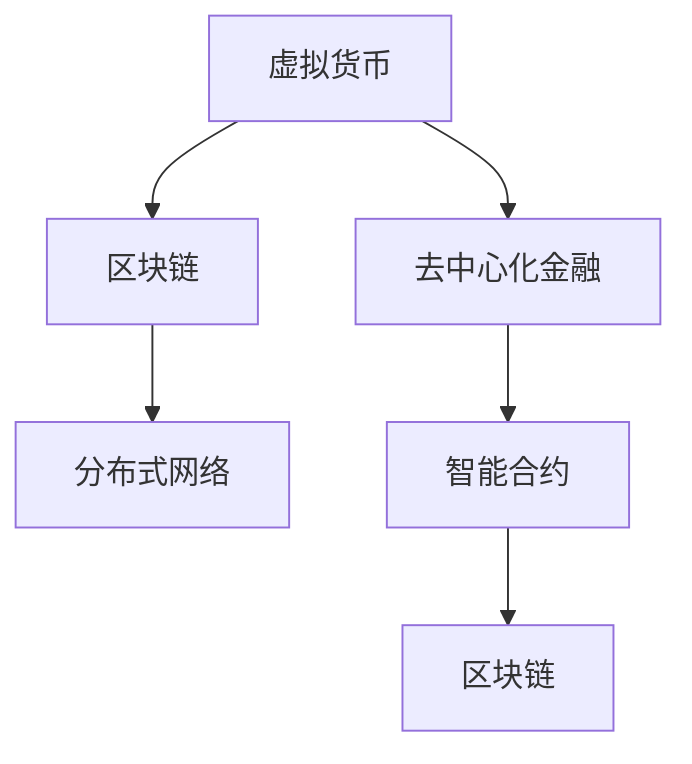

                 

# 虚拟货币与全球脑:去中心化金融体系的社会影响

> 关键词：虚拟货币,去中心化金融,区块链,分布式网络,社会影响,经济变革

## 1. 背景介绍

### 1.1 问题由来
虚拟货币（Cryptocurrency）作为一种去中心化金融（DeFi）工具，近年来在全球范围内引起广泛关注。其背后的区块链技术通过分布式网络实现了无需中介的直接价值交换，具有去中心化、透明度高、抗审查等特性。然而，尽管虚拟货币带来了诸多技术革新，但其对社会经济的影响还远未被充分理解。本文将从社会学的角度，探讨虚拟货币与去中心化金融体系对人类社会结构和行为模式的深远影响。

### 1.2 问题核心关键点
虚拟货币与去中心化金融体系的社会影响主要体现在以下几个方面：

1. **权力结构变化**：去中心化的金融体系对传统的金融机构和中央银行权力进行了重新分配，部分资金和交易权力下放到个人或小型团体手中。
2. **经济流动重构**：虚拟货币和智能合约等技术，使得金融服务的提供更加灵活、高效，但也带来金融犯罪和市场操纵的挑战。
3. **社会信任重塑**：区块链技术的去中心化特性，对社会信任体系提出了新的挑战和机遇，促进了新兴信任机制的诞生。
4. **行为模式变迁**：去中心化金融产品如DeFi借贷、稳定币等，改变了个体在金融决策中的行为模式，增加了金融产品的多样性和复杂性。

### 1.3 问题研究意义
探讨虚拟货币与去中心化金融体系的社会影响，有助于：

- 理解金融技术的社会属性和作用机制。
- 评估金融创新对社会稳定和经济发展的影响。
- 探讨如何通过政策和技术手段，平衡金融创新与传统金融体系的关系。

## 2. 核心概念与联系

### 2.1 核心概念概述

为更好地理解虚拟货币与去中心化金融体系的社会影响，本节将介绍几个密切相关的核心概念：

- **虚拟货币**：一种基于区块链技术，通过加密算法确保交易安全，不受中央银行和政府监管的货币形式。
- **去中心化金融**：一种无需中介机构，通过智能合约和区块链技术实现自动执行和验证的金融系统。
- **区块链**：一种分布式数据库技术，通过共识机制确保数据透明、不可篡改。
- **分布式网络**：由多个自治节点构成的互联网架构，节点间通过公开算法进行数据交换。
- **智能合约**：一种自动执行、无需中介的合约形式，基于区块链技术实现。

这些核心概念之间的逻辑关系可以通过以下Mermaid流程图来展示：



这个流程图展示了大语言模型的核心概念及其之间的关系：

1. 虚拟货币通过区块链技术实现，区块链通过分布式网络确保其透明性。
2. 去中心化金融体系利用区块链和智能合约技术，提供无需中介的金融服务。
3. 智能合约在区块链上实现，进一步增强了金融服务的自动化和安全性。

这些概念共同构成了去中心化金融体系的技术基础，使得其对社会经济产生了深远影响。通过理解这些核心概念，我们可以更好地把握其社会影响的内在机制。

## 3. 核心算法原理 & 具体操作步骤
### 3.1 算法原理概述

虚拟货币与去中心化金融体系的核心算法原理包括区块链共识机制、智能合约编程语言、分布式存储与检索等。这些技术共同构成了去中心化金融体系的基础，实现了一种无需中介的金融系统。

区块链的共识机制（如PoW、PoS、DPoS等）确保了网络中所有节点的数据一致性，避免了单点故障和篡改风险。智能合约通过代码实现金融合约逻辑，降低了合约执行的复杂性和成本。分布式存储和检索则使得数据可以在网络中高效传播和验证，提高系统的透明性和抗审查性。

### 3.2 算法步骤详解

虚拟货币与去中心化金融体系的一般实现步骤如下：

**Step 1: 设计区块链网络架构**
- 选择合适的共识机制，确定节点间的通信协议。
- 设计区块链的数据结构和块链式存储机制。
- 确定智能合约的编程语言和运行环境。

**Step 2: 编写智能合约代码**
- 使用Solidity、Vyper等智能合约编程语言，编写实现具体金融合约的代码。
- 进行单元测试和合约审计，确保代码逻辑正确和安全。

**Step 3: 部署智能合约**
- 将智能合约代码部署到区块链网络中。
- 通过区块链浏览器查看合约状态和交易记录。

**Step 4: 测试与优化**
- 使用测试网进行小范围测试，调试合约逻辑和性能。
- 根据测试结果进行代码优化，提升合约的稳定性和效率。

**Step 5: 上链与监管合规**
- 将智能合约正式部署到主网。
- 遵守当地法律法规，进行金融产品监管和风险评估。

### 3.3 算法优缺点

虚拟货币与去中心化金融体系具有以下优点：
1. 高效便捷：去中心化金融体系可以实现无需中介的直接交易，降低交易成本和延迟。
2. 透明度高：区块链的透明性确保了所有交易记录公开可查，提升了系统的可信度。
3. 去中心化：去中心化金融体系消除了对传统金融中介的依赖，提高了系统的抗审查性。
4. 创新能力强：智能合约和区块链技术为金融创新提供了更多可能，推动了金融服务的进化。

同时，该体系也存在以下局限性：
1. 技术门槛高：普通用户需要具备区块链和智能合约编程知识，才能参与金融创新。
2. 监管困难：去中心化金融体系缺乏统一监管，增加了金融风险和法律问题。
3. 安全性风险：区块链和智能合约可能存在漏洞，易被攻击者利用。
4. 市场波动性：虚拟货币和去中心化金融产品价值波动大，投资者面临较高的风险。

尽管存在这些局限性，但就目前而言，虚拟货币与去中心化金融体系仍是一种备受关注的技术范式。未来相关研究的重点在于如何进一步降低技术门槛，提高系统的安全性，同时兼顾监管合规和市场稳定。

### 3.4 算法应用领域

虚拟货币与去中心化金融体系已经在多个领域得到了广泛应用，例如：

- **跨境支付**：利用去中心化金融体系，实现快速、低成本的跨境支付服务。
- **供应链金融**：通过智能合约自动执行交易和结算，提升供应链融资效率。
- **证券交易**：在去中心化金融平台上发行和交易代币化证券，降低交易成本。
- **保险服务**：利用智能合约和区块链技术，实现自动化理赔和保险合约管理。
- **房地产市场**：通过去中心化金融平台进行房地产众筹和交易，降低交易成本和风险。
- **众筹和捐赠**：利用智能合约和区块链技术，确保众筹和捐赠资金的透明和安全。

除了上述这些经典应用外，去中心化金融体系还被创新性地应用到更多场景中，如DeFi借贷、去中心化交易所、稳定币等，为金融服务领域带来了全新的突破。随着区块链和智能合约技术的不断进步，相信去中心化金融体系将在更广泛的领域得到应用，推动金融技术的产业化进程。

## 4. 数学模型和公式 & 详细讲解 & 举例说明
### 4.1 数学模型构建

本节将使用数学语言对虚拟货币与去中心化金融体系进行更加严格的刻画。

记区块链网络中的节点数为 $N$，交易频率为 $T$，每个交易的平均大小为 $S$，共识机制的延迟为 $\tau$，智能合约的执行效率为 $\eta$。则区块链网络的整体吞吐量为：

$$
\mathcal{T} = N \cdot T \cdot S \cdot \eta / \tau
$$

智能合约的执行效率 $\eta$ 受到编程语言性能、网络带宽、存储限制等因素的影响。在考虑安全和正确性约束下，可以通过代码优化和分布式部署来提升执行效率。

### 4.2 公式推导过程

以下我们以DeFi借贷合约为例，推导智能合约的代码执行效率及其对整体吞吐量的影响。

假设DeFi借贷合约的代码执行开销为 $C$，每个交易的平均大小为 $S$，智能合约的执行效率为 $\eta$。则单个交易的代码执行时间为：

$$
\mathcal{T}_s = C / \eta
$$

假设网络带宽为 $B$，智能合约的存储限制为 $M$，则单个交易的网络传输时间为：

$$
\mathcal{T}_n = S / B + M / S
$$

假设共识机制的延迟为 $\tau$，则单个交易的总处理时间为：

$$
\mathcal{T} = \mathcal{T}_s + \mathcal{T}_n + \tau
$$

考虑 $N$ 个节点的并行执行，整体吞吐量为：

$$
\mathcal{T}_{\text{total}} = N \cdot \mathcal{T} / T
$$

通过以上推导，可以看出，智能合约的执行效率和网络带宽、存储限制、共识机制延迟等因素，共同决定了去中心化金融体系的整体性能。

### 4.3 案例分析与讲解

以下我们以稳定币USDT为例，探讨智能合约在稳定币发行和管理中的作用。

USDT稳定币由Tether公司发行，其价值与美元挂钩。USDT的发行和管理主要通过智能合约实现，其工作流程如下：

1. **创建USDT代币**：用户通过智能合约创建USDT代币，每创建1个USDT代币，等价于冻结1美元的美元资产。
2. **赎回USDT代币**：用户通过智能合约赎回USDT代币，等价于释放1美元的美元资产。
3. **USDT转账**：USDT代币通过智能合约自动管理转账，确保交易的透明性和安全性。
4. **抵押借贷**：用户可以通过智能合约抵押美元资产，借入USDT代币，并按比例支付利息。

USDT的智能合约代码通常采用Solidity语言编写，通过以太坊区块链实现。智能合约的执行效率直接影响USDT的稳定性和交易速度。Tether公司通过优化代码、分布式部署等措施，确保了USDT稳定币的高效运行和低成本。

## 5. 项目实践：代码实例和详细解释说明
### 5.1 开发环境搭建

在进行虚拟货币与去中心化金融体系实践前，我们需要准备好开发环境。以下是使用Python进行Solidity开发的环境配置流程：

1. 安装Anaconda：从官网下载并安装Anaconda，用于创建独立的Python环境。

2. 创建并激活虚拟环境：
```bash
conda create -n solidity-env python=3.8 
conda activate solidity-env
```

3. 安装Solidity：从官网下载并安装Solidity，确保Python环境能够正确解析Solidity文件。

4. 安装各类工具包：
```bash
pip install numpy pandas scikit-learn matplotlib tqdm jupyter notebook ipython
```

5. 安装以太坊钱包和测试网：如MetaMask、Alchemy等，用于测试和部署智能合约。

完成上述步骤后，即可在`solidity-env`环境中开始去中心化金融体系的开发实践。

### 5.2 源代码详细实现

下面我们以DeFi借贷合约为例，给出使用Solidity编写的智能合约代码实现。

首先，定义合约的基本结构：

```solidity
// SPDX-License-Identifier: MIT
pragma solidity ^0.8.0;

contract LendingPool {
    address public owner;
    mapping(address => uint256) public balanceOf;
    mapping(address => bool) public isBorrower;
    mapping(address => uint256) public debt;
    
    mapping(address => uint256) public rateLimits;
    uint256 public rateLimitWindow;
    uint256 public rateLimitsBurnStartEpoch;
    uint256 public rateLimitsDecayRate;

    event LogBorrowRecord(address indexed user, uint256 amount, uint256 rate);
    event LogDebtRepaid(address indexed user, uint256 amount);
    
    // 初始化合约
    constructor() public {
        owner = msg.sender;
        // 初始化利率限制等参数
    }

    // 存款函数
    function deposit(uint256 amount) public payable {
        require(msg.sender == owner, "Only owner can deposit.");
        require(amount > 0, "Amount must be greater than zero.");
        // 将存款记录到账户中
    }

    // 借贷函数
    function borrow(uint256 amount, uint256 interestRate, uint256 rateLimits) public payable {
        require(msg.sender == owner, "Only owner can borrow.");
        require(amount > 0, "Amount must be greater than zero.");
        // 记录借贷信息
    }

    // 还款函数
    function repay(uint256 amount) public {
        require(msg.sender == owner, "Only owner can repay.");
        require(amount > 0, "Amount must be greater than zero.");
        // 还款逻辑
    }

    // 审计函数
    function audit(uint256 epoch) public {
        // 审计逻辑
    }
}
```

然后，定义合约的测试和执行函数：

```solidity
// 测试函数
function testDeposit() public {
    // 测试存款函数
}

function testBorrow() public {
    // 测试借贷函数
}

function testRepay() public {
    // 测试还款函数
}

// 执行函数
function deployContract() public {
    // 部署合约
}
```

最后，启动测试流程并部署智能合约：

```solidity
// 启动测试
testDeposit();
testBorrow();
testRepay();

// 部署合约
deployContract();
```

以上就是使用Solidity对DeFi借贷合约进行编写的完整代码实现。可以看到，Solidity提供了丰富的语言特性，方便开发者编写和测试智能合约代码。

### 5.3 代码解读与分析

让我们再详细解读一下关键代码的实现细节：

**LendingPool合同**：
- `address public owner`：定义合约所有者的地址。
- `mapping(address => uint256) public balanceOf`：定义账户与余额的映射关系。
- `mapping(address => bool) public isBorrower`：定义账户与借贷状态的映射关系。
- `mapping(address => uint256) public debt`：定义账户与债务的映射关系。
- `mapping(address => uint256) public rateLimits`：定义账户与利率限制的映射关系。
- `uint256 public rateLimitWindow`：定义利率限制窗口的时间。
- `uint256 public rateLimitsBurnStartEpoch`：定义利率限制燃烧开始的时间。
- `uint256 public rateLimitsDecayRate`：定义利率限制衰减率。

**事件定义**：
- `event LogBorrowRecord(address indexed user, uint256 amount, uint256 rate)`：定义借贷记录事件。
- `event LogDebtRepaid(address indexed user, uint256 amount)`：定义还款记录事件。

**合约函数**：
- `constructor()`：定义合约初始化函数。
- `deposit(uint256 amount)`：定义存款函数，接收存款金额并记录到账户中。
- `borrow(uint256 amount, uint256 interestRate, uint256 rateLimits)`：定义借贷函数，接收借贷金额、利率和利率限制，记录借贷信息。
- `repay(uint256 amount)`：定义还款函数，接收还款金额并记录还款信息。
- `audit(uint256 epoch)`：定义审计函数，接收审计周期并执行审计逻辑。

**测试和部署函数**：
- `testDeposit()`：定义存款测试函数。
- `testBorrow()`：定义借贷测试函数。
- `testRepay()`：定义还款测试函数。
- `deployContract()`：定义合约部署函数。

可以看到，Solidity的合约定义和函数实现都非常简洁明了，适合于快速开发和测试。在实际应用中，还需要考虑更多的安全性和性能优化问题，如异常处理、变量类型检查、Gas消耗控制等。

## 6. 实际应用场景
### 6.1 智能合约审计

智能合约审计是去中心化金融体系中一个重要的环节。审计过程通常由第三方审计机构进行，通过代码审查、安全测试等手段，确保智能合约的逻辑正确性和安全性。智能合约审计不仅有助于发现潜在漏洞，还能够在合约上线前进行风险评估，提高系统的可信度。

以下是一个简单的智能合约审计流程：

1. **代码审查**：审查智能合约的代码逻辑，查找潜在的安全漏洞和逻辑错误。
2. **安全测试**：通过模拟攻击等方式，测试智能合约的安全性和健壮性。
3. **审计报告**：生成审计报告，记录审计过程和发现的问题，为合约上线提供依据。

在审计过程中，常用的审计工具包括MythX、Slither、Oyente等。这些工具可以帮助审计师快速定位和修复智能合约中的问题。

### 6.2 去中心化金融应用

去中心化金融体系已经在多个场景中得到了实际应用，以下是几个典型的应用场景：

1. **DeFi借贷**：利用智能合约实现自动化的借贷和还款，降低借贷成本和风险。
2. **稳定币发行**：通过智能合约发行和管理稳定币，确保其与美元等价。
3. **去中心化交易所**：利用智能合约实现无需中介的交易，提高交易效率和安全性。
4. **NFT市场**：通过智能合约管理NFT的创建、交易和验证，提供去中心化的数字资产市场。
5. **保险服务**：利用智能合约实现自动化的理赔和保险合约管理，提高理赔效率和透明度。

这些应用场景展示了去中心化金融体系在实际应用中的强大能力，为传统金融服务提供了新的解决方案。

### 6.3 未来应用展望

随着区块链和智能合约技术的不断进步，去中心化金融体系将在更广泛的领域得到应用，为金融服务带来变革性影响。未来，以下几方面的发展值得期待：

1. **智能合约标准化**：通过制定智能合约的标准和规范，提高智能合约的可移植性和兼容性，推动去中心化金融系统的普及。
2. **跨链互联互通**：通过跨链技术实现不同区块链之间的互联互通，提高系统的互操作性和灵活性。
3. **隐私保护和匿名性**：通过隐私计算和零知识证明等技术，增强智能合约的隐私保护能力，保护用户数据的安全。
4. **去中心化身份认证**：通过区块链技术实现去中心化身份认证，提高用户的身份安全性和隐私保护能力。
5. **金融普惠**：利用去中心化金融体系，为欠发达地区提供金融服务，提升全球金融普惠水平。

## 7. 工具和资源推荐
### 7.1 学习资源推荐

为了帮助开发者系统掌握虚拟货币与去中心化金融体系的技术基础和实践技巧，这里推荐一些优质的学习资源：

1. **《区块链：去中心化账本技术》**：一本详细介绍区块链技术的书籍，涵盖了区块链共识机制、智能合约、分布式网络等多个核心概念。

2. **Solidity官方文档**：Solidity语言的官方文档，提供了丰富的教程和代码示例，适合初学者快速上手智能合约开发。

3. **《以太坊智能合约实战》**：一本实战性的以太坊智能合约开发指南，包含大量案例和项目实践，适合进阶学习者深入理解智能合约开发过程。

4. **Consensys Academy**：以太坊生态系统下的在线教育平台，提供丰富的区块链和智能合约课程，涵盖从入门到进阶的各个环节。

5. **Udemy**：Udemy上的区块链和智能合约课程，内容丰富，覆盖了智能合约的开发、测试、审计等多个方面。

通过这些学习资源，相信你一定能够快速掌握虚拟货币与去中心化金融体系的技术基础，并用于解决实际的金融问题。

### 7.2 开发工具推荐

高效的开发离不开优秀的工具支持。以下是几款用于虚拟货币与去中心化金融体系开发的常用工具：

1. **Ganache**：以太坊官方提供的本地测试网工具，方便开发者进行合约测试和调试。

2. **Remix IDE**：由Etherscan提供的智能合约开发环境，支持Solidity代码编写和测试，提供实时合同状态和交易记录查看。

3. **MetaMask**：以太坊钱包和去中心化金融浏览器，支持智能合约交互和交易，方便开发者测试和部署合约。

4. **Alchemy**：由Alchemy提供的云测试平台，支持智能合约测试、部署和审计，提供丰富的API和SDK支持。

5. **Truffle**：一款基于Node.js的智能合约开发框架，提供丰富的插件和工具，支持多区块链平台开发。

合理利用这些工具，可以显著提升虚拟货币与去中心化金融体系开发效率，加快创新迭代的步伐。

### 7.3 相关论文推荐

虚拟货币与去中心化金融体系的发展源于学界的持续研究。以下是几篇奠基性的相关论文，推荐阅读：

1. **Bitcoin: A Peer-to-Peer Electronic Cash System**：比特币白皮书，介绍了比特币的原理和设计思想，奠定了去中心化金融体系的基础。

2. **Ethereum: A Next-Generation Smart Contract and Decentralized Application Platform**：以太坊白皮书，介绍了以太坊的智能合约和去中心化应用平台，推动了去中心化金融体系的广泛应用。

3. **On-chain Decentralized Lending**：一篇探讨去中心化借贷的学术论文，研究了去中心化借贷的机制、风险和优化方法。

4. **MakerDAO: A New Architecture for a Decentralized Stablecoin**：一篇介绍MakerDAO稳定币的学术论文，详细介绍了稳定币的发行和管理机制。

5. **Decentralized Finance: Some Challenges and Problems**：一篇讨论去中心化金融挑战的学术论文，从技术、经济、法律等多个角度探讨了去中心化金融体系面临的挑战和未来发展方向。

这些论文代表了大语言模型微调技术的发展脉络。通过学习这些前沿成果，可以帮助研究者把握学科前进方向，激发更多的创新灵感。

## 8. 总结：未来发展趋势与挑战
### 8.1 总结

本文对虚拟货币与去中心化金融体系进行了全面系统的介绍。首先阐述了虚拟货币与去中心化金融体系的研究背景和意义，明确了其对社会结构和行为模式的深远影响。其次，从原理到实践，详细讲解了去中心化金融体系的技术基础和关键步骤，给出了智能合约的代码实现示例。同时，本文还广泛探讨了智能合约审计、去中心化金融应用等多个相关话题，展示了去中心化金融体系在实际应用中的强大能力。此外，本文精选了虚拟货币与去中心化金融体系的学习资源，力求为读者提供全方位的技术指引。

通过本文的系统梳理，可以看到，虚拟货币与去中心化金融体系正在成为金融领域的重要范式，极大地拓展了金融服务的智能化水平，提升了金融服务的普惠性和安全性。未来，伴随区块链和智能合约技术的不断进步，去中心化金融体系必将在更广泛的领域得到应用，推动金融技术的产业化进程。

### 8.2 未来发展趋势

展望未来，虚拟货币与去中心化金融体系将呈现以下几个发展趋势：

1. **技术成熟度提升**：区块链和智能合约技术的不断成熟，将进一步提高系统的可靠性和安全性，降低开发和维护成本。
2. **应用场景扩展**：去中心化金融体系将在更多领域得到应用，如供应链金融、保险、资产管理等，推动传统金融服务的数字化转型。
3. **跨链互联互通**：通过跨链技术实现不同区块链之间的互联互通，提升系统的互操作性和灵活性。
4. **隐私保护和匿名性**：通过隐私计算和零知识证明等技术，增强智能合约的隐私保护能力，保护用户数据的安全。
5. **金融普惠**：利用去中心化金融体系，为欠发达地区提供金融服务，提升全球金融普惠水平。

以上趋势凸显了虚拟货币与去中心化金融体系的未来潜力。这些方向的探索发展，必将进一步提升金融服务的智能化水平，为人类经济社会的进步贡献力量。

### 8.3 面临的挑战

尽管虚拟货币与去中心化金融体系已经取得了显著成就，但在迈向更加智能化、普适化应用的过程中，它仍面临着诸多挑战：

1. **技术门槛高**：区块链和智能合约的开发和维护需要一定的技术基础，普通用户难以直接参与。
2. **监管问题复杂**：去中心化金融体系的监管难度较大，各地区和国家的法律法规尚未统一。
3. **市场波动性大**：虚拟货币和去中心化金融产品的价格波动大，投资者面临较高的风险。
4. **安全性问题**：智能合约和区块链系统可能存在漏洞，易被攻击者利用。
5. **社会接受度低**：去中心化金融体系对传统金融机构的冲击，导致社会对其接受度较低。

尽管存在这些挑战，但通过技术创新和政策支持，这些问题有望逐步得到解决。相信未来，虚拟货币与去中心化金融体系必将在更广泛的应用场景中发挥重要作用，推动金融服务的发展和创新。

### 8.4 研究展望

面对虚拟货币与去中心化金融体系所面临的挑战，未来的研究需要在以下几个方面寻求新的突破：

1. **标准化和互操作性**：制定区块链和智能合约的标准，提高系统的互操作性和兼容性，推动去中心化金融体系的普及。
2. **隐私保护和匿名性**：引入隐私计算和零知识证明技术，增强智能合约的隐私保护能力，保护用户数据的安全。
3. **跨链互联互通**：探索跨链技术的实现，提高不同区块链之间的互操作性和数据流通效率。
4. **金融普惠**：利用去中心化金融体系，为欠发达地区提供金融服务，提升全球金融普惠水平。
5. **监管合规**：制定去中心化金融体系的监管框架，确保系统的安全和合规性。

这些研究方向的探索，必将引领虚拟货币与去中心化金融体系的技术发展，为金融服务带来新的突破和创新。面向未来，我们相信虚拟货币与去中心化金融体系必将在构建金融普惠社会中扮演越来越重要的角色。

## 9. 附录：常见问题与解答

**Q1：虚拟货币与去中心化金融体系的社会影响是什么？**

A: 虚拟货币与去中心化金融体系对社会经济产生了深远影响，主要体现在权力结构变化、经济流动重构、社会信任重塑等方面。去中心化金融体系通过智能合约和区块链技术，打破了传统金融机构的垄断地位，提升了金融服务的透明度和可访问性，促进了金融普惠和创新。

**Q2：如何保证去中心化金融系统的安全性？**

A: 去中心化金融系统的安全性主要依赖于区块链共识机制、智能合约编程语言和分布式存储与检索技术。为了确保系统的安全性，需要：
1. 选择合适的共识机制，确保网络中的数据一致性。
2. 使用安全的编程语言，进行严格的代码审计和测试。
3. 采用分布式存储与检索技术，提高数据的透明性和抗审查性。

**Q3：如何理解去中心化金融体系的社会影响？**

A: 去中心化金融体系的社会影响主要体现在权力结构变化、经济流动重构、社会信任重塑等方面。去中心化金融体系通过智能合约和区块链技术，打破了传统金融机构的垄断地位，提升了金融服务的透明度和可访问性，促进了金融普惠和创新。

**Q4：去中心化金融体系在实际应用中面临哪些挑战？**

A: 去中心化金融体系在实际应用中面临的挑战包括：
1. 技术门槛高：区块链和智能合约的开发和维护需要一定的技术基础，普通用户难以直接参与。
2. 监管问题复杂：去中心化金融体系的监管难度较大，各地区和国家的法律法规尚未统一。
3. 市场波动性大：虚拟货币和去中心化金融产品的价格波动大，投资者面临较高的风险。
4. 安全性问题：智能合约和区块链系统可能存在漏洞，易被攻击者利用。
5. 社会接受度低：去中心化金融体系对传统金融机构的冲击，导致社会对其接受度较低。

这些挑战需要通过技术创新和政策支持，逐步得到解决。

**Q5：未来虚拟货币与去中心化金融体系的发展趋势是什么？**

A: 未来虚拟货币与去中心化金融体系的发展趋势包括：
1. 技术成熟度提升：区块链和智能合约技术的不断成熟，将进一步提高系统的可靠性和安全性，降低开发和维护成本。
2. 应用场景扩展：去中心化金融体系将在更多领域得到应用，如供应链金融、保险、资产管理等，推动传统金融服务的数字化转型。
3. 跨链互联互通：通过跨链技术实现不同区块链之间的互联互通，提升系统的互操作性和灵活性。
4. 隐私保护和匿名性：通过隐私计算和零知识证明等技术，增强智能合约的隐私保护能力，保护用户数据的安全。
5. 金融普惠：利用去中心化金融体系，为欠发达地区提供金融服务，提升全球金融普惠水平。

这些趋势凸显了虚拟货币与去中心化金融体系的未来潜力，未来的研究和发展方向将更加多元和全面。

