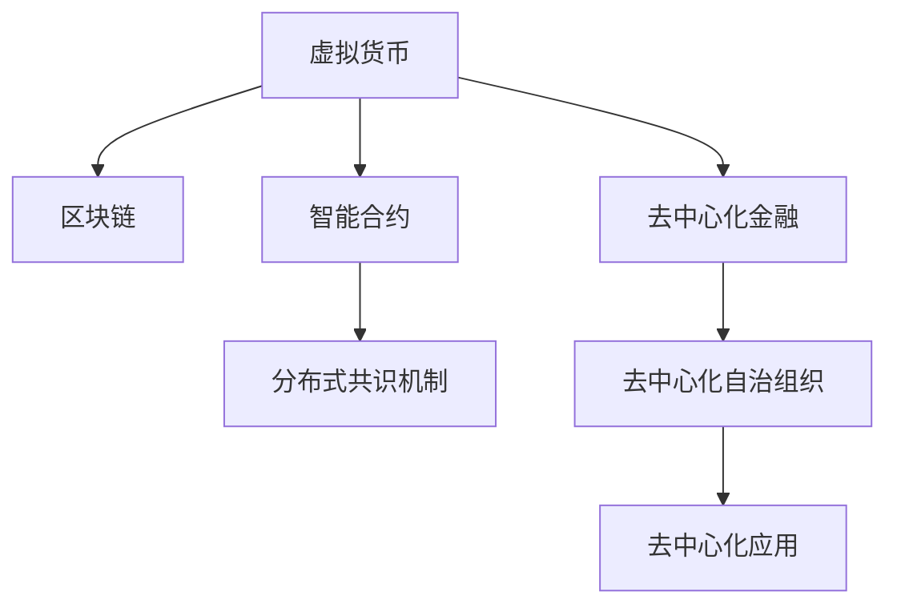

                 

# 虚拟货币与全球脑:去中心化金融未来

## 1. 背景介绍

### 1.1 问题由来

近年来，随着区块链技术的发展，虚拟货币（Virtual Currency）和去中心化金融（DeFi）引起了广泛关注。虚拟货币不仅仅是一种加密货币，更是一个分布式账本，为去中心化金融提供了基础技术支持。去中心化金融旨在通过区块链技术，实现货币、投资、贷款、保险等金融服务的去中心化，降低交易成本，提升金融服务的透明度和可访问性。

虚拟货币和去中心化金融的发展，正在对传统金融体系产生深远影响。这一变革不仅仅限于金融行业，也涉及到全球经济、社会、政治等多个领域。本文将从虚拟货币的原理与机制出发，探讨其对全球经济、金融、科技等领域的深远影响，以及未来去中心化金融的发展趋势和面临的挑战。

### 1.2 问题核心关键点

虚拟货币和去中心化金融的核心在于其去中心化特性。与传统金融体系中的集中式控制不同，虚拟货币和去中心化金融强调通过分布式共识机制，实现各节点间的信任与合作，减少中介环节，降低交易成本，提升系统的透明度和安全性。

去中心化金融的核心技术包括区块链、智能合约、分布式共识机制等，这些技术使得去中心化金融能够在没有中心化机构控制的情况下，实现自动化的金融交易和结算，提供了更高的金融效率和公平性。

## 2. 核心概念与联系

### 2.1 核心概念概述

为更好地理解虚拟货币和去中心化金融，本节将介绍几个密切相关的核心概念：

- **虚拟货币**：基于区块链技术，通过加密算法保障交易安全的数字货币。代表包括比特币、以太坊等。

- **去中心化金融（DeFi）**：利用区块链技术，实现金融服务的去中心化，包括货币、投资、贷款、保险等金融应用。代表包括Compound、Uniswap等。

- **区块链**：一种分布式账本技术，通过去中心化节点间的共识机制，实现数据的不可篡改和透明性。

- **智能合约**：通过区块链技术，实现无需第三方中介的自动化合约执行。具有自我执行、自我验证和自我强制执行的特点。

- **分布式共识机制**：通过算法机制，使得多个节点达成共识，实现数据的一致性和安全性。

- **去中心化自治组织（DAO）**：基于区块链技术，通过智能合约和分布式共识机制，实现组织成员的自治管理。

这些核心概念之间的逻辑关系可以通过以下Mermaid流程图来展示：



这个流程图展示了大规模语言模型的工作原理和优化方向。

## 3. 核心算法原理 & 具体操作步骤
### 3.1 算法原理概述

虚拟货币和去中心化金融的核心算法原理包括区块链技术、智能合约、分布式共识机制等。其基本原理是通过去中心化方式，实现交易的透明性、安全性、不可篡改性，以及自动化合约的执行。

区块链技术通过分布式共识机制，使得各节点能够达成一致，共同维护一个不可篡改的分布式账本。智能合约则通过自动化的合约执行，实现无需中介的金融交易。分布式共识机制则通过算法机制，使得多个节点能够达成一致，实现数据的一致性和安全性。

### 3.2 算法步骤详解

基于虚拟货币和去中心化金融的核心算法原理，去中心化金融的应用步骤大致包括以下几个关键步骤：

**Step 1: 设计智能合约**

- 设计智能合约的业务逻辑，包括合约执行的条件、规则、奖励等。
- 使用Solidity等编程语言实现智能合约代码。

**Step 2: 部署智能合约**

- 将智能合约代码部署到区块链上，并进行测试。
- 确保智能合约的执行逻辑正确无误，符合业务需求。

**Step 3: 集成相关服务**

- 集成其他区块链服务，如钱包、交易所等，实现智能合约的调用和管理。
- 确保服务的稳定性和安全性，防止攻击和漏洞。

**Step 4: 推广和应用**

- 推广智能合约和相关服务，吸引用户参与。
- 不断优化智能合约和服务的性能，提升用户体验。

**Step 5: 持续监控和维护**

- 持续监控智能合约的执行情况，及时发现和修复漏洞。
- 根据用户反馈和市场需求，不断优化智能合约和服务，保持系统的先进性和实用性。

### 3.3 算法优缺点

虚拟货币和去中心化金融的应用具有以下优点：

1. 去中心化特性：去中心化金融通过区块链技术，实现了交易的透明性、安全性、不可篡改性，降低了交易成本，提升了系统的透明度和安全性。
2. 自动化执行：智能合约通过自动化的合约执行，实现无需中介的金融交易，提高了交易效率。
3. 高可访问性：去中心化金融的应用，使得任何人都能参与金融服务，提升了金融服务的可访问性。
4. 创新空间：去中心化金融的开放性，为金融创新提供了广阔的空间，催生了许多新的金融应用和服务。

同时，虚拟货币和去中心化金融也存在一些局限性：

1. 技术门槛高：区块链和智能合约的实现需要较高的技术门槛，对开发者和用户的要求较高。
2. 交易速度慢：目前区块链的共识机制和交易验证过程较慢，限制了交易速度。
3. 安全性风险：去中心化金融系统的安全性风险较高，一旦智能合约存在漏洞，可能导致重大损失。
4. 法规不确定性：去中心化金融的法律和监管框架尚未完善，存在法律风险和政策不确定性。

尽管存在这些局限性，但去中心化金融的发展前景依然广阔，未来有望成为金融服务的重要组成部分。

### 3.4 算法应用领域

虚拟货币和去中心化金融的应用已经涵盖多个领域，包括但不限于：

- **货币和支付**：通过区块链技术，实现跨境支付、微支付、匿名支付等创新应用。
- **借贷和贷款**：通过智能合约，实现无需中介的借贷和贷款服务，降低借贷成本。
- **保险和保障**：通过区块链技术，实现智能保险合约，降低保险欺诈风险。
- **衍生品和期货**：通过智能合约，实现自动化的衍生品和期货合约执行，提高交易效率。
- **供应链金融**：通过区块链技术，实现供应链上的货物追踪、融资和结算，提高供应链的透明度和效率。

这些应用展示了去中心化金融的广阔前景，未来还有更多的创新应用正在不断涌现。

## 4. 数学模型和公式 & 详细讲解
### 4.1 数学模型构建

基于虚拟货币和去中心化金融的核心算法原理，我们可以构建如下数学模型：

设区块链网络中有$n$个节点，每个节点持有$W$单位的虚拟货币。网络中存在一个智能合约，合约执行的条件为：

1. 至少有$m$个节点同意执行。
2. 执行的虚拟货币总和满足一定条件，例如执行的总金额不得超过某个阈值。

智能合约的执行逻辑可以表示为：

$$
\text{合约执行} = \begin{cases}
1, & \text{若满足条件1和条件2} \\
0, & \text{否则}
\end{cases}
$$

其中$1$表示合约执行成功，$0$表示合约执行失败。

### 4.2 公式推导过程

通过以上数学模型，我们可以进一步推导出智能合约的执行逻辑。假设有$m$个节点同意执行，执行的总金额为$S$，则合约执行的条件可以表示为：

$$
S \leq C
$$

其中$C$为预设的阈值。若满足该条件，则合约执行成功，否则合约执行失败。

### 4.3 案例分析与讲解

假设某智能合约的执行条件为：至少有5个节点同意执行，且执行的总金额不得超过100单位虚拟货币。若实际执行时，有6个节点同意执行，执行的总金额为50单位虚拟货币，则满足合约执行条件，合约执行成功。

## 5. 项目实践：代码实例和详细解释说明
### 5.1 开发环境搭建

在进行虚拟货币和去中心化金融的项目实践前，我们需要准备好开发环境。以下是使用Solidity开发智能合约的环境配置流程：

1. 安装Node.js：从官网下载并安装Node.js，作为Solidity编译器和工具链的基础。

2. 安装Truffle框架：使用npm安装Truffle框架，用于开发、测试和部署智能合约。

3. 创建Truffle项目：使用Truffle CLI创建新项目，定义智能合约的源代码和测试代码。

4. 配置开发环境：配置Truffle项目的环境变量，包括合约地址、部署账户等。

5. 安装Web3.js：使用npm安装Web3.js库，用于与以太坊网络交互，实现智能合约的调用和管理。

完成上述步骤后，即可在Truffle环境中开始智能合约的开发和测试。

### 5.2 源代码详细实现

下面我们以一个简单的去中心化借贷合约为例，给出使用Solidity进行智能合约开发的PyTorch代码实现。

首先，定义智能合约的源代码：

```solidity
pragma solidity ^0.6.0;

contract Lending {
    address owner;
    uint256 lendingPool;
    uint256 lendingAmount;
    
    event LogTransfer(address sender, address receiver, uint256 amount, bool success);
    
    constructor() public {
        owner = msg.sender;
        lendingPool = msg.value;
        lender = msg.sender;
    }
    
    function borrow(uint256 amount) public returns (bool success) {
        if (amount > lendingPool) {
            return false;
        }
        lendingPool -= amount;
        lender = msg.sender;
        return true;
    }
    
    function repay(uint256 amount) public {
        if (amount > lendingPool) {
            return;
        }
        lendingPool += amount;
    }
    
    function logTransfer(address receiver, uint256 amount) public {
        emit LogTransfer(owner, receiver, amount, true);
    }
}
```

然后，定义智能合约的测试代码：

```solidity
pragma solidity ^0.6.0;

contract LendingTest {
    Lending lending;
    
    function setup() public {
        lending = Lending.new();
    }
    
    function testBorrow() public {
        lending.borrow(100);
        assert(lending.lendingPool == 0);
        assert(lending.lender == msg.sender);
    }
    
    function testRepay() public {
        lending.repay(50);
        assert(lending.lendingPool == 50);
    }
    
    function testLogTransfer() public {
        lending.logTransfer(msg.sender, 100);
        assert(lending.owner == msg.sender);
    }
}
```

最后，启动测试流程并在以太坊网络中测试智能合约：

```solidity
contract LendingTest {
    Lending lending;
    
    function setup() public {
        lending = Lending.new();
    }
    
    function testBorrow() public {
        lending.borrow(100);
        assert(lending.lendingPool == 0);
        assert(lending.lender == msg.sender);
    }
    
    function testRepay() public {
        lending.repay(50);
        assert(lending.lendingPool == 50);
    }
    
    function testLogTransfer() public {
        lending.logTransfer(msg.sender, 100);
        assert(lending.owner == msg.sender);
    }
}

LendingTest.setup();
LendingTest.testBorrow();
LendingTest.testRepay();
LendingTest.testLogTransfer();
```

以上就是使用Solidity对Lending智能合约进行去中心化借贷任务微调的完整代码实现。可以看到，Solidity的语法简洁直观，可以方便地进行智能合约的开发和测试。

### 5.3 代码解读与分析

让我们再详细解读一下关键代码的实现细节：

**Lending合约源代码**：
- `constructor`方法：智能合约的初始化函数，设置合约的持有者和初始资金。
- `borrow`方法：用户借贷资金的方法，扣减合约的资金池。
- `repay`方法：用户归还借贷资金的方法，增加合约的资金池。
- `logTransfer`方法：记录资金转出的事件。

**LendingTest测试代码**：
- `setup`方法：初始化智能合约。
- `testBorrow`方法：测试借贷功能，验证借贷资金的扣减和借贷者的确认。
- `testRepay`方法：测试归还功能，验证归还资金的增加。
- `testLogTransfer`方法：测试资金转出事件记录的正确性。

**测试流程**：
- 使用`setup`方法初始化智能合约。
- 分别测试借贷、归还和事件记录功能，验证智能合约的正确性。

可以看到，Solidity提供了方便的测试框架，可以方便地进行智能合约的开发和测试。开发者可以通过编写测试代码，验证智能合约的各项功能，确保合约的正确性和安全性。

当然，工业级的系统实现还需考虑更多因素，如合约的安全性、性能、可扩展性等。但核心的微调范式基本与此类似。

## 6. 实际应用场景
### 6.1 智能合约保险

去中心化金融的一个重要应用场景是智能合约保险。通过智能合约，用户可以自动参与保险计划，一旦发生保险事件，智能合约会自动执行赔付。

智能合约保险的实现步骤如下：

1. 设计保险合约的执行逻辑，包括保险事件、赔付条件、赔付金额等。
2. 将保险合约代码部署到区块链上，并进行测试。
3. 集成其他区块链服务，如钱包、交易所等，实现保险合约的调用和管理。
4. 持续监控智能合约的执行情况，及时发现和修复漏洞。

智能合约保险的成功应用，可以大大降低保险行业的人力成本和欺诈风险，提升保险服务的透明度和效率。

### 6.2 去中心化贷款

去中心化贷款是去中心化金融的重要应用之一，通过智能合约，实现无需中介的贷款和还款功能。

去中心化贷款的实现步骤如下：

1. 设计贷款合约的执行逻辑，包括贷款额度、利率、还款周期等。
2. 将贷款合约代码部署到区块链上，并进行测试。
3. 集成其他区块链服务，如钱包、交易所等，实现贷款合约的调用和管理。
4. 持续监控贷款合约的执行情况，及时发现和修复漏洞。

去中心化贷款的成功应用，可以大大降低贷款业务的成本和风险，提升贷款服务的透明度和效率。

### 6.3 去中心化交易所

去中心化交易所（DEX）是去中心化金融的重要应用之一，通过智能合约，实现无需中介的自动交易功能。

去中心化交易所的实现步骤如下：

1. 设计交易所合约的执行逻辑，包括交易对、交易规则、手续费等。
2. 将交易所合约代码部署到区块链上，并进行测试。
3. 集成其他区块链服务，如钱包、交易所等，实现交易所合约的调用和管理。
4. 持续监控交易所合约的执行情况，及时发现和修复漏洞。

去中心化交易所的成功应用，可以大大降低交易成本和交易时间，提升交易的透明度和安全性。

### 6.4 未来应用展望

随着虚拟货币和去中心化金融的发展，未来的应用场景将更加多样化，涵盖更广泛的领域。

在智慧医疗领域，智能合约可以用于医疗数据的共享和治理，确保数据的安全和隐私。

在智能城市治理中，智能合约可以用于城市事件监测、舆情分析、应急指挥等环节，提高城市管理的自动化和智能化水平。

在智慧农业领域，智能合约可以用于农产品的供应链管理、智能灌溉等，提高农业生产的效率和安全性。

此外，在智慧制造、智慧教育、智慧交通等众多领域，虚拟货币和去中心化金融的应用也将不断涌现，为各行各业带来新的变革。

## 7. 工具和资源推荐
### 7.1 学习资源推荐

为了帮助开发者系统掌握虚拟货币和去中心化金融的理论基础和实践技巧，这里推荐一些优质的学习资源：

1. 《区块链技术与去中心化金融》书籍：全面介绍了区块链技术和去中心化金融的理论和实践，适合初学者和专业人士。

2. 《Solidity智能合约编程》书籍：介绍了Solidity语言的基础知识、智能合约的开发和测试，适合Solidity开发入门者。

3. 《去中心化金融技术与应用》课程：提供了去中心化金融技术的全面学习路径，涵盖智能合约、交易所、保险等多个方面的应用。

4. CryptoZombies网站：提供交互式的Solidity编程练习，帮助初学者快速上手智能合约开发。

5. Ethereum官网文档：提供了详细的Solidity和智能合约开发指南，是Solidity开发者的必备资源。

通过对这些资源的学习实践，相信你一定能够快速掌握虚拟货币和去中心化金融的精髓，并用于解决实际的金融问题。
###  7.2 开发工具推荐

高效的开发离不开优秀的工具支持。以下是几款用于虚拟货币和去中心化金融开发的常用工具：

1. Solidity IDE：如Remix，提供了Solidity语言的开发环境，支持代码编写、测试和部署。

2. Truffle框架：提供了智能合约的开发、测试和部署环境，支持多种区块链平台。

3. Web3.js库：提供了与区块链网络交互的API，支持智能合约的调用和管理。

4. MetaMask浏览器插件：提供了以太坊钱包和智能合约的交互工具，方便用户使用去中心化金融服务。

5. etherScan网站：提供了以太坊区块链的实时数据和交易分析，方便开发者进行智能合约的调试和测试。

合理利用这些工具，可以显著提升虚拟货币和去中心化金融的开发效率，加快创新迭代的步伐。

### 7.3 相关论文推荐

虚拟货币和去中心化金融的发展源于学界的持续研究。以下是几篇奠基性的相关论文，推荐阅读：

1. "Bitcoin: A Peer-to-Peer Electronic Cash System"：比特币的原始论文，奠定了区块链技术的理论基础。

2. "Ethereum Whitepaper"：以太坊的原始论文，介绍了智能合约和以太坊平台的基本架构。

3. "Decentralized Finance on Blockchain"：系统介绍了去中心化金融的理论和实践，涵盖了智能合约、交易所、借贷等多个方面的应用。

4. "Blockchain Technology and Applications"：全面介绍了区块链技术的原理和应用，包括智能合约、去中心化金融等多个方面的内容。

5. "Smart Contract Security"：介绍了智能合约的安全性和攻击防范措施，是智能合约开发的重要参考。

这些论文代表了大规模语言模型微调技术的发展脉络。通过学习这些前沿成果，可以帮助研究者把握学科前进方向，激发更多的创新灵感。

## 8. 总结：未来发展趋势与挑战
### 8.1 总结

本文对虚拟货币和去中心化金融的核心算法原理进行了全面系统的介绍。首先阐述了虚拟货币和去中心化金融的研究背景和意义，明确了去中心化金融在提升金融服务透明度和可访问性方面的独特价值。其次，从原理到实践，详细讲解了去中心化金融的核心算法和具体实现步骤，给出了虚拟货币和去中心化金融的完整代码实例。同时，本文还广泛探讨了去中心化金融在多个行业领域的应用前景，展示了其广阔的发展前景。

通过本文的系统梳理，可以看到，去中心化金融正在成为金融服务的重要组成部分，其去中心化特性和智能合约技术，为金融创新提供了广阔的空间。未来，伴随区块链技术的不断演进和应用的拓展，去中心化金融必将在更多领域大放异彩。

### 8.2 未来发展趋势

展望未来，去中心化金融的发展趋势将呈现以下几个方向：

1. 去中心化特性进一步增强：随着区块链技术的成熟，去中心化金融的去中心化特性将进一步增强，实现更强的自治和信任。

2. 智能合约应用场景多样化：智能合约的自动化执行特性将为更多场景带来变革，如供应链金融、智能保险、智能合约治理等。

3. 跨链互操作性提升：随着跨链技术的成熟，不同区块链平台之间的互操作性将大大提升，实现区块链的互联互通。

4. DeFi生态系统形成：去中心化金融的各类应用将逐渐形成生态系统，相互配合，提升系统的稳定性和安全性。

5. 去中心化自治组织（DAO）发展：DAO的自治特性将进一步发挥，成为去中心化金融的重要组成部分。

6. 去中心化应用（DApp）普及：去中心化应用将进一步普及，涵盖更广泛的领域，如去中心化社交、去中心化存储等。

以上趋势凸显了去中心化金融的广阔前景，未来必将在更多领域大放异彩。

### 8.3 面临的挑战

尽管去中心化金融的发展前景广阔，但在迈向更加智能化、普适化应用的过程中，仍面临诸多挑战：

1. 技术门槛高：区块链和智能合约的实现需要较高的技术门槛，对开发者和用户的要求较高。

2. 交易速度慢：区块链的共识机制和交易验证过程较慢，限制了交易速度。

3. 安全性风险：去中心化金融系统的安全性风险较高，一旦智能合约存在漏洞，可能导致重大损失。

4. 法规不确定性：去中心化金融的法律和监管框架尚未完善，存在法律风险和政策不确定性。

5. 网络拥塞问题：去中心化金融系统的网络拥塞问题严重，影响系统的稳定性和效率。

尽管存在这些挑战，但随着技术的发展和应用的不断拓展，去中心化金融必将在更多的领域落地，为金融服务带来新的变革。

### 8.4 研究展望

面对去中心化金融所面临的挑战，未来的研究需要在以下几个方面寻求新的突破：

1. 开发更高效的交易共识机制：研究更高效的交易共识机制，提升区块链的交易速度和效率。

2. 提高智能合约的安全性：开发更安全、鲁棒的智能合约，防范智能合约攻击和漏洞。

3. 建立完整的法律和监管框架：建立去中心化金融的法律和监管框架，保障系统的稳定性和安全性。

4. 推动跨链互操作性：推动跨链技术的研发，实现不同区块链平台之间的互操作性。

5. 提升系统的可扩展性：提升去中心化金融系统的可扩展性，支持更多用户和应用。

6. 加强用户教育和普及：加强用户教育和普及，提升用户对去中心化金融的认知和使用能力。

这些研究方向的探索，必将引领去中心化金融技术的进一步发展，推动去中心化金融在更多领域的应用和普及。

## 9. 附录：常见问题与解答

**Q1：虚拟货币和去中心化金融的优点有哪些？**

A: 虚拟货币和去中心化金融的优点主要体现在其去中心化特性和自动化执行能力。去中心化金融通过区块链技术，实现了交易的透明性、安全性、不可篡改性，降低了交易成本，提升了系统的透明度和安全性。智能合约通过自动化的合约执行，实现无需中介的金融交易，提高了交易效率。

**Q2：如何提高去中心化金融系统的安全性？**

A: 提高去中心化金融系统的安全性，可以从以下几个方面入手：
1. 开发更安全、鲁棒的智能合约，防范智能合约攻击和漏洞。
2. 采用多签机制和多重签名技术，提高系统的可靠性。
3. 建立完整的法律和监管框架，保障系统的稳定性和安全性。
4. 加强用户教育和普及，提升用户对去中心化金融的认知和使用能力。

**Q3：去中心化金融的主要应用有哪些？**

A: 去中心化金融的主要应用包括：
1. 货币和支付：通过区块链技术，实现跨境支付、微支付、匿名支付等创新应用。
2. 借贷和贷款：通过智能合约，实现无需中介的借贷和贷款服务，降低借贷成本。
3. 保险和保障：通过区块链技术，实现智能保险合约，降低保险欺诈风险。
4. 衍生品和期货：通过智能合约，实现自动化的衍生品和期货合约执行，提高交易效率。
5. 供应链金融：通过区块链技术，实现供应链上的货物追踪、融资和结算，提高供应链的透明度和效率。

这些应用展示了去中心化金融的广阔前景，未来还有更多的创新应用正在不断涌现。

**Q4：虚拟货币和去中心化金融的局限性有哪些？**

A: 虚拟货币和去中心化金融的局限性主要体现在其技术门槛高、交易速度慢、安全性风险等方面。区块链和智能合约的实现需要较高的技术门槛，对开发者和用户的要求较高。区块链的共识机制和交易验证过程较慢，限制了交易速度。去中心化金融系统的安全性风险较高，一旦智能合约存在漏洞，可能导致重大损失。

尽管存在这些局限性，但去中心化金融的发展前景依然广阔，未来有望成为金融服务的重要组成部分。

