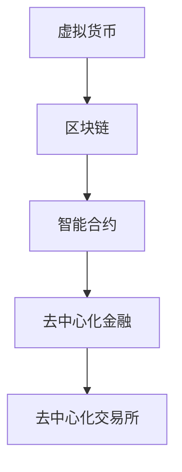

                 

# 虚拟货币与全球脑：去中心化金融的未来

## 1. 背景介绍

### 1.1 问题由来

随着区块链技术的成熟和虚拟货币的流行，去中心化金融（DeFi）正逐渐成为金融领域的新趋势。与传统中心化金融（CeFi）相比，DeFi不需要第三方中介机构介入，能够更高效、更透明、更安全地进行金融操作。

然而，DeFi 中的虚拟货币市场也面临着诸多挑战。首先，虚拟货币的价格波动大，难以稳定。其次，虚拟货币的流动性不足，交易难度较大。再次，虚拟货币的安全性问题严重，被黑客攻击的风险极高。最后，虚拟货币的市场监管不足，存在法律和道德风险。

为了应对这些问题，许多研究人员开始探索基于区块链的去中心化金融解决方案。他们希望通过创新的算法和技术，构建一个更加安全和可靠的虚拟货币交易和管理系统。

### 1.2 问题核心关键点

本文将探讨基于区块链的去中心化金融解决方案。我们将在研究虚拟货币的经济学原理和区块链技术的基础上，介绍一些典型的DeFi应用，并分析其优点和局限性。最后，我们将展望DeFi 的未来发展方向，并讨论其面临的挑战和机遇。

## 2. 核心概念与联系

### 2.1 核心概念概述

为更好地理解DeFi的原理，本节将介绍几个关键概念：

- **虚拟货币（Cryptocurrency）**：一种基于区块链技术的数字货币，如比特币（Bitcoin）、以太坊（Ethereum）等。
- **区块链（Blockchain）**：一种去中心化的分布式账本技术，可以记录所有交易信息，并保证其不可篡改。
- **智能合约（Smart Contract）**：一种运行在区块链上的程序，能够自动执行预设的规则，实现去中心化的信任机制。
- **去中心化金融（DeFi）**：基于区块链技术提供的一系列金融服务，如借贷、保险、交易等，旨在实现去中心化的金融操作。
- **去中心化交易所（DEX）**：一种无需中心化机构的交易平台，用户可以通过智能合约自行进行虚拟货币交易。

这些概念之间的逻辑关系可以通过以下Mermaid流程图来展示：



这个流程图展示了几大关键概念及其之间的联系：

1. 虚拟货币是区块链技术的基础。
2. 智能合约是区块链上的程序，实现去中心化的信任机制。
3. 去中心化金融是基于智能合约提供的一系列金融服务。
4. 去中心化交易所是DeFi的重要应用，实现虚拟货币的无中介交易。

## 3. 核心算法原理 & 具体操作步骤

### 3.1 算法原理概述

DeFi的算法原理基于区块链技术和智能合约。用户可以在智能合约上编写代码，实现各种金融功能。智能合约可以根据预设的规则自动执行，无需第三方中介机构介入。

具体来说，DeFi的算法原理包括以下几个方面：

1. **账户管理**：用户通过智能合约创建和管理账户，记录虚拟货币余额和交易记录。
2. **借贷和流动性提供**：用户可以借贷虚拟货币，或提供流动性以获得收益。
3. **交易和清算**：用户可以通过智能合约进行虚拟货币交易，并通过智能合约进行清算。
4. **去中心化交易所（DEX）**：用户可以在智能合约上自行进行虚拟货币交易，无需第三方中介机构。

### 3.2 算法步骤详解

DeFi的算法步骤通常包括以下几个关键步骤：

**Step 1: 准备区块链环境**

- 安装和配置区块链节点软件，如比特币的bitcoind、以太坊的geth等。
- 部署智能合约代码到区块链网络。

**Step 2: 编写智能合约**

- 定义智能合约的功能和规则。
- 编写智能合约代码，使用Solidity等编程语言。
- 测试智能合约，确保其正确性和安全性。

**Step 3: 部署智能合约**

- 将智能合约部署到区块链网络。
- 测试智能合约，确保其正常运行。

**Step 4: 使用智能合约**

- 创建和管理账户。
- 借贷虚拟货币。
- 提供流动性以获得收益。
- 进行虚拟货币交易。
- 进行清算和结算。

**Step 5: 监控和维护**

- 监控智能合约的运行状态。
- 定期维护和更新智能合约，修复漏洞和错误。

### 3.3 算法优缺点

DeFi的算法具有以下优点：

1. **去中心化**：无需第三方中介机构，能够实现更加透明和安全的金融操作。
2. **高效和低成本**：智能合约可以自动执行，无需中间环节，能够提高交易效率，降低交易成本。
3. **透明度和可追溯性**：所有交易信息都会记录在区块链上，可追溯和透明。

然而，DeFi的算法也存在一些缺点：

1. **安全风险**：智能合约的漏洞和错误可能导致严重的金融损失。
2. **复杂性**：智能合约的编写和维护需要一定的技术水平。
3. **法律和监管问题**：虚拟货币的法律地位和监管政策尚未明确，存在法律风险。

### 3.4 算法应用领域

DeFi的算法已经广泛应用于各种金融服务领域，例如：

- **借贷和抵押**：用户可以通过智能合约借贷虚拟货币，或将虚拟货币抵押以获得贷款。
- **去中心化交易所（DEX）**：用户可以在智能合约上自行进行虚拟货币交易，无需第三方中介机构。
- **保险**：用户可以通过智能合约参与保险计划，获得保险赔偿。
- **理财和投资**：用户可以通过智能合约进行理财和投资，获得收益。

此外，DeFi的算法还在NFT（非同质化代币）交易、游戏经济、供应链金融等领域得到了广泛应用，为各行各业提供了新的金融解决方案。

## 4. 数学模型和公式 & 详细讲解 & 举例说明

### 4.1 数学模型构建

在DeFi的算法中，智能合约是核心的数学模型。智能合约通常使用Solidity等编程语言编写，并定义了各种函数和规则。这些函数和规则可以用于实现借贷、交易、清算等金融功能。

### 4.2 公式推导过程

以借贷智能合约为例，其核心函数是`repay()`和`borrow()`，用于实现借贷和还款功能。下面我们将推导这两个函数的数学公式。

- `borrow()`函数：用户借贷虚拟货币，按照预设利率和期限计算利息和本金。

$$
\text{total debt} = \text{borrowed amount} + \text{interest} = \text{borrowed amount} \times (1 + \text{interest rate})^{\text{loan term}}
$$

- `repay()`函数：用户偿还虚拟货币和利息。

$$
\text{remaining debt} = \text{total debt} - \text{repayment amount}
$$

其中，`borrowed amount`表示借贷金额，`interest rate`表示利率，`loan term`表示借贷期限，`repayment amount`表示还款金额。

### 4.3 案例分析与讲解

假设用户A借贷1个以太坊（ETH），年利率为5%，借贷期限为1年，按照等额本息还款方式还款，每月还款0.1个ETH。智能合约的代码如下：

```solidity
pragma solidity ^0.8.0;

contract Borrow {
    uint256 private totalDebt;
    uint256 private remainingDebt;
    uint256 private interestRate;
    uint256 private loanTerm;
    uint256 private monthlyRepaymentAmount;
    
    constructor(uint256 initialAmount, uint256 rate, uint256 term, uint256 repaymentAmount) {
        totalDebt = initialAmount;
        remainingDebt = initialAmount;
        interestRate = rate;
        loanTerm = term;
        monthlyRepaymentAmount = repaymentAmount;
    }
    
    function borrow(uint256 amount) public payable {
        totalDebt += amount;
        remainingDebt += amount;
        totalDebt *= (1 + interestRate/100)**loanTerm;
        remainingDebt -= amount;
    }
    
    function repay(uint256 amount) public payable {
        remainingDebt -= amount;
    }
    
    function getRemainingDebt() public view returns (uint256) {
        return remainingDebt;
    }
}
```

用户A借贷后，每月还款0.1个ETH，智能合约的运行过程如下：

- 借贷：`borrow(1 eth)`
- 第1个月还款：`repay(0.1 eth)`
- 第2个月还款：`repay(0.1 eth)`
- ……

在第12个月还款后，智能合约的计算结果如下：

- 总债务：$1 \times (1 + 5\%)^{12} = 1.7958$ ETH
- 剩余债务：$1.7958 - 1 = 0.7958$ ETH

用户A需要还款0.7958 ETH，利息为0.7958 ETH - 1 ETH = 0.7958 ETH。

## 5. 项目实践：代码实例和详细解释说明

### 5.1 开发环境搭建

在进行DeFi项目实践前，我们需要准备好开发环境。以下是使用Solidity进行DeFi开发的Python开发环境配置流程：

1. 安装Node.js和npm。
2. 安装Solidity编译器（Remix IDE）和Truffle框架。
3. 安装IDE（如Remix IDE或Truffle开发环境）。

### 5.2 源代码详细实现

下面以借贷智能合约为例，给出使用Solidity编写的完整代码实现。

```solidity
pragma solidity ^0.8.0;

contract Borrow {
    uint256 private totalDebt;
    uint256 private remainingDebt;
    uint256 private interestRate;
    uint256 private loanTerm;
    uint256 private monthlyRepaymentAmount;
    
    constructor(uint256 initialAmount, uint256 rate, uint256 term, uint256 repaymentAmount) {
        totalDebt = initialAmount;
        remainingDebt = initialAmount;
        interestRate = rate;
        loanTerm = term;
        monthlyRepaymentAmount = repaymentAmount;
    }
    
    function borrow(uint256 amount) public payable {
        totalDebt += amount;
        remainingDebt += amount;
        totalDebt *= (1 + interestRate/100)**loanTerm;
        remainingDebt -= amount;
    }
    
    function repay(uint256 amount) public payable {
        remainingDebt -= amount;
    }
    
    function getRemainingDebt() public view returns (uint256) {
        return remainingDebt;
    }
}
```

### 5.3 代码解读与分析

让我们再详细解读一下关键代码的实现细节：

**Borrow合同**：
- `constructor`函数：初始化借贷金额、利率、期限和还款金额。
- `borrow`函数：借贷虚拟货币，并计算总债务和剩余债务。
- `repay`函数：还款虚拟货币。
- `getRemainingDebt`函数：获取剩余债务。

### 5.4 运行结果展示

运行上述代码，即可在Remix IDE上部署借贷智能合约，并进行借贷和还款操作。

## 6. 实际应用场景

### 6.1 智能合约贷款

智能合约贷款是一种基于区块链的借贷服务。用户可以在智能合约上借贷虚拟货币，并按照预设利率和期限还款。智能合约贷款具有以下优点：

1. **去中心化**：无需第三方中介机构，能够实现更加透明和安全的借贷操作。
2. **高效和低成本**：智能合约可以自动执行，无需中间环节，能够提高交易效率，降低交易成本。
3. **透明度和可追溯性**：所有借贷信息都会记录在区块链上，可追溯和透明。

智能合约贷款的代码实现可以参考借贷智能合约示例，并根据具体需求进行定制化修改。

### 6.2 去中心化交易所（DEX）

去中心化交易所是一种无需中心化机构的虚拟货币交易平台。用户可以在智能合约上自行进行虚拟货币交易，无需第三方中介机构。去中心化交易所具有以下优点：

1. **去中心化**：无需第三方中介机构，能够实现更加透明和安全的交易操作。
2. **高效和低成本**：智能合约可以自动执行，无需中间环节，能够提高交易效率，降低交易成本。
3. **透明度和可追溯性**：所有交易信息都会记录在区块链上，可追溯和透明。

去中心化交易所的代码实现可以参考Uniswap等开源项目，并根据具体需求进行定制化修改。

## 7. 工具和资源推荐

### 7.1 学习资源推荐

为了帮助开发者系统掌握DeFi的理论基础和实践技巧，这里推荐一些优质的学习资源：

1. 《以太坊智能合约开发实战》系列博文：由以太坊开发者撰写，详细介绍了以太坊智能合约的开发流程和技术细节。
2. Solidity官方文档：Solidity官方提供的文档，包含Solidity编程语言的详细说明和示例代码。
3 《Blockchain Basics》课程：由Coursera提供，涵盖了区块链技术的基本原理和应用场景。
4 《DeFi 101》系列博文：由CoinDesk撰写，介绍了DeFi的基本概念和应用场景。
5 《Blockchain Programming with Solidity》书籍：Solidity语言编程书籍，详细介绍了Solidity编程语言和智能合约开发。

通过对这些资源的学习实践，相信你一定能够快速掌握DeFi的精髓，并用于解决实际的金融问题。

### 7.2 开发工具推荐

高效的开发离不开优秀的工具支持。以下是几款用于DeFi开发的常用工具：

1. Remix IDE：以太坊智能合约开发和测试平台，支持Solidity和Truffle框架。
2. Truffle框架：以太坊智能合约开发框架，支持自动化部署、测试和管理。
3. Ganache：以太坊区块链测试网络，支持智能合约的开发和测试。
4. Infura：以太坊区块链云服务提供商，支持智能合约的开发、部署和测试。
5. Web3.js：JavaScript库，用于与以太坊智能合约进行交互。

合理利用这些工具，可以显著提升DeFi项目的开发效率，加快创新迭代的步伐。

### 7.3 相关论文推荐

DeFi的研究源于学界的持续研究。以下是几篇奠基性的相关论文，推荐阅读：

1. How Decentralized Finance Works (DeFi)：以太坊基金会发布的白皮书，介绍了DeFi的基本概念和应用场景。
2. Secure and Trustworthy Smart Contracts：以太坊开发人员撰写，介绍了智能合约的安全性和可验证性。
3 The Ethereum Yellow Paper：以太坊白皮书，详细介绍了以太坊的技术架构和应用场景。
4 Decentralizing the Financial System with Smart Contracts：比特币开发者撰写，介绍了DeFi和智能合约的基本原理。

这些论文代表了大规模去中心化金融的研究方向。通过学习这些前沿成果，可以帮助研究者把握学科前进方向，激发更多的创新灵感。

## 8. 总结：未来发展趋势与挑战

### 8.1 总结

本文对基于区块链的去中心化金融解决方案进行了全面系统的介绍。首先阐述了DeFi的经济学原理和区块链技术的基础。其次，介绍了DeFi的核心算法，并给出了智能合约的代码实现。最后，探讨了DeFi的未来发展方向，并讨论了其面临的挑战和机遇。

通过本文的系统梳理，可以看到，DeFi作为一种新兴的金融模式，其去中心化、透明和高效的特点，使其在金融领域具有巨大的潜力和应用前景。然而，DeFi仍然面临诸多挑战，需要在技术、法律和监管等多个层面进行深入探讨和实践。

### 8.2 未来发展趋势

展望未来，DeFi的算法将呈现以下几个发展趋势：

1. **智能合约的多样化**：未来的智能合约将涵盖更多的金融功能，如保险、理财、融资等。
2. **去中心化交易所（DEX）的普及**：去中心化交易所将取代传统的中心化交易所，成为主流的虚拟货币交易平台。
3. **链上治理的完善**：DeFi将实现更加透明和民主的治理机制，增强系统的稳定性和安全性。
4. **跨链互操作性**：DeFi将实现多条区块链之间的互操作，实现资产的跨链流动。
5. **去中心化身份认证**：DeFi将实现更加安全和可靠的身份认证机制，避免欺诈和滥用。

以上趋势凸显了大规模去中心化金融的发展方向。这些方向的探索发展，必将进一步提升DeFi系统的性能和应用范围，为金融领域带来新的变革。

### 8.3 面临的挑战

尽管DeFi的算法已经取得了瞩目成就，但在迈向更加智能化、普适化应用的过程中，它仍面临着诸多挑战：

1. **安全风险**：智能合约的漏洞和错误可能导致严重的金融损失。
2. **复杂性**：智能合约的编写和维护需要一定的技术水平。
3. **法律和监管问题**：虚拟货币的法律地位和监管政策尚未明确，存在法律风险。
4. **性能瓶颈**：大规模DeFi系统可能面临性能瓶颈，难以实现高效的自动化操作。
5. **市场波动**：虚拟货币的价格波动大，难以稳定。

这些挑战亟需解决，才能推动DeFi技术的进一步发展。

### 8.4 研究展望

未来DeFi的研究需要在以下几个方面寻求新的突破：

1. **安全性提升**：开发更加安全可靠的智能合约，降低智能合约漏洞的风险。
2. **代码优化**：优化智能合约的代码实现，提高其执行效率和可维护性。
3. **法律合规**：研究虚拟货币的法律地位和监管政策，推动DeFi的合法化。
4. **跨链互操作性**：研究多条区块链之间的互操作技术，实现资产的跨链流动。
5. **用户体验优化**：优化DeFi的用户界面和交互体验，提高用户的参与度和满意度。

这些研究方向的探索，必将引领DeFi技术迈向更高的台阶，为构建安全、可靠、可解释、可控的智能系统铺平道路。

## 9. 附录：常见问题与解答

**Q1：DeFi中的虚拟货币是否稳定？**

A: 由于虚拟货币价格波动大，DeFi中的虚拟货币通常不具备稳定性。用户需要承担一定的价格风险，特别是借贷操作时，高杠杆率可能导致更大的损失。

**Q2：DeFi中的智能合约是否安全？**

A: DeFi中的智能合约存在安全漏洞的风险。用户需要仔细审查智能合约的代码，并使用安全审计服务对智能合约进行检查和测试。

**Q3：DeFi中的借贷和抵押如何实现？**

A: DeFi中的借贷和抵押操作通常通过智能合约实现。用户可以在智能合约上借贷虚拟货币，或将虚拟货币抵押以获得贷款。智能合约会根据预设规则自动执行借贷和还款操作。

**Q4：DeFi中的去中心化交易所（DEX）如何工作？**

A: DeFi中的去中心化交易所通常通过智能合约实现。用户可以在智能合约上自行进行虚拟货币交易，无需第三方中介机构。智能合约会根据预设规则自动执行交易操作，并提供实时交易数据。

**Q5：DeFi中的跨链互操作性如何实现？**

A: DeFi中的跨链互操作通常通过跨链桥和跨链协议实现。跨链桥可以实现不同区块链之间的资产互转，跨链协议可以实现不同区块链之间的信息互传。

通过本文的系统梳理，可以看到，基于区块链的去中心化金融解决方案具有广阔的应用前景。然而，DeFi仍然面临诸多挑战，需要在技术、法律和监管等多个层面进行深入探讨和实践。只有在这些方向上不断创新和突破，才能实现DeFi技术的可持续发展，为金融领域带来新的变革。

---

作者：禅与计算机程序设计艺术 / Zen and the Art of Computer Programming

