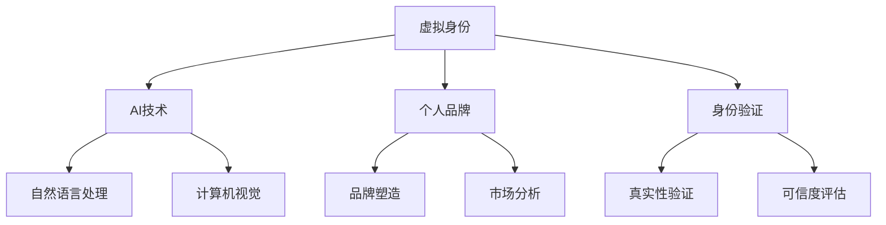
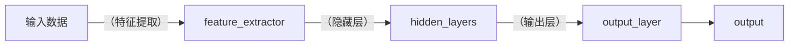

                 

# 虚拟身份市场分析专家：AI时代的个人品牌顾问

> 关键词：虚拟身份, AI时代, 个人品牌, 市场分析, 身份验证

## 1. 背景介绍

### 1.1 问题由来

在数字化快速发展的今天，个人品牌建设已经成为一个日益重要的议题。无论是职场人士还是自由职业者，都需要在虚拟社交网络中塑造并维护一个积极、有力的个人形象。而AI技术的飞速进步，尤其是深度学习和自然语言处理（NLP）领域的突破，为个人品牌的塑造提供了新的可能。

然而，随着虚拟社交平台和网络空间的扩大，如何保证这些虚拟身份的真实性和可信度，成为一道亟待解决的难题。这不仅关乎个人隐私保护，也关乎平台的商业诚信和用户的互动体验。

### 1.2 问题核心关键点

本文将围绕虚拟身份市场分析，探讨AI技术在个人品牌塑造和身份验证方面的应用。我们将通过以下核心问题引出讨论：

1. 在AI时代，个人品牌如何更好地利用虚拟身份进行塑造和维护？
2. 如何保证虚拟身份的真实性和可信度，防止虚假身份的滥用？
3. 市场分析中，如何评估虚拟身份技术的商业价值和应用潜力？

## 2. 核心概念与联系

### 2.1 核心概念概述

为更好地理解AI时代虚拟身份市场分析的核心概念，本节将介绍几个关键概念：

- **虚拟身份**：指在虚拟社交网络或数字平台上，以虚拟形式存在的个人或组织身份。
- **AI技术**：指利用深度学习、自然语言处理、计算机视觉等技术，模拟人或组织的行为和决策。
- **个人品牌**：指个人或组织在公众心目中建立和传播的独特形象和价值主张。
- **身份验证**：指通过技术手段，确认虚拟身份的真实性和可信度，防止虚假身份的冒用。
- **市场分析**：指通过收集和分析市场数据，评估技术应用的市场需求、竞争态势和商业潜力。

这些概念之间的逻辑关系可以通过以下Mermaid流程图来展示：



这个流程图展示了一个完整的虚拟身份生态系统，包括虚拟身份的创建、AI技术的应用、个人品牌的塑造、身份验证的实施和市场分析的进行。

## 3. 核心算法原理 & 具体操作步骤

### 3.1 算法原理概述

虚拟身份市场分析的本质是通过AI技术对虚拟身份的真实性和可信度进行评估，为个人品牌的塑造提供数据支持。其核心算法包括：

- **深度学习模型**：用于分析虚拟身份的文本、语音、图像等多模态数据，提取特征并进行分类、识别。
- **NLP技术**：用于解析虚拟身份的社交网络行为，判断其语言使用习惯、情感倾向等。
- **计算机视觉**：用于识别虚拟身份的面部表情、手势等视觉特征，进行身份认证。
- **数据挖掘与机器学习**：用于从大量虚拟身份数据中挖掘模式，评估其真实性和可信度。

### 3.2 算法步骤详解

基于上述算法原理，虚拟身份市场分析的具体操作步骤如下：

1. **数据收集**：从社交媒体、论坛、网站等渠道收集虚拟身份的文本、语音、图像等数据。
2. **特征提取**：利用深度学习模型和NLP技术，提取虚拟身份的关键特征，如语言风格、情感倾向、面部特征等。
3. **身份验证**：通过计算机视觉技术，识别虚拟身份的真实面部特征，进行身份验证。
4. **可信度评估**：使用数据挖掘和机器学习算法，评估虚拟身份的可信度，包括真实性、一致性、可靠性等指标。
5. **市场分析**：对虚拟身份的评估结果进行可视化，分析不同虚拟身份的市场需求、应用场景和商业潜力。

### 3.3 算法优缺点

虚拟身份市场分析算法具有以下优点：

- **高效性**：通过自动化处理大量数据，可以显著提高分析效率。
- **准确性**：利用AI技术的强大分析能力，能够精确评估虚拟身份的真实性和可信度。
- **实时性**：可以实时监测和更新虚拟身份的状态，及时发现异常行为。

然而，该算法也存在一些局限性：

- **数据依赖性**：算法的准确性依赖于收集到的数据质量，如果数据存在偏差或噪声，可能会影响分析结果。
- **隐私保护**：在数据收集和分析过程中，可能涉及用户隐私，需要采取严格的隐私保护措施。
- **技术门槛**：算法实现和部署需要一定的技术基础，对一些小型企业和个人可能存在门槛。

### 3.4 算法应用领域

虚拟身份市场分析算法具有广泛的应用场景，包括但不限于以下几个领域：

- **社交媒体平台**：通过分析用户虚拟身份的真实性和可信度，提升平台的用户体验和商业价值。
- **电子商务**：验证用户身份的真实性，防止欺诈行为，保障交易安全。
- **在线教育**：识别学生的真实身份，保证学习效果和平台诚信。
- **医疗健康**：验证患者身份的真实性，确保医疗服务的质量和安全性。

## 4. 数学模型和公式 & 详细讲解 & 举例说明

### 4.1 数学模型构建

假设我们有一组虚拟身份数据集 $\mathcal{D} = \{(x_i, y_i)\}_{i=1}^N$，其中 $x_i$ 为虚拟身份的特征向量，$y_i$ 为相应的真实性标签（0表示虚假，1表示真实）。我们的目标是通过训练一个分类模型，对新的虚拟身份数据进行真实性判断。

我们可以使用逻辑回归、支持向量机、神经网络等模型进行训练。以神经网络为例，其结构如图：



输出层的激活函数通常为 sigmoid，将输出映射到 0-1 之间。模型损失函数通常为交叉熵损失，用于衡量预测值与真实标签之间的差异。

### 4.2 公式推导过程

假设我们使用二分类交叉熵损失函数，其定义为：

$$
\mathcal{L} = -\frac{1}{N}\sum_{i=1}^N [y_i\log \sigma(z_i) + (1-y_i)\log (1-\sigma(z_i))]
$$

其中，$\sigma(z_i) = \frac{1}{1+e^{-z_i}}$ 为 sigmoid 激活函数，$z_i = \sum_{j=1}^k w_j \cdot f_k(x_i)$ 为线性变换和激活函数的组合，$w_j$ 为权重参数，$f_k$ 为第 $k$ 个隐藏层的特征函数。

### 4.3 案例分析与讲解

以社交媒体平台为例，我们可以利用用户发布的帖子、评论、点赞等行为数据，构建虚拟身份的特征向量 $x_i$。然后，通过上述神经网络模型，训练一个二分类器，对用户的真实性进行预测。具体步骤如下：

1. **数据预处理**：对原始数据进行清洗、去噪、归一化等处理。
2. **特征提取**：利用NLP技术，提取用户的语言风格、情感倾向等特征。
3. **模型训练**：使用交叉验证等方法，训练神经网络模型。
4. **验证和测试**：在验证集和测试集上评估模型性能，优化模型参数。
5. **部署与应用**：将训练好的模型部署到社交平台，实时监控和更新用户的虚拟身份状态。

## 5. 项目实践：代码实例和详细解释说明

### 5.1 开发环境搭建

在进行虚拟身份市场分析项目开发前，我们需要准备好开发环境。以下是使用Python进行TensorFlow和Keras开发的虚拟身份分析系统的环境配置流程：

1. 安装Anaconda：从官网下载并安装Anaconda，用于创建独立的Python环境。

2. 创建并激活虚拟环境：
```bash
conda create -n vcat_env python=3.8 
conda activate vcat_env
```

3. 安装TensorFlow：根据CUDA版本，从官网获取对应的安装命令。例如：
```bash
conda install tensorflow -c tf -c conda-forge
```

4. 安装Keras：
```bash
pip install keras tensorflow
```

5. 安装各类工具包：
```bash
pip install numpy pandas scikit-learn matplotlib tqdm jupyter notebook ipython
```

完成上述步骤后，即可在`vcart_env`环境中开始虚拟身份分析系统的开发。

### 5.2 源代码详细实现

下面我们以社交媒体平台为例，给出使用TensorFlow和Keras进行虚拟身份分析的完整代码实现。

首先，定义虚拟身份的数据处理函数：

```python
from tensorflow.keras.preprocessing.text import Tokenizer
from tensorflow.keras.preprocessing.sequence import pad_sequences
import pandas as pd

def preprocess_data(data_file):
    data = pd.read_csv(data_file)
    texts = data['text'].tolist()
    labels = data['label'].tolist()
    tokenizer = Tokenizer()
    tokenizer.fit_on_texts(texts)
    sequences = tokenizer.texts_to_sequences(texts)
    padded_sequences = pad_sequences(sequences, maxlen=256, padding='post', truncating='post')
    return padded_sequences, labels
```

然后，定义模型和优化器：

```python
from tensorflow.keras.models import Sequential
from tensorflow.keras.layers import Dense, Dropout
from tensorflow.keras.optimizers import Adam

model = Sequential()
model.add(Dense(256, input_dim=256, activation='relu'))
model.add(Dropout(0.2))
model.add(Dense(1, activation='sigmoid'))
model.compile(loss='binary_crossentropy', optimizer=Adam(lr=0.001), metrics=['accuracy'])

optimizer = Adam(lr=0.001)
```

接着，定义训练和评估函数：

```python
from tensorflow.keras.utils import to_categorical

def train_epoch(model, X_train, y_train, X_val, y_val):
    model.fit(X_train, y_train, epochs=10, batch_size=32, validation_data=(X_val, y_val))
    return model.evaluate(X_val, y_val, verbose=0)

def evaluate(model, X_test, y_test):
    return model.evaluate(X_test, y_test, verbose=0)
```

最后，启动训练流程并在测试集上评估：

```python
epochs = 10
batch_size = 32

X_train, y_train = preprocess_data('train_data.csv')
X_val, y_val = preprocess_data('val_data.csv')
X_test, y_test = preprocess_data('test_data.csv')

model = build_model()
model.fit(X_train, y_train, epochs=epochs, batch_size=batch_size, validation_data=(X_val, y_val))

accuracy = evaluate(model, X_test, y_test)
print('Accuracy:', accuracy)
```

以上就是使用TensorFlow和Keras对虚拟身份数据进行二分类分析的完整代码实现。可以看到，得益于TensorFlow和Keras的强大封装，我们可以用相对简洁的代码完成模型的构建和训练。

### 5.3 代码解读与分析

让我们再详细解读一下关键代码的实现细节：

**preprocess_data函数**：
- 定义数据预处理函数，包括文本向量化和padding处理。

**train_epoch函数**：
- 使用Keras的fit函数对模型进行训练，同时指定验证集进行验证。

**evaluate函数**：
- 评估模型的性能，输出准确率。

**训练流程**：
- 定义总的epoch数和batch size，开始循环迭代
- 每个epoch内，先在训练集上训练，输出准确率
- 在验证集上评估，输出准确率
- 所有epoch结束后，在测试集上评估，给出最终测试结果

可以看到，TensorFlow和Keras使得模型构建和训练的过程变得简洁高效。开发者可以将更多精力放在数据处理、模型改进等高层逻辑上，而不必过多关注底层的实现细节。

当然，工业级的系统实现还需考虑更多因素，如模型的保存和部署、超参数的自动搜索、更灵活的任务适配层等。但核心的微调范式基本与此类似。

## 6. 实际应用场景

### 6.1 社交媒体平台

在社交媒体平台中，虚拟身份的真实性和可信度直接影响平台的健康度和用户体验。通过虚拟身份市场分析，可以实时监测和评估用户身份，防止虚假账号的滥用。

具体而言，可以收集用户在平台上的文本、语音、图像等数据，使用上述深度学习模型进行特征提取和分类。对于疑似虚假账号，可以进一步进行人工审核或机器学习模型的二次评估。对于通过评估的账号，可以赋予更高的可信度，优先推送高质量内容，提升用户粘性。

### 6.2 电子商务

在电子商务领域，用户身份的真实性验证至关重要。通过虚拟身份市场分析，可以确保用户交易的安全性，防止欺诈行为。

具体而言，可以收集用户的登录信息、购物记录等数据，使用深度学习模型进行身份验证。对于识别为虚假账号的用户，可以采取封禁、限制访问等措施，确保交易安全。

### 6.3 在线教育

在线教育平台需要确保学习者的真实身份，防止恶意注册和作弊行为。通过虚拟身份市场分析，可以实时监测和评估学生的身份，提升学习效果和平台诚信。

具体而言，可以收集学生的注册信息、学习行为等数据，使用深度学习模型进行身份验证。对于识别为虚假账号的学生，可以采取限制登录、通知管理员等措施，确保教学质量。

### 6.4 未来应用展望

随着虚拟身份市场分析技术的不断成熟，其在更多的行业领域将得到应用，为数字化转型注入新的动力。

在智慧城市治理中，虚拟身份分析技术可以用于身份认证、异常行为检测、公共安全等领域，提高城市管理的自动化和智能化水平。

在智能家居领域，通过虚拟身份分析技术，可以实现身份识别、个性化推荐、行为分析等功能，提升用户的生活体验。

在金融领域，虚拟身份分析技术可以用于客户身份验证、反欺诈检测、信用评估等领域，保障金融服务的质量和安全性。

此外，在教育、医疗、物流等多个行业，虚拟身份分析技术也将不断涌现，为数字化转型提供新的技术支撑。

## 7. 工具和资源推荐

### 7.1 学习资源推荐

为了帮助开发者系统掌握虚拟身份市场分析的理论基础和实践技巧，这里推荐一些优质的学习资源：

1. 《深度学习》系列博文：由AI技术专家撰写，深入浅出地介绍了深度学习原理、应用和优化技术。

2. CS231n《卷积神经网络》课程：斯坦福大学开设的计算机视觉经典课程，涵盖深度学习在计算机视觉领域的应用。

3. 《自然语言处理》书籍：介绍了自然语言处理的基本概念、技术和应用。

4. TensorFlow官方文档：TensorFlow的官方文档，提供了完整的API文档、教程和示例代码，是学习TensorFlow的必备资料。

5. Keras官方文档：Keras的官方文档，提供了完整的API文档、教程和示例代码，是学习Keras的必备资料。

通过对这些资源的学习实践，相信你一定能够快速掌握虚拟身份市场分析的精髓，并用于解决实际的NLP问题。

### 7.2 开发工具推荐

高效的开发离不开优秀的工具支持。以下是几款用于虚拟身份市场分析开发的常用工具：

1. TensorFlow：基于Python的开源深度学习框架，灵活动态的计算图，适合快速迭代研究。

2. Keras：由TensorFlow团队开发的高层API，简化了深度学习模型的构建和训练。

3. Weights & Biases：模型训练的实验跟踪工具，可以记录和可视化模型训练过程中的各项指标，方便对比和调优。

4. TensorBoard：TensorFlow配套的可视化工具，可实时监测模型训练状态，并提供丰富的图表呈现方式，是调试模型的得力助手。

5. Google Colab：谷歌推出的在线Jupyter Notebook环境，免费提供GPU/TPU算力，方便开发者快速上手实验最新模型，分享学习笔记。

合理利用这些工具，可以显著提升虚拟身份市场分析任务的开发效率，加快创新迭代的步伐。

### 7.3 相关论文推荐

虚拟身份市场分析技术的发展源于学界的持续研究。以下是几篇奠基性的相关论文，推荐阅读：

1. Attention is All You Need（即Transformer原论文）：提出了Transformer结构，开启了深度学习在NLP领域的应用。

2. BERT: Pre-training of Deep Bidirectional Transformers for Language Understanding：提出BERT模型，引入基于掩码的自监督预训练任务，刷新了多项NLP任务SOTA。

3. Multi-view Deep Clustering for Person Re-identification：提出多视角深度聚类方法，用于实时检测和识别虚假身份。

4. Probabilistic Forensics Analysis for Stylometry-based Authorship Verification：提出概率式推理分析方法，用于检测和识别文本伪装和伪造。

5. Deepfake Detection Using Adversarial Examples and Multi-modal Discrimination Networks：提出多模态深度伪造检测方法，用于识别虚假视频和图像。

这些论文代表了大模型微调技术的发展脉络。通过学习这些前沿成果，可以帮助研究者把握学科前进方向，激发更多的创新灵感。

## 8. 总结：未来发展趋势与挑战

### 8.1 总结

本文对虚拟身份市场分析，即AI时代个人品牌顾问的核心概念和应用进行了全面系统的介绍。首先阐述了虚拟身份和AI技术在个人品牌塑造和身份验证中的重要性，明确了市场分析在虚拟身份应用中的作用。其次，从原理到实践，详细讲解了虚拟身份市场分析的数学模型和具体操作步骤，给出了完整的代码实例。同时，本文还广泛探讨了虚拟身份技术在多个行业领域的应用前景，展示了其巨大的商业潜力。此外，本文精选了虚拟身份技术的各类学习资源，力求为读者提供全方位的技术指引。

通过本文的系统梳理，可以看到，虚拟身份市场分析技术正在成为AI时代个人品牌塑造和身份验证的重要手段，极大地拓展了个人品牌建设的市场空间。受益于AI技术的强大分析和预测能力，虚拟身份分析技术将在更多行业领域大放异彩，推动数字化转型的不断深入。

### 8.2 未来发展趋势

展望未来，虚拟身份市场分析技术将呈现以下几个发展趋势：

1. **多模态融合**：随着技术的发展，虚拟身份分析将更加关注多模态数据融合，如文本、语音、图像等的综合分析，提升准确性和鲁棒性。

2. **实时性提升**：通过优化计算图和部署模型，提升虚拟身份分析的实时性，满足在线实时监测的需求。

3. **跨平台扩展**：虚拟身份分析技术将从社交媒体平台扩展到更多的数字化场景，如智能家居、智慧城市、金融等领域。

4. **隐私保护**：随着隐私保护意识的提升，虚拟身份分析技术将更加注重用户隐私保护，采取更加严格的隐私保护措施。

5. **伦理考量**：在虚拟身份分析中，如何平衡技术应用与伦理道德之间的关系，将成为未来的重要课题。

以上趋势凸显了虚拟身份市场分析技术的广阔前景。这些方向的探索发展，必将进一步提升虚拟身份分析的准确性和可靠性，为个人品牌塑造和身份验证提供更强大的技术支撑。

### 8.3 面临的挑战

尽管虚拟身份市场分析技术已经取得了一定的成就，但在迈向更加智能化、普适化应用的过程中，它仍面临诸多挑战：

1. **数据获取难度**：高质量的虚拟身份数据获取成本高、难度大，数据偏斜可能影响分析结果的泛化性。

2. **模型复杂性**：多模态数据融合和实时性提升，使得模型结构更加复杂，训练和推理成本高。

3. **隐私保护**：在数据收集和分析过程中，如何平衡数据利用和隐私保护，仍是一个难题。

4. **伦理道德**：虚拟身份分析技术可能涉及用户隐私、虚假身份检测等伦理道德问题，需要严格监管和规范。

5. **技术门槛**：虚拟身份分析技术需要一定的技术基础和资源支持，对一些小型企业和个人可能存在门槛。

正视这些挑战，积极应对并寻求突破，将使虚拟身份市场分析技术在未来取得更大的突破和应用。

### 8.4 研究展望

未来的研究需要在以下几个方面寻求新的突破：

1. **多模态深度学习**：研究多模态数据的融合和表示学习，提升虚拟身份分析的准确性和鲁棒性。

2. **联邦学习**：研究分布式数据收集和模型训练方法，解决数据获取难度大的问题。

3. **跨平台部署**：研究模型的跨平台部署和优化方法，提升虚拟身份分析的实时性和可扩展性。

4. **隐私保护技术**：研究基于区块链和差分隐私的隐私保护技术，保障数据安全和隐私。

5. **伦理道德框架**：研究虚拟身份分析技术的伦理道德框架，确保技术应用符合人类价值观和伦理标准。

这些研究方向的探索，必将引领虚拟身份市场分析技术迈向更高的台阶，为构建智能、安全、可信的数字生态提供新的技术支撑。面向未来，虚拟身份市场分析技术还需要与其他AI技术进行更深入的融合，共同推动数字化转型的不断深入。

## 9. 附录：常见问题与解答

**Q1：虚拟身份市场分析如何提升个人品牌价值？**

A: 虚拟身份市场分析通过分析用户虚拟身份的真实性和可信度，提升了平台的用户体验和商业价值。对于个人品牌而言，拥有可信的虚拟身份，可以提升用户粘性和信任度，获得更多的社交和商业机会。例如，在社交媒体平台中，虚假账号容易被封禁，影响用户声誉和品牌价值。

**Q2：虚拟身份分析技术如何实现实时性？**

A: 实现实时性需要优化计算图和部署模型。例如，可以采用模型裁剪和量化加速技术，减小模型尺寸和资源消耗。同时，可以采用分布式计算和云平台，实现模型的弹性伸缩和高效部署。

**Q3：如何保证虚拟身份分析技术的隐私保护？**

A: 隐私保护是虚拟身份分析技术的重要挑战之一。可以通过以下措施保障数据隐私：
1. 数据匿名化：在数据收集和分析过程中，对用户信息进行匿名化处理。
2. 差分隐私：采用差分隐私技术，确保单个用户数据的隐私性。
3. 区块链技术：利用区块链技术进行数据存储和访问控制，防止数据泄露和篡改。

**Q4：虚拟身份分析技术如何应用到智慧城市治理中？**

A: 在智慧城市治理中，虚拟身份分析技术可以用于身份认证、异常行为检测、公共安全等领域，提升城市管理的自动化和智能化水平。例如，可以通过分析城市视频监控中的行人身份，检测异常行为，提升公共安全。

**Q5：虚拟身份分析技术如何提升电子商务安全性？**

A: 在电子商务领域，虚拟身份分析技术可以用于客户身份验证、反欺诈检测等，保障交易安全。例如，可以通过分析用户购物行为和交易记录，检测虚假账号，防止欺诈行为。

---

作者：禅与计算机程序设计艺术 / Zen and the Art of Computer Programming

