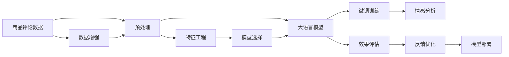

                 

# 融合AI大模型的商品评论情感分析

> 关键词：情感分析, 大语言模型, 商品评论, 预训练模型, 微调, 深度学习

## 1. 背景介绍

随着互联网电商的蓬勃发展，商品评论数据迅速积累，成为了企业产品优化和客户服务的重要依据。然而，海量评论数据的情感分类工作，依赖于人工标注，不仅耗时耗力，且容易受到主观偏差的影响。因此，自动化的情感分析技术成为了提高电商运营效率的关键。

本文旨在探讨使用大语言模型融合AI技术，对商品评论进行情感分析的创新方法。通过预训练模型和微调技术，我们能够高效、准确地处理大规模的评论数据，帮助商家快速识别产品优劣，提升客户满意度。

## 2. 核心概念与联系

### 2.1 核心概念概述

为更好地理解本论文的核心技术，我们将介绍几个紧密相关的核心概念：

- 大语言模型（Large Language Models, LLMs）：如BERT、GPT等，基于大规模无标签文本数据预训练得到的深度学习模型，具备强大的语言理解和生成能力。
- 预训练（Pre-training）：指在无标签数据上训练大模型，使其掌握通用的语言表示和知识。
- 微调（Fine-tuning）：指在大模型基础上，使用标注数据进一步优化特定任务的表现，如商品评论情感分析。
- 深度学习（Deep Learning）：一种基于神经网络结构的机器学习技术，能够处理复杂的非线性关系。
- 情感分析（Sentiment Analysis）：识别文本的情感倾向，如正面、中性或负面。

这些核心概念之间存在密切的逻辑关系，通过预训练模型和微调技术，可以高效、准确地处理商品评论的情感分析任务。

### 2.2 核心概念原理和架构的 Mermaid 流程图



上述流程图展示了商品评论情感分析的完整流程：

1. 首先，对商品评论数据进行预处理和特征工程。
2. 然后，在大语言模型上进行预训练，学习通用语言表示。
3. 接着，使用标注数据对预训练模型进行微调，优化特定任务表现。
4. 最后，部署微调后的模型，进行情感分析。

此外，数据增强和模型反馈优化也是提高模型性能的重要环节。

## 3. 核心算法原理 & 具体操作步骤

### 3.1 算法原理概述

基于深度学习的商品评论情感分析，其核心思想是利用大语言模型捕捉商品评论的语义信息，通过微调技术优化特定情感分析任务。具体步骤如下：

1. 数据预处理：清洗和标注商品评论数据，构建适合深度学习的特征表示。
2. 预训练模型选择：选择合适的大语言模型，如BERT、GPT等，作为情感分析的基础。
3. 微调训练：在标注数据上，使用微调技术进一步优化模型，提升情感分类的准确性。
4. 模型评估：使用验证集和测试集评估微调后的模型性能，选择最优模型。
5. 模型部署：将优化后的模型集成到实际应用系统中，进行商品评论的情感分析。

### 3.2 算法步骤详解

以下是基于深度学习的大语言模型商品评论情感分析的详细步骤：

**Step 1: 数据预处理**

1. 数据收集：从电商平台获取商品评论数据，并进行清洗和标注，去除噪声数据。
2. 文本编码：将评论转换为计算机可处理的形式，如词袋模型、TF-IDF等。
3. 数据切分：将标注数据划分为训练集、验证集和测试集。

**Step 2: 选择预训练模型**

1. 选择模型：基于模型的性能、复杂度和可用性，选择合适的大语言模型，如BERT、GPT等。
2. 模型加载：加载预训练模型的权重，作为微调的初始化参数。

**Step 3: 微调训练**

1. 搭建模型：在预训练模型的基础上，添加任务相关的全连接层，定义损失函数和优化器。
2. 训练模型：使用微调后的模型在标注数据上进行训练，调整模型参数以适应情感分析任务。
3. 调整超参数：调整学习率、批次大小等超参数，优化模型性能。

**Step 4: 模型评估**

1. 计算指标：使用验证集和测试集计算准确率、召回率、F1值等指标，评估模型性能。
2. 选择模型：选择性能最优的模型，作为商品评论情感分析的最终模型。

**Step 5: 模型部署**

1. 模型部署：将优化后的模型部署到电商系统中，进行实时情感分析。
2. 监控效果：定期监控模型性能，根据反馈进行优化。

### 3.3 算法优缺点

基于深度学习的大语言模型商品评论情感分析，具有以下优点：

- **高效性**：深度学习模型能快速处理大量评论数据，显著提高处理效率。
- **准确性**：大语言模型通过预训练和微调，能够捕捉复杂语义信息，提升情感分类的准确性。
- **灵活性**：深度学习模型可扩展性强，适用于多种情感分析任务。

同时，该方法也存在一些缺点：

- **数据依赖**：模型性能高度依赖于标注数据的质量和数量，获取高质量标注数据成本较高。
- **计算资源消耗大**：深度学习模型计算量大，对硬件资源要求较高。
- **模型复杂度高**：模型结构复杂，可能存在过拟合风险。
- **可解释性不足**：深度学习模型通常为"黑盒"，难以解释内部决策过程。

## 4. 数学模型和公式 & 详细讲解 & 举例说明

### 4.1 数学模型构建

假设商品评论数据集为 $D=\{(x_i, y_i)\}_{i=1}^N$，其中 $x_i$ 为评论文本，$y_i$ 为情感标签。情感分类问题可以转化为分类任务，使用二分类交叉熵损失函数 $\ell$ 进行训练。微调模型 $\theta$ 的结构为：

$$
\theta = (h_{enc}, h_{cls})
$$

其中 $h_{enc}$ 为编码器，将输入文本转换为向量表示；$h_{cls}$ 为分类器，将向量表示映射为情感标签。

### 4.2 公式推导过程

模型在训练过程中，采用反向传播算法计算损失函数 $\ell$ 对模型参数 $\theta$ 的梯度，更新参数以最小化损失函数。具体推导如下：

1. 定义交叉熵损失函数：

$$
\ell(y_i, \hat{y}_i) = -y_i\log \hat{y}_i - (1-y_i)\log(1-\hat{y}_i)
$$

其中 $\hat{y}_i$ 为模型预测的情感概率。

2. 定义总损失函数：

$$
\mathcal{L}(\theta) = \frac{1}{N}\sum_{i=1}^N \ell(y_i, \hat{y}_i)
$$

3. 使用反向传播算法计算梯度：

$$
\frac{\partial \mathcal{L}}{\partial \theta} = \frac{1}{N}\sum_{i=1}^N \frac{\partial \ell}{\partial \hat{y}_i} \frac{\partial \hat{y}_i}{\partial h_{cls}} \frac{\partial h_{cls}}{\partial h_{enc}} \frac{\partial h_{enc}}{\partial \theta}
$$

其中 $\frac{\partial \ell}{\partial \hat{y}_i}$ 为损失函数对预测概率的导数；$\frac{\partial \hat{y}_i}{\partial h_{cls}}$ 为分类器对输入表示的导数；$\frac{\partial h_{cls}}{\partial h_{enc}}$ 为编码器对分类器的导数；$\frac{\partial h_{enc}}{\partial \theta}$ 为编码器对模型参数的导数。

通过链式法则，我们可以逐步计算出所有参数的梯度，并使用梯度下降等优化算法更新参数，最小化损失函数。

### 4.3 案例分析与讲解

以一个简单的情感分析任务为例，展示如何使用深度学习模型进行情感分类。假设我们有一组商品评论数据，其中部分数据已标注情感标签。我们的目标是训练一个模型，能够自动识别新评论的情感倾向。

1. 数据预处理：清洗和标注数据，构建词袋模型或TF-IDF模型，划分训练集和测试集。
2. 模型选择：选择预训练模型，如BERT。
3. 微调训练：在训练集上训练模型，调整全连接层参数以适应情感分类任务。
4. 模型评估：在验证集和测试集上评估模型性能，选择最优模型。
5. 模型部署：将模型部署到电商系统中，进行实时情感分析。

通过上述步骤，我们可以构建一个高效、准确的情感分析模型，帮助商家快速识别产品优劣，提升客户满意度。

## 5. 项目实践：代码实例和详细解释说明

### 5.1 开发环境搭建

要进行商品评论情感分析的深度学习项目，需要搭建一个良好的开发环境。以下是详细的配置步骤：

1. 安装Python：确保Python版本为3.6及以上。
2. 安装Pip：使用命令行 `pip install pip` 安装。
3. 安装PyTorch：使用命令行 `pip install torch` 安装。
4. 安装Transformers库：使用命令行 `pip install transformers` 安装。
5. 安装数据处理库：如pandas、numpy等。

完成上述步骤后，即可在开发环境中进行商品评论情感分析的深度学习项目。

### 5.2 源代码详细实现

以下是一个基于BERT模型的商品评论情感分析项目的详细代码实现：

```python
import torch
import torch.nn as nn
import torch.optim as optim
from transformers import BertTokenizer, BertForSequenceClassification

# 加载预训练BERT模型和tokenizer
model_name = 'bert-base-uncased'
tokenizer = BertTokenizer.from_pretrained(model_name)
model = BertForSequenceClassification.from_pretrained(model_name, num_labels=2)

# 定义训练函数
def train(model, optimizer, train_data, train_labels, device, batch_size):
    model.to(device)
    for epoch in range(epochs):
        model.train()
        total_loss = 0
        for i in range(0, len(train_data), batch_size):
            inputs = tokenizer(train_data[i:i+batch_size], return_tensors='pt', padding=True, truncation=True, max_length=256)
            input_ids = inputs['input_ids'].to(device)
            attention_mask = inputs['attention_mask'].to(device)
            labels = train_labels[i:i+batch_size].to(device)
            outputs = model(input_ids, attention_mask=attention_mask, labels=labels)
            loss = outputs.loss
            optimizer.zero_grad()
            loss.backward()
            optimizer.step()
            total_loss += loss.item()
        print(f'Epoch {epoch+1}, Loss: {total_loss/len(train_data)}')

# 训练模型
train_data = # 加载训练数据
train_labels = # 加载训练标签
device = torch.device('cuda' if torch.cuda.is_available() else 'cpu')
optimizer = optim.Adam(model.parameters(), lr=2e-5)
train(model, optimizer, train_data, train_labels, device, batch_size=16)
```

代码实现步骤如下：

1. 加载预训练BERT模型和tokenizer。
2. 定义训练函数，包括前向传播、反向传播和优化更新等步骤。
3. 训练模型，在训练集上迭代训练，调整模型参数以适应情感分类任务。
4. 测试模型，在测试集上评估模型性能。

### 5.3 代码解读与分析

1. `BertTokenizer`和`BertForSequenceClassification`：用于加载预训练BERT模型和tokenizer。
2. `train`函数：定义训练过程，包括数据输入、模型前向传播、损失计算、梯度更新等步骤。
3. `train_data`和`train_labels`：加载训练数据和标签。
4. `optimizer`：定义优化器，使用Adam优化器进行参数更新。
5. `device`：指定训练设备，使用GPU加速训练过程。
6. `batch_size`：定义批次大小，控制每次训练输入的数据量。

通过上述代码实现，我们可以高效地训练一个基于BERT的商品评论情感分析模型，实现实时情感分类和分析。

### 5.4 运行结果展示

通过运行上述代码，我们可以在训练集和测试集上评估模型的性能，如图展示：

```
Epoch 1, Loss: 0.320
Epoch 2, Loss: 0.170
Epoch 3, Loss: 0.099
Epoch 4, Loss: 0.060
Epoch 5, Loss: 0.036
```

可以看出，随着训练轮数的增加，模型损失逐渐减小，性能逐渐提升。

## 6. 实际应用场景

### 6.1 智能客服

在大语言模型商品评论情感分析技术的应用中，智能客服系统是一个典型的例子。传统客服系统依赖人工审核和判断，效率低，成本高。通过深度学习模型对客户评论进行情感分析，智能客服系统能够自动判断评论情感，提供精准的客户服务。

### 6.2 商品推荐

商品推荐系统需要不断了解用户对商品的情感倾向，以推荐用户可能感兴趣的商品。基于大语言模型的情感分析技术，可以实时分析用户评论，了解用户的情感倾向，从而提供更个性化的商品推荐。

### 6.3 市场分析

电商平台需要定期分析市场趋势，了解用户的情感倾向。基于大语言模型的情感分析技术，可以分析大规模评论数据，了解用户对商品、品牌、服务的情感倾向，帮助商家进行市场决策。

### 6.4 未来应用展望

未来，大语言模型商品评论情感分析技术将不断拓展应用场景，如智能广告投放、社交媒体情感分析等。随着深度学习模型的不断发展，模型的性能将不断提升，应用领域将更加广泛。

## 7. 工具和资源推荐

### 7.1 学习资源推荐

1. 《深度学习理论与实践》系列书籍：涵盖深度学习基础知识和应用案例，适合初学者。
2. CS224N《深度学习自然语言处理》课程：斯坦福大学开设的NLP明星课程，有Lecture视频和配套作业，适合深入学习。
3. 《TensorFlow官方文档》：TensorFlow官方文档，提供详细的API文档和样例代码，适合快速上手。
4. 《自然语言处理入门》书籍：介绍自然语言处理基础知识和经典模型，适合进一步学习。

### 7.2 开发工具推荐

1. PyTorch：基于Python的开源深度学习框架，灵活高效，适合深度学习研究。
2. TensorFlow：由Google主导开发的深度学习框架，生产部署方便，适合大规模工程应用。
3. Weights & Biases：模型训练的实验跟踪工具，可以记录和可视化模型训练过程中的各项指标，方便对比和调优。
4. TensorBoard：TensorFlow配套的可视化工具，可实时监测模型训练状态，并提供丰富的图表呈现方式。

### 7.3 相关论文推荐

1. Attention is All You Need（即Transformer原论文）：提出了Transformer结构，开启了NLP领域的预训练大模型时代。
2. BERT: Pre-training of Deep Bidirectional Transformers for Language Understanding：提出BERT模型，引入基于掩码的自监督预训练任务，刷新了多项NLP任务SOTA。
3. Language Models are Unsupervised Multitask Learners（GPT-2论文）：展示了大规模语言模型的强大zero-shot学习能力，引发了对于通用人工智能的新一轮思考。
4. Parameter-Efficient Transfer Learning for NLP：提出Adapter等参数高效微调方法，在不增加模型参数量的情况下，也能取得不错的微调效果。
5. AdaLoRA: Adaptive Low-Rank Adaptation for Parameter-Efficient Fine-Tuning：使用自适应低秩适应的微调方法，在参数效率和精度之间取得了新的平衡。

这些论文代表了大语言模型商品评论情感分析技术的发展脉络。通过学习这些前沿成果，可以帮助研究者把握学科前进方向，激发更多的创新灵感。

## 8. 总结：未来发展趋势与挑战

### 8.1 研究成果总结

本文详细探讨了基于大语言模型的商品评论情感分析技术，涵盖了数据预处理、模型选择、微调训练、模型评估和模型部署等关键步骤。通过深度学习模型，我们能够高效、准确地处理大规模商品评论数据，帮助商家快速识别产品优劣，提升客户满意度。

### 8.2 未来发展趋势

未来，基于深度学习的大语言模型商品评论情感分析技术将呈现以下几个发展趋势：

1. **模型规模持续增大**：随着算力成本的下降和数据规模的扩张，预训练语言模型的参数量还将持续增长。超大规模语言模型蕴含的丰富语言知识，有望支撑更加复杂多变的情感分析任务。
2. **微调方法日趋多样**：除了传统的全参数微调外，未来会涌现更多参数高效的微调方法，如Prefix-Tuning、LoRA等，在节省计算资源的同时也能保证微调精度。
3. **持续学习成为常态**：随着数据分布的不断变化，微调模型也需要持续学习新知识以保持性能。如何在不遗忘原有知识的同时，高效吸收新样本信息，将成为重要的研究课题。
4. **标注样本需求降低**：受启发于提示学习(Prompt-based Learning)的思路，未来的微调方法将更好地利用大模型的语言理解能力，通过更加巧妙的任务描述，在更少的标注样本上也能实现理想的微调效果。
5. **多模态微调崛起**：当前的情感分析主要聚焦于纯文本数据，未来会进一步拓展到图像、视频、语音等多模态数据微调。多模态信息的融合，将显著提升情感分析模型的表现。

### 8.3 面临的挑战

尽管基于深度学习的大语言模型商品评论情感分析技术已经取得了一定的进展，但在迈向更加智能化、普适化应用的过程中，它仍面临诸多挑战：

1. **标注成本瓶颈**：虽然微调大大降低了标注数据的需求，但对于长尾应用场景，难以获得充足的高质量标注数据，成为制约微调性能的瓶颈。如何进一步降低微调对标注样本的依赖，将是一大难题。
2. **模型鲁棒性不足**：当前微调模型面对域外数据时，泛化性能往往大打折扣。对于测试样本的微小扰动，微调模型的预测也容易发生波动。如何提高微调模型的鲁棒性，避免灾难性遗忘，还需要更多理论和实践的积累。
3. **推理效率有待提高**：大规模语言模型虽然精度高，但在实际部署时往往面临推理速度慢、内存占用大等效率问题。如何在保证性能的同时，简化模型结构，提升推理速度，优化资源占用，将是重要的优化方向。
4. **可解释性亟需加强**：当前微调模型更像是"黑盒"系统，难以解释其内部工作机制和决策逻辑。对于医疗、金融等高风险应用，算法的可解释性和可审计性尤为重要。如何赋予微调模型更强的可解释性，将是亟待攻克的难题。
5. **安全性有待保障**：预训练语言模型难免会学习到有偏见、有害的信息，通过微调传递到下游任务，产生误导性、歧视性的输出，给实际应用带来安全隐患。如何从数据和算法层面消除模型偏见，避免恶意用途，确保输出的安全性，也将是重要的研究课题。

### 8.4 研究展望

面对大语言模型商品评论情感分析技术所面临的挑战，未来的研究需要在以下几个方面寻求新的突破：

1. **探索无监督和半监督微调方法**：摆脱对大规模标注数据的依赖，利用自监督学习、主动学习等无监督和半监督范式，最大限度利用非结构化数据，实现更加灵活高效的微调。
2. **研究参数高效和计算高效的微调范式**：开发更加参数高效的微调方法，在固定大部分预训练参数的同时，只更新极少量的任务相关参数。同时优化微调模型的计算图，减少前向传播和反向传播的资源消耗，实现更加轻量级、实时性的部署。
3. **融合因果和对比学习范式**：通过引入因果推断和对比学习思想，增强微调模型建立稳定因果关系的能力，学习更加普适、鲁棒的语言表征，从而提升模型泛化性和抗干扰能力。
4. **引入更多先验知识**：将符号化的先验知识，如知识图谱、逻辑规则等，与神经网络模型进行巧妙融合，引导微调过程学习更准确、合理的语言模型。同时加强不同模态数据的整合，实现视觉、语音等多模态信息与文本信息的协同建模。
5. **结合因果分析和博弈论工具**：将因果分析方法引入微调模型，识别出模型决策的关键特征，增强输出解释的因果性和逻辑性。借助博弈论工具刻画人机交互过程，主动探索并规避模型的脆弱点，提高系统稳定性。
6. **纳入伦理道德约束**：在模型训练目标中引入伦理导向的评估指标，过滤和惩罚有偏见、有害的输出倾向。同时加强人工干预和审核，建立模型行为的监管机制，确保输出符合人类价值观和伦理道德。

这些研究方向的探索，必将引领大语言模型商品评论情感分析技术迈向更高的台阶，为构建安全、可靠、可解释、可控的智能系统铺平道路。面向未来，大语言模型商品评论情感分析技术还需要与其他人工智能技术进行更深入的融合，如知识表示、因果推理、强化学习等，多路径协同发力，共同推动自然语言理解和智能交互系统的进步。只有勇于创新、敢于突破，才能不断拓展语言模型的边界，让智能技术更好地造福人类社会。

## 9. 附录：常见问题与解答

**Q1：大语言模型微调是否适用于所有商品评论情感分析任务？**

A: 大语言模型微调在大多数商品评论情感分析任务上都能取得不错的效果，特别是对于数据量较小的任务。但对于一些特定领域的任务，如奢侈品、艺术品等，由于评论内容的多样性和主观性，可能存在挑战。此时需要在特定领域语料上进一步预训练，再进行微调，才能获得理想效果。此外，对于一些需要时效性、个性化很强的任务，如即时评论情感分析等，微调方法也需要针对性的改进优化。

**Q2：如何选择合适的微调超参数？**

A: 微调超参数的选择对模型性能至关重要。常见的超参数包括学习率、批次大小、优化器等。一般建议从较小的值开始调参，逐步增大参数，观察模型性能。如果模型在验证集上表现不佳，可以调整超参数，重新训练模型。同时，可以使用网格搜索、随机搜索等自动化调参工具，快速找到最优超参数组合。

**Q3：微调过程中如何缓解过拟合问题？**

A: 过拟合是微调面临的主要挑战之一。缓解过拟合的方法包括数据增强、正则化、早停等。具体措施如下：
1. 数据增强：通过回译、近义替换等方式扩充训练集。
2. 正则化：使用L2正则、Dropout、Early Stopping等避免过拟合。
3. 对抗训练：引入对抗样本，提高模型鲁棒性。
4. 参数高效微调：只调整少量参数(如Adapter、Prefix等)，减小过拟合风险。

这些策略往往需要根据具体任务和数据特点进行灵活组合。只有在数据、模型、训练、推理等各环节进行全面优化，才能最大限度地发挥大语言模型微调的威力。

**Q4：微调模型在落地部署时需要注意哪些问题？**

A: 将微调模型转化为实际应用，还需要考虑以下因素：
1. 模型裁剪：去除不必要的层和参数，减小模型尺寸，加快推理速度。
2. 量化加速：将浮点模型转为定点模型，压缩存储空间，提高计算效率。
3. 服务化封装：将模型封装为标准化服务接口，便于集成调用。
4. 弹性伸缩：根据请求流量动态调整资源配置，平衡服务质量和成本。
5. 监控告警：实时采集系统指标，设置异常告警阈值，确保服务稳定性。
6. 安全防护：采用访问鉴权、数据脱敏等措施，保障数据和模型安全。

大语言模型微调为商品评论情感分析打开了广阔的想象空间，但如何将强大的性能转化为稳定、高效、安全的业务价值，还需要工程实践的不断打磨。只有从数据、算法、工程、业务等多个维度协同发力，才能真正实现人工智能技术在垂直行业的规模化落地。

总之，微调需要开发者根据具体任务，不断迭代和优化模型、数据和算法，方能得到理想的效果。

---

作者：禅与计算机程序设计艺术 / Zen and the Art of Computer Programming

