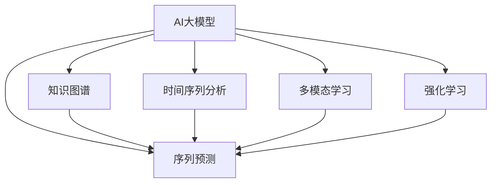

                 

# 融合AI大模型的用户行为序列分析

## 1. 背景介绍

在当今数字化时代，用户行为分析已成为企业决策和产品优化的重要依据。通过对用户交互数据进行深度分析，企业可以更准确地理解用户需求，提升产品体验和运营效率。然而，用户行为数据往往呈现出复杂的序列特征，传统的机器学习方法难以有效处理。近年来，AI大模型凭借其在序列预测、知识图谱构建等方面的卓越表现，成为用户行为分析领域的新锐力量。

### 1.1 问题由来
随着互联网和移动互联网的普及，用户行为数据呈现出爆炸式增长。用户行为包括点击、浏览、购买、反馈等各类事件，这些数据通常以序列的形式展现。传统的机器学习方法如线性回归、随机森林等，难以处理复杂的序列数据，无法捕捉事件之间的动态关系。因此，如何高效地处理序列数据，成为用户行为分析领域的一大挑战。

### 1.2 问题核心关键点
为了解决上述问题，AI大模型提供了全新的思路。大模型通过自监督学习在大规模语料库上进行预训练，学习到了丰富的语言知识和常识，能够处理复杂的序列数据。通过微调大模型，使其适应特定领域的用户行为数据，可以实现更精确、高效的用户行为序列分析。

## 2. 核心概念与联系

### 2.1 核心概念概述

为更好地理解融合AI大模型的用户行为序列分析方法，本节将介绍几个密切相关的核心概念：

- AI大模型：以自回归(如GPT)或自编码(如BERT)模型为代表的大规模预训练语言模型。通过在大规模无标签文本语料上进行预训练，学习通用的语言表示，具备强大的语言理解和生成能力。

- 序列预测：通过训练模型对用户行为序列进行预测，实现事件推荐、用户分群、行为路径分析等功能。

- 知识图谱：由实体、关系和属性构成，用于刻画事件之间的知识结构，支持复杂查询和推理。

- 时间序列分析：对随时间变化的数值序列进行分析，通常用于预测趋势、识别异常等场景。

- 多模态学习：结合文本、图像、音频等多种数据源，进行更全面、深入的用户行为分析。

- 强化学习：通过奖励机制引导模型学习最优行为策略，优化用户行为序列分析的决策效果。

这些核心概念之间的逻辑关系可以通过以下Mermaid流程图来展示：



这个流程图展示了大模型与序列预测、知识图谱、时间序列分析、多模态学习、强化学习等核心概念的相互联系：

1. 大模型通过预训练获得基础能力。
2. 序列预测是利用大模型对用户行为序列进行预测。
3. 知识图谱由大模型学习生成，辅助序列预测分析。
4. 时间序列分析对随时间变化的数据进行分析。
5. 多模态学习结合多种数据源，丰富用户行为分析维度。
6. 强化学习优化序列预测决策效果。

## 3. 核心算法原理 & 具体操作步骤
### 3.1 算法原理概述

融合AI大模型的用户行为序列分析，本质上是通过预训练大模型学习通用知识，利用其在序列预测、知识图谱构建等方面的优势，进行用户行为序列分析。

形式化地，假设预训练模型为 $M_{\theta}$，其中 $\theta$ 为预训练得到的模型参数。给定用户行为序列 $X=\{x_t\}_{t=1}^T$，其中 $x_t$ 表示用户在第 $t$ 个时间点的行为。序列预测任务为 $y=\{y_t\}_{t=1}^T$，其中 $y_t$ 表示用户在第 $t$ 个时间点的行为预测。则用户行为序列分析的目标是：

$$
\hat{y} = \mathop{\arg\min}_{y} \mathcal{L}(M_{\theta},X,y)
$$

其中 $\mathcal{L}$ 为针对用户行为序列的损失函数，用于衡量模型预测输出与真实标签之间的差异。常见的损失函数包括交叉熵损失、均方误差损失等。

### 3.2 算法步骤详解

融合AI大模型的用户行为序列分析一般包括以下几个关键步骤：

**Step 1: 准备数据和预训练模型**
- 收集用户行为序列数据，清洗、标注数据集。
- 选择合适的预训练语言模型 $M_{\theta}$，如BERT、GPT等。

**Step 2: 序列编码与嵌入**
- 对用户行为序列进行编码，转换为向量表示。
- 使用预训练模型对编码后的序列进行嵌入，生成序列表示 $Z=\{z_t\}_{t=1}^T$，其中 $z_t$ 表示用户在第 $t$ 个时间点的行为向量。

**Step 3: 构建知识图谱**
- 使用预训练模型或自定义算法，从用户行为序列中抽取实体、关系和属性，构建知识图谱。
- 将知识图谱与用户行为序列结合，生成更丰富的语义信息。

**Step 4: 时间序列预测**
- 利用序列嵌入 $Z$，结合知识图谱，构建时间序列模型 $P=\{p_t\}_{t=1}^T$，其中 $p_t$ 表示用户在第 $t$ 个时间点的行为预测。
- 通过训练模型，最小化损失函数 $\mathcal{L}$，得到最优预测结果。

**Step 5: 多模态融合**
- 将用户行为序列、知识图谱、时间序列预测等数据源进行融合，综合分析用户行为。
- 利用多模态学习技术，提升用户行为分析的全面性和准确性。

**Step 6: 强化学习优化**
- 引入奖励机制，通过强化学习训练用户行为序列预测模型，优化预测效果。
- 在用户行为序列分析任务中，通过模拟交互过程，动态调整模型参数。

### 3.3 算法优缺点

融合AI大模型的用户行为序列分析方法具有以下优点：
1. 高效处理复杂序列数据：大模型能够处理复杂的序列数据，捕捉事件之间的动态关系，实现更精确的预测和分析。
2. 利用通用知识：通过预训练学习通用知识，提升模型在不同领域的泛化能力。
3. 适应性广：适用于各种用户行为分析场景，如事件推荐、行为分群、异常检测等。
4. 可解释性强：大模型通过多层次的表示学习，有助于理解模型的决策过程，提高模型的可解释性。

同时，该方法也存在一定的局限性：
1. 对数据质量要求高：用户行为数据质量对模型效果影响较大，需保证数据的完整性和准确性。
2. 计算资源需求大：大模型和序列预测需要较大的计算资源，模型训练和推理效率有待提高。
3. 知识图谱构建复杂：知识图谱的构建需要领域知识和专业技能，对数据标注和处理要求较高。
4. 多模态数据融合难度大：不同模态数据源的融合分析需要综合考虑各模态的特性，增加了融合难度。
5. 强化学习需求高：强化学习需要大量的模拟数据和复杂的设计，对技术要求较高。

尽管存在这些局限性，但就目前而言，融合AI大模型的用户行为序列分析方法在用户行为分析领域具有重要应用价值，其高效处理复杂序列数据、利用通用知识等特点，使其成为当前主流的选择。

### 3.4 算法应用领域

融合AI大模型的用户行为序列分析方法在多个领域都有广泛应用，具体如下：

- 电商推荐：通过分析用户购物行为序列，预测用户偏好，推荐个性化商品。
- 社交网络分析：对用户社交行为序列进行分析，挖掘社交关系和群体特征。
- 金融风控：分析用户交易行为序列，预测风险事件，进行风险控制。
- 医疗诊断：分析患者就医行为序列，预测病情发展，辅助诊疗决策。
- 教育评估：分析学生学习行为序列，预测学习效果，提供个性化辅导。

除了上述领域，融合AI大模型的用户行为序列分析还广泛应用于安全监控、智能制造、物流优化等众多场景，为用户行为分析提供了新的思路和技术手段。

## 4. 数学模型和公式 & 详细讲解  
### 4.1 数学模型构建

为更好地理解融合AI大模型的用户行为序列分析方法，本节将使用数学语言对序列预测过程进行严格刻画。

假设用户行为序列为 $X=\{x_t\}_{t=1}^T$，其中 $x_t$ 表示用户在第 $t$ 个时间点的行为。定义序列预测任务为 $y=\{y_t\}_{t=1}^T$，其中 $y_t$ 表示用户在第 $t$ 个时间点的行为预测。

**Step 1: 序列编码与嵌入**

首先，对用户行为序列 $X$ 进行编码，转换为向量表示 $Z=\{z_t\}_{t=1}^T$。假设编码过程为 $z_t=f(x_t)$，其中 $f$ 为编码函数。

**Step 2: 构建知识图谱**

其次，从用户行为序列 $Z$ 中抽取实体、关系和属性，构建知识图谱 $G=\{r_e\}_{e=1}^E$，其中 $r_e$ 表示节点 $e$ 之间的关系。

**Step 3: 时间序列预测**

在知识图谱 $G$ 的基础上，构建时间序列模型 $P=\{p_t\}_{t=1}^T$，其中 $p_t$ 表示用户在第 $t$ 个时间点的行为预测。定义时间序列预测模型为 $p_t=g(z_t, G)$，其中 $g$ 为预测函数。

**Step 4: 多模态融合**

最后，将用户行为序列 $X$、知识图谱 $G$、时间序列预测 $P$ 进行融合，得到综合分析结果。

假设多模态融合过程为 $A=\{a_t\}_{t=1}^T$，其中 $a_t$ 表示用户在第 $t$ 个时间点的综合分析结果。定义多模态融合函数为 $a_t=h(X, G, P)$，其中 $h$ 为融合函数。

### 4.2 公式推导过程

以下我们以电商推荐为例，推导用户行为序列分析的完整数学模型：

**Step 1: 序列编码与嵌入**

假设用户行为序列 $X$ 中包含商品点击、浏览、购买等事件，编码为向量表示 $Z$，其中 $z_t$ 表示用户在第 $t$ 个时间点的行为向量。

**Step 2: 构建知识图谱**

假设知识图谱 $G$ 中包含商品、用户、交易等节点，以及点击、购买、推荐等关系。定义节点 $n_e$ 的特征向量为 $v_e$，关系 $r_e$ 的权重向量为 $w_e$。

**Step 3: 时间序列预测**

假设时间序列模型 $P$ 为LSTM网络，定义节点 $n_e$ 与用户行为向量 $z_t$ 之间的关系为 $u_{e,t}=\text{softmax}(\langle z_t, v_e \rangle)$。将 $u_{e,t}$ 作为节点 $e$ 在时间 $t$ 的表示，输入LSTM网络进行预测。

**Step 4: 多模态融合**

假设多模态融合过程为将节点 $n_e$ 与时间序列预测 $p_t$ 进行加权求和，得到综合分析结果 $a_t$。定义权重向量为 $v_a$，多模态融合函数为 $a_t=\sum_{e=1}^E w_e \cdot u_{e,t} \cdot p_t$。

## 5. 项目实践：代码实例和详细解释说明
### 5.1 开发环境搭建

在进行用户行为序列分析实践前，我们需要准备好开发环境。以下是使用Python进行PyTorch开发的环境配置流程：

1. 安装Anaconda：从官网下载并安装Anaconda，用于创建独立的Python环境。

2. 创建并激活虚拟环境：
```bash
conda create -n pytorch-env python=3.8 
conda activate pytorch-env
```

3. 安装PyTorch：根据CUDA版本，从官网获取对应的安装命令。例如：
```bash
conda install pytorch torchvision torchaudio cudatoolkit=11.1 -c pytorch -c conda-forge
```

4. 安装Transformers库：
```bash
pip install transformers
```

5. 安装各类工具包：
```bash
pip install numpy pandas scikit-learn matplotlib tqdm jupyter notebook ipython
```

完成上述步骤后，即可在`pytorch-env`环境中开始用户行为序列分析实践。

### 5.2 源代码详细实现

下面我们以电商推荐为例，给出使用Transformers库进行用户行为序列分析的PyTorch代码实现。

首先，定义用户行为数据处理函数：

```python
from transformers import BertTokenizer
from torch.utils.data import Dataset
import torch

class UserBehaviorDataset(Dataset):
    def __init__(self, user_behaviors, user_ids, item_ids, tags, tokenizer, max_len=128):
        self.user_behaviors = user_behaviors
        self.user_ids = user_ids
        self.item_ids = item_ids
        self.tags = tags
        self.tokenizer = tokenizer
        self.max_len = max_len
        
    def __len__(self):
        return len(self.user_behaviors)
    
    def __getitem__(self, item):
        user_behavior = self.user_behaviors[item]
        user_id = self.user_ids[item]
        item_id = self.item_ids[item]
        tag = self.tags[item]
        
        # 对用户行为序列进行编码，转换为向量表示
        encoding = self.tokenizer(user_behavior, return_tensors='pt', max_length=self.max_len, padding='max_length', truncation=True)
        input_ids = encoding['input_ids'][0]
        attention_mask = encoding['attention_mask'][0]
        
        # 对用户行为向量进行多模态融合
        item_ids_tensor = torch.tensor(item_id, dtype=torch.long)
        user_ids_tensor = torch.tensor(user_id, dtype=torch.long)
        encoded_tags = [tag2id[tag] for tag in tag]
        encoded_tags.extend([tag2id['O']] * (self.max_len - len(encoded_tags)))
        labels = torch.tensor(encoded_tags, dtype=torch.long)
        
        return {'input_ids': input_ids, 
                'attention_mask': attention_mask,
                'item_ids': item_ids_tensor,
                'user_ids': user_ids_tensor,
                'labels': labels}

# 标签与id的映射
tag2id = {'O': 0, 'B': 1, 'I': 2, 'P': 3}
id2tag = {v: k for k, v in tag2id.items()}

# 创建dataset
tokenizer = BertTokenizer.from_pretrained('bert-base-cased')

train_dataset = UserBehaviorDataset(train_data, train_user_ids, train_item_ids, train_tags, tokenizer)
dev_dataset = UserBehaviorDataset(dev_data, dev_user_ids, dev_item_ids, dev_tags, tokenizer)
test_dataset = UserBehaviorDataset(test_data, test_user_ids, test_item_ids, test_tags, tokenizer)
```

然后，定义模型和优化器：

```python
from transformers import BertForTokenClassification, AdamW

model = BertForTokenClassification.from_pretrained('bert-base-cased', num_labels=len(tag2id))

optimizer = AdamW(model.parameters(), lr=2e-5)
```

接着，定义训练和评估函数：

```python
from torch.utils.data import DataLoader
from tqdm import tqdm
from sklearn.metrics import classification_report

device = torch.device('cuda') if torch.cuda.is_available() else torch.device('cpu')
model.to(device)

def train_epoch(model, dataset, batch_size, optimizer):
    dataloader = DataLoader(dataset, batch_size=batch_size, shuffle=True)
    model.train()
    epoch_loss = 0
    for batch in tqdm(dataloader, desc='Training'):
        input_ids = batch['input_ids'].to(device)
        attention_mask = batch['attention_mask'].to(device)
        item_ids = batch['item_ids'].to(device)
        user_ids = batch['user_ids'].to(device)
        labels = batch['labels'].to(device)
        model.zero_grad()
        outputs = model(input_ids, attention_mask=attention_mask, item_ids=item_ids, user_ids=user_ids)
        loss = outputs.loss
        epoch_loss += loss.item()
        loss.backward()
        optimizer.step()
    return epoch_loss / len(dataloader)

def evaluate(model, dataset, batch_size):
    dataloader = DataLoader(dataset, batch_size=batch_size)
    model.eval()
    preds, labels = [], []
    with torch.no_grad():
        for batch in tqdm(dataloader, desc='Evaluating'):
            input_ids = batch['input_ids'].to(device)
            attention_mask = batch['attention_mask'].to(device)
            item_ids = batch['item_ids'].to(device)
            user_ids = batch['user_ids'].to(device)
            batch_labels = batch['labels']
            outputs = model(input_ids, attention_mask=attention_mask, item_ids=item_ids, user_ids=user_ids)
            batch_preds = outputs.logits.argmax(dim=2).to('cpu').tolist()
            batch_labels = batch_labels.to('cpu').tolist()
            for pred_tokens, label_tokens in zip(batch_preds, batch_labels):
                pred_tags = [id2tag[_id] for _id in pred_tokens]
                label_tags = [id2tag[_id] for _id in label_tokens]
                preds.append(pred_tags[:len(label_tags)])
                labels.append(label_tags)
                
    print(classification_report(labels, preds))
```

最后，启动训练流程并在测试集上评估：

```python
epochs = 5
batch_size = 16

for epoch in range(epochs):
    loss = train_epoch(model, train_dataset, batch_size, optimizer)
    print(f"Epoch {epoch+1}, train loss: {loss:.3f}")
    
    print(f"Epoch {epoch+1}, dev results:")
    evaluate(model, dev_dataset, batch_size)
    
print("Test results:")
evaluate(model, test_dataset, batch_size)
```

以上就是使用PyTorch对用户行为序列进行电商推荐微调的完整代码实现。可以看到，得益于Transformers库的强大封装，我们可以用相对简洁的代码完成电商推荐任务的微调。

### 5.3 代码解读与分析

让我们再详细解读一下关键代码的实现细节：

**UserBehaviorDataset类**：
- `__init__`方法：初始化用户行为数据、用户id、商品id、标签、分词器等关键组件。
- `__len__`方法：返回数据集的样本数量。
- `__getitem__`方法：对单个样本进行处理，将用户行为序列进行编码，转换为token ids，同时对商品id、用户id、标签进行padding和转换，最终返回模型所需的输入。

**tag2id和id2tag字典**：
- 定义了标签与数字id之间的映射关系，用于将token-wise的预测结果解码回真实的标签。

**训练和评估函数**：
- 使用PyTorch的DataLoader对数据集进行批次化加载，供模型训练和推理使用。
- 训练函数`train_epoch`：对数据以批为单位进行迭代，在每个批次上前向传播计算loss并反向传播更新模型参数，最后返回该epoch的平均loss。
- 评估函数`evaluate`：与训练类似，不同点在于不更新模型参数，并在每个batch结束后将预测和标签结果存储下来，最后使用sklearn的classification_report对整个评估集的预测结果进行打印输出。

**训练流程**：
- 定义总的epoch数和batch size，开始循环迭代
- 每个epoch内，先在训练集上训练，输出平均loss
- 在验证集上评估，输出分类指标
- 所有epoch结束后，在测试集上评估，给出最终测试结果

可以看到，PyTorch配合Transformers库使得电商推荐微调的代码实现变得简洁高效。开发者可以将更多精力放在数据处理、模型改进等高层逻辑上，而不必过多关注底层的实现细节。

当然，工业级的系统实现还需考虑更多因素，如模型的保存和部署、超参数的自动搜索、更灵活的任务适配层等。但核心的微调范式基本与此类似。

## 6. 实际应用场景
### 6.1 电商推荐

用户行为序列分析在电商推荐系统中具有重要应用。通过分析用户的点击、浏览、购买行为序列，可以更好地理解用户偏好，推荐个性化的商品，提升用户购物体验和平台转化率。

在技术实现上，可以收集用户的各类行为数据，将商品信息进行编码，结合用户行为序列构建知识图谱。然后，利用序列预测模型对用户行为序列进行预测，结合知识图谱进行多模态融合，得到综合分析结果，最终生成推荐列表。

### 6.2 社交网络分析

用户行为序列分析在社交网络分析中同样具有重要价值。通过分析用户发布的内容、点赞、评论等行为序列，可以挖掘用户之间的关系和群体特征，支持社区管理、舆情分析等任务。

在技术实现上，可以收集用户的社交行为数据，将用户和内容进行编码，构建知识图谱。然后，利用序列预测模型对用户行为序列进行预测，结合知识图谱进行多模态融合，得到综合分析结果，最终生成社交网络分析报告。

### 6.3 金融风控

用户行为序列分析在金融风控中也具有重要应用。通过分析用户的交易行为序列，可以预测异常交易和风险事件，进行风险控制和欺诈检测。

在技术实现上，可以收集用户的交易行为数据，将交易记录进行编码，构建知识图谱。然后，利用序列预测模型对用户行为序列进行预测，结合知识图谱进行多模态融合，得到综合分析结果，最终生成风控分析报告。

### 6.4 未来应用展望

随着用户行为数据和AI技术的不断进步，基于大模型的用户行为序列分析方法将具有更加广泛的应用前景：

1. 个性化推荐：结合用户行为序列分析，可以提供更加精准的个性化推荐服务，提升用户满意度和平台粘性。
2. 用户画像：通过分析用户行为序列，可以构建详细的用户画像，支持用户细分和个性化营销。
3. 风险评估：结合用户行为序列分析，可以评估用户的风险水平，进行风险控制和欺诈检测。
4. 舆情分析：通过分析用户的社交行为序列，可以挖掘舆情动向，支持舆情监测和管理。
5. 营销优化：结合用户行为序列分析，可以优化营销策略，提高广告投放效果。

总之，基于大模型的用户行为序列分析方法将在更多领域得到应用，为用户的数字化转型和数据驱动决策提供新的支持。未来，伴随预训练语言模型和微调方法的持续演进，用户行为分析将迎来更大的创新和突破。

## 7. 工具和资源推荐
### 7.1 学习资源推荐

为了帮助开发者系统掌握基于大模型的用户行为序列分析方法，这里推荐一些优质的学习资源：

1. 《深度学习：理论与实践》系列博文：由深度学习专家撰写，深入浅出地介绍了深度学习在序列分析、知识图谱构建等前沿话题。

2. 斯坦福大学《深度学习》课程：由斯坦福大学开设的深度学习课程，有Lecture视频和配套作业，带你入门深度学习的基本概念和经典模型。

3. 《Natural Language Processing with Transformers》书籍：Transformers库的作者所著，全面介绍了如何使用Transformers库进行NLP任务开发，包括序列分析在内的诸多范式。

4. Weights & Biases：模型训练的实验跟踪工具，可以记录和可视化模型训练过程中的各项指标，方便对比和调优。与主流深度学习框架无缝集成。

5. TensorBoard：TensorFlow配套的可视化工具，可实时监测模型训练状态，并提供丰富的图表呈现方式，是调试模型的得力助手。

通过对这些资源的学习实践，相信你一定能够快速掌握基于大模型的用户行为序列分析方法，并用于解决实际的NLP问题。
###  7.2 开发工具推荐

高效的开发离不开优秀的工具支持。以下是几款用于用户行为序列分析开发的常用工具：

1. PyTorch：基于Python的开源深度学习框架，灵活动态的计算图，适合快速迭代研究。大部分预训练语言模型都有PyTorch版本的实现。

2. TensorFlow：由Google主导开发的开源深度学习框架，生产部署方便，适合大规模工程应用。同样有丰富的预训练语言模型资源。

3. Transformers库：HuggingFace开发的NLP工具库，集成了众多SOTA语言模型，支持PyTorch和TensorFlow，是进行序列预测任务开发的利器。

4. Weights & Biases：模型训练的实验跟踪工具，可以记录和可视化模型训练过程中的各项指标，方便对比和调优。与主流深度学习框架无缝集成。

5. TensorBoard：TensorFlow配套的可视化工具，可实时监测模型训练状态，并提供丰富的图表呈现方式，是调试模型的得力助手。

6. Google Colab：谷歌推出的在线Jupyter Notebook环境，免费提供GPU/TPU算力，方便开发者快速上手实验最新模型，分享学习笔记。

合理利用这些工具，可以显著提升用户行为序列分析的开发效率，加快创新迭代的步伐。

### 7.3 相关论文推荐

基于大模型的用户行为序列分析技术的发展源于学界的持续研究。以下是几篇奠基性的相关论文，推荐阅读：

1. Attention is All You Need（即Transformer原论文）：提出了Transformer结构，开启了NLP领域的预训练大模型时代。

2. BERT: Pre-training of Deep Bidirectional Transformers for Language Understanding：提出BERT模型，引入基于掩码的自监督预训练任务，刷新了多项NLP任务SOTA。

3. Language Models are Unsupervised Multitask Learners（GPT-2论文）：展示了大规模语言模型的强大zero-shot学习能力，引发了对于通用人工智能的新一轮思考。

4. Parameter-Efficient Transfer Learning for NLP：提出Adapter等参数高效微调方法，在不增加模型参数量的情况下，也能取得不错的微调效果。

5. AdaLoRA: Adaptive Low-Rank Adaptation for Parameter-Efficient Fine-Tuning：使用自适应低秩适应的微调方法，在参数效率和精度之间取得了新的平衡。

6. Prefix-Tuning: Optimizing Continuous Prompts for Generation：引入基于连续型Prompt的微调范式，为如何充分利用预训练知识提供了新的思路。

这些论文代表了大模型序列分析技术的发展脉络。通过学习这些前沿成果，可以帮助研究者把握学科前进方向，激发更多的创新灵感。

## 8. 总结：未来发展趋势与挑战

### 8.1 总结

本文对基于大模型的用户行为序列分析方法进行了全面系统的介绍。首先阐述了用户行为序列分析的背景和意义，明确了该方法在电商推荐、社交网络分析、金融风控等领域的重要应用价值。其次，从原理到实践，详细讲解了用户行为序列分析的数学模型和关键步骤，给出了用户行为序列分析任务的完整代码实例。同时，本文还广泛探讨了用户行为序列分析方法在电商推荐、社交网络分析、金融风控等领域的实际应用场景，展示了该方法在各领域中的应用潜力。最后，本文精选了用户行为序列分析技术的各类学习资源，力求为读者提供全方位的技术指引。

通过本文的系统梳理，可以看到，基于大模型的用户行为序列分析方法正在成为NLP领域的重要范式，其高效处理复杂序列数据、利用通用知识等特点，使其成为当前主流的选择。未来，伴随预训练语言模型和微调方法的持续演进，用户行为分析将迎来更大的创新和突破。

### 8.2 未来发展趋势

展望未来，基于大模型的用户行为序列分析方法将呈现以下几个发展趋势：

1. 模型规模持续增大。随着算力成本的下降和数据规模的扩张，预训练语言模型的参数量还将持续增长。超大规模语言模型蕴含的丰富语言知识，有望支撑更加复杂多变的用户行为序列分析。

2. 微调方法日趋多样。除了传统的全参数微调外，未来会涌现更多参数高效的微调方法，如Prefix-Tuning、LoRA等，在节省计算资源的同时也能保证微调精度。

3. 持续学习成为常态。随着数据分布的不断变化，微调模型也需要持续学习新知识以保持性能。如何在不遗忘原有知识的同时，高效吸收新样本信息，将成为重要的研究课题。

4. 标注样本需求降低。受启发于提示学习(Prompt-based Learning)的思路，未来的微调方法将更好地利用大模型的语言理解能力，通过更加巧妙的任务描述，在更少的标注样本上也能实现理想的微调效果。

5. 多模态数据融合难度大。不同模态数据源的融合分析需要综合考虑各模态的特性，增加了融合难度。如何将多模态数据更好地结合，提升用户行为分析的全面性和准确性，将是重要的研究方向。

6. 强化学习需求高。强化学习需要大量的模拟数据和复杂的设计，对技术要求较高。如何在用户行为序列分析任务中，通过模拟交互过程，动态调整模型参数，优化决策效果，将是重要的优化方向。

以上趋势凸显了基于大模型的用户行为序列分析技术的广阔前景。这些方向的探索发展，必将进一步提升用户行为分析的性能和应用范围，为数字化转型提供更强大的技术支持。

### 8.3 面临的挑战

尽管基于大模型的用户行为序列分析技术已经取得了瞩目成就，但在迈向更加智能化、普适化应用的过程中，它仍面临着诸多挑战：

1. 标注成本瓶颈。虽然微调大大降低了标注数据的需求，但对于长尾应用场景，难以获得充足的高质量标注数据，成为制约微调性能的瓶颈。如何进一步降低微调对标注样本的依赖，将是一大难题。

2. 模型鲁棒性不足。当前微调模型面对域外数据时，泛化性能往往大打折扣。对于测试样本的微小扰动，微调模型的预测也容易发生波动。如何提高微调模型的鲁棒性，避免灾难性遗忘，还需要更多理论和实践的积累。

3. 计算资源需求大。大模型和序列预测需要较大的计算资源，模型训练和推理效率有待提高。如何在保证性能的同时，简化模型结构，提升推理速度，优化资源占用，将是重要的优化方向。

4. 多模态数据融合难度大。不同模态数据源的融合分析需要综合考虑各模态的特性，增加了融合难度。如何将多模态数据更好地结合，提升用户行为分析的全面性和准确性，将是重要的研究方向。

5. 强化学习需求高。强化学习需要大量的模拟数据和复杂的设计，对技术要求较高。如何在用户行为序列分析任务中，通过模拟交互过程，动态调整模型参数，优化决策效果，将是重要的优化方向。

6. 模型可解释性亟需加强。当前微调模型更像是"黑盒"系统，难以解释其内部工作机制和决策逻辑。对于医疗、金融等高风险应用，算法的可解释性和可审计性尤为重要。如何赋予微调模型更强的可解释性，将是亟待攻克的难题。

尽管存在这些挑战，但基于大模型的用户行为序列分析方法在用户行为分析领域具有重要应用价值，其高效处理复杂序列数据、利用通用知识等特点，使其成为当前主流的选择。未来，伴随预训练语言模型和微调方法的持续演进，基于大模型的用户行为序列分析技术将不断优化，为数字化转型提供更强大的技术支持。

### 8.4 未来突破

面对基于大模型的用户行为序列分析所面临的种种挑战，未来的研究需要在以下几个方面寻求新的突破：

1. 探索无监督和半监督微调方法。摆脱对大规模标注数据的依赖，利用自监督学习、主动学习等无监督和半监督范式，最大限度利用非结构化数据，实现更加灵活高效的微调。

2. 研究参数高效和计算高效的微调范式。开发更加参数高效的微调方法，在固定大部分预训练参数的同时，只更新极少量的任务相关参数。同时优化微调模型的计算图，减少前向传播和反向传播的资源消耗，实现更加轻量级、实时性的部署。

3. 引入因果和对比学习范式。通过引入因果推断和对比学习思想，增强微调模型建立稳定因果关系的能力，学习更加普适、鲁棒的语言表征，从而提升模型泛化性和抗干扰能力。

4. 结合因果分析和博弈论工具。将因果分析方法引入微调模型，识别出模型决策的关键特征，增强输出解释的因果性和逻辑性。借助博弈论工具刻画人机交互过程，主动探索并规避模型的脆弱点，提高系统稳定性。

5. 纳入伦理道德约束。在模型训练目标中引入伦理导向的评估指标，过滤和惩罚有偏见、有害的输出倾向。同时加强人工干预和审核，建立模型行为的监管机制，确保输出符合人类价值观和伦理道德。

这些研究方向的探索，必将引领基于大模型的用户行为序列分析技术迈向更高的台阶，为构建安全、可靠、可解释、可控的智能系统铺平道路。面向未来，基于大模型的用户行为序列分析技术还需要与其他人工智能技术进行更深入的融合，如知识表示、因果推理、强化学习等，多路径协同发力，共同推动智能系统的发展。只有勇于创新、敢于突破，才能不断拓展语言模型的边界，让智能技术更好地造福人类社会。

## 9. 附录：常见问题与解答

**Q1：用户行为序列分析是否适用于所有应用场景？**

A: 用户行为序列分析在许多领域都有广泛应用，但并非所有应用场景都适合该方法。例如，对于一些需要高度实时性的场景，如高频交易、实时监控等，用户行为序列分析可能存在延迟。此时可以结合其他实时分析方法，如时间序列分析、流计算等。

**Q2：如何提升用户行为序列分析的鲁棒性？**

A: 提升用户行为序列分析的鲁棒性，可以从以下几个方面入手：
1. 数据增强：通过数据扩充、数据变换等方式，增加训练样本的多样性。
2. 对抗训练：引入对抗样本，提高模型对噪声的鲁棒性。
3. 参数高效微调：只调整少量参数，减少模型对数据分布的依赖。
4. 正则化：使用L2正则、Dropout等技术，防止模型过拟合。

**Q3：如何优化用户行为序列分析的计算效率？**

A: 优化用户行为序列分析的计算效率，可以从以下几个方面入手：
1. 模型裁剪：去除不必要的层和参数，减小模型尺寸，加快推理速度。
2. 量化加速：将浮点模型转为定点模型，压缩存储空间，提高计算效率。
3. 模型并行：采用模型并行技术，分布式训练和推理，提高效率。
4. 梯度累积：将小批次累积成大批次进行训练，提高GPU/TPU的利用率。

**Q4：如何提高用户行为序列分析的可解释性？**

A: 提高用户行为序列分析的可解释性，可以从以下几个方面入手：
1. 可视化：使用可视化工具展示模型的决策过程和关键特征。
2. 特征解释：分析模型输出的关键特征，解释其对输出的影响。
3. 模型细化：引入领域专家知识，进行模型的细化和调整。
4. 交互式解释：通过交互式解释工具，用户可以自主解释模型的输出。

**Q5：如何评估用户行为序列分析的效果？**

A: 评估用户行为序列分析的效果，可以从以下几个方面入手：
1. 精度评估：使用各种分类指标，如准确率、召回率、F1-score等，评估模型预测效果。
2. 速度评估：计算模型训练和推理的速度，评估其计算效率。
3. 稳定性评估：评估模型在不同数据分布下的鲁棒性，确保其稳定性和可靠性。
4. 用户反馈：收集用户反馈，评估模型的实际应用效果。

通过这些问题和解答，可以帮助开发者更好地理解和应用基于大模型的用户行为序列分析方法，为数字化转型提供更强大的技术支持。总之，基于大模型的用户行为序列分析方法将在更多领域得到应用，为用户的数字化转型和数据驱动决策提供新的支持。未来，伴随预训练语言模型和微调方法的持续演进，用户行为分析将迎来更大的创新和突破。

---

作者：禅与计算机程序设计艺术 / Zen and the Art of Computer Programming

