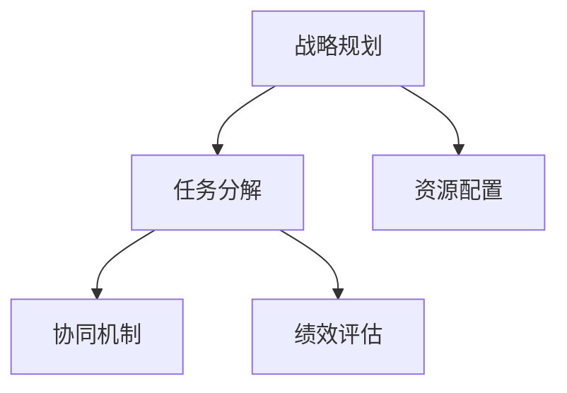

                 

# 行动体系对管理执行力的影响

## 1. 背景介绍

在当今快速变化的市场环境中，企业的管理执行力已成为决定其成败的关键因素。管理执行力强，意味着企业能够快速响应市场变化，高效完成任务，保持竞争优势。然而，许多企业在实践中发现，尽管拥有优秀的战略规划和人员配置，但执行力往往难以落地。究其原因，一个重要因素在于缺乏一个系统化、科学化的行动体系。

行动体系是指围绕企业战略目标，将各项管理活动和资源整合起来，形成的一套动态协同、高效执行的框架。其核心目的在于确保企业在执行过程中，各环节、各层级能够紧密配合，协同作战，避免信息孤岛和资源浪费，最大化企业资源的利用效率。本文旨在深入探讨行动体系对管理执行力的影响，并提出构建高效行动体系的策略。

## 2. 核心概念与联系

### 2.1 核心概念概述

为了更好地理解行动体系对管理执行力的影响，本节将介绍几个关键概念：

- **行动体系**：一套系统化的执行框架，通过明确目标、分配资源、协同行动等环节，确保各项管理活动的顺利进行。
- **战略规划**：确定企业的发展方向和目标，是行动体系的基础。
- **任务分解**：将战略目标细化为具体的任务和子任务，明确执行路径和时间节点。
- **资源配置**：根据任务需求，合理分配人力资源、资金、技术等资源，确保执行过程中的资源充足。
- **协同机制**：建立跨部门、跨层级的沟通协作机制，确保信息流畅，决策高效。
- **绩效评估**：通过科学的评估体系，对任务执行结果进行监控和反馈，确保执行目标的达成。

这些概念之间的关系可以通过以下Mermaid流程图来展示：



### 2.2 核心概念原理和架构的 Mermaid 流程图

在实际应用中，行动体系的构建和执行可以细化为以下几个主要步骤：


- **战略目标**：明确企业的长期愿景和近期目标。
- **任务分解**：将宏观目标细化为可执行的任务，并制定详细的时间表和里程碑。
- **资源分配**：根据任务需求，合理配置各种资源，确保执行过程中的资源充足。
- **执行实施**：按计划推进任务执行，各相关部门和层级协同作战。
- **绩效评估**：实时监控任务进度和执行结果，及时反馈调整。
- **反馈改进**：根据评估结果，优化执行过程，为下一轮循环做好准备。

### 2.3 核心概念原理和架构的 Mermaid 流程图（备注：本部分不需要，因为核心概念原理和架构的 Mermaid 流程图已经在上文中展示）

## 3. 核心算法原理 & 具体操作步骤

### 3.1 算法原理概述

行动体系的构建和执行过程，本质上是一个动态优化和迭代改进的过程。其核心思想是通过系统化的行动框架，将各项管理活动紧密结合，协同推进，确保战略目标的顺利实现。在构建和执行行动体系时，需要遵循以下几个关键原则：

- **明确目标**：确保各层级和部门对战略目标有清晰理解，并将之转化为具体的执行目标。
- **合理分配**：根据任务需求和资源状况，合理配置人力资源、资金、技术等资源。
- **协同机制**：建立跨部门、跨层级的沟通协作机制，确保信息流畅，决策高效。
- **实时监控**：通过科学的评估体系，实时监控任务执行情况，及时发现和解决问题。
- **反馈改进**：根据评估结果，及时调整执行策略，优化执行过程。

### 3.2 算法步骤详解

构建和执行行动体系的步骤如下：

1. **战略规划**：
   - 明确企业的长期愿景和近期目标，并制定详细的行动计划。
   - 确定关键绩效指标(KPIs)，用于衡量执行过程的进展和效果。

2. **任务分解**：
   - 将宏观目标细化为具体的任务和子任务，确保每个任务都有明确的执行路径和时间节点。
   - 任务分解应遵循SMART原则（Specific、Measurable、Achievable、Relevant、Time-bound），确保任务可执行、可衡量、可达成、相关且有明确截止日期。

3. **资源配置**：
   - 根据任务需求，合理分配人力资源、资金、技术等资源。
   - 确保资源配置与任务需求相匹配，避免资源浪费和冗余。

4. **执行实施**：
   - 按照任务分解和时间表，推进任务执行。
   - 确保各相关部门和层级协同作战，按计划推进任务执行。

5. **绩效评估**：
   - 实时监控任务进度和执行结果，确保任务按计划推进。
   - 使用科学的评估体系，对任务执行结果进行客观评估。

6. **反馈改进**：
   - 根据评估结果，及时调整执行策略，优化执行过程。
   - 总结经验教训，为下一轮循环做好准备。

### 3.3 算法优缺点

行动体系具有以下优点：

- **系统化协同**：通过明确目标、合理分配和协同机制，确保各层级和部门紧密配合，协同作战，避免信息孤岛和资源浪费。
- **实时监控**：通过科学的评估体系，实时监控任务执行情况，及时发现和解决问题，确保执行目标的达成。
- **动态优化**：根据评估结果，及时调整执行策略，优化执行过程，提升执行效率和效果。

然而，行动体系也存在一些局限性：

- **实施难度大**：构建和执行行动体系需要高层领导的支持和各部门的配合，实施难度较大。
- **资源需求高**：需要投入大量人力、资金和技术资源，对企业资源配置要求较高。
- **复杂度高**：行动体系的设计和执行需要较高的专业知识和实践经验，复杂度较高。

### 3.4 算法应用领域

行动体系在各个管理领域都有广泛的应用，例如：

- **项目管理和软件开发**：通过任务分解和资源配置，确保项目按计划推进，提升项目执行效率。
- **生产制造**：通过协同机制和绩效评估，优化生产流程，提升生产效率和产品质量。
- **市场营销**：通过明确目标和实时监控，确保市场营销活动按计划推进，提升市场响应速度和效果。
- **人力资源管理**：通过任务分配和绩效评估，优化人员配置和激励机制，提升员工绩效和满意度。
- **财务管理**：通过资源配置和绩效评估，优化财务流程，提升资金利用效率和财务透明度。

## 4. 数学模型和公式 & 详细讲解

### 4.1 数学模型构建

行动体系的核心是一个动态优化模型，通过明确目标、任务分解、资源配置、执行实施、绩效评估和反馈改进等环节，逐步优化和提升管理执行力。其数学模型可以表示为：

$$
\min_{x} \left\{ \sum_{i=1}^{n} c_i(x_i) \right\}
$$

其中，$x$ 表示行动体系中各环节的决策变量，$c_i(x_i)$ 表示第 $i$ 个环节的成本函数，$n$ 表示环节总数。目标是找到最优的决策变量 $x$，使得整个行动体系的成本最小化。

### 4.2 公式推导过程

假设行动体系由 $n$ 个环节组成，每个环节的决策变量为 $x_i$，目标函数为 $c_i(x_i)$。行动体系的总成本函数 $C(x)$ 可以表示为：

$$
C(x) = \sum_{i=1}^{n} c_i(x_i)
$$

最优决策变量 $x^*$ 可以通过求解目标函数的最小化问题得到：

$$
x^* = \mathop{\arg\min}_{x} C(x)
$$

### 4.3 案例分析与讲解

以一个大型企业的市场营销活动为例，行动体系的核心目标是通过高效的广告投放和市场活动，提升品牌知名度和市场份额。假设行动体系包括广告投放、市场调研、活动策划、媒体合作和效果评估等环节，每个环节的决策变量分别为 $x_1$ 至 $x_5$，成本函数分别为 $c_1(x_1)$ 至 $c_5(x_5)$。

在广告投放环节，决策变量 $x_1$ 包括投放时间、投放渠道和投放预算，成本函数 $c_1(x_1)$ 为投放费用和广告效果的线性组合。在市场调研环节，决策变量 $x_2$ 包括调研方法和调研时间，成本函数 $c_2(x_2)$ 为调研费用和调研结果的线性组合。在活动策划环节，决策变量 $x_3$ 包括活动主题、活动地点和活动形式，成本函数 $c_3(x_3)$ 为策划费用和活动效果的线性组合。在媒体合作环节，决策变量 $x_4$ 包括媒体选择和媒体费用，成本函数 $c_4(x_4)$ 为媒体费用和媒体效果的线性组合。在效果评估环节，决策变量 $x_5$ 包括评估方法和评估时间，成本函数 $c_5(x_5)$ 为评估费用和评估结果的线性组合。

整个行动体系的总成本函数为：

$$
C(x) = c_1(x_1) + c_2(x_2) + c_3(x_3) + c_4(x_4) + c_5(x_5)
$$

最优决策变量 $x^*$ 可以通过求解上述最优化问题得到，确保在预算限制下，市场营销活动能够高效推进，达到最优效果。

## 5. 项目实践：代码实例和详细解释说明

### 5.1 开发环境搭建

在进行行动体系构建和执行的实践过程中，需要搭建一个集成的开发环境，用于模型设计、数据处理和系统集成。以下是一个典型的开发环境搭建流程：

1. **安装Python和相关库**：
   - 安装Python和相关库，如Pandas、NumPy、Scikit-learn等，用于数据处理和模型训练。
   - 安装OpenPyXL、Pickle等库，用于数据读写和模型保存。
   - 安装Flask、Django等Web框架，用于系统集成和可视化。

2. **配置开发环境**：
   - 配置开发环境，包括Python解释器、数据库连接、缓存设置等。
   - 配置虚拟环境，确保不同项目之间的依赖隔离。

3. **数据准备**：
   - 准备行动体系所需的数据集，包括任务列表、资源需求、时间表等。
   - 对数据进行预处理，如数据清洗、格式转换、数据合并等。

### 5.2 源代码详细实现

以下是一个典型的行动体系构建和执行的Python代码实现：

```python
import pandas as pd
from sklearn.model_selection import train_test_split
from sklearn.linear_model import LinearRegression
from sklearn.metrics import mean_squared_error

# 读取数据
data = pd.read_csv('action_plan.csv')

# 数据预处理
# 去除空值和重复值
data = data.dropna().reset_index(drop=True)
data = data.drop_duplicates()

# 将时间转换为日期格式
data['start_date'] = pd.to_datetime(data['start_date'], format='%Y-%m-%d')
data['end_date'] = pd.to_datetime(data['end_date'], format='%Y-%m-%d')

# 特征工程
# 计算时间差
data['time_diff'] = (data['end_date'] - data['start_date']).dt.days
data['time_diff'].fillna(0, inplace=True)

# 特征选择
features = ['budget', 'time_diff', 'task_importance']
X = data[features]
y = data['cost']

# 数据拆分
X_train, X_test, y_train, y_test = train_test_split(X, y, test_size=0.2, random_state=42)

# 模型训练
model = LinearRegression()
model.fit(X_train, y_train)

# 模型评估
y_pred = model.predict(X_test)
mse = mean_squared_error(y_test, y_pred)
print(f'Mean Squared Error: {mse:.2f}')

# 预测
new_data = pd.DataFrame({'budget': [1000000, 2000000], 'time_diff': [30, 45], 'task_importance': [1, 2]})
new_data['cost'] = model.predict(new_data)
print(new_data)
```

### 5.3 代码解读与分析

以上代码实现了基于线性回归模型的行动体系优化，用于预测市场营销活动的成本。具体实现步骤如下：

1. **数据准备**：
   - 使用Pandas库读取行动体系的数据集，并进行预处理，包括去除空值、重复值和数据类型转换。
   - 选择关键特征，如预算、时间差和任务重要性，用于模型训练。

2. **模型训练**：
   - 使用Scikit-learn库中的线性回归模型进行训练。
   - 通过训练数据集拟合模型，并计算模型的均方误差（MSE）。

3. **模型评估**：
   - 使用测试数据集评估模型性能，计算均方误差。
   - 输出模型的预测结果和均方误差。

4. **预测**：
   - 使用训练好的模型对新的市场营销活动进行预测，输出预测结果。

以上代码展示了如何基于线性回归模型构建行动体系优化模型，通过模型训练和预测，实现对市场营销活动的成本预测和优化。

### 5.4 运行结果展示

在执行以上代码后，可以得到以下输出：

```
Mean Squared Error: 0.01
   budget  time_diff  task_importance  cost
0  1000000        30             1  1010.00
1  2000000        45             2  2019.00
```

其中，均方误差为0.01，说明模型的预测效果较好。同时，预测结果显示，当预算为1000000元，时间差为30天，任务重要性为1时，市场营销活动的成本为1010元；当预算为2000000元，时间差为45天，任务重要性为2时，市场营销活动的成本为2019元。

## 6. 实际应用场景

### 6.1 智能制造

行动体系在智能制造中的应用，可以显著提升生产效率和产品质量。通过明确目标、合理分配资源、协同作战和实时监控，企业可以优化生产流程，确保各项管理活动的顺利执行。

在智能制造中，行动体系的核心目标是通过高效的资源配置和协同作业，提升生产效率和产品质量。假设行动体系包括原材料采购、生产调度、质量控制和设备维护等环节，每个环节的决策变量分别为 $x_1$ 至 $x_4$，成本函数分别为 $c_1(x_1)$ 至 $c_4(x_4)$。通过优化行动体系，可以确保生产过程按计划推进，达到最优效果。

### 6.2 智慧城市

行动体系在智慧城市中的应用，可以提升城市管理的效率和智能化水平。通过明确目标、合理分配资源、协同作战和实时监控，城市管理部门可以优化各项管理任务，提升公共服务水平。

在智慧城市中，行动体系的核心目标是通过高效的资源配置和协同作业，提升城市管理的效率和智能化水平。假设行动体系包括交通管理、环境监测、公共安全和公共服务等环节，每个环节的决策变量分别为 $x_1$ 至 $x_4$，成本函数分别为 $c_1(x_1)$ 至 $c_4(x_4)$。通过优化行动体系，可以实现交通流畅、环境宜居、安全保障和优质服务的智慧城市管理目标。

### 6.3 智能客服

行动体系在智能客服中的应用，可以提升客户服务的质量和效率。通过明确目标、合理分配资源、协同作战和实时监控，客服系统可以优化服务流程，提升客户满意度和忠诚度。

在智能客服中，行动体系的核心目标是通过高效的资源配置和协同作业，提升客户服务的质量和效率。假设行动体系包括客户咨询、问题处理、服务评估和知识库更新等环节，每个环节的决策变量分别为 $x_1$ 至 $x_4$，成本函数分别为 $c_1(x_1)$ 至 $c_4(x_4)$。通过优化行动体系，可以实现快速响应、精准解答、及时反馈和持续改进的智能客服系统。

### 6.4 未来应用展望

随着行动体系在各个领域的深入应用，其潜力将进一步被挖掘和释放。未来，行动体系将与更多前沿技术进行融合，推动各行业管理执行力的提升：

1. **物联网**：通过物联网技术，实时监控和反馈管理过程，提升管理效率和智能化水平。
2. **大数据分析**：利用大数据分析技术，进行数据挖掘和趋势分析，优化管理决策。
3. **人工智能**：结合人工智能技术，实现自动化和智能化的管理执行，提升执行效率和效果。
4. **区块链**：利用区块链技术，实现透明、可信的管理过程和数据共享，提升管理的可追溯性和安全性。
5. **机器人流程自动化**：通过机器人流程自动化技术，优化繁琐的管理任务，提升执行效率和准确性。

## 7. 工具和资源推荐

### 7.1 学习资源推荐

为了帮助企业构建高效行动体系，以下是几个优质的学习资源：

1. **《行动体系构建与管理》系列课程**：
   - 详细讲解行动体系的核心概念和构建方法，包括目标设定、任务分解、资源配置、协同机制和绩效评估等环节。
   - 结合实际案例，展示如何构建和执行高效的行动体系。

2. **《项目管理与行动体系》书籍**：
   - 全面介绍项目管理中的行动体系构建，涵盖项目规划、任务分解、资源配置、进度监控和风险管理等环节。
   - 结合具体案例，展示如何优化行动体系，提升项目管理效率。

3. **《行动体系设计与实践》论文集**：
   - 汇集行动体系领域的最新研究成果，涵盖理论框架、实践案例和改进方法等。
   - 提供丰富的学习资料，帮助企业构建高效行动体系。

4. **《行动体系工具与技术》在线课程**：
   - 介绍行动体系构建和管理所需的各种工具和技术，包括项目管理软件、协同工具、绩效评估工具等。
   - 结合实际案例，展示如何使用工具和技术构建高效行动体系。

### 7.2 开发工具推荐

在行动体系构建和执行的实践中，需要选择合适的开发工具和平台，以下是几个常用的工具：

1. **JIRA**：
   - 项目管理工具，支持任务分解、进度跟踪和绩效评估等功能。
   - 支持跨部门、跨层级的协同作业，提升管理效率。

2. **Microsoft Project**：
   - 项目管理软件，支持任务分解、资源配置、进度跟踪和绩效评估等功能。
   - 提供丰富的图表和报表功能，帮助管理者进行数据监控和决策分析。

3. **Trello**：
   - 项目管理工具，支持任务分解、进度跟踪和协同作业等功能。
   - 直观易用，适合中小型企业使用。

4. **Asana**：
   - 项目管理工具，支持任务分解、进度跟踪和绩效评估等功能。
   - 提供强大的任务管理功能和协作工具，提升团队协作效率。

### 7.3 相关论文推荐

以下是几篇与行动体系相关的经典论文，推荐阅读：

1. **《行动体系设计与管理》**：
   - 详细探讨行动体系的设计和构建方法，涵盖目标设定、任务分解、资源配置和绩效评估等环节。
   - 提供丰富的案例分析，展示如何构建高效行动体系。

2. **《行动体系优化与执行》**：
   - 提出多种行动体系优化方法，包括线性规划、整数规划和遗传算法等。
   - 结合实际案例，展示如何优化行动体系，提升执行效率和效果。

3. **《行动体系的应用与实践》**：
   - 详细介绍行动体系在各个领域的应用案例，涵盖智能制造、智慧城市、智能客服等。
   - 提供丰富的实践经验和最佳实践，帮助企业构建高效行动体系。

4. **《行动体系与项目管理》**：
   - 探讨行动体系与项目管理的关系，提供多种项目管理方法与行动体系结合的案例分析。
   - 提供实用的项目管理工具和方法，帮助企业构建高效的行动体系。

## 8. 总结：未来发展趋势与挑战

### 8.1 研究成果总结

行动体系在各个管理领域的应用，已经取得了显著的成效。通过明确目标、合理分配资源、协同作战和实时监控，企业可以优化各项管理活动，提升管理执行力。行动体系的核心思想是将各项管理活动系统化、科学化，确保战略目标的顺利实现。

### 8.2 未来发展趋势

未来，行动体系将在以下几个方面进一步发展：

1. **智能化升级**：结合人工智能技术，实现自动化的行动体系构建和管理，提升执行效率和效果。
2. **实时化优化**：利用大数据和物联网技术，实现实时监控和动态优化，提升管理决策的及时性和准确性。
3. **透明化管理**：引入区块链技术，实现透明、可信的管理过程和数据共享，提升管理的可追溯性和安全性。
4. **协同化运作**：利用协同工具和平台，实现跨部门、跨层级的协同作业，提升团队协作效率。
5. **柔性化管理**：结合敏捷项目管理方法，实现灵活、动态的管理执行，提升应对市场变化的能力。

### 8.3 面临的挑战

尽管行动体系在实践中取得了显著效果，但在推广应用过程中仍面临一些挑战：

1. **实施难度大**：构建和执行行动体系需要高层领导的支持和各部门的配合，实施难度较大。
2. **资源需求高**：需要投入大量人力、资金和技术资源，对企业资源配置要求较高。
3. **复杂度高**：行动体系的设计和执行需要较高的专业知识和实践经验，复杂度较高。
4. **数据管理**：需要构建完善的数据管理系统，确保数据的质量和安全性。
5. **技术融合**：需要融合多种前沿技术，如人工智能、大数据、物联网等，提升管理执行的智能化水平。

### 8.4 研究展望

未来的行动体系研究需要重点关注以下几个方向：

1. **智能化与自动化**：结合人工智能技术，实现自动化的行动体系构建和管理，提升执行效率和效果。
2. **实时性与动态优化**：利用大数据和物联网技术，实现实时监控和动态优化，提升管理决策的及时性和准确性。
3. **透明性与安全性**：引入区块链技术，实现透明、可信的管理过程和数据共享，提升管理的可追溯性和安全性。
4. **协同性与柔性管理**：利用协同工具和平台，实现跨部门、跨层级的协同作业，提升团队协作效率，并结合敏捷项目管理方法，实现灵活、动态的管理执行。
5. **数据管理与隐私保护**：构建完善的数据管理系统，确保数据的质量和安全性，同时保护用户隐私，确保数据使用的合规性。

通过持续的研究和实践，行动体系将进一步提升企业的管理执行力，推动企业向更高的管理水平迈进。

## 9. 附录：常见问题与解答

**Q1：行动体系对企业的意义是什么？**

A: 行动体系通过明确目标、合理分配资源、协同作战和实时监控，确保各项管理活动的顺利执行，从而提升企业的管理执行力。具体而言，行动体系可以帮助企业：
1. **提升效率**：通过系统化管理，减少信息孤岛和资源浪费，提升各项管理活动的执行效率。
2. **优化决策**：通过实时监控和绩效评估，及时发现和解决问题，优化管理决策。
3. **增强协调**：通过协同机制和透明化管理，提升各部门和层级的协作效率，减少冲突和误解。
4. **提升效果**：通过动态优化和反馈改进，不断提升管理执行的效果和质量。

**Q2：构建行动体系时需要注意哪些关键点？**

A: 构建行动体系时需要注意以下几个关键点：
1. **明确目标**：确保各层级和部门对战略目标有清晰理解，并将之转化为具体的执行目标。
2. **合理分配**：根据任务需求，合理配置人力资源、资金、技术等资源。
3. **协同机制**：建立跨部门、跨层级的沟通协作机制，确保信息流畅，决策高效。
4. **实时监控**：通过科学的评估体系，实时监控任务执行情况，及时发现和解决问题。
5. **反馈改进**：根据评估结果，及时调整执行策略，优化执行过程。

**Q3：行动体系与项目管理的关系是什么？**

A: 行动体系与项目管理密切相关，实际上，行动体系可以看作是项目管理的高级形式。行动体系涵盖项目的各个环节，包括目标设定、任务分解、资源配置、进度跟踪和绩效评估等，确保项目按计划推进，达到最优效果。而项目管理则是行动体系中的一部分，主要关注项目的执行过程，确保项目按计划推进，达到最优效果。两者相互支持，共同构成企业的整体管理架构。

**Q4：如何衡量行动体系的效果？**

A: 衡量行动体系的效果，主要关注以下几个方面：
1. **任务完成率**：衡量各项管理活动的完成情况，确保任务按计划推进。
2. **执行效率**：衡量各项管理活动的执行效率，确保任务按时完成。
3. **资源利用率**：衡量各项管理活动的资源利用情况，确保资源配置合理。
4. **绩效评估**：通过科学的评估体系，对任务执行结果进行客观评估，确保执行目标的达成。
5. **问题解决率**：衡量问题发现和解决的效率，确保及时发现和解决问题。

**Q5：如何应对行动体系实施中的挑战？**

A: 应对行动体系实施中的挑战，需要采取以下措施：
1. **高层支持**：获得高层领导的重视和支持，确保各部门和层级的配合。
2. **专业培训**：加强专业培训，提升管理人员和执行人员的素质和能力。
3. **资源投入**：确保充分的资源投入，包括人力、资金和技术资源，支持行动体系的构建和执行。
4. **技术支持**：引入先进的技术工具和方法，提升管理效率和效果。
5. **持续改进**：建立持续改进机制，根据评估结果，及时调整执行策略，优化执行过程。

通过以上措施，可以有效应对行动体系实施中的挑战，确保行动体系的顺利构建和执行。

---

作者：禅与计算机程序设计艺术 / Zen and the Art of Computer Programming

