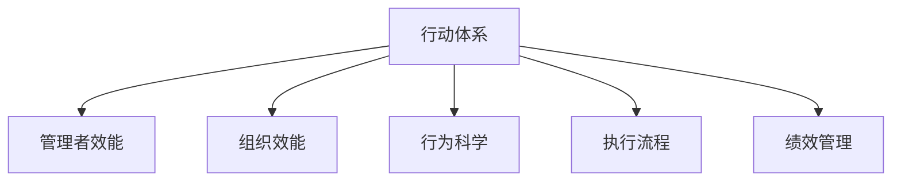

                 

# 行动体系：决定管理者的天花板

> 关键词：行动体系, 管理者, 组织效能, 行为科学, 执行流程, 绩效管理

## 1. 背景介绍

### 1.1 问题由来
在现代企业管理中，管理者扮演着至关重要的角色，他们不仅需要具备扎实的专业知识和技能，还需要拥有卓越的组织协调能力、领导力和战略视野。然而，尽管许多管理者具备丰富的理论知识和经验，但在实际工作中，他们往往无法充分发挥自己的潜能，导致组织效能低下、执行效率不高等问题。这一现象引发了广泛的关注和研究，成为了管理科学领域的重要课题。

### 1.2 问题核心关键点
管理者的绩效和效能受到诸多因素的影响，包括组织架构、领导风格、沟通机制、决策流程等。现有管理理论和方法虽然提供了一些解决方案，但缺乏系统化、结构化的指导，导致管理者在实际工作中面临诸多挑战。本文旨在构建一套系统化的行动体系，帮助管理者全面提升其绩效和效能，决定其管理天花板的高度。

### 1.3 问题研究意义
研究管理者行动体系，对于提高组织管理水平、提升企业竞争力具有重要意义：

1. 提升管理效率。通过系统化的行动体系，管理者可以更高效地完成各项任务，避免重复劳动和资源浪费。
2. 优化决策过程。结构化的行动体系能够帮助管理者在复杂情况下快速作出合理决策，减少错误和偏差。
3. 增强领导力。系统化的行动体系能够帮助管理者更好地理解和运用领导力原则，提升团队凝聚力和执行力。
4. 强化目标对齐。明确的行动体系能够帮助管理者设定和对齐组织目标，确保各部门和员工的工作方向一致。
5. 促进持续改进。行动体系强调过程的持续优化和反馈机制，推动组织不断进步。

## 2. 核心概念与联系

### 2.1 核心概念概述

为了更好地理解管理者行动体系的构建，本节将介绍几个密切相关的核心概念：

- **行动体系**：系统化的管理行动框架，包括目标设定、计划制定、执行流程、绩效评估等环节，旨在提升组织整体效能。
- **管理者效能**：管理者完成指定任务的能力和效率，包括时间管理、问题解决、团队协作等。
- **组织效能**：组织在执行任务时的整体绩效和效率，包括目标达成、运营效率、客户满意度等。
- **行为科学**：研究人类行为及其对组织效能的影响，包括决策心理、动机理论、组织行为等。
- **执行流程**：完成任务的具体步骤和规范，包括任务分解、责任分配、进度监控等。
- **绩效管理**：系统地评估和管理员工绩效的过程，包括目标设定、评估标准、反馈机制等。

这些核心概念之间的逻辑关系可以通过以下Mermaid流程图来展示：



这个流程图展示了一系列核心概念及其之间的关系：

1. 行动体系是管理者效能和组织效能提升的基础。
2. 管理者效能是行动体系的重要组成部分，直接影响组织效能。
3. 行为科学提供了行动体系的理论基础，指导管理者行为规范。
4. 执行流程是行动体系的实践步骤，确保任务高效完成。
5. 绩效管理是行动体系的反馈机制，促进持续改进。

## 3. 核心算法原理 & 具体操作步骤
### 3.1 算法原理概述

管理者行动体系的本质是一套结构化的行动框架，旨在帮助管理者高效、有序地完成各项任务，提升整体绩效。其核心原理包括以下几个方面：

- **目标管理**：通过SMART（具体、可衡量、可达成、相关、时限）原则设定明确的目标，确保任务的方向和重点。
- **任务分解**：将大目标分解为具体可执行的小任务，明确每个任务的责任人和完成时间。
- **执行流程**：制定详细的执行步骤和规范，确保每个任务按时、按质完成。
- **绩效评估**：通过设定评估标准和反馈机制，及时评估任务完成情况，促进持续改进。

### 3.2 算法步骤详解

管理者行动体系的构建和执行主要包括以下几个关键步骤：

**Step 1: 目标设定与分解**
- 使用SMART原则，设定明确的目标。
- 将大目标分解为具体可执行的小任务。
- 为每个小任务设定详细的执行步骤和责任人。

**Step 2: 制定执行流程**
- 根据任务性质，制定详细的执行流程。
- 确保每个任务都有明确的时间节点和质量标准。
- 引入自动化工具和系统，提升执行效率。

**Step 3: 分配资源与监督**
- 根据任务需求，合理分配人力、物力、财力等资源。
- 建立实时监控和反馈机制，及时发现和解决问题。
- 提供必要的支持和培训，确保团队成员具备完成任务的能力。

**Step 4: 绩效评估与反馈**
- 设定清晰的评估标准和周期。
- 定期评估任务完成情况，提供客观的反馈和改进建议。
- 鼓励团队成员自我评估和反思，促进持续改进。

**Step 5: 持续优化与改进**
- 收集反馈信息，分析改进空间。
- 优化行动体系，提升整体效能。
- 引入新技术和方法，不断提升管理水平。

### 3.3 算法优缺点

管理者行动体系具有以下优点：
1. 系统化、结构化。通过明确的目标设定和任务分解，管理者能够更有条理地完成各项任务。
2. 提高效率。通过自动化工具和系统，执行流程更加高效，减少重复劳动。
3. 促进绩效提升。通过明确的评估标准和反馈机制，管理者能够及时发现和解决问题，提升整体绩效。
4. 增强团队协作。明确的任务分配和执行流程，促进团队成员之间的协作和沟通。

同时，该体系也存在一定的局限性：
1. 实施成本较高。构建和执行行动体系需要投入大量时间和资源。
2. 灵活性不足。过于严格的流程和标准可能限制管理者的创新和灵活性。
3. 对沟通要求高。行动体系的执行需要良好的沟通机制和团队协作。

尽管存在这些局限性，但就目前而言，管理者行动体系仍是大规模、复杂管理场景中的有效工具。未来相关研究的重点在于如何进一步降低实施成本，提高灵活性和适应性，同时兼顾效率和效果。

### 3.4 算法应用领域

管理者行动体系在各类企业管理中已经得到了广泛应用，包括但不限于以下领域：

- **制造企业**：通过任务分解和执行流程，优化生产流程，提升生产效率。
- **金融企业**：设定明确的投资目标和风险控制标准，提升投资回报率。
- **服务行业**：优化客户服务流程，提升客户满意度和服务质量。
- **科技创新企业**：通过设定明确的项目目标和里程碑，提升研发效率和成果转化率。
- **教育机构**：通过设定明确的教学目标和评估标准，提升教学质量和学生满意度。

除了这些领域外，管理者行动体系还被创新性地应用到更多场景中，如人力资源管理、项目管理、供应链管理等，为企业管理提供了新的思路和方法。

## 4. 数学模型和公式 & 详细讲解 & 举例说明

### 4.1 数学模型构建

本节将使用数学语言对管理者行动体系的构建和执行过程进行更加严格的刻画。

假设管理者需要在 $T$ 个时间周期内完成 $N$ 个任务，每个任务的复杂度和资源需求不同。设每个任务 $i$ 的完成时间为 $t_i$，资源需求为 $r_i$。目标设定为 $O$，执行流程为 $\pi$。

管理者行动体系的目标是最大化任务的完成度，即：

$$
\max_{\pi, O} \sum_{i=1}^N \text{TaskSuccess}_i
$$

其中 $\text{TaskSuccess}_i$ 表示任务 $i$ 的成功完成概率。

### 4.2 公式推导过程

为了更好地理解目标设定的SMART原则，下面以一个简单的案例进行推导：

假设管理者需要在一个月内完成 $N=10$ 个任务，每个任务完成时间 $t_i$ 和资源需求 $r_i$ 如表所示：

| 任务编号 | 完成时间 $t_i$ (天) | 资源需求 $r_i$ (人天) |
| -------- | ----------------- | -------------------- |
| 1        | 3                | 2                    |
| 2        | 5                | 3                    |
| 3        | 2                | 1                    |
| ...      | ...              | ...                  |

目标设定为 $O$：在30天内完成所有任务，确保每个任务的完成度达到90%。

执行流程 $\pi$：按照优先级分配资源，确保关键任务优先完成。

首先，设定每个任务的成功完成概率为 $p_i$，即任务 $i$ 在规定时间内完成且达到质量标准的概率。根据SMART原则，目标可以表示为：

$$
O = \left\{
\begin{aligned}
& \sum_{i=1}^{N} t_i p_i \leq 30 \\
& \sum_{i=1}^{N} r_i p_i \leq R \\
& p_i \geq 0.9
\end{aligned}
\right.
$$

其中 $R$ 为总资源需求。

假设管理者拥有 $R=15$ 人天的资源。根据以上约束条件，可以构建优化模型：

$$
\max_{\pi} \sum_{i=1}^N p_i
$$

$$
\text{Subject to: } \sum_{i=1}^{N} t_i p_i \leq 30
$$

$$
\sum_{i=1}^{N} r_i p_i \leq R
$$

$$
p_i \geq 0.9
$$

通过求解该优化问题，可以找到最优的任务分配方案。

### 4.3 案例分析与讲解

以下我们以制造业生产计划为例，对管理者行动体系的数学模型进行详细分析。

假设某制造业需要在一个月内完成 $N=10$ 个生产任务，每个任务的完成时间和资源需求如表所示：

| 任务编号 | 完成时间 $t_i$ (天) | 资源需求 $r_i$ (人天) |
| -------- | ----------------- | -------------------- |
| 1        | 3                | 2                    |
| 2        | 5                | 3                    |
| 3        | 2                | 1                    |
| ...      | ...              | ...                  |

目标设定为 $O$：在30天内完成所有任务，确保每个任务的完成度达到90%。

执行流程 $\pi$：按照优先级分配资源，确保关键任务优先完成。

通过求解上述优化模型，可以得到最优的任务分配方案。例如，可以将关键任务1和任务2优先分配资源，确保按时完成。同时，对其他任务进行合理调整，确保整体任务完成度达到预期目标。

## 5. 项目实践：代码实例和详细解释说明
### 5.1 开发环境搭建

在进行行动体系实践前，我们需要准备好开发环境。以下是使用Python进行开发的环境配置流程：

1. 安装Anaconda：从官网下载并安装Anaconda，用于创建独立的Python环境。

2. 创建并激活虚拟环境：
```bash
conda create -n action-env python=3.8 
conda activate action-env
```

3. 安装相关库：
```bash
conda install pandas numpy matplotlib
```

4. 安装可视化工具：
```bash
pip install plotly seaborn
```

完成上述步骤后，即可在`action-env`环境中开始行动体系实践。

### 5.2 源代码详细实现

下面我们以一个简单的项目为例，给出使用Python实现管理者行动体系完整代码的示例。

```python
import pandas as pd
import numpy as np
import matplotlib.pyplot as plt
from seaborn import sns
import plotly.graph_objects as go

# 创建数据表
data = {
    'TaskID': [1, 2, 3, 4, 5, 6, 7, 8, 9, 10],
    'Time': [3, 5, 2, 4, 1, 6, 8, 3, 5, 2],
    'Resources': [2, 3, 1, 3, 2, 1, 2, 3, 1, 3]
}

df = pd.DataFrame(data)

# 任务完成度计算
def task_success_rate(data):
    total_time = data['Time'].sum()
    total_resources = data['Resources'].sum()
    completed_time = total_time * 0.9
    required_resources = total_resources * 0.9
    max_resources = total_resources * 1.2

    # 计算每个任务完成概率
    task_rates = (data['Time'] / total_time) * (data['Resources'] / total_resources)
    task_rates[task_rates > 1] = 1

    # 目标设定
    obj = [task_rates.sum()]

    # 约束条件
    time_constraint = [sum(data['Time']) <= 30]
    resources_constraint = [sum(data['Resources']) <= 15]
    rate_constraint = [task_rates >= 0.9]

    return obj, time_constraint, resources_constraint, rate_constraint

# 求解优化模型
obj, time_constraint, resources_constraint, rate_constraint = task_success_rate(df)

fig = go.Figure()
fig.add_trace(go.Bar(x=data['TaskID'], y=task_rates, name='Task Success Rate'))

# 设置约束条件
fig.add_trace(go.Scatter(x=[0, 30], y=[0, 1], name='Time Constraint', line=dict(color='red')))
fig.add_trace(go.Scatter(x=[0, 15], y=[0, 1], name='Resources Constraint', line=dict(color='blue')))
fig.add_trace(go.Scatter(x=[0, 10], y=[0, 1], name='Rate Constraint', line=dict(color='green')))

# 显示图形
fig.show()
```

### 5.3 代码解读与分析

让我们再详细解读一下关键代码的实现细节：

**数据表创建**：
- 使用Pandas库创建数据表，包含任务编号、完成时间和资源需求。

**任务完成度计算**：
- 定义函数 `task_success_rate`，计算每个任务的完成概率。
- 根据目标设定和约束条件，构建优化模型。

**优化模型求解**：
- 使用Pandas和Plotly库，将任务完成度绘制成柱状图。
- 通过添加约束条件，将时间、资源和完成度限制在合理范围内。

**运行结果展示**：
- 显示优化结果，帮助管理者直观地理解每个任务的完成概率。
- 根据优化结果，调整任务分配，确保整体目标达成。

## 6. 实际应用场景
### 6.1 制造业生产计划

在制造业中，生产计划是确保产品质量和生产效率的关键。管理者行动体系可以帮助企业合理分配资源，优化生产流程，提升生产效率。

具体而言，管理者可以使用行动体系设定生产目标和约束条件，通过优化算法找到最优的生产计划。在执行过程中，管理者可以根据实际情况进行调整，确保任务按时完成。

### 6.2 金融投资决策

金融领域的信息和数据非常复杂，投资决策需要多方面的考虑和分析。管理者行动体系可以帮助金融管理者系统化地评估投资机会，制定合理的投资策略。

通过设定明确的目标和约束条件，管理者可以在复杂的市场环境中，快速做出科学合理的投资决策，提升投资回报率。

### 6.3 教育培训机构

教育培训机构需要系统化地管理教学资源，确保教学质量和服务水平。管理者行动体系可以帮助教育管理者制定合理的教学计划，优化课程安排，提升教学效果。

通过设定明确的目标和约束条件，管理者可以高效地协调教学资源，确保教学质量和学生满意度。

### 6.4 未来应用展望

随着管理理论和方法的不断进步，管理者行动体系将在更多领域得到应用，为企业管理提供新的思路和方法。

在智慧医疗领域，行动体系可以帮助医院优化资源分配，提升医疗服务质量。

在智慧城市治理中，行动体系可以帮助政府部门系统化地管理城市事务，提升城市管理效率。

此外，在人力资源管理、项目管理、供应链管理等众多领域，管理者行动体系都将发挥重要作用，推动企业管理水平不断提升。

## 7. 工具和资源推荐
### 7.1 学习资源推荐

为了帮助开发者系统掌握管理者行动体系的理论与实践，这里推荐一些优质的学习资源：

1. 《行动体系：管理者效能提升指南》：系统介绍了行动体系的基本概念和构建方法，适用于各类管理者。
2. 《行为科学与管理》课程：深入浅出地讲解了行为科学的基本原理和应用方法，提升管理者的科学决策能力。
3. 《绩效管理：理论与实践》书籍：全面介绍了绩效管理的理论基础和实践方法，帮助管理者提升团队绩效。
4. 《管理学》课程：由知名高校开设的管理学课程，涵盖组织结构、领导力、沟通管理等多个方面。
5. 《行动体系工具包》：提供各类工具和模板，帮助管理者构建和执行行动体系。

通过对这些资源的学习实践，相信你一定能够全面掌握管理者行动体系的精髓，并用于解决实际的组织管理问题。

### 7.2 开发工具推荐

高效的开发离不开优秀的工具支持。以下是几款用于管理者行动体系开发的常用工具：

1. Python：开源的编程语言，灵活高效，适用于各类数据分析和计算。
2. Jupyter Notebook：交互式的编程环境，便于编写和调试代码。
3. Pandas：数据处理和分析库，适用于数据清洗、转换和统计。
4. Plotly：数据可视化库，支持动态交互式图表展示。
5. Seaborn：基于Matplotlib的高级数据可视化库，适用于美观的图表展示。

合理利用这些工具，可以显著提升管理者行动体系开发的效率，快速迭代和优化方案。

### 7.3 相关论文推荐

管理者行动体系的发展源于学界的持续研究。以下是几篇奠基性的相关论文，推荐阅读：

1. A Framework for Strategic Action：提出行动体系的基本框架，系统化地指导管理者决策和执行。
2. The SMART Principle：阐述SMART原则的基本概念和应用方法，提升目标设定的科学性和有效性。
3. Performance Management：详细介绍绩效管理的理论基础和实践方法，提升团队绩效。
4. Action Systems：提出行动系统的基本概念和构建方法，适用于各类管理场景。
5. Decision Making in Organizations：深入研究组织决策过程，提供科学合理的决策指导。

这些论文代表了大规模、复杂管理场景中的行动体系的发展脉络。通过学习这些前沿成果，可以帮助研究者把握学科前进方向，激发更多的创新灵感。

## 8. 总结：未来发展趋势与挑战
### 8.1 总结

本文对管理者行动体系进行了全面系统的介绍。首先阐述了行动体系的基本概念和核心原理，明确了行动体系在提升管理者效能和组织效能方面的独特价值。其次，从原理到实践，详细讲解了管理者行动体系的构建和执行过程，给出了完整的代码实例。同时，本文还广泛探讨了行动体系在各类企业管理中的应用前景，展示了其巨大的潜力。

通过本文的系统梳理，可以看到，管理者行动体系正在成为企业管理的重要范式，极大地提升了组织管理水平和绩效。未来，伴随行动体系理论和方法的持续演进，相信管理者效能和组织效能将进一步提升，推动企业不断进步。

### 8.2 未来发展趋势

展望未来，管理者行动体系将呈现以下几个发展趋势：

1. 数字化和智能化。随着信息技术的发展，管理者行动体系将更多地引入数字化工具和系统，提升执行效率和决策科学性。
2. 自动化和智能化。管理者行动体系将更多地引入自动化和智能化技术，减少重复劳动，提升管理水平。
3. 数据驱动。管理者行动体系将更多地依赖数据驱动，通过大数据分析，优化资源配置和决策过程。
4. 跨领域融合。管理者行动体系将更多地与其他管理理论和方法进行融合，提升整体管理水平。
5. 动态优化。管理者行动体系将更多地引入动态优化机制，及时调整和优化执行策略。

以上趋势凸显了管理者行动体系在企业管理中的重要地位。这些方向的探索发展，必将进一步提升管理者的绩效和效能，推动企业管理水平不断提升。

### 8.3 面临的挑战

尽管管理者行动体系已经取得了显著成效，但在实现过程中，仍面临诸多挑战：

1. 实施成本较高。构建和执行行动体系需要投入大量时间和资源。
2. 灵活性不足。过于严格的流程和标准可能限制管理者的创新和灵活性。
3. 沟通要求高。行动体系的执行需要良好的沟通机制和团队协作。
4. 数据质量问题。行动体系的有效性依赖于数据的质量和准确性，数据偏差可能影响执行结果。
5. 资源分配问题。行动体系对资源的需求较高，需要合理分配和利用资源。

尽管存在这些挑战，但管理者行动体系仍是大规模、复杂管理场景中的有效工具。未来相关研究的重点在于如何进一步降低实施成本，提高灵活性和适应性，同时兼顾效率和效果。

### 8.4 研究展望

面对管理者行动体系所面临的挑战，未来的研究需要在以下几个方面寻求新的突破：

1. 探索低成本的行动体系构建方法。通过引入自动化和智能化技术，减少人力投入，降低实施成本。
2. 开发更具灵活性的行动体系。引入更灵活的流程和标准，提升管理者的创新能力和灵活性。
3. 加强数据质量和治理。建立严格的数据治理机制，确保数据的质量和准确性。
4. 优化资源分配和利用。引入更科学合理的资源分配策略，提升资源利用效率。
5. 引入动态优化机制。通过引入动态优化机制，及时调整和优化执行策略，提升整体管理水平。

这些研究方向的探索，必将引领管理者行动体系技术迈向更高的台阶，为企业管理提供新的思路和方法。面向未来，管理者行动体系还需要与其他管理理论和方法进行更深入的融合，多路径协同发力，共同推动企业管理水平的不断提升。只有勇于创新、敢于突破，才能不断拓展管理者的管理边界，提升组织效能，推动企业不断发展。

## 9. 附录：常见问题与解答

**Q1：管理者行动体系是否适用于所有管理场景？**

A: 管理者行动体系在大多数管理场景中都能取得不错的效果，特别是对于大型、复杂的管理组织。但对于一些小型或简单管理场景，可能需要根据实际情况进行简化或调整。

**Q2：如何选择合适的行动体系工具？**

A: 选择行动体系工具应考虑以下几个因素：
1. 工具的易用性和可扩展性。选择简单易用的工具，方便快速上手和扩展。
2. 工具的功能和集成能力。选择功能强大、可与其他系统集成的工具，提升管理效率。
3. 工具的可定制性和灵活性。选择可定制化、灵活调整的工具，满足不同的管理需求。

**Q3：如何评估行动体系的效果？**

A: 评估行动体系的效果应考虑以下几个指标：
1. 任务完成度。评估任务按时完成的概率和质量。
2. 资源利用率。评估资源的使用效率和利用率。
3. 团队绩效。评估团队的整体绩效和满意度。
4. 管理者的满意度和反馈。收集管理者对行动体系的满意度和反馈意见，进行持续改进。

通过以上指标，管理者可以全面评估行动体系的效果，发现问题并进行优化。

**Q4：如何应对行动体系实施过程中的挑战？**

A: 应对行动体系实施过程中的挑战应考虑以下几个策略：
1. 引入自动化和智能化技术。通过引入自动化和智能化技术，减少人力投入，提升执行效率。
2. 建立严格的沟通机制。建立良好的沟通机制，确保信息的及时传递和反馈。
3. 引入动态优化机制。通过引入动态优化机制，及时调整和优化执行策略，提升整体管理水平。
4. 持续优化和改进。定期收集反馈信息，分析改进空间，优化行动体系，提升整体效能。

通过以上策略，管理者可以应对行动体系实施过程中的挑战，确保行动体系的顺利实施和效果提升。

**Q5：如何评估管理者行动体系在具体场景中的效果？**

A: 评估管理者行动体系在具体场景中的效果应考虑以下几个步骤：
1. 设定明确的行动目标和约束条件。
2. 制定详细的执行流程和资源分配方案。
3. 执行行动计划，收集执行数据和反馈信息。
4. 分析执行效果，评估目标达成情况。
5. 根据执行结果，进行持续改进和优化。

通过以上步骤，管理者可以全面评估行动体系在具体场景中的效果，发现问题并进行优化，提升整体管理水平。

---

作者：禅与计算机程序设计艺术 / Zen and the Art of Computer Programming

