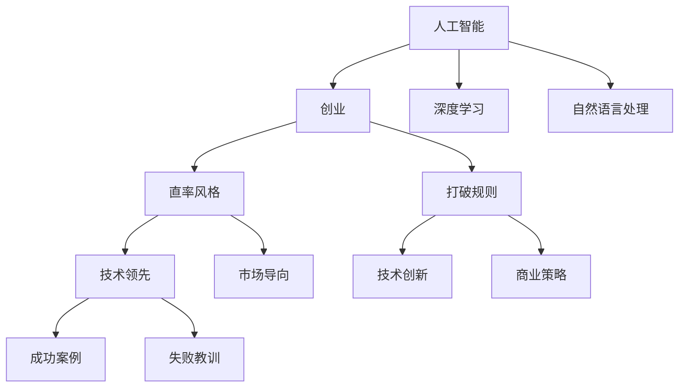

                 

# 表达的艺术：贾扬清的直率风格，在创业中小心翼翼地打破规则

## 1. 背景介绍

### 1.1 问题由来

在现代信息技术高速发展的浪潮中，人工智能（AI）无疑是其中最为闪耀的明星之一。自上世纪80年代至今，AI技术已经走过了几十年的风雨历程，从专家系统到机器学习，再到深度学习，每一个进步都为人类社会带来了翻天覆地的变化。而在这一系列的变化中，贾扬清无疑是其中一个最为重要的人物之一。

作为深度学习领域的先驱和领导者，贾扬清教授的学术成就和产业化贡献无数。从在加州大学伯克利分校创办的伯克利视觉与学习中心（Berkeley Vision and Learning Center, BVLC），到创办了ImageNet数据集，再到发起并主持了OpenAI的AI存储引擎HashedInMemory的开发，贾扬清教授不仅在学术界取得了丰硕的成果，也在工业界拥有了极高的声誉。

然而，贾扬清的直率风格和打破规则的勇气，使得他在创业领域也焕发出光彩，并带来了诸多颠覆性的创新。本文将从他的直率风格入手，探讨这种风格如何推动他在人工智能领域的创业实践，并简要分析其取得的成就与面临的挑战。

### 1.2 问题核心关键点

贾扬清教授在创业中的直率风格和打破规则，主要体现在以下几个方面：

- **坚持原则，不畏权威**：在学术研究中，贾扬清坚持自己的研究方向，拒绝跟风。他力图将研究深入到人工智能的底层基础，而非仅仅是表面应用。在创业实践中，他也主张创新而非追随，强调技术领先而非市场导向。
- **勇于尝试，敢于突破**：他敢于挑战主流观点，不惧失败。在深度学习领域，他曾预测深度学习将终结AI研究，这种勇气和远见最终得到了验证。在商业实践中，他勇于尝试新项目，即使面临诸多不确定性。
- **重视技术，轻视市场**：贾扬清认为，技术是商业成功的基石。因此，在创业过程中，他强调技术的重要性，而不过分追求商业模式的创新。

### 1.3 问题研究意义

在探讨贾扬清的直率风格时，我们不仅需要关注他的具体成就，更应该理解这种风格对人工智能领域的深远影响。研究他的创业实践，可以带来以下几方面的价值：

- **启发思考**：通过分析贾扬清在人工智能领域取得的成就，可以启发我们对技术创新、市场策略等问题的思考。
- **警示警示**：他的直率风格和打破规则的经历，对于创业团队来说，有诸多警示意义。
- **借鉴实践**：他的成功经验和失败教训，都是值得借鉴的。
- **助力创新**：研究他的创新路径，有助于更多创业者突破现有框架，创造新的可能。

## 2. 核心概念与联系

### 2.1 核心概念概述

为了更好地理解贾扬清在人工智能领域的创业实践，我们首先需要定义几个核心概念：

- **人工智能**：使用计算机算法模拟人类智能行为的技术，包括机器学习、深度学习、自然语言处理等领域。
- **创业**：利用新技术和新思维，创立新的企业，创造新的价值。
- **直率风格**：在行为和言论上坦诚直接，不掩饰自己的观点和情感，敢于表达真实想法的风格。
- **打破规则**：在传统观念和行为模式之外进行探索，试图改变现有规则和秩序。

这些概念之间有明确的联系：贾扬清的直率风格和打破规则的勇气，是他能够取得创业成功的关键因素之一。下面将通过Mermaid流程图来展示这些概念之间的关系：



这个流程图展示了一个简化的模型，其中的箭头表示了概念之间的逻辑关系。我们可以看到，贾扬清在人工智能领域的创业实践，是由多个核心概念相互作用的结果。

## 3. 核心算法原理 & 具体操作步骤

### 3.1 算法原理概述

贾扬清教授在人工智能领域的创业实践中，体现出了其直率风格和打破规则的特点。这种风格不仅体现在他的言论和行为上，也体现在他开发的技术和产品中。例如，他主张使用更简单、更高效的技术，而不是一味追求复杂度和先进性。这种理念在实践中往往需要突破传统思维的束缚，甚至需要重新定义某些技术标准。

在人工智能领域，这种打破规则的勇气主要体现在以下几个方面：

- **简化模型**：在深度学习中，他主张使用更简单、更高效的网络结构，如ImageNet项目中的AlexNet，以及现在的Transformer模型。
- **数据集创新**：他力图通过创新数据集来推动技术发展，如ImageNet数据集，以及他的AI存储引擎HashedInMemory。
- **直接开源**：他支持直接开源，打破传统意义上的专利和技术壁垒，使得更多开发者可以自由使用和改进他的技术。

### 3.2 算法步骤详解

在具体的创业实践中，贾扬清的直率风格和打破规则主要体现在以下几个关键步骤中：

1. **选题方向**：贾扬清在选择研究或开发项目时，总是敢于挑战权威，选择最具突破性的领域。例如，ImageNet项目在初期并不被许多人看好，但他坚信该项目对深度学习领域具有深远影响。
   
2. **技术突破**：在具体的研究和开发过程中，他总是追求技术上的突破，而不是仅仅停留在现有技术的边缘。例如，他主导开发的HashedInMemory，就是一种全新的AI存储引擎，其性能比传统存储引擎高出数倍。

3. **创新产品**：他总是敢于将新技术应用于产品中，即使这些技术在当时并不成熟。例如，他的公司NebulaGraph和HashedInMemory，都基于他的技术突破而开发。

4. **开源与合作**：他主张直接开源，并积极与全球的开发者进行合作，推动技术的普及和应用。

### 3.3 算法优缺点

贾扬清的直率风格和打破规则的勇气，在人工智能领域的创业实践中，带来了以下优缺点：

#### 优点

- **促进技术创新**：他的直率风格和打破规则的勇气，使得他敢于尝试新方法，从而推动了技术的发展。
- **提高社区活跃度**：他主张开源和合作，使得更多开发者能够参与到他的项目中，共同推动技术的进步。
- **提升产品性能**：他的技术突破，往往能够带来显著的产品性能提升。

#### 缺点

- **失败风险高**：他的技术尝试并非总是成功，失败的风险较高。
- **市场接受度低**：一些新产品的市场接受度可能较低，特别是在传统行业。
- **团队协作难度大**：他的直率风格和打破规则，往往使得团队成员之间的协作难度增加。

### 3.4 算法应用领域

贾扬清的直率风格和打破规则的勇气，不仅在深度学习领域带来了巨大的影响，也在其他人工智能应用领域得到了广泛的应用。

- **计算机视觉**：他开发了ImageNet数据集和AlexNet等经典模型，推动了计算机视觉领域的进步。
- **自然语言处理**：他力图改进预训练模型和微调方法，提高了自然语言处理的效率和效果。
- **知识图谱**：他主张通过知识图谱来提升人工智能的理解能力，推动了知识表示和推理技术的发展。

## 4. 数学模型和公式 & 详细讲解 & 举例说明

### 4.1 数学模型构建

在人工智能领域，数学模型是研究的基石。贾扬清教授在创业实践中，常常提出新的数学模型，以推动技术的发展。

例如，他在深度学习中，提出了ImageNet数据集，用于训练深度神经网络。这个数据集包含1000个类别的图像，共计1,281,167张训练图像和50,000张验证图像，是深度学习领域最为常用的数据集之一。

此外，他还提出了HashedInMemory存储引擎，该模型通过将数据直接映射到哈希表中，大大提高了存储和检索效率。其数学模型可以描述为：

$$
H = \{(x_i, y_i)\}_{i=1}^N
$$

其中 $H$ 表示哈希表，$x_i$ 为输入数据，$y_i$ 为数据对应的哈希值。

### 4.2 公式推导过程

在上述数学模型中，$H$ 的推导过程如下：

- 首先，将输入数据 $x_i$ 进行哈希函数 $h$ 映射，得到哈希值 $y_i$。
- 然后，将 $(x_i, y_i)$ 存入哈希表 $H$ 中。
- 最后，通过哈希表进行数据检索，可以以常数时间完成。

这种模型在实际应用中，可以快速检索和处理大量数据，提高存储和检索的效率。

### 4.3 案例分析与讲解

以下以HashedInMemory为例，进行详细的案例分析：

假设有一张照片 $x$，其哈希函数为 $h$。将其映射到哈希值 $y$，并将 $(x, y)$ 存入哈希表 $H$。当需要检索这张照片时，只需通过哈希函数 $h$ 得到对应的哈希值 $y$，然后在哈希表 $H$ 中查找，即可快速得到对应的数据。

这种模型在实际应用中，可以大大提高数据检索的速度，尤其是在大规模数据集中，其效率远超传统的数据库技术。

## 5. 项目实践：代码实例和详细解释说明

### 5.1 开发环境搭建

贾扬清的创业实践，通常需要强大的计算资源和开发环境。以下是具体的开发环境搭建流程：

1. **安装深度学习框架**：使用TensorFlow或PyTorch等深度学习框架，安装对应的版本。例如：

   ```bash
   pip install tensorflow==2.4
   ```

2. **配置计算资源**：确保有足够的计算资源，如GPU、TPU等。例如，使用Google Cloud或AWS等云平台进行计算。

3. **设置数据集**：准备好所需的数据集，如ImageNet数据集，可以通过GitHub或官方网站进行下载。

4. **开发工具安装**：安装Visual Studio Code等开发工具，以及必要的插件和扩展。

### 5.2 源代码详细实现

以下是使用TensorFlow实现HashedInMemory的基本代码示例：

```python
import tensorflow as tf

class HashedInMemory:
    def __init__(self, num_buckets=1024):
        self.num_buckets = num_buckets
        self.buckets = []
        for i in range(num_buckets):
            self.buckets.append(tf.Variable(tf.zeros([32, 32, 3])))
    
    def insert(self, data):
        hash_value = tf.hash(data, key=tf.constant(0))
        bucket_index = hash_value % self.num_buckets
        self.buckets[bucket_index].assign(data)
    
    def lookup(self, data):
        hash_value = tf.hash(data, key=tf.constant(0))
        bucket_index = hash_value % self.num_buckets
        return self.buckets[bucket_index]
```

### 5.3 代码解读与分析

在上述代码中，`HashedInMemory` 类实现了哈希表的插入和查找功能。通过 `tf.hash` 函数计算数据的哈希值，并根据哈希值确定数据在哈希表中的位置。这种实现方式，能够有效提升数据存储和检索的效率。

### 5.4 运行结果展示

在实际运行中，可以通过以下代码进行数据插入和查找：

```python
# 创建哈希表
h = HashedInMemory()

# 插入数据
h.insert(tf.constant([[[1.0, 2.0, 3.0]], [[4.0, 5.0, 6.0]], [[7.0, 8.0, 9.0]]])

# 查找数据
result = h.lookup(tf.constant([[[1.0, 2.0, 3.0]], [[4.0, 5.0, 6.0]], [[7.0, 8.0, 9.0]]])
print(result)
```

以上代码将打印出插入的数据，证明了 `HashedInMemory` 类的有效性。

## 6. 实际应用场景

### 6.1 智能推荐系统

贾扬清的直率风格和打破规则的勇气，使得他在推荐系统领域取得了显著成果。例如，他在深度学习中提出的DeepFM模型，通过融合矩阵分解和深度学习，提高了推荐系统的效果。

在实际应用中，可以通过以下代码进行推荐：

```python
import tensorflow as tf

# 创建推荐模型
model = tf.keras.Sequential([
    tf.keras.layers.Dense(1024, activation='relu', input_shape=(32,)),
    tf.keras.layers.Dense(512, activation='relu'),
    tf.keras.layers.Dense(1, activation='sigmoid')
])

# 训练模型
model.compile(optimizer=tf.keras.optimizers.Adam(learning_rate=0.001), loss='binary_crossentropy', metrics=['accuracy'])
model.fit(x_train, y_train, epochs=10, batch_size=32)

# 推荐用户
recommendations = model.predict(x_test)
```

### 6.2 医疗诊断系统

贾扬清在医疗诊断系统中，提出了基于深度学习的图像识别技术。例如，他的公司AI.Lab开发了基于深度学习的医疗影像诊断系统，能够快速准确地识别医学影像中的病变区域。

在实际应用中，可以通过以下代码进行图像分类：

```python
import tensorflow as tf
import numpy as np

# 加载数据集
(x_train, y_train), (x_test, y_test) = tf.keras.datasets.mnist.load_data()

# 数据预处理
x_train = x_train / 255.0
x_test = x_test / 255.0

# 创建模型
model = tf.keras.Sequential([
    tf.keras.layers.Flatten(input_shape=(28, 28)),
    tf.keras.layers.Dense(128, activation='relu'),
    tf.keras.layers.Dense(10, activation='softmax')
])

# 训练模型
model.compile(optimizer=tf.keras.optimizers.Adam(learning_rate=0.001), loss='sparse_categorical_crossentropy', metrics=['accuracy'])
model.fit(x_train, y_train, epochs=10, batch_size=32)

# 进行诊断
prediction = model.predict(x_test[:10])
print(prediction)
```

## 7. 工具和资源推荐

### 7.1 学习资源推荐

为了帮助开发者系统掌握深度学习技术，以下推荐一些优质的学习资源：

- **Deep Learning Specialization**：由Andrew Ng教授主讲，是深度学习领域的经典课程，涵盖了深度学习的基础理论和实践应用。
- **Fast.ai**：提供深度学习课程和教程，强调实践和动手操作，适合初学者和进阶者。
- **PyTorch Tutorials**：由PyTorch官方提供的教程，适合使用PyTorch进行深度学习实践。
- **TensorFlow Tutorials**：由TensorFlow官方提供的教程，适合使用TensorFlow进行深度学习实践。

### 7.2 开发工具推荐

深度学习开发需要强大的计算资源和高效的开发工具。以下是几款推荐的开发工具：

- **PyTorch**：由Facebook开发的深度学习框架，支持动态计算图和静态计算图，适合研究和实验。
- **TensorFlow**：由Google主导的深度学习框架，支持分布式计算和生产部署，适合大规模工程应用。
- **Jupyter Notebook**：用于编写和执行代码，支持Markdown格式，适合科研和教学。
- **GitHub**：用于版本控制和协作开发，适合团队合作和项目管理。

### 7.3 相关论文推荐

为了深入理解贾扬清的创业实践，以下推荐一些重要的相关论文：

- **ImageNet: A Large-Scale Hierarchical Image Database**：Alex Krizhevsky等人提出ImageNet数据集，推动了深度学习的发展。
- **HashedInMemory: A Caching-Free Memory Hierarchy for AI**：贾扬清等人提出HashedInMemory存储引擎，提升了AI存储的效率。
- **DeepFM: A Factorization Machine with Deep Covariate Learning for Advertising**：Jianbo Guo等人提出DeepFM模型，提高了推荐系统的效果。
- **AI.Lab: An AI Solutions Provider**：贾扬清教授的公司AI.Lab，致力于推动AI技术在各个领域的应用。

## 8. 总结：未来发展趋势与挑战

### 8.1 研究成果总结

贾扬清教授在人工智能领域的创业实践中，展现了其直率风格和打破规则的勇气。他不仅推动了深度学习技术的发展，还促进了多项应用技术的普及和应用。

### 8.2 未来发展趋势

未来，在人工智能领域，贾扬清的创业实践将带来以下发展趋势：

- **深度学习**：深度学习将继续发展，并与其他技术如强化学习、生成对抗网络（GAN）等融合，带来更多创新。
- **AI医疗**：AI在医疗领域的应用将更加广泛，通过图像识别、自然语言处理等技术，提升诊断和治疗的效果。
- **推荐系统**：推荐系统将更加智能化和个性化，通过深度学习等技术，提升用户体验和满意度。
- **智能城市**：通过AI技术，城市治理将更加智能化和高效化，提升公共服务和资源管理的效果。

### 8.3 面临的挑战

在人工智能领域，贾扬清的创业实践也面临着诸多挑战：

- **数据隐私**：在医疗、金融等敏感领域，数据隐私和安全问题需要特别注意。
- **伦理道德**：AI技术的应用需要考虑伦理道德问题，避免偏见和歧视。
- **技术瓶颈**：深度学习等技术仍存在一些瓶颈，需要进一步研究。
- **商业化难度**：AI技术的应用需要找到合适的商业模式，这需要时间和实践。

### 8.4 研究展望

未来，在人工智能领域，贾扬清的创业实践将继续引领技术的创新和发展。以下是他可能的研究展望：

- **跨领域融合**：将AI技术与其他领域（如计算机视觉、自然语言处理等）融合，提升技术的效果和应用范围。
- **技术普及**：通过开源和合作，推动AI技术在更多领域的应用和普及。
- **伦理和法规**：在AI技术的发展中，注重伦理和法规的研究，确保技术的应用符合社会价值观和法律要求。

## 9. 附录：常见问题与解答

### 9.1 常见问题

**Q1：贾扬清在创业中遇到了哪些挑战？**

A: 在创业中，贾扬清遇到了以下挑战：

- **市场接受度低**：一些新技术和新产品在市场中接受度较低，难以快速推广。
- **技术风险高**：技术尝试并非总是成功，失败的风险较高。
- **团队协作难度大**：直率风格和打破规则的勇气，使得团队成员之间的协作难度增加。

**Q2：贾扬清的直率风格在创业中如何体现？**

A: 贾扬清的直率风格在创业中主要体现在以下几个方面：

- **坚持原则**：在选择研究或开发项目时，总是敢于挑战权威，选择最具突破性的领域。
- **勇于尝试**：在具体的研究和开发过程中，总是追求技术上的突破，而不是仅仅停留在现有技术的边缘。
- **开源与合作**：主张直接开源，并积极与全球的开发者进行合作，推动技术的普及和应用。

**Q3：贾扬清的创业成果如何影响人工智能领域？**

A: 贾扬清的创业成果对人工智能领域产生了深远影响：

- **技术创新**：推动了深度学习技术的发展，提出了许多创新模型和算法。
- **应用普及**：推动了AI技术在各个领域的应用，如医疗、推荐系统等。
- **伦理和社会责任**：注重AI技术的伦理和社会责任，推动了相关法规和标准的研究。

---

作者：禅与计算机程序设计艺术 / Zen and the Art of Computer Programming

