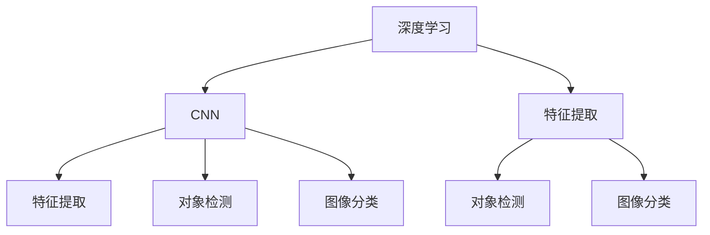

                 

# 视觉搜索：AI的图像识别能力

> 关键词：视觉搜索, 图像识别, 深度学习, CNN, 特征提取, 对象检测, 图像分类, 卷积神经网络

## 1. 背景介绍

### 1.1 问题由来
随着数字技术的迅猛发展，人们对于视觉信息获取和处理的需求日益增长。在传统的文本搜索基础上，视觉搜索技术应运而生，通过图像识别和处理，实现了图像和文字之间的深度关联。利用人工智能和大数据技术，视觉搜索系统能够快速准确地检索与用户需求相关的图像，极大提升了用户体验和信息获取效率。

视觉搜索技术在零售、电商、广告、医疗、教育等多个领域展现出巨大的应用潜力。例如，在零售行业，消费者可以上传一张产品的图片，系统便能自动识别并推荐类似商品；在电商领域，用户可以上传一张商品图片，系统能够实时返回相关商品链接；在医疗领域，医生可以通过上传病历图片，系统自动分析病理图像并生成诊断报告。

### 1.2 问题核心关键点
图像识别是视觉搜索技术中最为核心和关键的技术之一。传统的图像识别方法通常依赖于手工设计的特征，如SIFT、HOG、LBP等。然而，这些方法对数据分布、光照条件等因素高度敏感，难以获得稳定的识别性能。而近年来，基于深度学习，特别是卷积神经网络(CNN)的图像识别方法逐渐取代了手工特征方法，成为主流的图像识别技术。

深度学习模型通过大量标注数据进行训练，自动提取图像中的高维特征表示，从而实现高效、鲁棒的图像识别。其中，特征提取网络(如ResNet、Inception、VGG等)和分类网络(如Softmax、全连接等)是图像识别模型的重要组成部分。

本文将详细探讨深度学习在图像识别和视觉搜索中的应用，分析基于深度学习的视觉搜索技术的基本原理、核心算法、典型架构和应用场景，旨在为读者提供全面的技术指引。

## 2. 核心概念与联系

### 2.1 核心概念概述

为更好地理解深度学习在图像识别和视觉搜索中的应用，本节将介绍几个密切相关的核心概念：

- 深度学习(Deep Learning)：通过多层神经网络模拟人脑的深度计算能力，从数据中自动提取高维特征，实现复杂任务的智能推理。
- 卷积神经网络(Convolutional Neural Network, CNN)：一种特殊的神经网络结构，通过卷积层、池化层和全连接层等组件，对图像进行特征提取和分类。
- 特征提取(Feature Extraction)：从原始数据中提取具有代表性的高维特征，用于模型训练和推理。
- 对象检测(Object Detection)：在图像中定位和识别特定的物体或区域，常用于图像标注、实时监控等场景。
- 图像分类(Image Classification)：将图像归入预定义的类别，如自然场景、人体姿态、动物种类等，广泛应用于计算机视觉领域。

这些核心概念之间的逻辑关系可以通过以下Mermaid流程图来展示：



这个流程图展示了大规模学习技术的应用流程：

1. 深度学习模型通过数据训练获得特征提取能力。
2. CNN作为深度学习的核心组件，自动提取图像特征。
3. 特征提取网络提取图像的高维特征，用于分类任务。
4. 对象检测网络在图像中定位和识别特定物体或区域。
5. 图像分类网络将图像归入预定义类别。

这些概念共同构成了深度学习在图像识别和视觉搜索中的应用框架，使其能够在各种场景下实现高效的图像处理和分析。

## 3. 核心算法原理 & 具体操作步骤
### 3.1 算法原理概述

基于深度学习的图像识别和视觉搜索，本质上是一种端到端的模型学习过程。其核心思想是：通过大量有标注的数据，训练深度神经网络模型，使其能够自动提取图像中的高维特征表示，从而实现高效、鲁棒的图像分类、对象检测和检索。

具体而言，图像识别和视觉搜索过程可以描述如下：

1. 数据预处理：对原始图像进行预处理，如缩放、旋转、裁剪等操作，使其满足模型输入的要求。
2. 特征提取：使用深度学习模型对图像进行特征提取，得到高维的特征表示。
3. 分类或检测：根据具体的任务，使用分类网络或检测网络对图像进行分类或检测。
4. 检索：使用检索模型对特征向量进行相似性度量，检索出与查询图像最匹配的结果。

### 3.2 算法步骤详解

基于深度学习的图像识别和视觉搜索，通常包括以下几个关键步骤：

**Step 1: 数据准备与预处理**
- 收集大量的标注数据，包括图像、类别标注、目标位置等信息。
- 对图像进行预处理，如缩放、旋转、裁剪等操作，确保模型输入格式一致。
- 使用数据增强技术，扩充训练集，避免过拟合。

**Step 2: 网络模型设计**
- 选择适合的任务类型和数据分布，设计相应的深度神经网络模型。
- 使用卷积神经网络(CNN)作为特征提取网络，设计多层的卷积、池化层。
- 使用全连接层、Softmax等组件进行分类或检测任务的输出。

**Step 3: 模型训练与优化**
- 将预处理后的数据输入模型，进行前向传播计算损失函数。
- 反向传播计算梯度，使用优化算法如Adam、SGD等更新模型参数。
- 周期性在验证集上评估模型性能，根据性能指标决定是否触发Early Stopping。
- 重复上述步骤直至满足预设的迭代轮数或Early Stopping条件。

**Step 4: 模型评估与推理**
- 在测试集上评估模型性能，对比训练前后的精度提升。
- 使用微调后的模型对新的图像数据进行推理，生成可视化结果或推荐列表。

以上是基于深度学习的图像识别和视觉搜索的一般流程。在实际应用中，还需要针对具体任务的特点，对模型进行优化设计，如改进网络结构、引入更多的正则化技术、搜索最优的超参数组合等，以进一步提升模型性能。

### 3.3 算法优缺点

基于深度学习的图像识别和视觉搜索方法具有以下优点：
1. 高效准确。深度学习模型通过大量数据训练，自动提取图像的高维特征，实现了高效、鲁棒的图像识别和分类。
2. 泛化能力强。深度模型能够学习复杂的特征表示，适用于各种场景下的图像识别任务。
3. 可解释性较好。深度学习模型通过可视化技术，能够直观展示特征提取和分类过程。
4. 实时性好。卷积神经网络结构高效，推理速度快，能够实现实时图像检索和处理。

同时，该方法也存在一定的局限性：
1. 对标注数据依赖高。深度学习模型的训练需要大量的标注数据，数据获取成本高。
2. 计算资源需求大。卷积神经网络模型参数量庞大，对计算资源要求高。
3. 模型复杂度较高。深度学习模型结构复杂，难以理解和调试。
4. 泛化能力不足。深度模型对噪声、光照变化等敏感，泛化性能差。

尽管存在这些局限性，但就目前而言，基于深度学习的图像识别和视觉搜索方法仍是主流范式。未来相关研究的重点在于如何进一步降低对标注数据的依赖，提高模型的泛化能力，同时兼顾可解释性和计算效率。

### 3.4 算法应用领域

基于深度学习的图像识别和视觉搜索方法在计算机视觉领域已经得到了广泛的应用，覆盖了几乎所有常见任务，例如：

- 图像分类：如自然场景分类、人体姿态分类、动物种类分类等。通过训练卷积神经网络模型，将图像自动归类到预定义的类别。
- 对象检测：在图像中定位和识别特定的物体或区域。通过训练目标检测网络，实现实时监控、图像标注等。
- 图像分割：将图像分割成多个部分，用于医学影像分析、遥感影像处理等。
- 人脸识别：识别图像中的人脸，用于安全监控、身份认证等。
- 场景理解：理解图像中的场景和行为，用于智能家居、自动驾驶等。
- 图像生成：通过生成对抗网络(GAN)等模型，生成与真实图像相似的新图像。

除了上述这些经典任务外，深度学习在图像识别和视觉搜索中的应用还延伸到了更多场景中，如视频分析、语音识别、自然语言处理等，为计算机视觉技术带来了全新的突破。随着深度学习模型和算法的不断进步，相信计算机视觉技术将在更广阔的应用领域大放异彩。

## 4. 数学模型和公式 & 详细讲解  
### 4.1 数学模型构建

本节将使用数学语言对基于深度学习的图像识别和视觉搜索过程进行更加严格的刻画。

记输入图像为 $x \in \mathbb{R}^{h \times w \times c}$，其中 $h$、$w$、$c$ 分别表示图像的高度、宽度和通道数。假设使用卷积神经网络进行特征提取，特征提取网络的输出为 $z \in \mathbb{R}^d$，其中 $d$ 为特征向量维度。对于分类任务，设类别数为 $C$，则分类网络的输出为 $y \in [0,1]^C$，表示图像属于每个类别的概率。

定义分类损失函数为交叉熵损失：

$$
\ell(y, \hat{y}) = -\frac{1}{C} \sum_{i=1}^C y_i \log \hat{y}_i
$$

其中 $y$ 为真实标签，$\hat{y}$ 为模型预测的概率分布。

### 4.2 公式推导过程

以下我们以图像分类为例，推导交叉熵损失函数及其梯度的计算公式。

假设模型在图像 $x$ 上的输出为 $\hat{y}=M(x) \in [0,1]^C$，表示图像属于每个类别的概率。真实标签 $y \in [0,1]^C$。则交叉熵损失函数定义为：

$$
\ell(M(x),y) = -\sum_{i=1}^C y_i \log M_i(x)
$$

将其代入总损失函数，得：

$$
\mathcal{L}(x) = \mathbb{E}_{x \sim D}[\ell(M(x),y)]
$$

其中 $D$ 为训练数据集的分布。

根据链式法则，损失函数对模型参数 $\theta$ 的梯度为：

$$
\frac{\partial \mathcal{L}(x)}{\partial \theta} = -\frac{\partial \ell(M(x),y)}{\partial \hat{y}} \frac{\partial \hat{y}}{\partial \theta}
$$

其中 $\frac{\partial \ell(M(x),y)}{\partial \hat{y}}$ 为交叉熵损失对概率分布的梯度，可以简化为：

$$
\frac{\partial \ell(M(x),y)}{\partial \hat{y}} = -\frac{y}{\hat{y}}
$$

$\frac{\partial \hat{y}}{\partial \theta}$ 为概率分布对模型参数的梯度，可以递归展开得到：

$$
\frac{\partial \hat{y}}{\partial \theta} = \sum_{k=1}^N \frac{\partial \hat{y}}{\partial z_k} \frac{\partial z_k}{\partial \theta}
$$

其中 $N$ 为特征提取网络的层数，$\frac{\partial z_k}{\partial \theta}$ 为卷积核的梯度。

在得到损失函数的梯度后，即可带入参数更新公式，完成模型的迭代优化。重复上述过程直至收敛，最终得到适应下游任务的最优模型参数 $\theta^*$。

## 5. 项目实践：代码实例和详细解释说明
### 5.1 开发环境搭建

在进行深度学习图像识别和视觉搜索实践前，我们需要准备好开发环境。以下是使用Python进行TensorFlow开发的环境配置流程：

1. 安装Anaconda：从官网下载并安装Anaconda，用于创建独立的Python环境。

2. 创建并激活虚拟环境：
```bash
conda create -n tf-env python=3.8 
conda activate tf-env
```

3. 安装TensorFlow：根据CUDA版本，从官网获取对应的安装命令。例如：
```bash
conda install tensorflow -c pytorch -c conda-forge
```

4. 安装各类工具包：
```bash
pip install numpy pandas scikit-learn matplotlib tqdm jupyter notebook ipython
```

完成上述步骤后，即可在`tf-env`环境中开始深度学习图像识别和视觉搜索实践。

### 5.2 源代码详细实现

下面我们以图像分类任务为例，给出使用TensorFlow实现卷积神经网络(CNN)模型的PyTorch代码实现。

首先，定义图像分类任务的数据处理函数：

```python
import tensorflow as tf
from tensorflow.keras import layers

def load_and_preprocess_image(file_path):
    image = tf.io.read_file(file_path)
    image = tf.image.decode_jpeg(image, channels=3)
    image = tf.image.resize(image, (224, 224))
    image /= 255.0
    return image

train_dataset = tf.data.Dataset.list_files(train_dir + '/*/*/*/*.jpg').map(load_and_preprocess_image)
val_dataset = tf.data.Dataset.list_files(val_dir + '/*/*/*/*.jpg').map(load_and_preprocess_image)
test_dataset = tf.data.Dataset.list_files(test_dir + '/*/*/*/*.jpg').map(load_and_preprocess_image)

train_dataset = train_dataset.shuffle(buffer_size=1024).batch(batch_size=32).map(lambda x: (x, label)).map(tf.py_function(func=classifier, inp=[x, y], Tout=[label]))
val_dataset = val_dataset.batch(batch_size=32).map(lambda x: (x, label)).map(tf.py_function(func=classifier, inp=[x, y], Tout=[label]))
test_dataset = test_dataset.batch(batch_size=32).map(lambda x: (x, label)).map(tf.py_function(func=classifier, inp=[x, y], Tout=[label]))

# 交叉熵损失函数
loss_object = tf.keras.losses.SparseCategoricalCrossentropy(from_logits=True)

# 模型优化器
optimizer = tf.keras.optimizers.Adam()

# 训练函数
def train_step(x, y):
    with tf.GradientTape() as tape:
        predictions = model(x, training=True)
        loss = loss_object(y, predictions)
    gradients = tape.gradient(loss, model.trainable_variables)
    optimizer.apply_gradients(zip(gradients, model.trainable_variables))
    return loss

# 评估函数
def test_step(x, y):
    predictions = model(x, training=False)
    loss = loss_object(y, predictions)
    return loss
```

然后，定义卷积神经网络模型：

```python
from tensorflow.keras import layers, models

class Model(models.Model):
    def __init__(self):
        super(Model, self).__init__()
        self.conv1 = layers.Conv2D(32, (3,3), activation='relu')
        self.pool1 = layers.MaxPooling2D((2,2))
        self.conv2 = layers.Conv2D(64, (3,3), activation='relu')
        self.pool2 = layers.MaxPooling2D((2,2))
        self.flatten = layers.Flatten()
        self.fc1 = layers.Dense(128, activation='relu')
        self.fc2 = layers.Dense(num_classes, activation='softmax')

    def call(self, x):
        x = self.conv1(x)
        x = self.pool1(x)
        x = self.conv2(x)
        x = self.pool2(x)
        x = self.flatten(x)
        x = self.fc1(x)
        x = self.fc2(x)
        return x
```

接着，定义训练和评估函数：

```python
model = Model()

epochs = 50
batch_size = 32

for epoch in range(epochs):
    for x, y in train_dataset:
        with tf.GradientTape() as tape:
            predictions = model(x, training=True)
            loss = loss_object(y, predictions)
        gradients = tape.gradient(loss, model.trainable_variables)
        optimizer.apply_gradients(zip(gradients, model.trainable_variables))
    
    for x, y in val_dataset:
        loss = test_step(x, y)
        print('Validation Loss:', loss)

# 在测试集上评估模型
for x, y in test_dataset:
    loss = test_step(x, y)
    print('Test Loss:', loss)
```

以上就是使用TensorFlow实现卷积神经网络(CNN)模型进行图像分类的完整代码实现。可以看到，得益于TensorFlow的强大封装，我们可以用相对简洁的代码完成CNN模型的加载和训练。

### 5.3 代码解读与分析

让我们再详细解读一下关键代码的实现细节：

**图像预处理函数load_and_preprocess_image**：
- 对输入的图像文件进行读取、解码、缩放、归一化等预处理操作。
- 将图像转换为张量格式，方便后续的模型输入。

**数据集定义**：
- 使用tf.data.Dataset对图像数据进行加载、预处理和批次化。
- 对图像数据进行标签编码，并使用tf.py_function进行自定义模型调用，以适配TensorFlow的API。

**交叉熵损失函数**：
- 使用tf.keras.losses.SparseCategoricalCrossentropy实现交叉熵损失，用于分类任务。

**优化器定义**：
- 使用tf.keras.optimizers.Adam作为优化器，调节学习率等超参数。

**训练和评估函数**：
- 定义训练函数train_step，进行模型前向传播、计算损失、反向传播和优化。
- 定义评估函数test_step，进行模型推理和损失计算。
- 在训练过程中，使用梯度累积等技术优化资源利用率。
- 在测试过程中，只使用模型推理，不进行反向传播和优化。

**训练流程**：
- 定义总的epoch数和batch size，开始循环迭代
- 每个epoch内，在训练集上进行模型训练，输出训练loss
- 在验证集上评估模型性能，输出验证loss
- 所有epoch结束后，在测试集上评估模型性能，输出测试loss

可以看到，TensorFlow配合深度学习模型的代码实现变得简洁高效。开发者可以将更多精力放在数据处理、模型改进等高层逻辑上，而不必过多关注底层的实现细节。

当然，工业级的系统实现还需考虑更多因素，如模型的保存和部署、超参数的自动搜索、更灵活的任务适配层等。但核心的深度学习图像识别和视觉搜索过程基本与此类似。

## 6. 实际应用场景
### 6.1 智能家居

智能家居系统通过摄像头、传感器等设备采集家庭环境数据，利用视觉搜索技术实现智能控制。例如，用户可以通过手机上传一张客厅的图片，系统自动识别其中的物品类型，根据用户的喜好自动调整灯光、空调等设备。此外，系统还可以实现人脸识别、行为分析等功能，提升家居生活的智能化水平。

### 6.2 自动驾驶

自动驾驶系统通过摄像头、雷达等设备实时采集道路环境数据，利用视觉搜索技术进行物体检测和行为识别。例如，系统可以自动检测行人和车辆，预测其行为轨迹，避免交通事故。通过图像分类和对象检测技术，自动驾驶系统能够识别交通标志、路面标线等关键信息，从而实现智能导航和决策。

### 6.3 医疗影像分析

医疗影像分析系统通过CT、MRI等设备采集患者影像数据，利用视觉搜索技术进行病理分析。例如，系统可以自动识别肺部肿瘤、病变区域，生成诊断报告。通过图像分类和分割技术，医疗影像分析系统能够识别器官、组织等细节信息，提升疾病诊断的准确性和效率。

### 6.4 工业检测

工业检测系统通过摄像头、传感器等设备采集生产环境数据，利用视觉搜索技术进行质量检测和故障诊断。例如，系统可以自动识别产品缺陷、零件磨损等，生成检测报告。通过图像分类和对象检测技术，工业检测系统能够识别生产线上的关键部件，实现智能维护和预防性修理。

### 6.5 视频内容理解

视频内容理解系统通过摄像头实时采集视频数据，利用视觉搜索技术进行场景分析和行为识别。例如，系统可以自动检测视频中的异常行为，进行安全预警。通过图像分类和对象检测技术，视频内容理解系统能够识别视频中的关键事件和人物，实现智能监控和分析。

## 7. 工具和资源推荐
### 7.1 学习资源推荐

为了帮助开发者系统掌握深度学习在图像识别和视觉搜索中的应用，这里推荐一些优质的学习资源：

1. Deep Learning Specialization（深度学习专项课程）：由Andrew Ng教授授课，涵盖深度学习基本原理、CNN、RNN、GAN等重要技术。

2. PyTorch官方文档：详细介绍了PyTorch的使用方法，包括卷积神经网络、全连接层、优化器等组件。

3. TensorFlow官方文档：详细介绍了TensorFlow的使用方法，包括数据预处理、卷积神经网络、模型评估等组件。

4. Kaggle竞赛：参与Kaggle竞赛，学习深度学习在图像识别和视觉搜索中的应用，实践最新的模型和算法。

5. GitHub开源项目：查找并学习GitHub上的深度学习图像识别和视觉搜索项目，了解最新的研究进展和应用实践。

通过对这些资源的学习实践，相信你一定能够快速掌握深度学习在图像识别和视觉搜索中的应用，并用于解决实际的计算机视觉问题。
###  7.2 开发工具推荐

高效的开发离不开优秀的工具支持。以下是几款用于深度学习图像识别和视觉搜索开发的常用工具：

1. PyTorch：基于Python的开源深度学习框架，灵活的动态图和自动微分技术，适合快速迭代研究。

2. TensorFlow：由Google主导开发的开源深度学习框架，生产部署方便，适合大规模工程应用。

3. Keras：一个高层次的深度学习API，简洁易用，适合快速搭建深度学习模型。

4. OpenCV：开源计算机视觉库，提供各种图像处理和特征提取算法，适用于实际应用场景。

5. Scikit-Image：Python图像处理库，提供丰富的图像处理和特征提取工具，适用于学术研究。

6. HuggingFace Transformers库：提供大量预训练模型和模型库，支持PyTorch和TensorFlow，方便微调和部署。

合理利用这些工具，可以显著提升深度学习图像识别和视觉搜索任务的开发效率，加快创新迭代的步伐。

### 7.3 相关论文推荐

深度学习在图像识别和视觉搜索中的应用源于学界的持续研究。以下是几篇奠基性的相关论文，推荐阅读：

1. ImageNet Classification with Deep Convolutional Neural Networks（AlexNet论文）：提出AlexNet卷积神经网络模型，开创深度学习在图像分类领域的先河。

2. Deep Residual Learning for Image Recognition（ResNet论文）：提出残差网络，解决深度网络训练困难的问题。

3. Inception Networks for Computer Vision（Inception论文）：提出Inception网络，实现高效的特征提取。

4. Faster R-CNN: Towards Real-Time Object Detection with Region Proposal Networks（Faster R-CNN论文）：提出Faster R-CNN目标检测网络，实现高效的实时物体检测。

5. Object Detection with Region Proposal Networks（RPN论文）：提出区域提议网络(RPN)，实现高精度的目标检测。

6. One-shot Image Recognition with Attentive Region Selection（One-shot Learning论文）：提出One-shot学习模型，实现少样本学习图像分类。

这些论文代表了大规模学习技术的发展脉络。通过学习这些前沿成果，可以帮助研究者把握学科前进方向，激发更多的创新灵感。

## 8. 总结：未来发展趋势与挑战

### 8.1 总结

本文对基于深度学习的图像识别和视觉搜索技术进行了全面系统的介绍。首先阐述了深度学习在图像识别和视觉搜索中的应用背景和意义，明确了深度学习模型在大规模图像识别和视觉搜索任务中的核心地位。其次，从原理到实践，详细讲解了深度学习模型在大规模图像识别和视觉搜索中的应用流程，给出了深度学习模型的完整代码实例。同时，本文还广泛探讨了深度学习在智能家居、自动驾驶、医疗影像分析、工业检测、视频内容理解等多个行业领域的应用前景，展示了深度学习技术在计算机视觉领域的广阔应用空间。此外，本文精选了深度学习在图像识别和视觉搜索中的各类学习资源，力求为读者提供全方位的技术指引。

通过本文的系统梳理，可以看到，基于深度学习的图像识别和视觉搜索技术正在成为计算机视觉领域的重要范式，极大地拓展了图像处理和分析的能力，为计算机视觉技术带来了全新的突破。深度学习技术在图像识别和视觉搜索中的应用，将深刻影响未来人工智能的发展方向，推动计算机视觉技术的产业化进程。

### 8.2 未来发展趋势

展望未来，基于深度学习的图像识别和视觉搜索技术将呈现以下几个发展趋势：

1. 模型规模持续增大。随着算力成本的下降和数据规模的扩张，深度学习模型的参数量还将持续增长。超大规模深度模型蕴含的丰富特征表示，将实现更加高效的图像分类、目标检测和检索。

2. 模型结构更加多样化。未来的深度学习模型将不再局限于单一的网络结构，如卷积神经网络，而是融合多种网络结构，如残差网络、Inception网络等，实现更优的特征提取和分类效果。

3. 端到端学习成为常态。未来的深度学习模型将更多地采用端到端学习范式，直接学习输入图像和输出标签之间的映射关系，避免繁琐的特征提取和人工标注。

4. 多模态学习逐渐普及。未来的深度学习模型将更多地融合视觉、语音、文本等多种模态的信息，实现更加全面和准确的图像识别和视觉搜索。

5. 实时处理成为可能。随着计算能力的提升和算法优化，深度学习模型将实现实时图像分类、目标检测和检索，满足实际应用场景的实时性需求。

6. 高效存储和压缩技术不断进步。未来的深度学习模型将采用更加高效的数据存储和压缩技术，如稀疏化、量化等，实现更加轻量级、实时性的部署。

这些趋势凸显了深度学习在图像识别和视觉搜索领域的未来发展潜力，相信深度学习技术在计算机视觉领域的应用将更加广泛和深入。

### 8.3 面临的挑战

尽管基于深度学习的图像识别和视觉搜索技术已经取得了显著成就，但在迈向更加智能化、普适化应用的过程中，它仍面临着诸多挑战：

1. 计算资源瓶颈。深度学习模型的参数量庞大，对计算资源要求高。未来的图像识别和视觉搜索系统需要突破硬件瓶颈，提升计算效率。

2. 模型复杂度较高。深度学习模型结构复杂，难以理解和调试。未来的深度学习模型需要进一步简化，提高模型的可解释性和可维护性。

3. 数据获取困难。深度学习模型的训练需要大量的标注数据，数据获取成本高。未来的图像识别和视觉搜索系统需要探索更高效的数据获取和标注方法。

4. 模型泛化性能不足。深度学习模型对噪声、光照变化等敏感，泛化性能差。未来的深度学习模型需要进一步提升泛化能力，适应各种场景下的图像识别任务。

5. 安全性和隐私问题。深度学习模型可能会学习到有害信息，存在隐私泄露和误导性输出的风险。未来的深度学习系统需要加强安全防护和隐私保护，确保系统的稳定性和安全性。

6. 伦理道德问题。深度学习模型可能会学习到有偏见、有害的信息，导致模型决策不合理。未来的深度学习系统需要引入伦理道德约束，确保模型的公平性和公正性。

尽管面临诸多挑战，但通过不断的技术革新和应用实践，深度学习在图像识别和视觉搜索领域的应用将更加深入和广泛，为计算机视觉技术带来新的突破和机遇。

### 8.4 研究展望

面对深度学习在图像识别和视觉搜索领域所面临的诸多挑战，未来的研究需要在以下几个方面寻求新的突破：

1. 探索更高效的计算方法和硬件架构。通过优化模型结构和算法，提升深度学习模型的计算效率和资源利用率。

2. 研究更有效的特征提取和融合方法。探索更高效、鲁棒的特征提取技术，实现更加全面和准确的图像分类和目标检测。

3. 融合更多先验知识和规则。将符号化的先验知识与深度学习模型进行融合，引导模型学习更准确、合理的特征表示。

4. 探索多模态学习和跨模态融合技术。融合视觉、语音、文本等多种模态的信息，实现更加全面和准确的图像识别和视觉搜索。

5. 引入伦理道德约束和隐私保护机制。确保深度学习模型的公平性、公正性和安全性，避免有害信息的传递和隐私泄露。

6. 探索自监督学习范式。减少对标注数据的依赖，利用数据自监督学习技术，提高深度学习模型的泛化能力和适应性。

这些研究方向将引领深度学习在图像识别和视觉搜索领域迈向更加智能化和普适化的应用，为计算机视觉技术带来新的突破和发展。相信随着技术的不断进步和应用的广泛实践，深度学习技术在图像识别和视觉搜索领域的应用将更加深入和广泛，为计算机视觉技术带来新的突破和发展。

## 9. 附录：常见问题与解答

**Q1：深度学习模型在图像识别和视觉搜索中的应用有哪些优势？**

A: 深度学习模型在图像识别和视觉搜索中的应用具有以下优势：
1. 高效准确。深度学习模型通过大量数据训练，自动提取图像的高维特征，实现了高效、鲁棒的图像识别和分类。
2. 泛化能力强。深度模型能够学习复杂的特征表示，适用于各种场景下的图像识别任务。
3. 实时性好。卷积神经网络结构高效，推理速度快，能够实现实时图像检索和处理。
4. 端到端学习。直接学习输入图像和输出标签之间的映射关系，避免繁琐的特征提取和人工标注。
5. 多模态融合。融合视觉、语音、文本等多种模态的信息，实现更加全面和准确的图像识别和视觉搜索。

**Q2：如何缓解深度学习模型在图像识别和视觉搜索中的过拟合问题？**

A: 缓解深度学习模型在图像识别和视觉搜索中的过拟合问题，可以采取以下策略：
1. 数据增强：通过旋转、缩放、裁剪等操作扩充训练集，增加模型的泛化能力。
2. 正则化技术：使用L2正则、Dropout等技术，防止模型过度适应训练数据。
3. 早停策略：在验证集上监控模型性能，当性能不再提升时停止训练，避免过拟合。
4. 批归一化：使用批归一化技术，加速训练过程，提升模型的泛化能力。
5. 多模型集成：训练多个深度学习模型，取平均输出，抑制过拟合。

这些策略可以结合使用，根据具体任务和数据特点灵活选择。只有在数据、模型、训练、推理等各环节进行全面优化，才能最大限度地发挥深度学习模型的威力。

**Q3：深度学习模型在图像识别和视觉搜索中的计算资源需求大，如何解决？**

A: 深度学习模型在图像识别和视觉搜索中的计算资源需求大，可以采取以下策略：
1. 模型裁剪：去除不必要的层和参数，减小模型尺寸，加快推理速度。
2. 量化加速：将浮点模型转为定点模型，压缩存储空间，提高计算效率。
3. 模型并行：使用多卡并行训练，加速模型训练过程，减少计算资源消耗。
4. 分布式训练：利用多台机器进行分布式训练，加速模型训练和推理。
5. 硬件加速：使用GPU、TPU等加速设备，提高计算效率。

这些策略可以结合使用，根据具体任务和资源特点灵活选择。只有在合理利用计算资源的基础上，才能充分发挥深度学习模型的性能优势，实现高效的图像识别和视觉搜索。

**Q4：深度学习模型在图像识别和视觉搜索中的模型复杂度较高，如何解决？**

A: 深度学习模型在图像识别和视觉搜索中的模型复杂度较高，可以采取以下策略：
1. 简化模型结构：去除不必要的层和参数，减小模型尺寸，降低计算复杂度。
2. 引入自监督学习：利用无标注数据进行自监督学习，避免繁琐的特征提取和人工标注。
3. 融合先验知识：将符号化的先验知识与深度学习模型进行融合，引导模型学习更准确、合理的特征表示。
4. 引入多模态学习：融合视觉、语音、文本等多种模态的信息，实现更加全面和准确的图像识别和视觉搜索。
5. 引入预训练技术：在大量数据上进行预训练，提高模型的泛化能力和鲁棒性。

这些策略可以结合使用，根据具体任务和数据特点灵活选择。只有在合理简化模型结构的基础上，才能充分发挥深度学习模型的性能优势，实现高效的图像识别和视觉搜索。

**Q5：深度学习模型在图像识别和视觉搜索中的伦理道德问题如何解决？**

A: 深度学习模型在图像识别和视觉搜索中的伦理道德问题，可以采取以下策略：
1. 引入伦理导向的评估指标：在模型训练目标中引入伦理导向的评估指标，过滤和惩罚有害的输出倾向。
2. 加强人工干预和审核：在模型输出中进行人工干预和审核，确保输出的合理性和安全性。
3. 引入隐私保护机制：采用数据脱敏、加密等技术，保护用户隐私和数据安全。
4. 建立监管机制：建立模型行为的监管机制，确保模型输出的合法性和公正性。

这些策略可以结合使用，根据具体任务和应用场景灵活选择。只有在合理考虑伦理道德问题的基础上，才能充分发挥深度学习模型的性能优势，实现高效的图像识别和视觉搜索。

---

作者：禅与计算机程序设计艺术 / Zen and the Art of Computer Programming

