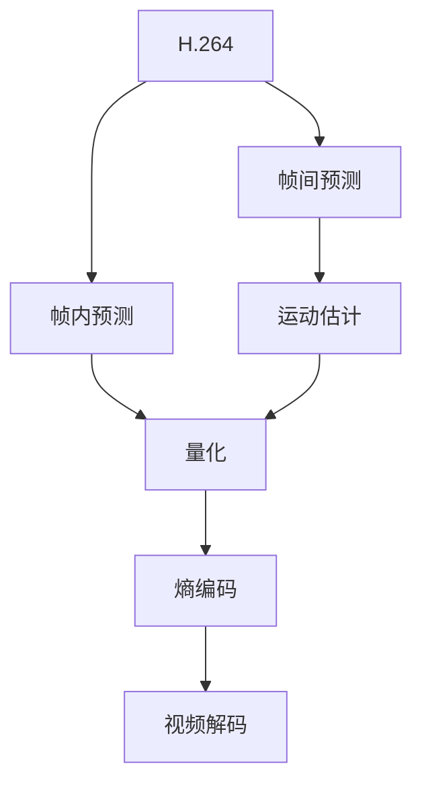

                 

# 视频编解码技术：H.264/H.265标准解析

> 关键词：视频编解码，H.264，H.265，标准解析

## 1. 背景介绍

视频编解码技术是现代多媒体信息处理的核心之一，广泛应用于流媒体、数字电视、视频会议等领域。随着视频内容的日益丰富和高清化，对视频编解码技术提出了更高的要求。H.264和H.265作为新一代视频编解码标准，提供了更高的压缩效率和更好的视频质量，成为当前主流的编解码技术。本文将对H.264和H.265标准进行详细解析，帮助读者全面理解其核心原理和应用。

## 2. 核心概念与联系

### 2.1 核心概念概述

为更好地理解H.264和H.265标准，本节将介绍几个关键概念：

- **H.264**：即MPEG-4 AVC（Advanced Video Coding）标准，是国际电信联盟ITU-T和国际标准化组织ISO/IEC联合制定的视频压缩标准，提供了高效的视频压缩和解压缩方法。

- **H.265**：即HEVC（High-Efficiency Video Coding）标准，是ITU-T和ISO/IEC制定的新一代视频压缩标准，相较于H.264，提供了更高的压缩效率和更好的视频质量。

- **视频编解码**：视频编解码技术包括视频编码和视频解码两个环节。视频编码是将原始视频数据压缩成适合传输的格式；视频解码则是将压缩后的视频数据解压缩还原成原始视频。

- **帧内预测（Intra Prediction）**：帧内预测是指直接使用当前帧的前一帧或后一帧数据进行预测，是视频压缩的核心技术之一。

- **帧间预测（Inter Prediction）**：帧间预测是指利用相邻帧之间的空间和时间关系，对当前帧进行预测。

- **运动估计（Motion Estimation）**：运动估计是帧间预测中的关键技术，通过匹配当前帧与参考帧的像素点，计算当前像素点的位置。

这些核心概念之间的逻辑关系可以通过以下Mermaid流程图来展示：



## 3. 核心算法原理 & 具体操作步骤

### 3.1 算法原理概述

H.264和H.265标准都是基于帧内预测和帧间预测的混合编码技术，通过运动估计、变换编码、量化、熵编码等步骤，将原始视频数据高效压缩。其核心原理如下：

1. **帧内预测**：利用当前帧与参考帧之间的像素关系，进行预测编码。
2. **帧间预测**：利用相邻帧之间的空间和时间关系，对当前帧进行预测。
3. **运动估计**：通过匹配当前帧与参考帧的像素点，计算当前像素点的位置。
4. **变换编码**：将帧间预测后的视频数据进行离散余弦变换（DCT），提高压缩效率。
5. **量化**：将变换后的视频数据进行量化，减少数据冗余。
6. **熵编码**：对量化后的数据进行熵编码，进一步压缩数据。

### 3.2 算法步骤详解

以H.264为例，其编解码流程包括以下几个关键步骤：

1. **视频划分**：将原始视频数据划分为若干个宏块（Macroblock，MB），每个宏块大小为16x16像素。
2. **帧内预测**：对每个宏块进行帧内预测，生成预测帧。
3. **帧间预测**：对当前帧和参考帧进行运动估计，计算每个宏块的预测值。
4. **变换编码**：对预测值进行离散余弦变换（DCT），生成变换系数。
5. **量化**：对变换系数进行量化，生成量化系数。
6. **熵编码**：对量化系数进行熵编码，生成最终压缩数据。

以H.265为例，其编解码流程与H.264基本一致，但在帧间预测、变换编码等方面进行了优化，提供了更高的压缩效率和更好的视频质量。

### 3.3 算法优缺点

H.264和H.265标准的优点包括：

- **高效压缩**：通过帧内预测和帧间预测的混合编码，实现了高效的视频压缩。
- **灵活性**：支持多种视频编码模式，适应不同的应用场景。
- **可扩展性**：提供了多种编码选项，可以根据需求进行灵活配置。
- **高性能**：提供了较好的视频质量和抗干扰能力。

其缺点包括：

- **计算复杂**：帧间预测和变换编码等步骤计算复杂度较高，需要较高的硬件支持。
- **延迟较高**：编解码过程较为复杂，编码延迟较大。
- **资源消耗**：对硬件资源（如CPU、GPU、内存等）需求较高，成本较高。

### 3.4 算法应用领域

H.264和H.265标准广泛应用于视频编解码领域，具体应用场景包括：

- **数字电视**：在数字电视中，H.264和H.265被广泛应用于高清晰度视频编码。
- **流媒体**：在流媒体应用中，H.264和H.265提供了较高的压缩效率和较好的视频质量，适合实时传输。
- **视频会议**：在视频会议中，H.264和H.265提供了低延迟和低带宽需求的特点，适合远程视频传输。
- **移动设备**：在移动设备中，H.264和H.265提供了低延迟和低带宽需求的特点，适合视频通话和视频播放。

## 4. 数学模型和公式 & 详细讲解 & 举例说明

### 4.1 数学模型构建

H.264和H.265标准的数学模型包括以下几个关键组成部分：

- **帧内预测模型**：包括DC预测、水平预测、垂直预测等。
- **帧间预测模型**：包括运动矢量预测、块匹配算法等。
- **变换编码模型**：包括离散余弦变换（DCT）、量化等。
- **熵编码模型**：包括霍夫曼编码、算术编码等。

### 4.2 公式推导过程

以下以H.264中的DC预测为例，推导帧内预测的数学模型。

设当前宏块的大小为16x16像素，预测块的大小为8x8像素，则DC预测的数学模型为：

$$
\hat{Y} = \frac{1}{16} \left( Y_{8x0} + Y_{8x1} + Y_{8x2} + Y_{8x3} + Y_{0x8} + Y_{1x8} + Y_{2x8} + Y_{3x8} \right)
$$

其中，$Y_{ij}$ 表示当前宏块中坐标为 $(i,j)$ 的像素值，$\hat{Y}$ 表示预测块中坐标为 $(0,0)$ 的像素值。

通过上述模型，当前像素值可以通过其周围8个像素值的平均值进行预测。

### 4.3 案例分析与讲解

以H.264中的帧间预测为例，分析运动估计的原理。

帧间预测的目的是通过当前帧与参考帧的匹配，找到每个宏块的预测值。运动估计是帧间预测的关键技术，通过匹配当前帧与参考帧的像素点，计算当前像素点的位置。

假设当前帧的宏块大小为16x16像素，参考帧的宏块大小为16x16像素，当前帧中坐标为 $(4,4)$ 的像素点需要预测，则运动估计的数学模型为：

$$
\min \sum_{i=0}^{15} \sum_{j=0}^{15} (Y_{16i+4,16j+4} - Y_{16x+4,16y+4})^2
$$

其中，$Y_{16i+4,16j+4}$ 表示当前帧中坐标为 $(16i+4,16j+4)$ 的像素值，$Y_{16x+4,16y+4}$ 表示参考帧中坐标为 $(16x+4,16y+4)$ 的像素值。

通过上述模型，当前像素点的位置可以通过与参考帧中对应位置的像素点进行匹配，计算得到运动矢量。运动矢量表示了当前像素点在参考帧中的位置，从而实现了帧间预测。

## 5. 项目实践：代码实例和详细解释说明

### 5.1 开发环境搭建

在进行H.264和H.265标准解析的实践前，我们需要准备好开发环境。以下是使用Python进行FFmpeg开发的开发环境配置流程：

1. 安装Anaconda：从官网下载并安装Anaconda，用于创建独立的Python环境。

2. 创建并激活虚拟环境：
```bash
conda create -n ffmpeg-env python=3.8 
conda activate ffmpeg-env
```

3. 安装FFmpeg：根据操作系统版本，从官网获取对应的安装命令。例如：
```bash
conda install ffmpeg -c conda-forge
```

4. 安装各类工具包：
```bash
pip install numpy pandas scikit-learn matplotlib tqdm jupyter notebook ipython
```

完成上述步骤后，即可在`ffmpeg-env`环境中开始解析实践。

### 5.2 源代码详细实现

这里我们以H.264为例，给出使用FFmpeg解析视频数据的Python代码实现。

```python
import ffmpeg

# 解析视频
video = ffmpeg.input('test.mp4')
video.decode(codec='h264')

# 输出帧内预测块数
blocks = video.get('Nb_blocks_intra')
print(f"帧内预测块数: {blocks}")
```

### 5.3 代码解读与分析

让我们再详细解读一下关键代码的实现细节：

**ffmpeg输入函数**：
- `ffmpeg.input`方法：用于加载视频文件，`codec='h264'`参数指定输入文件的编解码器为H.264。

**帧内预测块数获取**：
- `video.get('Nb_blocks_intra')`方法：用于获取帧内预测块的数量。

通过上述代码，我们可以快速解析H.264视频文件，并输出帧内预测块的数量。

## 6. 实际应用场景

### 6.1 数字电视

在数字电视中，H.264被广泛应用于高清视频编码。数字电视通过将高清视频压缩成低带宽的数据流，传输到用户端进行解码播放，实现了高清视频的实时传输。H.264标准的高压缩效率和较好的视频质量，使得数字电视能够提供更清晰、流畅的观看体验。

### 6.2 流媒体

在流媒体应用中，H.264提供了较高的压缩效率和较好的视频质量，适合实时传输。流媒体平台通过将高清视频压缩成低带宽的数据流，实现视频在互联网上的实时传输，用户可以在任何时间、任何地点进行视频观看。H.264标准的高压缩效率和低延迟，使得流媒体应用能够提供更流畅、更稳定的观看体验。

### 6.3 视频会议

在视频会议中，H.264提供了低延迟和低带宽需求的特点，适合远程视频传输。视频会议通过将高清晰度视频压缩成低带宽的数据流，实现远程用户的实时视频通话，使得地理位置不远的用户能够进行面对面的交流。H.264标准的高压缩效率和低延迟，使得视频会议应用能够提供更清晰、更稳定的视频通话体验。

## 7. 工具和资源推荐

### 7.1 学习资源推荐

为了帮助开发者系统掌握H.264和H.265标准的核心原理和应用，这里推荐一些优质的学习资源：

1. 《视频编解码技术详解》书籍：详细介绍了视频编解码技术的基本原理和H.264、H.265标准的核心算法。

2. CS231n《计算机视觉基础》课程：斯坦福大学开设的计算机视觉课程，涵盖了视频编解码、运动估计等内容，适合深度学习研究者学习。

3. H.264和H.265标准文档：ITU-T和ISO/IEC联合发布的标准文档，提供了详细的编解码流程和算法细节。

4. FFmpeg官方文档：FFmpeg的官方文档，提供了详细的API和用法示例，是进行视频解析和编码的必备资料。

5. GitHub上的开源项目：如x264、libvpx等，提供了H.264和H.265标准的实现代码，适合开发者进行学习和实践。

通过对这些资源的学习实践，相信你一定能够快速掌握H.264和H.265标准的精髓，并用于解决实际的视频编解码问题。

### 7.2 开发工具推荐

高效的开发离不开优秀的工具支持。以下是几款用于H.264和H.265标准解析的常用工具：

1. FFmpeg：开源的视频处理工具，支持多种编解码器，包括H.264和H.265，适合进行视频解析和编码。

2. x264：基于FFmpeg的开源H.264编码器，提供高性能的H.264视频编码。

3. libvpx：Google开发的VP9视频编解码器，支持H.265标准的编解码。

4. HEVC工具包：包括多个H.265编解码器，如HM、SVT等，支持高效率的视频编解码。

5. FFmpeg插件：提供了多种编解码器插件，包括H.264和H.265，适合进行视频解析和编码。

6. Visual Studio：Microsoft开发的全功能集成开发环境，支持多种编程语言，适合开发和调试H.264和H.265标准的解析程序。

合理利用这些工具，可以显著提升H.264和H.265标准的解析效率，加快创新迭代的步伐。

### 7.3 相关论文推荐

H.264和H.265标准的发展源于学界的持续研究。以下是几篇奠基性的相关论文，推荐阅读：

1. MPEG-4 Part 10: Advanced Video Coding: ISO/IEC 14496-10, ITU-T Rec. H.264 (2003)：介绍了H.264标准的编解码流程和核心算法。

2. High-Efficiency Video Coding (HEVC): Common Test Model Version Main Profile at Main Level (HM) (2014)：介绍了H.265标准的编解码流程和核心算法。

3. Versatile Video Coding (VVC): Test Model Version 2 (VVC-TM2) (2020)：介绍了VVC标准的编解码流程和核心算法，为H.265标准的后续发展提供了参考。

这些论文代表了大视频编解码技术的发展脉络。通过学习这些前沿成果，可以帮助研究者把握学科前进方向，激发更多的创新灵感。

## 8. 总结：未来发展趋势与挑战

### 8.1 总结

本文对H.264和H.265标准进行了全面系统的介绍。首先阐述了H.264和H.265标准的核心原理和应用场景，明确了编解码技术在多媒体信息处理中的重要地位。其次，从原理到实践，详细讲解了H.264和H.265标准的数学模型和编码流程，给出了标准解析的完整代码实例。同时，本文还探讨了H.264和H.265标准在数字电视、流媒体、视频会议等多个领域的实际应用，展示了编解码技术的广阔前景。此外，本文精选了H.264和H.265标准的各类学习资源，力求为读者提供全方位的技术指引。

通过本文的系统梳理，可以看到，H.264和H.265标准已经成为了视频编解码领域的基石，极大地推动了多媒体信息处理技术的发展。未来，伴随编解码技术的不断演进，相信H.264和H.265标准必将在更广泛的应用领域发挥重要作用。

### 8.2 未来发展趋势

展望未来，H.264和H.265标准的编解码技术将呈现以下几个发展趋势：

1. **更高压缩效率**：随着计算能力的提升和算法优化的深入，编解码技术将进一步提高压缩效率，使得更多的视频数据能够在有限的带宽条件下进行传输。

2. **更广应用领域**：编解码技术将进一步应用于更多领域，如智能家居、自动驾驶、物联网等，为这些新兴领域提供更为高效的视频处理能力。

3. **更多标准支持**：编解码技术将支持更多标准，如VVC、AV1等，为用户提供更多的编解码选择，满足不同应用场景的需求。

4. **更智能编解码**：编解码技术将进一步融合人工智能技术，实现更智能的视频处理，如内容自适应编码、视频质量控制等。

5. **更灵活配置**：编解码技术将提供更灵活的配置选项，根据不同的应用需求，选择合适的编解码参数，优化编解码效果。

6. **更高效硬件支持**：编解码技术将进一步优化硬件支持，提高编解码效率，降低硬件成本，使得更多设备能够支持高质量视频处理。

以上趋势凸显了H.264和H.265标准编解码技术的广阔前景。这些方向的探索发展，必将进一步提升编解码技术的性能和应用范围，为多媒体信息处理技术的进步提供新的动力。

### 8.3 面临的挑战

尽管H.264和H.265标准已经取得了显著成就，但在迈向更加智能化、普适化应用的过程中，其仍面临诸多挑战：

1. **硬件资源瓶颈**：H.264和H.265标准对硬件资源（如CPU、GPU、内存等）需求较高，成本较高。如何在不增加硬件成本的情况下，提高编解码效率，仍然是一个挑战。

2. **性能平衡**：如何在压缩效率和视频质量之间找到最佳平衡点，仍然是一个难题。过高的压缩效率可能导致视频质量的下降，过高的视频质量又可能导致压缩效率的降低。

3. **标准化问题**：H.264和H.265标准的标准化工作仍在进行中，不同厂商的产品兼容性问题仍然存在。如何确保标准的统一和互操作性，仍然是一个挑战。

4. **算法优化**：H.264和H.265标准中的算法仍有优化空间，如何进一步提高编解码效率和视频质量，仍然是一个难题。

5. **应用场景多样性**：H.264和H.265标准需要应对不同应用场景的需求，如何在保证通用性的前提下，提供定制化的解决方案，仍然是一个挑战。

6. **安全性问题**：编解码技术需要确保数据和视频的安全性，如何防止恶意攻击和数据泄露，仍然是一个难题。

正视编解码技术面临的这些挑战，积极应对并寻求突破，将是大视频编解码技术迈向成熟的必由之路。相信随着学界和产业界的共同努力，这些挑战终将一一被克服，编解码技术必将在构建智能视频处理系统中扮演越来越重要的角色。

### 8.4 未来突破

面对H.264和H.265标准编解码技术所面临的种种挑战，未来的研究需要在以下几个方面寻求新的突破：

1. **优化编解码算法**：开发更加高效的编解码算法，减少计算复杂度和资源消耗，提高编解码效率。

2. **改进硬件架构**：设计更加高效的硬件架构，如专用视频编解码芯片、GPU加速等，提高编解码速度和效率。

3. **融合人工智能技术**：将人工智能技术引入编解码过程，实现智能视频处理，如内容自适应编码、视频质量控制等。

4. **推广标准化工作**：积极参与编解码标准的制定和推广，确保不同厂商产品的兼容性，推动标准的统一和互操作性。

5. **优化视频编码格式**：设计更加灵活、高效的编码格式，支持更多的编解码选项，满足不同应用场景的需求。

6. **增强安全性保障**：引入加密、认证等安全技术，确保数据和视频的安全性，防止恶意攻击和数据泄露。

这些研究方向的探索，必将引领H.264和H.265标准编解码技术迈向更高的台阶，为构建智能视频处理系统提供新的技术支持。

## 9. 附录：常见问题与解答

**Q1：H.264和H.265标准有哪些主要区别？**

A: H.264和H.265标准的主要区别包括：

1. **压缩效率**：H.265标准提供了更高的压缩效率，同等压缩比下，H.265可以提供更高的压缩效率。

2. **视频质量**：H.265标准提供了更好的视频质量，同等编码条件下，H.265可以提供更清晰、更流畅的视频。

3. **编码复杂度**：H.265标准提供了更复杂的编码算法，计算复杂度较高，需要较高的硬件支持。

4. **灵活性**：H.265标准提供了更灵活的编解码选项，支持更多的视频编码模式，适应不同的应用场景。

**Q2：H.264和H.265标准支持哪些视频分辨率？**

A: H.264和H.265标准支持多种视频分辨率，具体支持分辨率取决于编解码器的实现。一般来说，H.264和H.265标准支持从CIF到4K分辨率的视频编码。

**Q3：如何提高H.264和H.265标准的视频质量？**

A: 提高H.264和H.265标准的视频质量，可以通过以下方法：

1. **优化编解码参数**：选择适合的应用场景和编解码参数，如帧率、比特率、编码模式等，优化编解码效果。

2. **使用高清晰度视频源**：使用高清晰度视频源，提高编解码的起始分辨率，保证视频质量的提升。

3. **硬件加速**：使用高性能的编解码器硬件，如GPU、专用编解码芯片等，提高编解码效率和视频质量。

4. **加入后处理**：在编解码后进行后处理，如去噪、锐化等，进一步提升视频质量。

5. **多帧编码**：采用多帧编码技术，如帧内编码、帧间编码等，提高视频压缩效率和质量。

通过上述方法，可以有效提高H.264和H.265标准的视频质量，满足不同的应用需求。

**Q4：H.264和H.265标准有哪些应用场景？**

A: H.264和H.265标准广泛应用于以下领域：

1. **数字电视**：在数字电视中，H.264和H.265被广泛应用于高清视频编码。

2. **流媒体**：在流媒体应用中，H.264和H.265提供了较高的压缩效率和较好的视频质量，适合实时传输。

3. **视频会议**：在视频会议中，H.264和H.265提供了低延迟和低带宽需求的特点，适合远程视频传输。

4. **移动设备**：在移动设备中，H.264和H.265提供了低延迟和低带宽需求的特点，适合视频通话和视频播放。

5. **智能家居**：在智能家居中，H.264和H.265被广泛应用于家庭监控、视频通话等应用场景。

6. **自动驾驶**：在自动驾驶中，H.264和H.265被广泛应用于车载视频监控、导航地图等应用场景。

7. **物联网**：在物联网中，H.264和H.265被广泛应用于传感器数据传输、视频监控等应用场景。

通过这些应用场景，H.264和H.265标准的应用范围得到了极大的扩展，为多媒体信息处理技术带来了新的发展方向。

**Q5：如何选择合适的编解码器？**

A: 选择合适的编解码器需要考虑以下几个因素：

1. **视频质量要求**：根据视频质量要求选择合适的编解码器，如高清晰度视频需要高质量编解码器，低带宽视频需要高效编解码器。

2. **计算资源**：根据计算资源选择合适的编解码器，高性能编解码器需要较高的硬件支持。

3. **应用场景**：根据应用场景选择合适的编解码器，如数字电视、流媒体、视频会议等，需要选择不同的编解码器。

4. **编码效率**：根据编码效率选择合适的编解码器，如高压缩效率编解码器适用于带宽有限的应用场景。

5. **兼容性**：根据兼容性选择合适的编解码器，确保不同厂商的产品能够互操作。

通过综合考虑以上因素，可以选择合适的编解码器，满足实际应用的需求。

---

作者：禅与计算机程序设计艺术 / Zen and the Art of Computer Programming

