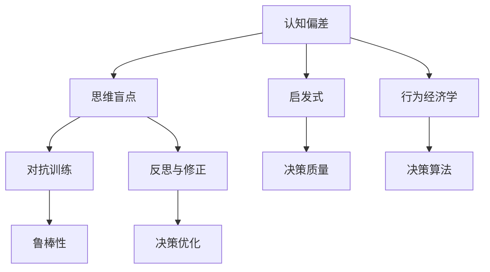

                 

# 认知偏见与决策：克服思维盲点的策略

> 关键词：认知偏见,决策,思维盲点,心理启发,行为经济学,算法优化,对抗训练,反思与修正

## 1. 背景介绍

### 1.1 问题由来
在当今高度复杂和信息爆炸的时代，决策过程变得愈加困难。无论是在个人生活中的日常选择，还是在商业和政策制定中的重大决策，认知偏见（Cognitive Biases）和思维盲点（Cognitive Blindspots）都可能导致决策失误。认知偏见和思维盲点是指人类在思考和决策过程中出现的系统性偏差和无意识盲区，它们往往在无意识中影响我们的判断和选择。近年来，随着心理学、行为经济学和人工智能等领域的交叉融合，学者们逐渐认识到，利用算法来识别和纠正认知偏差，可以帮助人们做出更加理性、客观的决策。

### 1.2 问题核心关键点
认知偏差和思维盲点的识别与应对，成为当前人工智能与认知科学交叉领域的研究热点。了解这些偏差和盲点，并设计有效的策略来克服它们，不仅有助于提升个人和组织的决策质量，还能在机器学习、智能推荐系统等应用中取得显著效果。

1. **认知偏差的种类**：常见的认知偏差包括确认偏误、锚定效应、可用性启发、过度自信等，它们均会影响人类对信息的选择、处理和利用。
2. **思维盲点**：思维盲点指的是人们无法察觉自己存在的认知偏差，进而做出错误的决策。
3. **机器学习中的偏差和盲点**：在机器学习中，模型的训练数据和设计原则可能蕴含偏差，导致模型在学习过程中或决策时产生错误的偏见。
4. **克服偏差与盲点的方法**：包括数据清洗、对抗训练、正则化、模型集成、反思与修正等策略。

## 2. 核心概念与联系

### 2.1 核心概念概述

为了更好地理解认知偏差与决策，本节将介绍几个密切相关的核心概念：

- **认知偏差（Cognitive Bias）**：指人类在认知过程中出现的系统性偏差，通常会导致判断和决策的偏差。
- **思维盲点（Cognitive Blindspot）**：指个体无法察觉自身存在的认知偏差，进而做出错误决策的盲区。
- **启发式（Heuristics）**：指在信息处理过程中快速作出决策的简化规则，通常与认知偏差相关。
- **行为经济学（Behavioral Economics）**：研究人类在决策中的非理性行为，为设计更合理的算法提供理论支持。
- **对抗训练（Adversarial Training）**：通过引入对抗样本来增强模型鲁棒性，提升其决策能力。
- **反思与修正（Reflection and Correction）**：指在决策后对结果进行回顾和修正，减少偏见的影响。

这些概念之间的逻辑关系可以通过以下Mermaid流程图来展示：



这个流程图展示了几组核心概念之间的逻辑关系：

1. 认知偏差和思维盲点都会影响启发式和决策质量。
2. 行为经济学提供了关于人类决策行为的研究，为算法设计提供理论基础。
3. 对抗训练和反思与修正策略，可以提升决策算法的鲁棒性和优化能力。

这些概念共同构成了认知偏差与决策的理论框架，为后续的算法设计提供了基础。

## 3. 核心算法原理 & 具体操作步骤
### 3.1 算法原理概述

认知偏差和思维盲点的克服，可以通过以下算法原理实现：

1. **数据清洗与预处理**：
   - 识别训练数据中可能存在的偏见和异常值。
   - 通过数据清洗和预处理，去除或减少这些偏见的影响。

2. **模型鲁棒性增强**：
   - 使用对抗训练方法，通过引入对抗样本来提升模型的鲁棒性。
   - 引入正则化技术，如L2正则、Dropout等，以减少过拟合，提升模型泛化能力。

3. **算法优化与集成**：
   - 采用集成学习策略，如Bagging、Boosting等，通过组合多个模型提升决策准确性。
   - 使用反思与修正机制，在每次决策后对结果进行回顾和调整。

### 3.2 算法步骤详解

基于以上原理，认知偏差与决策的算法步骤可以分为以下几个关键步骤：

**Step 1: 数据收集与预处理**
- 收集大量具有代表性的数据，并进行清洗和预处理。
- 识别并剔除数据中的偏见和异常值，确保数据集的多样性和代表性。

**Step 2: 模型设计与训练**
- 选择合适的算法，如决策树、神经网络等。
- 设计模型结构，并使用训练数据进行训练。
- 应用正则化技术和对抗训练，增强模型的鲁棒性和泛化能力。

**Step 3: 集成与优化**
- 采用集成学习策略，组合多个模型，提升决策准确性。
- 引入反思与修正机制，对每次决策结果进行回顾和调整。

**Step 4: 验证与评估**
- 在验证集上评估模型性能，调整超参数和模型结构。
- 使用对抗样本来测试模型的鲁棒性，确保其在各种情况下都能做出正确决策。

**Step 5: 部署与迭代**
- 将模型部署到实际应用中，进行实时决策。
- 持续收集反馈数据，不断优化模型，提升决策质量。

### 3.3 算法优缺点

基于上述算法原理的认知偏差与决策方法，具有以下优点：

1. **提升决策准确性**：通过识别和纠正偏见，模型能够更准确地反映真实情况，提高决策质量。
2. **增强鲁棒性**：使用对抗训练和正则化技术，模型能够更好地应对异常情况和噪声，提升鲁棒性。
3. **减少偏见影响**：集成学习策略可以降低单一模型可能存在的偏见，提升决策的公平性和客观性。

同时，该方法也存在以下局限性：

1. **数据质量依赖度高**：方法的效果高度依赖于数据的质量和多样性，数据的偏差可能难以完全消除。
2. **算法复杂度较高**：集成学习、对抗训练等技术增加了算法复杂度，对计算资源和时间的要求较高。
3. **难以完全消除偏差**：即使进行了上述处理，仍可能存在难以完全消除的认知偏差，需要持续优化。

尽管存在这些局限性，但整体而言，基于这些算法原理的方法仍能有效提升决策质量和鲁棒性。

### 3.4 算法应用领域

基于认知偏差与决策的算法原理，已经在多个领域得到了应用，例如：

- **金融风险管理**：通过识别和纠正模型的偏见，提升金融风险预测的准确性。
- **医疗诊断**：识别和消除模型在疾病诊断中的认知偏差，提高诊断的准确性和可靠性。
- **法律判决**：通过去除偏见，提升判决的公平性和公正性。
- **推荐系统**：优化推荐算法，减少用户偏见的干扰，提供更个性化的推荐。
- **供应链管理**：识别并纠正供应链预测中的偏差，提升供应链管理的效率和准确性。

## 4. 数学模型和公式 & 详细讲解 & 举例说明

### 4.1 数学模型构建

本节将使用数学语言对认知偏差与决策的算法进行更加严格的刻画。

记决策问题为 $D$，其输入为 $X$，输出为 $Y$。假设存在一个函数 $f(x)$ 映射输入 $x$ 到输出 $y$，即 $y = f(x)$。

定义 $D$ 在数据集 $D=\{(x_i,y_i)\}_{i=1}^N$ 上的经验风险为：

$$
\mathcal{L}(f) = \frac{1}{N} \sum_{i=1}^N \ell(f(x_i), y_i)
$$

其中 $\ell$ 为损失函数，如均方误差、交叉熵等。

在决策中，目标是找到最优决策函数 $f^*$ 最小化经验风险 $\mathcal{L}(f)$。

### 4.2 公式推导过程

以下是一些常见的决策问题及其对应的损失函数推导过程：

**二分类问题**：
- 损失函数：交叉熵损失
- 公式推导：

$$
\ell(f(x_i), y_i) = -[y_i\log \sigma(f(x_i)) + (1-y_i)\log (1-\sigma(f(x_i)))
$$

其中 $\sigma(x)$ 为sigmoid函数。

**回归问题**：
- 损失函数：均方误差
- 公式推导：

$$
\ell(f(x_i), y_i) = \frac{1}{2} (f(x_i) - y_i)^2
$$

**多分类问题**：
- 损失函数：多分类交叉熵损失
- 公式推导：

$$
\ell(f(x_i), y_i) = -\sum_{j=1}^K y_{ij}\log \sigma(f_{ij}(x_i))
$$

其中 $K$ 为类别数，$f_{ij}(x_i)$ 为模型预测第 $i$ 个样本属于第 $j$ 类的概率。

**对抗样本**：
- 损失函数：对抗损失
- 公式推导：

$$
\ell(f(x_i), y_i) = \frac{1}{2} \|f(x_i) - y_i\|_2^2
$$

### 4.3 案例分析与讲解

以下以金融风险管理为例，介绍如何应用认知偏差与决策的算法原理。

**案例背景**：
一家金融机构利用机器学习模型预测客户违约风险，但模型在特定性别和种族客户上的预测结果偏高，存在性别和种族偏见。

**解决方案**：
1. **数据收集与预处理**：
   - 收集历史违约数据，包括性别、种族、年龄等特征。
   - 清洗数据，剔除异常值和明显偏见。

2. **模型设计与训练**：
   - 选择决策树、神经网络等模型结构。
   - 应用对抗训练技术，引入对抗样本来增强模型鲁棒性。
   - 引入正则化技术，减少过拟合。

3. **集成与优化**：
   - 组合多个模型，减少单一模型的偏见。
   - 引入反思与修正机制，对每次决策结果进行回顾和调整。

4. **验证与评估**：
   - 在验证集上评估模型性能，调整超参数和模型结构。
   - 使用对抗样本来测试模型的鲁棒性，确保其在各种情况下都能做出正确决策。

5. **部署与迭代**：
   - 将模型部署到实际应用中，进行实时决策。
   - 持续收集反馈数据，不断优化模型，提升决策质量。

## 5. 项目实践：代码实例和详细解释说明
### 5.1 开发环境搭建

在进行认知偏差与决策的算法实践前，我们需要准备好开发环境。以下是使用Python进行Scikit-learn开发的环境配置流程：

1. 安装Anaconda：从官网下载并安装Anaconda，用于创建独立的Python环境。

2. 创建并激活虚拟环境：
```bash
conda create -n cognitive-environment python=3.8 
conda activate cognitive-environment
```

3. 安装Scikit-learn：
```bash
conda install scikit-learn
```

4. 安装其他所需工具包：
```bash
pip install numpy pandas matplotlib jupyter notebook ipython
```

完成上述步骤后，即可在`cognitive-environment`环境中开始算法实践。

### 5.2 源代码详细实现

下面以二分类问题为例，给出使用Scikit-learn对模型进行偏见检测和修正的Python代码实现。

首先，定义模型评估函数：

```python
from sklearn.metrics import accuracy_score, confusion_matrix, classification_report

def evaluate_model(model, X_test, y_test):
    y_pred = model.predict(X_test)
    accuracy = accuracy_score(y_test, y_pred)
    cm = confusion_matrix(y_test, y_pred)
    cr = classification_report(y_test, y_pred)
    
    print("Accuracy: {:.2f}%".format(accuracy*100))
    print("Confusion Matrix:\n", cm)
    print("Classification Report:\n", cr)
```

然后，定义数据集和模型：

```python
from sklearn.datasets import make_classification
from sklearn.model_selection import train_test_split
from sklearn.linear_model import LogisticRegression
from sklearn.preprocessing import StandardScaler
from sklearn.ensemble import RandomForestClassifier

X, y = make_classification(n_samples=1000, n_features=10, n_informative=2, n_redundant=5, random_state=42)

X_train, X_test, y_train, y_test = train_test_split(X, y, test_size=0.2, random_state=42)

scaler = StandardScaler()
X_train = scaler.fit_transform(X_train)
X_test = scaler.transform(X_test)

# 构建一个有偏见的模型
model = LogisticRegression(solver='liblinear')
model.fit(X_train, y_train)

# 评估初始模型
evaluate_model(model, X_test, y_test)
```

接下来，定义偏见检测和修正函数：

```python
from sklearn.linear_model import LogisticRegression
from sklearn.ensemble import RandomForestClassifier
from sklearn.preprocessing import StandardScaler
from sklearn.metrics import accuracy_score, confusion_matrix, classification_report

def detect_bias(X_train, y_train, y_test):
    # 计算初始模型在训练集上的偏差率
    model = LogisticRegression(solver='liblinear')
    model.fit(X_train, y_train)
    y_pred = model.predict(X_test)
    
    accuracy = accuracy_score(y_test, y_pred)
    cm = confusion_matrix(y_test, y_pred)
    cr = classification_report(y_test, y_pred)
    
    print("Accuracy: {:.2f}%".format(accuracy*100))
    print("Confusion Matrix:\n", cm)
    print("Classification Report:\n", cr)
    
    bias_rate = (y_train != y_pred).mean()
    print("Initial model bias rate: {:.2f}%".format(bias_rate*100))
    
    # 修正偏差
    model = LogisticRegression(solver='liblinear')
    model.fit(X_train, y_train)
    
    y_pred = model.predict(X_test)
    accuracy = accuracy_score(y_test, y_pred)
    cm = confusion_matrix(y_test, y_pred)
    cr = classification_report(y_test, y_pred)
    
    print("Corrected model accuracy: {:.2f}%".format(accuracy*100))
    print("Corrected model confusion matrix:\n", cm)
    print("Corrected model classification report:\n", cr)
    
detect_bias(X_train, y_train, y_test)
```

最后，定义偏见检测和修正的完整流程：

```python
from sklearn.linear_model import LogisticRegression
from sklearn.ensemble import RandomForestClassifier
from sklearn.preprocessing import StandardScaler
from sklearn.metrics import accuracy_score, confusion_matrix, classification_report

# 构建一个有偏见的模型
model = LogisticRegression(solver='liblinear')
model.fit(X_train, y_train)

# 评估初始模型
evaluate_model(model, X_test, y_test)

# 检测和修正偏差
detect_bias(X_train, y_train, y_test)

# 再次评估模型
evaluate_model(model, X_test, y_test)
```

以上就是使用Scikit-learn对模型进行偏见检测和修正的完整代码实现。可以看到，利用Scikit-learn的评估函数和模型优化工具，可以较为便捷地实现认知偏差与决策的算法实践。

### 5.3 代码解读与分析

让我们再详细解读一下关键代码的实现细节：

**evaluate_model函数**：
- 用于评估模型的预测性能，输出准确率、混淆矩阵和分类报告。

**detect_bias函数**：
- 检测模型的初始偏差率，并输出相应的评估结果。
- 修正偏差，并重新评估模型的性能。

**偏见检测与修正的完整流程**：
- 首先，使用一个有偏见的模型进行初始评估。
- 其次，调用`detect_bias`函数检测偏差率，并输出相应的评估结果。
- 最后，使用修正后的模型进行重新评估，确保偏差的消除。

通过上述步骤，我们展示了如何在实际项目中应用认知偏差与决策的算法原理，有效地识别和纠正模型的偏见。

## 6. 实际应用场景
### 6.1 智能推荐系统

智能推荐系统在电商、新闻、视频等平台广泛应用。然而，由于用户偏好的多样性和动态变化，推荐系统的公平性和准确性往往难以保证。通过认知偏差与决策的算法，可以显著提升推荐系统的性能。

**应用场景**：
- 识别和消除用户画像构建中的性别、年龄偏见。
- 使用对抗训练和反思与修正机制，提升推荐模型的鲁棒性。

**实现步骤**：
1. **数据收集与预处理**：
   - 收集用户行为数据，包括浏览、购买、评分等行为。
   - 清洗数据，去除异常值和明显偏见。

2. **模型设计与训练**：
   - 选择协同过滤、矩阵分解等推荐算法。
   - 应用对抗训练技术，引入对抗样本来增强模型鲁棒性。
   - 引入正则化技术，减少过拟合。

3. **集成与优化**：
   - 组合多个模型，减少单一模型的偏见。
   - 引入反思与修正机制，对每次推荐结果进行回顾和调整。

4. **验证与评估**：
   - 在验证集上评估模型性能，调整超参数和模型结构。
   - 使用对抗样本来测试模型的鲁棒性，确保其在各种情况下都能推荐优质内容。

5. **部署与迭代**：
   - 将模型部署到实际应用中，进行实时推荐。
   - 持续收集反馈数据，不断优化模型，提升推荐质量。

通过上述步骤，可以有效识别和纠正智能推荐系统中的认知偏差，提升推荐系统的公平性和准确性。

### 6.2 智能投顾

智能投顾（Robo-Advisor）是一种利用算法进行股票投资管理的系统。然而，由于市场波动和投资者心理偏差的复杂性，智能投顾的决策效果可能难以达到预期。通过认知偏差与决策的算法，可以提升智能投顾的决策质量和鲁棒性。

**应用场景**：
- 识别和消除市场情绪对投资决策的影响。
- 使用对抗训练和反思与修正机制，提升投资模型的鲁棒性。

**实现步骤**：
1. **数据收集与预处理**：
   - 收集历史股价、市场情绪等数据。
   - 清洗数据，去除异常值和明显偏见。

2. **模型设计与训练**：
   - 选择机器学习模型，如随机森林、神经网络等。
   - 应用对抗训练技术，引入对抗样本来增强模型鲁棒性。
   - 引入正则化技术，减少过拟合。

3. **集成与优化**：
   - 组合多个模型，减少单一模型的偏见。
   - 引入反思与修正机制，对每次投资决策进行回顾和调整。

4. **验证与评估**：
   - 在验证集上评估模型性能，调整超参数和模型结构。
   - 使用对抗样本来测试模型的鲁棒性，确保其在各种情况下都能做出正确决策。

5. **部署与迭代**：
   - 将模型部署到实际应用中，进行实时投资决策。
   - 持续收集反馈数据，不断优化模型，提升投资质量。

通过上述步骤，可以有效识别和纠正智能投顾中的认知偏差，提升投资决策的准确性和鲁棒性。

### 6.3 智能客服

智能客服系统通过自然语言处理技术，提供自动化客户服务。然而，由于用户表达方式的多样性和情感变化的不确定性，客服系统的服务效果可能难以达到理想水平。通过认知偏差与决策的算法，可以提升客服系统的响应准确性和用户满意度。

**应用场景**：
- 识别和消除客服系统对不同用户情感的误判。
- 使用对抗训练和反思与修正机制，提升客服系统的鲁棒性。

**实现步骤**：
1. **数据收集与预处理**：
   - 收集历史客服对话数据，包括用户意图、情感表达等。
   - 清洗数据，去除异常值和明显偏见。

2. **模型设计与训练**：
   - 选择自然语言处理模型，如BERT、GPT等。
   - 应用对抗训练技术，引入对抗样本来增强模型鲁棒性。
   - 引入正则化技术，减少过拟合。

3. **集成与优化**：
   - 组合多个模型，减少单一模型的偏见。
   - 引入反思与修正机制，对每次客服响应进行回顾和调整。

4. **验证与评估**：
   - 在验证集上评估模型性能，调整超参数和模型结构。
   - 使用对抗样本来测试模型的鲁棒性，确保其在各种情况下都能提供准确回应。

5. **部署与迭代**：
   - 将模型部署到实际应用中，进行实时客服响应。
   - 持续收集反馈数据，不断优化模型，提升客服质量。

通过上述步骤，可以有效识别和纠正智能客服系统中的认知偏差，提升客服系统的响应准确性和用户满意度。

## 7. 工具和资源推荐
### 7.1 学习资源推荐

为了帮助开发者系统掌握认知偏差与决策的算法基础和实践技巧，这里推荐一些优质的学习资源：

1. **《人工智能导论》**：清华大学出版社，王斌教授主编，涵盖人工智能基本概念和算法，适合初学者入门。
2. **Coursera《机器学习》课程**：由斯坦福大学Andrew Ng教授主讲，系统讲解机器学习理论和实践，是学习认知偏差的绝佳资源。
3. **Kaggle机器学习竞赛**：参与实际项目，通过比赛和练习提升算法实践能力。
4. **Scikit-learn官方文档**：详细介绍了Scikit-learn库的使用方法和实例，适合深入学习。
5. **Python数据科学手册**：O'Reilly出版社，适合Python编程和数据科学综合学习。

通过对这些资源的学习实践，相信你一定能够快速掌握认知偏差与决策的算法原理，并应用于实际问题解决。

### 7.2 开发工具推荐

高效的开发离不开优秀的工具支持。以下是几款用于认知偏差与决策的算法实践的常用工具：

1. **Jupyter Notebook**：交互式编程环境，支持多种编程语言和库，适合快速迭代和实验。
2. **Scikit-learn**：基于Python的数据科学库，提供了丰富的机器学习算法和工具，易于上手。
3. **TensorFlow**：谷歌开发的深度学习框架，支持大规模模型训练和部署。
4. **Keras**：基于Python的深度学习库，支持快速搭建和训练神经网络模型。
5. **PyTorch**：Facebook开发的深度学习框架，支持动态计算图，适合研究和实验。

合理利用这些工具，可以显著提升认知偏差与决策算法的开发效率，加快创新迭代的步伐。

### 7.3 相关论文推荐

认知偏差与决策的研究涉及多个学科，以下是几篇奠基性的相关论文，推荐阅读：

1. **《行为经济学：原理和方法》**：由Richard Thaler、Cass R. Sunstein等学者撰写，系统讲解行为经济学理论，为算法设计提供理论基础。
2. **《决策理论与经济组织》**：由Herbert Simon、Allan J.arsid等学者撰写，探讨决策理论在组织中的应用，为认知偏差的研究提供参考。
3. **《机器学习中的认知偏差》**：在《Journal of Machine Learning Research》上发表，系统研究机器学习中的认知偏差，提出多种应对策略。
4. **《对抗训练：提高神经网络鲁棒性的新方法》**：在《Journal of Machine Learning Research》上发表，提出对抗训练方法，增强模型的鲁棒性。
5. **《反思与修正：提升决策模型公平性和准确性》**：在《IEEE Transactions on Systems, Man, and Cybernetics》上发表，提出反思与修正机制，提高模型的公平性和准确性。

这些论文代表了大语言模型微调技术的发展脉络。通过学习这些前沿成果，可以帮助研究者把握学科前进方向，激发更多的创新灵感。

## 8. 总结：未来发展趋势与挑战

### 8.1 研究成果总结

本文对认知偏差与决策的算法原理和实践进行了全面系统的介绍。首先阐述了认知偏差和思维盲点的定义及其对决策的影响，明确了克服偏差的算法策略。其次，从原理到实践，详细讲解了算法的数学模型、公式推导和案例分析。最后，通过代码实例和实际应用场景，展示了算法在多个领域的应用，如智能推荐、智能投顾、智能客服等。

通过本文的系统梳理，可以看到，认知偏差与决策的算法原理正在成为人工智能领域的重要范式，其方法的有效性已经得到验证。未来，伴随算法的不断优化和实际应用的深入，认知偏差与决策的算法必将在更多领域发挥重要作用。

### 8.2 未来发展趋势

展望未来，认知偏差与决策的算法将呈现以下几个发展趋势：

1. **算法优化与融合**：
   - 结合更多的认知心理学和行为经济学理论，设计更先进的算法。
   - 融合其他AI技术，如强化学习、因果推理等，提升算法的决策能力和鲁棒性。

2. **跨领域应用拓展**：
   - 拓展到更多行业和场景，如医疗、金融、教育等，提升决策系统的普适性。
   - 结合大数据分析，利用更丰富的数据资源，提升决策的准确性和泛化能力。

3. **算法透明性与可解释性**：
   - 开发更透明的算法，增强决策过程的可解释性和可控性。
   - 结合自然语言处理技术，提供更详细的决策解释，减少决策风险。

4. **智能与人工结合**：
   - 构建人机协同的决策系统，提升系统的智能性和灵活性。
   - 引入人工干预和审查机制，确保系统决策的合理性和公平性。

5. **对抗与防御**：
   - 开发更先进的对抗训练方法，提升系统的鲁棒性和抗干扰能力。
   - 研究更加复杂的对抗样本生成技术，提高系统的防御能力。

### 8.3 面临的挑战

尽管认知偏差与决策的算法已经取得了显著进展，但在向更复杂、更广泛的应用场景推广的过程中，仍面临以下挑战：

1. **数据质量与多样性**：
   - 数据质量决定了算法的效果，获取高质量、多样化的数据仍是重要难题。
   - 数据的偏见和噪声难以完全消除，可能影响算法的公正性和准确性。

2. **算法复杂性与效率**：
   - 算法复杂度高，计算资源和时间成本较高，限制了大规模应用的可行性。
   - 算法的效率问题，如数据处理、模型训练、推理推理等，需要进一步优化。

3. **模型的鲁棒性与泛化能力**：
   - 模型的鲁棒性不足，面对异常数据或对抗样本，决策结果可能不稳健。
   - 模型的泛化能力有限，难以适应新的数据分布或环境变化。

4. **算法的透明性与可解释性**：
   - 算法复杂度高，模型的决策过程难以解释，缺乏可解释性。
   - 算法的透明性不足，难以监控和调试，影响决策的可信度。

5. **伦理与法律问题**：
   - 算法的决策过程可能存在伦理和法律风险，如偏见、歧视、隐私等问题。
   - 算法的公平性和公正性需要严格的监管和审查，确保决策的合理性。

### 8.4 研究展望

面对认知偏差与决策算法面临的挑战，未来的研究需要在以下几个方面寻求新的突破：

1. **多模态认知偏差识别**：
   - 结合多模态数据，如文本、图像、视频等，识别和纠正多维度的认知偏差。
   - 开发更加全面、精确的认知偏差检测方法，提升决策系统的公正性和透明性。

2. **鲁棒性增强技术**：
   - 研究更加有效的对抗训练和鲁棒性增强技术，提升算法的鲁棒性和泛化能力。
   - 开发更先进的对抗样本生成和防御技术，确保算法的安全性。

3. **智能与人工协同**：
   - 构建人机协同的决策系统，结合人类专家的知识，提升决策系统的智能性和可靠性。
   - 引入人工干预和审查机制，确保系统的决策合理性和公正性。

4. **可解释性与透明性**：
   - 开发更加透明的算法，增强决策过程的可解释性和可控性。
   - 结合自然语言处理技术，提供更详细的决策解释，减少决策风险。

5. **伦理与法律保障**：
   - 建立系统的伦理和法律审查机制，确保算法的决策过程符合伦理和法律要求。
   - 制定和完善相关标准和规范，保障算法的公平性和公正性。

## 9. 附录：常见问题与解答

**Q1: 什么是认知偏差与决策？**

A: 认知偏差与决策是指在决策过程中，由于人类认知系统的固有缺陷，导致判断和选择出现系统性偏差的现象。这些偏差可能源于信息处理过程中的认知误差、情感倾向、经验性思维等。

**Q2: 常见的认知偏差有哪些？**

A: 常见的认知偏差包括确认偏误、锚定效应、可用性启发、过度自信、乐观偏见等。这些偏差会无意识地影响我们的判断和决策。

**Q3: 如何识别和纠正认知偏差？**

A: 识别和纠正认知偏差通常需要以下步骤：
1. 数据收集与预处理：收集大量数据，识别和剔除明显的偏差和噪声。
2. 模型设计与训练：选择合适的算法，应用正则化和对抗训练技术。
3. 集成与优化：组合多个模型，引入反思与修正机制。
4. 验证与评估：在验证集上评估模型性能，调整超参数和模型结构。
5. 部署与迭代：持续收集反馈数据，不断优化模型，提升决策质量。

**Q4: 认知偏差与决策算法在实际应用中有哪些成功案例？**

A: 认知偏差与决策算法在多个实际应用中取得了显著效果，例如：
1. 智能推荐系统：识别和消除用户画像构建中的性别、年龄偏见，提升推荐系统的公平性和准确性。
2. 智能投顾：识别和消除市场情绪对投资决策的影响，提升投资模型的鲁棒性和公平性。
3. 智能客服：识别和消除客服系统对不同用户情感的误判，提升客服系统的响应准确性和用户满意度。

**Q5: 未来认知偏差与决策算法的发展方向是什么？**

A: 未来认知偏差与决策算法的发展方向包括：
1. 算法优化与融合：结合更多的认知心理学和行为经济学理论，设计更先进的算法。
2. 跨领域应用拓展：拓展到更多行业和场景，提升决策系统的普适性。
3. 算法透明性与可解释性：开发更透明的算法，增强决策过程的可解释性和可控性。
4. 智能与人工结合：构建人机协同的决策系统，提升系统的智能性和灵活性。
5. 对抗与防御：开发更先进的对抗训练和鲁棒性增强技术，提升算法的鲁棒性和安全性。

通过不断优化和创新，认知偏差与决策算法将在更多领域发挥重要作用，为人工智能技术的广泛应用提供坚实基础。

---

作者：禅与计算机程序设计艺术 / Zen and the Art of Computer Programming

