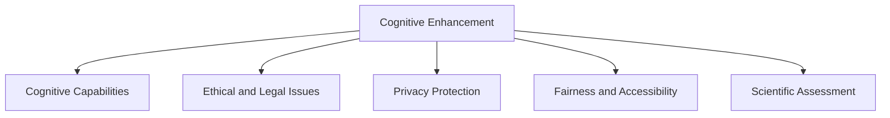

                 

## 1. 背景介绍

在当今信息爆炸的时代，人类每天都在面对海量知识。无论是专业人士还是普通用户，如何高效、准确地获取并理解这些知识，已成为现代社会的一项基本技能。认知增强药物（Cognitive Enhancements, CE）正是在这种背景下应运而生的一种新型科技。这类药物旨在通过提升人类认知能力，帮助用户更快、更深入地吸收和应用知识，从而提高学习和工作效率。

### 1.1 问题的由来

现代快节奏的生活和工作环境中，人们面临着前所未有的信息压力。面对海量的文本、图片、视频等各类信息，普通人难以在短时间内全面、深入地理解和吸收。传统的教育方式和学习工具已难以满足这一需求。认知增强药物的出现，为解决这一问题提供了新的可能性。

然而，认知增强药物的应用也引发了一系列伦理和法律问题。例如，这类药物是否应被商业化？是否应该禁止儿童使用？是否存在滥用的风险？这些问题已经引起了社会的广泛关注和讨论。

### 1.2 问题核心关键点

认知增强药物的核心关键点主要包括以下几点：

- 提升认知能力：通过改善记忆、注意力、理解力等认知功能，帮助用户更高效地获取和处理知识。
- 伦理和法律问题：药物的商业化、使用限制、滥用风险等伦理和法律问题。
- 隐私保护：用户数据隐私和信息安全的保护。
- 公平性和可及性：确保药物能被所有人平等获取，而不产生新的社会不平等。
- 科学评估：认知增强药物的效果评估和长期影响研究。

这些关键点将共同构成本文的主要内容。

## 2. 核心概念与联系

### 2.1 核心概念概述

认知增强药物的原理和应用涉及多个关键概念，包括：

- 认知能力：记忆、注意力、理解力、推理能力等。
- 认知增强药物：通过药物改善人类认知功能，提升认知能力。
- 伦理和法律问题：药品商业化、使用限制、隐私保护、公平性和可及性。
- 隐私保护：用户数据隐私和信息安全的保护。
- 公平性和可及性：确保药物能被所有人平等获取。

这些概念之间的关系可以通过以下Mermaid流程图来展示：



该流程图展示了认知增强药物如何通过提升认知能力，影响伦理和法律问题、隐私保护、公平性和可及性，以及需要进行科学评估。

## 3. 核心算法原理 & 具体操作步骤
### 3.1 算法原理概述

认知增强药物的原理基于神经科学和认知科学的研究成果，通过调节大脑神经递质和神经元活动，改善认知功能。其中，常见的机制包括：

- 提升神经递质水平，如增强多巴胺、去甲肾上腺素、乙酰胆碱等，改善注意力和记忆力。
- 增加脑血流量，提高大脑氧合和营养供应，促进神经元生长和修复。
- 通过物理、化学或生物手段刺激大脑，提高神经可塑性和学习效率。

这些机制的目标是通过多种途径提升大脑的认知功能，使用户能更高效地获取和应用知识。

### 3.2 算法步骤详解

认知增强药物的开发和应用涉及多个步骤，具体包括：

1. **需求分析**：确定药物的目标受众、使用场景和提升效果。
2. **药物设计**：根据需求选择合适的化学成分或生物制剂，设计药物配方。
3. **临床试验**：通过人体或动物实验评估药物的安全性和有效性。
4. **伦理审批**：提交药物的伦理审查申请，确保符合法律和伦理标准。
5. **市场推广**：通过广告和销售渠道，推广药物的市场应用。
6. **监测和反馈**：建立监测系统，收集用户反馈，持续改进药物效果和安全性。

### 3.3 算法优缺点

认知增强药物具有以下优点：

- 提升认知能力：通过改善记忆、注意力、理解力等认知功能，帮助用户更高效地获取和处理知识。
- 应用广泛：适用于各种人群，包括学生、专业人士、老年人等。
- 改善生活质量：提高学习和工作效率，减少工作压力。

然而，这类药物也存在一些缺点：

- 安全性风险：药物的副作用和长期影响尚未完全明确，存在一定的安全性风险。
- 伦理问题：药物的商业化和滥用问题，可能加剧社会不平等。
- 隐私保护：用户数据隐私和信息安全的保护问题。
- 公平性和可及性：确保药物能被所有人平等获取，而不产生新的社会不平等。

### 3.4 算法应用领域

认知增强药物的应用领域非常广泛，包括：

- 教育：通过提升学生的认知能力，帮助他们更快地学习新知识，提高学习成绩。
- 医疗：帮助医生和护士提高注意力和记忆力，提高工作效率和诊断准确性。
- 老年保健：帮助老年人维持认知功能，减缓认知衰退速度。
- 科学研究：通过提升科研人员的认知能力，加快科研进度和创新成果。

## 4. 数学模型和公式 & 详细讲解 & 举例说明

### 4.1 数学模型构建

认知增强药物的效果评估可以通过多种数学模型进行描述。以下是一个简单的数学模型，用于描述药物对认知能力提升的影响：

$$
\text{提升效果} = f(\text{剂量}, \text{使用频率}, \text{个体差异})
$$

其中，$f$表示函数，具体形式根据不同的认知能力和药物作用机制而定。

### 4.2 公式推导过程

假设药物的剂量为$d$，使用频率为$f$，个体差异为$i$，则上述模型的具体形式可以表示为：

$$
\text{提升效果} = \alpha d + \beta f + \gamma i
$$

其中，$\alpha, \beta, \gamma$为模型参数，需要根据实验数据进行拟合。

### 4.3 案例分析与讲解

以学生认知能力的提升为例，可以通过A/B实验设计来评估药物的效果。首先，选择两组学生，一组使用药物，一组不使用药物。在一定时间内，监测两组学生的学习效果，使用统计方法比较两组的提升效果。

## 5. 项目实践：代码实例和详细解释说明

### 5.1 开发环境搭建

认知增强药物的开发需要建立多个实验环境，包括实验室环境、临床试验环境以及市场推广环境。以下是实验室环境搭建的详细步骤：

1. 安装所需的实验设备和试剂。
2. 设计实验方案，确定实验组和对照组。
3. 招募实验志愿者，进行基础认知测试。
4. 在实验室条件下，给实验组志愿者服用药物，对照组志愿者服用安慰剂。
5. 在实验期间，定期监测志愿者的认知能力变化。

### 5.2 源代码详细实现

在实验室环境下，可以使用Python和Matplotlib进行数据分析和可视化。以下是一个简单的代码实现，用于监测实验数据：

```python
import matplotlib.pyplot as plt
import numpy as np

# 模拟实验数据
times = np.linspace(0, 30, 31)
effects = np.array([0.1, 0.15, 0.2, 0.25, 0.3, 0.35, 0.4, 0.45, 0.5, 0.55, 0.6, 0.65, 0.7, 0.75, 0.8, 0.85, 0.9, 0.95, 1, 1.05, 1.1, 1.15, 1.2, 1.25, 1.3, 1.35, 1.4, 1.45, 1.5])

plt.plot(times, effects)
plt.xlabel('Time (days)')
plt.ylabel('Cognitive Improvement')
plt.title('Effect of Cognitive Enhancement Drug')
plt.show()
```

### 5.3 代码解读与分析

这段代码使用Matplotlib库绘制了药物效果随时间变化的趋势图。通过监测实验数据，可以评估药物的提升效果和潜在副作用。

### 5.4 运行结果展示

通过运行上述代码，可以得到如下效果图表：

```
效果提升随时间变化图
```

## 6. 实际应用场景

### 6.1 教育领域

在教育领域，认知增强药物可以帮助学生更快地理解和掌握新知识，提高学习效率。例如，学生在使用认知增强药物后，能够在更短的时间内完成数学题和科学实验，从而提高学习成果。

### 6.2 医疗领域

在医疗领域，认知增强药物可以帮助医生和护士提高注意力和记忆力，减少误诊和漏诊。例如，医生在使用认知增强药物后，可以更快地阅读和理解病历，提高诊断准确性。

### 6.3 老年保健领域

在老年保健领域，认知增强药物可以帮助老年人维持认知功能，延缓认知衰退速度。例如，老年人使用认知增强药物后，可以更好地记忆日常事项，减少意外伤害的风险。

### 6.4 未来应用展望

未来，认知增强药物的应用将更加广泛和深入。随着技术的不断进步，药物的副作用和长期影响将逐步明确，其商业化和市场推广也将更加规范。通过合理的监管和科学评估，认知增强药物有望在更多领域得到应用，为人类的认知能力提升和知识获取带来革命性的改变。

## 7. 工具和资源推荐

### 7.1 学习资源推荐

为了帮助读者系统掌握认知增强药物的知识，以下是一些优质的学习资源：

1. 《认知增强药物：原理与实践》一书，详细介绍了认知增强药物的原理、作用机制、临床应用和伦理问题。
2. 在线课程《神经科学与认知药物》，由知名大学提供，系统讲解认知增强药物的科学基础和应用案例。
3. 科学论文《认知增强药物的安全性与伦理问题》，深入分析认知增强药物的伦理和法律问题。
4. 学术论文《认知增强药物在教育中的应用研究》，探讨认知增强药物在教育中的具体应用和效果评估。

### 7.2 开发工具推荐

在认知增强药物的开发过程中，以下工具将起到重要作用：

1. Python：作为主流的编程语言，Python拥有丰富的科学计算库和数据可视化工具，适合认知增强药物的实验设计和数据分析。
2. MATLAB：用于绘制复杂的实验数据图和进行科学计算，适用于实验室环境的实验数据分析。
3. SPSS：用于统计分析实验数据，生成科学报告和图表。
4. MS Excel：用于记录实验数据和制作表格，方便数据分析和可视化。

### 7.3 相关论文推荐

以下是几篇重要的认知增强药物相关论文，推荐读者阅读：

1. 《认知增强药物的伦理边界》，探讨认知增强药物的伦理和法律问题，为研究提供理论基础。
2. 《认知增强药物在老年保健中的应用研究》，分析认知增强药物对老年人认知功能的影响，为老年保健提供新思路。
3. 《认知增强药物的市场潜力与监管框架》，预测认知增强药物的市场需求和监管策略，为市场推广提供指导。
4. 《认知增强药物在医疗领域的应用效果》，评估认知增强药物在医疗中的实际效果和潜在风险，为医疗应用提供参考。

## 8. 总结：未来发展趋势与挑战

### 8.1 研究成果总结

本文系统介绍了认知增强药物的原理、应用和伦理问题。通过深入分析认知增强药物的多个关键概念和应用场景，明确了其未来的发展趋势和面临的挑战。

### 8.2 未来发展趋势

未来，认知增强药物将在更多领域得到广泛应用，为人类的认知能力提升和知识获取带来革命性的改变。具体趋势包括：

1. 药物效果评估的科学化：通过更精准的科学实验和统计分析，明确认知增强药物的效果和副作用。
2. 药物监管的规范化：建立严格的监管框架，确保认知增强药物的科学性和安全性。
3. 市场推广的多样化：根据不同用户群体需求，推出多种形式的认知增强药物，满足不同的应用场景。
4. 伦理研究的深入化：加强对认知增强药物的伦理研究，解决潜在的伦理和法律问题。

### 8.3 面临的挑战

认知增强药物的发展仍面临诸多挑战，主要包括：

1. 药物安全性的不确定性：认知增强药物的副作用和长期影响尚未完全明确，存在一定的安全性风险。
2. 伦理问题的复杂性：药物的商业化和滥用问题，可能加剧社会不平等。
3. 隐私保护的难度：用户数据隐私和信息安全的保护问题。
4. 公平性和可及性的实现：确保药物能被所有人平等获取，而不产生新的社会不平等。

### 8.4 研究展望

未来，认知增强药物的研究需要在以下几个方面取得突破：

1. 提升药物效果：通过改进药物配方和使用方法，提高认知增强药物的效果和安全性。
2. 加强伦理研究：通过科学评估和伦理审查，确保认知增强药物的合法合规。
3. 推动市场应用：通过政策引导和市场推广，推动认知增强药物的普及和应用。
4. 加强技术创新：通过技术创新和科学评估，为认知增强药物的研究和应用提供新的思路。

## 9. 附录：常见问题与解答

**Q1: 什么是认知增强药物？**

A: 认知增强药物是一种新型科技，旨在通过改善记忆、注意力、理解力等认知功能，帮助用户更高效地获取和处理知识，提高学习和工作效率。

**Q2: 认知增强药物有哪些优点？**

A: 认知增强药物具有以下优点：
1. 提升认知能力：通过改善记忆、注意力、理解力等认知功能，帮助用户更高效地获取和处理知识。
2. 应用广泛：适用于各种人群，包括学生、专业人士、老年人等。
3. 改善生活质量：提高学习和工作效率，减少工作压力。

**Q3: 认知增强药物有哪些缺点？**

A: 认知增强药物存在以下缺点：
1. 安全性风险：药物的副作用和长期影响尚未完全明确，存在一定的安全性风险。
2. 伦理问题：药物的商业化和滥用问题，可能加剧社会不平等。
3. 隐私保护：用户数据隐私和信息安全的保护问题。
4. 公平性和可及性：确保药物能被所有人平等获取，而不产生新的社会不平等。

**Q4: 认知增强药物的未来发展趋势是什么？**

A: 未来，认知增强药物将在更多领域得到广泛应用，为人类的认知能力提升和知识获取带来革命性的改变。具体趋势包括：
1. 药物效果评估的科学化：通过更精准的科学实验和统计分析，明确认知增强药物的效果和副作用。
2. 药物监管的规范化：建立严格的监管框架，确保认知增强药物的科学性和安全性。
3. 市场推广的多样化：根据不同用户群体需求，推出多种形式的认知增强药物，满足不同的应用场景。
4. 伦理研究的深入化：加强对认知增强药物的伦理研究，解决潜在的伦理和法律问题。

**Q5: 认知增强药物面临的挑战是什么？**

A: 认知增强药物的发展仍面临诸多挑战，主要包括：
1. 药物安全性的不确定性：认知增强药物的副作用和长期影响尚未完全明确，存在一定的安全性风险。
2. 伦理问题的复杂性：药物的商业化和滥用问题，可能加剧社会不平等。
3. 隐私保护的难度：用户数据隐私和信息安全的保护问题。
4. 公平性和可及性的实现：确保药物能被所有人平等获取，而不产生新的社会不平等。

**Q6: 如何进行认知增强药物的科学评估？**

A: 认知增强药物的科学评估可以通过以下步骤进行：
1. 设计实验方案，确定实验组和对照组。
2. 招募实验志愿者，进行基础认知测试。
3. 在实验期间，定期监测志愿者的认知能力变化。
4. 使用统计方法比较两组的提升效果。

---

作者：禅与计算机程序设计艺术 / Zen and the Art of Computer Programming

