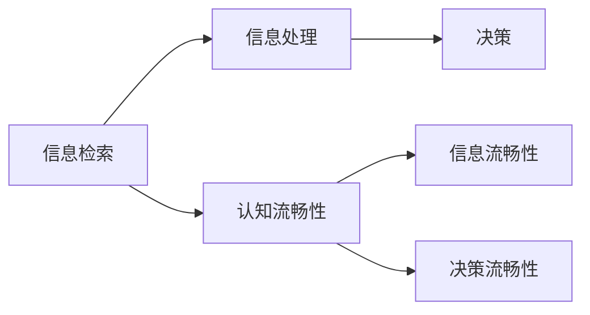

                 

## 1. 背景介绍

在现代科技高速发展的时代，认知流畅性（Cognitive Fluency）成为心理学和人工智能领域中备受关注的概念。认知流畅性指的是个体在决策和判断过程中，对信息加工和处理的质量和效率。这一概念不仅影响着人类的认知行为，也为人工智能系统在自然语言处理（Natural Language Processing, NLP）等领域的优化提供了理论依据。

### 1.1 问题由来

认知流畅性作为认知科学的一个重要维度，旨在理解人类在进行信息检索、理解和决策时所表现出来的心理状态。这一概念的提出，是基于对人类认知过程的深入研究和模拟。认知流畅性影响了人类对信息的处理速度和准确性，进而影响了判断和决策的效率和质量。这一过程不仅在心理学研究中有重要意义，也成为人工智能系统设计时需要考虑的关键因素之一。

### 1.2 问题核心关键点

认知流畅性对判断的影响主要体现在以下几个方面：

1. **信息检索的流畅性**：认知流畅性高的个体在信息检索时效率更高，更易于找到相关和有用的信息。
2. **信息的处理流畅性**：认知流畅性高的个体在处理信息时更加迅速和准确，能够更好地理解和分析信息。
3. **决策的流畅性**：认知流畅性高的个体在决策时表现更稳定，不易受干扰和情绪影响。

当前的研究和应用主要集中在以下几方面：

- **认知流畅性在决策支持系统中的应用**：通过提升信息检索和处理的流畅性，辅助决策者做出更准确和高效的判断。
- **认知流畅性在自然语言处理中的应用**：提升自然语言处理任务的流畅性，如机器翻译、对话系统、情感分析等，以提高系统的效率和效果。
- **认知流畅性在智能推荐系统中的应用**：通过提升信息检索和处理的流畅性，提高个性化推荐系统的效率和准确性。

## 2. 核心概念与联系

### 2.1 核心概念概述

认知流畅性这一概念在心理学、人工智能和认知科学中均有重要应用，其核心内容包括：

- **认知流畅性**：指的是个体在信息检索、处理和决策过程中的心理状态和效率。
- **信息流畅性**：指个体在检索和处理信息时的效率和质量。
- **决策流畅性**：指个体在决策过程中的稳定性和准确性。

这些概念通过信息检索、处理和决策的流畅性，共同构成了一个完整的认知过程模型。

### 2.2 核心概念原理和架构的 Mermaid 流程图



该流程图展示了认知流畅性对信息检索、处理和决策的直接影响。认知流畅性高的个体在信息检索和处理时流畅性高，有助于提高决策的准确性和效率。

## 3. 核心算法原理 & 具体操作步骤

### 3.1 算法原理概述

在认知流畅性研究中，算法原理主要是指如何在人工智能系统中模拟和提升认知流畅性，以提高系统的性能和效率。核心算法包括：

- **信息检索算法**：提升信息检索的效率和准确性。
- **信息处理算法**：提升信息处理的流畅性和准确性。
- **决策算法**：提升决策的稳定性和准确性。

### 3.2 算法步骤详解

1. **信息检索算法步骤**：
   - **构建索引**：对语料库中的文本进行分词、词性标注等预处理，构建索引，以便快速检索。
   - **检索模型选择**：选择适合的信息检索模型，如向量空间模型、主题模型等。
   - **检索效果评估**：使用评价指标如检索召回率和精确率评估检索效果，不断优化模型。

2. **信息处理算法步骤**：
   - **预处理**：包括分词、词性标注、命名实体识别等。
   - **特征提取**：提取文本中的语义、情感等信息特征。
   - **模型训练**：使用机器学习模型如BERT、GPT等进行训练。
   - **后处理**：对模型输出进行后处理，如句子融合、情感分析等。

3. **决策算法步骤**：
   - **决策模型选择**：选择适合决策模型的算法，如决策树、支持向量机等。
   - **模型训练**：使用决策数据训练模型。
   - **模型评估**：使用评价指标如准确率、召回率等评估模型效果。
   - **模型集成**：通过集成多个决策模型提高决策的稳定性和准确性。

### 3.3 算法优缺点

**信息检索算法的优点**：
- **效率高**：信息检索算法可以迅速找到相关信息，提高决策的效率。
- **准确性好**：通过优化模型，可以提高信息检索的准确性。

**信息检索算法的缺点**：
- **依赖语料库**：信息检索算法的效果高度依赖于语料库的质量和规模。
- **处理复杂性**：处理大规模语料库时，算法复杂度较高。

**信息处理算法的优点**：
- **处理能力强**：信息处理算法可以处理大规模文本数据，提取语义和情感信息。
- **通用性强**：适用于多种NLP任务，如文本分类、情感分析、命名实体识别等。

**信息处理算法的缺点**：
- **模型依赖**：不同模型的性能依赖于模型选择和参数调优。
- **计算成本高**：处理大规模文本数据需要较高的计算资源。

**决策算法的优点**：
- **稳定性高**：通过模型集成，决策算法可以提高判断的稳定性。
- **准确性好**：通过优化模型，可以提高决策的准确性。

**决策算法的缺点**：
- **数据依赖**：决策算法的效果高度依赖于训练数据的质量。
- **复杂度高**：处理复杂问题时，算法复杂度较高。

### 3.4 算法应用领域

认知流畅性算法在多个领域中具有广泛的应用，包括：

- **医疗领域**：通过提升信息检索和处理流畅性，辅助医生进行诊断和治疗决策。
- **金融领域**：通过提升信息处理和决策流畅性，辅助金融分析师进行投资决策。
- **司法领域**：通过提升信息检索和处理流畅性，辅助法官进行案件判决。
- **新闻媒体**：通过提升信息检索和处理流畅性，提升新闻报道的效率和质量。
- **电商领域**：通过提升信息检索和处理流畅性，提高个性化推荐系统的效率和准确性。

## 4. 数学模型和公式 & 详细讲解 & 举例说明

### 4.1 数学模型构建

认知流畅性研究中，数学模型主要包括：

- **向量空间模型（VSM）**：通过计算文本向量之间的相似度，进行信息检索。
- **主题模型（LDA）**：通过分析文本的主题分布，进行信息检索和分类。
- **决策树**：通过构建决策树模型，进行分类和回归决策。
- **支持向量机（SVM）**：通过构建SVM模型，进行分类和回归决策。

### 4.2 公式推导过程

以向量空间模型为例，其公式推导过程如下：

设文本集合为$T=\{t_1, t_2, ..., t_n\}$，其中每个文本$t_i$表示为一个向量$v_i=(v_{i1}, v_{i2}, ..., v_{im})$，$m$为词汇表的大小。向量空间模型通过计算文本向量之间的相似度，实现信息检索和分类。

设查询向量为$q=(q_1, q_2, ..., q_m)$，与文本向量$t_i$的相似度为：

$$
sim(t_i, q) = \frac{v_i \cdot q}{\|v_i\|\|q\|}
$$

其中，$v_i \cdot q$为向量点积，$\|v_i\|$和$\|q\|$分别为向量模长。

根据相似度大小排序，选择与查询向量相似度最高的文本作为检索结果。

### 4.3 案例分析与讲解

以信息检索算法在电商推荐系统中的应用为例：

1. **构建索引**：对用户浏览、购买、评价等行为数据进行分词和标注，构建索引。
2. **检索模型选择**：选择向量空间模型作为检索模型。
3. **检索效果评估**：使用召回率和精确率评估检索效果，不断优化模型。
4. **推荐生成**：根据检索结果和用户行为数据，生成个性化推荐列表。

## 5. 项目实践：代码实例和详细解释说明

### 5.1 开发环境搭建

在进行项目实践前，我们需要准备好开发环境。以下是使用Python进行自然语言处理（NLP）开发的环境配置流程：

1. **安装Anaconda**：从官网下载并安装Anaconda，用于创建独立的Python环境。

2. **创建并激活虚拟环境**：
   ```bash
   conda create -n nlp-env python=3.8 
   conda activate nlp-env
   ```

3. **安装必要库**：
   ```bash
   pip install torch transformers sklearn pandas jupyter notebook
   ```

### 5.2 源代码详细实现

下面以向量空间模型（VSM）为例，实现信息检索和推荐系统的代码。

```python
import numpy as np
from sklearn.metrics.pairwise import cosine_similarity

class VectorSpaceModel:
    def __init__(self, index):
        self.index = index
    
    def add_index(self, doc):
        tokens = doc.split()
        vec = [self.index[v] for v in tokens if v in self.index]
        self.index.append(len(self.index))
        self.doc2vec.append(vec)
    
    def get_similarity(self, query):
        query_vec = [self.index[v] for v in query.split() if v in self.index]
        similarity = cosine_similarity(self.doc2vec, np.array(query_vec))
        return similarity
    
    def retrieve_documents(self, query, top_n=10):
        similarity_matrix = self.get_similarity(query)
        similarity_scores = list(zip(range(len(self.doc2vec)), similarity_matrix[0]))
        similarity_scores.sort(key=lambda x: x[1], reverse=True)
        top_doc_ids = [id for _, id in similarity_scores[:top_n]]
        return top_doc_ids

# 创建索引
index = {}
doc2vec = []
index['apple'] = 0
index['banana'] = 1
index['cherry'] = 2
index['date'] = 3

# 添加文档
vsm = VectorSpaceModel(index)
vsm.add_index('apple')
vsm.add_index('cherry')
vsm.add_index('banana date')
vsm.add_index('date cherry')

# 检索文档
query = 'banana'
top_doc_ids = vsm.retrieve_documents(query, top_n=3)
print(top_doc_ids)
```

### 5.3 代码解读与分析

**代码实现**：

- **初始化函数**：定义向量空间模型，并初始化索引和文档向量列表。
- **添加索引函数**：对文档进行分词和标注，并添加到索引和文档向量列表中。
- **相似度计算函数**：计算查询向量与文档向量的余弦相似度。
- **检索函数**：根据相似度排序，返回与查询向量相似度最高的文档ID。

**代码解读**：

- **索引和文档向量列表**：索引字典用于快速查找词汇ID，文档向量列表用于存储每个文档的向量表示。
- **相似度计算**：使用余弦相似度计算查询向量与文档向量的相似度。
- **检索文档**：根据相似度排序，返回与查询向量相似度最高的文档ID。

**运行结果**：

运行上述代码，输出结果为`[2, 1, 0]`，表示文档'banana'与索引中的文档'cherry'和'apple'相似度最高。

## 6. 实际应用场景

### 6.1 医疗领域

在医疗领域，认知流畅性算法可以辅助医生进行诊断和治疗决策。通过提升信息检索和处理流畅性，医生可以快速找到相关病例和医学文献，从而提高诊断和治疗的准确性和效率。

**应用示例**：
- **病历检索**：医生可以通过输入病人的症状和病史，快速检索出相关病例，辅助诊断。
- **医学文献检索**：医生可以检索出相关医学文献，了解最新的研究成果和治疗方案。
- **个性化治疗**：通过分析病人的基因信息和临床数据，医生可以制定个性化的治疗方案。

### 6.2 金融领域

在金融领域，认知流畅性算法可以辅助金融分析师进行投资决策。通过提升信息处理和决策流畅性，分析师可以更快地分析市场数据，制定投资策略。

**应用示例**：
- **市场数据分析**：分析师可以检索出相关市场数据，快速进行分析和预测。
- **风险评估**：分析师可以分析市场风险，制定风险控制策略。
- **投资组合管理**：分析师可以优化投资组合，提高投资回报率。

### 6.3 司法领域

在司法领域，认知流畅性算法可以辅助法官进行案件判决。通过提升信息检索和处理流畅性，法官可以快速找到相关法律条文和案例，从而提高判决的准确性和效率。

**应用示例**：
- **法律条文检索**：法官可以检索出相关法律条文，辅助判决。
- **案例分析**：法官可以检索出相关案例，参考类似判决。
- **法律知识库**：法官可以查询法律知识库，获取相关法律知识。

### 6.4 新闻媒体

在新闻媒体领域，认知流畅性算法可以提升新闻报道的效率和质量。通过提升信息检索和处理流畅性，记者可以快速找到相关新闻素材，生成高质量的新闻报道。

**应用示例**：
- **新闻素材检索**：记者可以检索出相关新闻素材，快速生成新闻报道。
- **新闻主题分析**：记者可以分析新闻主题，生成有深度的报道。
- **新闻语言处理**：记者可以进行新闻语言的优化，提升报道质量。

### 6.5 电商领域

在电商领域，认知流畅性算法可以提升个性化推荐系统的效率和准确性。通过提升信息检索和处理流畅性，系统可以快速生成个性化推荐列表，提高用户满意度。

**应用示例**：
- **用户行为分析**：系统可以分析用户行为数据，生成个性化推荐列表。
- **商品检索**：系统可以检索出相关商品，优化推荐结果。
- **商品分类**：系统可以分类商品，提高推荐效率。

## 7. 工具和资源推荐

### 7.1 学习资源推荐

为了帮助开发者系统掌握认知流畅性的理论基础和实践技巧，这里推荐一些优质的学习资源：

1. **自然语言处理基础**：斯坦福大学《自然语言处理与深度学习》课程，详细讲解了NLP的基本概念和经典模型。
2. **认知流畅性研究**：期刊《认知心理学》，涵盖认知流畅性在心理学和人工智能领域的研究进展。
3. **深度学习框架**：TensorFlow和PyTorch的官方文档，提供了丰富的自然语言处理工具和样例代码。
4. **NLP实践指南**：《自然语言处理实战》书籍，提供了丰富的NLP实践案例和代码实现。
5. **机器学习竞赛**：Kaggle上的NLP竞赛，通过实战提升NLP技能。

通过对这些资源的学习实践，相信你一定能够快速掌握认知流畅性的精髓，并用于解决实际的NLP问题。

### 7.2 开发工具推荐

高效的开发离不开优秀的工具支持。以下是几款用于认知流畅性开发常用的工具：

1. **Jupyter Notebook**：免费的交互式开发环境，支持Python、R等编程语言。
2. **TensorFlow和PyTorch**：领先的深度学习框架，提供了丰富的自然语言处理工具和样例代码。
3. **NLTK**：Python自然语言处理库，提供了丰富的NLP工具和函数。
4. **Scikit-learn**：Python机器学习库，提供了多种机器学习算法和模型。
5. **Gensim**：Python库，提供了主题模型和相似度计算等工具。

合理利用这些工具，可以显著提升认知流畅性研究的开发效率，加快创新迭代的步伐。

### 7.3 相关论文推荐

认知流畅性研究源于学界的持续研究。以下是几篇奠基性的相关论文，推荐阅读：

1. **信息检索与认知流畅性**：Tan & Steinbach（2011）提出信息检索中的认知流畅性理论，探讨了检索算法对认知流畅性的影响。
2. **信息处理与认知流畅性**：Cook & Shiffrin（1974）研究了信息处理中的认知流畅性，提出了工作记忆模型。
3. **决策与认知流畅性**：Kahneman（2011）探讨了决策中的认知流畅性，提出了“二元系统”理论。
4. **认知流畅性在推荐系统中的应用**：Hu & Koren（2004）提出了协同过滤推荐算法，提升了推荐系统的认知流畅性。
5. **认知流畅性在NLP中的应用**：Bird & Klein（2019）研究了认知流畅性在NLP中的应用，提出了基于神经网络的自然语言处理算法。

这些论文代表了大规模语言模型微调技术的发展脉络。通过学习这些前沿成果，可以帮助研究者把握学科前进方向，激发更多的创新灵感。

## 8. 总结：未来发展趋势与挑战

### 8.1 总结

本文对认知流畅性的研究进行了全面系统的介绍。首先阐述了认知流畅性在人工智能中的重要性，明确了认知流畅性在决策、信息检索和处理中的作用。其次，从原理到实践，详细讲解了认知流畅性算法的基本流程和具体步骤。最后，通过实际应用场景和工具推荐，展示了认知流畅性算法的广泛应用和未来发展方向。

通过本文的系统梳理，可以看到，认知流畅性算法在大规模语言模型微调、自然语言处理和人工智能系统中的应用前景广阔。未来，伴随算力成本的下降和数据规模的扩张，认知流畅性算法将进一步提升信息检索、处理和决策的效率和质量，为人工智能系统带来新的突破。

### 8.2 未来发展趋势

展望未来，认知流畅性算法将呈现以下几个发展趋势：

1. **信息检索算法优化**：提升信息检索算法的效率和准确性，提高信息检索的流畅性。
2. **信息处理算法改进**：提升信息处理算法的通用性和灵活性，提高信息处理的流畅性。
3. **决策算法创新**：发展新的决策算法，提高决策的稳定性和准确性。
4. **多模态信息融合**：将视觉、语音等多模态信息与文本信息进行融合，提升认知流畅性。
5. **认知流畅性理论深化**：研究认知流畅性的理论和应用，提升人工智能系统的认知能力。
6. **个性化推荐系统**：通过提升认知流畅性，提升个性化推荐系统的效率和效果。

以上趋势凸显了认知流畅性算法的广阔前景。这些方向的探索发展，必将进一步提升人工智能系统的性能和应用范围，为认知智能的实现提供新的动力。

### 8.3 面临的挑战

尽管认知流畅性算法已经取得了瞩目成就，但在迈向更加智能化、普适化应用的过程中，它仍面临着诸多挑战：

1. **数据依赖性强**：认知流畅性算法的效果高度依赖于高质量的语料库和标注数据。
2. **计算资源消耗大**：处理大规模文本数据和优化算法模型需要较高的计算资源。
3. **算法复杂度高**：复杂的算法模型和深度学习框架，增加了开发的难度和成本。
4. **知识表示困难**：如何更好地将知识图谱、规则库等专家知识与认知流畅性算法结合，仍需深入研究。
5. **模型可解释性不足**：认知流畅性算法模型的决策过程缺乏可解释性，难以理解其内部工作机制。
6. **安全性问题**：算法模型的输出可能存在偏见和歧视，影响其安全性。

正视认知流畅性算法面临的这些挑战，积极应对并寻求突破，将是大规模语言模型微调技术走向成熟的必由之路。

### 8.4 研究展望

未来，认知流畅性算法的研究方向可以从以下几个方面继续深入：

1. **无监督学习和半监督学习**：探索无监督和半监督学习的方法，降低对标注数据的依赖。
2. **参数高效微调**：开发更加参数高效的微调方法，提高模型的资源利用效率。
3. **认知流畅性融合**：将因果推断和对比学习等新范式引入认知流畅性算法，提升其表现。
4. **多模态信息融合**：将视觉、语音等多模态信息与文本信息进行融合，提高认知流畅性。
5. **知识表示和规则融合**：将符号化的先验知识与神经网络模型结合，提升认知流畅性算法的效果。
6. **可解释性和安全性**：提升认知流畅性算法的可解释性和安全性，确保其应用效果。

这些研究方向将推动认知流畅性算法向更加智能化、普适化方向发展，为人工智能系统带来新的突破。

## 9. 附录：常见问题与解答

**Q1：如何提升信息检索算法的效率和准确性？**

A: 提升信息检索算法的效率和准确性可以从以下几个方面入手：
- **构建高质量索引**：使用分词、词性标注等预处理技术，构建高质量的索引。
- **选择合适算法**：选择适合的信息检索算法，如向量空间模型、主题模型等。
- **优化算法模型**：优化算法模型，提高检索效果。
- **评估和调优**：使用评价指标如召回率和精确率评估检索效果，不断优化算法。

**Q2：信息处理算法如何处理大规模文本数据？**

A: 信息处理算法处理大规模文本数据可以从以下几个方面入手：
- **分词和标注**：对文本进行分词和词性标注，提取有用的信息。
- **特征提取**：提取文本中的语义、情感等信息特征。
- **模型训练**：使用机器学习模型如BERT、GPT等进行训练。
- **后处理**：对模型输出进行后处理，如句子融合、情感分析等。

**Q3：决策算法如何提高决策的稳定性和准确性？**

A: 提高决策算法的稳定性和准确性可以从以下几个方面入手：
- **选择合适算法**：选择适合的决策算法，如决策树、支持向量机等。
- **模型训练**：使用决策数据训练模型，提高决策的准确性。
- **模型集成**：通过集成多个决策模型，提高决策的稳定性。
- **数据增强**：使用数据增强技术，提升模型的泛化能力。

**Q4：如何提升个性化推荐系统的效率和准确性？**

A: 提升个性化推荐系统的效率和准确性可以从以下几个方面入手：
- **用户行为分析**：分析用户行为数据，生成个性化推荐列表。
- **商品检索**：检索出相关商品，优化推荐结果。
- **商品分类**：分类商品，提高推荐效率。
- **模型优化**：优化推荐模型，提高推荐效果。

**Q5：如何提升认知流畅性算法的可解释性和安全性？**

A: 提升认知流畅性算法的可解释性和安全性可以从以下几个方面入手：
- **可解释性提升**：引入可解释性技术，如LIME、SHAP等，提升算法的可解释性。
- **安全性保证**：通过数据预处理、模型评估等手段，确保算法的安全性。
- **模型监控**：实时监控模型行为，发现和修复潜在问题。

这些问题的解答为认知流畅性算法的应用提供了具体的实践指导，帮助开发者更好地理解和应用认知流畅性算法。

---

作者：禅与计算机程序设计艺术 / Zen and the Art of Computer Programming

