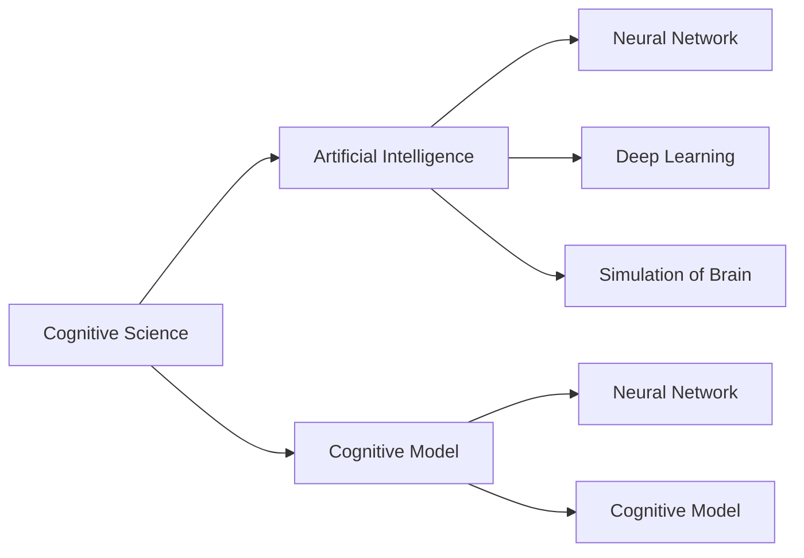

                 

# 认知科学与人工智能：模拟人类思维

> 关键词：认知科学,人工智能,认知模型,神经网络,深度学习,模拟大脑

## 1. 背景介绍

### 1.1 问题由来
人工智能(Artificial Intelligence, AI)已经成为21世纪最具影响力的技术之一。从1950年代的符号主义、1980年代的专家系统，到1990年代至今的神经网络与深度学习，AI已经经历了多个发展阶段。然而，当前的AI更多依赖于算法和数据，对人类认知和思维过程的模拟还很不足。认知科学(Cognitive Science)作为研究人类认知过程和智能的学科，与人工智能领域天然契合，并形成了许多交叉研究方向。

本论文将从认知科学的角度探讨如何模拟人类思维，利用人工智能技术来理解和实现人脑的学习、推理、记忆和决策等智能行为。通过深度学习和神经网络等现代技术，我们希望构建能够模拟人类认知过程的模型，推动人工智能的“认知化”，从而为更高级的人工智能系统和智能化应用提供理论基础和技术支持。

### 1.2 问题核心关键点
人工智能模拟人类思维的核心在于理解和模拟人类认知的机制和过程，包括以下几个关键点：

- 认知过程的建模：包括感知、记忆、推理、决策等基本认知功能的建模。
- 知识表示与提取：将人类知识和经验表示为机器可以理解的形式，并进行有效的提取和应用。
- 跨领域认知模型：将不同认知功能进行整合，构建涵盖多领域知识的认知模型。
- 人机协同学习：与人类共同进行学习和训练，从而提高模型的智能性和适应性。

这些关键点不仅涵盖了当前AI领域的前沿方向，也突出了认知科学对AI发展的推动作用。

## 2. 核心概念与联系

### 2.1 核心概念概述

为更好地理解认知科学与人工智能的模拟人类思维方法，本节将介绍几个密切相关的核心概念：

- 认知科学(Cognitive Science)：研究人类认知过程和智能的学科，涵盖心理学、神经科学、计算机科学等多个领域，旨在理解人类思维的机制。
- 人工智能(Artificial Intelligence)：模拟人类智能行为，通过算法和数据实现问题求解和决策。
- 认知模型(Cognitive Model)：基于认知科学的理论和方法，构建模拟人类思维的计算模型。
- 神经网络(Neural Network)：受人类神经系统的启发，构建模拟神经元相互连接的计算图。
- 深度学习(Deep Learning)：一种利用多层神经网络进行特征学习和决策的机器学习技术。
- 模拟大脑(Brain Simulation)：构建基于神经网络或其他模型，模拟人类大脑结构和功能的计算模型。

这些概念之间的关系通过以下Mermaid流程图进行展示：



这个流程图展示了各个概念之间的逻辑关系：

1. 认知科学作为人工智能的理论与方法基础。
2. 神经网络、深度学习等技术作为实现人工智能的工具。
3. 模拟大脑模型作为认知模型的一种重要实现方式。

## 3. 核心算法原理 & 具体操作步骤

### 3.1 算法原理概述

模拟人类思维的核心算法基于认知科学的研究成果，主要包括以下几个原理：

- 感知输入：模型需要从外界接收各种信息，包括视觉、听觉、触觉等，转化为数字信号进行处理。
- 神经元激活：利用神经网络中的神经元模拟人类大脑中的神经元，进行信息的编码和处理。
- 分布式存储：将知识分布在神经网络的多个层次中，模拟人类大脑中不同区域的功能。
- 神经元连接：通过神经元之间的连接，实现信息在神经网络中的传递和互动。
- 学习与记忆：利用深度学习算法，模型可以从大量数据中学习，存储和提取经验。
- 推理与决策：通过建立推理规则和决策模型，模拟人类逻辑推理和决策过程。

这些原理为认知模型的构建提供了基础，下面详细介绍算法步骤和具体操作步骤。

### 3.2 算法步骤详解

以下是认知模型构建与训练的主要步骤：

**Step 1: 定义认知模型架构**

- 选择合适的神经网络结构，如卷积神经网络(CNN)、循环神经网络(RNN)、变分自编码器(VAE)等。
- 确定神经元的数量和连接方式，根据具体任务需求进行配置。
- 设计模型的输入和输出，包括感知的传感器数据和推理的输出结果。

**Step 2: 数据预处理与标注**

- 收集和整理各种类型的数据，如图像、音频、文本等。
- 对数据进行标注，生成训练集、验证集和测试集。
- 进行数据增强，如旋转、平移、噪声添加等，丰富训练样本的多样性。

**Step 3: 模型训练与优化**

- 使用训练集数据进行模型的前向传播和反向传播训练。
- 选择合适的损失函数，如交叉熵损失、均方误差损失等。
- 使用优化算法如Adam、SGD等，调整模型参数以最小化损失函数。
- 应用正则化技术，如L2正则、Dropout等，防止过拟合。

**Step 4: 模型测试与评估**

- 使用验证集和测试集对模型进行评估。
- 计算各种评估指标，如准确率、召回率、F1分数等。
- 分析模型的优势与不足，进行模型改进。

**Step 5: 模型应用与部署**

- 将训练好的模型应用于实际问题中。
- 进行推理与决策，输出最终的解决方案。
- 使用多种部署方式，如云服务、嵌入式设备等。

### 3.3 算法优缺点

认知模型具有以下优点：

1. 模拟人类认知过程：通过认知模型，可以更好地理解和模拟人类的感知、记忆、推理等智能行为。
2. 多模态融合：认知模型可以同时处理图像、声音、文本等多种类型的数据，模拟人类多模态的感知能力。
3. 分布式存储与计算：通过分布式计算，可以高效处理大规模数据，模拟人类大脑的分布式存储机制。
4. 高鲁棒性与泛化能力：神经网络与深度学习算法具有较强的鲁棒性与泛化能力，能够在复杂环境中取得良好表现。

但同时，认知模型也存在一些缺点：

1. 计算资源消耗大：大规模的神经网络需要大量的计算资源，对硬件设备要求较高。
2. 数据标注成本高：训练认知模型需要大量标注数据，标注成本较高。
3. 模型复杂度高：神经网络结构复杂，训练和调试过程较为繁琐。
4. 可解释性不足：复杂的认知模型往往缺乏可解释性，难以解释其内部工作机制。
5. 脆弱性问题：在极端情况下，模型可能出现过拟合或灾难性遗忘等脆弱性问题。

尽管存在这些局限性，但认知模型仍是大规模学习与模拟人类认知的重要工具，未来仍需不断优化改进。

### 3.4 算法应用领域

认知模型的应用领域非常广泛，包括但不限于：

- 计算机视觉：利用神经网络模拟人眼感知，实现图像分类、目标检测等任务。
- 自然语言处理：模拟人类语言理解与生成，进行情感分析、机器翻译、对话系统等任务。
- 智能推荐系统：通过模拟用户认知与偏好，提供个性化推荐服务。
- 医疗诊断：利用认知模型对医疗数据进行分析和诊断，辅助医生决策。
- 机器人控制：模拟人脑决策过程，使机器人具备更高级的自主决策能力。
- 游戏与娱乐：通过模拟人类认知与情感，构建更加智能和互动的游戏与娱乐系统。

## 4. 数学模型和公式 & 详细讲解

### 4.1 数学模型构建

认知模型的构建基于神经网络的结构和训练原理。以卷积神经网络为例，其主要数学模型如下：

$$
f(x) = \sum_{i=1}^n w_i a_i(x)
$$

其中 $x$ 为输入数据，$n$ 为神经元数量，$w_i$ 为权重，$a_i(x)$ 为第 $i$ 个神经元的激活函数。

### 4.2 公式推导过程

以卷积神经网络的卷积层为例，推导其激活函数和权重更新的公式：

$$
a_i(x) = g(\sum_{j=1}^n w_{ij} f_j(x) + b_i)
$$

其中 $g$ 为激活函数，如ReLU、Sigmoid等，$f_j(x)$ 为第 $j$ 个神经元的输出，$b_i$ 为偏置项。

权重更新公式为：

$$
w_{ij} \leftarrow w_{ij} - \eta \nabla_{w_{ij}} \ell(a_i(x), y)
$$

其中 $\eta$ 为学习率，$\ell$ 为损失函数，$y$ 为真实标签。

### 4.3 案例分析与讲解

以下以图像分类任务为例，讲解卷积神经网络的训练过程：

1. **数据预处理**：将图像数据标准化，转换为网络可以处理的数字信号。
2. **模型定义**：定义卷积层、池化层、全连接层等组件，配置网络结构。
3. **损失函数定义**：选择交叉熵损失函数，用于衡量模型的预测输出与真实标签之间的差异。
4. **前向传播**：将输入数据通过卷积层、池化层等进行特征提取，输出激活值。
5. **反向传播**：计算损失函数对激活值的梯度，并反向传播更新权重。
6. **优化**：使用Adam等优化算法调整权重，最小化损失函数。
7. **评估**：在验证集上评估模型性能，选择合适的模型进行测试。

## 5. 项目实践：代码实例和详细解释说明

### 5.1 开发环境搭建

在进行认知模型开发前，我们需要准备好开发环境。以下是使用Python进行PyTorch开发的环境配置流程：

1. 安装Anaconda：从官网下载并安装Anaconda，用于创建独立的Python环境。

2. 创建并激活虚拟环境：
```bash
conda create -n pytorch-env python=3.8 
conda activate pytorch-env
```

3. 安装PyTorch：根据CUDA版本，从官网获取对应的安装命令。例如：
```bash
conda install pytorch torchvision torchaudio cudatoolkit=11.1 -c pytorch -c conda-forge
```

4. 安装各类工具包：
```bash
pip install numpy pandas scikit-learn matplotlib tqdm jupyter notebook ipython
```

完成上述步骤后，即可在`pytorch-env`环境中开始开发实践。

### 5.2 源代码详细实现

下面我们以图像分类任务为例，给出使用PyTorch实现卷积神经网络的完整代码。

首先，定义卷积神经网络的结构：

```python
import torch
import torch.nn as nn
import torch.nn.functional as F

class ConvNet(nn.Module):
    def __init__(self):
        super(ConvNet, self).__init__()
        self.conv1 = nn.Conv2d(3, 32, 3, padding=1)
        self.pool1 = nn.MaxPool2d(2, 2)
        self.conv2 = nn.Conv2d(32, 64, 3, padding=1)
        self.pool2 = nn.MaxPool2d(2, 2)
        self.fc1 = nn.Linear(7 * 7 * 64, 1024)
        self.fc2 = nn.Linear(1024, 10)
        
    def forward(self, x):
        x = F.relu(self.conv1(x))
        x = F.max_pool2d(x, 2, 2)
        x = F.relu(self.conv2(x))
        x = F.max_pool2d(x, 2, 2)
        x = x.view(-1, 7 * 7 * 64)
        x = F.relu(self.fc1(x))
        x = self.fc2(x)
        return F.log_softmax(x, dim=1)
```

然后，定义训练和评估函数：

```python
import torch.optim as optim

def train(model, train_loader, optimizer, criterion):
    model.train()
    for batch_idx, (data, target) in enumerate(train_loader):
        optimizer.zero_grad()
        output = model(data)
        loss = criterion(output, target)
        loss.backward()
        optimizer.step()
        if batch_idx % 100 == 0:
            print('Train Epoch: {} [{}/{} ({:.0f}%)]\tLoss: {:.6f}'.format(
                epoch, batch_idx * len(data), len(train_loader.dataset),
                100. * batch_idx / len(train_loader), loss.item()))

def evaluate(model, test_loader):
    model.eval()
    total_loss = 0
    correct = 0
    with torch.no_grad():
        for data, target in test_loader:
            output = model(data)
            loss = F.nll_loss(output, target)
            total_loss += loss.item() * data.size(0)
            _, predicted = torch.max(output.data, 1)
            correct += predicted.eq(target).sum().item()

    print('\nTest set: Average loss: {:.4f}, Accuracy: {}/{} ({:.0f}%)\n'.format(
        total_loss / len(test_loader.dataset), correct, 
        len(test_loader.dataset), 100. * correct / len(test_loader.dataset)))
```

最后，启动训练流程并在测试集上评估：

```python
import torchvision.datasets as datasets
import torchvision.transforms as transforms

train_dataset = datasets.CIFAR10(root='./data', train=True, download=True,
                                transform=transforms.ToTensor())
test_dataset = datasets.CIFAR10(root='./data', train=False, download=True,
                               transform=transforms.ToTensor())

train_loader = torch.utils.data.DataLoader(train_dataset, batch_size=64,
                                          shuffle=True, num_workers=2)
test_loader = torch.utils.data.DataLoader(test_dataset, batch_size=64,
                                         shuffle=False, num_workers=2)

model = ConvNet()
optimizer = optim.SGD(model.parameters(), lr=0.01, momentum=0.5)
criterion = nn.NLLLoss()

epochs = 10
for epoch in range(epochs):
    train(model, train_loader, optimizer, criterion)
    evaluate(model, test_loader)
```

以上代码实现了一个简单的卷积神经网络，并进行了图像分类任务的训练和评估。可以看到，利用PyTorch框架，我们能够快速搭建和训练神经网络模型。

### 5.3 代码解读与分析

让我们再详细解读一下关键代码的实现细节：

**ConvNet类**：
- `__init__`方法：定义卷积层、池化层、全连接层等组件，配置网络结构。
- `forward`方法：实现前向传播，通过激活函数进行特征提取，最后输出分类结果。

**train函数**：
- 在前向传播中计算损失函数，并反向传播更新模型参数。
- 在每个epoch结束时输出训练集上的平均loss和准确率。

**evaluate函数**：
- 在测试集上评估模型的平均loss和准确率。
- 使用`torch.no_grad`确保在评估时不更新参数。

**训练流程**：
- 定义训练数据集和测试数据集，并使用`DataLoader`进行批处理。
- 定义卷积神经网络模型，并使用SGD优化算法和NLLLoss损失函数。
- 在多个epoch内进行训练和评估。

## 6. 实际应用场景

### 6.1 智能推荐系统

智能推荐系统是认知模型在实际应用中的重要案例。通过模拟用户的认知过程，推荐系统能够提供更加个性化、精准的推荐服务。

具体而言，推荐系统可以使用神经网络模型对用户的行为数据进行分析，提取用户的兴趣特征。同时，对物品的文本描述、图像等多模态信息进行特征提取，构建综合的推荐模型。通过学习用户和物品的交互数据，推荐系统能够动态调整推荐策略，提供更加符合用户需求的结果。

### 6.2 医疗诊断

医疗领域对认知模型的应用需求尤为迫切。通过模拟医生诊断过程，认知模型可以帮助医生进行疾病诊断和辅助治疗。

在诊断过程中，认知模型可以接收各种类型的医学数据，如CT影像、病历记录、基因数据等，通过多层感知器和卷积神经网络进行特征提取和分析。同时，利用自然语言处理技术，认知模型可以读取和理解病历记录，提取关键信息，辅助医生进行诊断和决策。

### 6.3 游戏与娱乐

游戏和娱乐行业也需要大量的智能交互和模拟决策。通过模拟人类认知过程，游戏和娱乐系统可以提供更加自然和沉浸式的体验。

例如，在角色扮演游戏中，认知模型可以帮助游戏AI实现与玩家的互动，理解玩家的操作意图，做出合理的回应。在虚拟现实(VR)系统中，认知模型可以模拟人的视觉、听觉等感官，实现更加真实的虚拟环境。

## 7. 工具和资源推荐

### 7.1 学习资源推荐

为了帮助开发者系统掌握认知科学与人工智能的模拟人类思维理论基础和实践技巧，这里推荐一些优质的学习资源：

1. 《认知神经科学导论》：Kandel等人著，介绍了认知神经科学的基础理论和应用实例。
2. 《Deep Learning》：Ian Goodfellow等人著，全面介绍了深度学习的基本概念和算法。
3. 《Python深度学习》：Francois Chollet著，通过实际项目和代码演示，系统讲解了深度学习的实现与应用。
4. 《Neuroscience of Learning and Memory》课程：由MIT开设，涵盖认知科学的经典课程，提供丰富的教学资源。
5. 《AI Explainable: Machine Learning Interpretability》课程：由Coursera提供，讲解了机器学习的可解释性方法，适合初学者和进阶者。

通过学习这些资源，相信你一定能够快速掌握认知科学与人工智能的精髓，并用于解决实际的认知模拟问题。

### 7.2 开发工具推荐

高效的开发离不开优秀的工具支持。以下是几款用于认知模型开发的工具：

1. PyTorch：基于Python的开源深度学习框架，灵活的动态计算图，适合快速迭代研究。广泛支持神经网络和深度学习算法的实现。
2. TensorFlow：由Google主导开发的开源深度学习框架，生产部署方便，适合大规模工程应用。提供丰富的神经网络和深度学习库。
3. Weights & Biases：模型训练的实验跟踪工具，可以记录和可视化模型训练过程中的各项指标，方便对比和调优。与主流深度学习框架无缝集成。
4. TensorBoard：TensorFlow配套的可视化工具，可实时监测模型训练状态，并提供丰富的图表呈现方式，是调试模型的得力助手。
5. Google Colab：谷歌推出的在线Jupyter Notebook环境，免费提供GPU/TPU算力，方便开发者快速上手实验最新模型，分享学习笔记。

合理利用这些工具，可以显著提升认知模型开发的效率，加速技术创新和应用落地。

### 7.3 相关论文推荐

认知科学与人工智能的模拟人类思维研究涉及诸多领域，以下是几篇奠基性的相关论文，推荐阅读：

1. "A Computational Model of Human Thought" by J. McClelland：提出了一种基于神经网络的认知模型，模拟人类思维的基本过程。
2. "Deep Learning for NLP" by Y. Bengio：介绍了深度学习在自然语言处理中的应用，包括语言模型、机器翻译等任务。
3. "Cognitive Models of Attention" by F. Wieser：详细介绍了注意力机制在认知模型中的应用，模拟人类注意力的转移和聚焦。
4. "Towards Explainable Artificial Intelligence" by R. Chakrabarti：探讨了人工智能的可解释性问题，提出多种可解释的算法和方法。
5. "Human-Level Concept Learning through Probabilistic Programming" by S. Le：利用概率编程语言模拟人类概念学习，取得了令人瞩目的实验结果。

这些论文代表了大规模学习与模拟人类认知的研究方向，通过学习这些前沿成果，可以帮助研究者把握学科前进方向，激发更多的创新灵感。

## 8. 总结：未来发展趋势与挑战

### 8.1 总结

本文对认知科学与人工智能的模拟人类思维方法进行了全面系统的介绍。首先阐述了认知科学的基础理论和应用，明确了模拟人类思维在人工智能中的重要意义。其次，从原理到实践，详细讲解了认知模型的构建与训练步骤，给出了实际应用中的代码实现。同时，本文还广泛探讨了认知模型在推荐系统、医疗诊断、游戏与娱乐等领域的应用前景，展示了认知模拟的广泛应用场景。

通过本文的系统梳理，可以看到，认知科学与人工智能的模拟人类思维技术正在不断进步，为构建智能系统提供了坚实的理论基础和技术支持。未来，随着认知科学的深入研究，人工智能将更紧密地融合人类认知机制，推动智能系统的智能化和自动化发展。

### 8.2 未来发展趋势

展望未来，认知科学与人工智能的模拟人类思维技术将呈现以下几个发展趋势：

1. 更加智能化的认知模型：未来认知模型将更加深入地模拟人类认知过程，实现更加智能化的决策和推理。
2. 多模态融合与协同建模：认知模型将融合视觉、听觉、触觉等多模态数据，实现多感官信息的协同建模。
3. 跨领域认知模型：认知模型将跨越不同领域，整合跨领域知识，构建更加全面、灵活的认知系统。
4. 人机协同学习：与人类共同进行学习和训练，提高模型的智能性和适应性，形成人机协同的智能系统。
5. 可解释性与透明性：通过引入可解释性技术，增强认知模型的透明性和可解释性，使其易于理解和调试。

这些趋势凸显了认知科学与人工智能的模拟人类思维技术的广阔前景，推动着认知科学与人工智能的进一步融合和发展。

### 8.3 面临的挑战

尽管认知科学与人工智能的模拟人类思维技术已经取得了显著进展，但在实现人类级别的智能模拟过程中，仍面临诸多挑战：

1. 复杂性与高维度：人类认知过程复杂且高维度，模拟这种复杂过程的认知模型需要高度复杂的算法和庞大的数据。
2. 数据与标注成本高：构建高质量的训练数据和标注数据需要大量资源和人力，数据标注成本较高。
3. 计算资源消耗大：大规模的神经网络需要大量的计算资源，对硬件设备要求较高。
4. 可解释性不足：复杂的认知模型往往缺乏可解释性，难以解释其内部工作机制。
5. 鲁棒性问题：认知模型在面对异常数据和噪声时，容易发生错误或过拟合。
6. 伦理与安全问题：模拟人类思维的认知模型可能带来新的伦理与安全问题，如数据隐私、模型偏见等。

尽管存在这些挑战，但通过持续的研究和技术创新，认知科学与人工智能的模拟人类思维技术将不断突破，推动人工智能向更高层次发展。

### 8.4 研究展望

面对认知科学与人工智能的模拟人类思维所面临的挑战，未来的研究需要在以下几个方面寻求新的突破：

1. 建立更加高效的认知模型架构：设计更加灵活、高效的神经网络结构和算法，降低计算资源消耗。
2. 引入跨领域知识与符号化表示：利用符号化知识和先验规则，增强认知模型的泛化能力和鲁棒性。
3. 强化人机协同学习：通过与人类共同学习和训练，提高认知模型的智能性和适应性，形成更加协同的智能系统。
4. 提升认知模型的可解释性：引入可解释性技术，增强认知模型的透明性和可理解性，使其易于调试和维护。
5. 保障数据隐私与安全：在模型训练和应用过程中，注重数据隐私保护和安全性，避免数据滥用和模型偏见。

这些研究方向的探索，必将引领认知科学与人工智能的模拟人类思维技术迈向新的高度，为构建更加智能和可信的认知系统提供坚实的基础。总之，模拟人类思维的认知科学与人工智能技术还需要在理论、算法、工程、伦理等多个维度进行全面创新，才能实现人类级别的智能模拟，推动人工智能技术的全面发展。

## 9. 附录：常见问题与解答

**Q1：如何设计高效的认知模型架构？**

A: 高效的认知模型架构需要考虑以下几个因素：
1. 网络结构：选择合适的神经网络结构，如卷积神经网络、循环神经网络、自编码器等。
2. 层次分布：将知识分布在多个层次中，模拟人类大脑中的分布式存储机制。
3. 参数共享：利用参数共享技术，减少参数数量，提高模型的泛化能力。
4. 稀疏性：通过稀疏化技术，减少冗余参数，提高计算效率。

**Q2：如何提高认知模型的可解释性？**

A: 提高认知模型的可解释性需要从多个方面入手：
1. 可视化：使用可视化工具，展示模型内部的激活值和权重分布。
2. 特征解释：通过特征重要性分析，解释模型对不同输入特征的敏感性。
3. 规则学习：引入规则学习技术，提取模型的内部规则和决策逻辑。
4. 透明性：在模型训练和应用过程中，注重模型的透明性和可理解性，避免黑盒问题。

**Q3：如何处理认知模型的计算资源消耗大问题？**

A: 处理计算资源消耗大的问题需要从以下几个方面入手：
1. 硬件优化：使用GPU/TPU等高性能设备，提高计算速度。
2. 分布式计算：采用分布式计算技术，将计算任务分配到多台机器上。
3. 算法优化：优化神经网络结构和算法，减少计算量。
4. 数据压缩：采用数据压缩技术，减少存储空间和传输带宽。

**Q4：认知模型在面对异常数据时，如何解决鲁棒性问题？**

A: 解决鲁棒性问题需要从以下几个方面入手：
1. 数据增强：通过数据增强技术，增加训练样本的多样性，提高模型的泛化能力。
2. 正则化：应用正则化技术，如L2正则、Dropout等，防止过拟合。
3. 对抗训练：引入对抗样本，提高模型的鲁棒性。
4. 模型融合：通过集成多个模型，提高模型的鲁棒性和泛化能力。

**Q5：如何在实际应用中保障认知模型的数据隐私与安全？**

A: 保障数据隐私与安全需要从以下几个方面入手：
1. 数据加密：对数据进行加密处理，防止数据泄露。
2. 匿名化处理：对数据进行匿名化处理，保护个人隐私。
3. 访问控制：对数据访问进行严格控制，防止未授权访问。
4. 模型监控：在模型应用过程中，实时监控模型的行为，防止数据滥用和模型偏见。

通过合理利用这些方法，可以有效保障认知模型的数据隐私与安全，提高其应用价值和可信度。

---

作者：禅与计算机程序设计艺术 / Zen and the Art of Computer Programming

