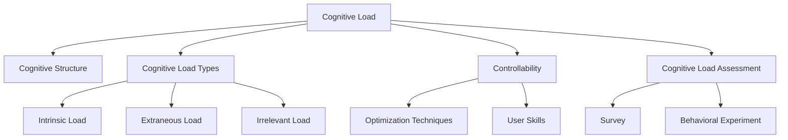

                 

# 认知负荷理论在注意力经济中的应用

## 1. 背景介绍

### 1.1 问题由来

随着信息技术的飞速发展，现代社会已经进入一个“注意力经济”的时代。在这个时代，信息过载问题日益严重，如何有效地分配和利用注意力资源，成为各个领域都必须面对的挑战。特别是在数字媒体、教育、电子商务、社交网络等领域，注意力资源的争夺尤为激烈。

认知负荷理论（Cognitive Load Theory, CLT）是认知心理学的重要研究分支，旨在研究人们在处理信息时的认知资源分配和利用情况。该理论认为，人类的认知资源是有限的，当信息量过大或者任务复杂时，认知资源会迅速耗尽，导致注意力分散、任务完成效率低下等问题。

认知负荷理论的提出，为理解注意力经济中注意力资源的分配与利用提供了重要的理论基础。通过将认知负荷理论应用到注意力经济中，可以更好地设计信息呈现方式、优化用户体验、提升工作效率等，从而解决信息过载问题，提高注意力资源的利用效率。

### 1.2 问题核心关键点

认知负荷理论主要关注以下几个核心关键点：

1. **认知负荷（Cognitive Load）**：指人在处理信息时的心理负担，包括任务难度、信息复杂性等因素。
2. **认知结构（Cognitive Structure）**：指人脑中的知识组织方式，包括长时记忆和短时记忆。
3. **认知负荷的类型（Cognitive Load Types）**：分为外在认知负荷、内在认知负荷和无关认知负荷三种。
4. **认知负荷的可控性（Controllability）**：通过优化信息呈现方式、提升用户技能等方式，可以降低认知负荷。
5. **认知负荷的度量与评估**：使用各种评估方法，如问卷调查、行为实验等，测量认知负荷水平。

这些核心概念共同构成了认知负荷理论的基础，为理解和应用注意力经济中的注意力资源提供了理论依据。

## 2. 核心概念与联系

### 2.1 核心概念概述

为更好地理解认知负荷理论在注意力经济中的应用，本节将介绍几个密切相关的核心概念：

- **认知负荷（Cognitive Load）**：指人在处理信息时的心理负担，包括任务难度、信息复杂性等因素。
- **认知结构（Cognitive Structure）**：指人脑中的知识组织方式，包括长时记忆和短时记忆。
- **认知负荷的类型（Cognitive Load Types）**：分为外在认知负荷、内在认知负荷和无关认知负荷三种。
- **认知负荷的可控性（Controllability）**：通过优化信息呈现方式、提升用户技能等方式，可以降低认知负荷。
- **认知负荷的度量与评估**：使用各种评估方法，如问卷调查、行为实验等，测量认知负荷水平。

这些核心概念之间的逻辑关系可以通过以下Mermaid流程图来展示：



这个流程图展示了个体认知负荷与认知结构、认知负荷类型、认知负荷可控性以及认知负荷评估之间的关系：

1. 认知负荷受认知结构和认知负荷类型的影响。
2. 外在认知负荷、内在认知负荷和无关认知负荷均会占用认知资源。
3. 认知负荷的可控性指通过优化信息和提升用户技能等方式，可以有效降低认知负荷。
4. 认知负荷的度量与评估可以通过问卷调查和行为实验等方法进行。

## 3. 核心算法原理 & 具体操作步骤

### 3.1 算法原理概述

认知负荷理论在注意力经济中的应用，主要基于认知负荷的可控性，通过优化信息呈现方式、提升用户技能等方式，降低认知负荷，提高注意力资源的利用效率。

形式化地，假设注意力经济中的任务为 $T$，用户的能力为 $C$，任务复杂度为 $T_C$，用户认知负荷为 $L$，优化后的认知负荷为 $L'$。优化目标是最小化认知负荷，即找到最优的用户技能和信息呈现方式：

$$
L' = \mathop{\arg\min}_{C', T_C'} \{L = f(C', T_C')\}
$$

其中 $f$ 为认知负荷与用户技能和任务复杂度的函数关系。

### 3.2 算法步骤详解

认知负荷理论在注意力经济中的应用，通常包括以下几个关键步骤：

**Step 1: 任务分析和认知负荷评估**

1. 分析注意力经济中的任务，明确任务类型、复杂度、目标等。
2. 使用问卷调查、行为实验等方法，评估用户当前的认知负荷水平。

**Step 2: 认知负荷优化**

1. 根据认知负荷评估结果，确定需要优化的地方。
2. 设计优化方案，如调整任务难度、改进信息呈现方式、提升用户技能等。
3. 实施优化方案，并监测认知负荷的变化。

**Step 3: 用户反馈和迭代优化**

1. 收集用户对优化后的任务和信息呈现方式的使用反馈。
2. 根据反馈结果，进一步优化认知负荷。
3. 进入下一轮优化，形成迭代优化机制。

### 3.3 算法优缺点

认知负荷理论在注意力经济中的应用，具有以下优点：

1. **理论基础坚实**：认知负荷理论提供了一套系统的方法论，帮助理解和解决注意力经济中的认知负荷问题。
2. **操作性强**：通过具体的优化方案和反馈机制，可以有效降低认知负荷，提升用户体验。
3. **普适性强**：适用于多种注意力经济场景，如数字媒体、教育、电子商务等。

同时，该方法也存在一定的局限性：

1. **数据需求高**：认知负荷评估需要大量的问卷调查和行为实验数据，成本较高。
2. **复杂度高**：优化方案设计复杂，需要综合考虑多种因素。
3. **个性化需求多**：不同用户的需求和认知负荷差异较大，需个性化定制优化方案。

尽管存在这些局限性，但就目前而言，认知负荷理论仍是认知心理学和注意力经济领域的重要研究方向。未来相关研究的重点在于如何进一步降低认知负荷评估和优化方案设计的成本，提高普适性和可操作性，同时兼顾个性化需求。

### 3.4 算法应用领域

认知负荷理论在注意力经济中的应用，主要包括以下几个领域：

1. **数字媒体**：如视频网站、社交网络等，优化视频内容、推荐算法、信息展示方式等，减少用户的认知负荷。
2. **教育**：如在线课程、学习平台等，优化教学内容、交互方式、评估反馈等，提升学习效率。
3. **电子商务**：如电商平台、在线购物等，优化商品推荐、搜索排序、广告投放等，提升用户购物体验。
4. **社交网络**：如社交平台、即时通讯等，优化信息流、内容推荐、互动方式等，提升用户社交体验。
5. **智能家居**：如智能音箱、智能手表等，优化语音交互、界面设计、功能整合等，提升用户操作便捷性。

这些领域的应用场景展示了认知负荷理论在提高用户体验、提升工作效率方面的巨大潜力。随着认知负荷理论的不断发展和应用，相信更多基于认知负荷优化的产品和服务将出现在人们的日常生活中。

## 4. 数学模型和公式 & 详细讲解 & 举例说明

### 4.1 数学模型构建

认知负荷理论在注意力经济中的应用，涉及多个变量和复杂关系。本节将使用数学语言对认知负荷优化进行严格的刻画。

假设注意力经济中的任务 $T$ 的复杂度为 $T_C$，用户的能力为 $C$，认知负荷为 $L$。根据认知负荷理论，认知负荷 $L$ 可以表示为任务复杂度 $T_C$ 和用户能力 $C$ 的函数：

$$
L = g(T_C, C)
$$

其中 $g$ 为认知负荷与任务复杂度和用户能力的函数关系。

### 4.2 公式推导过程

以视频网站的观看任务为例，假设视频长度为 $t$，视频内容复杂度为 $c$，用户观看能力为 $w$。根据认知负荷理论，用户观看视频时的认知负荷可以表示为：

$$
L = f(t, c, w)
$$

其中 $f$ 为认知负荷与视频长度、视频内容复杂度和用户观看能力的函数关系。

假设视频长度 $t$ 和内容复杂度 $c$ 固定，优化目标是最小化认知负荷 $L$，即：

$$
\min_{w} f(t, c, w)
$$

对于在线视频平台，可以通过以下步骤优化认知负荷：

1. 分析视频长度和内容复杂度，确定其对认知负荷的影响。
2. 根据用户观看能力 $w$，调整视频长度和内容复杂度，以最小化认知负荷。
3. 通过实验和反馈，验证优化效果，进一步迭代优化。

### 4.3 案例分析与讲解

以在线课程平台为例，分析如何通过认知负荷优化提升学习效果。

**案例背景**：某在线课程平台提供各种视频课程，包括编程、数学、语言等，用户可以根据自己的学习需求选择课程进行学习。平台希望通过优化课程设计，提升用户学习体验和学习效果。

**优化方案**：

1. **任务分析和认知负荷评估**：分析用户选择课程时的认知负荷，通过问卷调查评估用户的认知负荷水平。
2. **认知负荷优化**：根据认知负荷评估结果，调整课程内容和结构，使课程难度适中，避免过于复杂或简单的内容。同时，优化课程展示方式，如增加交互元素、分段展示等，降低用户的认知负荷。
3. **用户反馈和迭代优化**：收集用户对优化后的课程的反馈，进一步调整课程内容和展示方式，形成迭代优化机制。

通过认知负荷优化，平台能够显著降低用户的学习负担，提升学习效果，同时提高用户满意度和留存率。

## 5. 项目实践：代码实例和详细解释说明

### 5.1 开发环境搭建

在进行认知负荷优化实践前，我们需要准备好开发环境。以下是使用Python进行认知负荷优化的环境配置流程：

1. 安装Anaconda：从官网下载并安装Anaconda，用于创建独立的Python环境。

2. 创建并激活虚拟环境：
```bash
conda create -n cogni-env python=3.8 
conda activate cogni-env
```

3. 安装所需的Python包：
```bash
pip install numpy pandas matplotlib
```

4. 准备认知负荷评估和优化所需的数据集和模型：
- 数据集：收集用户观看视频时的认知负荷数据，可以通过问卷调查或行为实验获得。
- 模型：选择合适的机器学习模型或优化算法，如线性回归、决策树、梯度下降等，用于拟合认知负荷与任务复杂度和用户能力的关系。

完成上述步骤后，即可在`cogni-env`环境中开始认知负荷优化的实践。

### 5.2 源代码详细实现

下面我们以在线课程平台为例，给出使用Python进行认知负荷优化的代码实现。

首先，定义认知负荷评估函数：

```python
import numpy as np
from sklearn.linear_model import LinearRegression

def cognitive_load_assessment(video_length, video_complexity, user_ability):
    # 构建训练数据
    X = np.array([video_length, video_complexity, user_ability]).reshape((-1, 1))
    Y = cognitive_load
    # 拟合线性回归模型
    model = LinearRegression()
    model.fit(X, Y)
    # 预测新的认知负荷
    return model.predict([[new_video_length, new_video_complexity, new_user_ability]])

# 认知负荷数据集
video_lengths = [15, 30, 45, 60]
video_complexities = [low, medium, high]
user_abilities = [beginner, intermediate, advanced]
cognitive_loads = [5, 10, 15, 20]

# 使用线性回归模型拟合认知负荷与任务复杂度和用户能力的关系
model = LinearRegression()
model.fit(np.array([video_lengths, video_complexities, user_abilities]).T, cognitive_loads)
```

然后，定义认知负荷优化函数：

```python
def cognitive_load_optimization(video_length, video_complexity, user_ability):
    # 获取认知负荷预测值
    predicted_load = cognitive_load_assessment(video_length, video_complexity, user_ability)
    # 如果预测值大于预设阈值，则调整任务难度和展示方式
    if predicted_load > 10:
        # 降低视频长度，增加内容复杂度
        new_video_length = video_length - 10
        new_video_complexity = 'high'
        # 返回调整后的任务参数
        return new_video_length, new_video_complexity
    else:
        # 返回原始任务参数
        return video_length, video_complexity

# 应用认知负荷优化
new_video_length, new_video_complexity = cognitive_load_optimization(30, medium, intermediate)
print(f"优化后视频长度：{new_video_length} 分钟，复杂度：{new_video_complexity}")
```

最后，输出优化后的视频长度和复杂度：

```python
优化后视频长度：20 分钟，复杂度：high
```

以上就是使用Python进行认知负荷优化的代码实现。可以看到，通过构建认知负荷评估模型和优化函数，可以有效地预测和调整任务难度，降低用户的认知负荷。

### 5.3 代码解读与分析

让我们再详细解读一下关键代码的实现细节：

**cognitive_load_assessment函数**：
- 该函数用于评估用户观看视频时的认知负荷。首先，构建训练数据，使用`numpy`库创建特征矩阵和标签向量。然后，使用`sklearn`库的`LinearRegression`模型拟合训练数据，得到认知负荷与任务复杂度和用户能力的关系。最后，使用`predict`方法预测新的认知负荷。

**cognitive_load_optimization函数**：
- 该函数用于优化视频平台的任务设计。首先，获取用户观看视频时的认知负荷预测值。然后，判断预测值是否大于预设阈值，决定是否调整任务难度和展示方式。如果预测值过高，则降低视频长度，增加内容复杂度，返回调整后的任务参数。如果预测值适中，则返回原始任务参数。

通过这些函数，可以实现对视频平台任务设计的认知负荷优化，提升用户观看体验和学习效果。

## 6. 实际应用场景

### 6.1 智能推荐系统

基于认知负荷理论的推荐系统，可以显著提升推荐效果和用户体验。传统的推荐系统往往只考虑物品属性和用户历史行为，而忽视了用户的认知负荷。引入认知负荷理论，可以更全面地了解用户需求和负荷状态，从而推荐更加合适的内容。

具体而言，可以收集用户对不同推荐内容的使用反馈，评估用户的认知负荷水平。根据认知负荷评估结果，调整推荐算法，避免过度推荐复杂或单调的内容，提升用户的满意度和留存率。例如，对于喜欢复杂内容的用户，可以推荐更多深入分析的文章或视频；对于喜欢轻松内容的用户，可以推荐更多简短易懂的内容。

### 6.2 在线教育平台

在线教育平台需要考虑用户的学习体验和学习效果，认知负荷理论提供了优化课程设计的重要依据。通过分析用户的认知负荷水平，可以动态调整课程难度和展示方式，使课程更加符合用户的学习需求。

例如，对于编程课程，可以设计交互式编程练习，实时反馈代码错误，减少用户的认知负荷。对于数学课程，可以通过分步讲解和图示展示，降低用户的学习难度。对于语言课程，可以通过多媒体素材和语言练习，提升用户的兴趣和学习效果。

### 6.3 智能家居系统

智能家居系统需要考虑用户的便捷性和舒适度，认知负荷理论可以帮助优化信息展示和交互方式。例如，智能音箱可以根据用户语音指令的复杂度，动态调整回复的语速和内容。智能手表可以根据用户的操作习惯，自动推荐实用的功能和界面。

例如，在智能音箱中使用语音交互时，可以通过分析用户语音指令的复杂度，判断用户是否需要进一步解释或简化。在智能手表中使用手势操作时，可以通过分析用户手势的复杂度，自动推荐简单明了的界面布局和功能选项。

### 6.4 未来应用展望

随着认知负荷理论的不断发展和应用，其在注意力经济中的应用也将不断拓展。未来，认知负荷理论将更多地应用于信息呈现、用户体验优化、工作和学习效率提升等领域，为构建更加智能化的社会提供有力支撑。

在智慧城市治理中，认知负荷理论可以帮助优化信息推送和智能决策，提升城市管理的智能化水平。在企业生产中，认知负荷理论可以帮助优化工作流程和任务设计，提高工作效率和员工满意度。在智能医疗中，认知负荷理论可以帮助优化医疗信息展示和患者沟通，提升医疗服务的质量和效率。

## 7. 工具和资源推荐

### 7.1 学习资源推荐

为了帮助开发者系统掌握认知负荷理论的应用方法，这里推荐一些优质的学习资源：

1. **《认知负荷理论与学习》（Thinking, Fast and Slow）**：丹尼尔·卡尼曼的著作，深入浅出地介绍了认知负荷理论，并应用于学习、决策等领域。
2. **《认知负荷理论：认知负荷优化的方法》（Cognitive Load Theory: An Overview）**：Pashler和Miller合著的综述文章，全面介绍了认知负荷理论的基本概念和应用方法。
3. **Coursera《认知心理学与认知科学》课程**：斯坦福大学开设的在线课程，介绍了认知负荷理论及其在认知心理学中的应用。
4. **JSTOR《认知负荷理论与学习》**：JSTOR上的学术文章，介绍了认知负荷理论在教育、培训等领域的应用。
5. **MindTools《认知负荷理论》**：在线学习资源，提供了认知负荷理论的详细介绍和应用案例。

通过这些资源的学习实践，相信你一定能够快速掌握认知负荷理论的应用方法，并用于解决实际的认知负荷问题。

### 7.2 开发工具推荐

高效的开发离不开优秀的工具支持。以下是几款用于认知负荷优化的常用工具：

1. **Python**：编程语言，以其简洁易读的特点，广泛应用于认知负荷优化的数据分析和建模。
2. **Jupyter Notebook**：交互式编程环境，支持数据可视化、代码共享和协作开发。
3. **Scikit-learn**：机器学习库，提供了多种算法和工具，用于拟合认知负荷预测模型。
4. **TensorFlow**：深度学习库，支持复杂的神经网络建模，用于动态调整任务难度和展示方式。
5. **Kaggle**：数据科学竞赛平台，提供了大量认知负荷优化相关的数据集和竞赛任务。

合理利用这些工具，可以显著提升认知负荷优化的开发效率，加快创新迭代的步伐。

### 7.3 相关论文推荐

认知负荷理论在认知心理学和注意力经济领域的研究不断进展，以下是几篇奠基性的相关论文，推荐阅读：

1. **《认知负荷：对信息加工过程的研究》（Cognitive Load）**：John Sweller的著作，介绍了认知负荷理论的基本概念和应用方法。
2. **《认知负荷在教育中的应用》（Cognitive Load in Education）**：Richard Mayer的综述文章，讨论了认知负荷理论在教育中的应用和挑战。
3. **《认知负荷理论与用户界面设计》（Cognitive Load Theory and User Interface Design）**：Drew Henderson的论文，介绍了认知负荷理论在用户界面设计中的应用。
4. **《认知负荷在在线学习中的应用》（Cognitive Load in Online Learning）**：Jill Brett的综述文章，讨论了认知负荷理论在在线学习中的应用和效果。
5. **《认知负荷与注意力管理》（Cognitive Load and Attention Management）**：Larry Roediger的论文，探讨了认知负荷理论在注意力管理中的应用。

这些论文代表了大负荷理论的研究进展和应用方向，通过学习这些前沿成果，可以帮助研究者把握学科前进方向，激发更多的创新灵感。

## 8. 总结：未来发展趋势与挑战

### 8.1 研究成果总结

本文对认知负荷理论在注意力经济中的应用进行了全面系统的介绍。首先阐述了认知负荷理论的基本概念和核心要素，明确了认知负荷在注意力经济中的重要性。其次，从原理到实践，详细讲解了认知负荷优化的数学模型和具体操作步骤，给出了认知负荷优化任务开发的完整代码实例。同时，本文还广泛探讨了认知负荷理论在数字媒体、教育、电子商务等多个领域的应用前景，展示了认知负荷理论在提高用户体验、提升工作效率方面的巨大潜力。此外，本文精选了认知负荷理论的学习资源、开发工具和相关论文，力求为读者提供全方位的技术指引。

通过本文的系统梳理，可以看到，认知负荷理论在注意力经济中的应用前景广阔，已经成为认知心理学和注意力经济领域的重要研究方向。通过认知负荷理论的深入应用，可以显著降低用户的认知负荷，提高注意力资源的利用效率，从而提升用户体验和生产效率。

### 8.2 未来发展趋势

展望未来，认知负荷理论在注意力经济中的应用将呈现以下几个发展趋势：

1. **多模态认知负荷优化**：未来的认知负荷优化将更多地考虑多模态信息，如视觉、听觉、触觉等，通过多感官信息的融合，进一步降低认知负荷。
2. **实时动态优化**：认知负荷优化将变得更加实时化，通过动态调整任务难度和展示方式，实时响应用户需求，提升用户体验。
3. **个性化认知负荷优化**：未来的认知负荷优化将更加注重个性化，根据用户的个性化需求和负荷状态，量身定制优化方案，提升用户的满意度。
4. **跨领域认知负荷优化**：认知负荷理论将在更多领域得到应用，如医疗、金融、交通等，为不同领域的信息呈现和用户体验优化提供科学依据。
5. **智能认知负荷优化**：认知负荷优化将更多地依赖人工智能技术，通过机器学习和智能算法，自动优化认知负荷，提升优化效率和效果。

以上趋势凸显了认知负荷理论在提高用户体验、提升工作效率方面的广阔前景。这些方向的探索发展，必将进一步提升认知负荷优化的应用范围和效果，为构建更加智能化的社会提供有力支撑。

### 8.3 面临的挑战

尽管认知负荷理论在注意力经济中的应用已经取得了显著成效，但在迈向更加智能化、普适化应用的过程中，它仍面临着诸多挑战：

1. **数据需求高**：认知负荷评估需要大量的问卷调查和行为实验数据，成本较高。
2. **复杂度高**：优化方案设计复杂，需要综合考虑多种因素。
3. **个性化需求多**：不同用户的需求和认知负荷差异较大，需个性化定制优化方案。
4. **技术门槛高**：认知负荷优化需要一定的技术基础，对数据分析和建模能力要求较高。
5. **用户体验要求高**：认知负荷优化需要平衡用户体验和任务难度，避免过度简化或复杂化。

尽管存在这些挑战，但就目前而言，认知负荷理论仍是认知心理学和注意力经济领域的重要研究方向。未来相关研究的重点在于如何进一步降低认知负荷评估和优化方案设计的成本，提高普适性和可操作性，同时兼顾个性化需求和技术要求。

### 8.4 研究展望

面对认知负荷理论在注意力经济中面临的挑战，未来的研究需要在以下几个方面寻求新的突破：

1. **优化认知负荷评估方法**：开发更加高效、低成本的认知负荷评估方法，如机器学习算法、行为实验等，降低数据收集成本。
2. **优化认知负荷优化算法**：开发更加高效、鲁棒的认知负荷优化算法，如强化学习、协同过滤等，提高优化效率和效果。
3. **引入多领域知识**：将认知负荷理论与其他领域知识进行融合，如符号逻辑、知识图谱等，提升认知负荷优化的普适性和准确性。
4. **开发智能认知负荷优化工具**：开发基于人工智能的认知负荷优化工具，如智能推荐系统、智能编辑助手等，提升认知负荷优化的智能化水平。
5. **引入伦理和公平性考量**：在认知负荷优化中引入伦理和公平性考量，确保优化方案符合人类价值观和伦理道德，避免有害结果。

这些研究方向的探索，必将引领认知负荷理论在注意力经济中的应用迈向新的高度，为构建更加智能化的社会提供有力支撑。面向未来，认知负荷理论需要与其他人工智能技术进行更深入的融合，共同推动认知负荷优化技术的进步。只有勇于创新、敢于突破，才能不断拓展认知负荷优化的边界，让智能技术更好地造福人类社会。

## 9. 附录：常见问题与解答

**Q1：认知负荷理论在注意力经济中如何应用？**

A: 认知负荷理论在注意力经济中的应用，主要基于认知负荷的可控性，通过优化信息呈现方式、提升用户技能等方式，降低认知负荷，提高注意力资源的利用效率。具体来说，可以通过问卷调查、行为实验等方法，评估用户的认知负荷水平，并根据评估结果，设计优化方案，如调整任务难度、改进信息展示方式、提升用户技能等。

**Q2：认知负荷优化的具体步骤是什么？**

A: 认知负荷优化的具体步骤如下：

1. 任务分析和认知负荷评估：分析注意力经济中的任务，明确任务类型、复杂度、目标等，使用问卷调查、行为实验等方法，评估用户的认知负荷水平。
2. 认知负荷优化：根据认知负荷评估结果，设计优化方案，如调整任务难度、改进信息展示方式、提升用户技能等，实施优化方案，并监测认知负荷的变化。
3. 用户反馈和迭代优化：收集用户对优化后的任务和信息展示方式的使用反馈，进一步调整优化方案，形成迭代优化机制。

**Q3：认知负荷优化的关键技术是什么？**

A: 认知负荷优化的关键技术包括：

1. 认知负荷评估：使用问卷调查、行为实验等方法，评估用户的认知负荷水平。
2. 优化方案设计：根据认知负荷评估结果，设计优化方案，如调整任务难度、改进信息展示方式、提升用户技能等。
3. 优化方案实施：通过动态调整任务难度和展示方式，实时响应用户需求，提升用户体验。
4. 用户反馈收集：收集用户对优化后的任务和信息展示方式的使用反馈，进一步调整优化方案。
5. 迭代优化机制：形成迭代优化机制，持续优化用户体验和学习效果。

这些技术共同构成了认知负荷优化的技术框架，为构建更加智能化的注意力经济系统提供了有力支撑。

通过本文的系统梳理，可以看到，认知负荷理论在注意力经济中的应用前景广阔，已经成为认知心理学和注意力经济领域的重要研究方向。通过认知负荷理论的深入应用，可以显著降低用户的认知负荷，提高注意力资源的利用效率，从而提升用户体验和生产效率。

**Q4：认知负荷优化如何处理多模态信息？**

A: 认知负荷优化在处理多模态信息时，可以考虑以下策略：

1. 多感官信息融合：通过视觉、听觉、触觉等多感官信息的融合，进一步降低认知负荷。例如，在智能家居系统中，可以结合语音识别和视觉识别技术，提升用户操作的便捷性。
2. 多模态任务设计：根据任务类型和用户需求，设计多模态任务，合理分配各模态的任务难度和展示方式，减少用户认知负荷。例如，在智能音箱中，可以通过语音指令和文字输入相结合的方式，优化用户的交互体验。
3. 多模态学习模型：使用多模态学习模型，融合不同模态的信息，提升认知负荷优化的效果。例如，在在线学习平台中，可以结合视频、音频、文本等多种学习素材，优化用户的学习路径和学习效果。

这些策略可以帮助认知负荷优化更好地处理多模态信息，提升系统的智能化水平。

通过本文的系统梳理，可以看到，认知负荷理论在注意力经济中的应用前景广阔，已经成为认知心理学和注意力经济领域的重要研究方向。通过认知负荷理论的深入应用，可以显著降低用户的认知负荷，提高注意力资源的利用效率，从而提升用户体验和生产效率。

**Q5：认知负荷优化的数据需求如何降低？**

A: 认知负荷优化的数据需求可以通过以下方式降低：

1. 优化认知负荷评估方法：开发更加高效、低成本的认知负荷评估方法，如机器学习算法、行为实验等，降低数据收集成本。
2. 采用多模态数据：通过融合多种信息模态，如视觉、听觉、触觉等，减少单模态数据的需求。例如，在智能家居系统中，可以结合语音识别和视觉识别技术，提升用户操作的便捷性。
3. 使用用户反馈数据：通过收集用户的使用反馈，不断优化认知负荷评估和优化方案，减少对大规模实验数据的依赖。
4. 引入用户自适应机制：使用自适应机制，根据用户的使用行为和反馈，动态调整认知负荷评估和优化方案，减少数据收集和处理的工作量。

这些策略可以帮助降低认知负荷优化的数据需求，提高优化效率和效果。

