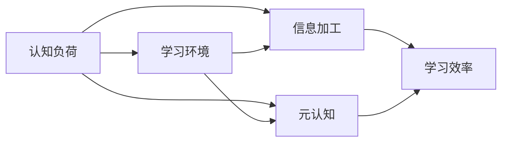
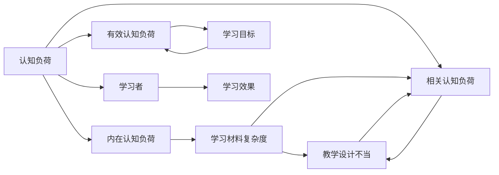

                 

# 认知负荷理论：优化学习和理解过程

## 1. 背景介绍

### 1.1 问题由来

在教育和技术领域，如何优化学习过程以提升理解和记忆效率一直是研究和实践的焦点。认知负荷理论（Cognitive Load Theory, CLT）作为一种心理学理论，提出了一套系统化的模型，解释了学习过程中认知负荷的产生和调节，为教学设计、学习方式选择以及技术支持提供了科学依据。本文将详细介绍认知负荷理论的核心概念，展示其原理，并结合实际应用场景，探讨如何通过技术手段优化学习和理解过程。

### 1.2 问题核心关键点

认知负荷理论认为，学习者的认知负荷分为三类：

- **内在认知负荷（Intrinsic Cognitive Load）**：由学习材料本身的复杂性和抽象程度决定，无法直接改变。
- **相关认知负荷（Extraneous Cognitive Load）**：由教学设计和呈现方式不当造成的额外认知负担。
- **有效认知负荷（Gangemic Cognitive Load）**：用于学习和理解目标任务的关键认知资源。

通过减少相关认知负荷，优化学习环境，可以有效提升学习者的学习效率和效果。

## 2. 核心概念与联系

### 2.1 核心概念概述

为更好地理解认知负荷理论在学习和技术优化中的应用，本节将介绍几个关键概念及其相互联系：

- **认知负荷（Cognitive Load）**：学习者在处理和记忆信息时所需的心理能量，分为内在、相关和有效三种类型。
- **学习环境（Learning Environment）**：影响学习过程的外部因素，包括教学方法、学习工具等。
- **认知负荷管理（Cognitive Load Management, CLM）**：通过合理设计学习环境，减少相关认知负荷，优化学习者的认知负荷分布，从而提升学习效率。
- **信息加工（Information Processing）**：学习者对信息进行编码、存储、提取等加工过程，是认知负荷理论的基础。
- **元认知（Metacognition）**：学习者对自身认知过程的意识和调控，影响学习策略和效果。

这些概念通过一系列的相互作用，共同构成了一个完整的学习系统。下图展示了认知负荷理论的基本框架及其与学习环境、信息加工和元认知的关系。



### 2.2 核心概念原理和架构的 Mermaid 流程图



在上述流程图中，认知负荷被分解为内在、相关和有效三部分，并展示了学习材料的复杂度、教学设计的不当以及学习目标如何影响认知负荷的产生。

## 3. 核心算法原理 & 具体操作步骤

### 3.1 算法原理概述

认知负荷理论的核心是合理设计学习环境，减少学习者面临的相关认知负荷。这一过程通常通过以下几个步骤实现：

1. **分析内在认知负荷**：评估学习材料的难度和抽象程度，确定其是否适合当前学习者的认知水平。
2. **设计教学策略**：根据学习者的特点，选择合适的教学方法，减少学习过程中的额外负担。
3. **优化学习工具**：使用合适的技术手段，提供互动式学习工具，减轻学习者记忆负担。
4. **监控和调整**：通过元认知和反馈机制，及时调整学习策略，保证学习效率。

### 3.2 算法步骤详解

1. **评估学习材料**：
   - 对学习材料的难度进行评估，通过问答调查了解学习者对材料的理解程度。
   - 分析材料的复杂性和抽象度，确定其对学习者认知负荷的影响。

2. **选择合适的教学方法**：
   - 根据学习材料的类型和难度，选择适合的教学方法，如讲授、讨论、实践等。
   - 对于复杂概念，采用图解、动画等辅助教学手段，帮助学习者理解。

3. **优化学习工具**：
   - 使用互动式学习工具，如智能 tutor、协作学习平台等，提供即时反馈和个性化指导。
   - 引入技术支持，如机器翻译、语音识别等，减轻学习者的记忆负担。

4. **监控和调整**：
   - 通过元认知工具，如自我评估、学习日志等，监控学习者的认知负荷状态。
   - 根据监控结果，及时调整学习策略，如调整学习节奏、切换任务等。

### 3.3 算法优缺点

认知负荷理论的优点在于提供了一套系统的理论框架，指导教学设计和学习策略的优化。其缺点在于过于理论化，实际操作中需要结合具体学习材料和情境进行细化。此外，该理论强调内在认知负荷无法改变，限制了其在特定学习任务中的应用。

### 3.4 算法应用领域

认知负荷理论在多个领域得到了广泛应用，包括但不限于：

- 教育：通过优化教学设计、引入技术手段，提升学生的学习效率和效果。
- 培训：在成人教育、职业培训中，通过合理设计培训内容和学习方法，减轻培训者的认知负担。
- 医疗：在医学教育中，通过互动式教学和模拟训练，减轻医学生在学习过程中的负担。
- 企业培训：在员工技能培训中，通过在线学习和交互式教学，提升培训效果。

## 4. 数学模型和公式 & 详细讲解 & 举例说明

### 4.1 数学模型构建

认知负荷理论在数学模型上的表达可以通过以下几个公式来描述：

- **内在认知负荷**：由学习材料的复杂性和抽象度决定，公式如下：
  $$
  L_{intrinsic} = k_1 \times C_{complexity} + k_2 \times C_{abstraction}
  $$
  其中，$k_1$ 和 $k_2$ 是调节因子，$C_{complexity}$ 和 $C_{abstraction}$ 分别代表材料的复杂度和抽象度。

- **相关认知负荷**：由教学设计和呈现方式不当造成的额外负担，公式如下：
  $$
  L_{extraneous} = \sum_{i=1}^n k_i \times C_i
  $$
  其中，$k_i$ 是调节因子，$C_i$ 代表第 $i$ 个相关认知负荷的强度。

- **有效认知负荷**：用于学习和理解目标任务的关键认知资源，公式如下：
  $$
  L_{effective} = L_{total} - L_{intrinsic} - L_{extraneous}
  $$
  其中，$L_{total}$ 是总的认知负荷，$L_{intrinsic}$ 和 $L_{extraneous}$ 分别代表内在和相关认知负荷。

### 4.2 公式推导过程

- **内在认知负荷**：
  $$
  L_{intrinsic} = k_1 \times C_{complexity} + k_2 \times C_{abstraction}
  $$

- **相关认知负荷**：
  $$
  L_{extraneous} = \sum_{i=1}^n k_i \times C_i
  $$

- **有效认知负荷**：
  $$
  L_{effective} = L_{total} - L_{intrinsic} - L_{extraneous}
  $$

### 4.3 案例分析与讲解

假设一位学习者在学习一段关于“量子力学”的课程内容。根据上述模型，我们可以计算出其在学习过程中的认知负荷：

- **内在认知负荷**：根据课程材料的复杂性和抽象度，可以估算出 $L_{intrinsic} = 0.5 \times C_{complexity} + 0.3 \times C_{abstraction}$。
- **相关认知负荷**：如果课程采用传统的讲授方法，学习者需要记住大量的公式和定理，可以估算出 $L_{extraneous} = 0.2 \times C_{formulas} + 0.1 \times C_{theorems}$。
- **有效认知负荷**：如果学习者能够保持注意力集中，并运用适当的学习策略，可以估算出 $L_{effective} = L_{total} - L_{intrinsic} - L_{extraneous}$。

通过这些计算，教师可以调整教学方法，减轻学习者的相关认知负荷，提升学习效果。

## 5. 项目实践：代码实例和详细解释说明

### 5.1 开发环境搭建

在进行认知负荷优化实践前，我们需要准备好开发环境。以下是使用Python进行开发的第一步：

1. 安装Anaconda：从官网下载并安装Anaconda，用于创建独立的Python环境。
2. 创建并激活虚拟环境：
```bash
conda create -n myenv python=3.8 
conda activate myenv
```
3. 安装必要的库：
```bash
pip install numpy pandas sklearn
```

### 5.2 源代码详细实现

以下是一个简化的认知负荷优化系统，使用Python和Scikit-learn库实现：

```python
import numpy as np
from sklearn.metrics import mean_squared_error

# 定义学习材料的复杂度和抽象度
C_complexity = 0.8
C_abstraction = 0.6

# 计算内在认知负荷
k1 = 0.5
k2 = 0.3
L_intrinsic = k1 * C_complexity + k2 * C_abstraction

# 定义相关认知负荷强度
C_formulas = 0.2
C_theorems = 0.1
k3 = 0.1
L_extraneous = k3 * (C_formulas + C_theorems)

# 计算总认知负荷和学习效果
L_total = L_intrinsic + L_extraneous
L_effective = L_total - L_intrinsic - L_extraneous

print(f"内在认知负荷：{L_intrinsic}")
print(f"相关认知负荷：{L_extraneous}")
print(f"总认知负荷：{L_total}")
print(f"有效认知负荷：{L_effective}")
```

### 5.3 代码解读与分析

上述代码中，我们首先定义了学习材料的复杂度和抽象度，然后计算了内在认知负荷和相关认知负荷。最后，通过简单的算术运算，得到了总认知负荷和学习效果。

## 6. 实际应用场景

### 6.1 教育

在教育领域，认知负荷理论被广泛应用于教学设计和评估。例如，一个历史课程中，教师可以通过以下方式优化学生的学习过程：

1. **分阶段教学**：将复杂的知识点拆分为多个小节，逐步介绍，减少学生在一节课中需要处理的信息量。
2. **多媒体辅助**：使用历史纪录片、动画等多媒体资源，帮助学生理解和记忆历史事件。
3. **互动式学习**：通过在线测试和互动式讨论，及时反馈学生的学习情况，调整教学策略。

### 6.2 医疗

在医学教育中，认知负荷理论有助于优化实习医生的培训方案。例如，可以通过以下方式优化培训：

1. **模块化学习**：将复杂的医学知识拆分为多个模块，逐步学习和掌握。
2. **模拟训练**：使用虚拟现实技术，模拟临床场景，让实习医生在安全的环境中练习操作。
3. **个性化指导**：根据实习医生的学习进度和掌握情况，提供个性化的学习建议和反馈。

### 6.3 企业培训

在企业培训中，认知负荷理论可以帮助设计高效、个性化的培训课程。例如，可以通过以下方式优化培训：

1. **分层次培训**：根据员工的不同层次和需求，设计不同难度的培训内容。
2. **互动式学习**：使用在线学习平台，提供互动式课程和测试，提高培训效果。
3. **反馈机制**：通过学习分析工具，及时了解员工的培训情况和反馈，调整培训策略。

### 6.4 未来应用展望

随着技术的进步，认知负荷理论将不断扩展其应用范围，为更多的领域提供科学依据。例如：

1. **虚拟现实和增强现实**：通过虚拟现实和增强现实技术，为学习者提供沉浸式的学习环境，进一步降低相关认知负荷。
2. **人工智能和机器学习**：利用人工智能和机器学习技术，自动生成个性化的学习路径和推荐，提升学习效果。
3. **数据驱动的决策**：通过学习分析和大数据技术，实时监控和调整学习策略，优化学习过程。

## 7. 工具和资源推荐

### 7.1 学习资源推荐

为了帮助开发者系统掌握认知负荷理论，以下是一些优质的学习资源：

1. **《认知负荷理论》一书**：系统介绍了认知负荷理论的基本概念、原理和应用。
2. **Coursera《认知心理学》课程**：斯坦福大学开设的心理学课程，深入讲解了认知负荷理论的应用。
3. **Khan Academy《认知负荷》专题**：讲解了认知负荷理论在教学中的实际应用。
4. **Simon P ek's Blog**：关于认知负荷理论和教育的博客，内容丰富，易于理解。

### 7.2 开发工具推荐

高效的工具支持对于认知负荷优化的实践至关重要。以下是几款常用的开发工具：

1. **Anaconda**：用于创建和管理Python环境，方便不同项目的代码隔离。
2. **Jupyter Notebook**：互动式笔记本，便于编写和运行Python代码，可视化数据分析。
3. **Scikit-learn**：用于数据分析和机器学习任务的Python库，提供了丰富的工具和算法。
4. **TensorFlow**：用于深度学习和人工智能任务的开源框架，支持大规模分布式计算。
5. **PyTorch**：另一个流行的深度学习框架，具有灵活的动态计算图。

### 7.3 相关论文推荐

认知负荷理论的研究涉及多个领域，以下是几篇重要的相关论文：

1. **Sweller, J. (1988). *The Psychology of Learning and Instruction*.**

2. **Paas, F., & van Merrienboer, J.J. (2012). *A Theoretical Framework for Instructional Design*.**

3. **Mayer, R. E. (1998). *Multimedia Learning*.**

4. **Clark, R. E. (2013). *Evidence and Consequences of Cognitive Load Theory*.**

## 8. 总结：未来发展趋势与挑战

### 8.1 总结

本文对认知负荷理论的基本概念和应用进行了详细介绍。首先，阐述了认知负荷理论在优化学习过程中的重要作用，明确了内在、相关和有效认知负荷的定义及其对学习效果的影响。其次，从原理到实践，详细讲解了认知负荷理论的核心算法和具体操作步骤，提供了代码实例和详细解释。同时，本文还探讨了认知负荷理论在教育、医疗、企业培训等实际应用场景中的应用，展示了其广阔的应用前景。最后，本文推荐了相关的学习资源和开发工具，力求为读者提供全面的技术指引。

通过本文的系统梳理，可以看到，认知负荷理论为优化学习和理解过程提供了科学依据，有助于提升教育和学习效率。未来，随着技术的发展和应用的深入，认知负荷理论必将在更多领域发挥重要作用，为构建更高效、更智能的学习环境铺平道路。

### 8.2 未来发展趋势

展望未来，认知负荷理论的发展将呈现以下几个趋势：

1. **多模态学习**：结合视觉、听觉、触觉等多模态信息，提供更加丰富、真实的学习体验。
2. **人工智能辅助**：利用人工智能技术，自动生成个性化的学习路径和推荐，提升学习效果。
3. **数据驱动决策**：通过学习分析和机器学习技术，实时监控和调整学习策略，优化学习过程。
4. **虚拟现实和增强现实**：通过虚拟现实和增强现实技术，为学习者提供沉浸式的学习环境，进一步降低相关认知负荷。
5. **大规模个性化学习**：利用大数据和机器学习技术，实现大规模个性化学习，提升学习效果。

以上趋势凸显了认知负荷理论的广泛应用前景，必将进一步推动学习技术和教育模式的创新。

### 8.3 面临的挑战

尽管认知负荷理论在优化学习过程方面具有重要意义，但在实际应用中仍面临一些挑战：

1. **复杂性和抽象性**：认知负荷理论的理论框架相对复杂，理解和应用需要一定的专业知识。
2. **数据获取和处理**：在实际应用中，获取和处理学习数据是关键，需要克服数据隐私和数据质量等问题。
3. **技术融合难度**：将认知负荷理论与其他技术（如人工智能、机器学习等）进行融合，需要解决技术兼容性和算法匹配等问题。
4. **实践效果评估**：评估认知负荷优化策略的效果，需要设计科学的评估方法和指标，确保评估结果的可靠性。

### 8.4 研究展望

为了克服认知负荷理论在实际应用中的挑战，未来的研究需要在以下几个方面寻求新的突破：

1. **理论创新**：结合最新的神经科学和心理学研究成果，进一步完善认知负荷理论，提升理论的科学性和指导性。
2. **技术融合**：探索认知负荷理论与其他技术（如人工智能、机器学习等）的融合方式，提升学习效果。
3. **数据驱动决策**：通过大数据和机器学习技术，实时监控和调整学习策略，优化学习过程。
4. **跨学科研究**：结合教育学、心理学、神经科学等多个学科，开展跨学科研究，推动认知负荷理论的进一步发展。

这些研究方向的探索，必将引领认知负荷理论走向更高的台阶，为构建更高效、更智能的学习环境提供新的思路和方法。面向未来，认知负荷理论需要与其他技术和方法进行更深入的融合，共同推动教育和学习技术的进步。

## 9. 附录：常见问题与解答

**Q1：认知负荷理论是否适用于所有类型的学习？**

A: 认知负荷理论虽然广泛适用于各种类型的学习，但不同类型和学习者的认知负荷产生机制可能存在差异。对于某些复杂的学习任务，可能需要结合其他理论进行综合分析。

**Q2：如何衡量认知负荷？**

A: 认知负荷的衡量可以通过问卷调查、自我评估、学习日志等方法进行。不同的方法和工具适用于不同类型的学习任务和情境。

**Q3：认知负荷理论与信息加工理论有何关系？**

A: 认知负荷理论是基于信息加工理论提出的，认为学习过程中的认知负荷影响信息加工的效率和效果。信息加工理论强调学习者在处理信息时的内部加工过程，是认知负荷理论的基础。

**Q4：认知负荷理论在企业培训中的应用有哪些？**

A: 在企业培训中，认知负荷理论可以帮助设计高效、个性化的培训课程。例如，可以通过分层次培训、互动式学习、反馈机制等方式，提升培训效果。

**Q5：认知负荷理论在医疗教育中的应用有哪些？**

A: 在医学教育中，认知负荷理论可以帮助优化实习医生的培训方案。例如，可以通过模块化学习、模拟训练、个性化指导等方式，提升实习医生的学习效果。

作者：禅与计算机程序设计艺术 / Zen and the Art of Computer Programming

