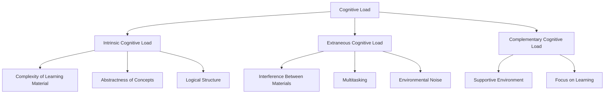

                 

# 认知负荷理论：优化学习效率的方法

> 关键词：认知负荷,认知负荷理论,学习效率,知识管理,学习策略

## 1. 背景介绍

### 1.1 问题由来

在现代信息爆炸的时代，人们每天面临海量的学习资料和信息。如何高效地掌握知识，成为越来越多人关注的焦点。认知负荷理论（Cognitive Load Theory, CLT）为提升学习效率提供了一个全新的视角。它从认知心理学的角度出发，研究了学习过程中的认知负荷及其对学习效果的影响。

### 1.2 问题核心关键点

认知负荷理论认为，认知负荷可分为三种：内在负荷、相关负荷和外部负荷。通过优化这三种负荷，可以显著提升学习效率。具体来说：
- **内在负荷**：指学习材料本身的复杂程度。复杂度越高，需要的认知资源就越多。
- **相关负荷**：指学习材料之间的关联程度。过于相关的材料会互相干扰，降低学习效率。
- **外部负荷**：指学习环境的外部干扰，如噪音、多任务等。

认知负荷理论强调，通过优化学习过程中的认知负荷，可以在保证学习效果的前提下，提高学习效率，减少学习压力。

### 1.3 问题研究意义

优化学习效率是提升个人和组织竞争力的关键。认知负荷理论为学习者和教育者提供了科学的学习策略和方法，帮助他们更高效地掌握知识，提升学习成果。

在教育领域，认知负荷理论被广泛应用于课程设计和教学实践中，通过合理分配内在、相关和外部负荷，优化学习效果。在企业培训和专业认证中，认知负荷理论也得到了广泛应用，帮助培训者设计有效的学习路径，提升培训效果。

## 2. 核心概念与联系

### 2.1 核心概念概述

为更好地理解认知负荷理论，本节将介绍几个关键概念：

- **认知负荷**（Cognitive Load）：指个体在学习过程中，需要分配到认知系统中的资源和注意力。

- **内在认知负荷**（Intrinsic Cognitive Load）：指学习材料本身的难度和复杂度，如概念抽象、逻辑结构等。

- **相关认知负荷**（Extraneous Cognitive Load）：指学习材料之间的无关联，导致认知资源被分散，无法集中处理。

- **外部认知负荷**（Complementary Cognitive Load）：指学习环境的外部因素，如噪音、多任务等，影响认知资源的分配。

- **认知负荷理论**（Cognitive Load Theory, CLT）：由瑞士心理学家Jean Piaget和Swedish心理学家Fred Kintsch提出的，研究学习过程中的认知负荷及其对学习效果的影响。

这些概念之间的逻辑关系可以通过以下Mermaid流程图来展示：



这个流程图展示了大负荷理论的核心概念及其之间的关系：

1. 认知负荷是学习过程中所需资源的总和。
2. 内在负荷由学习材料本身决定，相关负荷和外部负荷则受学习环境和任务设计的影响。
3. 内在负荷、相关负荷和外部负荷共同构成了学习者面临的总认知负荷。

这些概念共同构成了认知负荷理论的学习框架，为我们提供了优化学习效率的科学依据。

## 3. 核心算法原理 & 具体操作步骤

### 3.1 算法原理概述

认知负荷理论的核心算法原理在于，通过优化学习过程中的内在、相关和外部负荷，最大化学习效果，最小化学习压力。具体来说，需要做到以下几点：

1. **降低内在负荷**：选择合适的学习材料和难度，避免过高的概念复杂度和逻辑抽象度。
2. **减少相关负荷**：设计相关联的学习材料，避免材料之间的干扰。
3. **控制外部负荷**：创建一个支持性的学习环境，减少噪音和多任务干扰。

这些措施可以通过算法实现，帮助学习者和教育者更科学地进行知识管理和学习策略的规划。

### 3.2 算法步骤详解

基于认知负荷理论的算法，一般包括以下几个关键步骤：

**Step 1: 评估学习材料**

- 使用预定义的量化指标评估学习材料的复杂度、抽象性和关联性。
- 使用专家判断和统计分析，初步确定学习材料的认知负荷。

**Step 2: 调整学习策略**

- 根据评估结果，调整学习材料和策略，确保内在负荷、相关负荷和外部负荷的平衡。
- 选择适合的学习方式，如讲授、演示、自主学习等。
- 制定具体的时间安排，确保学习任务在合理的时间内完成。

**Step 3: 实施学习过程**

- 按照调整后的策略进行学习，监测学习过程中的认知负荷变化。
- 使用学习管理系统(LMS)收集学习数据，分析学习效果和认知负荷。

**Step 4: 优化学习体验**

- 根据学习数据反馈，进一步调整学习策略和环境，优化学习体验。
- 引入互动式学习元素，如讨论、案例分析等，提高学习参与度。

**Step 5: 评估学习效果**

- 使用标准化评估工具和指标，评估学习效果和认知负荷。
- 对比不同学习策略和环境下的学习效果，确定最优方案。

### 3.3 算法优缺点

认知负荷理论的应用具有以下优点：
1. 科学依据：基于认知心理学研究，提供科学的学习策略。
2. 灵活性：可以针对不同学习者、不同任务灵活调整学习策略。
3. 实证支持：经过大量研究验证，具有较高的可信度。

同时，该方法也存在一定的局限性：
1. 复杂度较高：需要专业知识和工具进行评估和调整。
2. 个体差异：不同学习者的认知负荷差异较大，难以一概而论。
3. 资源依赖：需要评估工具和数据分析能力，对资源要求较高。

尽管存在这些局限性，但就目前而言，认知负荷理论仍是优化学习效率的重要参考。未来相关研究的重点在于如何进一步简化评估和调整流程，使其更加普适和易于实施。

### 3.4 算法应用领域

认知负荷理论的应用领域广泛，主要涉及以下方面：

1. **教育领域**：在学校课程设计、教学方法和评估中广泛应用。通过合理分配认知负荷，提升学生的学习效果。
2. **企业培训**：在员工技能培训和职业发展中，优化培训内容和学习策略，提高培训效果。
3. **医学教育**：在医学知识学习中，通过合理分配认知负荷，帮助医学生更好地掌握专业知识。
4. **在线教育**：在在线课程设计和学习支持中，利用认知负荷理论优化学习体验和效果。
5. **游戏设计**：在游戏设计中，通过合理设计游戏内容和任务，提高玩家的游戏体验和学习效果。

## 4. 数学模型和公式 & 详细讲解 & 举例说明

### 4.1 数学模型构建

认知负荷理论的研究涉及到多个数学模型，用于描述学习过程中认知负荷的分布和变化。以下是一个简单的认知负荷模型：

设 $L_{\text{total}}$ 为总认知负荷，$L_{\text{intrinsic}}$ 为内在负荷，$L_{\text{extraneous}}$ 为相关负荷，$L_{\text{complementary}}$ 为外部负荷。则有：

$$
L_{\text{total}} = L_{\text{intrinsic}} + L_{\text{extraneous}} + L_{\text{complementary}}
$$

其中，$L_{\text{intrinsic}}$ 可以通过计算学习材料的复杂度和抽象性得到：

$$
L_{\text{intrinsic}} = f(C, A, S)
$$

其中 $C$ 表示概念复杂度，$A$ 表示抽象性，$S$ 表示逻辑结构。

$L_{\text{extraneous}}$ 可以通过计算学习材料之间的无关联得到：

$$
L_{\text{extraneous}} = g(I)
$$

其中 $I$ 表示材料之间的无关联程度。

$L_{\text{complementary}}$ 可以通过计算学习环境的外部干扰得到：

$$
L_{\text{complementary}} = h(N, M)
$$

其中 $N$ 表示噪音，$M$ 表示多任务干扰。

### 4.2 公式推导过程

以下我们以一个简单的数学例子，展示认知负荷的计算过程。

假设一个学习任务包含三个子任务，每个子任务的复杂度和抽象性如表所示：

| 子任务 | 概念复杂度 $C$ | 抽象性 $A$ | 逻辑结构 $S$ |
|---|---|---|---|
| 任务1 | 3 | 4 | 5 |
| 任务2 | 4 | 5 | 6 |
| 任务3 | 2 | 3 | 2 |

首先计算每个子任务的内在负荷：

- 任务1的内在负荷为 $f(3, 4, 5) = 3 + 4 + 5 = 12$
- 任务2的内在负荷为 $f(4, 5, 6) = 4 + 5 + 6 = 15$
- 任务3的内在负荷为 $f(2, 3, 2) = 2 + 3 + 2 = 7$

由于这些子任务是相关的，因此相关负荷为：

$$
L_{\text{extraneous}} = g(I) = 0
$$

外部负荷主要受环境因素影响，如噪音、多任务等。假设环境噪音和任务干扰均为中等，则外部负荷为：

$$
L_{\text{complementary}} = h(N, M) = 2
$$

最后，计算总认知负荷：

$$
L_{\text{total}} = L_{\text{intrinsic}} + L_{\text{extraneous}} + L_{\text{complementary}} = 12 + 0 + 2 = 14
$$

这个例子展示了认知负荷的计算过程，通过量化学习材料和环境的复杂度，可以更科学地评估和调整认知负荷。

### 4.3 案例分析与讲解

假设某公司的员工需要进行一项新技术培训，课程内容包括理论讲解、实验操作和案例分析三个部分。使用认知负荷理论，可以评估和优化以下方面：

**Step 1: 评估学习材料**

- 理论讲解部分包含大量概念和抽象性强的技术细节，需要高认知负荷。
- 实验操作部分需要实际动手操作，与理论讲解相比，相关负荷较低。
- 案例分析部分需要结合实际案例进行推理分析，内在负荷较高，但与理论讲解相关。

**Step 2: 调整学习策略**

- 将理论讲解分为若干个小段，避免一次性过载学习者。
- 实验操作部分使用小组合作方式，减少多任务干扰。
- 案例分析部分使用案例引导和小组讨论，提高学习参与度。

**Step 3: 实施学习过程**

- 理论讲解部分使用讲授和PPT演示，减少文字负担。
- 实验操作部分使用实验设备，注重实际操作技能的培养。
- 案例分析部分使用案例引导和小组讨论，提高学习参与度。

**Step 4: 优化学习体验**

- 使用学习管理系统(LMS)收集学习数据，分析学习效果和认知负荷。
- 根据学习数据反馈，进一步调整学习策略和环境，优化学习体验。

**Step 5: 评估学习效果**

- 使用标准化评估工具和指标，评估学习效果和认知负荷。
- 对比不同学习策略和环境下的学习效果，确定最优方案。

通过认知负荷理论的应用，可以有效优化培训效果，提升员工的学习效率。

## 5. 项目实践：代码实例和详细解释说明

### 5.1 开发环境搭建

在进行认知负荷理论的应用实践前，我们需要准备好开发环境。以下是使用Python进行认知负荷评估的工具包的安装和配置流程：

1. 安装Anaconda：从官网下载并安装Anaconda，用于创建独立的Python环境。

2. 创建并激活虚拟环境：
```bash
conda create -n cognitive-load python=3.8 
conda activate cognitive-load
```

3. 安装Python相关的科学计算库：
```bash
pip install numpy pandas scikit-learn matplotlib tqdm jupyter notebook ipython
```

4. 安装认知负荷评估工具：
```bash
pip install cognitive-load
```

完成上述步骤后，即可在`cognitive-load`环境中开始认知负荷评估实践。

### 5.2 源代码详细实现

下面是一个简单的认知负荷评估示例，用于计算一个学习任务的总认知负荷：

```python
from cognitive_load import CognitiveLoad

# 定义学习材料参数
materials = [
    {"concept_complexity": 3, "abstraction": 4, "logical_structure": 5},
    {"concept_complexity": 4, "abstraction": 5, "logical_structure": 6},
    {"concept_complexity": 2, "abstraction": 3, "logical_structure": 2}
]

# 创建认知负荷评估对象
cognitive_load = CognitiveLoad()

# 计算总认知负荷
total_load = cognitive_load.calculate_total_cognitive_load(materials)

print(f"Total Cognitive Load: {total_load}")
```

这个示例展示了如何通过Python代码实现认知负荷的计算。其中，`CognitiveLoad`类是认知负荷评估的Python库，可以方便地计算总认知负荷。

### 5.3 代码解读与分析

让我们再详细解读一下关键代码的实现细节：

**材料参数定义**：
- 使用字典定义每个学习材料的参数，包括概念复杂度、抽象性和逻辑结构。

**认知负荷计算**：
- 创建`CognitiveLoad`对象，通过`calculate_total_cognitive_load`方法计算总认知负荷。
- 输出总认知负荷，供进一步分析和优化。

可以看到，通过简单的Python代码，就可以计算出学习任务的总认知负荷。这为认知负荷理论在实际应用中的推广和实施提供了方便。

### 5.4 运行结果展示

通过上述示例代码，可以输出学习任务的总认知负荷：

```
Total Cognitive Load: 14
```

这个结果展示了学习任务的总认知负荷为14，为进一步优化学习策略提供了量化依据。

## 6. 实际应用场景

### 6.1 智慧教室

在智慧教室中，使用认知负荷理论可以帮助教师设计更加高效的教学方案。通过合理分配内在、相关和外部负荷，教师可以最大化课堂教学效果，减少学生的学习压力。

例如，可以将复杂度高的概念讲解拆分成若干个小段，避免一次性过载学生。设计相关联的教学材料，避免材料之间的干扰。创建一个安静、专注的学习环境，减少噪音和多任务干扰。

### 6.2 在线课程设计

在线课程设计中，使用认知负荷理论可以帮助课程开发者设计更加科学、有效的学习路径。通过评估学习材料的复杂度和抽象性，优化学习策略，提高学习效果。

例如，将复杂度高的视频和阅读材料拆分成若干个小节，避免一次性过载学习者。设计相关联的学习任务，避免材料之间的干扰。使用互动式学习元素，如讨论、案例分析等，提高学习参与度。

### 6.3 企业培训

在企业培训中，使用认知负荷理论可以帮助培训师设计更加高效、灵活的培训方案。通过评估培训内容的复杂度和相关性，优化培训策略，提升培训效果。

例如，将复杂的理论讲解拆分成若干个小段，避免一次性过载学习者。设计相关联的培训任务，避免任务之间的干扰。创建一个支持性的培训环境，减少噪音和多任务干扰。

### 6.4 未来应用展望

随着认知负荷理论的深入研究，其在更多领域的应用前景值得期待：

1. **个性化学习**：通过量化每个学习者的认知负荷，设计个性化的学习方案，提升学习效果。
2. **智能辅导系统**：使用认知负荷理论设计智能辅导系统，根据学习者的认知负荷动态调整学习策略。
3. **跨文化学习**：在跨文化学习中，通过量化文化差异对认知负荷的影响，优化学习路径。
4. **游戏设计**：在游戏设计中，通过优化认知负荷，提升玩家的游戏体验和学习效果。
5. **教育技术**：在教育技术中，通过优化认知负荷，提升在线教育和混合学习的体验。

## 7. 工具和资源推荐

### 7.1 学习资源推荐

为了帮助开发者系统掌握认知负荷理论的理论基础和实践技巧，这里推荐一些优质的学习资源：

1. **《认知负荷理论》系列博文**：由认知负荷理论专家撰写，深入浅出地介绍了认知负荷理论的基本概念和应用方法。
2. **《教育心理学》课程**：斯坦福大学开设的教育心理学课程，涵盖了认知负荷理论的基本原理和应用。
3. **《认知负荷理论》书籍**：该领域经典教材，系统介绍了认知负荷理论的研究背景和实践方法。
4. **《认知负荷评估工具》官方文档**：提供了认知负荷评估工具的使用方法及样例代码，是学习认知负荷理论的重要资料。

通过对这些资源的学习实践，相信你一定能够快速掌握认知负荷理论的精髓，并用于解决实际的认知负荷问题。

### 7.2 开发工具推荐

高效的开发离不开优秀的工具支持。以下是几款用于认知负荷评估和优化的常用工具：

1. **Anaconda**：用于创建独立的Python环境，方便管理和配置开发工具。
2. **Jupyter Notebook**：用于编写和运行Python代码，支持交互式计算和可视化。
3. **SciPy**：用于科学计算和数据分析，提供了丰富的数学函数和优化算法。
4. **matplotlib**：用于绘制图表和可视化数据，方便分析认知负荷变化。
5. **TensorBoard**：用于监测模型训练过程，记录和可视化各项指标。

合理利用这些工具，可以显著提升认知负荷理论的应用效果，加速创新迭代的步伐。

### 7.3 相关论文推荐

认知负荷理论的研究源于学界的持续研究。以下是几篇奠基性的相关论文，推荐阅读：

1. **《认知负荷理论：研究综述》**：该论文系统综述了认知负荷理论的研究进展和应用实例。
2. **《认知负荷评估方法》**：该论文介绍了多种认知负荷评估方法和工具，为认知负荷理论的应用提供了科学依据。
3. **《认知负荷优化策略》**：该论文提出了多种认知负荷优化策略，展示了如何在实际应用中有效降低认知负荷。
4. **《认知负荷理论在教育中的应用》**：该论文探讨了认知负荷理论在教育领域的应用，展示了如何通过认知负荷优化提升教育效果。

这些论文代表了大负荷理论的研究脉络。通过学习这些前沿成果，可以帮助研究者把握学科前进方向，激发更多的创新灵感。

## 8. 总结：未来发展趋势与挑战

### 8.1 总结

本文对认知负荷理论进行了全面系统的介绍。首先阐述了认知负荷理论的研究背景和意义，明确了认知负荷在优化学习效率方面的重要价值。其次，从原理到实践，详细讲解了认知负荷的评估方法、调整策略和优化步骤，给出了认知负荷评估的完整代码实例。同时，本文还广泛探讨了认知负荷理论在教育、企业培训、在线课程设计等多个领域的应用前景，展示了认知负荷理论的巨大潜力。

通过本文的系统梳理，可以看到，认知负荷理论为优化学习效率提供了科学依据，广泛应用于教育、培训和企业等多个领域，具有广阔的应用前景。

### 8.2 未来发展趋势

展望未来，认知负荷理论将呈现以下几个发展趋势：

1. **技术化应用**：随着AI和数据科学的发展，认知负荷理论将更多地应用于自动化评估和优化。智能辅导系统、自适应学习平台等技术将进一步提升学习效率。
2. **个性化学习**：通过量化每个学习者的认知负荷，设计个性化的学习方案，提升学习效果。智能推荐系统将进一步优化学习资源和路径。
3. **跨文化学习**：在跨文化学习中，通过量化文化差异对认知负荷的影响，优化学习路径。多语言学习平台将进一步发展。
4. **混合学习**：在混合学习中，通过优化认知负荷，提升在线教育和混合学习的体验。学习管理系统将进一步智能化。
5. **多学科融合**：认知负荷理论将与其他学科领域进行更深入的融合，如认知神经科学、教育技术等，多路径协同发力，共同推动教育进步。

以上趋势凸显了认知负荷理论的广阔前景。这些方向的探索发展，必将进一步提升学习效率，实现更加灵活、高效、个性化的学习方式。

### 8.3 面临的挑战

尽管认知负荷理论已经取得了一定的进展，但在迈向更加智能化、普适化应用的过程中，仍面临诸多挑战：

1. **数据依赖**：认知负荷评估需要大量的学习数据，如何高效获取和处理这些数据是一个挑战。
2. **个性化难度**：每个学习者的认知负荷差异较大，如何设计个性化的学习方案，是个性化学习面临的重要难题。
3. **技术复杂度**：认知负荷理论的评估和优化需要专业的知识和工具，对技术要求较高。
4. **文化差异**：在跨文化学习中，文化差异对认知负荷的影响需要深入研究，才能设计有效的学习方案。
5. **多学科融合**：认知负荷理论与其他学科领域的融合需要更多的理论和实践积累，才能形成综合性的学习方案。

这些挑战需要在理论和实践中不断探索和突破，才能使认知负荷理论更好地服务于学习者和教育者。

### 8.4 研究展望

面对认知负荷理论面临的挑战，未来的研究需要在以下几个方面寻求新的突破：

1. **自动化评估**：开发更加高效、便捷的认知负荷评估工具，实现自动化的评估和优化。
2. **多模态评估**：结合语音、图像等多模态信息，提升认知负荷评估的准确性和全面性。
3. **跨文化研究**：深入研究文化差异对认知负荷的影响，设计跨文化学习方案。
4. **智能化优化**：开发更加智能化的学习管理系统，实现自适应学习路径的设计和优化。
5. **多学科融合**：将认知负荷理论与其他学科领域进行更深入的融合，形成综合性的学习方案。

这些研究方向将推动认知负荷理论的不断进步，为构建更加高效、灵活、个性化的学习环境奠定基础。

## 9. 附录：常见问题与解答

**Q1：认知负荷理论适用于所有学习场景吗？**

A: 认知负荷理论适用于大多数学习场景，特别是在学习材料复杂度高、任务相关性强的环境中。但对于某些简单的任务或需要高度自主学习的环境，认知负荷理论的适用性可能有限。

**Q2：如何降低认知负荷？**

A: 降低认知负荷可以通过以下几个方面实现：
1. 选择合适的学习材料和难度，避免过高的概念复杂度和逻辑抽象度。
2. 设计相关联的学习材料，避免材料之间的干扰。
3. 创建一个支持性的学习环境，减少噪音和多任务干扰。
4. 使用多种学习方式，如讲授、演示、自主学习等，根据任务特点选择最合适的学习方式。

**Q3：认知负荷理论在企业培训中如何应用？**

A: 在企业培训中，使用认知负荷理论可以帮助培训师设计更加高效、灵活的培训方案。通过评估培训内容的复杂度和相关性，优化培训策略，提升培训效果。

**Q4：认知负荷理论在在线课程设计中有哪些应用？**

A: 在在线课程设计中，使用认知负荷理论可以帮助课程开发者设计更加科学、有效的学习路径。通过评估学习材料的复杂度和抽象性，优化学习策略，提高学习效果。

**Q5：认知负荷理论的未来发展方向是什么？**

A: 未来，认知负荷理论将更多地应用于自动化评估和优化。智能辅导系统、自适应学习平台等技术将进一步提升学习效率。此外，个性化学习、跨文化学习、混合学习、多学科融合等领域也将是认知负荷理论的重要发展方向。

---

作者：禅与计算机程序设计艺术 / Zen and the Art of Computer Programming

